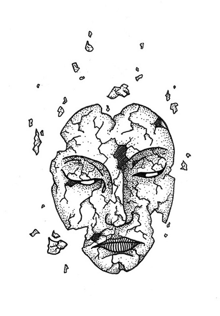
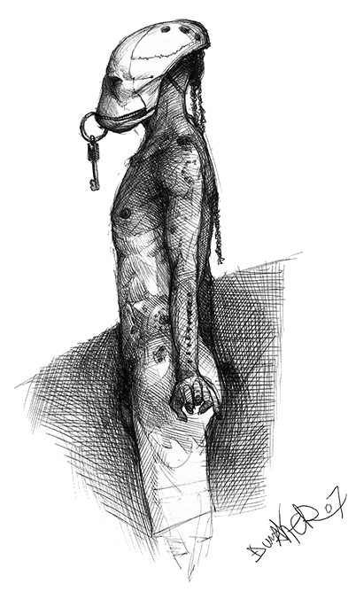
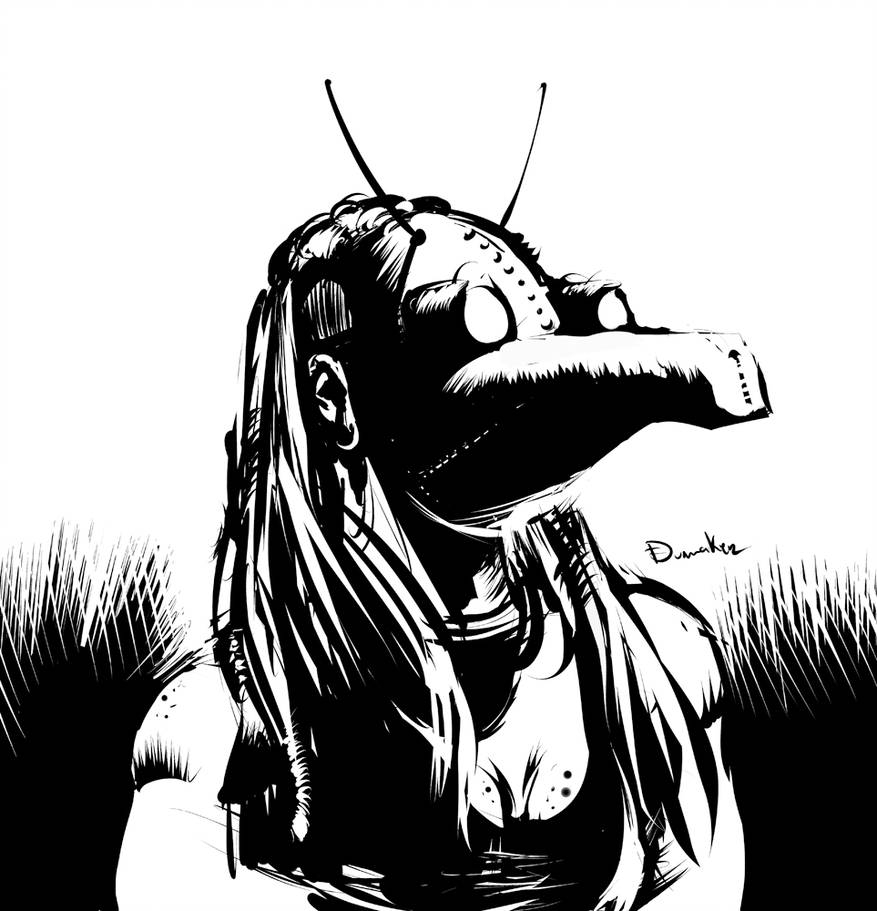
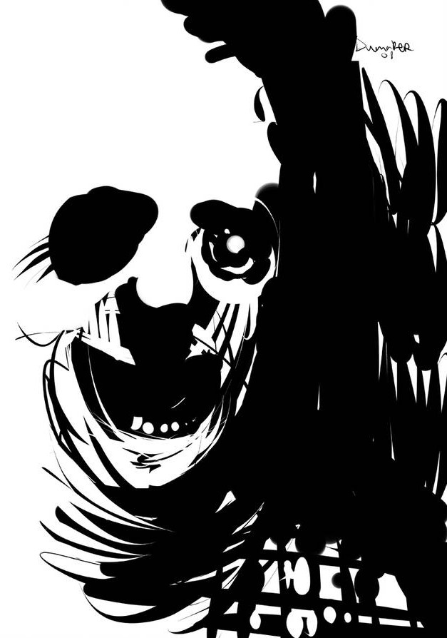
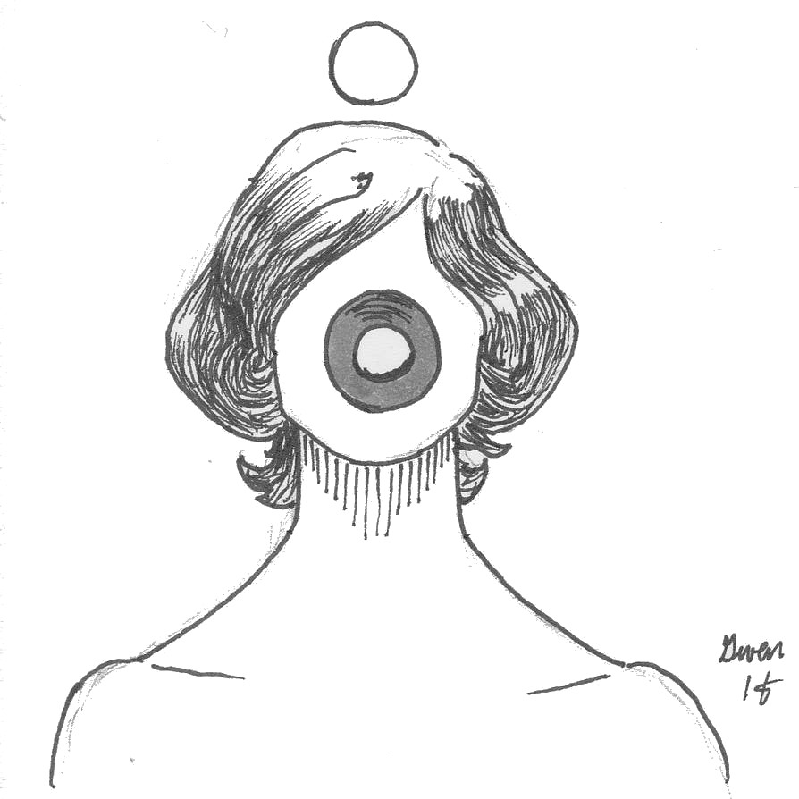
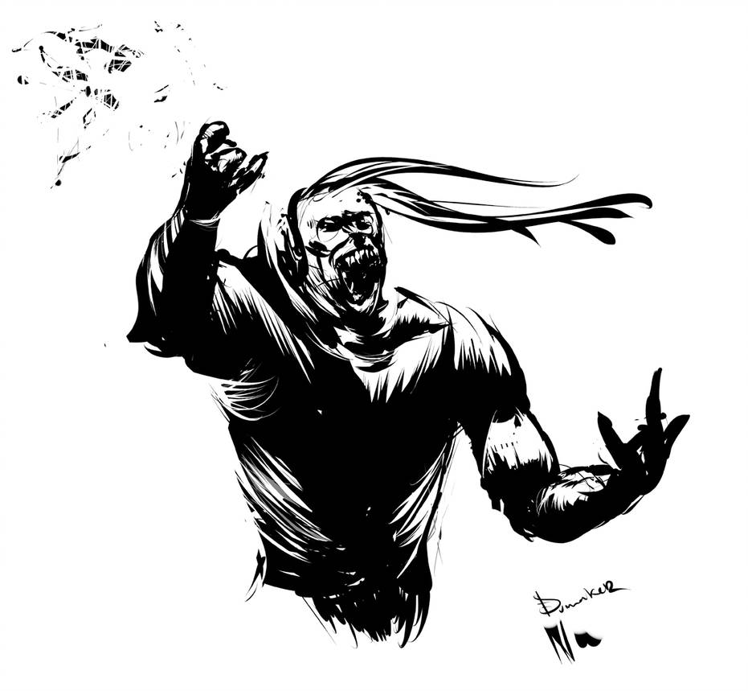
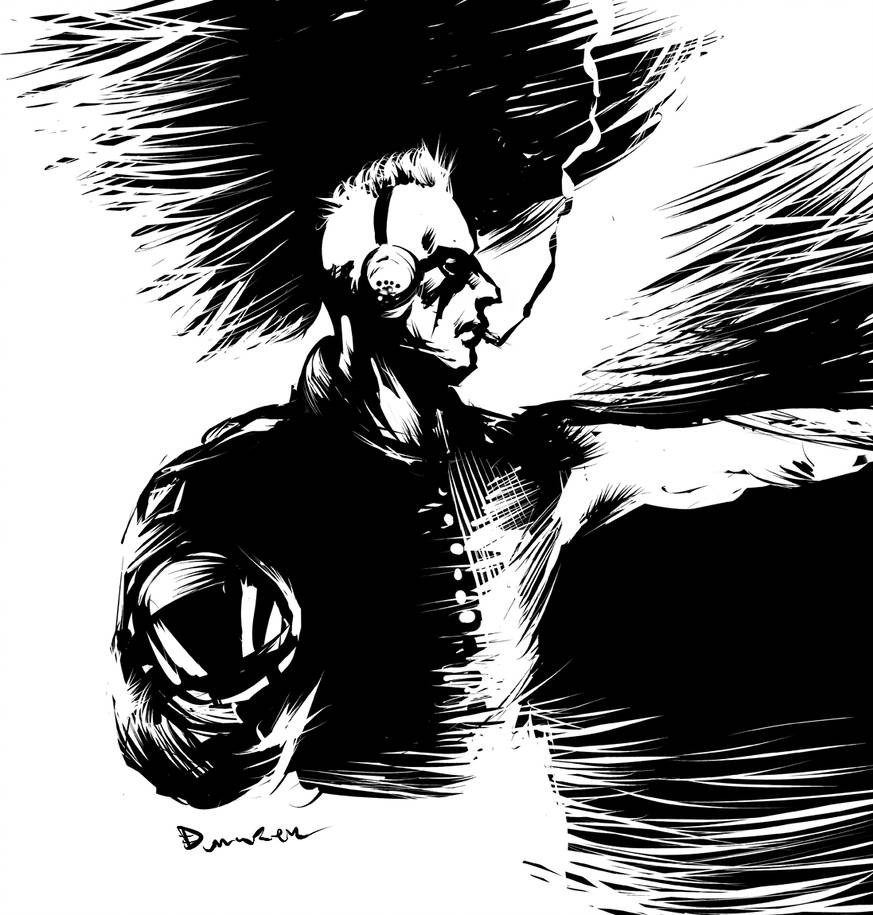
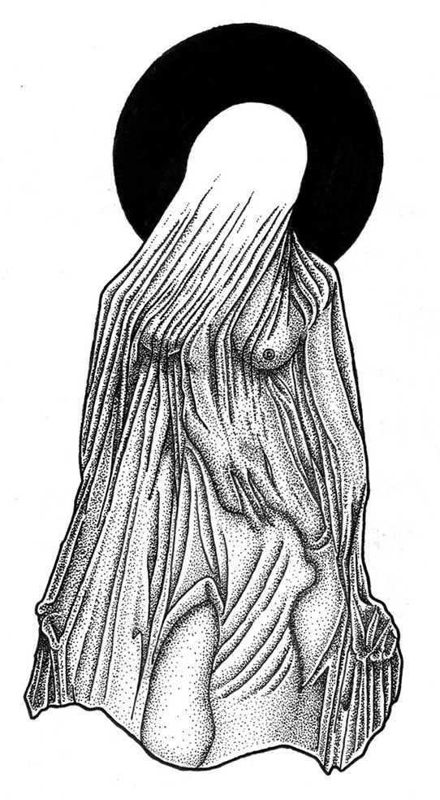

# 2200: le jugement des dieux
_Il y a quelques instants encore, vous étiez vivant.
Maitenant vous êtes assis dans une petite salle d'attente.
Le Purgatoire, d'après l'inscription que vous distinguez à l'envers sur la porte vitrée.
Vous attendez impatiement que le petit homme avec la veste grise de l'accueil
vous fasse signe d'entrer dans la pièce à côté.
Là où se jouera votre après-vie._

Un jeu de rôle sans meneur pour 4 joueurs par Lucas Cimon.
Il nécessite deux dés à 8 faces et quelques pions quelconques, par exemple des billes d'aquarium,
et optionnellement un sablier.

:::: bicolumned

## Synopsis
Vous allez chacun jouer un dieu, ancien ou moderne,
ayant la charge de statuer du sort des mortels décédés en cette année 2200.
Peut-être est-ce votre rôle depuis toujours ?
Peut-être les dieux de la mort changent-ils avec les siècles ?
Quoi qu'il en soit, vous avez vos propres critères pour juger des actions des hommes,
de leur karma et de la valeur de leur âme.

Durant la prtie, tour à tour, vous allez mettre de côté votre rôle divin pour incarner un Mortel
dont les actions seront passées au crible par un panel de 3 dieux.
Sa vie s'est déroulé au XXIIe siècle, dans le futur de notre monde actuel,
devenu légèrement cyberpunk et dystopique.

## Dieux et deesses
Tirez au hasard quel est votre **domaine**, et quelle **ligne de conduite** vous jugez.
Si l'un de vos résultats a déjà été obtenus par un autre joueur,
choisissez ce qu'il vous plait. N'hésitez pas non plus à adopter un choix
n'apparaisant pas dans ces listes.

**Domaine divin**
1. L'argent et le pouvoir
2. La volonté et le succès
3. Les animaux et les plantes
4. La connaissance et la technologie
5. Les arts
6. La guerre
7. La justice et l'équité
8. L'amour et le sexe

**Ligne de conduite**
1. L'éthique
2. Les relations humaines
3. Ce qui a été produit
4. La fidélité et les promesses
5. La bravoure
6. La renomée acquise
7. Ce qui a inspiré ou fait rêver
8. La politesse et les bonnes manières

Choisissez-vous ensuite un nom. N'hésitez pas à prendre celui d'un dieu connu,
ou de choisir d'être simplement nommé par le titre de « dieu de votre domaine ».
Décrivez enfin chacun votre apparence aux autres joueurs.
Vous pouvez mentionner si vous êtes vénéré quelque part et/ou quels pouvoirs vous sont attribués.

N'oubliez pas votre stature de dieu durant toute la cérémonie du jugement :
vous êtes au-dessus des mortels et ils doivent s'adresser avec déférance envers vous.

## Le tribunal

Lancez chacun un dé, et départagez les égalités.
Du résultat le plus petit au plus élevé, répondez chacun à l'une de ces questions en détails :

1. Depuis le tribunal on peut admirer une vue aérienne d'une ville contemporaine.
Comment se nomme cette ville ?
Décrivez-la en esquissant rapidement quelques lieux ou quartiers notoires.

2. Depuis le tribunal toujours, on peut entrevoir la « destination heureuse ».
Qu'est-ce qui s'en dégage qui attire autant les mortels ?
Décrivez ce petit aperçu de Paradis.

3. On discerne également « l'autre lieu », celui de la punition et du châtiment.
Quel pièce ou lieu peut-on distinguer ? Est-ce désert ?
Décrivez ce petit aperçu d'Enfer.

4. Enfin, à quoi ressemble la salle du jugement ?
S'agit-il d'un lieu banal ? Ou bien un palace ?
Décrivez où se tiennent les dieux et le Mortel,
et comment il est possible d'apercevoir les lieux précédement décrits :
à travers un fenêtre, l'entrebaillement d'une porte, via un vieil écran cathodique, ou autrement ?

Cet ordre de réponse aux questions déterminera également l'ordre de passage en jugement des joueurs.

Ce tribunal a un employé permanent : le Passeur,
qui accueille les mortels dans le Purgatoire,
puis les amène au tribunal et à leur destination finale.

## Le Mortel
Ne créez votre Mortel que lorsque c'est votre tour d'être jugé.
Pendant que vous le décrivez, les dieux peuvent préparer votre nécrologie.

::: tricolumned
**Prénom**
1. Enki
2. Alcide
3. Jill
4. Channon
5. John
6. Rose
7. Julien
8. Oona

**Nom**
1. Bilal
2. Nikopol
3. Bioskop
4. Yarrow
5. Difool
6. Walker
7. Solédango
8. Sarango

**Réputation**
1. Manipulateur
2. Violent
3. Amoral
4. Opportuniste
5. Dépravé
6. Fachiste
7. Nihiliste
8. Tamagochiste
:::

**Milieu d'origine**
1. Ouvrier dans l'industrie métalurgique ou les mines
2. Bourgeoisie aisée des plus hauts gratte ciels
3. Ghetto de cité flottante
4. Hippie protecteur des dernières forêts
5. Religieux boudhiste ou hindou
6. Marin passeur de réfugiés climatiques
7. Station spatiale
8. Androïde ou transhumain

**Domaine d'activité**
1. Élu parlementaire
2. Homme de main d'une mafia
3. Scientifique bani
4. Astronaute
5. Inspecteur de police
6. Journaliste
7. Militant subversif
8. Prêtre d'un dieu oublié

## Le jugement
Le joueur à la gauche du Mortel interprête le Passeur quelques instants.
Il invite le Mortel à le suivre dans le tribunal, où il lui énonce les titres des dieux qui y siègent,
en mentionnant leurs **domaines** et **lignes de conduite**, puis l'introduit à l'assemblée.

Si vous disposez d'un sablier, mettez-le à la disposition des dieux :
dès que l'un d'eux estime que le Mortel arrive au terme de son temps de parole,
il peut renverser le sablier devant lui, puis l'interrompre lorsqu'il sera écoulé.

### La necrologie

En commençant à gauche du Mortel, chaque dieu résume brièvement un pan de sa vie :
- sa naissance et son enfance
- 2-3 faits marquants de sa vie
- les circonstances de sa mort

### Le plaidoyer
Le dieu en face du Mortel lui explique ce qui va se jouer ici,
et l'invite à s'exprimer, à leur exposer pourquoi il mérite une après-vie heureuse.

Le Mortel a 5min pour parler librement.
Il peut mentionner tout ce qu'il souhaite de sa vie passée.

### Les fautes
En commençant à gauche du Mortel, chaque dieu expose un événement
où ses actions (ou son inaction) ont eu de graves conséquences.
A-t-il été témoin / victime / commis un crime ?
Quel choix a-t-il fait ?

Vous pouvez vous inspirer des événements de la table ci-dessous :

1.  le scandale des effets secondaires du Solivox de 2186
2.  les vagues de délation et d'expulsion pour crime de solidarité de 2191
3.  les 10 jours de black-out électronique de mai 2188
4.  la « dernière marée noire » de 2179
5.  l'épidémie de narcolepsie de 2176
6.  l'affaire du tueur en série virtuel de 2194
7.  le coup d'état corporatiste de 2183
8.  l'affaire du serial killer des mondes virtuels de 2194
9.  les psychotropes de synthèse procurant des capacités de précognition
10. la révolte des androïdes mineurs de métaux rares de 2196
11. la lutte pour les droits civiques des clones de 2192
12. la seconde guerre froide du milieu du XXIIe siècle
13. l'arrivée de réfugiés aliens en 2199

Pour tirez un événement au hasard dans cette table,
lancez un d8 et reportez le résultat dedans,
en sautant par-dessus ceux déjà utilisés dans la partie.

En tant que dieu omniscient, décrivez le comportement du Mortel dont vous avez été témoin,
et en quoi il vous paraît condamnable.

### Le requisitoire
Le Mortel a 5-10min pour se défendre des trois mise en accusation divines.

Son but est de convaincre ses juges que dans l'ensemble il a vécu sa vie
dans l'alignement des valeurs des dieux.
Il peut enjoliver les événements qu'il a vécu tant qu'il le souhaite,
mais attention à ne pas mentir car les dieux sont omniscients et n'hésiteront pas
à la punir pour une telle offense.

### Le conciliabule
Les dieux décident de leur verdict en considérant les actions du Mortel
vis à vis de leur domaine et de la ligne de conduite qui leur est chère.
Ils prennent l'ensemble des faits évoqués en considération :
si la réponse du Mortel aux accusations des autres dieux plait à un dieu,
libre a lui de le sauver.

Chaque dieu est souverain pour déterminer quelles actions il estime mériter châtiment
vis à vis de son domaine, tant qu'il reste constant entre les jugements.
Un dieu de l'argent peut tout à fait considérer qu'il s'agit d'une force corruptrice
et que les plus nobles des Mortels sont ceux qui y résistent.

Les dieux peuvent échanger brièvement entre eux leurs points de vue,
voir défendre un Mortel qu'ils apprécient face aux autres divinités.

Une fois leur décision prise, ils passent au vote : ils prennent chacun un des jetons au centre de la table.
Ils le placent ensuite secrètement dans leur main **droite** pour sauver l'âme du Mortel,
et dans la **gauche** sinon.

### La prise a partie

Une fois la décision des dieux prise,
le Mortel peut réclamer à un dieu en particulier d'accomplir un défi de son choix pour prouver sa valeur,
ou bien lui demander de consulter l'audience du tribunal,
ou encore d'écouter le témoignage d'un Mortel qu'il a aidé ou sauvé.

Le dieu pris à partie est libre de refuser.
S'il accepte, à lui d'énoncer les termes du challenge.

Une fois celui-ci établit, chacun des deux autres dieux choisit un chiffre distinct entre 1 et 8.
Puis le Mortel à son tour choisit 3 chiffres distincts et différents de ceux des dieux.
Les 3 chiffres restant seront ceux du dieu pris à partie.

Le joueur incarnant le Mortel décrit alors comment il s'y prend pour relever le challenge.

Il lance ensuite un dé :
- s'il obtient un des chiffres qu'il s'est choisi, c'est une **réussite** !
Il « achète » le vote du dieu défié, qui met son jeton dans sa main droite.
- sinon, le dieu correspondant au chiffre obtenu a alors le choix de changer son vote s'il le souhaite.
De plus, si le vote final est négatif, ce dieu pourra imposera un châtiment supplémentaire
au Mortel, un suplice sisyphéen de son goût.

### La sentence
Les dieux révèlent simultanément leur main droite.
Si au moins 2 jetons sont révélés, l'âme du Mortel est sauvée.

## License et sources

Ce jeu est sous license [CC BY 4.0](http://creativecommons.org/licenses/by/4.0/).

Si vous le testez, songez à me laisser un petit commentaire sur <https://chezsoi.org/lucas/blog>

<u>Polices :</u> [HACKED](https://hackedfont.com) par David Libeau.

<u>Illustrations :</u>
- deux dessins d'[Elliot Jolivet aka Tenseï réalisés lors d'Inktober 2017](https://www.behance.net/gallery/58695271/InkTober-2017)
- [untitled by auto-spiral](https://www.deviantart.com/auto-spiral/art/untitled-745135444) - [CC BY-NC-SA 3.0](http://creativecommons.org/licenses/by-nc-sa/3.0/)
- [donde deje la llave](https://www.deviantart.com/dumaker/art/donde-deje-la-llave-63000642),
[The gulls cyberpunk](https://www.deviantart.com/dumaker/art/The-gulls-cyberpunk-102688214),
[Halloween Series 3](https://www.deviantart.com/dumaker/art/Halloween-Series-3-102117438),
[Furia](https://www.deviantart.com/dumaker/art/Furia-102571605),
& [Cyberpunk The Others](https://www.deviantart.com/dumaker/art/Cyberpunk-The-Others-102745716)
de [Dumaker](https://www.deviantart.com/dumaker)
<!--  - [CC BY-NC-SA 3.0](http://creativecommons.org/licenses/by-nc-sa/3.0/) -->

<u>Inspirations :</u> beaucoup de BDs (que vous pouvez vous amuser à retrouver à partir de la table de noms de Mortel)
ainsi que les jeux de rôle Urban Armies et Le Dernier Café Sur la Droite.

::::

