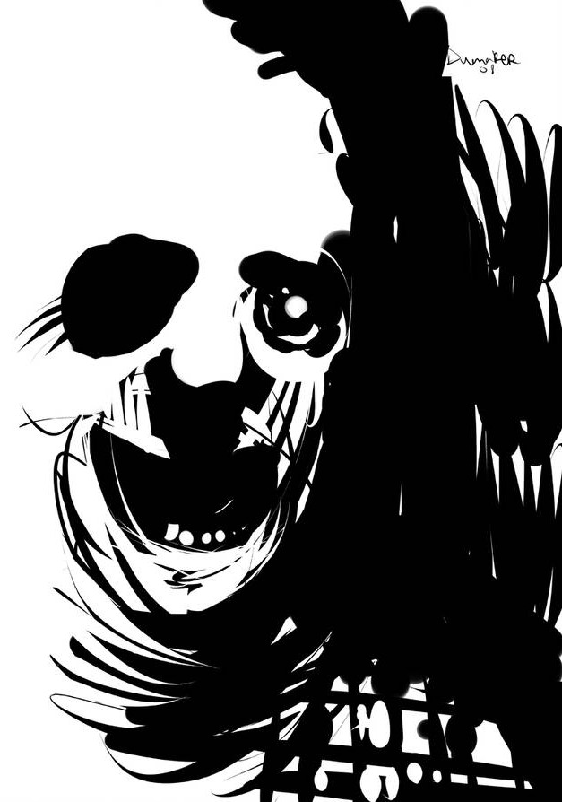

# 2200: the gods judgement
_A few moments ago, you were still alive.
Now you seat still, on a metal chair, in a small waiting room.
"Purgatory" is written in large black letters on the door in front of you.
You stare at the pale man in gray at the reception desk, waiting for a sign from him to enter the room behind.
Where your afterlife will be played out._

A narrative role-playing game for 3 to 4 players, requiring no game master nor preparation.
Few rolls will be made but you will need two 8-sided dice (d8), three tokens, and optionally a timer.

::: web-only
- [PDF version (1 Mo)](https://chezsoi.org/lucas/blog/images/jdr/2200-the-gods-judgement-v1.1.pdf)
- [itch.io page](https://lucas-c.itch.io/2200-le-jugement-des-dieux)
:::

:::: bicolumned

## Synopsis
Each of you will play a God, ancient or modern, in charge of deciding the fate of mortals who died in this year 2200. Perhaps this has always been your role? Perhaps this duty is passed from god to god over time ? Either way, you each have your own criteria for judging mortals's actions, their karma, and the value of their souls. And YOU will decide if they go to Hell or to Heaven.

In turn, you will put aside your divine role to play as a Mortal whose actions will be scrutinized by a panel of gods. Your life was spent in the twenty-second century, in the future of our current world, which has become somewhat cyberpunk and dystopian.

**Golden rule - _« yes and... »_** :
in this game, as in improv theater, whether you play a Mortal or a God, never question another player's word. You can bounce back, complete, embellish, qualify the facts, but once stated they have the value of truth. If you need a diegetic reason, consider that the courthouse prevent all lies.

## Gods and goddesses
Randomly select your **divine domain**:
roll two dice and choose the outcome you prefer.
Do not hesitate to adopt a domain not appearing in this list.

**Domaine divin**
1. Money
2. Productivity
3. Animals & plants
4. Knowledge & technology
5. Loyalty and promises
6. War
7. Bravery
8. What inspires or make dream

Make it your own.
You can choose a specialty, or even decide that you are a dual deity that cover several domains.

Then take the time to reflect on the following questions, and describe the answers to the other players :

- what is **your name**?
Invent it or pick a known deity name.

- what is **your appearance**?

- are you **worshiped somewhere** in the world today?

- what are your **iconic powers**?

- what behavior of Mortals **do you condemn and reward**?
The God of Money could perfectly well consider currency to be a corrupting force and that the noblest of Mortals are those who resist it.
Be very clear with other players about your values
and what course of action you hold in esteem.

## The courthouse

Each roll a dice. Re-roll in case of ties.
From the smallest to the highest result, each player answer one of these questions in detail:

1. From the court you can admire an aerial view of a contemporary city.
What is this city called?
Describe it by quickly sketching out some notorious places or neighborhoods.

2. Always from the courthouse, one can catch sight of Paradise.
What makes it so appealing to mortals?
Describe this little glimpse of Paradise.

3. We also discern the entrance to Hell.
What room or place can we distinguish? Is it desert?
Describe this little glimpse of Hell.

4. Finally, what does the judgment room look like?
Is this a trivial place? Or a palace?
Describe where the Gods and the Mortal stand,
and how it is possible to see the places previously described:
through windows, half-open doors, old cathode-ray screens... ?

With 3 players, everyone takes part in this last description.

This order of response to questions also determines the order in which Mortals will be judged.

This tribunal has a permanent employee: the Psychopomp,
who welcomes mortals in Purgatory,
then brings them to court and to their final destination.

## The Mortal
Only create your Mortal when it is your turn to be judged.
Roll a d8 in every table below to quickly establish some defining traits.
Feel free to re-roll or choose traits outside the tables.
The other players, the Gods, take notes and can start to prepare the Obituary.

::: tricolumned
**Prénom**
1. Enki
2. Alcide
3. Jill
4. Channon
5. John
6. Rose
7. Julien
8. Oona

**Nom**
1. Bilal
2. Nikopol
3. Bioskop
4. Yarrow
5. Difool
6. Walker
7. Solédango
8. Sarango

**Reputation**
1. Manipulative
2. Violent
3. Amoral
4. Opportunist
5. Depraved
6. Fascist
7. Nihilist
8. Zealot
:::

**Initial background**
1. Worker in the metallurgical industry or mining
2. Wealthy bourgeoisie of the highest skyscrapers
3. Floating city ghetto
4. Hippie protector of the last forests
5. Buddhist or Hindu religious
6. Sailor ferryman of climate refugees
7. Space station
8. Android or transhuman

**Field of activity**
1. Controversial elected parliamentarian
2. Henchman of a mafia
3. Banned scientist
4. Astronaut turned homeless
5. Police inspector or informant
6. Dauntless journalist
7. Subversive activist
8. Priest of a forgotten god

## The jugement
The player to the Mortal's left assumes the role of the Psychopomp for a few instants.
He invites the Mortal into the tribunal, where he introduces the Gods who sit there and their titles.
He then introduces the Mortal to the assembly. Each player can play the Psychopomp differently: formal, supportive, snob, wise, unexpected...

The God usually personified by the player embodying the Mortal is of course absent.

If you have a timer, make it available to the gods:
they will see that the Mortal does not exceed their speaking time,
interrupting if necessary.

### The obituary

Starting from the left of the Mortal, each God briefly sums up a part of their life, in a detached and factual manner, among:
- their birth and childhood
- a notable event in their existence
- the circumstances of their death

You can take inspiration from the table below:

1.  the 2186 Solivox side effects scandal
2.  the massive denunciations and expulsions for crime of solidarity in 2191
3.  the 10 days of electronic blackout of May 2188
4.  the "last oil spill" of 2179
5.  the narcolepsy epidemic of 2176
6.  the case of the virtual serial killer of 2194
7.  the corporatist coup d'etat of 2183
8.  the case of the virtual worlds serial killer of 2194
9.  synthetic psychotropic drugs providing precognition capacities
10. the rare metal miner androids revolt of 2196
11. the clone civil rights struggle of 2192
12. the second cold war in the middle of the XXII century
13. the arrival of alien refugees in 2199

To draw an event at random from this table, roll a d8 and put the result in,
skipping over those already used during the session.

If the life of the Mortal had value in the eyes of certain Gods, they may have used their mystical influence, their powers, to influence their existence.
If this is the case, each God is free to mention it at this stage, when describing a biographical element.

### The plea
The god in front of the Mortal explains what will play out here,
and invites them to express themselves, to explain why they deserve a happy afterlife.

The Mortal has 5 minutes to speak freely.
He can mention anything he wants from his past life,
including new elements made up by the player.

### The indictment
Starting from the left of Mortal, each God exposes an event
where the latter's actions (or inaction) went against their divine line of conduct.

These can be completely mundane situations that the Mortal did not expect to be judged on,
but do not hesitate to choose serious events, having had maybe even a major impact on society.

If Gods are charitable, they can just expose a situation where the stakes were high,
without explaining the Mortal's actions, and let them describe what happened.

The Mortal should be allowed to answer every divine accusation, in order to defend themselves.

**As an all-knowing God, your goal** is to chastise Mortals
who have strayed from the right path according to your values,
and reward those who, on the contrary, have respected your moral code.
You can even decide to recruit some of them to work for you!

Describe the Mortal's behavior you witnessed,
and explain how it is reprehensible for you.
Feel free to also defend the Mortal against the other gods,
when their actions seem valuable to you!

Remember your stature as a god:
you are above mortals and they should address you with deference.

**As a Mortal, your goal** is to convince your judges that on the whole
you have lived your life in tune with their divine values,
even if you have just discovered those criteria!

### The ruling
The gods decide their verdict considering the actions of the Mortal with respect to their domain.
They take all the facts mentioned into consideration:
including the Mortal's response to accusations from other gods.

Each God is sovereign to determine what actions he considers deserve punishment with respect to his domain.

The Gods can briefly exchange views among themselves,
see defending a Mortal they like against other deities.

Once their decision has been made, they vote: each take one of the tokens on the table.
They then secretly place it in either their **right hand to save** the Mortal's soul,
and in the **left hand to damn them to Hell**.

### The appeal
<!--img class="float-right" src="img/cyberpunk_the_others_by_dumaker_d1p673o-pre.jpg"-->

After the Gods have made a decision, but before they reveal their hands,
the Mortal can ask a particular God to complete a challenge of their choice to prove their worth:
answer a riddle, deny or sacrifice something, accomplish a feat...

The god in question is free to refuse.
If they accept, it's up to them to state the terms of the challenge.

Once that is is established, the player embodying the Mortal rolls a d8:

- if the result is **6**, **7** or **8**, the Mortal **succeeds**, they overcome the challenge!
The challenged God vote is “bought”: the player has to put the token in their right hand.
The player who plays the Mortal has the floor to describe how the challenge unfolded.

- if the result is **1**, **2** or **3**, the Mortal **fails** in the face of the divine challenge.
The player who embodies the solicited God has the floor to describe how the Mortal failed.

- if the result is **4** or **5**, the player respectively to the left / right of the challenged god
has the floor to describe how the challenge unfolds.

If the Mortal fails, the challenged God can always change his vote if they wish.

### The sentence
The gods simultaneously reveal their right hand.
If at least 2 tokens are revealed, the Mortal's soul is saved.

Players embodying the Mortal and the Ferryman can then quickly interpret the scene of the judgment end, and the exit from the court, while the gods remain stoic.

Gods and Mortals must respect the sentence of the tribunal. However, if a God is not satisfied, he can announce at the end of this last step that they use their powers to chastise or reward the Mortal or their entourage: their memory, their heritage, their work remain in play, even their reincarnation maybe ...

### License and sources

This game was designed by Lucas Cimon and is under [CC BY 4.0](http://creativecommons.org/licenses/by/4.0/) license. Version: 1.1.

If you play it, consider leaving me a little comment on [my blog](https://chezsoi.org/lucas/blog/2200-le-jugement-des-dieux.html) or on [itch.io](https://lucas-c.itch.io).

Thanks to Henri & Loïc for the playtest!

<u>Fonts :</u> [HACKED](https://hackedfont.com) by David Libeau.

<u>Illustrations :</u>
- two drawings by [Elliot Jolivet aka Tenseï made for Inktober 2017](https://www.behance.net/gallery/58695271/InkTober-2017)
- [untitled by auto-spiral](https://www.deviantart.com/auto-spiral/art/untitled-745135444) - [CC BY-NC-SA 3.0](http://creativecommons.org/licenses/by-nc-sa/3.0/)
- [donde deje la llave](https://www.deviantart.com/dumaker/art/donde-deje-la-llave-63000642),
[The gulls cyberpunk](https://www.deviantart.com/dumaker/art/The-gulls-cyberpunk-102688214),
[Halloween Series 3](https://www.deviantart.com/dumaker/art/Halloween-Series-3-102117438)
& [Furia](https://www.deviantart.com/dumaker/art/Furia-102571605)<!--,& [Cyberpunk The Others](https://www.deviantart.com/dumaker/art/Cyberpunk-The-Others-102745716)-->
de [Dumaker](https://www.deviantart.com/dumaker)
<!-- - [CC BY-NC-SA 3.0](http://creativecommons.org/licenses/by-nc-sa/3.0/) -->

<u>Inspirations :</u> many comics (have fun figuring out which ones from the Mortal's names table)
as well as the tabletop roleplaying games Urban Armies and [The Last Coffee Shop On The Left](http://cheatyourownadventure.co.uk/the-last-coffee-shop-on-the-left).

::::

