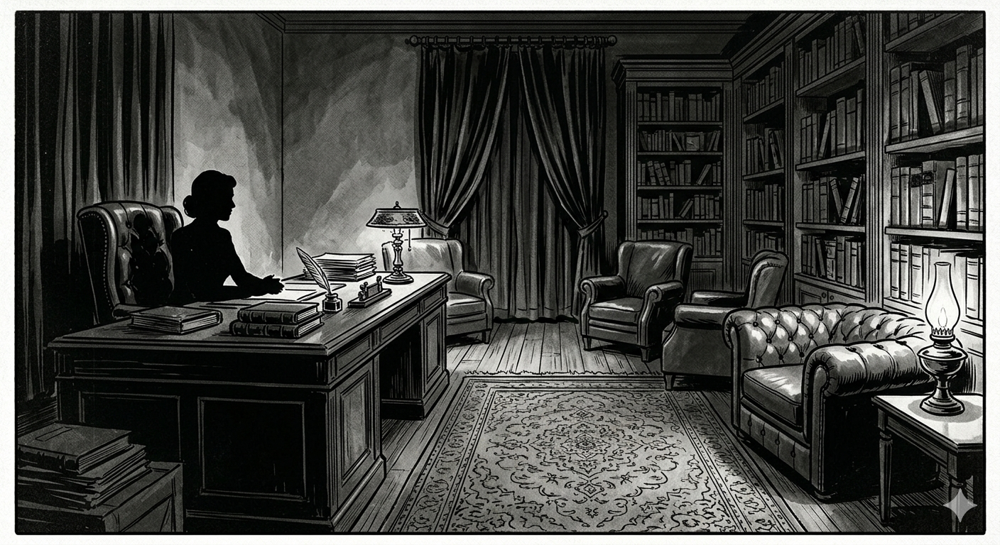
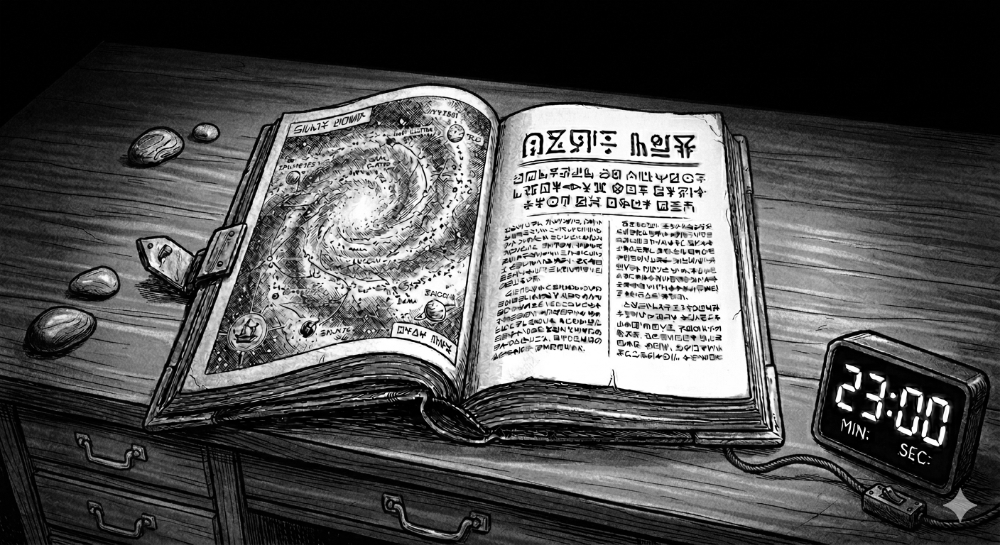

<!-- RAF :
+ ajouter une carte évoquant la prise de décision finale à la majorité
+ ajouter une carte évoquant la violence durant la négo
+ revoir cartes concernant la mécha-lutte

Com'
* [ ] https://lucas-c.itch.io/
* [ ] https://chezsoi.org/lucas/blog/ & https://lucas-c.github.io/jdr/
* [ ] http://troplongpaslu.fr/
* [ ] https://www.casusno.fr
* [ ] https://www.reddit.com/r/jdr
* [ ] https://forums.ffjdr.org/c/jdr/jdr-gratuit/30
* [ ] https://chezsoi.org/lucas/blog/pages/jeux-de-role.html
* [ ] serveurs Discord : CestPadDuJdr, PTGPTB
+ version en anglais ?
-->

# Abductés

  

Un très court jeu de rôle cinématographique, pour **une MJ (Meneuse de Jeu) et deux à quatre joueuses**, entièrement basé sur le _roleplay_, le plaisir d'improviser les dialogues et les réactions de son personnage.

**Durée** : entre 1h30 et 2h30, selon le nombre de joueuses

**Thèmes** : enlèvement, science-fiction, tension dramatique, négociation, temps limité

**Synopsis** : les joueuses incarnent des humains sélectionnés pour représenter la planète Terre lors d'une négociation commerciale intergalactique. Durant l'introduction, leurs personnages sont victimes d'un enlèvement par _quelque chose_ d'extraterrestre, de manière horrifique et stéréotypée. Durant la scène centrale du jeu, ils vont représenter la planète durant une tractation commerciale, et réalisent l'enjeu de la négociation : l'achat des océans terrestres.

**Présentation aux joueuses** : pour un scénario si court, il est intéressant de conserver un maximum de surprise pour vos joueuses, et donc de leur en révéler le minimum possible avant la partie.
Néanmoins, expliquez-leur _a minima_ de quel style de jeu il s'agit (purement axé sur le _roleplay_, sans dés), ainsi que les thèmes majeurs listés ci-dessus.

**Matériel requis & préparatifs** :
* un **minuteur** réglable, qui sera visible de toutes les joueuses
* **imprimer** & découper quelques cartes, placées sur **deux feuilles A4** à la fin de ce document
* du papier et des crayons peuvent être utiles
* ni dés ni autre source de hasard ne sont nécessaires
* prenez le temps de lire l'intégralité du scénario ainsi que les cartes de texte de loi galactique

**Genre** : la convention d'écriture choisie pour ce jeu est de féminiser  le terme "joueur", mais de considérer par ailleurs leurs personnages comme masculins. Il s'agit là juste d'un parti-pris stylistique.

 

## Création des personnages (~ 10min)

Chaque joueuse va **librement inventer son personnage**,
en se basant uniquement sur **deux cartes "Personnalité"**,
que chacune tire au hasard comme point de départ.

Le seul point commun imposé pour ces personnages est qu'ils sont tous **anglophones**, mais il ne s'agit pas forcément de leur langue natale.

Suggérez aux joueuses de définir brièvement **leur apparence**, **leur activité**, et **leur personnalité**.
Tous les aspects de leurs personnages ne seront pas présentés durant la partie, qui sera par ailleurs assez courte, donc mieux vaut ne pas trop détailler les personnages, et improviser des éléments plus tard.

Si vous disposez de papier et de crayons, proposez aux joueuses de les employer pour prendre des notes.

Annoncez aux joueuses que la partie va débuter par une description de ce que font chacun de leurs personnages, durant un début soirée alors qu'ils sont seuls, et suggérez-leur de commencer à réfléchir à cela lorsqu'elles auront terminé d'imaginer leur _alter ego_.

## Introduction (~ 5-10min par personnage)

À tour de rôle, dans l'ordre où elles sont volontaires, les joueuses présentent ce que font leurs personnages en ce moment, puis...

::: banner music
🎶 Bande son suggérée : [_Alien Abduction | Dark Sci-fi Ambient Drone Music_ (YouTube)](https://www.youtube.com/watch?v=CozLBYsIUAg)
:::

 

### Exposition
> C'est le crépuscule.
> Des éclairs au loin annoncent un orage, et de la pluie se met à tomber.
> Dans le ciel s'assombrissant on distingue les traînées de quelques comètes.

Les joueuses décrivent le lieu et les actions de leur personnage de manière "externe", comme une scène d'exposition de film, sans que l'on ait accès à leurs pensées.

Seule contrainte : ils sont **seuls**, il n'y a personne autour d'eux.

Des éléments de mystère peuvent subsister concernant les motivations des personnages, mais cette scène doit être révélatrice de leur personnalité, de leur vision du monde.

 

### L'enlèvement
Immédiatement suite à leur scène d'exposition, le personnage de chaque joueuse se fait enlever de manière horrifique, par _quelque chose_ d'invisible.

Lors du premier enlèvement, les joueuses ne savent pas à quoi à s'attendre, donc soignez vos effets :
* choisissez un mode d'enlèvement horrifique qui vous semble le plus adapté pour ce personnage. Quelques idées : obscurité qui envahit progressivement les lieux; attiré dans un couloir étrange; silhouette inquiétante, qui se révèle sans visage, poursuivant les personnages; etc.
* n'hésitez pas à recourir à des **phénomènes paranormaux** : fenêtre ou porte étrangement ouverte; lumières qui s'éteignent; mystérieuse porte qui apparaît dans un lieu familier; bâtiment qui se met à trembler de plus en plus intensément; etc.
* commencez par introduire des **sensations**, en prenant le temps de les détailler, pour faire travailler l'imagination des joueuses. Quelques idées : un bruit étrange, une sensation de présence, une odeur, l'impression que le temps s'est figé.
* invitez les joueuses à détailler les réactions de leur personnage, et comment il tente de réagir. Jouez "en temps réel" : si une joueuse hésite, considérez que leur personnage hésite.
* au climax de la tension, coupez simplement la scène en décrivant comment le personnage se fait "happer" vers un lieu inconnu...

Quoi que tentent les personnages, **leur enlèvement est inéluctable**.

Vous pouvez vous permettre de mettre en scène les enlèvements suivants plus rapidement : la surprise est désormais éventée, et cette séquence ne constitue pas le cœur du jeu.

## Scène principale (~ 40min)

::: banner music
🎶 Bande son suggérée : [_Citizen Sleeper Original Game Soundtrack_ (YouTube)](https://www.youtube.com/watch?v=5891py-ufFI)
:::

 

### Rencontre avec Olivia
Une fois tous les personnages capturés, débutez la scène suivante ainsi :

> Vous vous réveillez allongés au sol. La pièce autour de vous est faiblement éclairée, mais ressemble à un bureau : mobilier en bois, dont une grande bibliothèque et plusieurs fauteuils molletonnés en cuir, rideau de velours sombre, et un grand bureau massif d'un côté de la pièce.
> Une femme assise derrière le bureau s'adresse à vous : « Bienvenue. Je suis Olivia. »

Montrez aux joueuses l'illustration représentant Olivia.

Ne l'indiquez que si les joueuses s'en enquièrent, mais la pièce ne comporte aucune porte.

Demandez aux joueuses de détailler les réactions de leurs personnages tandis qu'ils découvrent les lieux.

Leur interlocutrice leur propose de s’installer confortablement dans les fauteuils, et leur demande s'ils ont soif. Si l'un d'eux répond par l'affirmative, elle leur proposera de se servir dans un petit compartiment bar assez chic, dissimulé à la base de la bibliothèque, qui contient de nombreux spiritueux ainsi que des sodas.

Olivia prend le temps d'échanger avec chacun des personnages avant d'entrer dans « le vif du sujet ». Elle se soucie de leur bien-être mais reste évasive et fuyante si les joueuses l'interrogent. Des questions comme « comment suis-je arrivé ici » ou « qui êtes-vous » resteront définitivement sans réponse.

 

### Découverte des enjeux
Olivia commence par annoncer aux personnages, de manière candide et enjouée, qu'ils ont été « sélectionnés comme représentants officiels lors d'une prometteuse opération d'acquisition ».
 
Elle leur explique qu'elle représente un important client qui souhaiterait passer un accord commercial assez urgemment.

Laissez le joueuses réagir s'ils le souhaitent, et répondez à leurs commentaires, puis précisez qu'il s'agit « probablement du plus important pacte commercial de l'histoire de votre planète ».

Laissez encore quelques instants aux joueuses pour digérer cela et éventuellement réagir, puis Olivia précise que **son client est intéressé par les océans de la planète**, et que les personnages sont chargés de représenter les intérêts des espèces vivantes qui y habitent durant cette négociation.

Poursuivez rapidement en précisant que :
* la durée de cette négociation est **limitée à 23 minutes** : étant donné le différentiel temporel existant entre les espèces peuplant cette galaxie, cette durée a été établie comme la plus équitable
* bien sûr en tant que « représentants officiels durant cette négociation », ils ont accès au **texte de la loi du commerce galactique**, qui a pour l'occasion été traduite dans le leur langue : remettez aux joueuses les cartes correspondantes
* la négociation débute **maintenant** : lancez le minuteur et rendez le visible aux joueuses

### Contre la montre
Durant ces 23 minutes, laissez le champ libre aux joueuses.
 
Indiquez-leur leurs paroles correspondront à celles de leur personnage par défaut.

Elles disposent des éléments essentiels du texte de loi galactique faisant référence pour cette négociation, mais manquent cruellement de temps pour pouvoir toutes le lire avec attention et se concerter à son propos.
 
Oui c'est injuste, mais soyez impitoyable.

Les personnages peuvent tenter toutes sortes d'attitudes et d'approches vis à vis d'Olivia, qui est tout à fait disposée à discuter et répondre à leurs interrogations et arguments.

**Les objectifs d'Olivia** sont les suivants :
* son plan est que **la négociation échoue**, et qu'ainsi au terme du délai de concertation, Olivia invoque le droit de son client à demander **un décret de saisie concernant les océans** de la planète, comme cela lui est autorisé par la loi galactique car il s'agit d'une ressource vitale pour son espèce. Si les personnages l'interrogent à ce sujet, elle assume totalement cette stratégie.
* durant **les 15 premières minutes**, Olivia est attentive à tout élément évoqué par les personnages qui puisse constituer **une clause** dans la négociation. Son client est disposé à offrir de nombreuses compensations : resources précieuses (or, diamants...), technologies inconnues, mise à disposition d'une station orbitale pour 1% de l'humanité, etc.
* en tant que MJ, prenez en note ces clauses pour vous en souvenir, même si elles ne sont qu'évoquées brièvement. Olivia s'efforce d'être la plus conciliante possible, abondant dans le sens des personnages qui suggèrent ces idées :

> « Oh vous envisagez un autre habitat ? Mon client peut vous proposer une solution d'hébergement pour vous, vos proches et quelques centaines de milliers d'autres humains. »

> « Oui bien sûr, mon client est prêt à vous laisser tout l'eau douce de votre planète. Je rajoute tout de suite cela au contrat. »

Environ **5 minutes avant la fin du délai** de négociation, Olivia sollicite l'attention des personnages, et résume l'ensemble des clauses qu'elle a adossé au contrat.
 
Elle leur demande ensuite s'ils acceptent cet accord de vente des océans : tendez aux joueuses **la carte avec un seau**, et indiquez que l'apposition de leur doigt dessus vaut pour validation.

Une fois le temps écoulé, Olivia propose une dernière fois aux personnages d'accepter le contrat.
 
Si strictement **plus de la moitié des personnages l'approuve, l'accord est conclu**.
 
Sinon, Olivia annonce ceci :

> « Malgré des propositions compensatoires sérieuses offerte aux représentants officiels de la planète par mon client, cette négociation semble malheureusement avoir échoué. »

> « En conséquence, mon client sollicite un décret de saisie concernant les océans, comme cela lui est autorisé par la loi galactique, car il s'agit d'une ressource vitale pour son espèce. »

> « Ce décret sera validé et entrera en application d'ici quelques minutes. »

> « Merci pour votre participation. »

## Conclusion & épilogue (~ 5-10min par personnage)
Proposez aux joueuses de décrire **une courte scène d'épilogue** pour chacun de leurs personnages.

La scène se déroule quelques jours plus tard.
 
Selon comment s'est conclue la négociation,
les océans de la planète ont peut-être tous disparu,
aspirés par un trou noir sous-marin,
mais des personnages peuvent avoir exploité la situation à leur avantage.

À tour de rôle, dans l'ordre qu'elles souhaitent, les joueuses décrivent librement une très courte scène avec leur personnage :
proposez leur de détailler où il se trouve et ce qu'il fait.
 
Les autres joueuses peuvent éventuellement demander des précisions.

Enfin, **prenez le temps de _debriefer_** la partie avec les joueuses.

## Annexes
### Derrière le rideau de velours
Si les personnages examinent la pièce, le seul élément d'intérêt se révélera être le rideau. S'ils glissent un œil derrière, indiquez leur d'abord qu'il semble y avoir **un grand aquarium**, plongé dans l'obscurité, et qu'il faudrait **ouvrir le rideau en grand** pour espérer distinguer quelque chose à l'intérieur.

Si un personnage tire ainsi le rideau, décrivez ceci aux joueuses :

> L'aquarium est immense.
> Au fond, vos yeux distinguent une large forme, plus grande que la pièce.
> Soudain, une lumière apparaît à l'extrémité d'un appendice, 
> et vous découvrez un **gigantesque poisson-lanterne**.
> Le long de son flanc, plusieurs yeux géants vous fixent.

Après quelques instants, Olivia bredouille :

> « Je comprends votre dégoût.
> Je fais cet effet à tout le monde.
> C'est pour cette raison que j'adapte mon apparence à mes interlocuteurs. »

### Olivia
Comme dans [le court-métrage donc ce jeu est inspiré](https://www.youtube.com/watch?v=rv8kOzRZK8g),
Olivia fait simplement son boulot, et celui-ci ne le passionne pas particulièrement.
Bien qu'elle adopte une apparence humaine pour mettre à l'aise ses interlocuteurs, en réalité **elle ressemble à un gigantesque poisson-lanterne**. Toutefois sa personnalité et sa psychologie sont tout à fait semblables à celles d'un être humain.

La Terre n'est pas la seule planète sur sa liste, et le processus est bien rôdé.
Ce n'est pas la première fois qu'elle "sélectionne" des autochtones pour "faire affaire" avec eux avec cette stratégie.s

Olivia est fatiguée d'enchaîner ces tractations, et au fond elle n'est pas très fière d'opérer ainsi.
Ce n'est qu'un pion dans un système injuste,
qui lui offre peu de reconnaissance pour ce travail ingrat.
Qui plus est, elle souffre d'inspirer du dégoût à ses interlocuteurs, pour qui elle développe parfois de l'empathie.

Pour l'incarner en _roleplay_, essayez de **la rendre la plus humaine possible**.
Elle n'est ni malveillante ni manipulatrice, au contraire.
Elle reste inflexible sur les clauses légales, et s'efforce de garder une certaine "distance professionnelle" pour ne pas être affectée par la catastrophe humanitaire que ces "accords commerciaux" risquent de produire.
Elle peut cependant être amadouée par des arguments faisant appel à son empathie, surtout si on lui manifeste de l'intérêt et de la sympathie.

### Jouer sans dés
Ce jeu de rôle n'inclue volontairement ni hasard ni système de résolution.
**La MJ décide arbitrairement** du résultat des actions entreprises par les personnages.
Voici quelques conseils pour gérer cela :
* _in fine_, il est **inéluctable que les personnages se fassent enlever**, mais s'ils tentent d'échapper à leur destin, laissez-les réussir leur premières tentatives d'évasion
* **« oui mais »** : si vous décrivez trop d'échecs répétés des actions des joueuses, cela peut avoir un effet frustrant. Mieux vaut faire preuve de souplesse : leurs actions peuvent réussir mais ne pas avoir l'effet escompté, ou ne faire que retarder l'inévitable
* une fois la scène principale lancée, **jouez sans anticiper**. Tout peut arriver, et c'est là l'un des grands plaisir à faire jouer ce scénario. Les personnages peuvent réussir à trouver une faille légale ou à prendre Olivia par les sentiments, ou encore refuser "rentrer dans ce jeu", avec les terribles conséquences que cela peut impliquer. **Ne prenez une décision qu'au terme de la négociation**.
* **sentez-vous libre de choisir la décision finale d'Olivia** : selon votre vision du scénario, votre humeur du jour et ce que vous appréciez en jeu de rôle, peut-être serez-vous tenté de faire plaisir aux joueuses, ou de tendre vers une fin tragique car cela rend l'histoire plus intéressante, ou bien encore d'essayer de prendre la décision la plus cohérente possible en fonction du _roleplay_ des joueuses et de votre interprétation d'Olivia.
 
Quelle que soit l'option que vous retenez, ce sera la bonne.

### Et si les personnages ne se contentent pas de parler ?
De manière générale, laissez les personnages agir librement, même s'ils se mettent à casser des objets par frustration ou à menacer Olivia.
Celle-ci ne craint rien réellement dans cet environnement factice, mais si la négociation tourne à la **violence** et qu'elle se sent dépassée, elle interrompra tout : fondu au noir, grand silence, puis les personnages entendent la voix d'Olivia qui récite calmement :

> « La loi commerciale galactique est très claire : tout acte de violence au cours d'une négociation entraînera sa nullité. Et dans ce cas de figure, mon client sollicitera un décret de saisie des océans, comme la loi lui autorise. »

> « Je vous donne une dernière chance de mener cette négociation à son terme. Tout nouvel acte de violence entraînera l'interruption de cette négociation. »

Les personnages se réveillent alors à nouveau allongés sur le sol de la pièce.

### Jouer via internet
C'est possible, même si le jeu n'a pas été conçu pour. 

Augmentez la durée dont disposent les joueuses pour la négociation.

### Seconde négociation
Il est tout à fait envisageable de donner lieu à une seconde partie si les joueuses le souhaitent.

Donnez-leur alors le choix d'incarner le même personnage ou un autre. Dans ce dernier cas, mélangez toutes les cartes "Personnalité" des joueuses qui souhaitent changer de personnage avec celles qui n'ont pas été employées pour l'instant, puis laissez-les en piocher à nouveau deux chacune.

Pour cette seconde négociation :
* si la précédente tentative a échoué, l'enjeu sera à nouveau l'achat des océans de la Terre
* sinon, les personnages ont vécu le siphonnage des océans de la planète, et cette fois un client alien souhaite acquérir tout son **azote**

Le déroulement de cette seconde partie est identique, avec Olivia comme interlocutrice. Il peut alors être intéressant de jouer sur **les répétitions** :
* un personnage précédemment "abducté" sera cette fois bien moins effrayé. Il peut même y avoir un contraste amusant entre les "abductés" pour la première fois et ceux qui l'ont déjà vécu.
* Olivia et certains personnages se connaissent peut-être déjà, ce que qui peut créer des retrouvailles et des situations intéressantes selon l'issue de la première partie
* si Olivia n'est pas arrivée à ses fins la première fois, elle s'assure que les humains ne puissent employer cette fois la même stratégie

## Remerciements
<!--
Merci aux illustrateurs qui ont placé leur travail sous licence _Creative Commons_ :
* [Lady by Dumaker](https://www.deviantart.com/dumaker/art/Lady-849565091) - [CC BY-NC-SA](http://creativecommons.org/licenses/by-nc-sa/4.0/)
* [Gobul, the Lantern Fish Wyvern by Halycon450](https://www.deviantart.com/halycon450/art/Gobul-the-Lantern-Fish-Wyvern-453833867) - [CC BY-NC-SA](http://creativecommons.org/licenses/by-nc-sa/4.0/)
-->

L'inspiration originale pour ce jeu est un court-métrage de science-fiction : _Final Offer_ de Mark Slutsky, visionnable (en anglais) : [ici sur la chaîne YouTube DUST](https://www.youtube.com/watch?v=rv8kOzRZK8g). J'ai également été inspiré par [les jeux _For The Story_](https://forthestory.fr/jeux/) ainsi que le court jeu de rôle [_The last coffee shop on the left_](https://chezsoi.org/lucas/blog/ldcslg-et-l-ile-mysterieuse.html) de Shane McLean. Merci à eux.

Un grand merci aux playtesteurs & relecteurs de ce jeu : Aurélien, Matthieu, Olivier.

## Licence & feedbacks

Ce jeu de rôle a été écrit et mis en page par Lucas Cimon.
Il a été publié en avril 2026 et est placé sous licence <a rel="license" href="https://creativecommons.org/licenses/by-nc-sa/4.0/deed.fr">Creative Commons Attribution-NonCommercial-ShareAlike 4.0 International</a>.

Les fichiers sources ayant permis de générer ce PDF sont disponibles [sur GitHub](https://github.com/Lucas-C/jdr/tree/master/AbductedNegociators).
 
Merci aux développeurs des [logiciels libres](https://fr.wikipedia.org/wiki/Free/Libre_Open_Source_Software) employés : [le logiciel de dessin Gimp](https://www.gimp.org/), [l'éditeur de code VSCode](https://code.visualstudio.com/), [le lecteur de PDF Sumatra](https://www.sumatrapdfreader.org), [le language de programmation Python](https://www.python.org/), et les bibliothèques de code [mistletoe](https://pypi.org/project/mistletoe/) & [weasyprint](https://weasyprint.org/).

J'adorerais savoir comment s'est déroulée votre partie d'_Abductés_ !
Vous pouvez me la raconter en laissant un commentaire sur [mon blog](https://chezsoi.org/lucas/) ou sur [la page itch.io du jeu](https://lucas-c.itch.io/abductes).

:::: cards

## Cartes

Vous trouverez sur les pages suivantes les cartes "Personnalité" ainsi que les extraits de textes de loi du "Code du Commerce Galactique" :
   

::: card personality
### Misanthrope
Vous considérez la plupart des gens comme méprisables
:::

::: card personality
### Avare
Vous êtes proche de vos sous et n'aimez pas partager vos possessions
:::

::: card personality
### Croit aux aliens
Il existe une vie extra-terrestre,
c'est certain,
 
assurément supérieure
en tous points à l'homme
:::

::: card personality
### Militant écolo
Vous êtes activement engagé en faveur de la défense de la nature et des droits des animaux
:::

:::: <!-- end of .cards -->
:::: cards

::: card personality
### Pointilleux
Soucieux du détail, vous maîtrisez de nombreux règlements sur le bout des doigts.
:::

::: card personality
### Négociateur
Vous adorez marchander, parlementer pour trouver un accord.
:::

::: card personality
### Créatif
Vous aimez chercher des idées originales, inattendues, pour résoudre des problématiques.
:::

::: card personality
### Influent
Vous aimez avoir du pouvoir, et vous en avez acquis beaucoup.
:::

:::: <!-- end of .cards -->

:::: cards

::: card legend
Contrat à approuver :
:::

::: card contract
:::

<!--

::: card legend
Olivia :
:::

::: card olivia
:::

::: card real-olivia
:::

-->

:::: <!-- end of .cards -->

:::: cards

::: card alien-code
Les planètes habitées non actives dans le libre commerce pan-galactique seront représentés durant les négociations concernant leur habitat par un panel de représentants officiels composé d'au moins trois autochtones, qui seront transportés aux frais de la partie initiatrice de l'opération sur le lieu de négoce.
:::

::: card alien-code
Étant donné le différentiel temporel existant entre les différentes espèces du consortium pan-galactique du commerce, la durée légale de négociation est fixée à 23 minutes. Cette durée constitue un compromis équitable, calculé comme une moyenne géométrique basée sur les cycles de vie et les localisation spatiales des espèces du consortium.
:::

::: card alien-code
En cas de non obtention d'un accord au terme de la phase réglementaire de négociation, la partie initiatrice d'une opération commerciale d'acquisition d'une ressource listée comme « vitale » par l'organisation pan-galactique des peuples unis peut demander un décret de saisie à dessein de sauvegarde de sa population.
:::

::: card alien-code
En cas de non réception d'un recourt par transmission intergalactique ISBX-ALT-236 sous 24 secondes humaines, une demande d'obtention de décret de saisie à dessein de sauvegarde d'une population du consortium pan-galactique du commerce est automatiquement acceptée.
:::

:::: <!-- end of .cards -->
:::: cards

::: card alien-code
Sont notamment listées comme « vitales » par l'organisation pan-galactique des peuples unis les ressources suivantes : le zinc; le cadmium; le mercure; les arachides grillées; l'eau (H2O); le silicium; le savon noir (à l'hydroxyde de potassium); les urines de Kmµ§-ShA¤; l'or et les cristaux de soude.
:::

::: card alien-code
En cas d'implication dans un accord commercial d'une ressource listée comme « vitale » par l'organisation pan-galactique des peuples unis, il est nécessaire que l'acquéreur fasse une proposition compensatoire permettant au vendeur de ne pas être lésé dans ses besoins vitaux fondamentaux.
:::

::: card alien-code
Afin de conclure un accord commercial valide selon les règles du consortium pan-galactique du commerce, les représentants officiels du vendeur et l'acquéreur doivent se réunir physiquement en un même lieu pour la durée de la négociation.
:::

::: card alien-code
Une méthode acceptable de résolution de divergence au cours d'une négociation visant à conclure un accord commercial pan-galactique est le recourt à un affrontement, selon le code usuel de la mécha-lutte, de champions choisis par chacun des partis.
:::

:::: <!-- end of .cards -->
:::: cards

::: card alien-code
Une méthode acceptable de résolution de divergence au cours d'une négociation visant à conclure un accord commercial pan-galactique est le recourt à un tiers médiateur dont la qualification est reconnue par le tribunal de commerce pan-galactique, dans la mesure où les deux parties s'accordent sur son choix.
:::

::: card alien-code
Courtoisie, respect et Kr*/j-°To~` sont requis pour la tenue d'une négociation d'un accord commercial pan-galactique.
Un manque de politesse rejaillira sur la réputation d'honorabilité des parties prenantes, et entachera la relation de confiance entre elles et leurs représentants officiels, qui pourront se désister s'ils s'estiment insultés.
:::

::: card alien-code
Les planètes habitées non actives dans le libre commerce pan-galactique et ne disposant pas de la technologie de transmission intergalactique ISBX-ALT-236 sont considérées selon le code du commerce pan-galactique comme "en voie de développement".
:::

::: card alien-code
Une planète "en voie de développement" peut être partie prenante d'une négociation d'un accord commercial pan-galactique, tant que les textes de loi afférents sont traduits dans la langue de ses représentants officiels présents sur le lieu de la négociation.
:::

:::: <!-- end of .cards -->
:::: cards

::: card alien-code
En cas de questions issues de parties prenantes d'une négociation d'un accord commercial pan-galactique concernant des points de légalité, les textes de loi afférents font référence. Un clerc légaliste dont la qualification est reconnue par le tribunal de commerce pan-galactique doit par ailleurs être présent.
:::

::: card alien-code
Au terme de la négociation d'un accord commercial pan-galactique, les parties prenantes doivent signer par l'intermédiaire de leurs représentants officiels le contrat établi conjointement. Les représentants officiels sont tenus d'apporter leurs propres sceaux ou outils de signatures permettant leur identification unique et univoque.
:::

::: card alien-code
Les représentants officiels de la population d'une planète "en voie de développement" qui se jugerait lésée par une une tractation insincère lors d'une négociation d'un accord commercial pan-galactique peuvent saisir le tribunal de commerce pan-galactique pour un arbitrage de circonstance, en réalisant une demande de rescrit calligraphiée.
:::

::: card alien-code
Les clauses usuelles du droit du commerce pan-galactique concernant les contrats d'association et d'acquisition s'appliquent de manière usuelle : droit et durée de rétractation (17 secondes); autorité supérieure du tribunal de commerce pan-galactique; non établissement d'accords rétroactivement caduques; etc.
:::

:::: <!-- end of .cards -->

## Illustrations
En bonus, voici quelques illustrations générées avec une IA générative :

:::: illustrations

<!--

-->

:::: <!-- end of .illustrations -->
