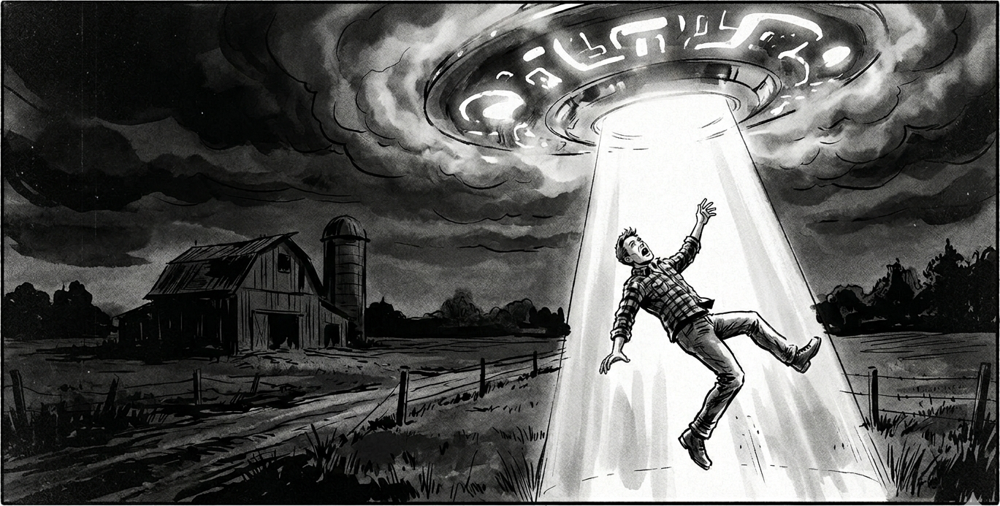
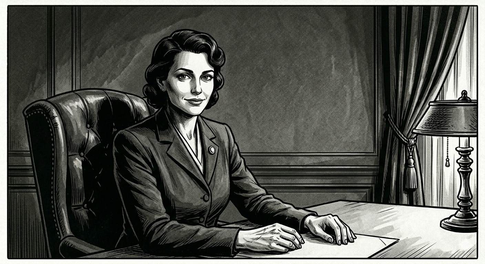
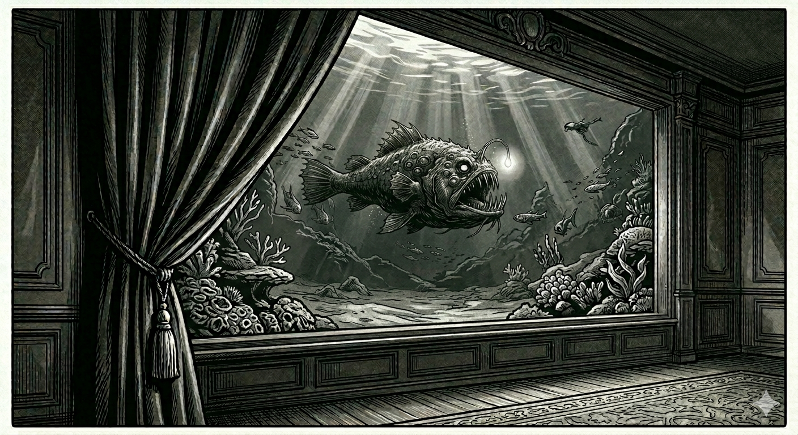

<!-- Com'
* [x] https://old.reddit.com/r/RPGdesign/comments/1t4bzut/abducted_negotiators_looking_for_a_proofreader_on/
* [ ] contacter le réalisateur du court-métrage
* [ ] chercher des compétitions de TTRPG
-->

# Abducted Negotiators

  

A very short cinematic role-playing game for **one Game Master and three to four players**, entirely based on role-playing, for players who enjoy improvising dialogues and character reactions.

**Duration**: between 1h30m and 2h30min, depending on the number of players

**Themes**: abduction, science fiction, dramatic tension, negotiation, time limit

**Synopsis**: The players portray humans selected to represent Earth in an intergalactic trade negotiation. During the introduction, their characters are abducted by _something_ extraterrestrial, in a horrific and stereotypical manner. During the game's central scene, they represent the planet in a trade deal and realize what is at stake: the purchase of Earth's oceans.

**Pitching the game to your players:** For such a short scenario, it's important to maintain as much surprise as possible for your players, so reveal as little as you can before the game.
 
However, explain to them at least the basics of the game style - improvisation without dice - as well as the major themes listed above. _“It plays on the alien abduction trope with a twist!”_

**What you need to prepare:**

* An adjustable **timer**, visible to all players
* **Print** and cut the _Personality_ & _Galactic Trade Code_ cards at the end of this document
* Paper and pencils may be useful
* No dice or other cards are necessary
* Take the time to read the entire scenario and the _Galactic Trade Code_ cards

 

---

 

## Character Creation (~ 10min)

Each player **creates their character** based on **two _Personality_ cards** drawn randomly.

Based on them, players can freely define **their character appearance, activity and personality**.

The only requirement for these characters is that they must all **speak English**.

This phase should remain relatively **short**: no need to go into details.

If you have paper and pencils available, suggest to your players that they use them to take notes.

Inform the players that the game will begin with a short scene for each character, where they go about their business, alone, early in the evening.
Suggest that they start picturing this scene once they have finished imagining their _alter ego_.

This first introductory scene will serve as **exposition** to present their characters.

## Introduction (~ 10min par personnage)

Taking turns, the players present what their character is doing at this precise moment, and then...

::: banner music
🎶 Suggested soundtrack: [_Alien Abduction - Dark Sci-fi Ambient Drone Music_ (YouTube)](https://www.youtube.com/watch?v=CozLBYsIUAg)
:::

 

### Exposition

> It's dusk. Flashes of lightning in the distance herald a storm.
>  Rain begins to fall. In the darkening sky, the trails of a few comets can be seen.

The player describe the location of the scene and their character's actions **from an external perspective**, like an exposition scene in a film, without revealing their thoughts.

Whatever they do, their character must **alone** in this scene.

Some elements of mystery can remain regarding the characters' motivations, but this scene must **give a sense of their personality and background**.

 

---

 

### The Abduction

Immediately following their exposition scene, each player's character is abducted in a horrific way by _something_ invisible.
The Game Master describe how they are seized by this _mysterious and terrifying thing_:

* Choose a horrific abduction method **appropriate for this character and location**. Some ideas: unstoppable darkness gradually engulfing the room; a stalker which turns out to be faceless; drawn by strange whispers that eventually turn into horrid roars; etc.

* Start by introducing **sensations**, taking the time to describe them in detail, to engage the players' imaginations. Some ideas: strange, half-organic, half-mechanical noises; a feeling of presence; acidic and swampy smells;s the impression that time has stood still…

* Don't hesitate to use **paranormal phenomena**: a window or door strangely opening; lights going out; a mysterious door that appears in a familiar place; a building that begins to shake more and more intensely; swarms of insects gradually emerging from all sorts of crevices; etc.

* Invite the players to describe **their character's reactions** in detail, and how they try to react. Play **in real time**: if a player hesitates, assume their character is hesitating.

* At the climax of the tension, simply **cut** the scene by describing how the character is _snatched_ to an unknown location...

Whatever the characters try, **their abduction is inevitable**.

During the first abduction, the players don't know what to expect, so pay close attention to your effects.
You can stage subsequent abductions more quickly: the surprise is now gone, and this sequence is not the heart of the game.

## Main Scene (~ 40min)

::: banner music
🎶 Suggested soundtrack: [_Citizen Sleeper OST_ - Amos Roddy (YouTube)](https://www.youtube.com/playlist?list=OLAK5uy_mUNNnEMaCcbXmG70e8uJe9-FZHyinoghw)
:::

 

### Meeting Olivia

Once all characters have been captured, begin the next scene as follows:

> You wake up lying on the floor. The room around you is dimly lit but resembles a study: wooden furniture, including a large bookcase and several plush leather armchairs, a dark velvet curtain, and a large heavy desk on one side of the room.
>  The woman sitting behind the desk addresses you: “Welcome. I'm Olivia.”

You can show the players the illustration depicting the room and **Olivia**.

Only mention it if the players ask, but the room has **no doors**.

Ask the players to describe their characters' reactions as they explore the room.

Olivia invites them to make themselves comfortable in the armchairs and asks if they are thirsty. If one of them agrees, she offers them drinks from a rather chic little bar area, hidden at the base of the bookcase, which contains a variety of spirits and sodas.

Olivia takes the time to chat with each of the characters before getting to the heart of the matter. She is concerned about their well-being but remains evasive if the players ask her questions: “Where are we?” or “How did I get here?” are dodged and remain unanswered.

---

### Discovering the Stakes

Olivia begins by candidly and cheerfully announcing to the characters that they have been _“selected as official representatives in a promising acquisition deal.”_
  She explains that she represents an important client who wishes to conclude a business agreement.

Allow the players to react if they wish, and respond to their comments, then specify that this is _“probably the most important trade agreement in the history of your planet.”_

Give the players a few more moments to process this and perhaps react, then Olivia clarifies that **her client is interested in the planet's oceans**, and that the characters are tasked with representing the interests of the living species that inhabit Earth during this negotiation.

Continue quickly by specifying that:
* the duration of this negotiation is **limited to 23 minutes**: given the time difference between the species inhabiting this galaxy, this duration has been established as the fairest.
* of course, as _“official representatives during this negotiation”_, they have access to the **text of the Galactic Trade Law**, which has been translated into their language for this occasion: give the players the corresponding cards.
* the negotiation begins **now**: start the timer and make it visible to the players.

### Against the Clock

During these **23 minutes**, give the players free rein.

Indicate that during this scene **their dialogue will be that of their characters**.

Cards provide players the essential elements of the galactic law relevant to this negotiation, but they are desperately short of time to read it carefully and discuss it amongst themselves.
 
Yes, it's deeply unfair, but be strict regarding this time constraint.

The characters can try all sorts of attitudes and approaches with Olivia, who is perfectly willing to discuss and answer their questions and arguments.

**Olivia's objectives** are as follows:
* Her plan is for **the negotiation to fail**, and thus, at the end of the consultation period, Olivia will invoke her client's right to request **a seizure order concerning the planet's oceans**, as permitted by galactic law because they are a vital resource for her client's species. If the player characters question her about this, she fully and honestly acknowledges this strategy.

* During **the first 15 minutes** of the negotiation, Olivia is attentive to any element mentioned by the characters that could constitute **a clause** in the negotiation. Her client is willing to offer numerous compensations: precious resources (gold, diamonds, etc.), unknown technologies, the provision of an orbital station for 1% of humanity, etc.

* As the Game Master, take notes of these clauses to remember them, even if they are only briefly mentioned. Olivia strives to be as conciliatory as possible, agreeing with the characters who suggest these ideas:

> “Oh, you are considering another habitat? My client can offer you a housing solution in an orbital station for you, your loved ones, and several hundred thousand other humans.”

> “Yes, absolutely, my client can gather all the fresh water on your planet into a single lake. I'll add that to the contract right away.”

Approximately **5 minutes before the end of the negotiation period**, Olivia gets the characters' attention and summarizes all the clauses she has added to the contract.

She then asks them if they accept this agreement to sell the oceans: hand the players **the card with a seal**, and indicate that placing their finger on it constitutes approval.

Once the time is up, Olivia offers the characters one last chance to accept the contract.

**If an absolute majority of the characters approves it, the agreement is concluded**.

Otherwise, Olivia announces the following:

> “Despite serious compensatory proposals offered to the planet's official representatives by my client, these negotiations unfortunately appear to have failed.”

> “Consequently, my client requests a seizure order concerning the oceans, as permitted by galactic law, since they are a vital resource for their species.”

> “This decree will take effect within a few minutes.”

> “Thank you for your participation.”

## Conclusion & Epilogue (~ 5-10min per character)

Ask the players to describe **a short epilogue scene** for each of their characters.

The scene takes place a few days later.
 
Depending on how the negotiation ended,
the planet's oceans may have all disappeared, sucked into an underwater black hole,
but some characters may have exploited the situation to their advantage.

Taking turns, in any order they choose, the players freely describe a very short scene with their character:
ask them to detail where their character is and what they are doing.
 
The other players can ask for clarification if needed.

Finally, **take the time to debrief** the game session with the players.

 

---

 

## Appendices

### Behind the Velvet Curtain

If the characters examine the room, the only point of interest will be the curtain. If they peek behind it, first tell them that there appears to be **a large aquarium**, plunged in darkness, and that they would have to **open the curtain wide** to have any hope of seeing anything inside.

If a character does pull back the curtain, describe the following to the players:

> The aquarium is enormous.
> At the back, your eyes make out a large shape, bigger than the room.
> Suddenly, a light appears at the end of an appendage, and you discover a **gigantic lanternfish**.
> Along its side, several giant eyes stare at you.

After a few moments, Olivia stammers: _“I understand your disgust. I have that effect on everyone. That's why I adapt my appearance to the people I'm speaking to.”_

### Olivia

As in [the short film this game is based on](https://www.youtube.com/watch?v=rv8kOzRZK8g),
Olivia is simply doing her job, and she's not passionate about it.
Although she adopts a human appearance to put her interlocutors at ease, in reality **she resembles a giant lanternfish**. However, her personality and psychology are quite similar to those of a human being.

Earth isn't the only planet on her list, and the process is well-rehearsed.
This isn't the first time she's “selected” natives to “do business with” using this strategy.

Olivia is tired of these endless negotiations, and deep down, she's not very proud of operating this way.
She's just a pawn in an unjust system, that offers her little recognition for this relentless work.
Moreover, she suffers from inspiring disgust in those she meets, for whom she sometimes develops empathy.

To roleplay her, try to **make her as human as possible**.
She is neither malicious nor manipulative; quite the opposite.
She is inflexible regarding legal clauses and tries to maintain a certain “professional distance” so as not to be affected by the disasters these “trade agreements” risk causing.
However, she can be swayed by arguments that appeal to her empathy, especially if she is shown interest and sympathy.

### Playing without dice

This role-playing game intentionally includes neither randomness nor a resolution system.
 **The Game Master arbitrarily decides** the outcome of the characters' actions.

Here are some tips to manage this:

* Ultimately, **the abduction of the characters is inevitable**. But if they try to escape their fate, let them succeed in their first escape attempts.

* **“Yes, but”**: If you describe too many repeated failures of the players' actions, it can be frustrating. It's better to be flexible: their actions may succeed but not have the desired effect, or may only delay the inevitable.

* Once the main scene begins, **play without anticipating**. Anything can happen, and that's one of the great pleasures of running this scenario. The characters can find a legal loophole, appeal to Olivia's emotions, or refuse to “play along”, with potentially dire consequences.
 
**Only make a decision after the negotiation is complete.**

* **Feel free to choose Olivia's final decision.** Depending on your perspective on the scenario, your mood that day, and what you enjoy in role-playing games, you might be tempted to please the players, or lean towards a tragic ending because it makes the story more compelling, or perhaps try to make the most coherent decision based on your interpretation of Olivia and how the players' role-played the negotiation.
 
Whatever option you choose, it will be the right one.

 

### What if the characters do more than just talk?

Generally speaking, let the characters act freely, even if they start breaking things out of frustration or threatening Olivia. She isn't actually afraid of anything in this artificial environment, but if the negotiation turns violent and she feels overwhelmed, she will stop everything: fade to black, a long silence, then the player characters hear Olivia's voice calmly reciting:

> “Galactic trade law is very clear: any act of violence during a negotiation will be punished by automatic approval of the contract in favor of the other party. And in this case, my client will claim all of your oceans without any compensation, as the law allows.”

> “I am giving you one last chance to bring this negotiation to a close, peacefully. Any further act of violence will result in the termination of this negotiation.”

The characters then wake up again, lying on the floor of the room.

 

### Playing online

This scenario wasn't originally designed for this, but it's perfectly possible to play it remotely.

During an online game, voice communication is less fluid and rapid: **therefore, increase the time** players have for negotiation, to 43 minutes for example.

### Second negotiation

A second game session is perfectly feasible if the players wish.

Give them the choice of playing the same character or a different one.
 In the latter case, shuffle all the _Personality_ cards of the players who wish to change characters with the cards that haven't been used yet, then let those players each draw two new cards.

For this second negotiation:
* if the previous attempt failed, the stakes will again be the purchase of Earth's oceans
* otherwise, the characters have experienced the draining of the planet's oceans, and this time an alien client wants to acquire all the **nitrogen** in the atmosphere

The gameplay of this second round is identical, with Olivia as the negotiator.
 It can then be interesting to play on **repetition**:

* a character previously abducted will be much less frightened this time. An amusing contrast could even occur between those abducted for the first time and those who have already experienced it.

* Olivia and some of the other characters may already know each other, which could lead to interesting situations depending on how the first part unfolded.

* If Olivia failed the first time, she makes sure the same strategy won't work twice for the humans.

 

---

 

## Acknowledgements

This role-playing game was designed, written and laid out by Lucas Cimon between March and April 2026.
The source files used to generate this PDF are available [on GitHub](https://github.com/Lucas-C/jdr/tree/master/AbductedNegotiators).

The original inspiration for this game is a science fiction short film: _Final Offer_ by Mark Slutsky, which can be viewed: [there on the DUST YouTube channel DUST](https://www.youtube.com/watch?v=rv8kOzRZK8g). I was also inspired by the game [_For The Queen_](https://en.wikipedia.org/wiki/For_the_Queen_(game)) and the short TTRPG _The Last Coffee Shop on the Left_ by Shane McLean. Many thanks to them.

A big shout out to the playtesters and proofreaders of this game: Aurélien, Matthieu, and Olivier.

Thanks to the developers of the free and open-source software used: [GIMP](https://www.gimp.org/), [VSCode](https://code.visualstudio.com/), [Sumatra PDF reader](https://www.sumatrapdfreader.org), [the Python programming language](https://www.python.org/), an the code libraries [mistletoe](https://pypi.org/project/mistletoe/) & [weasyprint](https://weasyprint.org/).

Thanks to the creators of the fonts used: [Impact Label by Michael Tension](https://www.dafont.com/fr/impact-label.font), [The Orb Report by Kris Derry](https://www.dafont.com/fr/the-orb-report.font) & [UFOs by Carlos Matteoli](https://www.dafont.com/ovnis.font).

I'd love to hear about your experience of playing _Abducted Negotiators_!

You can tell me about it by leaving a comment on [my blog](https://chezsoi.org/lucas/) or on [the game's itch.io page](https://lucas-c.itch.io/abducted-negotiators).

I also would be happy to receive suggestions for adding cards to the _Galactic Trade Code_ below!

:::: cards

## Cards

The following three pages contain the <em>Personality</em> cards, as well as the translated pages of the legal text of the <em>Galactic Commerce Code</em>.
  
These cards must be printed and cut out before the game:
  

::: card personality
### Misanthrope
You consider most people despicable
:::

::: card personality
### Stingy
You are tight with your money and don't like to share your possessions
:::

::: card personality
### UFO believer
Extraterrestrial life exists,
that's for sure,
 
certainly superior
in every way to humans
:::

::: card personality
### Green activist
You are actively involved in defending nature and animal rights
:::

:::: <!-- end of .cards -->

:::: cards

::: card personality
### Meticulous
Attentive to details, you know many rules inside and out.
:::

::: card personality
### Negotiator
You love to haggle and negotiate to reach an agreement.
:::

::: card personality
### Creative
You enjoy finding original, unexpected ideas to solve problems.
:::

::: card personality
### Influential
You like having power, and you've acquired a lot of it.
:::

:::: <!-- end of .cards -->

:::: cards

::: card legend
Final trade agreement
to be approved by appending
a finger:
:::

::: card contract
:::

:::: <!-- end of .cards -->

:::: cards x3

::: card alien-code
Inhabited planets not actively participating in pan-galactic free trade are represented during trade negotiations concerning their habitat by a panel of official representatives composed of at least three natives, whose selection is at their discretion.
:::

::: card alien-code
Given the time flow variations between the different species in the pan-galactic trade consortium, the legal negotiation time is set at 23 minutes. This duration represents a fair compromise, calculated based on the life cycles and spatial locations of the various species in the consortium.
:::

::: card alien-code
A “developing” planet may participate in negotiations for a pan-galactic trade agreement, provided that the relevant legal texts are translated into the language of its official representatives present at the negotiation site.
:::

:::: <!-- end of .cards -->

:::: cards x3

::: card alien-code
If no agreement is reached at the end of the regulatory negotiation phase, the initiating party of a commercial operation to acquire a resource listed as “vital” by the pan-galactic united people organization may request a seizure order to safeguard its population.
:::

::: card alien-code
If calligraphic appeal is not received via intergalactic transmission ALT236 within 24 human seconds, a request for a seizure order for the purpose of safeguarding a population of the pan-galactic trade consortium is automatically granted.
:::

::: card alien-code
The following resources are listed as “vital” by the pan-galactic united people organization: zinc (Z); cadmium (Cd); mercury (Hg); water (H2O); silicon; black soap (with potassium hydroxide); Km~§hA¤ urine; gold (Au), soda crystals (NaOH).
:::

:::: <!-- end of .cards -->

:::: cards x3

::: card alien-code
In the event of involvement in a trade agreement concerning a resource listed as “vital” by the pan-galactic united people organization, the buyer must make a compensatory offer that ensures the seller's basic needs are not compromised.
:::

::: card alien-code
To conclude a valid trade agreement according to the rules of the pan-galactic trade consortium, the official representatives of the seller and the buyer must meet physically at the same location for the duration of the negotiation. Transportation to this location is at the expense of the initiating party.
:::

::: card alien-code
An acceptable method for resolving disagreements during negotiations aimed at concluding a pan-galactic trade agreement is the use of a third-party mediator whose qualifications are recognized by the pan-galactic commercial court, provided both parties agree on their selection.
:::

:::: <!-- end of .cards -->

:::: cards x3

::: card alien-code
Courtesy, respect, and abcd are required for conducting negotiations on a pan-galactic trade agreement. A lack of courtesy will reflect poorly on the reputation of the stakeholders. Their official representatives may then withdraw if they feel insulted.
:::

::: card alien-code
Inhabited planets not actively engaged in pan-galactic free trade and lacking the ALT236 intergalactic transmission technology are considered “under development” according to the pan-galactic trade code.
:::

::: card alien-code
For any questions from stakeholders regarding legal issues, the relevant pan-galactic free trade law texts are the reference during negotiations of a trade agreement. A legal clerk whose qualifications are recognized by the pan-galactic trade court must also be present.
:::

:::: <!-- end of .cards -->

:::: cards x3

::: card alien-code
At the conclusion of pan-galactic trade agreement negotiations, the official representatives present must sign the jointly established contract. In the absence of seals or signing tools allowing for their unambiguous identification, an imprint of the prehensile appendages of the official representatives is used.
:::

::: card alien-code
In the event of non-unanimity among the official representatives of a stakeholder present regarding the pan-galactic trade agreement established during negotiations, an absolute majority of signatures will be required.
:::

::: card alien-code
Official representatives of the population of a “developing” planet who feel wronged by dishonest dealings during negotiations for a pan-galactic trade agreement may petition the pan-galactic commercial court for an ad hoc arbitration by submitting a calligraphic appeal.
:::

:::: <!-- end of .cards -->

:::: cards x3

::: card alien-code
Any act of violence by one of the parties involved in negotiations for a pan-galactic trade agreement will result in the automatic approval of the contract in favor of the other party. As a courtesy, the latter is encouraged to remind them of this clause before acknowledging any act of violence.

:::
::: card alien-code
The clauses of pan-galactic commercial law concerning association and acquisition contracts apply in the usual way: right and period of withdrawal (17 seconds); supreme authority of the pan-galactic commercial court; non-establishment of retroactively void agreements; etc.
:::

:::: <!-- end of .cards -->

## Illustrations
As a bonus, there are some illustrations generated with Gemini, a generative AI:

::: illustrations

:::
