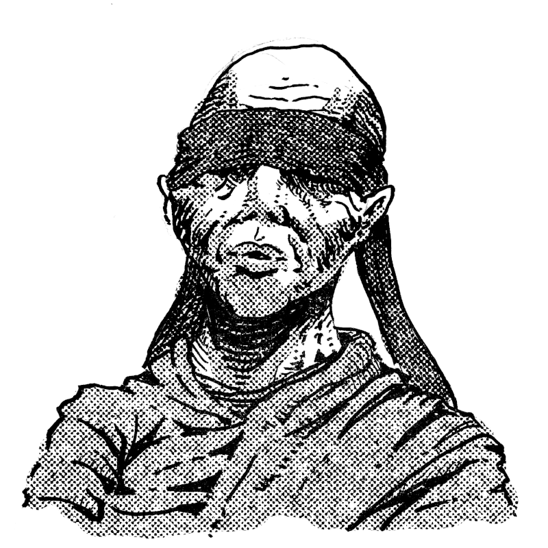
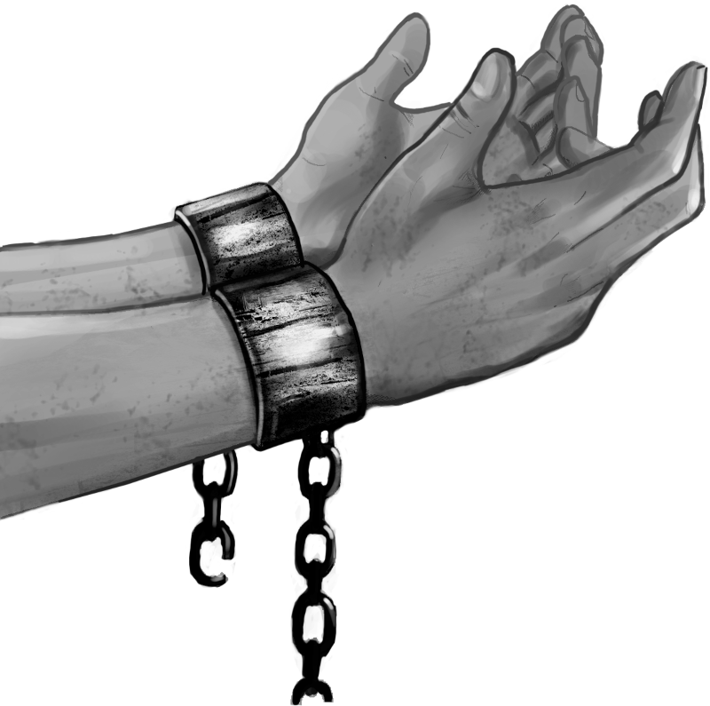
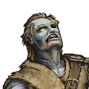
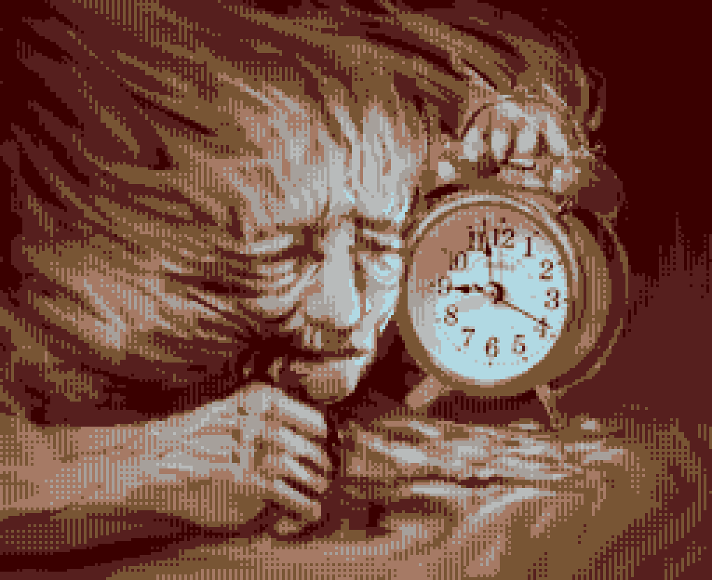
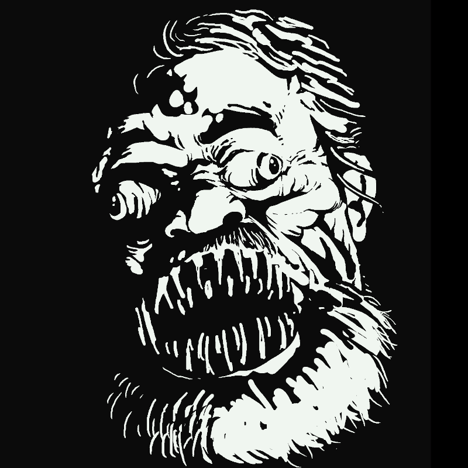
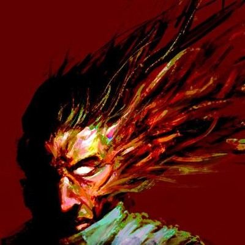

:::: afflictions-rules

 

# Afflictions

  

## Le principe
Las cartes ~~Afflictions~~ sont une mécanique de jeu optionelle
qui introduit un nouveau type de **conséquence** pour les personnages :
lorsque la situation s'y prête, un **jet d'action ou de résistance**
qui tourne mal (⚀ / ⚁ / ⚂) peut être l'occasion pour le MJ de donner
l'une de ces cartes à un joueur.

Une ~~Affliction~~ représente un **handicap durable**,
qui réduit les capacités du personnage affecté.
Chaque carte comporte la description de son effet :

> Lorsque tu réalises un **jet d'action**, lance les dés et place **le meilleur dé** obtenu sur cette carte.
>  
> Ne prends pas en compte ce dé pour déterminer le résultat de ton jet.

Pour se débarasser d'une ~~Affliction~~, un personnage doit trouver la solution adéquate : parfois il suffit d'un peu de temps (pour se reposer ou qu'un rituel se dissipe), mais de l'aide ou des ressources peuvent être requises (un médecin, un haruspice, etc.), ou peut-être un **jet d'action** (pour se libérer d'une entrave, éliminer un cultiste, réaliser un projet à long terme...).

 

## Exemples
Les pages suivantes proposent quelques ~~Afflictions~~ illustrées,
mais voici quelques autres idées :

::: right-align-1st-column with-borders with-headings

Afflictions | Afflictions occultes
-|-
éreinté | éthéré
paniqué | peau purulente
saoûl | pétrifié

:::

 

Ce module pour _Blades in the Dark_ est une création de Lucas Cimon - [ludochaordic @ chezsoi.org](https://chezsoi.org/lucas/blog/) - [jeux sur itch.io](https://lucas-c.itch.io/).
Les illustrations proviennent du jeu [Battle for Wesnoth (github.com)](https://github.com/wesnoth/resources) et du [Chao's Art Pack (itch.io)](https://chaoclypse.itch.io/chaos-art-pack-pwyw).

:::: <!-- end of .afflictions-rules -->

:::: afflictions

::: affliction

## Affliction

---

Lorsque tu réalises un **jet d'action**, lance les dés
et place **le meilleur dé** obtenu sur cette carte.
 
Ne prends pas en compte ce dé pour déterminer le résultat de ton jet.

::: <!-- end of .affliction -->

::: affliction

## Affliction

---

Lorsque tu réalises un **jet d'action**, lance les dés
et place **le meilleur dé** obtenu sur cette carte.
 
Ne prends pas en compte ce dé pour déterminer le résultat de ton jet.

::: <!-- end of .affliction -->

::: affliction

## Affliction

---

Lorsque tu réalises un **jet d'action**, lance les dés
et place **le meilleur dé** obtenu sur cette carte.
 
Ne prends pas en compte ce dé pour déterminer le résultat de ton jet.

::: <!-- end of .affliction -->

::: affliction

## Affliction

---

Lorsque tu réalises un **jet d'action**, lance les dés
et place **le meilleur dé** obtenu sur cette carte.
 
Ne prends pas en compte ce dé pour déterminer le résultat de ton jet.

::: <!-- end of .affliction -->

::: affliction

## Affliction

---

Lorsque tu réalises un **jet d'action**, lance les dés
et place **le meilleur dé** obtenu sur cette carte.
 
Ne prends pas en compte ce dé pour déterminer le résultat de ton jet.

::: <!-- end of .affliction -->

::: affliction

## Affliction

---

Lorsque tu réalises un **jet d'action**, lance les dés
et place **le meilleur dé** obtenu sur cette carte.
 
Ne prends pas en compte ce dé pour déterminer le résultat de ton jet.

::: <!-- end of .affliction -->

:::: <!-- end of .afflictions -->

:::: afflictions

::: affliction

## Affliction

# Aveugle

Lorsque tu réalises un **jet d'action**, lance les dés
et place **le meilleur dé** obtenu sur cette carte.
 
Ne prends pas en compte ce dé pour déterminer le résultat de ton jet.

::: <!-- end of .affliction -->

::: affliction

## Affliction

# Aveugle

Lorsque tu réalises un **jet d'action**, lance les dés
et place **le meilleur dé** obtenu sur cette carte.
 
Ne prends pas en compte ce dé pour déterminer le résultat de ton jet.

::: <!-- end of .affliction -->

::: affliction

## Affliction

# Entravé

Lorsque tu réalises un **jet d'action**, lance les dés
et place **le meilleur dé** obtenu sur cette carte.
 
Ne prends pas en compte ce dé pour déterminer le résultat de ton jet.

::: <!-- end of .affliction -->

::: affliction

## Affliction

# Entravé

Lorsque tu réalises un **jet d'action**, lance les dés
et place **le meilleur dé** obtenu sur cette carte.
 
Ne prends pas en compte ce dé pour déterminer le résultat de ton jet.

::: <!-- end of .affliction -->

::: affliction

## Affliction

# Empoisonné

Lorsque tu réalises un **jet d'action**, lance les dés
et place **le meilleur dé** obtenu sur cette carte.
 
Ne prends pas en compte ce dé pour déterminer le résultat de ton jet.

::: <!-- end of .affliction -->

::: affliction

## Affliction

# Empoisonné

Lorsque tu réalises un **jet d'action**, lance les dés
et place **le meilleur dé** obtenu sur cette carte.
 
Ne prends pas en compte ce dé pour déterminer le résultat de ton jet.

::: <!-- end of .affliction -->

:::: <!-- end of .afflictions -->

:::: afflictions

::: affliction

## Affliction occulte

# Ralenti

Lorsque tu réalises un **jet d'action**, lance les dés
et place **le meilleur dé** obtenu sur cette carte.
 
Ne prends pas en compte ce dé pour déterminer le résultat de ton jet.

::: <!-- end of .affliction -->

::: affliction

## Affliction occulte

# Ralenti

Lorsque tu réalises un **jet d'action**, lance les dés
et place **le meilleur dé** obtenu sur cette carte.
 
Ne prends pas en compte ce dé pour déterminer le résultat de ton jet.

::: <!-- end of .affliction -->

::: affliction small-title

## Affliction occulte

# Transformation ichtyene

Lorsque tu réalises un **jet d'action**, lance les dés
et place **le meilleur dé** obtenu sur cette carte.
 
Ne prends pas en compte ce dé pour déterminer le résultat de ton jet.

::: <!-- end of .affliction -->

::: affliction small-title

## Affliction occulte

# Transformation ichtyene

Lorsque tu réalises un **jet d'action**, lance les dés
et place **le meilleur dé** obtenu sur cette carte.
 
Ne prends pas en compte ce dé pour déterminer le résultat de ton jet.

::: <!-- end of .affliction -->

::: affliction

## Affliction occulte

# Possédé

Lorsque tu réalises un **jet d'action**, lance les dés
et place **le meilleur dé** obtenu sur cette carte.
 
Ne prends pas en compte ce dé pour déterminer le résultat de ton jet.

::: <!-- end of .affliction -->

::: affliction

## Affliction occulte

# Possédé

Lorsque tu réalises un **jet d'action**, lance les dés
et place **le meilleur dé** obtenu sur cette carte.
 
Ne prends pas en compte ce dé pour déterminer le résultat de ton jet.

::: <!-- end of .affliction -->

:::: <!-- end of .afflictions -->
