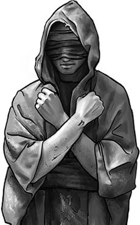

# Nouvelles règles
 

## Blessures
Lorsque votre personnage subit une Blessure,
notez-la sur votre feuille de personnage en fonction de sa gravité :

### Niveaux de Blessure
1 | **Temporaire** : un effet négatif qui disparaît naturellement avec le temps et ne nécessite aucun traitement pour récupérer. _Ensanglanté, confus, distrait, intimidé, exposé, séduit, assommé, fatigué, terrifié, affaibli._
-|-
2 | **Blessure durable** : blessures, affections ou déficiences sérieuses. _Tabassé, explosé, bras cassé, brûlé, commotion cérébrale, maudit, électrocuté, tailladé, poignardé, balle dans la jambe, assommé._
3 | **Blessure grave** : blessures graves qui peuvent neutraliser un personnage ou même menacer de devenir mortelles si elles ne sont pas traitées. _Saignement, côtes cassées, blessure profonde par arme blanche, empoisonné, crâne fissuré, balle dans la poitrine._
4 | **Blessure mortelle** : blessure mortelle ou mort instantanée, selon la situation. _Une balle dans la tête, poignardé dans le cœur, désintégré, noyé dans la mer du vide._

Vous avez de la place sur votre feuille de personnage pour noter deux Blessures de niveau 2 et une de niveau 3.
Si vous subissez une Blessure à un niveau déjà rempli, la Blessure passe au niveau de gravité supérieur.

Vous pouvez avoir un nombre illimité de Blessures de niveau 1, mais si vous subissez la même une seconde fois, passez-la au niveau 2.
Par exemple, si vous êtes _Fatigué_ et que vous le devenez à nouveau, effacez-le et notez _Fatigué_ au niveau 2.
Ce mécanisme ne fait jamais passer une Blessure au niveau 3.

### Réveiller une Blessure
Les niveaux de Blessure ne sont pas liés à des pénalités mécaniques spécifiques.
Au lieu de cela, le MJ peut **réveiller** une Blessure pour gêner le personnage, créant un problème ou une limitation pour lui.
Lorsque vous réveillez une Blessure en tant que MJ, choisissez l'une des options suivantes :

::: with-squares
* Introduire un **résultat négatif** ou un **nouveau problème** pour le personnage.
* Réduire une valeur d'Action et/ou d'Attribut pour un jet.
* Réduire la **position** ou l'**effet** du personnage.
:::
Lorsque une Blessure de votre personnage est réveillée, vous **gagnez un XP**.
N'hésitez pas à rappeler au MJ les blessures de votre personnage
lorsque vous pensez qu'ils pourraient s'appliquer à une situation.

### Encaisser
Si vous pensez que les conséquences d'un réveil de Blessure sont trop punitives,
ou que c'est simplement quelque chose que vous ne voulez pas gérer dans le jeu,
proposez un obstacle alternatif et discutez-en avec le MJ,
ou juste **encaissez-la** : prenez **1 Stress par niveau de Blessure** et tracez une ligne au-dessus.
Vous avez toujours la Blessure et devez vous en remettre,
mais elle ne peut pas être réveillée pour vous gêner.

### Se débarasser des Blessures niveau 1
Les Blessures de niveau 1 représentent des états temporaires qui peuvent gêner votre personnage.
Des choses comme, _Étourdi_, _Fatigué_ ou _Ensanglanté_.

Certaines Blessures de niveau 1 peuvent nécessiter une action pour s'en débarasser.
Par exemple, si vous êtes _Fatigué_, il vous faut un peu de repos pour éliminer cette Blessure.
Si vous êtes _Ensanglanté_, vous devez panser vos plaies.

D'autres types de Blessures de niveau 1 sont éliminées lorsque cela fait sens dans la fiction.
Si vous êtes _Intimidé_ par Bazso Baz, combien de temps cela dure-t-il ?
Est-ce passagé ou est-ce que cela perdure pendant un certain temps ?
C'est au joueur de décider, en fonction de la façon dont il décrit son personnage.

Les Blessures de niveau 1 ne sont cependant pas censées durer éternellement.
Après avoir été réveillées plusieurs fois, ou lors du _**Downtime**_,
supprimez vos Blessures de niveau 1.

### Survivre à une blessure mortelle
Si vous subissez une Blessure mortelle qui ne vous tue pas instantanément,
vous pouvez survivre si quelqu'un peut traiter la blessure et vous stabiliser en quelques minutes.
La Blessure mortelle reste sur votre feuille de personnage et doit être traitée durant une activité de **récupération**.
Notez également une **cicatrice** (une lésion permanente) comme un boitement, une douleur chronique, la perte d'un œil, etc.
Vous pouvez réveillez une cicatrice pour gêner votre personnage et **gagner un XP**, comme avec une Blessure.

## Trauma
Ce module rend la conséquence immédiate d'un traumatisme moins grave et offre une autre façon de gagner de l'XP.

---

Lorsque vous devez marquer 1 Stress mais que toutes vos cases sont cochées,
gagnez un **Trauma** pour votre personnage, cochez l'une des cases correspondantes,
puis supprimez tout votre Stress.
Entourez un des choix de la liste de votre feuille de personnage (_Froid_, _Hanté_, etc.)
ou inventez-en un.

Décrivez la réaction de votre personnage au traumatisme dans la situation actuelle,
en fonction du choix que vous venez de faire.
Vous décidez de l'intensité de cette réaction et si elle cause un problème à votre personnage.

### Réveiller un Trauma
Chacun des Trauma de votre personnage peut être réveillé une fois par session
pour créer un problème ou une complication pour lui.
Lorsque vous faites cela, **gagnez un XP**.

Cela remplace le gain d’XP en fin de session pour les Trauma.
Seul un joueur peut réveiller le Trauma de son personnage, pas le MJ ou les autres joueurs.

### Retraite et rétablissement
Lorsque vous marquez votre quatrième case de Trauma, votre personnage prend sa retraite.
Il n’a plus ce qu’il faut pour vivre la vie d’un malfaiteur.

Avant cela, vous pouvez peut-être vous remettre d’un Trauma.
Discutez avec le MJ pour créer un projet à long terme (ou autre chose) pour supprimer l’un de vos Traumas.
Le traumatisme de chaque personnage est personnel, et le chemin vers la guérison devrait l’être aussi.

  
<figure>
  
  <figcaption>
    <a href="https://wiki.wesnoth.org/Wesnoth:Copyrights#The_Battle_for_Wesnoth_-_Visual_and_Audio_Contributions">Oracle - Battle of Wesnoth</a> - <a href="http://creativecommons.org/licenses/by-sa/4.0/">CC BY-SA</a>
  </figcaption>
</figure>

<!--
## Équipement / Progression / Downtime / etc.
Non traduit - je m'en passe ou le système est mieux, mais pas intégré aux FPs, et j'ai la flemme de passer du temps à faire la conversion des anciennes barres de progression vers les nouvelles
-->

