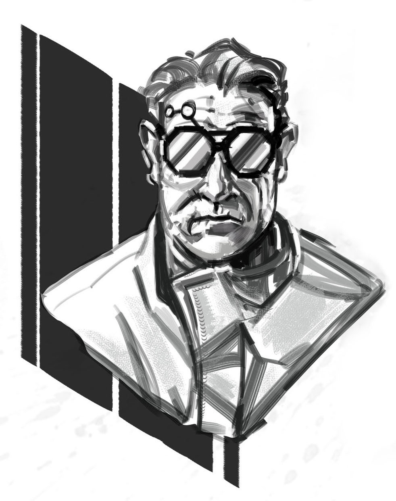

  

# Interrogation

  

The game offers an **Entanglement** called _Interrogation_:

> The Bluecoats round up one of the PCs to question them about the crew’s crimes.
> [...] You spend time in and out of jail, getting questioned and harassed by the law.
> It’s not the end of the world.
> But now that you’re here in the interrogation room, what kind of person are you?
> Do you talk? Do you stand up to them? Do you make a deal?

This **game module** for [Blades in the Dark](https://bladesinthedark.com/) invites you to develop these interrogation scenes, to make them crucial moments, where the PCs are put under pressure by the _Inspectors_, where they have a lot to lose, and where the situation will be resolved by memorable _roleplay_ moments.

_**Warning**_: the goal here is to place the players in conditions close to those of a real police interrogation, and to **stress** them out. Some players do not enjoy playing such scenes at all, so only use this game module after consulting them, and if this idea suits them.
Also ask them, in advance, how comfortable they are with their alter-egos experiencing police violence.

 

## Interpellation
An interrogation scene can make a great **opening sequence** for a gaming session.
As a GM, knowing **which PC will be interrogated** is very handy,
and will allow you to prepare this special scene in advance.
It is also possible to improvise such a sequence while playing,
if the opportunity arises and you feel able to make it up as you go along.

Ideally, a PC would have been **arrested by the Bluecoats** at the end of the previous session.
If this situation does not happen spontaneously, here are some ways to introduce the interrogation:
* in a situation where the Bluecoats are not aware of the PCs' illicit activities, it may seem more prudent for the crew to keep a “low profile”, cooperate and follow them to the station for a “routine interview”, rather than to trigger a confrontation in a situation to their disadvantage, risking for example to reveal their lair, or to betray the secret identity of one of them.
* an interrogation can be a **bad consequence** of a PC **overindulging** and who provokes a fight or “talks too much” while an informant is present...
* during a chase with the Bluecoats, capture can be a possible **consequence** of a failed escape, which a PC cannot **resist** due to lack of stress points.
* you can propose the interrogation as a variation of the **entanglement** _Arrest_, or an alternative to the time-out activity **reduce ~~heat~~**: the police have suspicions about a PC, but if they agree to be questioned at the station, the crew will lose a ~~wanted level~~.
* a crew contact among the Bluecoats can offer them **a deal**: deliver them valuable information or an object from the seal room, if they agree in exchange for a PC to “get captured” through this corrupt contact, which will earn them a bonus, or even a promotion.

<!-- Start of page 2 -->

## Preparations
In order to create dramatic tension around the table, it is better to prepare for the interrogation,
in order to destabilize the players, and give rise to beautiful moments of improvisation.

  

### The stakes
A number of negative consequences can arise from this interrogation:
* the PC can consume their last point of **stress** and obtain a new ~~trauma~~.
* the crew can see its level of ~~heat~~ increase, or even gain a ~~wanted level~~.
* the PC can be **incarcerated** in prison, if the interrogation confirms the suspicions weighing on them.

But above all, by cooking the PC, the Bluecoats could obtain valuable **information** from them.

<u>List on a sheet of paper</u>, before the interrogation, what law enforcement might discover
based on previous events in your current campaign:
* location of the crew's lair, and their **stash**.
* **allied NPCs**: whether these contacts are accomplices or not, they can then also be questioned...
* **illegal activities** committed by the crew, or other gangs: scores, murders, bribes, trafficking...
* **links** between different people or ongoing investigations, still unknown to the Bluecoats.
* **evidence** of crimes committed, via recorded testimonies or incriminating objects.

This list will serve as a handy reference to guide the interrogation,
try to obtain information from the PC being questioned,
and perhaps even push them to betray themself or their accomplices.

   

### The Inspectors

The Inspectors are much more dangerous than simple Bluecoats.
They often come from the families of Akorosi ambassadors abroad,
and are trained into the imperial army.
They are both formidable fighters and peerless bloodhounds.
They are trained to **detect lies**, and you can use this special ability
to justify an Inspector guessing when a PC is disguising the truth.

The Inspectors will adopt different masks to make the suspects talk:
sometimes appearing good-natured and friendly,
they can quickly become inquisitive, inflexible, threatening.

During the interrogation, the GM plays the referring Inspector, in charge of leading the investigation involving the PCs.
He already has a very complete file on one or more PJs,
including their known activities, their criminal history, and some psychological profile elements.

This is optional, but we recommend that you **involve another player** in the interrogation,
by temporarily giving them **the role of a second Inspector**, a partner of the referring Inspector.
Their role is described in detail in the appendix, on a sheet to be given to the player as an interpretation guide.
In short, according to a “good cop, bad cop” strategy, their role will be to be **the bad cop**.

 

:::insert float-right
### Examples of violations
From the Doskvol penal code:
* criminal association
* conspiracy or insurrection against the Immortal Emperor
* kidnapping or sequestration
* extortion of goods or information
* delivery of confidential information to a foreign power
* murder, with or without premeditation
* insult to an agent of institutions, the church or the nobility
* opening or altering the lightning barriers protecting the city
* promotion of a prohibited cult
* concealment
* refusal to comply with an order from the Bluecoats
* trafficking of illegal goods
* home invasion
* robbery
:::

### Their tools
In order to obtain the information they are looking for,
in addition to the buildings and Bluecoats at their disposal,
Inspectors have traditional legal tools at their disposal:
* law enforcement's **network of informants** provides them with extensive knowledge of criminal activities.
* the threat of severe **sanctions** provided for by Doskvol's penal code, including incarceration in a penitentiary, forced labor for life, or even the scaffold.
* their role as prosecutor allows them to keep suspects in **detention** for as long as they wish.
* Inspectors will not hesitate to use **violence**, verbal and physical, to intimidate suspects.
* in the interrogation room, a **recording gramophone** allows them to record everything that is said.

        <!-- size8 => 8rem => 8 line breaks -->

   

In Doskvol, Inspectors also have more **esoteric** tools:
* an array of **alchemical** potions and drugs, including _Spark_, _Quicksilver_ and _Sight_,
but also the _Serum of Truthfulness_ (IV/1, rare) capable of forcing a character to **answer without lying** to 6 questions,
minus the highest die of a **Resistance roll** (~~Resolve~~).
* they can use a **Ghost** to **possess a suspect**, and thus search their memory,
forcing them to **answer without lying** to 6 questions,
minus the highest die of a **resistance roll** (~~Resolve~~) to fight against the grip of the specter.
 
Inspectors generally only use this latter technique as a last resort,
because it can happen that the possession goes wrong, giving the suspect supernatural abilities...
* Inspectors can sometimes **bring a victim back from the dead**, temporarily attaching their spirit to a **Hull**
for them to testify, and thus confront a suspect with the testimony of a dead man.
They always use the same envelope, the bust of an automaton placed on the table,
with an expressionless face that contrasts with the lamentations of the imprisoned spirit.

 

<h3 id="page-4">What they already know</h3>

The suspect PC is linked to one or more crimes, and has been mentioned by witnesses or victims.

<u>List on a sheet of paper</u> what the Inspectors already know or suspect about the PC being questioned:
* vices of the PC and possibly associated past excesses while overindulging
* crimes for which the PC is suspected
* other illegal activities with which the PC or the crew may have been associated
* **traces** which were left by the PC during these misdeeds:
    + objects left on the premises
    + use of weapons that the PC continues to use
    + testimonies of witnesses and victims

::: info fingerprint
This last list of **traces**, in particular, will constitute the main material for the Inspectors to try to trap the suspect PC, and extort information by confronting them with these contradictions.
:::

  

## The place
When the targeted PC is arrested for questioning, they will be taken to a nearby **City Watch post**.

This is an opportunity to provide your players with a description of the location that reflects the **sense of oppression** it exudes.
You can read the text below, or take inspiration from it to design your own decor.

> The Bluecoats lead you through the city to a nearby barracks.
> In front of you stands a large stone building.
> The place was once a river customs post, and spans three arches of a partly collapsed bridge,
> that is still used by the City Watch to moor several boats.

> Several guards patrol the curtain walls of the barracks, rifles in hand.
> All the windows have steel bars, and a portcullis is raised at your entrance into the interior courtyard.
> Inside the barracks, the Bluecoats stare at you with a stern look.
> Once the portcullis comes down behind you, they search you and place all your possessions in a large burlap bag.

> You are then led through a maze of small corridors to a cell,
> where you are asked to wait before the interrogation, without telling you how long.
> The place is cramped, stinks of piss, and you can see bloodstains on the thick sandstone wall.
> In a nearby cell, a man lies prostrate in a corner, sobbing and mumbling incomprehensible things.
> He seems to have regressed to the behavior of a harassed animal, and growls when you meet his gaze.

## Grilled
Here we go!
Tell the players that you are going to play a sequence of pure _roleplay_,
in **real time** without interruption or asides,
and that to create an immersive atmosphere, off-side comments should be avoided until the end of the scene.

The interrogation begins when Bluecoats come to take the PC from their cell
to bring them to **the interrogation room**.
The guards are vigilant, and armed with **electroplasmic stun batons**.
The interrogation room is austere, with only a table and two chairs.

::: info handcuffed
If the PC came to the station against their will, for example because they were _caught_, they are restrained by **handcuffs** behind their back.
Once seated in the interrogation room, these restraints are attached to a metal chain firmly attached to the floor.
:::

For more immersion, it may be interesting to reproduce the same situation at the gaming table:
* questioned PC player sitting on a chair, hands behind their back, possibly tied loosely with a string so that they do not forget that they are restrained. A lamp on the table can be shined on them.
* GM playing the referring Inspector sitting across the table.
* other players slightly behind the table, in observation.
* player embodying the second Inspector who remains standing, towering over the seated player, and constantly circling around them while addressing them.

You can even make the suspect wait in a separate room, while you briefly explain
to the other players how the scene will unfold, then ask one of them to play as a Bluecoat,
bring the accused in, and then put the string around their wrists.

The following sections detail the different tactics successively employed by the Inspectors
to extract information from the PC.

 

### Tactic 1. Appear harmless and friendly
During this first phase, the referring Inspector is alone.
Their objective will be to appear **friendly and almost incompetent** to the suspect,
by putting them at ease, so that they “lower their guard”.

Here are some ways to proceed during this introduction:
* offer **to drink** and **to eat**.
* **flatter** the suspect: “well done, you have heart”, “very clever”, “oh, bold”, etc.
* highlight **common points** between the Inspector and the suspect: values, principles, appetite for the same vices, political opinions, NPCs who are common acquaintances, etc.
* demonstrate familiarity and **connivance**: “ah ah, very funny, I like you”, “well, that doesn’t come out of here, but I definitely agree with you”, “they only got what they deserved,” etc.
* treat the situation as **anecdotal** and express a desire to “resolve this quickly”.
* start with questions to which the suspect will answer “yes”, to provoke an **unconscious acceptance mechanism**, a common _marketing_ technique. “Is your name _< PC name >_?” “You declared that you exercise the profession of _<...>_, is that correct?” “Looking at your file, I see that you come from _< PC heritage >_ and have a background in _< PC background >_, is that correct?”
* appear **hesitant** about the exact procedure to follow, ask irrelevant questions, about **details** of the PC's activities, hoping to provoke **lies** from them, which will then be used to to confuse.

 

During this first sequence, take notes as if you were writing a report.

The objective is to try to push the suspect into **complicit confession**,
to loosen their tongue so that they provides information that they believe is not very incriminating,
see that they engage in lies on matters where they do not wish to tell the truth.

### Tactic 2. Good cop, bad cop
At a sign from the GM, the player who plays the second Inspector enters the scene.
The referring Inspector introduces their colleague in a few words, appearing to disapprove of their “lack of manners”.

During this sequence, the objective is to appear as the **lifeline** to the suspect,
by being reassuring, calm, almost benevolent.
It's a kind of ping-pong: when the “bad cop” has sufficiently destabilized the PC being questioned,
the referring Inspector takes control, tempering: “Let’s calm down, let’s calm down. Come on sir, help me see things clearly and you will soon be released.”

While continuing to play the “good cop”, it’s time to direct the interrogation to the heart of the matter
and, little by little, **question the PC about their involvement** in the various cases in which they are suspected.

 

:::insert float-left
### Inspectors lie
As in “real life”, Doskvol Inspectors are absolutely **not** required to tell the truth during interrogation, although this is a common belief, as they represent the order and authority.

Here are all their **false promises**:
* items confiscated from you will not be inspected and will be returned to you.
* the judge will be lenient, the Inspectors will plead in your favor.
* the sentence will be heavy (“bad cop”) or it will be light (“good cop”).
* they already know the whole thing, they just need you for details.
* if you cooperate, leak information or admit to certain acts, they will not go any further.
* the information you give them will not be communicated to anyone.
:::

### Tactic 3. False bargaining
While their sidekick continues their role as “bad cop”, the referring Inspector adopts a new strategy:
**minimize the seriousness of the facts**, in comparison with other crimes, other gangs,
in order to alleviate the PC's fears that the punishment would be too harsh.
If the suspect “falls to the bait” and appears to be receptive, they gradually offer
to **recognize certain charges** that weigh against them, to satisfy their hierarchy and end this interview:
a part of complicity perhaps, a small secondary role in certain criminal activities.

> “Come on, we both know that you're not as white as snow. Grant me a misdemeanor and I'll end this.”

The referring Inspector also agrees with the suspect and their crew,
by expressing that **they understand** them completely, that they have sympathy for their ethics, their principles,
that ultimately in this matter **the person responsible is someone else**:
either, depending on the case, corrupt institutions, the stupidity of the people, the greed and unreliability of other gangs, or even incompetent Bluecoat colleagues.

 

### Tactic 4. Quicksand
::: info magnifying-glass
This is the time to confront the suspect with the most damning **evidence** gathered by the Inspectors: present them with all the **traces** that you have listed in preparation, and ask them to provide a coherent explanation.
:::

It's time to come back to **all the lies of the PC**, which they have stated since the beginning of the interrogation,
and to confront them with their inconsistencies, their contradictions.
The suspect is likely to sink, drowning in their lies, while the Inspectors constantly ask them more questions.
The notes you took from the beginning will be very valuable to you here.

The more dissonance there is in the PC's words, the more the Inspectors will evoke the seriousness of the charges against them.
It's time for the referring Inspector to play the **lifeline** card:
they ask their colleague to load them two drinks, approach the accused,
and offer them **one last deal**, to choose from depending on the circumstances:
* the suspect **throws out their comrades**, all the big fish in the gang, and they can leave Doskvol free.
* the suspect **dives alone**, they assume all the charges, and their comrades will not be worried.
* the suspect acknowledges the facts, and signs their testimony, but the Inspector keeps it “confidential”, and the PC becomes an **informant** for them.

<h3 id="page-7">Tactic 5. The hard way</h3>

At this stage of the interrogation, the Inspectors believe that they will not get nothing more out of the suspect through trickery and discussion.
They therefore decide to use the **esoteric tools** detailed in a previous section:
alchemy, possession by a Ghost or confrontation with the spirit of a victim in a Hull.
Two of these approaches are resolved with a resistance roll, the third gives you the opportunity to continue the _roleplay_:
chose what is most relevant to the scene at this point.

From experience, the confrontation with the specter of a victim of the PC is really fun to play.
I recommend that you **entrust another player to play this ghost** for the duration of the scene,
by warning them before the interrogation so that they have time to prepare.

You can also consider having the Inspectors physically **torture** the interrogated PC.
They will use _Potions of Vitality_ and _Vital Essence_ to treat the suspect and prolong the abuse,
see _Drowning Powder_.
However, [torture does not work (link)](https://www.amnesty.org/en/what-we-do/torture/).
Inspectors will therefore not obtain any useful information by this method.

 

 

### Interludes
From the moment the second Inspector come into play,
it may be interesting to take breaks between the different sequences and associated tactics,
according to what you consider to be the most appropriate to give rhythm to the interrogation.

These interludes are an opportunity to return the suspicious PC **to their cell**.
It is also an opportunity to reduce tension around the table,
to escape from the dramatized immersion of the interrogation,
and debrief a little if necessary with all the players around the table.

Finally, these moments in the cell are an opportunity for the PC to try to escape,
or to contact their associates outside.
However, their conditions of detention are deliberately unsuitable for rest,
and they will therefore not be able to rest and recover their **stress** points.

If you wish, the continuation of the interrogation can then be done with **another Secondary Inspector**,
played by another player.

## Outcome
The interrogation can be concluded in several ways.

1. the PC can be **released**: either they have managed to bluff the Bluecoats, or they simply prefer to let them go so that they do not suspect anything, and prepare a more ambitious raid later.

2. the PC can be **indicted**, and placed in detention until their trial, if sufficient incriminating elements are established by the police. A **score** will be necessary to make them escape out of the post or Ironhook.

3. the PC can decide to try to **escape**: then make an **Action roll**.
Depending on how they go about it and the result of the roll, the PC may then find themself in a chase through the Bluecoats lookout post. Conversely, **complications** may arise, such as their arrest for _assault against a peace officer_. The interrogation can then continue in a more vigorous manner, or the PC can be directly **incarcerated**.

4. the PC can try to **buy time**, and **alert** the rest of the crew so that they can make them escape, by force or by trickery. Again, all of this can be resolved by **Action rolls**.

Players may want to set sail from the beginning of the questioning,
which could ruin your intention to stage an interrogation...
This is another good reason to lay your cards on the table with the players beforehand,
by explicitly stating your intention to play this kind of scene.
Then, if they consider escaping, simply suggest that they wait until after the first interview with the Inspectors.

::: info despair
Be very vigilant about the well-being of the player playing the questioned PC:
the objective is to establish a situation conducive to _roleplay_, with a bit of dramatic stakes,
but above all **not** to make players uncomfortable.
Cut the scene short if the tension becomes too unpleasant for some of you.
:::

The end of the scene can also be a good time to debrief with the players:
talk about what they liked more or less,
and discuss a little about real interrogations and police violence...

### Consequences
However this scene ends, players may feel like the case is closed,
and even if the interrogation was intense, that its repercussions are minimal...

But for the GM, the information collected by the Bluecoats constitutes fertile ground for **future threats**.
<u>Write down</u> what law enforcement has learned, and determine how they will use it, by setting new **progress counters** for upcoming events:
* **police intimidation**: The Bluecoats go around all of the crew's allies, shaking them down to extort more information. Who will crack? And what are they likely to reveal?
* **raid**: heavily armed, the police attack one of the PCs' lairs.
* **red-handed**: the Bluecoats prepare a trap for the crew, to catch them in the act of criminal activity.
* **arrest**: the police decide to arrest and charge another PC, following the information provided by the one questioned. Nothing like it to sow doubt and discord in the crew!

Depending on your play style, you can keep these counters hidden, or make them public, without revealing all details... ◔ ◑ ◕ ●

:::: insert large
## Second Inspector Sheet
During this scene, your name is _____________.
You are a young Inspector, that recently completed training.
You are fierce, and want to prove yourself, even if it means being zealous.

Your role will be to help the referring Inspector obtain information from the suspect being questioned.
He will lead the interrogation.
According to a “good cop, bad cop” strategy, your role will be to be **the bad cop**,
and **put pressure** on the suspect.

Here are some tactics to achieve this:
* question the suspect about **unpleasant and uncomfortable topics**.
* **occupy the physical and sound space**: gesticulate, raise your voice, question the seated suspect whom you tower over from above and glare at them, constantly pace the room around them...
* **slam your fist** on the table, shines the lamp on the player being questioned.
* formulate **threats**: physical violence, repercussions on their loved ones, on the duration of their detention, on the sanctions they risk (incarceration in Ironhook, forced labor for life, scaffold...), etc. .
* **make fun** of the suspect, insult them: “you fungal residue”, “soulless butcher”, “crow of misfortune”, “you stink of rotten crap”, “crook”, “you don't have no morals, I have no respect for people like you”, “gillyfoot turd”, etc.
* **note the contradictions** in the player's words, to then accuse them of lying, that their lies betray their guilt, that this was recorded and that it will be used against them before the judges.

::: info hound
In reality, your character is neither **impulsive**, nor **angry**, nor **contemptuous**.
It's a tactic you knowingly use to allow your partner,
the referring Inspector, to obtain confessions from the suspect.
It may be useful to slip away at the right time, to make room for confessions...
:::
::::

 

## Acknowledgments
Many thanks to the authors of [Small manual of self-defense in interrogation](https://www.editionsducommun.org/products/petit-manuel-dautodefense-en-interrogatoire), which served as inspiration for me for this game module.

Thanks to [Elliot Jolivet aka Tensei](https://www.artstation.com/ej_tensei) for the illustrations used in this game module, which he created especially for _Blades in the Dark_. You can find some other illustrations he created on the [Reddit thread r/bladesinthedark](https://www.reddit.com/r/bladesinthedark/comments/16quv7u/comment/k1z9cz6/).

The illustration of the automaton comes from the collection [108 Terrible Character Portraits](https://www.drivethrurpg.com/product/91360/108-Terrible-Character-Portraits) by [Jeff Preston](http://team-preston.com) ([CC BY 3.0](https://creativecommons.org/licenses/by/3.0/)),
the icons from [game-icons.net](https://game-icons.net),
and the city illustrations of paintings from the [_History of Angers_ trail of its Museum of Fine Arts](https://musees.angers.fr/lieux/musee-des-beaux-arts/).

Thanks to the reviewers & testers of this game module: Aurélien, Elliot, Matthieu, Thomas.

Finally, many thanks to the developers of the [free software](https://fr.wikipedia.org/wiki/Free/Libre_Open_Source_Software) used to create this document: [the Firefox browser](https://www.mozilla.org/firefox/), [Gimp drawing software](https://www.gimp.org/), [Notepad++ text editor](https://notepad-plus-plus.org/), [the Sumatra PDF reader](https://www.sumatrapdfreader.org), [the Python language](https://www.python.org/), [translate-shell](https://github.com/soimort/translate-shell) and the code libraries [mistletoe](https://pypi.org/project/mistletoe/) (Markdown → HTML) & [weasyprint](https://weasyprint.org/) (HTML → PDF).

 

## License & feedback

This game module was created by Lucas Cimon and is licensed under the <a rel="license" href="http://creativecommons.org/licenses/by-nc/4.0/">Creative Commons Attribution-NonCommercial 4.0 International</a> license.

The source files used to generate this PDF are available [on GitHub](https://github.com/Lucas-C/jdr/tree/master/BladesInTheDark). Version: 1.0

This game module is distributed at a free price.
If you want to support my projects, you can donate at [lucas-c.itch.io](https://lucas-c.itch.io/blades-in-the-dark-interrogation).
I would also be delighted to have your feedback if you use it:
tell me how your game went via a comment on [lucas-c.itch.io](https://lucas-c.itch.io/blades-in-the-dark-interrogation) or on [my blog](https://chezsoi.org/lucas/blog/blades-in-the-dark-interrogatoires.html).

<!--

Com'

* [x] https://lucas-c.itch.io/interrogation
* [x] https://bladesinthedark.com/fan-creations
* [x] https://community.bladesinthedark.com/t/module-supplement-interrogation/2902
* [wip] https://rpggeek.com/rpg/26952/blades-in-the-dark

-->
