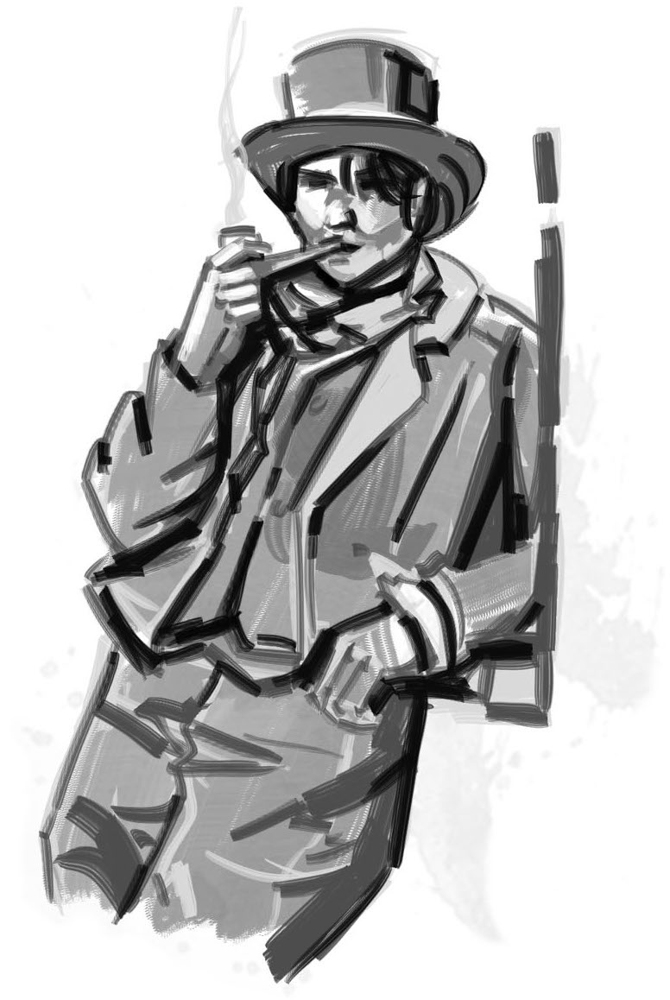

  

# Interrogatoires

  

Le manuel du jeu propose un **imbroglio** nommé _Interrogatoire_ :

> Les Manteaux Bleus capturent l'un des PJ pour l'interroger sur les crimes de la bande. [...]
> Les crapules comme vous passent leur temps à entrer et sortir de prison, à être interrogés et harcelés par les forces de l'ordre.
> Ce n'est pas la fin du monde. Mais maintenant que vous êtes ici dans la salle d'interrogatoire,
> quel genre de personne êtes-vous ? Est-ce que vous parlez ? Leur tenez-vous tête ? Est-ce que vous passez un marché ?

Cette **aide de jeu** vous propose de développer ces scènes d'interrogatoire, pour en faire des moments cruciaux, où les PJs sont mis sous pression par les _Inspecteurs_, où ils ont beaucoup à perdre, et où la situation se résoudra par des moments de _roleplay_ mémorables.

_**Avertissement**_ : le parti-pris ici est de placer les joueurs dans des conditions proches de celles d'un véritable interrogatoire de police, et de générer un véritable **stress** chez eux. Certains joueurs n'apprécient pas du tout de jouer de telles scènes, n'employez donc cette aide de jeu qu'après les avoir consultés, et si cette proposition ludique leur convient.
Demandez-leur également, en amont, à quel point ils sont à l'aise pour que leurs alter-egos subissent des violences policières.

 

## Interpellation
Une scène d'interrogatoire peut constituer une excellente **séquence d'ouverture** d'une session de jeu.
En tant que MJ, savoir à l'avance **quel PJ sera interrogé** est très pratique,
et vous permettra de préparer cette scène avant la partie.
Il est aussi possible de dérouler une telle séquence en cours de partie,
si l'occasion se présente et que vous vous sentez capable de tout improviser.

Idéalement, un PJ peut avoir été **arrêté par les Manteaux Bleus** au terme de la session précédente.
Si cette situation ne se présente pas spontanément, voici quelques manières d'amener l'interrogatoire d'un PJ :
* dans une situation où les Manteaux Bleus ne paraissent pas au courant des activités illicites des PJs, il peut sembler à ces derniers plus prudent de faire « profil bas », coopérer et les suivre au poste pour une « entrevue de routine », plutôt que de déclencher un affrontement dans une situation à leur désavantage, risquant par exemple de révéler leur planque ou de trahir l'identité de l'un d'eux.
* un interrogatoire peut être une **conséquence** d'un PJ qui **sombre dans l'excès** après s'être adonné à son Vice, et qui provoque une rixe ou qui « parle trop » alors qu'un indic est présent...
* lors d'une course-poursuite avec les Manteaux Bleus, la capture peut être une **conséquence** possible d'une fuite ratée, à laquelle un PJ ne peut **Résister** par manque de points de stress.
* vous pouvez proposer l'interrogatoire comme une variation de l'**imbroglio** _Arrestation_, ou une alternative à l'activité de temps mort _Réduire le raffut_ : les forces de l'ordre ont des soupçons sur un PJ, si celui-ci accepte de venir au poste pour être interrogé, le Raffut de la bande sera **réduit de moitié**.
* un contact de la bande chez les Manteau Bleus peut leur proposer **un marché** : leur livrer une information précieuse ou un objet issu de la salle des scellés, s'ils acceptent en échange qu'un PJ « se fasse capturer » par ce contact ripou, ce qui lui vaudra une prime, voir une promotion.

<!-- Start of page 2 -->

## Préparatifs
Afin de créer de la tension dramatique autour de la table, mieux vaut préparer l'interrogatoire, pour déstabiliser les joueurs et donner lieu à quelques beaux moments d'improvisation théâtrale.

  

### Les enjeux
Un certain nombre de conséquences négatives peuvent découler de cet interrogatoire :
* le PJ peut consommer son dernier point de **Stress** et obtenir un nouveau **Trauma**.
* la bande peut voir son niveau de **Raffut** augmenter, voir gagner un niveau d'**Avis de recherche**.
* le PJ peut être **incarcéré** en prison, si l'interrogatoire confirme les soupçons pesant sur lui.

Mais surtout, en cuisinant le PJ, les Manteaux Bleus pourraient obtenir de lui de précieuses **informations**.
<u>Listez sur une feuille de papier</u>, avant l'interrogatoire, ce que les forces de l'ordre pourraient découvrir selon les événements précédents de votre campagne en cours :
* emplacement de la planque de la bande, et de leur **Magot**.
* des **PNJs alliés** : que ces contacts soient complices ou non, ils pourront ensuite être aussi interrogés...
* des **activités illégales** commises par la bande, ou d'autres gangs : _Coups_, meurtres, pots de vins, trafics...
* des **liens** entre différentes personnes ou enquêtes en cours, inconnus des Manteaux Bleus.
* des **preuves** sur des crimes commis, via des témoignages enregistrés ou des objets incriminants.

Cette liste vous servira à orienter l'interrogatoire, pour essayer d'obtenir des informations du PJ interrogé,
voir de le pousser à se trahir ou à trahir ses complices.

   

### Les Inspecteurs

Les Inspecteurs sont des gendarmes d'élite.
Ils sont souvent issus des familles d'ambassadeurs Akorosi à l'étranger,
et ont été entraînés dans l'armée impériale.
Ce sont à la fois de redoutables combattants, et des limiers hors pair.
Ils sont entraînés à **détecter les mensonges** et, sans en abuser, vous pouvez employer cette capacité spéciale
pour parfois justifier qu'un Inspecteur devine lorsqu'un PJ déguise la vérité.

Les Inspecteurs adopteront différents masques pour faire parler les suspects :
apparaissant tantôt débonnaires et sympathiques,
ils n'auront aucune difficulté à devenir inquisiteurs, inflexibles, menaçants.

Durant l'interrogatoire, le MJ incarne l'Inspecteur principal, en charge de mener l'enquête impliquant les PJs.
Il possède déjà un dossier très complet sur un ou plusieurs PJs,
incluant leurs activités connues, leurs antécédents judiciaires, et quelques éléments de profil psychologique.

C'est facultatif, mais pour éviter l'effet « spectateurs passifs »,
nous vous recommandons d'**impliquer un autre joueur** dans l'interrogatoire,
en lui donnant temporairement **le rôle d'un second Inspecteur**, binôme de l'Inspecteur principal.
Son rôle est décrit en détails en appendice, sur un feuillet à remettre au joueur comme guide d'interprétation.
En bref, selon une stratégie « bon flic, méchant flic », sont rôle sera d'être **le méchant flic**.

 

::: insert float-right
### Exemples d'infractions
Issues du code pénal de Doskvol :
* association de malfaiteurs
* conspiration ou insurrection contre l'Empereur Immortel
* enlèvement ou séquestration
* extorsion de biens ou d'informations
* livraison d'information confidentielle à une puissance étrangère
* meurtre, avec ou sans préméditation
* outrage à un agent des institutions, à l'église ou à la noblesse
* ouverture ou altération de la barrière électroplasmique protégeant la ville
* promotion d'un culte interdit
* recel
* refus d'obtempérer à un ordre des forces de l'ordre
* trafic de marchandises illégales
* violation de domicile
* vol
:::

### Leurs outils
Afin d'obtenir les informations qu'il recherchent,
en plus des bâtiments et des Manteaux Bleus à leur disposition,
les Inspecteurs disposent des outils judiciaires traditionnels :
* le **réseau d'informateurs** des forces de l'ordre leur fournit une connaissance étendue des activités criminelles.
* la menace de sévères **sanctions** prévues par le code pénal de Doskvol, incluant l'incarcération en pénitencier, les travaux forcés à perpétuité, ou même l'échafaud.
* leur rôle de procureur leur permet de garder les suspects en **détention** aussi longtemps qu'ils le souhaitent.
* les Inspecteurs n’hésiteront pas à faire preuve de **violence**, verbale et physique, pour intimider les suspects.
* dans la salle d'interrogatoire, un **gramophone enregistreur** leur permet d'enregistrer tout ce qui est dit.

         <!-- size8 => 8rem => 8 line breaks -->

   

À Doskvol, les Inspecteurs disposent aussi d'outils plus **ésotériques** :
* un attirail de potions et drogues **alchimiques**, dont notamment de l'_Étincelle_, du _Vif-Argent_ et des _Potions de Vision_,
  mais aussi du _Sérum de Véracité_ (IV/1, rare) capable de forcer un personnage à **répondre sans mentir** à 6 questions,
  moins le dé le plus élevé d'un **jet de résistance** (Détermination).
* ils peuvent employer un **Fantôme** pour **posséder un suspect**, et ainsi fouiller dans sa mémoire,
  le forçant à **répondre sans mentir** à 6 questions,
  moins le dé le plus élevé d'un **jet de résistance** (Détermination) pour lutter contre l'emprise du spectre.
   
  Les Inspecteurs n'emploient en général cette dernière technique qu'en dernier recours,
  car il peut arriver que la possession tourne mal, conférant au suspect des capacités surnaturelles...
* les Inspecteurs peuvent parfois **ramener une victime d'entre les morts**, attacher temporairement son esprit à une **Coquille**
  pour qu'il témoigne, et ainsi confronter un suspect à la déposition d'un mort.
  Ils emploient toujours la même enveloppe, un buste d'**automate** posé sur la table,
  au visage inexpressif contrastant avec les lamentations de l'esprit prisonnier.

 

### Ce qu'ils savent déjà

Le PJ suspect est en lien avec un ou plusieurs crimes, et il a été mentionné par des témoins ou des victimes.
<u>Listez sur une feuille de papier</u> ce que les Inspecteurs savent ou soupçonnent déjà du PJ interrogé :
* vices du PJ et éventuellement débordements passés associés
* crimes pour lesquels le PJ est suspecté
* autres activités illégales auxquelles le PJ ou sa bande ont pu être associés
* **traces** qui ont été laissées par le PJ lors de ces méfaits :
    + objets abandonnés sur les lieux
    + emploi d'armes que le PJ continue à utiliser
    + témoignages de témoins et victimes

::: info fingerprint
Cette dernière liste de **traces**, en particulier, constituera la matière principale des Inspecteurs pour essayer de piéger le PJ suspect, et lui soutirer des informations en le mettant face à ces contradictions.
:::

  

## Les lieux
Lorsque le PJ ciblé est arrêté pour être interrogé, il sera amené à un **poste du Guet de la Ville** à proximité.
C'est l'occasion de fournir à vos joueurs une description des lieux qui rende compte du **sentiment d'oppression** qu'il dégage.
Vous pouvez lire celle proposée ci-dessous, ou vous en inspirer pour concevoir votre propre décor.

> Les Manteaux Bleus te mènent à travers la ville jusqu'à une caserne proche :
> devant toi se dresse un grand édifice de pierre, amoncellement de plusieurs bâtiments accolés.
> Le lieu semble être un ancien poste de douane fluvial, et se prolonge avec trois arches d'un pont en partie effondré,
> mais toujours employé par le Guet pour amarrer plusieurs embarcations.

> Plusieurs gardes patrouillent sur les courtines de la caserne, arbalète à la main.
> Toutes les fenêtres comportent des barreaux d'acier, et une herse est relevée à ton entrée dans la cour intérieure.
> Dans l'enceinte de la caserne, les Manteaux Bleus te dévisagent d'un air sévère.
> Une fois la herse redescendue derrière toi, ils te fouillent et déposent toutes tes possessions dans un grand sac en toile de jute.

> Tu es ensuite mené à travers un dédale de petits couloirs jusqu'à une cellule,
> où l'on te demande d'attendre avant l'interrogatoire, sans te préciser combien de temps.
> L'endroit est exigu, pue la pisse, et tu distingues des tâches de sang sur l'épais mur de grès.
> Dans une cellule proche, un homme est prostré dans un coin, et sanglote en marmonnant de manière incompréhensible.
> Il semble avoir régressé au comportement d'un animal harassé, et gronde lorsque tu croises son regard.

            <!-- a page break should occur there -->

## Sur le gril
C'est parti !
Indiquez aux joueurs que vous allez jouer une séquence de pur _roleplay_,
en **temps réel** sans interruption ni aparté,
et que pour créer une ambiance immersive, les commentaires hors-jeu sont à éviter jusqu'à la fin de la scène.

L'interrogatoire commence au moment où des Manteaux Bleus viennent chercher le PJ dans sa cellule
pour l'amener dans **la salle d'interrogatoire**.
Les gardes sont vigilants, et armés de **bâtons paralysants électroplasmiques**.
La salle d'interrogatoire est austère, et ne comporte qu'une table et deux chaises.

::: info handcuffed
Si le PJ est venu au poste contre son gré, par exemple car il a été _pris en flag_, il est entravé par des **menottes** dans le dos.
Une fois assis dans la salle d'interrogatoire, ces entraves sont rattachées à une chaîne métallique solidement fixée au sol.
:::

Pour plus d'immersion, il peut être intéressant de reproduire la même situation à la table de jeu :
* joueur du PJ interrogé assis sur une chaise, les mains dans le dos, éventuellement liées lâchement par une ficelle afin qu'il n'oublie pas qu'il est entravé. Une lampe sur la table peut être braquée sur lui.
* MJ incarnant l'Inspecteur principal assis de l'autre côté de la table.
* autres joueurs légèrement en retrait de la table, en observation.
* joueur incarnant le second Inspecteur qui reste debout, dominant de sa taille le joueur assis, et n'ayant cesse de lui tourner autour en l'apostrophant.

Vous pouvez même faire patienter le suspect dans une pièce à part, le temps d'exposer en quelques mots
aux autres joueurs comme la scène va se dérouler, puis demander à l'un d'eux de le faire revenir
en incarnant un Manteau Bleu, et de lui passer la ficelle autour des poignets.

Les section suivantes détaillent les différentes tactiques employées successivement par les Inspecteurs
pour soutirer des informations du PJ.

 

### Tactique 1. Paraître inoffensif et sympathique
Durant cette première phase, l'Inspecteur principal est seul.
Son objectif va être d'apparaître **aimable et quasi-incompétent** auprès du suspect,
afin qu'il « baisse la garde » en le mettant en confiance.

Voici quelques pistes pour procéder durant cette introduction :
* proposer **à boire** et **à manger**.
* **flatter** le suspect : « bravo, vous avez du cœur », « très malin ça », « oh, audacieux », etc.
* mettre en évidence des **points communs** entre l'Inspecteur et le suspect : valeurs, principes, appétence pour les même vices, opinions politiques, PNJs qui sont des connaissances en commun, etc.
* faire preuve de familiarité et de **connivance** : « ah ah, très drôle, tu me plais toi », « bon, ça ne sort pas d'ici, mais je suis bien d'accord avec toi », « ils n'ont eu que ce qu'ils méritaient », etc.
* traiter la situation comme **anecdotique** et exprimer avoir envie de « régler ça rapidement ».
* débuter par des questions auxquelles le suspect répondra « oui », pour provoquer un mécanisme d'**acceptation inconscient**, une technique courante de _marketing_. « Vous vous appelez < nom du PJ > ? » « Vous avez déclaré exercer la profession de < ... >, c'est bien ça ? » « En consultant votre dossier, je vois que vous venez de < héritage du PJ > et que avez un passé dans < antécédents du PJ >, c'est correct ? »
* paraître **hésitant** sur la procédure exacte à suivre, poser des questions peu pertinentes, sur des **détails** des activités du PJ, en espérant provoquer des **mensonges** de sa part, qui serviront ensuite à le confondre.

 

Durant cette première séquence, prenez des notes comme si vous rédigiez un rapport.

L'objectif est d'essayer de pousser le suspect à la **confession complice**,
de lui délier la langue pour qu'il livre des informations qu'il croit être peu incriminantes,
voir qu'il s'engage dans des mensonges sur les sujets où il ne souhaite pas dire la vérité.

### Tactique 2. Bon flic, méchant flic
Sur un signe du MJ, le joueur qui incarne le second Inspecteur fait son entrée en scène.
L'Inspecteur principal introduit son collègue en quelques mots, paraissant désapprouver son « manque de manières ».

Durant cette séquence, l'objectif est d'apparaître comme la **bouée de sauvetage** auprès du suspect,
en étant rassurant, calme, presque bienveillant.
C'est une sorte de ping-pong : lorsque le « méchant flic » a suffisamment déstabilisé le PJ interrogé,
l'Inspecteur principal reprend la main en tempérant : « Calmons-nous, calmons-nous. Allons monsieur, aidez-moi un peu à y voir clair et vous serez bientôt libéré ».

Tout en continuant à jouer le « gentil flic », c'est le moment de diriger l'interrogatoire vers le vif du sujet
et, petit à petit, de **questionner le PJ sur son implication** dans les différentes affaires où il est suspecté.

 

::: insert float-left
### Les Inspecteurs mentent
Comme dans la « vraie vie », les Inspecteurs de Doskvol ne sont absolument **pas** tenus de dire la vérité lors d'un interrogatoire, bien qu'il s'agisse d'une croyance commune, car ils représentent l'ordre et l'autorité.

Voici toutes leurs **fausses promesses** :
* les objets qu'on t'a confisqué ne seront pas inspectés, et te seront rendus.
* le juge sera clément, les Inspecteurs plaideront en ta faveur.
* la peine sera lourde (« méchant flic ») ou elle sera légère (« gentil flic »).
* ils connaissent déjà toute l'affaire, ils ont juste besoin de toi pour des détails.
* si tu coopères, que tu balances des informations ou que tu admets certains actes, ils n'iront pas plus loin.
* les informations que tu leur donnes ne seront communiquées à personne.
:::

### Tactique 3. Faux marchandage
Tandis que son comparse poursuit son rôle de « méchant flic », l'Inspecteur principal adopte une nouvelle stratégie :
**minimiser la gravité des faits**, par comparaison avec d'autres crimes, d'autres bandes,
afin d'atténuer les craintes du PJ que la sanction soit trop lourde.
Si le suspect « mort à l'appât » et paraît être réceptif, il lui propose petit à petit
de **reconnaître certaines charges** qui pèsent contre lui, pour satisfaire sa hiérarchie et terminer cet entretien :
une part de complicité peut-être, un petit rôle secondaire dans certaines activités criminelles.

> « Allez on sait bien tous les deux que tu n'es pas blanc comme neige. Concède moi un délit et on en reste là. ».

L'Inspecteur principal abonde également dans le sens du suspect et de sa bande,
en exprimant qu'**il les comprend** tout à fait, qu'il a de la sympathie pour leur éthique, leurs principes,
qu'au fond dans cette affaire **le responsable c'est quelqu'un d'autre** :
au choix, selon l'affaire, cela peut être les institutions corrompues, la bêtise du peuple, la cupidité et le manque de fiabilité d'autres bandes, ou encore les collègues Manteaux Bleus incompétents.

  

### Tactique 4. Sable mouvant
::: info magnifying-glass
C'est le moment de confronter le suspect aux **preuves** les plus accablantes rassemblées par les Inspecteurs : présentez-lui toutes les **traces** que vous avez listé en préparation, et demandez-lui de fournir une explication cohérente.
:::

C'est le moment de revenir sur **tous les mensonges du PJ**, qu'il a énoncé depuis le début de l'interrogatoire,
et de le mettre face à ses incohérences, ses contradictions.
Le suspect risque fort de s'enfoncer, se noyer dans ses mensonges, tandis que les Inspecteurs lui posent sans cesse plus de questions.
Les notes que vous avez pris depuis le début vous seront ici très précieuses.

Plus il y a de dissonances dans les propos du PJ, plus les Inspecteurs évoqueront la gravité des charges qui pèsent sur lui.
C'est le moment pour l'Inspecteur principal de jouer la carte de la **bouée de sauvetage** :
il demande à son comparse d'aller leur charger à boire, se rapproche du prévenu,
et lui propose **un dernier marché**, au choix selon les circonstances :
* le suspect **balance ses camarades**, tous les gros poissons de la bande, et il pourra quitter Doskvol libre.
* le suspect **plonge seul**, il assume toutes les charges, et ses camarades ne seront pas inquiétés.
* le suspect reconnaît les faits, et signe son témoignage, mais l'Inspecteur conserve ça « au chaud », et le PJ devient un **indic** pour lui.

### Tactique 5. La manière forte
À ce stade de l’interrogatoire, les Inspecteurs estiment qu'ils ne tireront rien du suspect par la ruse et la discussion.
Ils décident donc d'employer les **outils ésotériques** détaillés dans une section précédente :
alchimie, possession par un Fantôme ou confrontation avec l'esprit d'une victime dans une Coquille.
Deux de ces approches se résolvent avec un jet de résistance, la troisième vous laisse l'occasion de poursuivre le _roleplay_ :
à vous déterminer ce qui semble le plus pertinent pour la scène à ce stade.

D'expérience, la confrontation avec le spectre d'une victime du PJ est vraiment amusante à jouer.
Je vous recommande de **confier à un autre joueur le soin d'incarner ce fantôme** le temps de la scène,
en le prévenant avant l'interrogatoire pour qu'il ait le temps de se préparer.

Vous pouvez également envisager que les Inspecteurs en viennent à **torturer** physiquement le PJ interrogé.
Ils emploieront des _Potions de Vitalité_ et d'_Essence Vitale_ pour soigner le suspect et prolonger les sévices,
voir de la _Poudre de Noyade_.
Néanmoins, [la torture ne fonctionne pas (lien)](https://www.amnesty.org/fr/what-we-do/torture/).
Les Inspecteurs n'obtiendront donc aucune information utile de cette manière.

 

 

### Intermèdes
À partir du moment où le second Inspecteur est entré en jeu,
il peut être intéressant de faire des pauses entre les différentes séquences et tactiques associées,
selon ce que vous estimez être le plus opportun pour rythmer cette scène.

Ces intermèdes sont l'occasion de ramener le PJ suspect **dans sa cellule**.
C'est aussi l'occasion de faire redescendre la tension autour de la table,
de sortir de l'immersion théâtralisée de l'interrogatoire,
et de débriefer un peu si besoin avec tous les joueurs autour de la table.

Enfin, ces instants dans la cellule sont l'occasion pour le PJ de tenter de s'évader,
ou de contacter ses comparses à l'extérieur.
Néanmoins, ses conditions de détention sont volontairement impropices au repos,
et il ne pourra donc pas se reposer et récupérer leurs points de **Stress**.

Si vous le souhaitez, la poursuite de l'interrogatoire peut ensuite se faire avec **un autre Inspecteur secondaire**,
incarné par un autre joueur.

## Décrochage
L'interrogatoire peut se conclure de plusieurs manières.

1. le PJ peut être **libéré** : soit il a réussi à bluffer les Manteaux Bleus, soit ceux-ci préfèrent simplement le laisser partir pour qu'il ne se doute de rien, et préparer une descente plus ambitieuse, plus tard.

2. le PJ peut être **mis en accusation**, et placé en détention jusqu'à son jugement, si suffisamment d'éléments incriminants sont établis par les forces de l'ordre. Un **Coup** sera alors nécessaire pour le faire évader.

3. le PJ peut décider de tenter de **s'enfuir** : réalisez alors un **jet d'Action**.
  Selon la manière dont il s'y prend et le résultat du jet, le PJ peut alors se retrouver dans une course-poursuite à travers le poste de guet des Manteaux Bleus. À l'inverse, des **complications** peuvent survenir, comme son arrestation pour motif de _voie de fait contre un agent de la paix_. L'interrogatoire peut alors se poursuivre de manière plus musclée, ou bien le PJ peut directement être **incarcéré** en prison.

4. le PJ peut tenter de **gagner du temps**, et d'**alerter** le reste de sa bande afin qu'elle le fasse s'évader, par la force ou par la ruse. À nouveau, tout cela peut se résoudre par des **jets d'Action**.

Dès la description des lieux, les joueurs peuvent avoir envie de mettre les voiles,
ce qui pourrait ruiner votre intention de mettre en scène un interrogatoire...
C'est une autre bonne raison de jouer cartes sur table avec eux en amont,
en leur partageant votre intention de jouer une scène de ce type,
et s'ils évoquent cette envie d'évasion, en suggérant d'attendre jusqu'au premier entretien avec les Inspecteurs.

::: info despair
Soyez très vigilant au bien-être du joueur qui joue le PJ interrogé :
l'objectif est d'établir une situation propice au _roleplay_ avec un peu d'enjeu dramatique,
mais surtout **pas** de mettre des joueurs mal à l'aise.
Coupez court à la scène si la tension devient trop désagréable pour certains d'entre vous.
:::

La fin de la scène peut également être un bon moment pour débriefer avec les joueurs :
évoquer ce qu'ils ont plus ou moins aimé,
et discuter un peu des véritables interrogatoires et violences policières...

### Conséquences
Quelle que soit la clôture de cette scène, les joueurs pourront avoir l'impression que l'affaire est close,
et même si l'interrogatoire était intense, que ses répercussions sont minimes...

Mais pour le MJ, les informations récoltées par les Manteaux Bleus constituent un terreau fertile pour de **futures menaces**.
<u>Consignez par écrit</u> ce que les forces de l'ordre ont appris, et déterminez comment elles vont les exploiter, en définissant de nouveaux **compteurs de progression** d'événements à venir :
* **intimidation policière** : les Manteaux Bleus font le tour de tous les personnages alliés de la bande, en les secouant pour obtenir plus d'informations. Qui craquera ? Et que risquent-ils de révéler ?
* **descente** : lourdement armées, les forces de l'ordre passent à l'assaut de l'un des repaires des PJs.
* **la main dans le sac** : les Manteaux Bleus préparent un piège pour la bande, pour les épingler en flagrant délit d'activité criminelle.
* **arrestation** : les forces de l'ordre décident d'arrêter et de mettre en accusation un autre PJ, suite aux informations fournies par celui interrogé. Rien de tel pour semer le doute et la zizanie dans la bande !

Selon votre style de jeu, vous conservez ces compteurs cachés, où les rendre leurs titres publics, sans révéler plus de détails... ◔ ◑ ◕ ●

:::: insert large
## Feuille d'Inspecteur en second
Durant cette scène, ton nom est _____________.
Tu es un jeune Inspecteur, récemment sorti de formation.
Tu as la hargne, tu veux faire tes preuves, quitte à faire du zèle.

Ton rôle sera d'aider l'Inspecteur principal a obtenir des informations du suspect interrogé.
C'est lui qui mènera l'interrogatoire.
Selon une stratégie « bon flic, méchant flic », ton rôle sera d'être **le méchant flic**,
et de **mettre la pression** au suspect.

Voici quelques tactiques pour y parvenir :
* questionne le suspect sur des **sujets désagréables et inconfortables**.
* **occupe l'espace** physique et sonore : gesticule, hausse la voix, interroge le suspect assis que tu surplombes du haut de ta taille et foudroie-le du regard, arpente sans cesse la pièce autour de lui...
* **tape du poing** sur la table, braque la lampe sur le joueur interrogé.
* formule des **menaces** : de violences physiques, de répercutions sur ses proches, sur la durée de sa détention, sur les sanctions qu'il risque (incarcération en pénitencier, travaux forcés à perpétuité, échafaud...), etc.
* **moque-toi** du suspect, invective-le : « espèce de résidu fongique », « boucher sans âme », « corbeau de malheur », « tu pues la bidoche avariée », « escroc », « tu n'as aucune morale, je n'ai aucun respect pour les gens comme toi », « tu vas manger tes morts », etc.
* **relève les contradictions** dans les propos du joueur, pour l'accuser ensuite de mentir, que ses mensonges trahissent sa culpabilité, que cela a été enregistré et que ce sera retenu contre lui devant les juges.

::: info hound
En réalité, ton personnage n'est ni **impulsif**, ni **colérique**, ni **méprisant**.
C'est une tactique que tu emploies sciemment pour permettre à ton partenaire,
l'Inspecteur principal, de recueillir des aveux du suspect.
Il peut être utile de t'éclipser au bon moment, pour laisser place à ces confessions...
:::
::::

 

## Remerciements
Merci aux auteurs du [Petit manuel d'autodéfense en interrogatoire, aux éditions du commun](https://www.editionsducommun.org/products/petit-manuel-dautodefense-en-interrogatoire), qui m'a servi d'inspiration pour cette aide de jeu.

Merci à [Elliot Jolivet aka Tenseï](https://www.artstation.com/ej_tensei) pour les illustrations employés dans cette aide de jeu, qu'il a réalisé spécialement pour _Blades in the Dark_. Vous pouvez retrouvez quelques autres illustrations qu'il a réalisé sur le _thread_ [Reddit r/bladesinthedark](https://www.reddit.com/r/bladesinthedark/comments/16quv7u/comment/k1z9cz6/).

L'illustration de l'automate provient de la collection [108 Terrible Character Portraits](https://www.drivethrurpg.com/product/91360/108-Terrible-Character-Portraits) de [Jeff Preston](http://team-preston.com) ([CC BY 3.0](https://creativecommons.org/licenses/by/3.0/)),
les icônes de [game-icons.net](https://game-icons.net),
et les illustrations de ville de tableaux du [parcours _Histoire d'Angers_ de son musée des Beaux-Arts](https://musees.angers.fr/lieux/musee-des-beaux-arts/).

Merci aux relecteurs & testeurs de cette aide de jeu : Aurélien, Elliot, Matthieu, Thomas.

Merci enfin aux développeurs des [logiciels libres](https://fr.wikipedia.org/wiki/Free/Libre_Open_Source_Software) employés pour réaliser cette aide de jeu : [le navigateur Firefox](https://www.mozilla.org/fr/firefox/), [le logiciel de dessin Gimp](https://www.gimp.org/), [l'éditeur de texte Notepad++](https://notepad-plus-plus.org/), [le lecteur Sumatra PDF](https://www.sumatrapdfreader.org), [le language Python](https://www.python.org/) et les bibliothèques de code [mistletoe](https://pypi.org/project/mistletoe/) (Markdown → HTML) & [weasyprint](https://weasyprint.org/) (HTML → PDF).

 

## Licence & feedbacks

Cette aide de jeu de Lucas Cimon est placée sous licence <a rel="license" href="http://creativecommons.org/licenses/by-nc/4.0/">Creative Commons Attribution-NonCommercial 4.0 International</a>.

Les fichiers sources ayant permis de générer ce PDF sont disponibles [sur GitHub](https://github.com/Lucas-C/jdr/tree/master/BladesInTheDark). Version : 1.0

Cette aide de jeu est diffusée à prix libre.
Si vous souhaitez soutenir mes projets, vous pouvez me faire un don sur [lucas-c.itch.io](https://lucas-c.itch.io).
Je serais ravi d'avoir vos retours si vous l'employez :
racontez-moi comment s'est passée votre partie via un commentaire [lucas-c.itch.io](https://lucas-c.itch.io) ou sur [mon blog](https://chezsoi.org/lucas/blog/pages/jeux-de-role.html).

<!--

Com'

* [ ] https://forum.500nuancesdegeek.fr/viewtopic.php?f=52&t=2067&p=36797#p36797
* [ ] email @ auteurs du livre

-->
