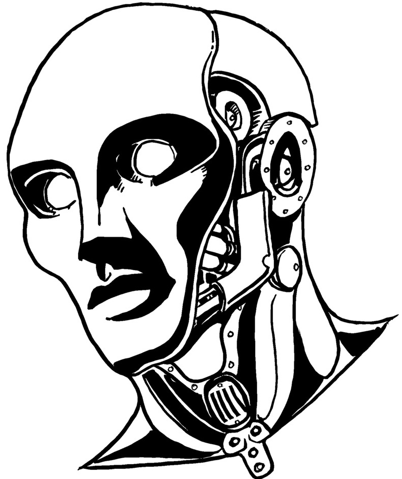

  

# Interrogatoires

  

Le manuel du jeu propose un **imbroglio** nommé _Interrogatoire_ :

> Les Manteaux Bleus capturent l'un des PJ pour l'interroger sur les crimes de la bande. [...]
> Les crapules comme vous passent leur temps à entrer et sortir de prison, à être interrogés et harcelés par les forces de l'ordre.
> Ce n'est pas la fin du monde. Mais maintenant que vous êtes ici dans la salle d'interrogatoire,
> quel genre de personne êtes-vous ? Est-ce que vous parlez ? Leur tenez-vous tête ? Est-ce que vous passez un marché ?

Cette **aide de jeu** vous propose de développer ces scènes d'interrogatoire, pour en faire des moments cruciaux, où les PJs sont mis sous pression par les _Inspecteurs_, où ils ont beaucoup à perdre, et où la situation se résoudra par des moments de _roleplay_ mémorables.

_**Avertissement**_ : le parti-pris ici est de placer les joueurs dans des conditions proches de celles d'un véritable interrogatoire de police, et de générer un véritable **stress** chez eux. Certains joueurs n'apprécient pas du tout de jouer de telles scènes, n'employez donc cette aide de jeu qu'après les avoir consultés, et si cette proposition ludique leur convient.

 

## Interpellation
Une scène d'interrogatoire peut constituer une excellente **séquence d'ouverture** d'une session de jeu.
En tant que MJ, savoir à l'avance **quel PJ sera interrogé** est très pratique,
et vous permettra de préparer cette scène avant la partie.
Il est aussi possible de dérouler une telle séquence en cours de partie,
si l'occasion se présente et que vous vous sentez capable de tout improviser.

Idéalement, un PJ peut avoir été **arrêté par les Manteaux Bleus** au terme de la session précédente.
Si cette situation ne se présente pas spontannément, voici quelques manières d'amener l'interrogatoire d'un PJ :
* dans une situation où les Manteaux Bleus ne paraissent pas au courant des activités illicites des PJs, il peut sembler à ces derniers plus prudent de faire « profil bas », coopérer et les suivre au poste pour une « entrevue de routine », plutôt que de déclencher un affrontement dans une situation à leur désavantage, risquant par exemple de révêler leur planque ou de trahir l'identité de l'un d'eux.
* un interrogatoire peut être une **conséquence** d'un PJ qui **sombre dans l'excès** après s'être adonné à son Vice, et qui provoque une rixe ou qui « parle trop » alors qu'un indic est présent...
* lors d'une course-poursuite avec les Manteaux Bleus, la capture peut être une **conséquence** possible d'une fuite râtée, à laquelle un PJ ne peut **Résister** par manque de points de stress.
* vous pouvez proposer l'interrogatoire comme une variation de l'**imbroglio** _Arrestation_, ou une alternative à l'activité de temps mort _Réduire le raffut_ : les forces de l'ordre ont des soupçons sur un PJ, si celui-ci accepte de venir au poste pour être interrogé, le Raffut de la bande sera **réduit de moitié**.
* un contact de la bande chez les Manteau Bleus peut leur proposer **un marché** : leur livrer une information précieuse ou un objet issu de la salle des scellés, s'ils acceptent en échange qu'un PJ « se fasse capturer » par ce contact ripou, ce qui lui vaudra une prime, voir une promotion.

<!-- Start of page 2 -->

## Préparatifs
Afin de créer de la tension dramatique autour de la table, mieux vaut préparer l'interrogatoire, pour déstabiliser les joueurs et donner lieu à quelques beaux moments d'improvisation théatrale.

 

### Les enjeux
Un certain nombre de conséquences négatives peuvent découler de cet interrogatoire :
* le PJ peut consommer son dernier point de **Stress** et obtenir un nouveau **Trauma**.
* la bande peut voir son niveau de **Raffut** augmenter, voir gagner un niveau d'**Avis de recherche**.
* le PJ peut être **incarcéré** en prison, si l'interrogatoire confirme les soupçons pesant sur lui.

Mais surtout, en cuisinant le PJ, les Manteaux Bleus pourraient obtenir de lui de précieuses **informations**.
<u>Listez sur une feuille de papier</u>, avant l'interrogatoire, ce que les forces de l'ordre pourraient découvrir selon les événements précédents de votre campagne en cours :
* emplacement de la planque de la bande, et de leur **Magot**.
* des **PNJs alliés** : que ces contacts soient complices ou non, ils pourront ensuite être aussi interrogés...
* des **activités illégales** commises par la bande, ou d'autres gangs : _Coups_, meurtres, pots de vins, trafics...
* des **liens** entre différentes personnes ou enquêtes en cours, inconnus des Manteaux Bleus.
* des **preuves** sur des crimes commis, via des témoignages enregistrés ou des objets incriminants.

Cette liste vous servira à orienter l'interrogatoire, pour essayer d'obtenir des informations du PJ interrogé,
voir de le pousser à se trahir ou à trahir ses complices.

 

### Les Inspecteurs

Les Inspecteurs sont des gendarmes d'élite.
Ils sont souvent issus des familles d'ambassadeurs Akorosi à l'étranger,
et ont été entraînés dans l'armée impériale.
Ce sont à la fois de redoutables combattants, et des limiers hors pair.
Ils sont entraînés à **détecter les mensonges** et, sans en abuser, vous pouvez employer cette capacité spéciale
pour parfois justifier qu'un Inspecteur devine lorsqu'un PJ déguise la vérité.

Les Inspecteurs adopteront différents masques pour faire parler les suspects :
apparaissant tantôt débonnaires et sympathiques,
ils n'auront aucune difficulté à devenir inquisiteurs, inflexibles, menaçants.

Durant l'interrogatoire, le MJ incarne l'Inspecteur principal, en charge de mener l'enquête impliquant les PJs.
Il possède déjà un dossier très complet sur un ou plusieurs PJs,
incluant leurs activités connues, leurs antécédents judiciaires, et quelques éléments de profil psychologique.

C'est facultatif, mais pour éviter l'effet « spectateurs passifs »,
nous vous recommandons d'**impliquer un autre joueur** dans l'interrogatoire,
en lui donnant temporairement **le rôle d'un second Inspecteur**, binôme de l'Inspecteur principal.
Son rôle est décrit en détails en appendice, sur un feuillet à remettre au joueur comme guide d'interprétation.
En bref, selon une stratégie « bon flic, méchant flic », sont rôle sera d'être **le méchant flic**.

 

::: insert float-right
### Exemples d'infractions
Issues du code pénal de Doskvol :
* association de malfaiteurs
* conspiration ou insurrection contre l'Empereur Immortel
* enlèvement ou séquestration
* extorsion de biens ou d'informations
* livraison d'information confidentielle à une puissance étrangère
* meurtre, avec ou sans préméditation
* outrage à un agent des institutions, à l'église ou à la noblesse
* ouverture ou altération de la barrière électroplasmique protégeant la ville
* promotion d'un culte interdit
* recel
* refus d'obtempérer à un ordre des forces de l'ordre
* trafic de marchandises illégales
* violation de domicile
* vol
:::

### Leurs outils
Afin d'obtenir les informations qu'il recherchent,
en plus des bâtiments et des Manteaux Bleus à leur disposition,
les Inspecteurs disposent des outils judiciaires traditionnels&nbsp;:
* le **réseau d'informateurs** des forces de l'ordre leur fournit une connaissance étendue des activités criminelles.
* la menace de sevères **sanctions** prévues par le code pénal de Doskvol, incluant l'incarcération en pénitentier, les travaux forcés à perpetuité, ou même l'échafaud.
* leur rôle de procureur leur permet de garder les suspects en **détention** préventive, aussi longtemps qu'ils le souhaitent.
* les Inspecteurs n'hesiteront pas à faire preuve de **violence**, tant verbale et physique, pour intimider les suspects.
* dans la salle d'interrogatoire, un **gramophone enregistreur** leur permet d'enregistrer tout ce qui est dit.

         <!-- size8 => 8rem => 8 line breaks -->

   

À Doskvol, les Inspecteurs disposent aussi d'autres outils&nbsp;:
* un attirail de potions et drogues **alchimiques**, dont notamment de l'_Étincelle_, du _Vif-Argent_ et des _Potions de Vision_,
  mais aussi du _Sérum de Véracité_ (IV/1, rare) capable de forcer un personnage à **répondre sans mentir** à 6 questions,
  moins le dé le plus élevé d'un **jet de résistance** (Détermination).
* ils peuvent employer un **Fantôme** pour **posséder un suspect**, et ainsi fouiller dans sa mémoire.
  Un **jet de résistance** (Détermination) sera nécessaire pour lutter contre l'emprise du spectre.
  Les Inspecteurs n'emploient en général cette dernière technique qu'en dernier recours,
  car il peut arriver que la possession tourne mal, conférant au suspect des capacités surnaturelles...
* les Inspecteurs peuvent parfois **ramener une victime d'entre les morts**, attacher temporairement son esprit à une **Coquille**
  pour qu'il témoigne, et ainsi confronter un suspect à la déposition d'un mort.
  Ils emploient toujours la même enveloppe, un **automate** sans bras ni jambes,
  attaché sur une chaise en bois, au visage inexpressif contrastant avec les lamentations de l'esprit prisonnier.

 

### Ce qu'ils savent déjà

Le PJ suspect est en lien avec un ou plusieurs crimes, et il a été mentionné par des témoins ou des victimes.
<u>Listez sur une feuille de papier</u> ce que les Inspecteurs savent ou soupçonnent déjà du PJ interrogé :
* vices du PJ et éventuellement débordements passés associés
* crimes pour lesquels le PJ est suspecté
* autres activités illégales auxquelles le PJ ou sa bande ont pu être associés
* **traces** qui ont été laissées par le PJ lors de ces méfaits :
    + objets abandonnés sur les lieux
    + emploi d'armes que le PJ continue à utiliser
    + témoignages de témoins et victimes

Cette dernière liste de **traces**, en particulier, constituera la matière principale des Inspecteurs pour essayer de piéger le PJ suspect, et lui soutirer des informations en le mettant face à ces contradictions.

 

## Les lieux
Lorsque le PJ ciblé est arrêté pour être interrogé, il sera amené à un **poste du Guet de la Ville** à proximité.
C'est l'occasion de fournir à vos joueurs une description des lieux qui rende compte du **sentiment d'oppression** qu'il dégage.
Vous pouvez lire celle proposée ci-dessous, ou vous en inspirer pour concevoir votre propre décor.

> Les Manteaux Bleux te mènent à travers la ville jusqu'à une caserne proche :
> devant toi se dresse un grand édifice de pierre, amoncellement de plusieurs bâtiments accolés.
> Le lieu semble être un ancien poste de douane fluvial, et se prolonge avec trois arches d'un pont en partie effondré,
> mais toujours employé par le Guet pour amarer plusieurs embarcations.

> Plusieurs gardes patrouillent sur les courtines de la caserne, arbalète à la main.
> Toutes les fenêtres comportent des barreaux d'acier, et une herse est relevée à ton entrée dans la cour intérieure.
> Dans l'enceinte de la caserne, les Manteaux Bleus te dévisagent d'un air sévère.
> Une fois la herse redescendue derrière toi, ils te fouillent et déposent toutes tes possessions dans un grand sac en toile de jutte.

> Tu es ensuite mené à travers un dédale de petits couloirs jusqu'à une cellule,
> où l'on te demande d'attendre avant l'interrogatoire, sans te préciser combien de temps.
> L'endroit est exigu, pue la pisse, et tu distingues des tâches de sang sur l'épais mur de grès.
> Dans une cellule proche, un homme est prostré dans un coin, et sanglotte en marmonnant de manière incompréhensible.
> Il semble avoir regressé au comportement d'un animal harassé, et gronde lorque tu croises son regard.

## Déroulement de l'interrogatoire
::: info handcuffed
Si le PJ est venu au poste contre son gré, par exemple car il a été _pris en flag_, il est entravé par des **menottes** dans le dos, attachées par une chaîne au sol.
:::

xxx TODO

### Tactiques des Inspecteurs
xxx TODO

### Sur le gril
À ce moment, indiquez aux joueurs que vous allez jouer une séquence de pur _roleplay,
en **temps réel** sans interruption ni apparté,
et que pour créer une ambiance immersive, les commentaires hors-jeu sont à éviter jusqu'à la fin de la scène.

### Intermèdes
Privations d'alimentation et de sommeil
Tortures ? Avec emploi d'_Essence Vitale_  / _Potion de Vitalité_ pour soigner, et de la _Poudre de Noyade_
+ changement d'Inspecteur secondaire

## Décrochage
L'interrogatoire peut se terminer de plusieurs façons :

1. le PJ peut être **libéré** : soit il a réussi à bluffer les Manteaux Bleus, soit ceux-ci préfèrent simplement le laisser partir pour qu'il ne se doute de rien, et préparer une descente plus ambitieuse, plus tard.

2. le PJ peut être **mis en accusation**, et placé en détention jusqu'à son jugement, si suffisament d'éléments incriminants sont établis par les forces de l'ordre. Un **Coup** sera alors nécessaire pour le faire évader.

3. le PJ peut décider de tenter de **s'enfuir** : réalisez alors un **jet d'Action**.
  Selon la manière dont il s'y prend et le résultat du jet, le PJ peut alors se retrouver dans une course-poursuite à travers le poste de guet des Manteaux Bleus. À l'inverse, des **complications** peuvent survenir, comme son arrestation pour motif de _voie de fait contre un agent de la paix_. L'interrogatoire peut alors se poursuivre de manière plus musclée, ou bien le PJ peut directement être **incarcéré** en prison.

4. le PJ peut tenter de **gagner du temps**, et d'**alerter** le reste de sa bande afin qu'elle le fasse s'évader, par la force ou par la ruse. À nouveau, tout cela peut se résoudre par des **jets d'Action**.

Dès la description des lieux, les joueurs peuvent avoir envie de mettre les voiles,
ce qui pourrait ruiner votre intention de mettre en scène un interrogatoire...
C'est une autre bonne raison de jouer cartes sur table avec eux en amont,
en leur partageant votre intention de jouer une scène de ce type,
et s'ils évoquent cette envie d'évasion, en suggérant d'attendre jusqu'au premier entretien avec les Inspecteurs.

### Conséquences
Quelle que soit la clôture de cette scène, les joueurs pourront avoir l'impression que l'affaire est close,
et même si l'interrogatoire était intense, que ses répercussions sont minimes...

Mais pour le MJ, les informations récoltées par les Manteaux Bleus constituent un terreau fertile pour de **futures menaces**.
<u>Consignez par écrit</u> ce que les forces de l'ordre ont appris, et déterminez comment elles vont les exploiter, en définissant de nouveaux **compteurs de progression** d'événements à venir :
* **intimidation policière** : les Manteaux Bleus font le tour de tous les personnages alliés de la bande, en les secouant pour obtenir plus d'informations. Qui craquera ? Et que risquent-ils de révéler ?
* **descente** : lourdement armées, les forces de l'ordre passent à l'assaut de l'un des repaires des PJs.
* **la main dans le sac** : les Manteaux Bleus préparent un piège pour la bande, pour les épingler en flagrand délit d'activité criminelle.
* **arrestation** : les forces de l'ordre décident d'arrêter et de mettre en accusation un autre PJ, suite aux informations fournies par celui interrogé. Rien de tel pour semer le doute et la zizanie dans la bande !

Selon votre style de jeu, vous conservez ces compteurs cachés, où les rendre leurs titres publics, sans révêler plus de détails...

## Appendices
### Feuille d'Inspecteur en second

xxx TODO

::: info fingerprint
Useful ?
:::

::: info guards
Useful ?
:::

::: info hound
Useful ?
:::

 

## Remerciements
Merci aux auteurs du [Petit manuel d'autodéfense en interrogatoire, aux éditions du commun](https://www.editionsducommun.org/products/petit-manuel-dautodefense-en-interrogatoire), qui m'a servi d'inspiration pour cette aide de jeu.

Merci à [Elliot Jolivet aka Tenseï](https://illutensei.com/bio) pour les illustrations employés dans cette aide de jeu, qu'il a réalisé spécialement pour _Blades in the Dark_. Vous pouvez retrouvez quelques autres illustrations qu'il a réalisé sur le _thread_ [Reddit /bladesinthedark](https://www.reddit.com/r/bladesinthedark/comments/16quv7u/comment/k1z9cz6/).

L'illustration de la Coquille automate provient de la collection [108 Terrible Character Portraits](https://www.drivethrurpg.com/product/91360/108-Terrible-Character-Portraits) de [Jeff Preston](http://team-preston.com) - [CC BY 3.0](https://creativecommons.org/licenses/by/3.0/).

Les illustrations de ville proviennent de tableaux du [parcours _Histoire d'Angers_ de son musée des Beaux-Arts](https://musees.angers.fr/lieux/musee-des-beaux-arts/).

<!-- Merci aux relecteurs & testeurs de cette aide de jeu : ... -->

Merci enfin aux développeurs des [logiciels libres](https://fr.wikipedia.org/wiki/Free/Libre_Open_Source_Software) employés pour réaliser cette aide de jeu&nbsp;: [le navigateur Firefox](https://www.mozilla.org/fr/firefox/), [le logiciel de dessin Gimp](https://www.gimp.org/), [l'éditeur de texte Notepad++](https://notepad-plus-plus.org/), [le lecteur de PDF Sumatra PDF](https://www.sumatrapdfreader.org), [le language de programmation Python](https://www.python.org/) et les bibliothèques de code [mistletoe](https://pypi.org/project/mistletoe/) & [weasyprint](https://weasyprint.org/).

 

## Licence & feedbacks

Cette aide de jeu de Lucas Cimon est placée sous licence <a rel="license" href="http://creativecommons.org/licenses/by-nc/4.0/">Creative Commons Attribution-NonCommercial 4.0 International</a>.

Les fichiers sources ayant permis de générer ce PDF sont disponibles [sur GitHub](https://github.com/Lucas-C/jdr/tree/master/BladesInTheDark). Version : 1.0

Cette aide de jeu est diffusée à prix libre.
Si vous souhaitez soutenir mes projets, vous pouvez me faire un don sur [lucas-c.itch.io](https://lucas-c.itch.io).

Je serais ravi d'avoir vos retours sur cette aide de jeu si vous l'employez.
Racontez-moi comment s'est passée votre partie via un commentaire [lucas-c.itch.io](https://lucas-c.itch.io) ou sur [mon blog](https://chezsoi.org/lucas/blog/pages/jeux-de-role.html).

<!-- Com'

* [ ] https://forum.500nuancesdegeek.fr/viewtopic.php?f=52&t=2067&p=36797#p36797

-->
