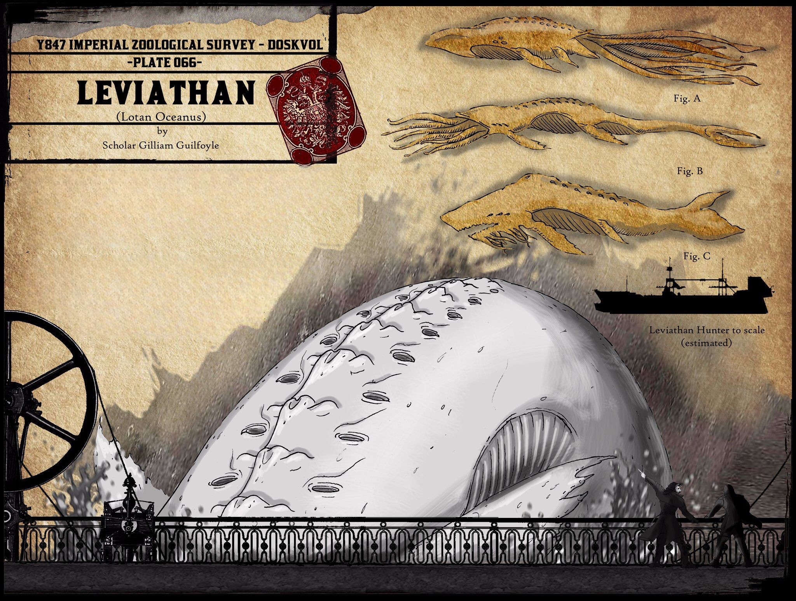

# Les bases de  la chasse au Léviathan

  

Vous voulez donc en savoir plus sur la chasse au Léviathan ?

Eh bien, tout d'abord, il faut garder à l'esprit que les Léviathans sont **énormes**. Ils sont si énormes que la plupart des marins n'ont jamais vu qu'une fraction de leur masse corporelle. Les représentations artistiques ou « scientifiques » ne sont qu'une approximation de la forme de ces créatures, assemblées à partir de descriptions incomplètes de différents spécimens, qui tendent à présenter une grande variété de différences, comme la quantité, la taille et la structure des yeux, des nageoires, des appendices en forme de tentacules, des éperons osseux, voire la forme générale du corps. La seule chose que l'on puisse dire avec certitude : ces démons marins éclipsent même les plus grands navires de chasse.

Comment est-il donc possible que les chasseurs engagent encore et encore ces bêtes dans une lutte pour leur sang ? La réponse est simple : il n'y a **pas de telle lutte**. Du moins pas du point de vue de la bête marine. C'est-à-dire, à moins qu'elle ne soit complètement éveillée. Heureusement, ils le sont rarement.

Ce qui nous amène au deuxième fait important concernant les Léviathans : lorsque ces géants sont rencontrés dans la mer du Vide, ils dérivent à travers les vagues noires dans un état de **sommeil**, presque onirique. L'explication de cela est un sujet de débat passionné parmi les démonologues et marinologues de Doskvol. Certains spéculent que les démons marins chassent dans les profondeurs, s'attaquant à des créatures encore plus étranges, ou peut-être se nourrissant de puits spirituels au fond de la mer obscure, et ne remontent à la surface que pour dormir. D'autres présument que le rêve pourrait en fait être l'état naturel de ces démons et que ce sont seulement nos actions qui les poussent à des moments d'éveil.

Pourtant, alors que les bêtes elles-mêmes peuvent dégager une apparence de tranquillité sereine, on ne peut pas en dire autant de la mer qui les entoure : des vagues agitées, des tourbillons qui émergent soudainement, des voix étranges chevauchant les vents, des formations nuageuses imposantes éclairées de l'intérieur par des éclairs aux couleurs étranges - tous ces signes informent le chasseur chevronné de la proximité de sa proie. S’il est vrai que les léviathans rêvent, leurs rêves ne sont peut-être pas du tout agréables.

Les navires de chasse approchent ces bêtes lourdes comme les îles vivantes qu’elles sont. Des harpons, lancés à la main ou tirés au canon, sont utilisés pour attacher le parasite et l’hôte avec un réseau de cordes, de câbles et de chaînes. Des équipages d’explorateurs sont envoyés sur de petites embarcations pour mettre le pied sur le dos de la bête et préparer le processus d’extraction. Ils apportent de grandes foreuses pour percer la peau de la bête et, comme des seringues médicales, les relient à des tuyaux en caoutchouc menant aux pompes et aux réservoirs du navire de chasse. Après un certain temps, le **sang** vital des léviathans est aspiré par une douzaine de perforations. Les plus grands navires utilisent même des grues pour abaisser des plates-formes complexes, qui peuvent enfoncer leurs foreuses alimentées à l’huile de foudre plus profondément dans la chair du léviathan et atteindre des gisements plus riches du précieux liquide.

Travailler sur le dos d’un démon marin endormi est tout autant la promesse de moult trésors, qu'extrêmement dangereux. Une fois les forets en place, les marins sont souvent tentés de scier certaines des plus petites protubérances osseuses ou des appendices pour les vendre contre une belle récompense aux superstitieux ou aux scientifiques. Des trésors encore plus étranges et plus gratifiants peuvent souvent être trouvés encastrés dans le sol sous les pieds des chasseurs : des dents aussi longues que des épées, des éclats de cristal scintillants, des reliques bizarres d’origine obscure. Mais ces trésors sont invariablement accompagnés d’un grand danger : les fantômes affluent vers le sang du léviathan comme des oiseaux charognards tandis que les démons sont connus pour se manifester spontanément à partir de motifs électroplasmiques sur le dos du léviathan. Et – souvent oublié, mais non moins mortel – il y a toujours le danger plus banal de la mer : un faux pas sur la surface glissante envoie le malheureux marin sous les vagues noires d’encre.

Lorsque les phénomènes météorologiques et l’étrangeté générale augmentent, c’est un signe clair que le sommeil du monstre devient agité. L’île vivante tremblera et tentera même de s’enfoncer sous les vagues, une attraction à laquelle des navires solides avec un équipage expérimenté peuvent résister pendant un certain temps. À partir de maintenant, il s’agit de savoir quel risque un capitaine est prêt à prendre pour extraire le plus de sang possible. S’il se désengage trop tôt, il devra trouver une autre bête pour remplir ses réservoirs à ras bord et rendre le voyage rentable. S’il attend trop longtemps, la force et l’éveil du monstre augmenteront au point que des vies, du matériel et même des navires seront perdus. L’île flottante pourrait soudainement disparaître entre les vagues, entraînant tout ce qui se trouvait sur elle ou qui y était attaché dans les profondeurs sans fond. Ou bien la douleur et la colère pourraient finalement fournir suffisamment d’impulsion pour que la bête attaque son parasite. Peu de gens ont vu de tels événements et encore moins osent se souvenir de l’expérience.

Et pourtant, malgré tous les dangers et les horreurs, les flottes de chasse ne cessent de croître et le nombre de marins prêts à risquer leur vie sur la Mer du Vide est illimité, car l'énergie vitale des léviathans est aussi l'énergie vitale de la civilisation - et elle est extrêmement rentable.

<a href="https://bitd.gplusarchive.online/2016/07/14/leviathan-hunting-101/">Traduction d'un texte de Benjamin Hamdorf</a>, par Lucas Cimon.

   

<figure>
  
  <figcaption><a href="https://bitd.gplusarchive.online/2016/10/13/group-was-off-this-week-so-by-request-heres-my-stab-at-the-leviathan/">Illustration de Galen Pejeau</a></figcaption>
</figure>

