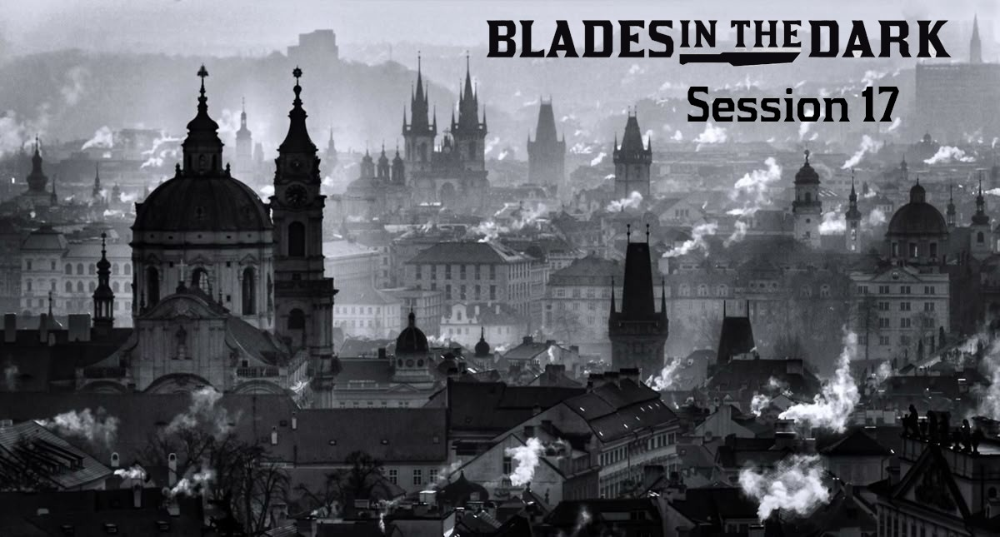

## Récap de début de session
 

* le territoire des _Crows_ a été réparti entre les gangs de l'Écharpe Rouge et du Harpon, tandis que la tour de l'horloge rester un lieu neutre, une zone franche. Les deux gangs ont établi une alliance pour se répartir le marché de la drogue. Quelques membres de l'Écharpe Rouge bien connus : **Mylera Klev**, **Oru**, **Milo**.
* grâce aux informations fournies par leur espion favori, **Valeris**, le Harpon est passé à l'assaut de **la Tour de l'Observatoire**, le repaire des **Cendreux**, un gang issu de l'Œil Blanc. Après les avoir annihilés, ils ont pris possession des lieux, quittant leur ancienne planque dans l'entreprise Gruber & Fils
* la Harpon a dérobé son masque à la diva **Maria Coseren**, un artefact capable de modifier l'apparence son porteur, pour le livrer à **Lord Scurlock**. Maria est ensuite venue le réclamer à la Goule Fendue, où elle a confronté Mist & Josef. N'ayant pas obtenue ce qu'elle cherchait, elle a proclamé qu'elle reviendrait...
* le gang du Harpon a ensuite réalisé une autre opération pour Lord Scurlock : retrouver _The Torment_, un navire skovlander disparu et sa précieuse cargaison : un coffre contenant des jarres de pierre. La mission a été menée à bien, en démolissant au passage le gang des _Grinders_, mais le butin n'a pas encore été remis à Scurlock...
* les activités récentes du **Cercle de la Flamme** laissent entrevoir un plan occulte d'ampleur : ils ont commandité l'élimination des _Silver Nails_ pour récupérer _**La main de Kotar**_, un artefact dont Josef a repéré des rémanences dans le _Ghost Field_ suite à cette attaque. **Jenny Holt** aurait été capturée vivante pour être sacrifiée bientôt lors d'un rituel. Pourraient-ils aussi être en lien avec les sombres cérémonies se déroulant dans les catacombes sous l'Université Immortelle, où le Harpon a affronté un démon et Eric a récupéré son épée ?
* le Harpon a déjà éliminé l'un des membres de ce Cercle, Raffello, et identifié les six autres membres à la tête de cet ordre occulte
* après un interrogatoire corsé des inspecteurs **Holdan** & **Smithson**, Ethnos a réussi à s'échapper de la cellule de la forteresse du **Lord Gouverneur** où il était retenu prisonnier dans le corps de Lodius et prennant possession du corps d'un garde impérial, **Orlan Skora**.
* un spectre, **Lord Daaya**, a pris possession du corps de Mist et a tenté de mettre fin aux jours de Josef pour se faire justice
* une sévère répression s'est abattue sur **les révoltés de Coalridge**, et leurs _leaders_ syndicalistes ont été exécutés en place publique. Ils ont été jugés expéditivement suite à l'opération militaire visant à libérer le riche magnat industriel **Lucretius Dream**, que les insurgés retenaient prisonnier. À cette occasion, **le corps démembré de Lodius** a été exhibé sur l'échafaud.
* **Quill**, la jeune fille sympathisante des ouvriers révoltés, a pu réchapper à cette exécution publique grâce à l'intervention de Josef, au cours d'une escarmouche où le Lord Gouverneur est intervenu lui-même
* il y a quelques jours, un démon tentaculaire s'est manifesté dans l'Eyrie de la Tour de l'Observatoire, issu d'une des jarres de pierre récupérées sur le _Torment_, causant plusieurs pertes humaines dans la gang avant d'être renvoyé dans vers le plan démoniaque par Mist
* dernièrement, une opération d'effaçage de mémoire a été organisée par le gang dans une caserne de Bluecoats de Brightstone pour éviter qu'un de leurs _goons_, « Crickett », ne balance l'emplacement de la Tour de l'Observatoire, leur QG
* enfin, Eric a été invité par l'Écharpe Rouge pour participer à leur **Grand Tournoi d'Arts Martiaux** demain, et Elaria semble avoir disparu...

[> Le résumé complet de la campagne @ chezsoi.org <](https://chezsoi.org/lucas/blog/pages/jdr-blades-in-the-dark.html)
 
Vous y retrouverez également les 3 numéros des Chroniques du Crépuscule

 

## Status du gang
 

* Rang / Tier : **III** - Type : **bravos** (_thugs_)
* Spécialités : extorsion, sabotage, braquage, batailles rangées
* ~~wanted level~~ : **1/4** - ~~heat~~ : 0
 L'exécution de Lodius a réduit l'exposition du gang, que l'on pense démantelé.
 Certaines personnes bien renseignées savent néanmoins que le Harpon n'est pas mort, et que par le passé il a tracé dans le sang sa redoutable légende.
* ~~rep~~ : 2 - ~~coin~~ : 24
* Cohortes : une vingtaine de brutes, voleurs, éclaireurs, gros bras, escrocs et rançonneurs; **Aldo**; **Justinia**; **Marlane**
* Repaire notoire : **La Goule Fendue**

<!-- Non mentionnés mais néanmoins importants :
* une rumeur de comète pouvant s'écraser à Doskvol s'était répandue, mais a été tue par les autorités
-->

