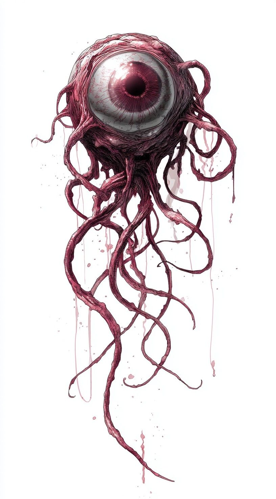

  

# Rituels

  

* _**Putréfaction rapace**_
  + **Préparatifs** : concevoir un pipeau enchanté à base d'os humains
  + **Effet** : une nuée de vermine converge des alentours pour dévorer le cadavre d'une personne récemment décédée. Tout disparaît en quelques minutes, sans laisser aucune trace. Cette mort ne génère aucun ~~raffut~~, mais après 1 à 3 jours, l'esprit vengeur du dédunt reviendra hanter cet endroit.

 

* _**Dôme de silence**_
  + **Préparatifs** : préparer une craie à base de cendres funéraires d'une personne née muette
  + **Effet** : l'occultiste dessine un cercle à la craie au sol, qui doit être parfaitement plat, sans relief. Tout son produit à l'intérieur du cercle ne peut être entendu à l'extérieur. Si le contour du cercle est rompu, l'effet prend fin.

 

* _**Œil dansant**_
  + **Préparatifs** : dormir avec un cache-œil trempé au préalable dans une décoction à base de sang d'une famille de démons spécifique
  + **Effet** : l'occultiste se retire un œil, qui se met à léviter. Il peut le diriger à son bon vouloir, pendant une durée et à une portée dépendant de la réussite de son jet d'action.

 

* _**Chaîne spirite**_
  + **Préparatifs** : tresser la chaîne avec des bribes d'âmes errantes
  + **Effet** : une chaîne apparaît entre les mains de l'haruspice dans le Voile Spirite. Celui-ci peut la faire tournoyer et s'enrouler sur une cible, qui est alors immobilisée.

 

* _**Plâtre de marbre pétrifiant**_
  + **Préparatifs** : enduire sa main d'argile dans laquelle sont scultpées des runes sanguinolentes
  + **Effet** : l'occultiste emploie une activité de temps mort pour . La prochaine personne qu'il touche avec sa main (nécessitant généralement un jet d'action) est instantanément pétrifiée.

 

* _**Leurres d'ombre de la lune blême**_
  + **Préparatifs** : peindre avec une encre noire à base de sang de Léviathan le contour de son ombre à la lumière de la lune
  + **Effet** : l'ombre de l'haruspice se duplique en plusieurs projections. Il peut les contrôler à volonté et les séparer de son corps.

* _**Le vieilliment du Léviathan**_
  + **Préparatifs** : entrelacer soigneusement, avec des boucles subtiles, une mèche de cheveux de votre victime avec l'os à l'extrémité d'une queue de Léviathan
  + **Effet** : la cible se met à vieillir dix fois plus vite

 

* _**L'envol du baiser funèbre**_
  + **Préparatifs** : embrassez une mouette morte avec un _lipstick_ enchanté
  + **Effet** : le squelette de la mouette s'extrait de son cadavre et s'envole, partageant avec l'haruspice une vue aérienne de la zone.

 

* _**Ghost Veil Tangle**_
  + **Préparatifs** : tresser avec des filaments de lamproie sêchée et les derniers cheveux blancs d'une vierge, un délicat et complexe mécanisme qui « dénoue » localement le voile spirite
  + **Effet** : échangez les positions de deux personnes visibles par le l'occultiste

 

:::: insert large big
## Rappels
* les rituels sont un art oublié issu de la sorcellerie, antérieur au cataclysme. Contrairement aux techniques ésotériques modernes, qui font appel aux applications scientifiques des énergies électroplasmiques, les effets des rituels dépendent d’étranges pouvoirs et entités occultes.
* pour apprendre un nouveau rituel, un PJ doit d’abord trouver une **source**
* préparer un rituel occupe **une activité de temps mort**
* l’exécution d'un rituel nécessite **un jet d’action** (en général ~~Communier~~ / ~~Attune~~). Un rituel peut aussi exiger des coûts supplémentaires, tel qu’un sacrifice, un objet rare, le lancement d’un compteur de progression, etc.
* les questions à poser concernant un rituel :
  

  1. Le MJ demande : _« Quel est le but du rituel et en quoi est-il étrange ? »_. Le joueur répond.
  2. Le joueur demande : _« Que dois-je faire pour exécuter ce rituel, et quel en est le prix à payer ? »_. Le MJ répond.
  3. Le MJ demande : _« Quelle nouvelle croyance ou peur t’inspire ce rituel et des forces occultes qui lui sont liées ? »_. Le joueur répond.
::::

  

### Inspirations
 

* [10 Rituals I've made up @ reddit.com/r/bladesinthedark](https://reddit.com/r/bladesinthedark/comments/1h5f75k/10_rituals_ive_made_up/)
* [Ritual ideas? @ reddit.com/r/bladesinthedark](https://reddit.com/r/bladesinthedark/comments/1aeu1wj/ritual_ideas/)
* [Krenshaw’s Grimoire @ itch.io](https://will-rider.itch.io/krenshaws-grimoire): 30+ weird, powerful, and terrifying rituals ($10)

Ce module pour _Blades in the Dark_ a été conçu en 2026 par Lucas Cimon.
 
Retrouvez moi sur [Ludochaordic @ chezsoi.org](https://chezsoi.org/lucas/blog/) et [mes jeux sur itch.io](https://lucas-c.itch.io/).

