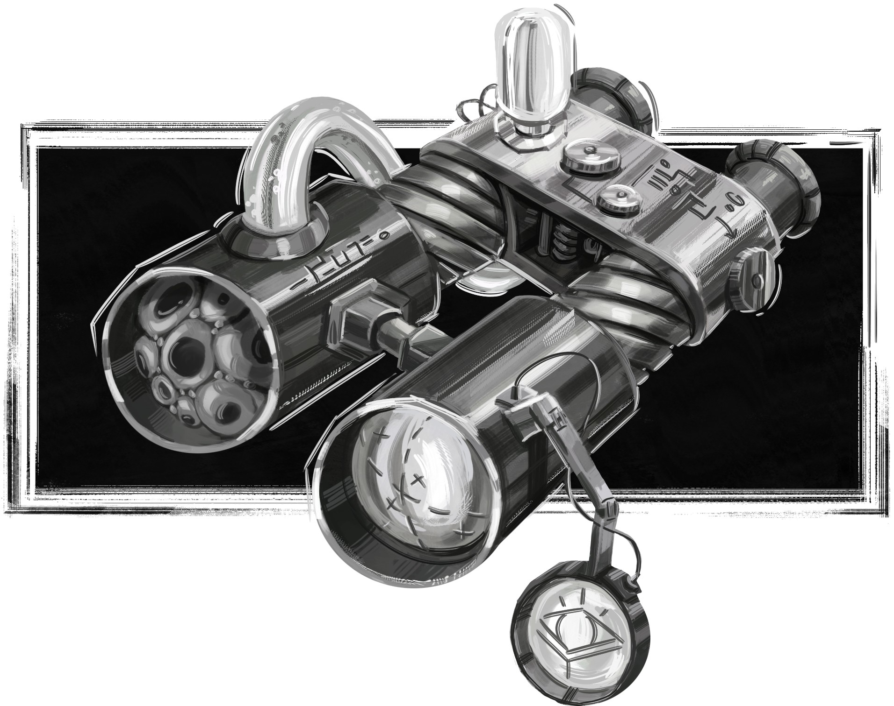
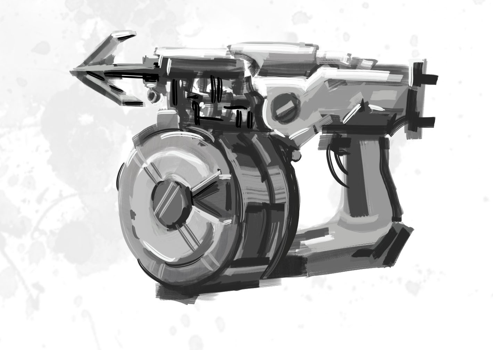
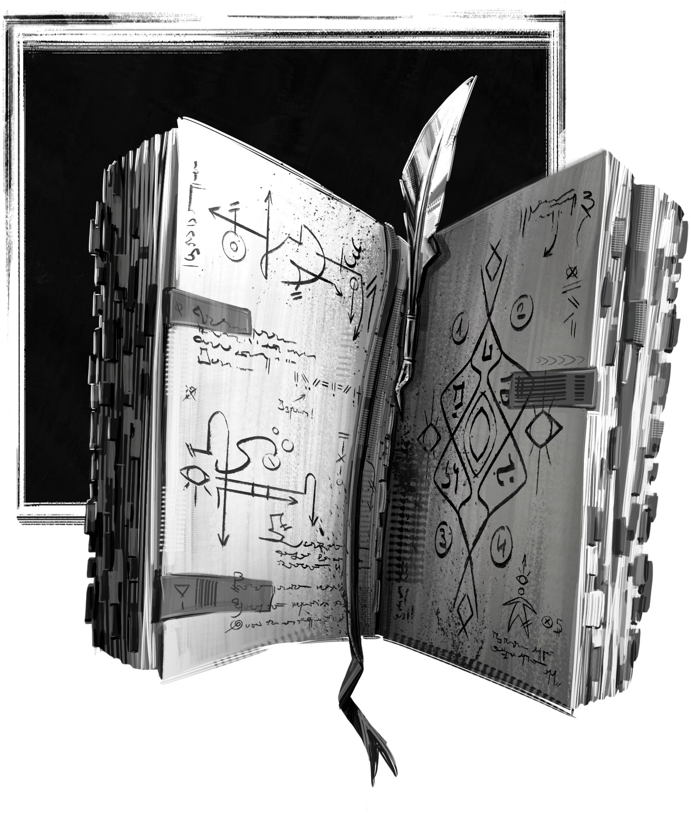
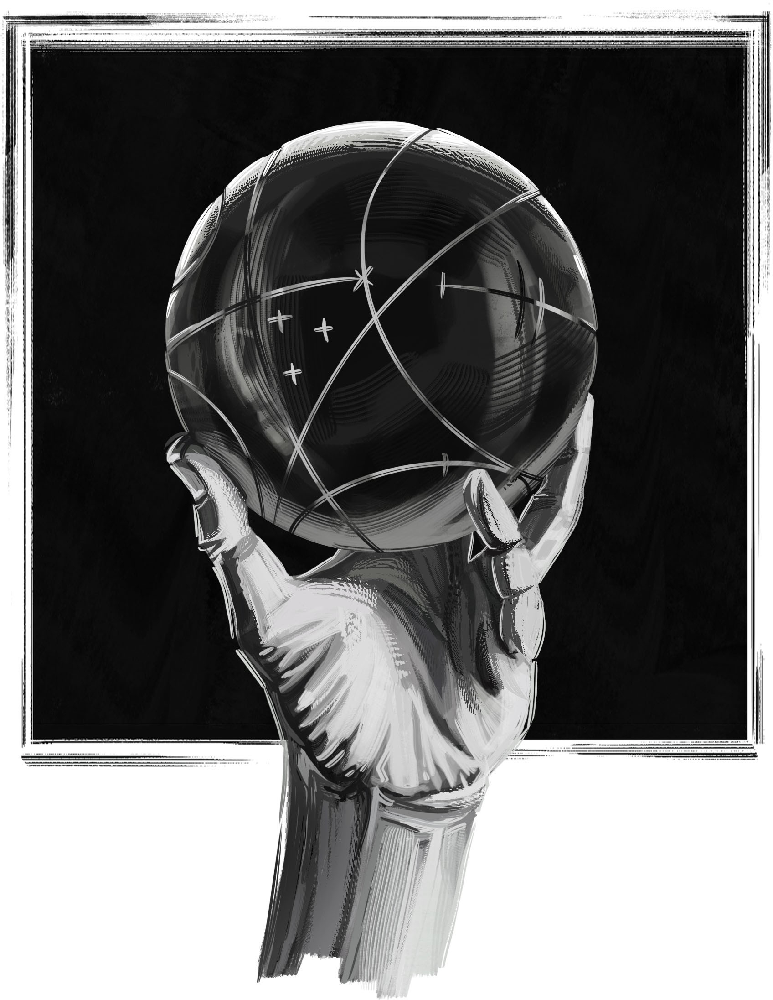
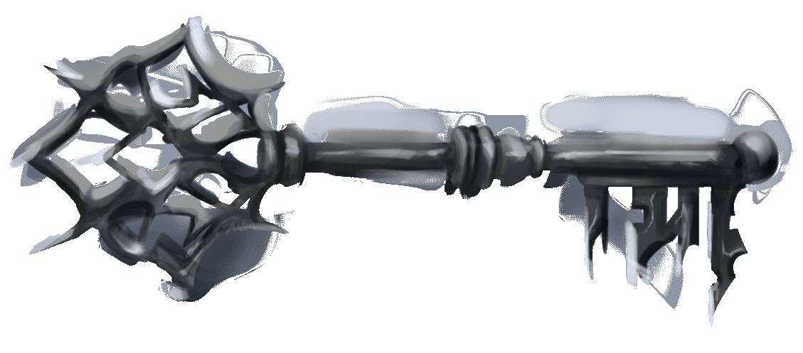
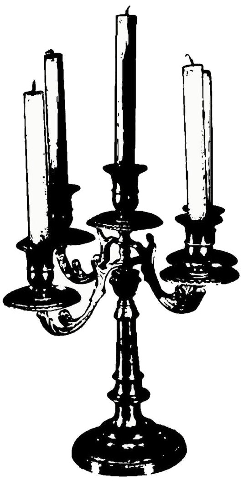
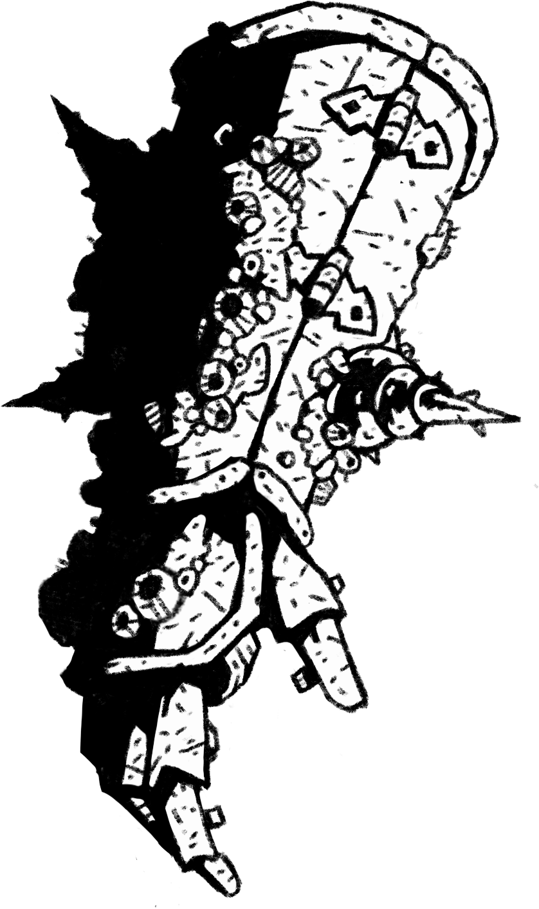
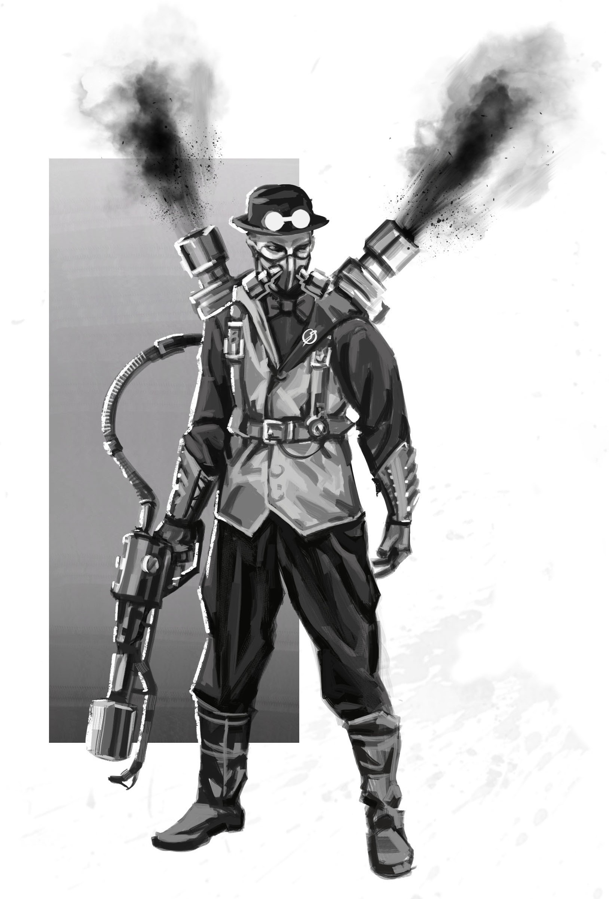
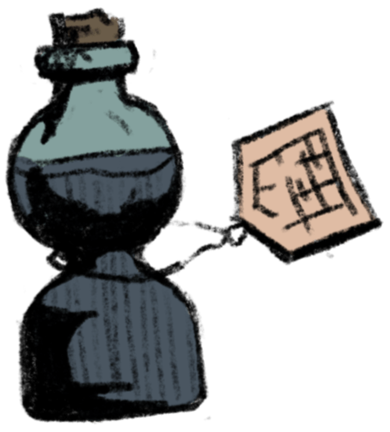

  

# Special items

 

:::: items

::: item

## Jumelles électroplasmiques

**+1 dé** pour ~~Étudier~~ une zone

:::

::: item

## Pistolet harpon

**+1 dé** pour ~~Manœuvrer~~ vers un lieu en hauteur

:::

::: item

## Log book

:::

::: item long-text

## Orbe d'oracle

Vous pouvez la sonder pour **poser une question au MJ sur l'avenir immédiat**.
Selon le résultat de votre jet pour ~~Communier~~, il répondra plus en moins en détails.
Vous devez **résister** (~~Détermination~~) le contrecoup psychique.

:::

::: item

 

## Master Ghost Key

Employée pour déverouiller une porte,
elle permet de choisir vers où elle s'ouvrira.
Le lieu de destination doit déjà avoir été visité par son porteur.

:::

::: item medium-img

## Candélabre

**+1 dé** pour agir sur le _Ghost Veil_

:::

::: item

## Main de Kotar

:::

::: item large-img

## Lance-flamme électroplasmique

:::

::: item small-img

## Sérum _physicker_ requin-démon

Transformation partielle en requin :
**+1 dé** de force physique féroce.
Résister (~~Prouesse~~) pour reprendre forme humaine.

:::

<!-- je n'ai pas les droits des images pour les illustrations ci-dessous

::: item

## Cœur de Kotar

:::

::: item

## Œil de Kotar

:::

::: item

## Cape d'ombre

Immobile dans l'obscurité, vous devenez invisible

:::

::: item medium-img

## Demon blade

**+1 dé** en combat lorsque vous ou votre adversaire a **peur**

:::

::: item

## Masque d'os de Léviathan

:::

::: item

## La croix ...

Casser une branche permet de remonter dans le temps

:::

::: item

## Masque aux Milles Visages

Permet de changer d'apparence à volonté.

:::

<!-- à partir d'ici je n'ai pas encore imprimé les cartes

::: item

## Huge bomb

Tier V

:::

<!-- end of commented-out section -->

:::: <!-- end of .items -->

 

Ce module pour _Blades in the Dark_ a été conçu en 2026 par Lucas Cimon.
 
Retrouvez moi sur [Ludochaordic @ chezsoi.org](https://chezsoi.org/lucas/blog/) et [mes jeux sur itch.io](https://lucas-c.itch.io/).

Merci à [Elliot Jolivet aka Tenseï](https://www.artstation.com/ej_tensei) pour la plupart des illustrations employées dans cette aide de jeu, qu'il a réalisé spécialement pour _Blades in the Dark_. Vous pouvez retrouvez quelques autres illustrations qu'il a réalisé pour ce jeu sur [le sub Reddit r/bladesinthedark](https://www.reddit.com/r/bladesinthedark/search?q=author%3Alucas-c&restrict_sr=on).

L'illustration de la _Master Ghost Key_ provient de [WTactics](https://github.com/wtactics/art) / [Arcmage](https://arcmage.org/) et est sous licence [CC-BY-SA 4.0](https://github.com/wtactics/art?tab=CC-BY-SA-4.0-1-ov-file).
Deux autres illustrations proviennent d'[Anthony Grasso partagées sur itch.io comme _asset pack_ "Odd Gob Games DirQuest Legacy Content"](https://toniokabonio.itch.io/legacy-content-pack).

