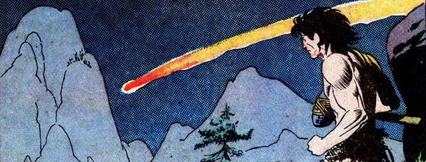

<!--
* reprendre notes manuscrites
* rédiger règles
* ? create an italics variant of the LoveYaLikeASister font
* ? ajouter pour chaque Rôle une liste de noms de Caverneux au choix
* FP finale : ajouter une section "Membres de la tribu" avec noms / rôles / joueurs
* inspis : Prehystoria, jeu Dadada, BD Euy, la série animée Primal
* comics sources:
    + https://comicbookplus.com/?dlid=19163
    + https://comicbookplus.com/?cid=1111 -> continue selection at https://comicbookplus.com/?dlid=19170
    + https://digitalcomicmuseum.com/ -> to check, unavailable today
* other images
    + https://game-icons.net/1x1/lorc/light-bulb.html
    + https://commons.wikimedia.org/wiki/File:Magdalenian_cave_drawing._Wellcome_M0008770.jpg
    + https://www.deviantart.com/vanderqnest/art/My-King-Kong-1321666708
    + https://www.deviantart.com/vanderqnest/art/Alamosaurus-1319200032
    + https://www.deviantart.com/vanderqnest/art/Wild-Ash-1255110835
    + https://www.deviantart.com/vanderqnest/art/Odins-Staff-1304100799
-->

# Caverneux
Incarnez des **homo sapiens dans une ère paléolithique fantasmée**, inspirée des comics PULP, où esprits animistes et dinosaures constituent votre quotidien.

## Communication

Le plus grand obstacle pour vous est <u>le langage</u>.

Vous êtes extrêmement limités dans votre vocabulaire :
lorsque vous communiquez entre vous, <u>vous ne pouvez employer que les ~~MOTS~~<u> sur votre feuille de Caverneux.

Ce n'est pas parce que vous connaissez un ~~MOT~~, et que vos camarades comprennent lorsque vous l'employez, qu'ils peuvent l'apprendre et l'utiliser également ! Oui c'est dommage, mais on ne peut pas dire non plus que vous soyez la tribu la plus futée de la vallée...

Les joueurs peuvent décrire les actions de leurs personnages et interagir normalement avec le Maître du Jeu, mais toutes les interactions entre joueurs doivent se limiter à la liste de mots. Bien sûr, les gestes et l'intonation jouent un rôle important dans la communication. Si vous voulez que les autres personnages « regardent là-bas », essayez de grogner et de pointer du doigt ; ça marche généralement. Faire asseoir quelqu'un est généralement aussi simple que de lui donner quelque chose pour s'asseoir. Si cela ne fonctionne pas, renversez le siège et grognez.

Quant au Maître du Jeu : faites simple. Vous n'êtes pas limité à la liste de mots, mais vous êtes encouragé à l'utiliser autant que possible pour expliquer les choses dans le monde. Ne vous perdez pas dans de longues descriptions et des détails superflus. La plupart des hommes préhistoriques ont une faible capacité d'attention et ne prêtent guère attention aux détails. En général, contentez-vous des descriptions les plus générales possibles. « Vous entrez dans une grotte. Ça sent mauvais. Vous entendez des grognements et des bruits sourds. »

## Actions
Lorsque un Caverneux entreprend une action comportant un risque,
le MJ demande au joueur de lancer un dé pour déterminer le résultat de cette action.

**Chaque** ~~MOT~~ que connaît votre Caverneux,
et qui peut vous aider à accomplir cette action,
vous permet de lancer **un dé supplémentaire**.
Le MJ est l'arbitre pour déterminer si un ~~MOT~~ est pertinent ou non selon le contexte.

Plus grand dé | Résultat
-|-
⚅ / ⚄ | C'est réussi parfaitement !
⚃ | C'est réussi **mais**...
⚂ | C'est raté **mais**...
⚁ / ⚀ | C'est raté, et **ça se passe mal**

### Idées de génie
Si double dé = #chiffre fétiche => +1 carte "idée de génie"
Utilisable quand souhaite le joueur
    => +1 mot (dans la liste ou inventé) / +2d6 / question au MJ / phrase en langage normal aux autres Caverneux

### Quand ça se passe mal
Soit :
* dégâts => +OUILLE ou -1 mot + carte Vision ?
* laisser le choix au joueur entre 2 conséquences négatives

### Actions conjointes
Si aide d'un autre Caverneux qui possède au moins un mot-concept appris ou un mot-objet qui peut aider => +1d6

### Mots spéciaux
~~FAIM~~/~~MALADE~~ => remplace temporairement un MOT

## Création de personnage
Pour créer votre Caverneux :
* choisissez une carte <u>Rôle</u>, et reportez vos Mots-concepts et votre Mot-objet
* choisissez un <u>Nom</u>, pour vous et collectivement pour votre tribu. Si vous manquez d'inspiration, vous serez les **Croc-Mignons**.
* choisissez et cochez 3 ~~MOTs~~ supplémentaires que vous avez appris

::: float-right row

<u>Chiffre fétiche</u> : 

<u>Joueur</u> : 

:::

::::: character-sheets

## Feuille de Caverneux

::: row
<u>Nom</u> : 

<u>Tribu</u> : 

<u>Rôle</u> : 
:::

<u>Mots-concepts</u> de base :

::: wordlist
* ~~ALLER~~
* ~~BON~~/~~PASBON~~
* ~~CHUT~~
* ~~DODO~~
* ~~DANGER~~
* ~~EAU~~
* ~~GROTTE~~
* ~~MANGER~~
* ~~NOUS~~/~~EUX~~
* ~~OUI~~/~~NON~~
* ~~OUPS~~
* ~~PETIT~~/~~GROS~~
* ~~PUE~~
* ~~TOI~~/~~MOI~~
* ~~TRUC~~
:::
Mots spéciaux :

::: wordlist with-ticks
* 
* 
* ~~FAIM~~ -1 mot
* ~~MALADE~~ -1 mot
* ~~OUILLE~~
:::

Mots appris :

::: wordlist with-ticks
* ~~ANIMAL~~
* ~~BÂTIR~~
* ~~BOUH~~
* ~~DESSIN~~
* ~~DINO~~
* ~~ESPRIT~~
* ~~FEU~~
* ~~FORT~~
* ~~GRIMPER~~
* ~~GRRR~~
* ~~IMITER~~
* ~~LANCER~~
* ~~PIÈGE~~
* ~~PISTER~~
* ~~PLANTE~~
* ~~PROCHE~~/~~LOIN~~
* ~~TAILLER~~
* ~~TISSER~~
* ~~TAPER~~
:::
... ou ajoutez vos mots :

::: wordlist with-ticks
* 
* 
* 
* 
* 
* 
* 
* 
* 
* 
:::

:::: row
 
<u>Mots-objets</u> :

::: wordlist with-ticks x4
* 
* 
* 
* 
:::
::::

## Feuille de Caverneux

::: row
<u>Nom</u> : 

<u>Tribu</u> : 

<u>Rôle</u> : 
:::

<u>Mots-concepts</u> de base :

::: wordlist
* ~~ALLER~~
* ~~BON~~/~~PASBON~~
* ~~CHUT~~
* ~~DODO~~
* ~~DANGER~~
* ~~EAU~~
* ~~GROTTE~~
* ~~MANGER~~
* ~~NOUS~~/~~EUX~~
* ~~OUI~~/~~NON~~
* ~~OUPS~~
* ~~PETIT~~/~~GROS~~
* ~~PUE~~
* ~~TOI~~/~~MOI~~
* ~~TRUC~~
:::
Mots spéciaux :

::: wordlist with-ticks
* 
* 
* ~~FAIM~~ -1 mot
* ~~MALADE~~ -1 mot
* ~~OUILLE~~
:::

Mots appris :

::: wordlist with-ticks
* ~~ANIMAL~~
* ~~BÂTIR~~
* ~~BOUH~~
* ~~DESSIN~~
* ~~DINO~~
* ~~ESPRIT~~
* ~~FEU~~
* ~~FORT~~
* ~~GRIMPER~~
* ~~GRRR~~
* ~~IMITER~~
* ~~LANCER~~
* ~~PIÈGE~~
* ~~PISTER~~
* ~~PLANTE~~
* ~~PROCHE~~/~~LOIN~~
* ~~TAILLER~~
* ~~TISSER~~
* ~~TAPER~~
:::
... ou ajoutez vos mots :

::: wordlist with-ticks
* 
* 
* 
* 
* 
* 
* 
* 
* 
* 
:::

:::: row
 
<u>Mots-objets</u> :

::: wordlist with-ticks x4
* 
* 
* 
* 
:::
::::

::::: <!-- end of .character-sheets -->

## Cartes Idée de génie
:::: cards

::: card brilliant-idea
### Idée de génie

Au choix :

* apprenez un nouveau ~~MOT~~
* exprimez UNE phrase sans limite de vocabulaire à vos camarades
* posez une question au MJ à laquelle il doit répondre
* +2d6 à un jet de dé
:::

::: card brilliant-idea
### Idée de génie

Au choix :

* apprenez un nouveau ~~MOT~~
* exprimez UNE phrase sans limite de vocabulaire à vos camarades
* posez une question au MJ à laquelle il doit répondre
* +2d6 à un jet de dé
:::

::: card brilliant-idea
### Idée de génie

Au choix :

* apprenez un nouveau ~~MOT~~
* exprimez UNE phrase sans limite de vocabulaire à vos camarades
* posez une question au MJ à laquelle il doit répondre
* +2d6 à un jet de dé
:::

::: card brilliant-idea
### Idée de génie

Au choix :

* apprenez un nouveau ~~MOT~~
* exprimez UNE phrase sans limite de vocabulaire à vos camarades
* posez une question au MJ à laquelle il doit répondre
* +2d6 à un jet de dé
:::

::: card brilliant-idea
### Idée de génie

Au choix :

* apprenez un nouveau ~~MOT~~
* exprimez UNE phrase sans limite de vocabulaire à vos camarades
* posez une question au MJ à laquelle il doit répondre
* +2d6 à un jet de dé
:::

::: card brilliant-idea
### Idée de génie

Au choix :

* apprenez un nouveau ~~MOT~~
* exprimez UNE phrase sans limite de vocabulaire à vos camarades
* posez une question au MJ à laquelle il doit répondre
* +2d6 à un jet de dé
:::

::: card brilliant-idea
### Idée de génie

Au choix :

* apprenez un nouveau ~~MOT~~
* exprimez UNE phrase sans limite de vocabulaire à vos camarades
* posez une question au MJ à laquelle il doit répondre
* +2d6 à un jet de dé
:::

::: card brilliant-idea
### Idée de génie

Au choix :

* apprenez un nouveau ~~MOT~~
* exprimez UNE phrase sans limite de vocabulaire à vos camarades
* posez une question au MJ à laquelle il doit répondre
* +2d6 à un jet de dé
:::

::: card brilliant-idea
### Idée de génie

Au choix :

* apprenez un nouveau ~~MOT~~
* exprimez UNE phrase sans limite de vocabulaire à vos camarades
* posez une question au MJ à laquelle il doit répondre
* +2d6 à un jet de dé
:::

::: card brilliant-idea
### Idée de génie

Au choix :

* apprenez un nouveau ~~MOT~~
* exprimez UNE phrase sans limite de vocabulaire à vos camarades
* posez une question au MJ à laquelle il doit répondre
* +2d6 à un jet de dé
:::

::: card brilliant-idea
### Idée de génie

Au choix :

* apprenez un nouveau ~~MOT~~
* exprimez UNE phrase sans limite de vocabulaire à vos camarades
* posez une question au MJ à laquelle il doit répondre
* +2d6 à un jet de dé
:::

::: card brilliant-idea
### Idée de génie

Au choix :

* apprenez un nouveau ~~MOT~~
* exprimez UNE phrase sans limite de vocabulaire à vos camarades
* posez une question au MJ à laquelle il doit répondre
* +2d6 à un jet de dé
:::

:::: <!-- end of .cards -->

## Cartes Rôle & Vision (pour scénario)
<!-- Objectifs de game design:
* qu'ils soient FUN à jouer durant le scénario
* créer des synergies entre persos, façon Lady Blackbird
* les rendre ATTRACTIFS
-->

:::: cards

::: card
### Shaman
<u>Mot-objet</u> : ~~TORCHE~~

<u>Mots-concepts</u> : ~~BOUH~~, ~~DESSIN~~, ~~ESPRIT~~

Tu veilles au bien-être psychique de la tribu.
Tu as en particulier de l'affection pour les plus jeunes :
Costaud & Dinompteur.

:::

::: card
### Chasseur
<u>Mot-objet</u> : ~~LANCE~~

<u>Mots-concepts</u> : ~~ANIMAL~~, ~~PIÈGE~~, ~~PISTER~~

Tu es devenu chasseur pour que personne dans la tribu n'ait <s>FAIM</s>,
surtout les anciens sur qui tu veilles avec affection : Brico & Shaman.

:::

::: card
### Dinompteur
<u>Mot-objet</u> : ~~LASSO~~

<u>Mots-concepts</u> : ~~GRIMPER~~, ~~DINO~~, ~~IMITER~~

Tu es fasciné par les <s>DINOS</s>.
 
Tu adores partir en expédition avec tes camarades Chasseur & Costaud, dont tu admires la bravoure.

:::

::: card
### Costaud
<u>Mot-objet</u> : ~~MASSUE~~

<u>Mots-concepts</u> : ~~FORT~~, ~~GRRR~~, ~~TAPER~~

Tu veilles à protéger la tribu des <s>DANGER</s>, quitte à t'interposer.
 
En particulier les plus fougueux et imprudents, qui néanmoins t'amusent : Brico & Dinompteur.

:::

::: card
### Brico 
<u>Mot-objet</u> : ~~BURIN~~

<u>Mots-concepts</u> : ~~BÂTIR~~, ~~TAILLER~~, ~~TRESSER~~

Tu crées tous les bijoux & outils de la tribu.
En particulier ceux nécessaires à Chasseur & Shaman,
dont tu admires la sagacité.

:::

::: card
### Araignée !

Tu aperçois une énorme araignée juste au-dessus de la tête du camarade que je te désigne !
:::

::: card
### Chasseur : Piège

Le camarade que je te désigne s'apprête à marcher dans un de tes pièges !
:::

::: card
### Shaman : Vision

Tu as une <b>vision</b> :
la boule de feu s'écrase,
et des demi-dieux s'extraient du brasier,
presque humains mais recouverts d'armures étincelantes.

Tu **apprends** le mot ~~FEU~~.
:::

::: card
### Vision

Tu as une <b>vision</b> :
tu es scientifique dans le laboratoire d'un vaisseau spatial,
et tu manipules avec grande précaution
un énorme rocher fluorescent en lévitation.
 
Tu <b>apprends</b> le mot <s>SCIENCE</s>.

:::

::: card
### Vision

Tu as une <b>vision</b> :
tu es pilote d'un vaisseau spatial
en train de s'écraser sur une planète,
et tu luttes désespérément pour empêcher le crash de ton appareil.
 
Tu <b>apprends</b> le mot <s>PILOTER</s>.

:::

::: card
### Vision

Tu as une <b>vision</b> :
tu vois les rescapés du crash qui s'organisent pour survivre,
et certains d'entre eux se transforment au fil des jours en <b>gorilles</b>.
 
Tu <b>apprends</b> le mot <s>MUTAGÈNE</s>.

:::

::: card
### Vision

Tu as une <b>vision</b> :
tu te vois défendre ta tribu avec une arme à feu,
pour vous protéger d'une attaque de dinosaures.
 
Tu <b>apprends</b> le mot <s>TIRER</s>.

:::

:::: <!-- end of .cards -->

## Scénario
Objectifs mécanico-ludiques :
* permettre à chaque Rôle de briller à un moment
* impliquer un max de ~~MOTS~~ de la feuille de **Caverneux**

### Synopsis
* les Caverneux se rappellent progressivement des ~~MOTS~~ / souvenirs
* les humains sont en réalité des rescapés d'un crash de vaisseau spatial
* la plupart ont été exposés à une substance mutagène qui les transforme en gorilles

### Intro - Tombée du ciel
> C'est l'après-midi. Le ciel est dégagé, l'air est doux.
>  Pour profiter de la chaleur des rayons du soleil,
> vous vous reposez à l'entrée de votre grotte-maison.
>  Soudain, le ciel s'obscurcit. D'étranges grondements sourds s'intensifient...
>  C'est comme un orage mais... c'est pas un orage.
>  Comment réagissez-vous ?

Laissez quelques instants aux joueurs pour décrire les réactions de leurs Caverneux.

> Le ciel semble se déchirer. Une traînée orange aveuglante apparaît à travers le ciel.
>  Une boule de feu fend les cieux et passe au-dessus de vous.
>  Elle descend vers le sol, et finit par disparaître au loin, derrière **le Pic du Roc Noir**.
>  Vous entendez un violent impact, et une onde de choc se propage jusqu'à vous en faisant trembler le sol.

Si les joueurs ne sont pas suffisamment intrigués pour se rendre sur place,
transmettez la carte **Vision** au Shaman.

### Acte 1 - Le voyage
3 étapes (à représenter sur un plan) :
+ la plaine
    * hautes herbes
    * troupeau de diplodocus dans la plaine
    * raptors qui les épient
+ la faille
    * pont de singe tout pourri : il s'effondre si les Caverneux tentent de l'emprunter
    * ptérodactyle qui menace d'embarquer un Caverneux
+ la jungle
    * tambours
    * gorilles
    * raptors

### Acte 2 - Le cratère
* tombée de la nuit
* immense cratère, avec 3 choses qui sautent aux yeux (à représenter sur un plan) :
    + un cimetière de mammouths
    + au centre : une structure géante et massive de métal sombre, qu'une végétation danse recouvre, et au cœur de laquelle vous apercevez une lueur verte fluorescente
    + sur le côté, une autre structure de métal, plus petite, dont sort un humanoïde revêtu d'une armure

T-Rex débarque :
* cosmonaute sort un objet, qui tombe lorsqu'il se fait dévorer
  -> artefact téléporteur ~~WARP~~ (mot-objet)
* T-Rex se jette sur Caverneux

 

::: banner music
🎶 Musique suggérée : [Night Feeder's Pursuit | Primal Music (YouTube)](https://www.youtube.com/watch?v=7tqgjUMXHI4)
:::

 

* gorilles débarquent -> ring de combat
* volcan rentre en éruption

## Autres idées 
* dinos zombies (exposés au mutagène)

## Bandes sons
* [Primal Saison 1 - Bande son officielle (YouTube)](https://www.youtube.com/playlist?list=PLl3EOgDGz0DOVXjrT9VOQ_jLtRqzFR8HE)
* [Primal Saison 3 - Bande son officielle (YouTube)](https://www.youtube.com/playlist?list=PLBKadB95sF47NgAGemzS_5xpGq-TZhF5i)
