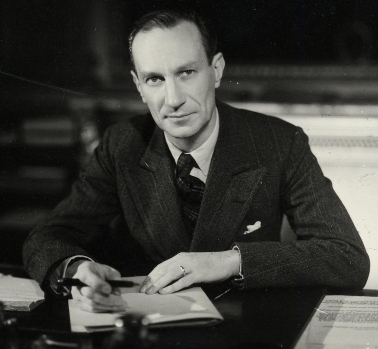
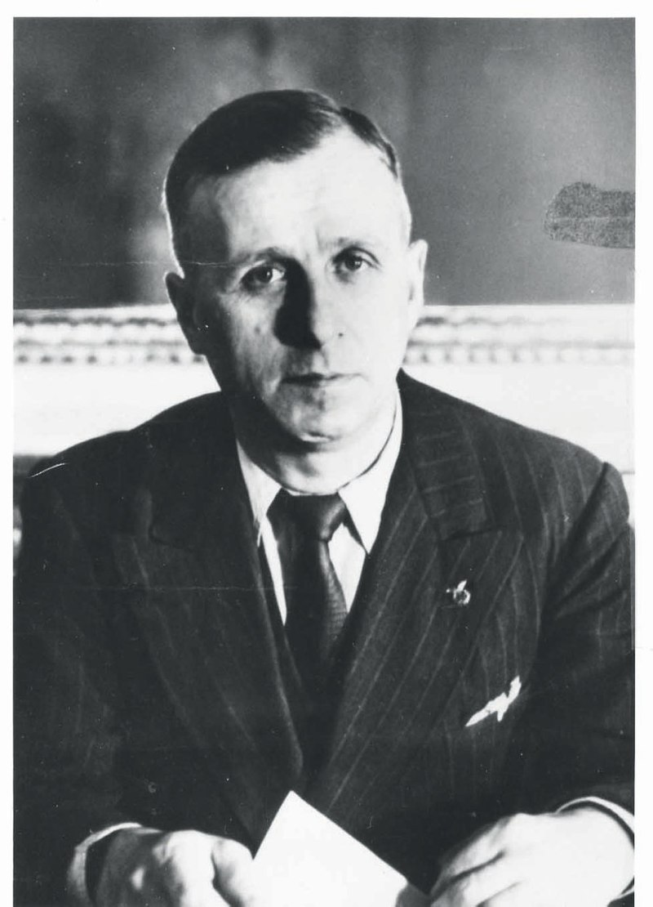
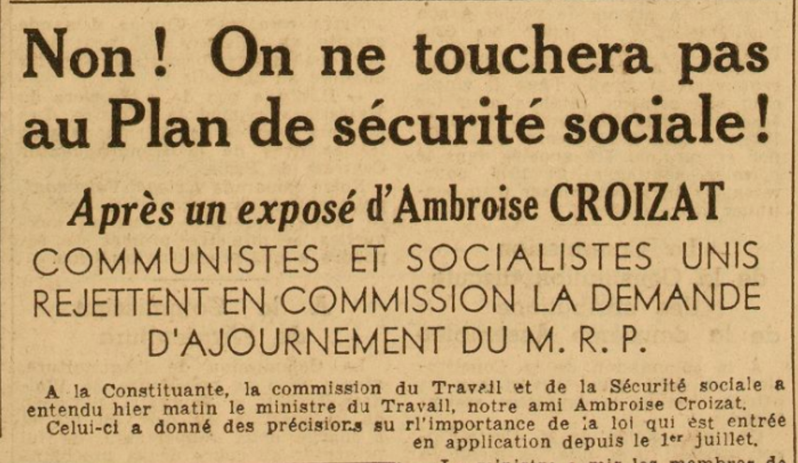
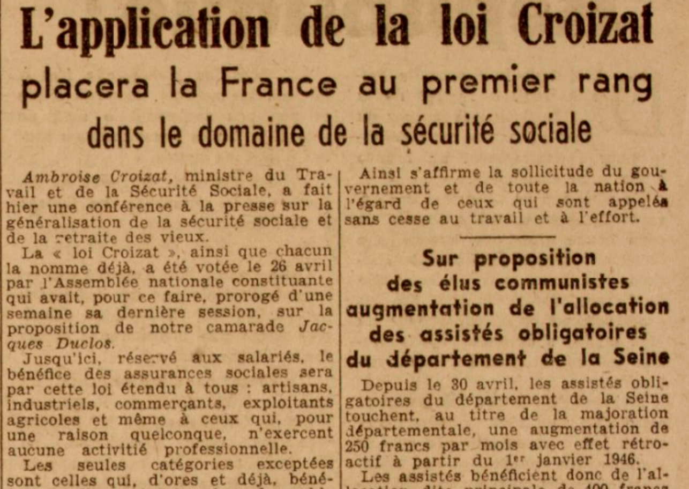
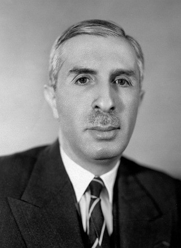
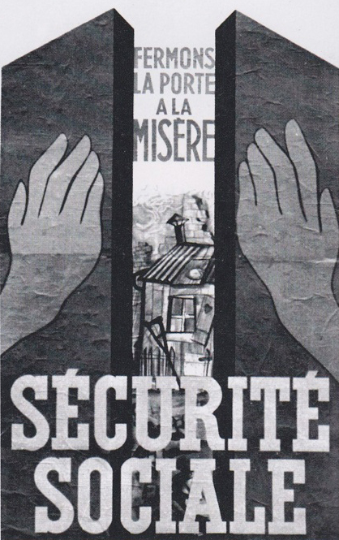
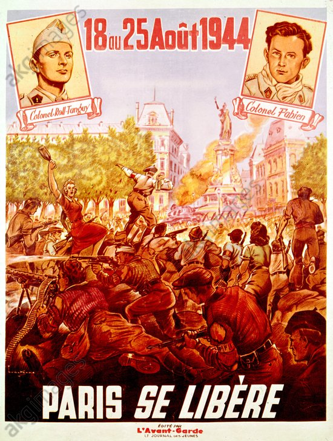
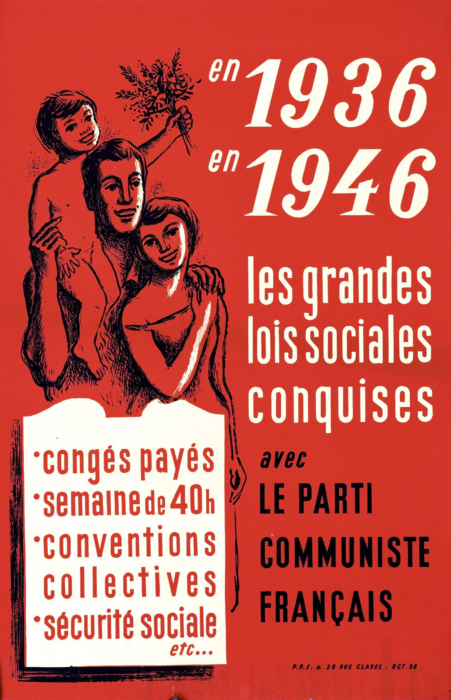

<!-- Next:
- finir les Moves:
- définir les participants aux négos & leurs comportements / tactiques
- clarifier et mettre au propre les éléments de négo
- développer la dimension uchronique
- mettre en forme les FPs
- demander de l'aide sur un forum pour la mise en page ? (inspi Daylight Robbery)
- ajouter Objectifs & Principes, en se basant sur le "Guide de création à l'apocalypse" ?
- demander à quelqu'un avec un smartphone de gender-swap les personnages (avec Snapchat / Face app)
- mentionner "Guide de création à l'apocalypse" de Bastien Acritarche Wauthoz en remerciement
- Com' supplémentaire : ATTAC & http://www.pbta.fr & contacter auteurs du jeu ZAD: http://zadlejeu.revolublog.com / jeu.zad@gmail.com
- idée de variante "blackOps": [MICE](https://en.wikipedia.org/wiki/Motives_for_spying), écoutes, pression politique, séduction, ...
-->

Créons la Sociale
=================

> Dans ce court jeu de rôle, retracez la mise en place de la Sécurité Sociale,
> dans une histoire légèrement uchronique au lendemain la 2e guerre mondiale.

> Incarnez les pères fondateurs de cette nouvelle invention sociale,
> mandatés par le libérateur de la nation, Charles De Gaulle,
> pour construire par la voie politique ce nouveau système qui permettra aux français,
> de « vivre sans l’angoisse du lendemain, de la maladie ou de l’accident de travail,
> en cotisant selon ses moyens et en recevant selon ses besoins. »

Pour jouer à ce jeu de rôle vous aurez besoin :

- d'une Meneuse de Jeu expérimentée et 3 ou 4 joueuses
- d'une poignée dés à 6 faces
- ce jeu imprimé et quelques crayons
- 4h à 5h de temps devant vous

## Les personnages des joueuses
Ils sont tous membres du gouvernement provisoire de la République française :

### Alexandre/a Parodi
<!-- https://www.ordredelaliberation.fr/fr/compagnons/alexandre-parodi -->

Ministre du travail et de la sécurité sociale.
Héro de la libération, nom de code _Quartus_ puis _Cérat_ dans la résistance.

_Moves_:

- **entrée théatrale** : si choisis d'abandonner tes camarades pendant les 10 premières minutes de négociation,
puis de faire une entrée fracassante avec une _punchline_ qui impressionne tes interlocuteurs
(tu viens de tempérer les hardeurs de militants communistes prêt à organiser une grêve générale,
tu es en retard à cause d'une réunion de crise secrète avec Le Général...),
gagnes un bonus de **+?? à ??** pour le reste de la négociation.

### Ambroise/ine Croizat
<!-- Source: Wikipedia -->

Élu communiste influent à l'assemblée constituante

_Moves_:

- **éditorial dans _L'Humanité_**.

  
  

Avec 29% des voies au parti communiste durant les dernière élections, votre message est certain d'avoir un écho chez les français.
Lance 2 dés + **Éloquent**. Sur **10+**, choisis deux conséquences dans la liste-ci-dessous. Sur **7-9**, une seule :
  * met en avant un des éléments constitutifs fort du projet de Sécurité Sociale :
    celui-ci pourra difficilement être attaqué par l'opposition dans la prochaine phase de négociation
  * l'opinion publique augmente de 10% en faveur du projet de sécurité sociale

- **5 millions d'adhérents à la CGT**: **??**

### Pierre/ette Laroque

Membre du Conseil d'Etat, nommé Directeur général de la Sécurité sociale depuis le 5 octobre 1944.
Spécialiste du droit administratif

_Moves_:

- **cerner quelqu’un** : lance 2 dés + **Stratège**. Pendant que tu discutes avec lui, tu peux lui poser des questions auxquelles il doit répondre sans mentir.
2 sur 10+, ou 1 seule sur 7-9 :
  * est-ce que ton personnage dit la vérité ?
  * qu’est-ce que ton personnage a l’intention de faire ?
  * qu’est-ce que ton personnage espère que je fasse ?
  * comment est-ce que je peux convaincre ton personnage de ____ ?

### George/tte Buisson
<!-- + inspi François Billoux -->
<!-- Source: Wikipedia -->

Ministre de la santé publique

---

**Rêves**:
- cotiser selon ses moyens et recevoir selon ses besoins
- instaurer une nouvelle société plus juste et solidaire, portée par les idéaux de la Résistance
- la retraite ne sera plus l'antichambre de la mort mais une nouvelle étape de la vie
- que plus aucun camarade ouvrier ne craigne le spectre de la maladie ou de l'accident de travail
- mettre à l'abri du besoin les familles des travailleurs en instaurant une entraide nationnale

**Stats**
- **Éloquent** : charisme, force de conviction, capacité à convaincre les foules
- **Influent** : contacts, réseaux d'information 
- **Stratège** : connaissance du monde politique & des arcanes législatives

Exemples d'actions / _moves_ de base ?

**_Moves_** à répartir entre PJs :
- **réseau d'amis politiques** t'apportant de précieux renseignement : lance 2 dés + **Influent**. Sur un succès, tu peux poser des questions à la MJ.
Si tu agis ensuite en prenant la réponse de la MJ en considération, tu reçois +1 au prochain jet.
Sur 10+, tu peux poser 2 questions. Sur 7-9, 1 seule :
  * à quel argument est-ce que X sera le plus sensible ?
  * à quelle (mauvaise) surprise je peux m'attendre pendant la négociation ?
  * commment pourrais-je marquer des points auprès de X en amont, pour en faire mon allié ?
- **intimider** quelqu'un : lance 2 dés + **Éloquent**. Sur 10+, il t’obéit du mieux qu’il peut. Sur 7-9, la MJ choisit parmi :
  * il cède, mais pas exactement comme tu voulais
  * il cède, mais cela rejaillit sur ta réputation -> tu perds un point d'**Influence**
  * il préfère quitter la table des négociation et s'abstenir de peser dans la balance du débat
- **demander conseil** à ?? <!-- une assemblée de militants / un personnage célèbre ?? -->
Nomme-le et la MJ te donnera son conseil. Si tu suis le conseil, prends +1 à tous les jets de dés que tu fais en le suivant.
- **appui politique** : lance lance 2 dés + **Influent**. En cas de réussite, choisis un allié politique qui participe à tes côtés à la négociation.
Sur 10+, il soutient entièrement ta position et tes arguments. Sur 7-9, il y a au moins un point de la négociation sur lequel il n'est pas de ton côté.
- **ça marche ailleurs** : la MJ détermine lequel des pays suivant admire le plus ton interlocuteur :
l'Angleterre (_National Insurance_ en 1911 & rapport Beveridge de 1942), les USA (_New Deal_ de Roosevelt & projet de loi Wagner-Murray-Dingell),
ou l'Union Soviétique (article 120 de la Constitution de 1936).
Si tu devines correctement, tu gagnes **+??**.
<!-- + l'Allemagne (sécurité sociale de Bismarck en 1983)
« BUISSON rappelle l'élan qui entraîne les peuples vers l'organisation généralisée de la sécurité sociale.
Les exemples britannique (Beveridge) controversé par les « conservateurs entêtés à la défense de leurs privilèges sociaux », américain (Wagner-Murray-Dingell),
canadien (plan Marsh), néo-zélandais, suisse, belge, d'Afrique australe, d'Amérique du sud sont évoqués. Il rappelle l'effort de ROOSEVELT et de l'URSS
qui même pendant la guerre a développé le système des assurances sociales que gèrent les syndicats ouvriers. » -->
- **titiller la ferveur idéologique** : la MJ détermine à quel Rêve ton interlocuteur est le plus sensible.
Si tu deviné juste, tu obtiens un bonus de **+??**

## Uchronie
<!-- inclure des illus pour chaque -->
Une technologique en particulier s'est développée, décidée d'un commun accord par toutes les joueuses ou tirée au hasard :
- ~~⚀~~: les micros & télécoms instantannés
- ~~⚁~~: 
- ~~⚂~~: 
- ~~⚃~~: 
- ~~⚄~~: 
- ~~⚅~~: 

## Les obstacles & opposants
Représenté chacun, sur feuille de "tableau de bord", par un score de **satifaction** vis-à-vis du projet de loi :
MAX indique un soutien indéfectible et MIN une opposition totale.
Si la satisfaction est MOYENNE ou plus, ce groupe soutient le projet via ses représentants à l'assemblée.
Si celui-ci descend en-dessous d'un certain seuil, l'effet indiqué se déclenche.

- l'**opinion publique**.
**En-dessous de ??**: 
**Satisfaction en-dessous de ??**: 
- le patronat : acroissement des réglémentations nous étouffe et nous paralyse
- les milieux natalistes, qui craignent que les allocations ne soient plus en mesure de favoriser la natalité française
- le syndicat des médecins libéraux, farouches opposants,
pour éviter la "médecine de caisse", où les médecins seraient "les ordres" des caisses de sécurité sociale
- l'Eglise / Gaston TESSIER de la Confédération Française des Travailleurs Chrétiens (CFTC)
Il a la crainte de celui-ci que la réforme « supprime un régime de liberté pour lui substituer un régime de contrainte. »
Le Figaro, 2 août 1945, p. 2.

« Des excès du libéralisme individualiste, on risque de passer aux excès de la contrainte sociale. […]
ni École unique, ni jeunesse unique, ni Syndicat unique, ni parti ouvrier unique, ni Caisse unique de sécurité.
L’unicomanie est une manie totalitaire. »
La Croix, 28 juillet 1945.

« Il est à craindre que cet organisme à tous égards monstrueux, avec son budget de plusieurs dizaines de milliards,
ne soit une machine administrative [d'une effarante] lourdeur bureaucratique. »
La Croix, 11 juillet 1946
<!--
Le 2 novembre 1950, Pie XII prononça ces mots lors d'une allocution:
« Il y a une parole que l’on répète actuellement beaucoup :"sécurité sociale" (…).
Si cela veut dire sécurité grâce à la société (…), Nous craignons non seulement que la société civile entreprenne une chose qui,
de soi, est étrangère à son office, mais encore que le sens de la vie chrétienne et la bonne ordonnance de cette vie n’en soient
affaiblis, et même ne disparaissent (…) »
-->
- Mouvement Républicain Populaire (MRP) : Georges Bidault (cofondateur)
- les agriculteurs, les fonctionnaires : veulent garder leur régime

Le Parti Communiste Français (PCF) et la Section Française de l'Internationale Ouvrière (SFIO) peuvent être considérés
comme soutenant entièrement le projet de mise en place de la Sécurité Sociale.

## Déroulement de la partie
- les PJs réalisent des actions en amont de chacune des 6 rencontres successives,
puis jouent en _roleplay_ ces rencontres, dans le but de mettre en place cette réforme avant que la majorité de change !
-> en négo, en-dehors des _Moves_, pas de jet de dé
- leurs adversaires vont tenter de négocier des points de fonctionnement du nouveau système :
aux PJs d'éviter que le projet ne se vide de son essence !
Mais des compromis seront nécessaire, qui se traduiront par des découpes / modifications manuscrites
sur la feuille symbolisant le nouveau système de sécurité sociale
- chaque PJ a un jeton par phase, qu'il peut employer pour effectuer un _Move_ en amont, où durant la négociation.
Un _Move_ employé durant une phase ne pourra pas être employé à nouveau dans la suivante.

### Prologue : à la veille de la libération de Paris

**18 août 1944, au soir**

Il y a quelque semaines, les troupes américaines ont débarqués en Normandie.
Charles De Gaulle est revenu en France, et la libération du pays s'organise.
À Pairs, la trêve établie par le Consul général de Suède Nordling vient d'entrer en vigueur.
Mais les Forces Françaises Libres ont bien l'intention de reprendre la ville.
et les derniers préparatifs sont en cours pour organiser une manoeuvre militaire massive dans les jours à venir.

Demain, Alexandre Parodi a décidé qu'il irait prendre le risque de rencontrer von Choltitz en sa qualité de ministre,
pour négocier d'épargner la capitale. En effet, ce commandant de l'armée allemande a reçu l'ordre d'Hitler de détruire Paris.

L'heure est grave, car le destin de la France va se jouer dans les jours à venir.
Ce n'est pas la première fois que vous risquerez votre vie, et pourtant vous ne trouvez pas le sommeil.
Vos insomnies vous font vous retrouver tous à la lumière d'une bougie.
Vous êtes tous amis de lutte, et parfois de longue date.
Cela fait déjà plusieurs mois que vous réfléchissez ensemble, depuis Alger, à l'organisation de la nouvelle république, une fois le pays libre.
Mais ce soir, un immense élan d'espoir vous fait rêver les choses en grand.

Chaque joueuse choisit un Rêve sur sa feuille, et le partage avec les autres en incarnant son personnage.
N'hésitez pas à broder et à inventer des élements fictifs :

- des souvenirs de combats menés en commun
- des évenements tragiques, des drames ou des injustices, vécus ensemble
- des promesses, des serments

Quelques phrases d'accroche :

- ça y est mes amis...
- demain, nous ferons de la France...
- égalité, solidarité, monde plus juste...

### Juin 1945
Ça y est, la France est libérée !

Le contexte :

- 31 août 1944 : le Gouvernement Provisoire de la République Française (GPRF) s'installe à Paris
- 2 septembre : premier conseil des ministres du GPRF à Paris
- 5 octobre : les femmes obtiennent le droit de vote
- 7 novembre : séance inaugurale de l'Assemblée consultative provisoire installée au Palais du Luxembourg à Paris,
  représentant les mouvements résistants, les partis politiques et les territoires engagés dans la guerre au côté des Alliés
- 14 décembre : nationalisation des ressources énergétiques
- 10 decembre 1944, signature à Moscou par De Gaulle & Georges Bidault avec Staline & son bras droit Molotov du pacte d'assistance franco-soviétique
- 16 janvier 1945 : nationalisation des usines Renault
<!-- Historiquement :
- 22 février : création des comités d'entreprise
-->
- 29 avril : élection municipales
- 7 & 8 mai 1945 : Capitulation de l'Allemagne

#### Négociation
**Enjeu :** faire adopter l'ordonnance par vote de l'Assemblée consultative cet été
& bonus : création des comités d'entreprise

**Participants :** négocier des points critiques du contenu de l'ordonnance avec des membres influents de la Commission consultative de la Sécurité Sociale

- un médecin
- un parlementaire

### Décembre 1945
Le contexte :

<!-- Historiquement :
- 1er août : débats de l’Assemblée consultative provisoire -> avis favorable
- octobre : 2 ordonnances sur la Sécurité sociale
-->
- 24 septembre : Ordonnance créant un Conseil de l'Ordre des Médecins
- octobre : élection de la première Assemblée constituante, remplaçant l'Assemblée consultative provisoire
- novembre : nouveau gouvernement : de Gaulle est réélu président du GPRF, mais +5 ministres communistes !
Parodi laisse sa place à Croizat comme ministre, et devient le 1er ambassadeur aa nouvellement créé Conseil de sécurité des Nations Unies
- 2 décembre : nationalisation de la Banque de France et des grandes banques de dépôt.

Inflation ++

#### Négociation
**Enjeu :** mettre en place les caisses primaires de sécurité sociale et d’allocations familiales

**Participants :** des représentants de la CGT qu'il faut convaincre d'investir toutes leurs ressources dans cet effort de création

- 

### Avril 1946
Le contexte :

- 19 janvier 1946 : Démission du général de Gaulle ! -> nouveau gouvernement, présidé par Félix Gouin, alors président de l'Assemblée
- 8 avril : nationalisation du gaz et de l'électricité de France, création d'EDF & GDF
- un projet de nouvelle Constitution est débattu
<!-- Historiquement :
- 25 février : Rétablissement de la semaine de 40 heures, abrogée pendant le régime de Vichy
- 25 avril : vote de la loi n° 46-835 de nationalisation des grandes compagnies d'Assurance
- 22 mai : Ordonnance portant généralisation de la sécurité sociale
- 29 mai : Ambroise Croizat annonce la suppression de l'abattement de 10% sur le salaire féminin
-->

#### Négociation
**Enjeu :** faire adopter la loi de nationalisation des grandes compagnies de l'Assurance, ainsi que la loi de généralisation de la sécurité sociale

**Participants :** quelques membres de l’Assemblée constituante dont le vote sera crucial

- 

### Août 1946
Le contexte :

- 2 juin : Élection de la seconde Assemblée Nationale Constituante.
- 12 juin 1946 : Félix Gouin, suite au rejet du projet de Constitution qu'il soutenait, remet la démission de son gouvernement et cède la place à Georges Bidault.
- 16 juin : discours de De Gaulle à Bayeux, très critique du gouvernement en place
- en août, 123 caisses primaires de sécurité sociale et 113 caisses d’allocations familiales (CAF) ont été mises en place !
<!-- Historiquement :
- 22 août : Les allocations familiales sont étendues à pratiquement toute la population.
- 13 septembre 1946 : l’assurance vieillesse sera étendue à toute la population active au 1er janvier 1947
- 27 octobre : Naissance de la IVe République. Le Préambule de la nouvelle Constitution reconnaît le droit de tous à « la protection de la santé »
- 30 octobre : La Médecine du travail intègre la sécurité sociale.
(Les lois n° 46-2425 & 46-2426 du 30 octobre 1946 intègrent dans le champ de la sécurité sociale les maladies professionnelles, ainsi que la prévention et la réparation des accidents du travail.)
-->

#### Négociation
**Enjeu :** faire adopter à l'Assemblée Constituante l'extension des allocations familiales, la création de la médecine du travail
& en bonus avoir une mention sur « la protection de la santé » dans la Constitution de la IVe République,
le tout avant l'avènement de la IVe République
<!-- conditions de la rédaction de la Constitution : https://www.france-libre.net/le-preambule-de-la-constitution-de-1946/ -->

**Participants :**

-

### Épilogue
La IVe République Française est née !

> En 1946, le revenu salarié d’une famille de trois enfants (la moyenne dans les familles populaires) est constitué pour plus de la moitié par des allocations familiales

## Éléments constitutifs du projet de Sécurité Sociale
En résumé: **universalité, unité, uniformité**

« La sécurité sociale est la garantie donnée à chacun qu’en toutes circonstances, il disposera des moyens nécessaires pour assurer sa subsistance
et celle de sa famille, dans des conditions décentes. »

À schématiser sous forme de rectangles à découper :

- soumission de tous les salariés & employeurs à la cotisation
- extension à trois ans du droit aux prestations pour maladie
- maintien de la retraite à 60 ans
- détermination des tarifs médicaux par accords entre les syndicats de médecins et les caisses des assurances sociales
- régime unique
- représentativité au Conseil d'Administration des Organismes de Sécurité Sociale nouvellements crées :
% représentents salariés, % représentants patronat
- caisse unique par département <!-- raison d'une opposition en août 1945 -->
- nomination –et non à l’élection- des administrateurs <!-- raison d'une opposition en août 1945 -->

Autres éléments de négociation :

- taux de cotisation fixe / à décider par les salariés eux-mêmes

- mise en place de la médecine du travail (maladies professionnelles & accidents du travail)

- suppression de l'abattement de 10% sur le salaire féminin

- droit syndical pour les fonctionnaires

- semaine de 40 heures

- création des comités d'entreprise dans les établissements de plus de 50/100 employés, avec
heures de délégation des salariés élus + droit de consultation / information obligatoire sur les bénéfices + assistance d'un expert-comptable
+ local & matériel + subvention de l'employeur proportionnelle à la masse salariale

-> laisser la possibilité de remplacer certains d'entres eux par des idées de leur invention

## Conseils à la MJ
- s'il te semble que les PJs sont désemparés,
introduit une scène où De Gaulle les convie dans son bureau
pour remettre les choses au point
- lors de la 3e phase de jeu (avril 1946), si tu penses que la situation s'y prête bien et que tu souhaites semer un peu la zizanie,
fait passer à une joueuse de ton choix le mot suivant avant d'entrer à la table des négociations :
> Tu rencontres confidentiellement quelques ministres et une poignée de fidèles alliés politiques :
> le projet de Constitution de Félix Gouin sera bientôt rejeté, et en conséquence ce dernier va très probablement démissioner.
> C'est une opportunité pour toi de devenir président du Conseil !
> Mais pour pleinement rallier le support politique nécessaire, il te faudra lâcher du lest sur la question de la Sécurité Sociale.
> En clair : si tu sabordes la prochaine négociation, tu accéderas très certainement à la présidence du gouvernement français.

## Pour plus d'infos sur le sujet :
- [Le film « La sociale »](https://chezsoi.org/shaarli/?jHaUCg)
- [Pierre Laroque et les origines de la Sécurité sociale](https://www.cairn.info/revue-informations-sociales-2015-3-page-12.htm) (sur cairn.info)
- 3 juin 1944 - 27 octobre 1946 : [Gouvernement provisoire de la République française](https://fr.wikipedia.org/wiki/Gouvernement_provisoire_de_la_R%C3%A9publique_fran%C3%A7aise) (sur Wikipédia)
- [La “sécu” en mode mineur. Le regard de la presse dans l’immédiat après-guerre](https://www.cairn.info/revue-les-tribunes-de-la-sante1-2015-2-page-51.htm) (sur cairn.info)
- [Une autre histoire de la Sécurité sociale](https://www.monde-diplomatique.fr/2015/12/FRIOT/54395) (sur monde-diplomatique.fr)
- [Fresque vidéo de l'INA sur l'histoire de la Sécurité Sociale](https://fresques.ina.fr/securite-sociale/fresque) (sur ina.fr)
- anecdote : [Comment fut signé à Moscou le pacte franco-soviétique](https://www.monde-diplomatique.fr/1955/01/GARREAU/21307) (sur monde-diplomatique.fr)
- [Ordonnance n° 45-2250 du 4 octobre 1945 portant organisation de la sécurité sociale](https://www.legifrance.gouv.fr/affichTexte.do?cidTexte=JORFTEXT000000698857) (sur legifrance.gouv.fr)
<!--
[La Sécurité sociale, pas vraiment un « vestige communiste de 1945 »](https://www.lemonde.fr/les-decodeurs/article/2017/10/26/la-securite-sociale-un-vestige-communiste-de-1945_5206101_4355770.html)
« Sur le plan institutionnel, la continuité [avec les assurances sociales d’avant-guerre] domine, incontestablement. A tel point que je parlerais plus de “réformes des assurances sociales” que de création [de la Sécurité sociale] ex nihilo. »
« Ce qui était vraiment nouveau en 1945, c’était l’idée de voir en grand, que la Sécurité sociale doit véritablement devenir un droit au sens fort du terme et que tous les Français doivent pouvoir en profiter. »
-->

