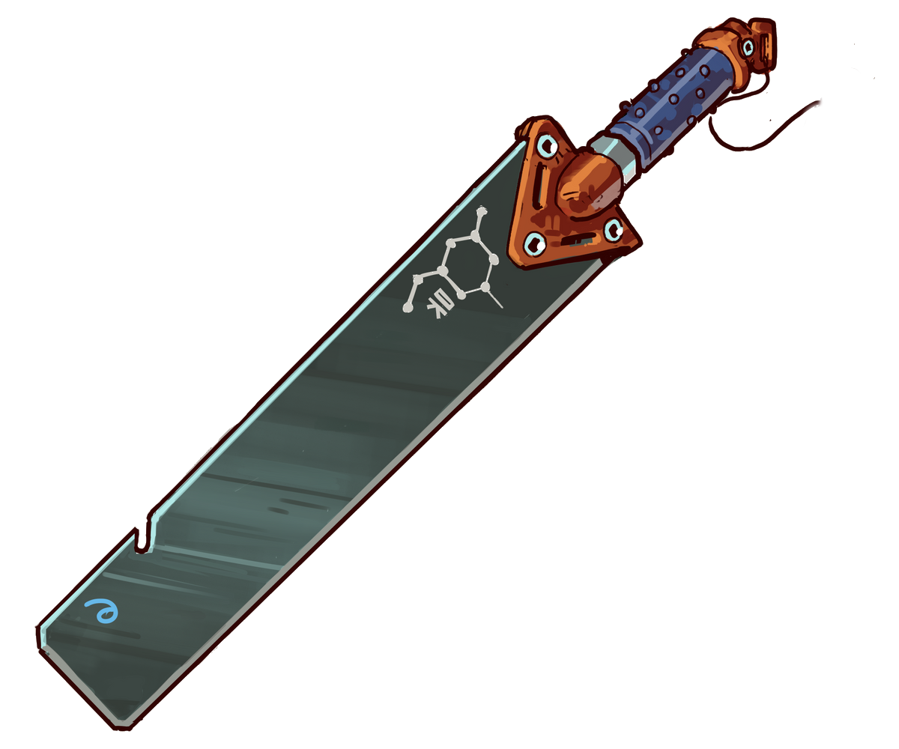
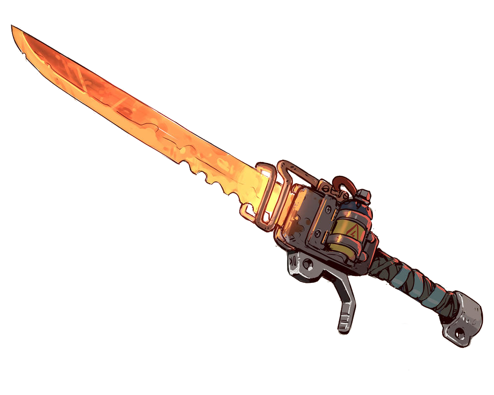
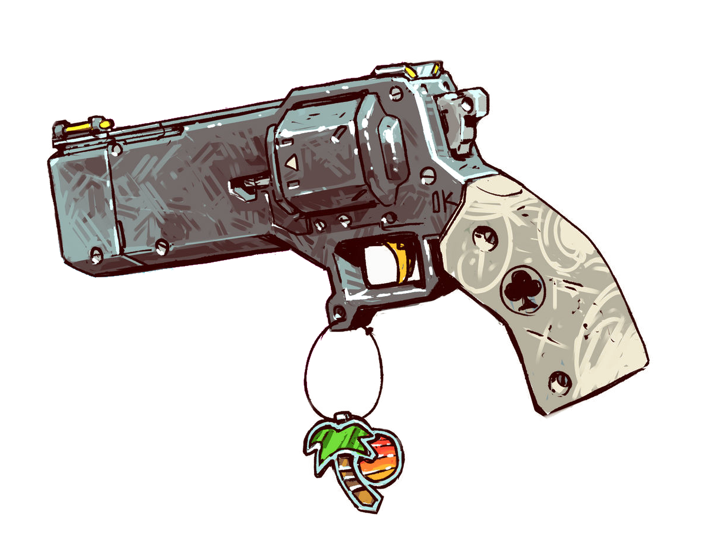
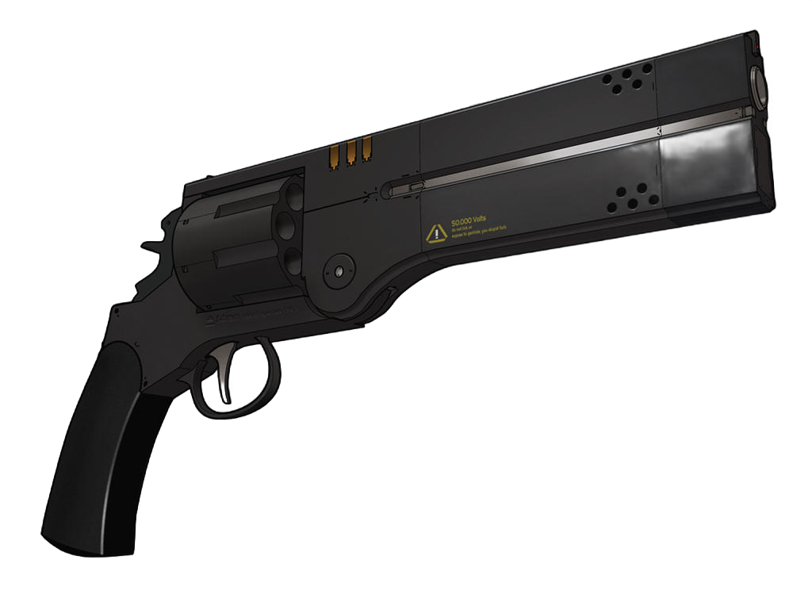
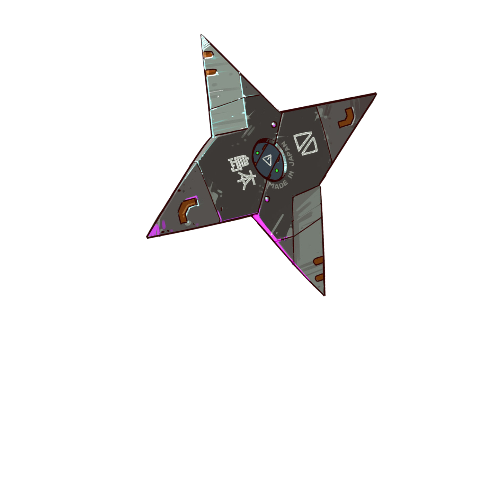
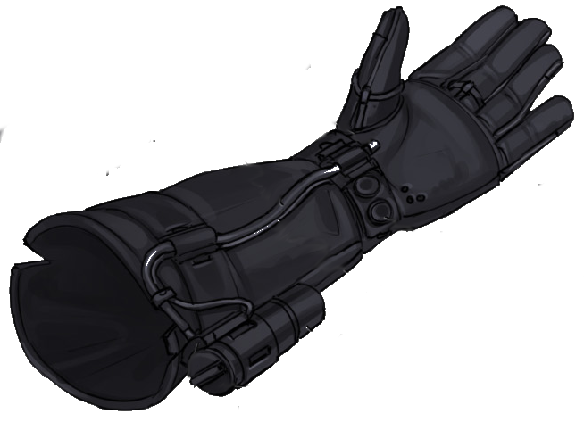
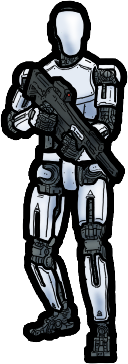

::::: cards

:::: card

::: name
### Glaive de Graphène
:::
::: description
* 2 dégâts
* attaque avec un test de : **Combat** _(Physique)_
:::
::::

:::: card

::: name
### Thermo-découpeuse
:::
::: description
* 2 dégâts
* attaque avec un test de : **Combat** _(Physique)_
:::
::::

:::: card

::: name
### Magnum
:::
::: description
* 2 dégâts
* attaque avec un test de : **Combat** _(Adresse)_
:::
::::

:::: card

::: name
### Magnum
:::
::: description
* 2 dégâts
* attaque avec un test de : **Combat** _(Adresse)_
:::
::::

:::::
::::: cards

:::: card

::: name
### Shuriken
:::
::: description
* 1 dégât
* attaque avec un test de : **Combat** _(Adresse)_
:::
::::

:::: card

::: name
### Shuriken
:::
::: description
* 1 dégât
* attaque avec un test de : **Combat** _(Adresse)_
:::
::::

:::: card

::: name
### Shuriken
:::
::: description
* 1 dégât
* attaque avec un test de : **Combat** _(Adresse)_
:::
::::

:::: card

::: name
### Lévito-gant
:::
::: description
* envoi des nanites sur la cible pour la faire léviter un instant
* test de **Savoir-Faire** _(Adresse)_ +1 réussite. Contient 2 charges.
:::
::::

:::::
::::: cards

:::: card npc

::: name
### Androïde - sécurité
:::
::::

:::: card npc

::: name
### Androïde - sécurité
:::
::::

:::: card intel scientist
::: name
:::
::: description
Vous avez fait jouer vos contacts dans le monde de la recherche scientifique : Mars Inc. est réputée pour payer grassement ses chercheurs salariés, mais il s'y passe des choses très louches, et la rumeur court que le gouvernement pourrait retirer ses fonds et son accréditation à la multinationale...
:::
::::

:::: card intel coder
::: name
:::
::: description
Tu peux désormais poser des questions à ce mystérieux programme militaire dans ton ordinateur, en les inscrivant sur des petits papiers puis en les transmettant au MJ.
:::
::::

:::::
::::: cards

:::: card fillable
::: name
:::
::: description
:::
::::

:::: card fillable
::: name
:::
::: description
:::
::::

:::: card fillable
::: name
:::
::: description
:::
::::

:::: card fillable
::: name
:::
::: description
:::
::::

:::::

## Sources des illustrations employées
* [Cassette Futurism Magnum](https://www.deviantart.com/fernand0fc/art/Cassette-Futurism-Magnum-805517039), [Graphene Blade](https://www.deviantart.com/fernand0fc/art/Graphene-blade-843803034), [Shock Shuriken](https://www.deviantart.com/fernand0fc/art/Shock-Shuriken-860794784) & [Super Heated](https://www.deviantart.com/fernand0fc/art/Super-Heated-734466404) par [Fernando Correa aka Fernand0FC](https://www.deviantart.com/fernand0fc/gallery) - [CC BY-NC 3.0](https://creativecommons.org/licenses/by-nc/3.0/)
* [Robot Security - WhoDrewThis](https://www.deviantart.com/whodrewthis/art/Robot-Security-889771391) - [CC BY 3.0](https://creativecommons.org/licenses/by/3.0/)
* [Sasha 14mm Custom Hybrid revolver - IgnusDei](https://www.deviantart.com/ignusdei/art/Sasha-14mm-Custom-Hybrid-revolver-524778601) - [CC BY-NC-SA 3.0](https://creativecommons.org/licenses/by-nc-sa/3.0/)
* [weapon sketches - Marik Bentusi](https://www.deviantart.com/marikbentusi/art/weapon-sketches-1024080539) - [CC BY-NC 3.0](https://creativecommons.org/licenses/by-nc/3.0/)

## Licence & feedbacks

Cette aide de jeu de Lucas Cimon a été publiée en octobre 2025 et est placée sous licence <a rel="license" href="http://creativecommons.org/licenses/by-nc/4.0/">Creative Commons Attribution-NonCommercial 4.0 International</a>.

Les fichiers sources ayant permis de générer ce PDF sont disponibles [sur GitHub](https://github.com/Lucas-C/jdr/tree/master/CriticalFondation).
Merci aux développeurs des [logiciels libres](https://fr.wikipedia.org/wiki/Free/Libre_Open_Source_Software) employés : [le logiciel de dessin Gimp](https://www.gimp.org/), [l'éditeur de texte Notepad++](https://notepad-plus-plus.org/), [le logiciel de création de diagrammes draw.io](https://www.drawio.com/), [le lecteur de PDF Sumatra PDF](https://www.sumatrapdfreader.org), [le language de programmation Python](https://www.python.org/), et les bibliothèques de code [mistletoe](https://pypi.org/project/mistletoe/) & [weasyprint](https://weasyprint.org/).

Cette aide de jeu est diffusée gratuitement.
Je serais ravi d'avoir vos retours si vous l'employez :
racontez-moi comment s'est passée votre partie via un commentaire sur [mon blog](https://chezsoi.org/lucas/blog/critical-fondation.html).
