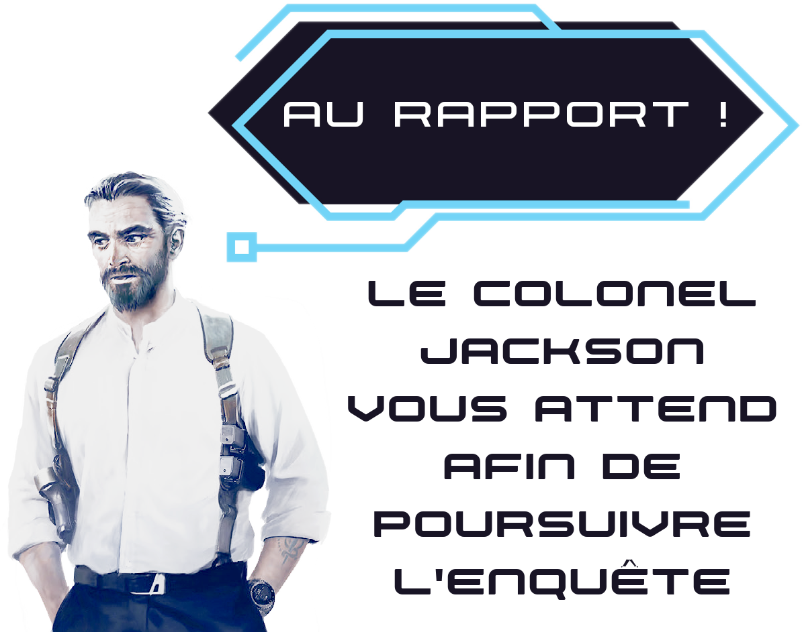

## Intro
À transmettre par email (ou application de messagerie) avant l'épisode zéro :
> Vous êtes des experts.
> Analyste, codeur, militaire ou scientifique, vous êtes l'un des meilleurs dans votre domaine.
> Et vous avez été recrutés par l'agence américaine Icare.
> Une entité qui intervient à travers le pays sur des opérations sensibles, dans lesquelles les agences gouvernementales craignent d'être impliquées.
> Et cette nuit de février 2033, vous avez tous été réveillés par une alerte chez vous :
> **Mission urgente. Départ en hélicoptère dans une heure. Destination : l'Alaska.**

<!-- inclure avec ce message l'illustration imgs/PJs.jpg -->

## Session zéro
* s'assurer que tout le monde est bien installé / a une boisson
* expliquer que le jeu propose 9 courts épisodes et caler **l'horaire de fin de partie** aujourd'hui
* expliciter l'ambiance du jeu : **thriller & action** "à l'américaine"
  Il y aura de l'action, de l'enquête, et bien sûr des occasions d'incarner vos personnages lors de scènes plus posées de _roleplay_
* détailler le déroulé de la session : choix des personnages, explication des règles (~10min), courte présentation de l'univers, épisode prologue (zéro)
* présenter les personnages et passer la musique de générique.
  Bien mentionner que tous les PJs, en plus de leur spécialités individuelles, **ont été entraînés au combat** par des forces spéciales, et maîtrisent très bien les armes à feu.
  Pour l'épisode 0, laisser dans les pochettes les fiches Historique & Équipement personnel.
* une fois les personnages répartis, expliquer le rôle des pochettes, et les inviter à choisir & inscrire un nom court ou surnom court & percutant pour leur personnage.
* détailler la fiche de personnage, le positionnement latéral des cartes, et enchaîner avec ces explications :
    + 4 types de temps de forts des épisodes
    + les tests / jets de dé : individuels/collectifs; difficulté; réussites & bonus; échecs & réussites critiques (distribuer les récaps'); santé & blessures; les combats (actions proposées, critiques, tour du MJ)
    + distribuer un dé à chaque joueurs, le(s) jeton(s) Héros associés au d8, et expliquer leur rôle

::: episodes

## Épisode 0
<a class="theme-music" href="https://www.youtube.com/watch?v=dlkin2jb9mQ">En intro : générique @ YouTube</a>
* expliciter qu'il s'agit d'une intro _dans le feu de l'action_, et que les joueurs pourront présenter un peu leurs personnages au début de l'épisode 1
* en faire une séquence assez courte / intense / rythmée -> objectif **30min**
* **Jackson** :
    + voix grave, rapide, il s'exprime de manière assurée et directe.
    + se tient droit, avec le poing toujours serré, ou avec l'index tendu
* employer la menace des terroristes, **nombreux et armés**, qui rôdent à proximité des PJs, mais qui ne les ont pas encore repéré...
  -> diffuser [_Antigone Falling_](https://www.youtube.com/watch?v=WkWahjqHtes) pour faire monter la tension
* idées si les joueurs ne se dirigent pas au "bon endroit" : tâches de sang au sol
### Scène 3 - Le laboratoire
* révéler aux joueurs le **plan A4 du laboratoire**
* diffuser [_Overpowered_](https://www.youtube.com/watch?v=JTxLd-XFp6o)
* expliciter la difficulté des tests contre les Mercenaires : **2**
* représenter les Mercenaires par des piles de 3 jetons sur la carte
* ne pas hésiter à distribuer des blessures aux PJs, **mais** ils doivent gagner ce combat !
* si un PJ réussit un test de _"Trouver un point faible"_, lui donner une idée d'emploi de l'environnement qu'il pourra tenter au prochain tour avec +1 : propulser une table à roulette en inox, shooter une lampe pour vous rendre moins facile à viser, etc.

## Épisode 1
<a class="theme-music" href="https://www.youtube.com/watch?v=dlkin2jb9mQ">En intro : générique @ YouTube</a>
### Scène 1 - Briefing :
* diffuser [_Shanghai Infiltration Soundtrack_](https://www.youtube.com/watch?v=135k_FSabq8)
* ⚠️ **le rapport d'autopsie et l'implant sont ceux de Monroe** (pas du cadavre dans la voiture)
* _« Est-ce que **Lisa Gordon** ne serait pas une connaissance, voir un membre de la famille de l'un d'entre vous ? À vous de le définir, si vous le souhaitez, pour impliquer plus votre personnage dans cette histoire »_
-> si oui, demander au PJ : _« Quel lien avez-vous, et comment avais-tu été affecté par sa disparition ? »_
### Scène 2 - Fusillade à l'hôpital :
* mettre l'illustration du **couloir de la clinique** (06) sur le paravent
* révéler aux joueurs le **plan A4 du couloir de l'hôpital**
    Placer des **jetons pour les personnages** : **jeune policier** en faction & PJs "en haut" du couloir, juste avant l'intersection de l'ascenseur, avec le tueur arrive "du bas" du couloir
* coups de feu -> diffuser [_Iceland Fight_](https://www.youtube.com/watch?v=L2WdWp919KM) puis [_Clubbed to death_](https://www.youtube.com/watch?v=pFS4zYWxzNA)
* ne pas hésiter à distribuer des blessures aux PJs, ainsi qu'au jeune policier, **et même** laisser le tueur assassiner la témoin
* **Lisa Gordon** : <!-- https://ptgptb.fr/interpreter-les-traits-distinctifs-des-pnj -->
    + se serre les bras comme si elle avait froid
    + parle doucement, de manière hésitante, visiblement effrayée
    + _« Je veux rentrer chez moi. »_ Elle sanglote.
* **Le tueur** :
    + il débarque derrière l'infirmier blessé. Jette un œil aux PJs et sourit vicieusement.
    + il se dirige clairement & ostensiblement vers le "box" de Lisa
    + son identité sera révélée dans l'épisode 3, _Aaron Stroke_
* le portrait-robot dressé par Lisa est celui de **Dany**
* musique de fin d'épisode : [_New York Infiltration Soundtrack - Part 1_](https://www.youtube.com/watch?v=T7dj0vNS30Q)

## Épisode 2
<a class="theme-music" href="https://www.youtube.com/watch?v=dlkin2jb9mQ">En intro : générique @ YouTube</a>
* expliciter qu'il y aura 2 phases : récolte d'indices puis regroupement pour tout analyser ensemble
### Scène 1 - Investigation au sous-sol :
* en intro, diffuser [_Affected Cities_](https://www.youtube.com/watch?v=MbHNcSBQcL4) (tonalité "enquête") puis [_The Last Drive Home_](https://www.youtube.com/watch?v=IQFh2b1u1mg) (inquiétant)
* ⚠️ **les PJs DOIVENT trouver la cassette avec le calepin, et l'implant de Monroe** (indices principaux) -> cacher au préalable la cassette et le calepin **sous la table à manger à 2 niveaux**
* cacher l'article **dans le faux livre Le Bossu de la bibliothèque**
* dans la salle d'opération, les PJs peuvent trouvent **l'implant de Monroe** (jeton 02 - puce de Monroe)
* proposer des jets de **Mental _(Investigation)_**, par exemple pour trouver la clef du bureau
* demander aux joueurs ce qui passe par la tête de leurs PJs : leurs sensations, leurs hypothèses... Ont-ils déjà vu ou vécu quelque chose se rapprochant de cette horreur ?
### Scène 2 - Analyse collective au bureau
* diffuser [_Surplus of rare artifacts_](https://www.youtube.com/watch?v=G57BrvROWEE) puis [_Stellar Shadows_](https://www.youtube.com/watch?v=Nn4CopGAhBY)
* donner un indice concernant le logo sur l'implant, très difficile à relever

## ⚠️ Les investigations des agents peuvent se faire dans un autre ordre
S'ils l'expriment, les agent peuvent réaliser l'autopsie du tueur plus tôt.
À l'inverse, la phase d'analyse collective au bureau peut être réalisée après l'épisode 3.
Par contre, la scène 2 de l'épisode 3 doit avoir lieu après les phases de collecte sur le terrain et le passage à la morgue.

## Épisode 3
<a class="theme-music" href="https://www.youtube.com/watch?v=dlkin2jb9mQ">En intro : générique @ YouTube</a>
### Scène 1 - Morgue :
* en intro, diffuser [_Affected Cities_](https://www.youtube.com/watch?v=MbHNcSBQcL4) (tonalité "enquête")
* **Dr Morris** :
    + ancien militaire, ni compétent ni sociable. Il a un ton sec, coupe la parole, manque de tact.
    + _« Bon. Allez. J'ai d'autres clients dont m'occuper vous savez. »_
    + _« Ah je vois. Très bien. Eh bah comme vous êtes de la partie, je vous laisse faire »_ - et il plante là les PJs
### Scène 2 - Police scientifique :
* diffuser [_Shanghai Infiltration Soundtrack_](https://www.youtube.com/watch?v=135k_FSabq8)
* présenter [un plan A4 N&B du bureau / laboratoire](./NebulaMaps-Office-NexusRobotics-TopRoom-BW-A4.pdf) (source : [NebulaMaps - Nexus Robotics Offices](https://www.patreon.com/posts/offices-nexus-130671029))
* **Rebecca** :
    + cligne des yeux très souvent. Se gratte aussi délicatement le bout du nez souvent.
    + _« Ah, vous êtes l'agence d'Icare, c'est cela ? On me demandé de vous transmettre nos conclusions »_
    + au début assez méfiante / distante, mais pourra sympathiser avec les PJs
    + _« Tout cela est vraiment intriguant, vous pourriez m'en dire plus sur cette affaire ? »_
    + _« Si vous voulez mon avis, les technologies impliquées ici sur d'un niveau secret-défense, c'est du lourd »_
### Scène 3 - Fournaise :
* diffuser [_Iceland Fight_](https://www.youtube.com/watch?v=L2WdWp919KM) puis [_Escape The Dead_](https://www.youtube.com/watch?v=M94Qdn-M7Rc)
* ajouter **des flammes au feutre rouge** sur le plan du bureau / laboratoire
* pour rajouter de l'adversité : le tailleur de **Rebecca a pris feu !**
* par ailleurs si aucun PJ ne songe à regarder par la fenêtre, Rebecca le fera et repérera la camionnette
* diffuser en fin d'épisode [_In the House In a Heartbeat_](https://www.youtube.com/watch?v=wQ56hXx264g)

## Épisode 4
<a class="theme-music" href="https://www.youtube.com/watch?v=dlkin2jb9mQ">En intro : générique @ YouTube</a>
### Scène 1 - Enquête à la morgue :
* diffuser [_The Last Drive Home_](https://www.youtube.com/watch?v=IQFh2b1u1mg) (inquiétant)
* **William smith**, interne fatigué; il repose sa tête sur son bras, se masse le front, un peu agacé d'être questionné, mais il est poli & coopératif.
* **David Brown** : visiblement stressé d'être questionné; il fume parfois du cannabis pour évacuer la pression des exams, y compris à la morgue, et a peur d'être viré voir condamné pour ça; il répète de manière insistante qu'il n'a « rien fait de mal » et veut s'avoir s'il risque d'être poursuivi en justice, et pour quel motif.
* **Clyve Daw** : nerveux, il n'aime pas les forces de police et l'exprime ostensiblement; souhaite écourter au plus vite l'interrogatoire; _« Je connais mes droits vous savez. »_
### Scène 2 - L'agence de location :
* diffuser [_Tell Me The Truth_](https://www.youtube.com/watch?v=XJOeaXXIjy8)
* dans la rue, les PJs sont interpellés par un hologramme insistant de **Samuel de Gires**, PDG de _Mars Inc._, qui les invite à investir pour le futur, pour le conquête de Mars, en achetant des parts de sa multinationale
* **Doug Nilson**, gérant
    + articule peu, grincheux, pas commode
    + _« Qu'est-ce vous voulez ? »_ ...  _« Connais pas. J'en sais rien. »_
    + _« Vous allez arrêter de me harceler oui ? J'connais mes droits hein ! »_
### Scène 3 - Course-poursuite :
* diffuser [_Iceland Fight_](https://www.youtube.com/watch?v=L2WdWp919KM)
* **James Gutz**, employé fuyard
    + tremblant, chouine
    + _« Oh merde. Oh désolé. »_
    + _« J'ai rien fait de mal. Je veux pas aller en tôle ! Je pourrais pas. »_

## Épisode 5
<a class="theme-music" href="https://www.youtube.com/watch?v=dlkin2jb9mQ">En intro : générique @ YouTube</a>
### Scène 1 - La ferme
* l'hélicoptère approche discrètement pour ne pas être repéré, et se pose à courte distance de la ferme : les PJs parcourent à pieds les derniers mètres
* si les PJs font preuve de discrétion et de ruse, indiquez-leur la présence des mercenaires et donnez-leur l'opportunité d'en neutraliser 1 ou 2 avant la fusillade
### Scène 2 - Fusillade
* diffuser [_Antigone Falling_](https://www.youtube.com/watch?v=WkWahjqHtes) pour faire monter la tension, puis [_Overpowered_](https://www.youtube.com/watch?v=JTxLd-XFp6o)
* donner des bonus aux PJs s'ils exploitent l'environnement / le drone / etc.
* après la bataille :
    + si des mercenaires sont capturés vivant, ils croquent une dose de **cyanure**. Si les PJs veulent absolument les interroger, laissez-les faire un test, et s'ils le réussissent, dites-leur qu'ils peuvent poser un certain nombre de questions (1 à 3) auxquelles le mercenaire interrogé répondra sans mentir
    + si les PJs ne pensent pas à fouiller les mercenaires, faites-les trouver le **fusil expérimental** dans la base secrète : ça leur fera plaisir d'avoir du _loot_, et ce sera très utile pour le boss final
    + un revolver **magnum** peut aussi être récupéré sur l'un des mercenaires
    + si les PJs font des recherches sur le **logo de scorpion sur fond jaune** des mercenaires, ils pourront découvrir que la société qui l'a conçu a été engagée par le même client pour concevoir un **logo de hibou noir menaçant**, mais le commanditaire est inconnu (c'est _Night Owl_)
### Scène 3 - Le silo
* diffuser [_Stellar Shadows_](https://www.youtube.com/watch?v=Nn4CopGAhBY)
* le post-it sur le bureau (21) est accompagné d'un second avec cette mention (rédigée avec l'écriture du Dr Monroe) : _« Code pour le prototype G4N7 »_.
* il y a un caisson fermé par un digicode, sur lequel il est indiqué `G4N7`.
Le caisson peut être ouvert avec le code `42`, et il contient un prototype de **lévito-gant** expérimental 🧤 fonctionnant avec des nanorobots. L'employer nécessite un test de **Savoir-Faire** (_Adresse_). Après deux usages, à représenter par des jetons sur la carte, il doit être rechargé pendant plusieurs heures (possible à la fin des épisodes 5 & 7).
* ⚠️ finir par les infos de l'ordi, et lorsque les PJs découvrent le rachat de _Mercury_ par _Mars Inc._, mentionner la présence d'emails de Samuel de Gires, des **instructions directes** envoyées à ce laboratoire secret.
* trappe bloquée : être ouvert à des solutions créatives des PJs

## Épisode 6
<a class="theme-music" href="https://www.youtube.com/watch?v=dlkin2jb9mQ">En intro : générique @ YouTube</a>
### Scène 1 - Kansas City → Seattle
* remplacez l'info fournie au Scientifique par celle-ci : _« Vous avez fait jouer vos contacts dans le monde de la recherche scientifique : Mars Inc. est réputée pour payer grassement ses chercheurs salariés, mais il s'y passe des choses très louches, et la rumeur court que le gouvernement pourrait retirer ses fonds et son accréditation à la multinationale... »_ (cela explique pourquoi Grimes veut remplacer le secrétaire d'État à la Défense)
### Scène 2 - Le Fuzz Club
* diffuser [_Cyberpunk 2077 Atlantis Club Music_](https://www.youtube.com/watch?v=huFL9LnZSwQ) puis éventuellement [_Cyberpunk 2077 Club Mix | Hard Techno_](https://www.youtube.com/watch?v=nQdO1jCOXtg)
* indiquer aux PJs observateurs (Mental / Perception) que **Dany** leur semble familier... S'ils y pensent, confirmez-leur qu'il correspond au portrait-robot réalisé par Lisa.
* _« Peut-être que l'un de vous reconnaît **Charlotte**, car vous avez déjà travaillé ensemble par le passé ? À vous de le décider, si vous le souhaitez, pour impliquer plus votre personnage dans cette histoire »_
-> si oui, expliquer au PJ qu'il s'agissait d'une agente de renseignement de la NSA, avec qui vous avez travaillé lors d'une opération conjointe avec la CIA en Amérique latine, mais qui a dénoncé ensuite les actions illégales de ses supérieurs. Demandez au PJ : est-ce que vous vous entendiez bien ou pas tellement ? Pourquoi ?
* Charlotte évoquera qu'elle est au courant des expériences du Dr Monroe et des implants
### Scène 3 - Enlèvement
* dès le début de la scène, mentionner la puissante moto 🏍️ et la décapotable sport 🏎️ dans le parking
* fin de la scène : demander **QUI CONDUIT ?**

## Épisode 7
<a class="theme-music" href="https://www.youtube.com/watch?v=dlkin2jb9mQ">En intro : générique @ YouTube</a>
* bien expliquer le rôle des jetons Narration au début
* diffuser des morceaux de la bande son de [_Need For Speed_](https://www.youtube.com/watch?v=rZ7NcEcAVdA&list=PLf5i8xDXfle5LlY84jaK44E12SHA_SUgD&index=8)
### Scène 2 - Highway
* 🗡 la berline se met au niveau des PJs et un passage tente de découper leur véhicule avec une **lame thermo-découpeuse** (remplace la volée de balles tirée)
* ✧✧✧ après le crash de la berline, les portes du van s'ouvre, et un type leur balance des **shurikens** pour percer les pneus du véhicule des PJs
### Scène 3
* 📱 le Codeur du groupe peut intercepter une télécommunication entre le van et **Samuel de Gires** (test de **Savoir-Faire** (_Mental_)) : les PJs entendent alors en direct le PDG donner l'ordre à ses hommes de main d'abattre Charlotte !
* avant l'épilogue, temporisez un peu : explicitez que vous allez entamer le **dernier épisode**, et vérifiez que vous aurez collectivement le **temps** (~1h) nécessaire pour le jouer en entier. Diffusez [_The Last Drive Home_](https://www.youtube.com/watch?v=IQFh2b1u1mg).
* cette fin d'épisode est l'occasion de rassembler les fils de l'intrigue, pour mettre en évidence que **Samuel de Gires est le grand méchant**, et que **des preuves incriminant Mars Inc. sont planquées dans le bureau de Charlotte**. Laissez les PJs débriefer, faire quelques dernières recherches et préparatifs avant de lancer l'épisode 8 en lisant le passage concernant l'inspection de l'appartement de Charlotte et la résolution prise par le groupe & Jackson d'infiltrer Mars Inc.

## Épisode 8
<a class="theme-music" href="https://www.youtube.com/watch?v=dlkin2jb9mQ">En intro : générique @ YouTube</a>
### Scène 1 - Mars Inc.
* bien expliquer le rôle des jetons Narration au début, et que le niveau d'alerte impacte la difficulté des tests
* diffuser [_Come Home Ethan_](https://www.youtube.com/watch?v=MG_fe54EECI&list=PLim3m5NnkYFepS2p5xjOyTcFTwHHzLf_Z&index=3), éventuellement le [thème principale de M:I 8](https://www.youtube.com/watch?v=LF4w328-FLU&list=PLim3m5NnkYFepS2p5xjOyTcFTwHHzLf_Z&index=4), et puis [_Cons_](https://www.youtube.com/watch?v=DsJD0_uB2U8&list=PLim3m5NnkYFepS2p5xjOyTcFTwHHzLf_Z&index=25), de la même BO
* 🤖 des **gardes androïdes**, piratables par le Codeur du groupe, sont en faction devant le bureau de Gires
### Scène 3 - La lance de Mars
* alternative cool de plan des lieux : [Executive Office by NebulaMaps](https://www.patreon.com/posts/executive-office-123350336)
* diffuser [_Antigone Falling_](https://www.youtube.com/watch?v=WkWahjqHtes), puis [_Overpowered_](https://www.youtube.com/watch?v=JTxLd-XFp6o)
* étapes du combat :
    1. Gires ordonne à ses hommes d'abattre les PJs. Les agents de Fondation débarquent par des ascenseurs tubulaires camouflés dans les piliers. Leur arrivée prend un tour de jeu et laisse l'opportunité aux PJs de trouver un moyen de bloquer les ascenseurs.
    2. Après 2 tours de combat, lorsque Gires réalise que les PJs résistent, il active son armure de nanomachines pour les affronter lui même, en hurlant  _« Les dieux de l'Olympe sont avec moi ! »_
    3. Après 2 tours de combat, si la majorité des PJs reste debout, Gires s'enfuit : il crie _« Évacuation ! »_, et la baie vitrée derrière son bureau s'ouvre en coulissant, laissant entendre le bruit d'un hélicoptère.
* 🗡 dans la collection d'objets exposés au mur, trône un **glaive de graphène**
* 🔫 il est possible de récupérer les **fusils mitrailleurs** des agents de Fondation : donnez alors aux joueurs la carte équipement _Fusil d'Assaut_.

     

::: <!-- EndOf .episodes -->

À transmettre aux joueurs avant une nouvelle partie :

## Licence & feedbacks

Cette aide de jeu de Lucas Cimon a été publiée en octobre 2025 et est placée sous licence <a rel="license" href="http://creativecommons.org/licenses/by-nc/4.0/">Creative Commons Attribution-NonCommercial 4.0 International</a>.

Les fichiers sources ayant permis de générer ce PDF sont disponibles [sur GitHub](https://github.com/Lucas-C/jdr/tree/master/CriticalFondation).
Merci aux développeurs des [logiciels libres](https://fr.wikipedia.org/wiki/Free/Libre_Open_Source_Software) employés : [le logiciel de dessin Gimp](https://www.gimp.org/), [l'éditeur de texte Notepad++](https://notepad-plus-plus.org/), [le logiciel de création de diagrammes draw.io](https://www.drawio.com/), [le lecteur de PDF Sumatra PDF](https://www.sumatrapdfreader.org), [le language de programmation Python](https://www.python.org/), et les bibliothèques de code [mistletoe](https://pypi.org/project/mistletoe/) & [weasyprint](https://weasyprint.org/).

Cette aide de jeu est diffusée gratuitement.
Je serais ravi d'avoir vos retours si vous l'employez :
racontez-moi comment s'est passée votre partie via un commentaire sur [mon blog](https://chezsoi.org/lucas/blog/critical-fondation.html).
