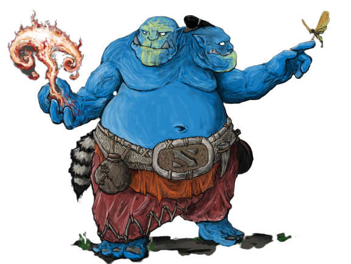

<!--
https://www.deviantart.com/halycon450/art/The-Third-Lamb-807998807 CC BY-NC-SA

Scénariothèque : http://www.scenariotheque.org/Document/info_doc.php?id_doc=9902
-->

# Dungeon Hearts  Heroes & Spells

Ceci est une extension pour la version 1.6 du jeu de rôle monopage [Dungeon Heart](https://mare-baixa.itch.io/dungeon-heart).

::: web-only
Version PDF : [v1.6-fr.pdf (1Mo)](https://chezsoi.org/lucas/blog/images/jdr/DungeonHeartHeroesAndSpells-v1.6-fr.pdf)

Pour plus de contexte je vous invite à lire [cet article de mon blog](https://chezsoi.org/lucas/blog/dungeon-heart-heroes-and-spells.html).
:::

En plus de quelques d6 (dé à 6 faces), cette extension requiert 1d12 (un dé à douze faces).

### Comment ça marche ?
Entre chaque assaut d'aventuriers, les joueurs lancent chacun leur tour 1d6 dans la table d'événements aléatoires ci-dessous,
puis **doivent** sélectionner une des options, si c'est possible.
Une fois son effet appliqué, cochez une [ ]. Lorsque toutes les [ ] d'une option sont cochées, elle ne peut plus être sélectionnée.

Les deux première cases du tableau amènent des complications pour les joueurs, et les deux dernières des avantages.

### Licence & sources

Cette extension a été conçu par Lucas Cimon et est sous licence [CC BY 4.0](http://creativecommons.org/licenses/by/4.0/).

Si vous la testez, songez à me laisser un petit commentaire sur <https://chezsoi.org/lucas/blog/tag/jdr.html>

L'illustration est de Ramirez de Souza aka Halycon450 :
[Aggron Stonebreak, the Ogre Magi](https://www.deviantart.com/halycon450/art/Aggron-Stonebreak-the-Ogre-Magi-328201376)
\- [CC BY-NC-SA 3.0](http://creativecommons.org/licenses/by-nc-sa/3.0/)

Merci à Thomas, Henri, Nicolas & Matthieu pour les playtests !

::: choices
| ~~⚀~~ Héros      | ~~⚁~~ Monstres   | ~~⚂~~ Boss fights
|------------------|------------------|-
|                  |                  |&nbsp;
| ~~⚃~~ Cut scenes | ~~⚄~~ Artefacts  | ~~⚅~~ Sortilèges
|                  |                  |&nbsp;
:::

::: td0
Les **Héros** sont des aventuriers spéciaux.
Ils ne peuvent être vaincus **qu'après tous les autres aventuriers**.
Choisissez l'un d'eux pour la prochaine phase d'invasion :
- [ ] +1 Héro **Barbare** : lorsqu'il affronte des monstres, ceux-ci sont trucidés si un 2 ou un 3 est obtenu sur les dés lancés.
- [ ] +1 Héroïne **Ensorceleuse** : charme les monstres, empêchant que les dés soient lancés.
- [ ] +1 Héroïne **Érudite** : ses grimoires contiennent les réponses de toutes les énigmes, empêchant que les dés soient lancés.
- [ ] +1 Héro **Mage** : capable de voyager dans le temps. Entre chaque salle, lancez 1d6 :
sur un 5 ou un 6, les aventuriers restant disparaissent. Ils réapparaîtront lors du prochain passage d'un groupe dans cette salle,
et joindrons leurs forces. Cette capacité continue à s'appliquer.
- [ ] +1 Héro **Paladin** : soigne ses camarades. Entre chaque pièce, si des membres du groupe ont été vaincus, lancez un dé :
si c'est impair, un aventurier est sauvé.
- [ ] +1 Héroïne **Rôdeuse** : elle sait désamorcer les pièges, empêchant que les dés soient lancés.
:::

::: td1
Vous ne pouvez choisir une option qui n'aura aucun effet :
- [ ] [ ] **Rixe entre monstres** : un montre tue un monstre dans la même pièce ou une pièce voisine.
- [ ] **Absence** : qu'il soient en grève ou que ce soit la pleine lune, vos monstres quittent leur poste pendant 1d3 tours.
- [ ] **Rage destructrice** : un monstre de votre choix se met à détruire toutes les énigmes et pièges sur son passage,
à commencer par ceux de sa pièce.
Tant qu'une salle adjacente contient un piège ou une énigme, il s'y rend et les détruit. Choisissez la pièce s'il y a plusieurs possibilités.
Le monstre s'installe dans le dernier emplacement visité.
- [ ] **Dragon** : ce nouvel arrivant s'installe dans une salle au choix contenant un trésor.
C'est un monstre à 4d6 qui occupe tous les emplacements et détruit ce qui s'y trouvait.
- [ ] **Passage secret** : des monstres ont construit un passage secret à votre insu.
Il ne peut être emprunté que pour **sortir** de la salle du trésor.
Placez la sortie de ce raccourci dans une pièce au choix de manière à ce qu'il fasse gagner du temps aux aventuriers.
- [ ] **Inondation** : à force de creuser, un de vos monstres provoque une arrivée massive d'eau ou de lave,
détruisant 2 emplacements dans la même pièce ou 2 pièces adjacentes.
:::

::: td2
Décrivez comment vous vous retrouvez à devoir affronter les prochains aventuriers vous-même à leur arrivée au donjon !
Résolvez ce combat une fois votre phase de préparation terminée.
Si ce n'est pas votre premier _boss fight_, vous pouvez laissez la place à un autre Gardien.

Lancez **1d6 par aventurier, et 1d12 pour le Gardien**.
Ce dernier choisit alors un ou plusieurs dés d'aventuriers dont le total est inférieur ou égal au sien, s'il le peut.
Ces aventuriers sont vaincus immédiatement. Vous obtenez un ❤ pour chacun, mais pas de récompense.

Le Gardien est libre de continuer le combat, mais chaque tour de combat permet aux aventuriers de progresser d'une salle
sans en subir les menaces, repoussant le Gardien toujours plus en avant dans le Donjon.
:::

::: td3
Décrivez une scène au choix, ayant lieu entre deux invasions :
- [ ] [ ] faisant intervenir le cœur du donjon
- [ ] [ ] mettant en scène cette chose qui qui vous est la plus chère
- [ ] décrivant ce qu'il advient des aventuriers vaincus
- [ ] ayant lieu loin en-dehors du donjon, mais faisant intervenir des personnages qui l'évoquent
- [ ] se déroulant aux portes du donjon
:::

::: td4
Ils sont uniques et ne peuvent être échangés ni prêtés.
Décrivez la nature de l'objet qui possède ce pouvoir, et comment votre Gardien l'obtient :
- [ ] [ ] **Arme enchantée** : procure +6 au d12 du Gardien lors des _boss fight_
- [ ] **Bâton magique** : baguette ou sceptre, vous permet de lancer un dé à chaque fois que **Cerveau**
lance un Sortilège : si c'est impair, le sort peut être réutilisé.
- [ ] **Excavatrice** : permet à **Squelette** de modifier les chemins entre les pièces du donjon durant la phase de préparation
- [ ] **Grimoire runique** : vous permet d'ajout **+1** à tous vos d6 d'énigmes.
Sur un 4 ou un 5 vous gagnez un ❤, et sur un 5 ou 6 l'aventurier est vaincu, mais un 1 détruit toujours l'énigme.
- [ ] [ ] **Potion** : une fois par phase d'invasion, vous pouvez relancer un dé que vous avez lancé.
<!-- assez bourrin car permet d'éviter les 1 -->
:::

::: td5
Ils ne sont utilisables qu'**une fois dans la partie**, et seul **Cerveau** sait les invoquer. C'est lui qui décide quand les employer.
Choisissez un enchantement et décrivez comment votre Gardien le découvre :
- [ ] [ ] **Alchimie** : pour chaque pièce où vous avez deux pièges, vous pouvez les fusionne.
Lancez désormais 2d6. Chaque dé peut déclencher les deux effets.
- [ ] [ ] **Gigantisme** : augmentez la puissance d'un monstre.
Ajoutez **+1** à tous ses dés. Un total final de 6 ou plus élimine un aventurier, mais il est toujours vaincu en cas de 1.
- [ ] [ ] **Nécromancie** : ressuscitez un monstre, et placez-le dans l'emplacement de votre choix.
- [ ] [ ] **Oracle** : changez le résultat d'un dé qui vient d'être lancé.
:::

<link rel="stylesheet" type="text/css" href="DungeonHeartHeroesAndSpells.css">

