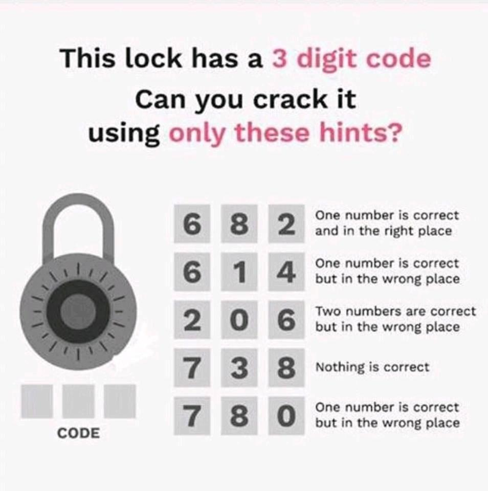

# Escape Game

## Le principe

Un jeu de rôle en temps réel où les joueurs doivent résoudre des énigmes pour s'évader en moins d'une heure.

## Histoire

## Enigmes

<!-- SOURCE: https://www.reddit.com/r/puzzles/comments/aey4de/can_anyone_find_the_correct_combination/ -->

### Licence & sources

Ce jeu a été conçu par Laëtitia Beschus & Lucas Cimon et est sous licence [CC BY 4.0](http://creativecommons.org/licenses/by/4.0/).

Si vous le testez, songez à nous laisser un petit commentaire sur <https://chezsoi.org/lucas/blog/tag/jdr.html>

