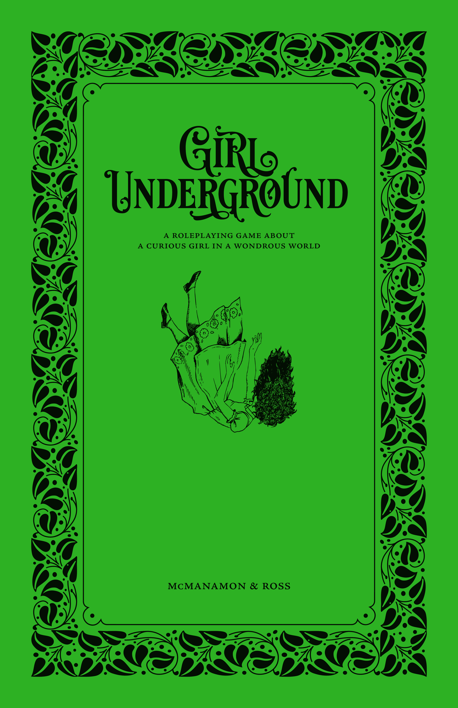

<!--
Unicode Typography Ornaments:
☙ ❦ ❧
🙐 🙑 🙒 🙓 🙔 🙕 🙖 🙗
🙚 🙘 🙛 🙙 🙞 🙜 🙟 🙝
🙠 🙡 🙢 🙣 🙤 🙥 🙦 🙧 
-->
::: intro
Traduction en français des livrets des personnages & aides de jeu pour :
:::

<figure>
  
  <figcaption><a href="https://hedgemazepress.itch.io/girlunderground">hedgemazepress.itch.io/girlunderground - Lauren McManamon & Jesse Ross</a></figcaption>
</figure>

Inspiré des Aventures d'Alice au pays des merveilles, du Magicien d'Oz, du Voyage de Chihiro, du Labyrinthe et d'autres contes similaires, _Girl Underground_ vous propose de raconter l'histoire d'une jeune fille curieuse et de ses étranges compagnons qui voyagent à travers un monde merveilleux, accomplissent une quête et retrouvent le chemin du retour. Tout au long de son périple, la jeune fille apprend à se connaître, découvre les valeurs qui lui tiennent à cœur et défie le monde qui l'entoure.

Dans cette histoire, la Jeune Fille se retrouve dans l'_Underground_, un lieu étrange rappelant Oz ou le pays des merveilles. Ce lieu souterrain est à la fois fantastique et déroutant, peuplé de personnages à la logique étrange et aux énigmes.

Heureusement, la jeune fille a trouvé des amis sur qui elle peut compter, et qui comptent sur elle à leur tour. Ces amis représentent les archétypes que l'on retrouve dans ce genre d'histoires : animaux parlants, statues vivantes, hybrides métamorphes, bêtes mythiques, géants amicaux et enfants aventuriers.

En raison du type d'histoire que raconte _Girl Underground_, nous l'abordons avec la certitude que la Jeune Fille atteindra ses objectifs et rentrera chez elle. Nous cherchons à comprendre comment elle y parvient et ce qu'elle apprend sur elle-même sous terre. L'autre monde dans lequel elle se trouve représente cet espace entre l'enfance et l'âge adulte : une période étrange et surprenante où elle peut découvrir qui elle est et ce en quoi elle croit.

:::::: playbook
## La Jeune Fille

Tu es une fille de 12 ans. Tu n'es pas de ce monde et tu essaies de retrouver le chemin du retour. La maison n'est pas parfaite – en fait, elle est pleine de difficultés et d'injustices – mais c'est quand même ta maison. Il y a des gens qui t'aiment, qui te manquent en ce moment et qui se demandent pourquoi tu n'es pas encore venue dîner.

::::: frame
:::: title
_Collectivement, décidez du nom de la Jeune Fille._
::::
Si votre famille a de l'amour mais pas :

:::: col3-list
* de curiosité, ton nom est **Kat**.
* d'argent, ton nom est **Penny**.
* de temps, ton nom est **Patience**.
* de magie, ton nom est **Faye**.
* de sérénité, ton nom est **Serena**.
* de \_\_\_\_\_\_\_\_\_, ton nom est **\_\_\_\_\_\_\_\_\_**.
::::
:::::

::::: frame
:::: title
_Répondez ensuite chacun votre tour à ces questions._
::::
:::: col2
**Comment portez-vous vos cheveux ?**
* Doux et texturés comme un nuage endormi
* Longs et ondulés comme une douce marée d'été
* Rectilignes et droits comme le tranchant d'une règle
* Coupés courts comme l'herbe fraîchement tondue
* Emmêlés et noués comme une corde qui s'effiloche
* Tressés et fluides comme une rivière sinueuse
* \_\_\_\_\_\_\_\_\_\_\_\_\_\_\_\_\_\_\_\_\_\_\_\_\_\_\_\_\_\_\_\_\_\_\_\_\_\_\_\_\_\_\_\_\_\_\_\_\_\_\_\_

**Quelle est votre possession la plus chère ?**

::: col2-list
* Quelque chose naturel
* Quelque chose offert
* Quelque chose domestique
* Quelque chose vivant
* Quelque chose volé
* Quelque chose fabriqué par vous
:::

_Décrivez-le :_ \_\_\_\_\_\_\_\_\_\_\_\_\_\_\_\_\_\_\_\_\_\_\_\_\_\_\_\_\_\_\_\_\_\_\_\_\_\_\_\_\_

\_\_\_\_\_\_\_\_\_\_\_\_\_\_\_\_\_\_\_\_\_\_\_\_\_\_\_\_\_\_\_\_\_\_\_\_\_\_\_\_\_\_\_\_\_\_\_\_\_\_\_\_\_\_

**À quoi ressemble votre voix ?**
* Pétillant comme un ruisseau qui coule
* Chaud comme une brise d'été
* Rapide comme un éclair
* Rêveur comme un nuage de barbe à papa
* Graveleux comme une route de campagne
* Silencieux comme une pensée secrète
* \_\_\_\_\_\_\_\_\_\_\_\_\_\_\_\_\_\_\_\_\_\_\_\_\_\_\_\_\_\_\_\_\_\_\_\_\_\_\_\_\_\_\_\_\_\_\_\_\_\_\_\_

**Quelle est votre plus grande peur ?**
* L'absence (l'obscurité, le silence, l'isolement...)
* La colère (le feu, les monstres, les séismes...)
* L'humiliation (les harceleurs, les défauts, l'échec...)
* L'incapacité (la paralysie, la maladie, la pauvreté...)
* Le jugement (le mérite, les choix, les perceptions...)
* \_\_\_\_\_\_\_\_\_\_\_\_\_\_\_\_\_\_\_\_\_\_\_\_\_\_\_\_\_\_\_\_\_\_\_\_\_\_\_\_\_\_\_\_\_\_\_\_\_\_\_\_
::::

**Qu'est-ce vous voulez être quand vous serez grande ?**

\_\_\_\_\_\_\_\_\_\_\_\_\_\_\_\_\_\_\_\_\_\_\_\_\_\_\_\_\_\_\_\_\_\_\_\_\_\_\_\_\_\_\_\_\_\_\_\_\_\_\_\_\_\_\_\_\_\_\_\_\_\_\_\_\_\_\_\_\_\_\_\_\_\_\_\_\_\_\_\_\_\_\_\_\_\_\_\_\_\_\_\_\_\_\_\_\_\_\_\_\_\_\_\_\_\_\_\_\_\_\_\_\_

**À quoi ressemble votre vie familiale ?** _Le guide peut vous poser des questions supplémentaires ici._

\_\_\_\_\_\_\_\_\_\_\_\_\_\_\_\_\_\_\_\_\_\_\_\_\_\_\_\_\_\_\_\_\_\_\_\_\_\_\_\_\_\_\_\_\_\_\_\_\_\_\_\_\_\_\_\_\_\_\_\_\_\_\_\_\_\_\_\_\_\_\_\_\_\_\_\_\_\_\_\_\_\_\_\_\_\_\_\_\_\_\_\_\_\_\_\_\_\_\_\_\_\_\_\_\_\_\_\_\_\_\_\_\_

\_\_\_\_\_\_\_\_\_\_\_\_\_\_\_\_\_\_\_\_\_\_\_\_\_\_\_\_\_\_\_\_\_\_\_\_\_\_\_\_\_\_\_\_\_\_\_\_\_\_\_\_\_\_\_\_\_\_\_\_\_\_\_\_\_\_\_\_\_\_\_\_\_\_\_\_\_\_\_\_\_\_\_\_\_\_\_\_\_\_\_\_\_\_\_\_\_\_\_\_\_\_\_\_\_\_\_\_\_\_\_\_\_

\_\_\_\_\_\_\_\_\_\_\_\_\_\_\_\_\_\_\_\_\_\_\_\_\_\_\_\_\_\_\_\_\_\_\_\_\_\_\_\_\_\_\_\_\_\_\_\_\_\_\_\_\_\_\_\_\_\_\_\_\_\_\_\_\_\_\_\_\_\_\_\_\_\_\_\_\_\_\_\_\_\_\_\_\_\_\_\_\_\_\_\_\_\_\_\_\_\_\_\_\_\_\_\_\_\_\_\_\_\_\_\_\_

\_\_\_\_\_\_\_\_\_\_\_\_\_\_\_\_\_\_\_\_\_\_\_\_\_\_\_\_\_\_\_\_\_\_\_\_\_\_\_\_\_\_\_\_\_\_\_\_\_\_\_\_\_\_\_\_\_\_\_\_\_\_\_\_\_\_\_\_\_\_\_\_\_\_\_\_\_\_\_\_\_\_\_\_\_\_\_\_\_\_\_\_\_\_\_\_\_\_\_\_\_\_\_\_\_\_\_\_\_\_\_\_\_

:::::

::::: frame
:::: title
_Maintenant consultez la liste des Bonnes Manières et décidez collectivement :_
::::
**Quelle Bonne Manière choisissez-vous d'ignorer lorsque vous découvrez votre porte vers un autre monde ?**
Retournez-le et écrivez une nouvelle Croyance qui reflète ce que vous savez déjà de vous-même.
:::::
::::::

:::::: playbook
## Manœuvres de la Jeune Fille

Vous avez accès à toutes ces actions chaque fois que vous incarnez la Jeune Fille.

::::: frame
:::: title
**Refusez de respecter les Bonnes Manières**
::::
Lorsque vous faites face à une situation en refusant de jouer la jeune fille bien élevée, nommez la Bonne Manière contre laquelle vous vous rebellez et lancez deux dés. Additionnez-les pour obtenir votre résultat.

:::: side-by-side
:::

7+

Comment surmontez-vous ce défi ?
 <em>De 7 à 9</em> : Comment échouez-vous ou allez-vous trop loin ?

:::

:::

6-

Quel aspect de votre rébellion est mal compris par les autres ?
:::
::::

:::: effect
Retournez la Bonne Manière et inscrivez une nouvelle Croyance basée sur ce que cela vous a appris sur vous-même ou sur le monde.
::::
:::::

::::: frame
:::: title
**Défendez vos convictions**
::::
Lorsque vous faites face à une situation en restant fidèle à vos convictions, commencez avec un dé, puis prenez un dé supplémentaire pour chaque Croyance concernée et lancez-les. Additionnez les deux dés les plus élevés pour obtenir votre résultat.

:::: side-by-side
:::

7+

Comment surmontez-vous ce défi ?
 <em>De 7 à 9</em> : Quel prix est-ce que cela vous coûte ?

:::

:::

6-

Qu'apprenez-vous qui vous aidera à surmonter une difficulté plus tard ?
:::
::::
:::::

::::: frame
:::: title
**Toujours plus curieuse**
::::
Lorsque vous essayez d'obtenir des réponses sur ce monde ou ses habitants, posez votre question au Guide.

:::: side-by-side
:::
Si vous êtes prêt à participer à une activité bizarre, votre réponse sera — étonnamment — claire et utile.
:::

:::
Si vous n'êtes pas disposé à le faire, votre réponse prendra la forme d'une énigme.
:::
::::
:::::

::::: frame
:::: title
**Tournez manège**
::::
Lorsque vous voulez introduire un Compagnon dans une scène, ou placer quelqu'un d'autre dans la lumière, passez le livret de la Jeune Fille à un autre joueur de votre choix. Il devient alors la Jeune Fille.
:::::

::::: frame agenda
:::: title
_Lorsque vous incarnez la Jeune Fille, essayez de faire ceci :_
::::
Désirez ce qui manque à votre famille et à votre foyer.

Agissez contre vos Bonnes Manières et en accord avec vos Croyances.

Soyez courageuse et saisissez les occasions d'apprendre et de grandir.

Posez des questions pertinentes à toutes les personnes que vous rencontrez.

Demandez de l'aide à vos Compagnons en cas de besoin.
:::::
::::::

:::::: playbook
## La Bestiole

Vous êtes un animal. Et comme tout animal _raffiné_, vous utilisez des mots pour vous exprimer. À l'exception notable de votre capacité à parler, vous vous comportez et ressemblez à n'importe quel autre animal. Cela vous cause parfois des ennuis, mais ce n'est jamais _vraiment_ de votre faute.

Votre répartie avisée vous sert autant à conseiller la Jeune Fille qu'à vous moquer des figures d'autorité. La question de l'autorité est centrale pour vous, qu'il s'agisse d'affirmer votre présence et votre renom, ou de refuser de reconnaître le statut des autres. Vous colportez histoires et ragots sur les nobles, la royauté et les puissants. Votre intelligence et votre expérience vous permettent de déjouer tous les pièges et toutes les énigmes.

::::: frame
:::: title
_Répondez à ces questions_
::::
**Quel genre d'animal êtes-vous ? C'est aussi votre nom.**

:::: col5-list
* Âne
* Cochon
* Écureuil
* Élan
* Grenouille
* Hibou
* Hérisson
* Lézard
* Ours
* Poulet
* Raton laveur
* Tatou
* Tigre
* Wallaby
* \_\_\_\_\_\_\_\_\_\_\_\_\_\_\_\_\_\_\_\_\_
::::

**Qu'est-ce qui risque le plus probablement de vous cause des problèmes ?**

:::: col5-list
* Votre appétit
* Votre curiosité
* Votre gourmandise
* Votre langue
* \_\_\_\_\_\_\_\_\_\_\_\_\_\_\_\_\_\_\_\_\_
::::

**Qu'étiez-vous avant de devenir un animal parlant ?**

:::: col5-list-beastie-before
* Un noble
* Le familier d'une sorcière
* Un jouet
* Un animal classique, muet
* \_\_\_\_\_\_\_\_\_\_\_\_\_\_\_\_\_\_\_\_
::::

**De quoi avez-vous besoin que ce voyage vous apportera ?**

:::: col5-list
* Un titre
* De l'éloquence
* Une nouvelle vie
* Un élève
* \_\_\_\_\_\_\_\_\_\_\_\_\_\_\_\_\_\_\_\_\_
::::

**Dans quel état êtes-vous lorsque la Jeune Fille vous trouve ?**

:::: col4-list
* En cage
* Poursuivi
* Plein de ressentiment
* \_\_\_\_\_\_\_\_\_\_\_\_\_\_\_\_\_\_\_\_\_
::::
:::::

Notes

\_\_\_\_\_\_\_\_\_\_\_\_\_\_\_\_\_\_\_\_\_\_\_\_\_\_\_\_\_\_\_\_\_\_\_\_\_\_\_\_\_\_\_\_\_\_\_\_\_\_\_\_\_\_\_\_\_\_\_\_\_\_\_\_\_\_\_\_\_\_\_\_\_\_\_\_\_\_\_\_\_\_\_\_\_\_\_\_\_\_\_\_\_\_

\_\_\_\_\_\_\_\_\_\_\_\_\_\_\_\_\_\_\_\_\_\_\_\_\_\_\_\_\_\_\_\_\_\_\_\_\_\_\_\_\_\_\_\_\_\_\_\_\_\_\_\_\_\_\_\_\_\_\_\_\_\_\_\_\_\_\_\_\_\_\_\_\_\_\_\_\_\_\_\_\_\_\_\_\_\_\_\_\_\_\_\_\_\_

\_\_\_\_\_\_\_\_\_\_\_\_\_\_\_\_\_\_\_\_\_\_\_\_\_\_\_\_\_\_\_\_\_\_\_\_\_\_\_\_\_\_\_\_\_\_\_\_\_\_\_\_\_\_\_\_\_\_\_\_\_\_\_\_\_\_\_\_\_\_\_\_\_\_\_\_\_\_\_\_\_\_\_\_\_\_\_\_\_\_\_\_\_\_

 

::::: frame agenda
:::: title
_Lorsque vous incarnez la Bestiole, essayez de faire ceci :_
::::
Donnez des conseils spontanés à la Jeune Fille.

Ayez toujours une réponse ou une opinion.

Racontez des histoires sur ce monde.

Soyez impoli·e envers les figures d'autorité.

Cédez à votre nature animale.
:::::
::::::

:::::: playbook
## Manœuvres de la Bestiole

Lorsque vous déclenchez une manœuvre, lancez deux dés et additionnez-les pour obtenir votre résultat : 7 ou plus, ou 6 ou moins. Un résultat de 7 à 9 rajoute des complications.
Lorsqu'une des Croyances de la Jeune Fille vous inspire, dites laquelle et lancez trois dés au lieu de deux. Additionnez les deux dés les plus élevés pour obtenir votre résultat.

::::: frame
:::: title
**Prodiguer des conseils**
::::
Lancez les dés lorsque vous offrez des conseils à la Jeune Fille et qu'elle les suit.

:::: side-by-side
:::

7+

<em>La Jeune Fille peut relancer et ajouter 1 au total.</em>
 <em>De 7 à 9</em> : Quelle vérité avez-vous oublié de partager avec la Fille ?

:::

:::

6-

_Demandez au Guide_ : Comment mes conseils peuvent engendrer davantage de problèmes ?
:::
::::
:::::

::::: frame
:::: title
**L'habit ne fait pas le moine**
::::
Lancez les dés lorsque vous doutez de l'apparence superficielle d'une personne, d'un lieu ou d'un objet.

:::: side-by-side
:::

7+

<em>Demandez à celui qui joue le personnage</em> :
Quelle vérité se cache sous la surface ?
<em>De 7 à 9</em> : En quoi la vérité est-elle pire que le vernis ?

:::

:::

6-

_Demandez à la table_ : Comment dissiper mes doutes ?
:::
::::
:::::

::::: frame
:::: title
**Impertinent comme un pou**
::::
Lancez les dés lorsque vous rencontrez pour la première fois un membre de la royauté.

:::: side-by-side
:::

7+

Quelle histoire avez-vous déjà partagée avec vos amis à propos de cette personne ?
 <em>De 7 à 9</em> : Quelle impolitesse faites-vous devant elle ?

:::

:::

6-

_Demandez au Guide_ : De quel crime cette personne me croit-elle coupable ?
:::
::::
:::::

::::: frame
:::: title
**Connaître du beau monde**
::::
Lancez les dés lorsque vous évoquez une de vos connaissances influente qui pourrait vous aider.

:::: side-by-side
:::

7+

Comment la trouver et pourquoi vous doit-elle une faveur ?
<em>De 7 à 9</em> : Comment l'avez-vous agacé lors de votre dernière rencontre ?

:::

:::

6-

De quelle dette exigera-t-elle paiement ?
 <em>Demandez au Guide</em> : comment me retrouve-t-elle ?

:::
::::
:::::

::::: frame
:::: title
**Beau parleur**
::::
Lancez les dés lorsque vous essayez de vous sortir d'un problème, d'un piège ou d'une énigme par la discussion.

:::: side-by-side
:::

7+

Comment vous êtes-vous sorti d'une situation similaire par le passé ?
 <em>De 7 à 9, demandez à la table</em> : Qui est blessé par mes mots d'esprit, et comment ?

:::

:::

6-

_Demandez au Guide_ : Comment mes propos empirent-ils la situation ?
:::
::::
:::::

:::::: playbook
## L'Artificiel

Vous avez été façonné par des mains humaines et imprégné de vie par magie.
Vous pouvez être une poupée, un soldat de plomb, un épouvantail, un robot ou autre chose, mais quoi que vous soyez, vous avez reçu une forme et des comportements (principalement) humains.

Du fait de votre étrange création, vous avez une affinité particulière pour les choses inanimées. Vous pouvez en tirer des connaissances cachées ou vous cacher parmi elles. Vous aspirez à être authentique, et c'est pourquoi vous prêtez une attention particulière aux désirs des autres et utilisez cette perspicacité pour aider la Jeune Fille et vos amis.

::::: frame
:::: title
_Répondez à ces questions_
::::
**De quel matériau êtes-vous fait ?**

:::: col5-list
* Bonbon
* Bois
* Coton
* Crystal
* Métal
* Patisserie
* Pierre
* Porcelaine
* Toile de jute
* \_\_\_\_\_\_\_\_\_\_\_\_\_\_\_\_\_\_\_\_\_
::::

**Quel est votre trait le plus humain ?**

:::: col5-list
* Votre chaleur
* Vos larmes
* Vos yeux
* Votre voix
* \_\_\_\_\_\_\_\_\_\_\_\_\_\_\_\_\_\_\_\_\_
::::

**Qu'est-ce qui est le plus perturbant vous concernant ?**

:::: col5-list-construct-unnerving
* Votre calme
* Votre sourire
* Vos membres rajoutés
* L'histoire de votre création
* \_\_\_\_\_\_\_\_\_\_\_\_\_\_\_\_\_\_\_\_
::::

**De quoi avez-vous besoin que ce voyage vous apportera ?**

:::: col5-list
* Une vie
* Une famille
* Votre autre moitié
* Votre créateur
* \_\_\_\_\_\_\_\_\_\_\_\_\_\_\_\_\_\_\_\_\_
::::

**Dans quel état êtes-vous lorsque la Jeune Fille vous trouve ?**

:::: col4-list
* Coincé quelque part
* Sur un présentoir
* Démonté
* \_\_\_\_\_\_\_\_\_\_\_\_\_\_\_\_\_\_\_\_\_
::::

**Quel est votre nom ?**

:::: col5-list
* Arta
* Darling
* Fluff
* Lulu
* Trésor
* Prosper
* Écho
* Jin
* Prisme
* \_\_\_\_\_\_\_\_\_\_\_\_\_\_\_\_\_\_\_\_\_
::::
:::::

Notes

\_\_\_\_\_\_\_\_\_\_\_\_\_\_\_\_\_\_\_\_\_\_\_\_\_\_\_\_\_\_\_\_\_\_\_\_\_\_\_\_\_\_\_\_\_\_\_\_\_\_\_\_\_\_\_\_\_\_\_\_\_\_\_\_\_\_\_\_\_\_\_\_\_\_\_\_\_\_\_\_\_\_\_\_\_\_\_\_\_\_\_\_\_\_

\_\_\_\_\_\_\_\_\_\_\_\_\_\_\_\_\_\_\_\_\_\_\_\_\_\_\_\_\_\_\_\_\_\_\_\_\_\_\_\_\_\_\_\_\_\_\_\_\_\_\_\_\_\_\_\_\_\_\_\_\_\_\_\_\_\_\_\_\_\_\_\_\_\_\_\_\_\_\_\_\_\_\_\_\_\_\_\_\_\_\_\_\_\_

\_\_\_\_\_\_\_\_\_\_\_\_\_\_\_\_\_\_\_\_\_\_\_\_\_\_\_\_\_\_\_\_\_\_\_\_\_\_\_\_\_\_\_\_\_\_\_\_\_\_\_\_\_\_\_\_\_\_\_\_\_\_\_\_\_\_\_\_\_\_\_\_\_\_\_\_\_\_\_\_\_\_\_\_\_\_\_\_\_\_\_\_\_\_

::::: frame agenda
:::: title
_Lorsque vous incarnez l'Artificiel, essayez de faire ceci :_
::::
Suivez l'exemple de la Jeune Fille

Soyez naïf·ve

Brouillez les frontières entre l'animé et l'inanimé

Découvrez ce que signifie être réel

Traitez votre corps comme un objet
:::::
::::::

:::::: playbook
## Manœuvres de l'Artificiel

Lorsque vous déclenchez une manœuvre, lancez deux dés et additionnez-les pour obtenir votre résultat : 7 ou plus, ou 6 ou moins. Un résultat de 7 à 9 rajoute des complications.
Lorsqu'une des Croyances de la Jeune Fille vous inspire, dites laquelle et lancez trois dés au lieu de deux. Additionnez les deux dés les plus élevés pour obtenir votre résultat.

 

::::: frame
:::: title
**Du fond du cœur**
::::
Lancez les dés lorsque vous encouragez la Jeune Fille en faisant preuve d'humanité.

:::: side-by-side
:::

7+

<em>La Jeune Fille peut relancer et ajouter 1 au total.</em>
 <em>De 7 à 9</em> : Comment cela vous fait questionner votre humanité ?

:::

:::

6-

Comment rappelez-vous à tout le monde que vous êtes un objet ?
:::
::::
:::::

::::: frame
:::: title
**Miroir, miroir**
::::
Lancez les dés lorsque vous fixez quelqu'un pour le percer à jour.

:::: side-by-side
:::

7+

<em>Demandez-lui</em> : Que désire ton cœur ?
 <em>De 7 à 9</em> : Quel secret découvre-t-il lorsqu'il vous rend votre regard ?

:::

:::

6-

_Demandez-lui_ : Quelle emprise as-tu sur moi maintenant ?
:::
::::
:::::

::::: frame
:::: title
**Ça me laisse de marbre**
::::
Lancez les dés lorsque vous recevez d'importants dégâts.

:::: side-by-side
:::

7+

<em>Demandez à la table</em> : comment me réparez-vous ?
<em>De 7 à 9</em> : Comment avez-vous été changé par ce qu'il vient de se passer ?

:::

:::

6-

_Demandez au Guide_ : Quelle chose chère, rare ou insaisissable faut-il pour me réparer ?
:::
::::
:::::

::::: frame
:::: title
**Une âme en toute chose**
::::
Lancez les dés lorsque vous discutez avec quelque chose d'ordinaire inanimé.

:::: side-by-side
:::

7+

Quelle histoire apprenez-vous ?
 <em>De 7 à 9</em> : Pourquoi l'histoire semble incomplète ou confuse ?

:::

:::

6-

_Adressez-vous à la Jeune fille_ : Quelle explication lui donnez-vous expliquant pourquoi cette chose refuse de vous répondre ?
:::
::::
:::::

::::: frame
:::: title
**Un, deux, trois, soleil !**
::::
Lancez les dés lorsque vous ou vos amis essayez de vous cacher en restant immobiles.

:::: side-by-side
:::

7+

<em>Demandez au Guide</em> : quel avantage est-ce que cela me confère ?
<em>De 7 à 9, demandez au Guide</em> : Qui est mis en danger par mon action ?

:::

:::

6-

Quel bazar est-ce que vous provoquez ?
:::
::::
:::::

:::::: playbook
## Le Faune

Votre corps vit entre deux mondes : humain et… ailleurs. Peut-être votre moitié est-elle une bête, vous faisant ressembler à un centaure ou à une sirène.
Ou peut-être êtes-vous en harmonie avec quelque chose de plus élémentaire, comme un génie ou une ombre.

Vous êtes un être de transformations, de votre capacité à exaucer des vœux à la transmission de vos pouvoirs de métamorphose. Vous transformez également presque n’importe quel événement en festivités, et utilisez ce talent à des fins utiles.

::::: frame
:::: title
_Répondez à ces questions_
::::
**Quel est votre autre moitié ?**

:::: col6-list
* Cheval
* Chèvre
* Eau
* Feu
* Loup
* Nuage
* Ombre
* Plante
* Poisson
* Pierre
* Serpent
* \_\_\_\_\_\_\_\_\_\_\_\_\_\_\_
::::

**À quoi avez-vous du mal à résister ?**

:::: col4-list-faun-resist
* Une belle voix chantante
* Une occasion de se montrer
* Des vêtements luxueux
* \_\_\_\_\_\_\_\_\_\_\_\_\_\_\_\_\_\_\_\_\_
::::

**En quoi aimeriez-vous vous transformer ?**

:::: col5-list-faun-transform
* Un adulte
* Une créature majestueuse
* Un enfant normal
* Un morceau de nature
* \_\_\_\_\_\_\_\_\_\_\_\_\_\_\_\_\_
::::

**De quoi avez-vous besoin que ce voyage vous apportera ?**

:::: col3-list
* Le contrôle sur votre moitié
* Une transformation complète
* Une chance de se racheter
* Une vraie raison de célébrer
* Votre propre souhait exaucé
* \_\_\_\_\_\_\_\_\_\_\_\_\_\_\_\_\_\_\_\_\_\_\_\_\_\_\_\_\_
::::

**Dans quel état êtes-vous lorsque la Jeune Fille vous trouve ?**

:::: col4-list-faun-state
* Épuisé par les festivités
* Couvert de fruits pourris
* Dans un numéro de spectacle
* \_\_\_\_\_\_\_\_\_\_\_\_\_\_\_\_\_\_\_
::::

**Quel est votre nom ?**

:::: col6-list
* Arielle
* Asteria
* Ember
* Hans
* Ifan
* Jiah
* Nylisa
* Nyx
* Rhian
* Saga
* Sepu
* \_\_\_\_\_\_\_\_\_\_\_\_\_\_\_
::::
:::::

Notes

\_\_\_\_\_\_\_\_\_\_\_\_\_\_\_\_\_\_\_\_\_\_\_\_\_\_\_\_\_\_\_\_\_\_\_\_\_\_\_\_\_\_\_\_\_\_\_\_\_\_\_\_\_\_\_\_\_\_\_\_\_\_\_\_\_\_\_\_\_\_\_\_\_\_\_\_\_\_\_\_\_\_\_\_\_\_\_\_\_\_\_\_\_\_

\_\_\_\_\_\_\_\_\_\_\_\_\_\_\_\_\_\_\_\_\_\_\_\_\_\_\_\_\_\_\_\_\_\_\_\_\_\_\_\_\_\_\_\_\_\_\_\_\_\_\_\_\_\_\_\_\_\_\_\_\_\_\_\_\_\_\_\_\_\_\_\_\_\_\_\_\_\_\_\_\_\_\_\_\_\_\_\_\_\_\_\_\_\_

\_\_\_\_\_\_\_\_\_\_\_\_\_\_\_\_\_\_\_\_\_\_\_\_\_\_\_\_\_\_\_\_\_\_\_\_\_\_\_\_\_\_\_\_\_\_\_\_\_\_\_\_\_\_\_\_\_\_\_\_\_\_\_\_\_\_\_\_\_\_\_\_\_\_\_\_\_\_\_\_\_\_\_\_\_\_\_\_\_\_\_\_\_\_

 

::::: frame agenda
:::: title
_Lorsque vous incarnez le Faune, essayez de faire ceci :_
::::
Regardez les choses sous un angle différent

Rendez les choses, surtout les plus dangereuses, amusantes

Laissez-vous emporter

Ressentez les choses profondément et passionnément

Incitez la Jeune Fille à essayer de nouvelles choses
:::::
::::::

:::::: playbook
## Manœuvres du Faune

Lorsque vous déclenchez une manœuvre, lancez deux dés et additionnez-les pour obtenir votre résultat : 7 ou plus, ou 6 ou moins. Un résultat de 7 à 9 rajoute des complications.
Lorsqu'une des Croyances de la Jeune Fille vous inspire, dites laquelle et lancez trois dés au lieu de deux. Additionnez les deux dés les plus élevés pour obtenir votre résultat.

::::: frame
:::: title
**Comme vous voudrez**
::::
Lancez les dés lorsque vous proposez à la Jeune Fille de formuler un vœu que vous réaliserez, et qu'elle accepte.

:::: side-by-side
:::

7+

<em>La Jeune Fille peut relancer et ajouter 1 au total.</em>
 <em>De 7 à 9, demandez à la Jeune Fille</em> : Comment le vœu vous donne-t-il envie de plus ?

:::

:::

6-

Comment votre souhait échoue de manière inattendue ?
:::
::::
:::::

::::: frame
:::: title
**Chœur de la forêt**
::::
Lancez les dés lorsque vous vous souvenez d’une chanson ou d’une comptine sur l’endroit où vous vous trouvez actuellement.

:::: side-by-side
:::

7+

Comment votre chanson transforme-t-elle l’environnement ?
<em>De 7 à 9, demandez au Guide</em> : Quel est le verset que j'avais oublié ?

:::

:::

6-

_Demandez au Guide_ : Comment ma chanson retourne-t-elle l'environnement contre nous ?
:::
::::
:::::

::::: frame
:::: title
**Lâcher la bête**
::::
Lancez les dés lorsque vous laissez votre autre moitié prendre le dessus.

:::: side-by-side
:::

7+

Quelle chose étrange pouvez-vous accomplir désormais ?
<em>De 7 à 9</em> : Comment en perdez-vous le contrôle ?

:::

:::

6-

_Demandez au Guide_ : Qu'est-ce que mon autre moitié préférerait faire plutôt ?
:::
::::
:::::

::::: frame
:::: title
**Seconde nature**
::::
Lancez les dés lorsque vous offrez un peu de votre magie de métamorphose à quelqu'un, qui accepte.

:::: side-by-side
:::

7+

<em>Demandez-lui</em> : Quelle forme prends-tu ?
 <em>De 7 à 9, demandez-lui</em> : Quelle part de toi-même me donnes-tu en échange ?

:::

:::

6-

_Demandez-lui_ : Dans quelle apparence es-tu bloquée ?
:::
::::
:::::

::::: frame
:::: title
**Raffut sauvage**
::::
Lancez les dés lorsque vous chantez, dansez ou participez à des réjouissances bruyantes.

:::: side-by-side
:::

7+

Qui se joint à vos festivités et quelle aide proposent-ils ?
<em>De 7 à 9, demandez au Guide</em> : Que demandent-ils en retour ?

:::

:::

6-

Qui intervient pour mettre fin à la fête ?
:::
::::
:::::

:::::: playbook
## Le Mythique

Vous êtes un être rare, issu de légendes et de fantasmes : dragon, pégase, phénix ou autre créature volante majestueuse. Vous êtes aussi le dernier de votre espèce, et il est de votre devoir de perpétuer leurs traditions.

Vous possédez un grand pouvoir, et les légendes de votre peuple recèlent une véritable sagesse.
Vous avez un talent particulier pour commander et inspirer les autres, même si cela implique parfois de faire de véritables sacrifices.

::::: frame
:::: title
_Répondez à ces questions_
::::
**Qu’est-ce qui impressionne le plus les gens dans votre apparence ?**

:::: col3-list
* Votre plumage royal
* Vos écailles majestueuses
* Vos ailes glorieuses
* Vos couleurs majestueuses
* Vos bois fiers et imposants
* \_\_\_\_\_\_\_\_\_\_\_\_\_\_\_
::::

**En tant que dernier de votre espèce, comment vous souvenez-vous de vos semblables ?**

:::: col5-list
* Avec respect
* Avec tristesse
* Avec culpabilité
* Avec espoir
* \_\_\_\_\_\_\_\_\_\_\_\_\_\_\_\_\_\_\_\_\_
::::

**Que devez-vous protéger à tout prix ?**

:::: col3-list
* L'héritage de votre peuple
* Les âmes perdues et solitaires
* La magie de cette terre
* Votre honneur
* La paix et l'harmonie
* \_\_\_\_\_\_\_\_\_\_\_\_\_\_\_\_\_
::::

**De quoi avez-vous besoin que ce voyage vous apportera ?**

:::: col5-list-mythic-need
* Quelqu'un comme moi
* La vérité
* Le repentir
* Faire le bien
* \_\_\_\_\_\_\_\_\_\_\_\_\_\_\_\_\_\_\_\_\_\_\_\_
::::

**Dans quel état êtes-vous lorsque la Jeune Fille vous trouve ?**

:::: col5-list
* En chute libre
* En feu
* Enchaîné
* Blessé
* \_\_\_\_\_\_\_\_\_\_\_\_\_\_\_\_\_\_\_
::::

**Quel est votre nom ?**

:::: col6-list
* Aura
* Druti
* Ersyniess
* Izalos
* Keiki
* Lamai
* Natasha
* Pyrion
* Valkaire
* \_\_\_\_\_\_\_\_\_\_\_\_\_\_\_
::::
:::::

Notes

\_\_\_\_\_\_\_\_\_\_\_\_\_\_\_\_\_\_\_\_\_\_\_\_\_\_\_\_\_\_\_\_\_\_\_\_\_\_\_\_\_\_\_\_\_\_\_\_\_\_\_\_\_\_\_\_\_\_\_\_\_\_\_\_\_\_\_\_\_\_\_\_\_\_\_\_\_\_\_\_\_\_\_\_\_\_\_\_\_\_\_\_\_\_

\_\_\_\_\_\_\_\_\_\_\_\_\_\_\_\_\_\_\_\_\_\_\_\_\_\_\_\_\_\_\_\_\_\_\_\_\_\_\_\_\_\_\_\_\_\_\_\_\_\_\_\_\_\_\_\_\_\_\_\_\_\_\_\_\_\_\_\_\_\_\_\_\_\_\_\_\_\_\_\_\_\_\_\_\_\_\_\_\_\_\_\_\_\_

\_\_\_\_\_\_\_\_\_\_\_\_\_\_\_\_\_\_\_\_\_\_\_\_\_\_\_\_\_\_\_\_\_\_\_\_\_\_\_\_\_\_\_\_\_\_\_\_\_\_\_\_\_\_\_\_\_\_\_\_\_\_\_\_\_\_\_\_\_\_\_\_\_\_\_\_\_\_\_\_\_\_\_\_\_\_\_\_\_\_\_\_\_\_

::::: frame agenda
:::: title
_Lorsque vous incarnez le Mythique, essayez de faire ceci :_
::::
Faites honneur à votre héritage

Inspirez la Jeune Fille

Faites le sacrifice ultime

Ressentez le poids de la nostalgie

Soyez au-dessus de tout ça
:::::
::::::

:::::: playbook
## Manœuvres du Mythique

Lorsque vous déclenchez une manœuvre, lancez deux dés et additionnez-les pour obtenir votre résultat : 7 ou plus, ou 6 ou moins. Un résultat de 7 à 9 rajoute des complications.
Lorsqu'une des Croyances de la Jeune Fille vous inspire, dites laquelle et lancez trois dés au lieu de deux. Additionnez les deux dés les plus élevés pour obtenir votre résultat.

 

::::: frame
:::: title
**Courage, Cœur Vaillant**
<!-- "Courage, Dear Heart" est une citation de Narnia, je n'ai pas trouvé de meilleure traduction... -->
::::
Lancez les dés lorsque vous racontez une histoire pour inspirer du courage à la Jeune Fille.

:::: side-by-side
:::

7+

<em>La Jeune Fille peut relancer et ajouter 1 au total.</em>
 <em>De 7 à 9</em> : Quel sombre détail avez-vous gardé pour vous ?

:::

:::

6-

_Demandez à la table_ : Quel est ce malaise que vous ressentez ?
:::
::::
:::::

::::: frame
:::: title
**Retour vers le futur**
::::
Lancez les dés lorsque vous partagez les légendes de votre peuple pour donner du sens au monde.

:::: side-by-side
:::

7+

Comment votre histoire prédit-elle ce qu'il va se passer ?
<em>De 7 à 9</em> : Comment cela rappelle à tout le monde la disparition de votre peuple ?

:::

:::

6-

Quelle partie de l'histoire n'as-tu pas partagée parce qu'elle laisse présager un avenir sombre ?
:::
::::
:::::

::::: frame
:::: title
**Rayonner de majesté**
::::
Lancez les dés lorsque vous impressionnez l'assistance et lui intimez votre volonté.

:::: side-by-side
:::

7+

Comment l'assemblée est-elle captivée par vous ?
<em>De 7 à 9</em> : Que détruisez-vous pour vous faire entendre ?

:::

:::

6-

_Demandez au Guide_ : De qui est-ce que j'attire la colère ?
:::
::::
:::::

::::: frame
:::: title
**La vie est un sacrifice**
::::
Lancez les dés lorsque vous réunissez toutes vos forces et votre magie pour protéger ce qui vous est le plus cher.

:::: side-by-side
:::

7+

Comment surmontez-vous la menace ou le défi ?
<em>De 7 à 9</em> : Quel impact inattendu vos efforts ont-ils sur vous ?

:::

:::

6-

Comment votre succès mène-t-il aussi à votre fin ?
:::
::::
:::::

::::: frame
:::: title
**Renaître de ses cendres**
::::
Lancez les dés lorsque, après vous être sacrifié, vous revenez pile au bon moment.

:::: side-by-side
:::

7+

Comment votre retour inspirant permet de reprendre le contrôle de la situation ?
 <em>De 7 à 9</em> : Qu'est-ce qui a changé chez vous ?

:::

:::

6-

_Demandez au Guide_ : Comment mon retour empire la situation ?
:::
::::
:::::

:::::: playbook
## L'Ogre

Votre peuple est composé de géants, dominant la Jeune Fille de trois ou quatre fois sa taille. Peut-être êtes-vous couverts de fourrure ou munis de cornes, mais vous restez très semblables à des humains, même si vous ne parlez pas beaucoup.

Votre taille immense vous fait tantôt vous sentir surpuissant, tantôt gêné de prendre autant de place. Vous savez employer votre imposante carrure pour protéger la Jeune Fille et la défendre, mais parfois vous allez trop loin et l'empêchez involontairement de se débrouiller par elle-même.

::::: frame
:::: title
_Répondez à ces questions_
::::
**En dehors de votre taille, qu’est-ce que les gens remarquent en premier chez vous ?**

:::: col3-list
* Vos cornes proéminentes
* Votre couleur de fourrure étrange
* Votre chair rugueuse
* Votre façon de vous habiller
* Votre musc bestial
* \_\_\_\_\_\_\_\_\_\_\_\_\_\_\_
::::

**Comment essayez-vous de paraître plus petit que vous ne l’êtes ?**

:::: col4-list-ogre-smaller
* En étant très silencieux
* En marchant délicatement
* En vous cachant derrière des objets
* \_\_\_\_\_\_\_\_\_\_\_\_\_\_\_\_\_
::::

**Sur quel aspect vous taquinait-on lorsque vous étiez enfant ?**

:::: col5-list-ogre-teased
* Sur votre maladresse
* Sur votre famille
* Sur votre couardise
* Sur votre tendresse
* \_\_\_\_\_\_\_\_\_\_\_\_\_\_\_\_\_\_\_\_\_
::::

**De quoi avez-vous besoin que ce voyage vous apportera ?**

:::: col5-list-ogre-need
* Une voix
* Une aventure
* De la compréhension
* Du respect
* \_\_\_\_\_\_\_\_\_\_\_\_\_\_\_\_\_\_\_\_\_\_\_\_
::::

**Dans quel état êtes-vous lorsque la Jeune Fille vous trouve ?**

:::: col4-list
* Jugé
* Craint
* Exploité
* \_\_\_\_\_\_\_\_\_\_\_\_\_\_\_\_\_\_\_
::::

**Quel est votre nom ?**

:::: col6-list
* Brizo
* Eulia
* Gungun
* Hukso
* Kruk
* Lumba
* Mondo
* Orin
* Titan
* \_\_\_\_\_\_\_\_\_\_\_\_\_\_\_
::::
:::::

Notes

\_\_\_\_\_\_\_\_\_\_\_\_\_\_\_\_\_\_\_\_\_\_\_\_\_\_\_\_\_\_\_\_\_\_\_\_\_\_\_\_\_\_\_\_\_\_\_\_\_\_\_\_\_\_\_\_\_\_\_\_\_\_\_\_\_\_\_\_\_\_\_\_\_\_\_\_\_\_\_\_\_\_\_\_\_\_\_\_\_\_\_\_\_\_

\_\_\_\_\_\_\_\_\_\_\_\_\_\_\_\_\_\_\_\_\_\_\_\_\_\_\_\_\_\_\_\_\_\_\_\_\_\_\_\_\_\_\_\_\_\_\_\_\_\_\_\_\_\_\_\_\_\_\_\_\_\_\_\_\_\_\_\_\_\_\_\_\_\_\_\_\_\_\_\_\_\_\_\_\_\_\_\_\_\_\_\_\_\_

\_\_\_\_\_\_\_\_\_\_\_\_\_\_\_\_\_\_\_\_\_\_\_\_\_\_\_\_\_\_\_\_\_\_\_\_\_\_\_\_\_\_\_\_\_\_\_\_\_\_\_\_\_\_\_\_\_\_\_\_\_\_\_\_\_\_\_\_\_\_\_\_\_\_\_\_\_\_\_\_\_\_\_\_\_\_\_\_\_\_\_\_\_\_

 

::::: frame agenda
:::: title
_Lorsque vous incarnez l'Ogre, essayez de faire ceci :_
::::
Admirez la Jeune Fille

Faites-vous petit·e

Mettez en jeu votre taille

Soyez courageux·se quand c'est important

Faites quelque chose d'embarrassant
:::::
::::::

:::::: playbook
## Manœuvres de l'Ogre

Lorsque vous déclenchez une manœuvre, lancez deux dés et additionnez-les pour obtenir votre résultat : 7 ou plus, ou 6 ou moins. Un résultat de 7 à 9 rajoute des complications.
Lorsqu'une des Croyances de la Jeune Fille vous inspire, dites laquelle et lancez trois dés au lieu de deux. Additionnez les deux dés les plus élevés pour obtenir votre résultat.

 

::::: frame
:::: title
**Doux Géant**
::::
Lancez les dés lorsque vous donnez à la Jeune Fille de l'espace pour agir et s'exprimer.

:::: side-by-side
:::

7+

<em>La Jeune Fille peut relancer et ajouter 1 au total.</em>
 <em>De 7 à 9</em> : Qui effrayez-vous en agissant ainsi ?

:::

:::

6-

_Demandez à la Jeune Fille_ : Comment t'ai-je mis dans l'embarras ?
:::
::::
:::::

::::: frame
:::: title
**Ne pas passer inaperçu**
::::
Lancez les dés lorsque vous essayez de détourner l’attention de la Jeune Fille.

:::: side-by-side
:::

7+

Comment faites-vous pour centrer l’attention de tous sur vous ?
<em>De 7 à 9</em> : Comment leur regard vous met-il mal à l’aise ?

:::

:::

6-

Comment attirez-vous accidentellement l'attention sur la Jeune Fille ?
:::
::::
:::::

::::: frame
:::: title
**Faire de la place**
::::
Lancez les dés lorsque vous êtes dans un espace exigu, coincé ou entravé d'une quelconque manière.

:::: side-by-side
:::

7+

Comment vous libérerez-vous ou créez-vous une opportunité ?
<em>De 7 à 9</em> : Comment vous ridiculisez-vous par la même occasion ?

:::

:::

6-

_Demandez à la table_ : Qu'est-ce que l'on brise ou que l'on oublie derrière nous dans la fuite ?
:::
::::
:::::

::::: frame
:::: title
**Déplacer des montagnes**
::::
Lancez les dés lorsque vous avez besoin que les éléments viennent à votre secours.

:::: side-by-side
:::

7+

Comment les éléments vous aident-ils ?
<em>De 7 à 9, demandez au Guide</em> : Qu'est-ce que les éléments demandent en échange ?

:::

:::

6-

_Demandez au Guide_ : Comment les éléments échappent-ils à mon contrôle ?
:::
::::
:::::

::::: frame
:::: title
**Faire rempart**
::::
Lancez les dés lorsque vous vous interposez pour défendre la Jeune Fille.

:::: side-by-side
:::

7+

Comment balayez-vous l'offense ou le danger ?
<em>De 7 à 9, demandez à la Jeune Fille</em> : Comment je comprends que tu voulais te défendre par toi-même ?

:::

:::

6-

_Demandez au Guide_ : Quelle plus grande menace ai-je manquée ?
:::
::::
:::::

:::::: playbook
## Le Fugueur

Vous vous êtes enfui de chez vous et avez trouvé une porte vers un autre monde. Mais vous avez décidé de rester, et maintenant c'est chez vous. C'est parfois effrayant et solitaire, mais au moins vous êtes libre d'explorer et d'être vous-même.

Habitué aux situations effrayantes, vous utilisez cette expérience pour aider la Jeune Fille à être courageuse quand elle le peut ou à s'échapper quand elle le doit. Vos explorations du monde vous ont donné de belles histoires à raconter et ont aiguisé vos sens, vous permettant de retrouver des personnes ou des trésors, aussi bien cachés soient-ils.

::::: frame
:::: title
_Répondez à ces questions_
::::
**À quoi essayez-vous d'échapper ?**

:::: col6-list-runaway-from
* L'ennui
* Le harcèlement
* Les parents
* Les cauchemars
* Vous-même
* \_\_\_\_\_\_\_\_\_\_\_\_\_\_\_\_\_
::::

**Quelle part de vous a changé durant votre séjour ici ?**

:::: col5-list
* Vos yeux
* Votre ombre
* Votre reflet
* Votre régime
* \_\_\_\_\_\_\_\_\_\_\_\_\_\_\_\_\_\_\_\_\_
::::

**Quel endroit dans ce monde rêvez-vous d'explorer ?**

:::: col4-list-runaway-places
* Une forêt impénétrable
* Une cave noire comme la nuit
* La plus haute montagne
* \_\_\_\_\_\_\_\_\_\_\_\_\_\_\_\_\_\_\_\_\_\_
::::

**De quoi avez-vous besoin que ce voyage vous apportera ?**

:::: col5-list-runaway-need
* De quoi vous vanter
* Un gros trésor
* La gloire
* Votre maison à vous
* \_\_\_\_\_\_\_\_\_\_\_\_\_\_\_\_\_\_\_\_\_\_\_\_
::::

**Dans quel état êtes-vous lorsque la Jeune Fille vous trouve ?**

:::: col3-list
* Pas perdu, juste égaré
* En quête d'aventure
* Seul au milieu de la foule
* Sauvage et affamé
* Piégé par vos peurs
* \_\_\_\_\_\_\_\_\_\_\_\_\_\_\_\_\_\_\_\_\_\_\_\_
::::

**Quel est votre nom ?**

:::: col5-list
* Amélie
* Badger
* Bima
* Capitaine
* Gunju
* Lotta
* Malaya
* Skipper
* Cheval sauvage
* \_\_\_\_\_\_\_\_\_\_\_\_\_\_\_\_\_\_\_
::::
:::::

Notes

\_\_\_\_\_\_\_\_\_\_\_\_\_\_\_\_\_\_\_\_\_\_\_\_\_\_\_\_\_\_\_\_\_\_\_\_\_\_\_\_\_\_\_\_\_\_\_\_\_\_\_\_\_\_\_\_\_\_\_\_\_\_\_\_\_\_\_\_\_\_\_\_\_\_\_\_\_\_\_\_\_\_\_\_\_\_\_\_\_\_\_\_\_\_

\_\_\_\_\_\_\_\_\_\_\_\_\_\_\_\_\_\_\_\_\_\_\_\_\_\_\_\_\_\_\_\_\_\_\_\_\_\_\_\_\_\_\_\_\_\_\_\_\_\_\_\_\_\_\_\_\_\_\_\_\_\_\_\_\_\_\_\_\_\_\_\_\_\_\_\_\_\_\_\_\_\_\_\_\_\_\_\_\_\_\_\_\_\_

\_\_\_\_\_\_\_\_\_\_\_\_\_\_\_\_\_\_\_\_\_\_\_\_\_\_\_\_\_\_\_\_\_\_\_\_\_\_\_\_\_\_\_\_\_\_\_\_\_\_\_\_\_\_\_\_\_\_\_\_\_\_\_\_\_\_\_\_\_\_\_\_\_\_\_\_\_\_\_\_\_\_\_\_\_\_\_\_\_\_\_\_\_\_

::::: frame agenda
:::: title
_Lorsque vous incarnez le Fugueur, essayez de faire ceci :_
::::
Soyez enthousiasmé par le danger

Fournissez une expertise en cas de crise

Craignez ce à quoi vous essayez d'échapper

Considérez même les choses banales comme des trésors

Délectez-vous de vos aventures passées
:::::
::::::

:::::: playbook
## Manœuvres du Fugueur

Lorsque vous déclenchez une manœuvre, lancez deux dés et additionnez-les pour obtenir votre résultat : 7 ou plus, ou 6 ou moins. Un résultat de 7 à 9 rajoute des complications.
Lorsqu'une des Croyances de la Jeune Fille vous inspire, dites laquelle et lancez trois dés au lieu de deux. Additionnez les deux dés les plus élevés pour obtenir votre résultat.

::::: frame
:::: title
**Libéré de vos peurs**
::::
Lancez les dés lorsque vous vous trouvez dans une situation inquiétante, et que vous rassurez la Jeune Fille.

:::: side-by-side
:::

7+

<em>La Jeune Fille peut relancer et ajouter 1 au total.</em>
 <em>De 7 à 9</em> : Que craignez-vous qu’il arrive ?

:::

:::

6-

_Demandez au Guide_ : Pourquoi la situation est encore plus effrayante qu’il n’y paraît ?
:::
::::
:::::

::::: frame
:::: title
**C'était énooorme**
::::
Lancez les dés lorsque vous rencontrez quelqu'un d'important et que vous lui racontez vos incroyables aventures.

:::: side-by-side
:::

7+

<em>Demandez au Guide</em> : Quelle histoire révèlent-elles à propos de cet endroit ?
<em>De 7 à 9, demandez à l'un de vos compagnons</em> : Quelle partie de cette histoire est fausse ?

:::

:::

6-

_Demandez au Guide_ : Comment ont-ils déjà entendu parler de moi, et pourquoi pensent-ils que je suis un vaurien ?
:::
::::
:::::

::::: frame
:::: title
**Flairer la piste**
::::
Lancez les dés lorsque vous nommez quelqu’un que vous recherchez et utilisez vos sens pour le suivre.

:::: side-by-side
:::

7+

Comment vos sens vous conduisent-ils directement à lui ?
<em>De 7 à 9</em> : Pourquoi vous méfiez-vous ou avez-vous peur de lui ?

:::

:::

6-

_Demandez au Guide_ : Comment mes sens me trompent-ils ?
:::
::::
:::::

::::: frame
:::: title
**Pas le temps pour le thé**
::::
Lancez les dés lorsque vous essayez d'échapper à une situation dangereuse avec vos amis.

:::: side-by-side
:::

7+

Comment conduisez-vous tout le monde en sécurité ?
<em>De 7 à 9, demandez au Guide</em> : Comment les gens ici se rappellent de moi ?

:::

:::

6-

_Demandez au Guide_ : Vers quel problème encore plus grand est-ce que je mène tout le monde ?
:::
::::
:::::

::::: frame
:::: title
**Chercheur de trésors**
::::
Lancez les dés lorsque vous recherchez les secrets et trésors cachés d’un lieu.

:::: side-by-side
:::

7+

Que trouvez-vous et comment ?
 <em>De 7 à 9, demandez au Guide</em> : Qu’est-ce qui m’empêche de le récupérer ?

:::

:::

6-

_Demandez au Guide_ : Que vais-je trouver à la place du trésor ?
:::
::::
:::::

## Conseils pour jouer les personnages

::: playbook-roleplay-advice

_**La Jeune Fille :**_ Jouez pour découvrir ce que la Jeune Fille ressent durant son voyage, et comment elle grandit en tant que personne. Présentez-lui des Bonnes Manières à remettre en question et créez des situations pour qu'elle affirme ses Croyances. Créez un espace pour qu'elle explore son identité. Lorsqu'elle se languit de sa maison, montrez-lui comment les merveilles de l'_Underground_ peuvent réaliser ses rêves. Lorsqu'elle souhaite rester, augmentez le danger et mettez en évidence les éléments qui lui font regretter sa maison.

_**La Bestiole :**_ La Bestiole est centrée sur l'autorité et la rébellion. Laissez ses mots et son esprit la mettre dans le pétrin et la sortir des ennuis. Créez des rencontres avec des personnes qui pensent tout savoir mieux que tout le monde, ou qui tentent de tromper la Jeune Fille. La Bestiole connaît tout le monde, alors laissez-la introduire de nouveaux personnages ou partager des ragots sur des personnages connus. Saisissez l'occasion de tisser des histoires conflictuelles entre la Bestiole et ces individus.

_**L'Artificiel :**_ L'Artificiel représente l'identité personnelle et l'objectivité. Il découvre ce que signifie être en vie et comment la société ne le perçoit pas toujours de cette façon.
Introduisez des objets fabriqués dans le même matériau pour permettre à l'Artificiel d'explorer son identité émergente et ses racines. Présentez également des personnages que l'Artificiel peut examiner. Il peut être brisé et reconstruit, donc si vous souhaitez augmenter les enjeux par la violence, faites qu'il en souffre les conséquences (mais ne le tuez pas).

_**Le Faune :**_ Le Faune est transformation et exaucement de vœux. Créez des défis qui ne peuvent être surmontés que par une imagination débordante, prête à explorer pleinement la logique des contes de fées. Introduisez des fêtes et des rassemblements pour l'aider à attirer des personnages utiles.
Assurez-vous que l'objet auquel il ne peut résister fasse une apparition (ou deux !).

_**Le Mythique :**_ Le Mythique est libre, mais empreint de nostalgie. Laissez-lui l'espace d'être à la fois triste et splendide. Donnez-lui l'occasion de se sacrifier dans un éclat de gloire, puis de faire un retour tout aussi magnifique. Il est normal que le Mythique soit absent
pour un court instant – son joueur peut incarner la Jeune Fille pendant ce temps – mais recherchez des défis où son retour peut sortir le groupe d'une situation difficile.

_**L'Ogre :**_ L'Ogre incarne la honte et la confiance en soi de l'adolescence. Il doit osciller entre le sentiment de puissance et la honte. Donnez-lui l'occasion d'être courageux, mais maîtrisez-le lorsqu'il prend le contrôle d'une scène ou essaie d'en faire trop. Rendez ses conséquences gênantes et embarrassantes. Entraînez-le dans des situations où il ne peut s'empêcher de marcher sur les pieds de ses amis (au sens propre comme au figuré).

_**Le Fugueur :**_ Le Fugueur ne veut pas grandir et aime explorer les coulisses. Il représente l'indépendance, mais fuit aussi ses problèmes. Il sait comment sortir le groupe d'une situation effrayante, ce qui vous permet d'accentuer le danger. Proposez-lui des interactions sociales pour qu'il puisse raconter de magnifiques histoires, mais offrez-lui aussi des moments de calme, seul ou avec un seul autre personnage.

:::

## Les Bonnes Manières

La société attend d'une fille qu'elle soit polie, mais ce n'est pas toujours la meilleure façon de faire la différence.
Choisissez huit de ces manières pour votre partie ou créez les vôtres :

:::: frame agenda list-of-manners
:::title
:::
Les jeunes filles ne doivent jamais répondre à leurs aînés.

Les jeunes filles ne doivent jamais mentir.

Les jeunes filles ne doivent jamais reconnaître leurs imperfections.

Les jeunes filles ne doivent jamais se salir les mains ni leurs vêtements.

Les jeunes filles ne doivent jamais se plaindre de leurs devoirs.

Les jeunes filles ne doivent jamais blesser autrui.

Les jeunes filles ne doivent jamais prendre trop de place.

Les jeunes filles ne doivent jamais exiger quoi que ce soit.

Les jeunes filles doivent toujours être reconnaissantes de ce qu'on leur donne.

Les jeunes filles doivent toujours être humbles.

Les jeunes filles doivent toujours être calmes et patientes.

Les jeunes filles doivent toujours apprécier le rose et les fleurs.

Les jeunes filles doivent toujours obéir.

Les jeunes filles doivent toujours se faire appeler « elle ».

Les jeunes filles doivent toujours garder le sourire.

Les jeunes filles doivent toujours garder leurs sentiments pour elles.

Les jeunes filles doivent toujours regarder avant de sauter.

Les jeunes filles doivent toujours faire passer les besoins des autres avant les leurs.

Les jeunes filles doivent toujours respecter les opinions des autres.

Les jeunes filles doivent toujours porter des vêtements qui leur conviennent.

Les jeunes filles ne doivent jamais se comporter comme des garçons.

Les jeunes filles ne doivent jamais être ridicules.

Les jeunes filles ne doivent jamais être laides.

Les jeunes filles ne doivent jamais se lier d'amitié avec des monstres.

Les jeunes filles ne doivent jamais se vanter ni se mettre en avant.

Les jeunes filles ne doivent jamais tricher.

Les jeunes filles ne doivent jamais se plaindre de leurs devoirs.

Les jeunes filles ne doivent jamais aller dans des endroits sombres.

Les jeunes filles ne doivent jamais faire d'exigences.

Les jeunes filles ne doivent jamais remettre les autres à leur place.

Les jeunes filles ne doivent jamais remettre en question leur place dans la société.

Les jeunes filles ne doivent jamais manifester de colère.

Les jeunes filles ne doivent jamais se salir les mains ni leurs vêtements.

Les jeunes filles ne doivent jamais parler par énigmes.

Les jeunes filles ne doivent jamais mentir.

Les jeunes filles ne doivent jamais essayer d'autres genres.

Les jeunes filles ne doivent jamais vexer les autres.
::::

::: manners

    

___________________ ___________________ ___________________ | ___________________ ___________________ ___________________
-|-
___________________ ___________________ ___________________ | ___________________ ___________________ ___________________
___________________ ___________________ ___________________ | ___________________ ___________________ ___________________
___________________ ___________________ ___________________ | ___________________ ___________________ ___________________

:::

## Croyances

::: beliefs

Lorsque vous contestez une Bonne Manière, écrivez une nouvelle Croyance pour la remplacer.

___________________ ___________________ ___________________ | ___________________ ___________________ ___________________
-|-
___________________ ___________________ ___________________ | ___________________ ___________________ ___________________
___________________ ___________________ ___________________ | ___________________ ___________________ ___________________
___________________ ___________________ ___________________ | ___________________ ___________________ ___________________

:::

## Script Change - Cartes

 

<b>PAUSE</b> Après une scène intense, discutez ou clarifiez le déroulement de l'histoire. | <b>REWIND</b> Rembobinez l'histoire jusqu'à un point antérieur. Le groupe peut alors raconter une action différente pour éviter l'élément qui a provoqué le retour en arrière.
-|-
<b>FAST-FORWARD</b> Avancez rapidement un élément de l'histoire sur lequel vous ne souhaitez pas vous attarder, ou simplement pour avancer dans le temps. | <b>FRAME-BY-FRAME</b> Passez en revue image par image une scène que vous souhaitez aborder avec prudence.
