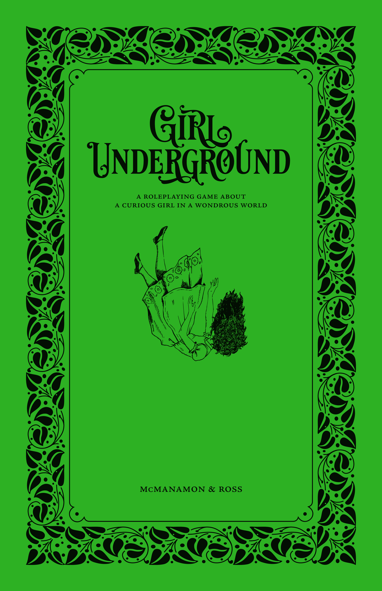

<!--
Mentionner dans article de blog que tous mes projets de trad sous git
sont exploitables pour traduire dans d'autres langues !

Unicode Typography Ornaments:
☙ ❦ ❧
🙐 🙑 🙒 🙓 🙔 🙕 🙖 🙗
🙚 🙘 🙛 🙙 🙞 🙜 🙟 🙝
🙠 🙡 🙢 🙣 🙤 🙥 🙦 🙧 
-->

<figure>
  
  <figcaption><a href="https://girlunderground.org/">girlunderground.org - Lauren McManamon & Jesse Ross</a></figcaption>
</figure>

 

Inspiré des Aventures d'Alice au pays des merveilles, du Magicien d'Oz, du Voyage de Chihiro, du Labyrinthe et d'autres contes similaires, _Girl Underground_ vous propose de raconter l'histoire d'une jeune fille curieuse et de ses étranges compagnons qui voyagent à travers un monde merveilleux, accomplissent une quête et retrouvent le chemin du retour. Tout au long de son périple, la jeune fille apprend à se connaître, découvre les valeurs qui lui tiennent à cœur et défie le monde qui l'entoure.

Dans cette histoire, la jeune fille se retrouve dans l'_Underground_, un lieu étrange rappelant Oz ou le pays des merveilles. Ce lieu souterrain est à la fois fantastique et déroutant, peuplé de personnages à la logique étrange et aux énigmes.

Heureusement, la jeune fille a trouvé des amis sur qui elle peut compter, et qui comptent sur elle à leur tour. Ces amis représentent les archétypes que l'on retrouve dans ce genre d'histoires : animaux parlants, statues vivantes, hybrides métamorphes, bêtes mythiques, géants amicaux et enfants aventuriers.

En raison du type d'histoire que raconte _Girl Underground_, nous l'abordons avec la certitude que la Jeune Fille atteindra ses objectifs et rentrera chez elle. Nous cherchons à comprendre comment elle y parvient et ce qu'elle apprend sur elle-même sous terre. L'autre monde dans lequel elle se trouve représente cet espace entre l'enfance et l'âge adulte : une période étrange et surprenante où elle peut découvrir qui elle est et ce en quoi elle croit.

:::::: playbook
## La Jeune Fille

Tu es une fille de 12 ans. Tu n'es pas de ce monde et tu essaies de retrouver le chemin du retour. La maison n'est pas parfaite – en fait, elle est pleine de difficultés et d'injustices – mais c'est quand même ta maison. Il y a des gens qui t'aiment, qui te manquent en ce moment et qui se demandent pourquoi tu n'es pas encore venue dîner.

::::: frame
:::: title
_Collectivement, décidez du nom de la Jeune Fille._
::::
Si votre famille a de l'amour mais pas :

:::: col3-list
* de curiosité, ton nom est **Kat**.
* d'argent, ton nom est **Penny**.
* de temps, ton nom est **Patience**.
* de magie, ton nom est **Faye**.
* de sérénité, ton nom est **Serena**.
* de \_\_\_\_\_\_\_\_\_, ton nom est **\_\_\_\_\_\_\_\_\_**.
::::
:::::

::::: frame
:::: title
_Répondez ensuite chacun votre tour à ces questions._
::::
:::: col2
**Comment portez-vous vos cheveux ?**
* Doux et texturés comme un nuage endormi
* Longs et ondulés comme une douce marée d'été
* Rectes et droits comme le tranchant d'une règle
* Coupés courts comme l'herbe fraîchement tondue
* Emmêlés et noués comme une corde qui s'effiloche
* Tressés et fluides comme une rivière sinueuse
* \_\_\_\_\_\_\_\_\_\_\_\_\_\_\_\_\_\_\_\_\_\_\_\_\_\_\_\_\_\_\_\_\_\_\_\_\_\_\_\_\_\_\_\_\_\_\_\_\_\_\_\_

**Quelle est votre possession la plus chère ?**

::: col2-list
* Quelque chose naturel
* Quelque chose offert
* Quelque chose domestique
* Quelque chose vivant
* Quelque chose volé
* Quelque chose fabriqué par vous
:::

_Décrivez-le :_ \_\_\_\_\_\_\_\_\_\_\_\_\_\_\_\_\_\_\_\_\_\_\_\_\_\_\_\_\_\_\_\_\_\_\_\_\_\_\_\_\_

\_\_\_\_\_\_\_\_\_\_\_\_\_\_\_\_\_\_\_\_\_\_\_\_\_\_\_\_\_\_\_\_\_\_\_\_\_\_\_\_\_\_\_\_\_\_\_\_\_\_\_\_\_\_

**À quoi ressemble votre voix ?**
* Pétillant comme un ruisseau qui coule
* Chaud comme une brise d'été
* Rapide comme un éclair
* Rêveur comme un nuage de barbe à papa
* Graveleux comme une route de campagne
* Silencieux comme une pensée secrète
* \_\_\_\_\_\_\_\_\_\_\_\_\_\_\_\_\_\_\_\_\_\_\_\_\_\_\_\_\_\_\_\_\_\_\_\_\_\_\_\_\_\_\_\_\_\_\_\_\_\_\_\_

**Quelle est votre plus grande peur ?**
* L'absence (l'obscurité, le silence, l'isolement...)
* La colère (le feu, les monstres, les séismes...)
* L'humiliation (les harceleurs, les défauts, l'échec...)
* L'incapacité (la paralysie, la maladie, la pauvreté...)
* Le jugement (le mérite, les choix, les perceptions...)
* \_\_\_\_\_\_\_\_\_\_\_\_\_\_\_\_\_\_\_\_\_\_\_\_\_\_\_\_\_\_\_\_\_\_\_\_\_\_\_\_\_\_\_\_\_\_\_\_\_\_\_\_
::::

**Qu'est-ce vous voulez être quand vous serez grande ?**

\_\_\_\_\_\_\_\_\_\_\_\_\_\_\_\_\_\_\_\_\_\_\_\_\_\_\_\_\_\_\_\_\_\_\_\_\_\_\_\_\_\_\_\_\_\_\_\_\_\_\_\_\_\_\_\_\_\_\_\_\_\_\_\_\_\_\_\_\_\_\_\_\_\_\_\_\_\_\_\_\_\_\_\_\_\_\_\_\_\_\_\_\_\_\_\_\_\_\_\_\_\_\_\_\_\_\_\_\_\_\_\_\_

**À quoi ressemble votre vie familiale ?** _Le guide peut vous poser des questions supplémentaires ici._

\_\_\_\_\_\_\_\_\_\_\_\_\_\_\_\_\_\_\_\_\_\_\_\_\_\_\_\_\_\_\_\_\_\_\_\_\_\_\_\_\_\_\_\_\_\_\_\_\_\_\_\_\_\_\_\_\_\_\_\_\_\_\_\_\_\_\_\_\_\_\_\_\_\_\_\_\_\_\_\_\_\_\_\_\_\_\_\_\_\_\_\_\_\_\_\_\_\_\_\_\_\_\_\_\_\_\_\_\_\_\_\_\_

\_\_\_\_\_\_\_\_\_\_\_\_\_\_\_\_\_\_\_\_\_\_\_\_\_\_\_\_\_\_\_\_\_\_\_\_\_\_\_\_\_\_\_\_\_\_\_\_\_\_\_\_\_\_\_\_\_\_\_\_\_\_\_\_\_\_\_\_\_\_\_\_\_\_\_\_\_\_\_\_\_\_\_\_\_\_\_\_\_\_\_\_\_\_\_\_\_\_\_\_\_\_\_\_\_\_\_\_\_\_\_\_\_

\_\_\_\_\_\_\_\_\_\_\_\_\_\_\_\_\_\_\_\_\_\_\_\_\_\_\_\_\_\_\_\_\_\_\_\_\_\_\_\_\_\_\_\_\_\_\_\_\_\_\_\_\_\_\_\_\_\_\_\_\_\_\_\_\_\_\_\_\_\_\_\_\_\_\_\_\_\_\_\_\_\_\_\_\_\_\_\_\_\_\_\_\_\_\_\_\_\_\_\_\_\_\_\_\_\_\_\_\_\_\_\_\_

\_\_\_\_\_\_\_\_\_\_\_\_\_\_\_\_\_\_\_\_\_\_\_\_\_\_\_\_\_\_\_\_\_\_\_\_\_\_\_\_\_\_\_\_\_\_\_\_\_\_\_\_\_\_\_\_\_\_\_\_\_\_\_\_\_\_\_\_\_\_\_\_\_\_\_\_\_\_\_\_\_\_\_\_\_\_\_\_\_\_\_\_\_\_\_\_\_\_\_\_\_\_\_\_\_\_\_\_\_\_\_\_\_

:::::

::::: frame
:::: title
_Maintenant consultez la liste des Bonnes Manières et décidez collectivement :_
::::
**Quelle Bonne Manière choisissez-vous d'ignorer lorsque vous découvrez votre porte vers un autre monde ?**
Retournez-le et écrivez une nouvelle Croyance qui reflète ce que vous savez déjà de vous-même.
:::::
::::::

:::::: playbook
## Manœuvres de la Jeune Fille

Vous avez accès à toutes ces actions chaque fois que vous incarnez la Jeune Fille.

::::: frame
:::: title
**Refusez de respecter les Bonnes Manières**
::::
Lorsque vous faites face à une situation en refusant de jouer la jeune fille bien élevée, nommez la Bonne Manière contre laquelle vous vous rebellez et lancez deux dés. Additionnez-les pour obtenir votre résultat.

:::: side-by-side
:::

7+

Comment surmontez-vous ce défi ? <em>De 7 à 9, également</em> : Comment échouez-vous ou allez-vous trop loin ?

:::

:::

6-

Quel aspect de votre rébellion est mal compris par les autres ?
:::
::::

:::: effect
Retournez la Bonne Manière et inscrivez une nouvelle Croyance basée sur ce que cela vous a appris sur vous-même ou sur le monde.
::::
:::::

::::: frame
:::: title
**Défendez vos convictions**
::::
Lorsque vous faites face à une situation en restant fidèle à vos convictions, commencez avec un dé, puis prenez un dé supplémentaire pour chaque Croyance concernée et lancez-les. Additionnez les deux dés les plus élevés pour obtenir votre résultat.

:::: side-by-side
:::

7+

Comment surmontez-vous ce défi ? <em>De 7 à 9, également</em> : Quel prix est-ce que cela vous coûte ?

:::

:::

6-

Qu'apprenez-vous qui vous aidera à surmonter une difficulté plus tard ?
:::
::::

:::::

::::: frame
:::: title
**Toujours plus curieuse**
::::
Lorsque vous essayez d'obtenir des réponses sur ce monde ou ses habitants, posez votre question au Guide.

:::: side-by-side
:::
Si vous êtes prêt à participer à une activité bizarre, votre réponse sera — étonnamment — claire et utile.
:::

:::
Si vous n'êtes pas disposé à le faire, votre réponse prendra la forme d'une énigme.
:::
::::
:::::

::::: frame
:::: title
**Tournez manège**
::::
Lorsque vous voulez introduire un Compagnon dans une scène, ou placer quelqu'un d'autre dans la lumière, passez le livret de la Jeune Fille à un autre joueur de votre choix. Il devient alors la Jeune Fille.
:::::

::::: frame agenda
:::: title
_Lorsque vous incarnez la Jeune Fille, essayez de faire ceci :_
::::
Désirez ce qui manque à votre famille et à votre foyer.

Agissez contre vos Bonnes Manières et en accord avec vos convictions.

Soyez courageuse et saisissez les occasions d'apprendre et de grandir.

Posez des questions pertinentes à toutes les personnes que vous rencontrez.

Demandez de l'aide à vos Compagnons en cas de besoin.
:::::
::::::

:::::: playbook
## La Bestiole

:::::: playbook
## Manœuvres de la Bestiole

:::::: playbook
## L'Homoncule

:::::: playbook
## Manœuvres de l'Homoncule

:::::: playbook
## Le Faune

:::::: playbook
## Manœuvres du Faune

:::::: playbook
## Le Myhtique

:::::: playbook
## Manœuvres du Mythique

:::::: playbook
## L'Ogre

:::::: playbook
## Manœuvres de l'Ogre

:::::: playbook
## Le Fugueur

:::::: playbook
## Manœuvres du Fugueur

## Les Bonnes Manières

La société attend d'une fille qu'elle soit polie, mais ce n'est pas toujours la meilleure façon de faire la différence.

::: manners

Les jeunes filles ne doivent jamais répondre à leurs aînés. | Les jeunes filles ne doivent jamais mentir.
-|-
Les jeunes filles ne doivent jamais reconnaître leurs imperfections. | Les jeunes filles ne doivent jamais se salir les mains ni leurs vêtements.
Les jeunes filles ne doivent jamais se plaindre de leurs devoirs. | Les jeunes filles ne doivent jamais blesser autrui.
Les jeunes filles ne doivent jamais prendre trop de place. | Les jeunes filles ne doivent jamais exiger quoi que ce soit.

:::

## Croyances

::: beliefs

Lorsque vous contestez une Bonne Manière, écrivez une nouvelle Croyance pour la remplacer.

___________________ ___________________ ___________________ | ___________________ ___________________ ___________________
-|-
___________________ ___________________ ___________________ | ___________________ ___________________ ___________________
___________________ ___________________ ___________________ | ___________________ ___________________ ___________________
___________________ ___________________ ___________________ | ___________________ ___________________ ___________________

:::

## Conseils pour jouer les personnages

_**La Jeune Fille :**_ Vous jouez pour découvrir ce que la Jeune Fille ressent face à son parcours et comment elle évolue en tant que personne. Présentez-lui des manières à remettre en question et créez des situations pour qu'elle affirme ses convictions. Créez un espace pour qu'elle explore son identité. Lorsqu'elle se languit de son pays, montrez-lui comment les merveilles de l'underground peuvent réaliser ses rêves. Lorsqu'elle souhaite rester, augmentez le danger et mettez en évidence les éléments qui lui font regretter son pays.

_**La Bête :**_ La Bête est synonyme d'autorité et de rébellion. Laissez ses mots et son esprit la mettre dans le pétrin et la sortir des ennuis. Créez des rencontres avec des personnes qui pensent savoir mieux que vous ou qui tentent de tromper la Jeune Fille. La Bête connaît tout le monde, alors laissez-les présenter de nouveaux personnages ou partager des ragots sur des personnages connus. Saisissez l'occasion de tisser des histoires conflictuelles entre la Bête et ces individus.

_**L'Homoncule :**_ L'Homoncule représente l'identité personnelle et l'objectivité. Ils découvrent ce que signifie être en vie et comment la société ne les perçoit pas toujours de cette façon.
Introduisez des objets fabriqués dans le même matériau pour permettre au Construct d'explorer son identité et ses racines émergentes. Présentez également des personnages que le Construct peut examiner. Ils sont également reconstructibles, donc si vous souhaitez augmenter les enjeux par la violence, faites-leur porter le poids des dégâts (mais attention, ne les tuez pas).

_**Le Faune :**_ Le Faune est transformation et exaucement de vœux. Créez des défis qui ne peuvent être surmontés que par une imagination débordante, prête à explorer pleinement la logique des contes de fées. Introduisez des fêtes et des rassemblements pour les aider à attirer des personnages utiles.
Assurez-vous que l'objet auquel ils ne peuvent résister fasse une apparition (ou deux !).

_**Le Mythique :**_ Le Mythique est libre, mais empreint de nostalgie. Laissez-lui l'espace d'être à la fois triste et splendide. Donnez-lui l'occasion de se sacrifier dans un éclat de gloire, puis de faire un retour tout aussi magnifique. Il est normal que le Mythique soit absent
pour un court instant – son joueur peut affronter la Fille pendant ce temps-là – mais recherchez des défis où son retour peut sortir le groupe d'une situation difficile.

_**L'Ogre :**_ L'Ogre incarne la honte et la confiance en soi de l'adolescence. Il doit osciller entre le sentiment de puissance et la honte. Donnez-lui l'occasion d'être courageux, mais maîtrisez-le lorsqu'il prend le contrôle d'une scène ou essaie d'en faire trop. Rendez ses conséquences gênantes et embarrassantes. Entraînez-le dans des situations où il ne peut s'empêcher de marcher sur les pieds de ses amis (au sens propre comme au figuré).

_**Le Fugueur :**_ Le Fugueur ne veut pas grandir et aime explorer les coulisses. Il représente l'indépendance, mais fuit aussi ses problèmes. Il sait comment sortir le groupe d'une situation effrayante, ce qui vous permet d'accentuer le danger. Proposez-lui des interactions sociales pour qu'il puisse raconter de magnifiques histoires, mais offrez-lui aussi des moments de calme, seul ou avec un seul autre personnage.

## Script Change - Cartes

 

<b>PAUSE</b> Après une scène intense, discutez ou clarifiez le déroulement de l'histoire. | <b>REWIND</b> Rembobinez l'histoire jusqu'à un point antérieur. Le groupe peut alors raconter une action différente pour éviter l'élément qui a provoqué le retour en arrière.
-|-
<b>FAST-FORWARD</b> Avancez rapidement un élément de l'histoire sur lequel vous ne souhaitez pas vous attarder, ou simplement pour avancer dans le temps. | <b>FRAME-BY-FRAME</b> Passez en revue image par image une scène que vous souhaitez aborder avec prudence.
