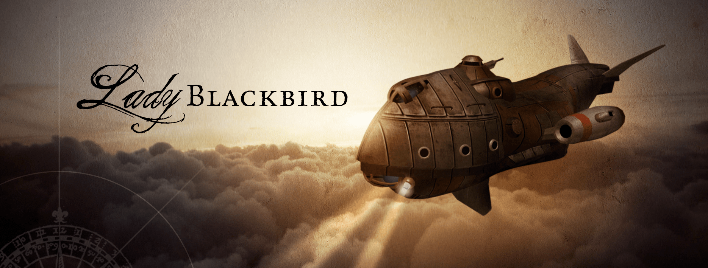

 

# Contes de l’Indomptable Bleu

Ceci est une aide de jeu pour le jeu de rôle **Lady Blackbird** de John Harper :

* [site officiel anglophone @ onesevendesign.com](http://www.onesevendesign.com/ladyblackbird/)
* [site de la traduction francophone des Écuries d'Augias @ sycko.fr](https://www.sycko.fr/ecuries-augias)

L'objectif de cette aide de jeu est de fournir quelques pistes et obstacles pour faciliter la poursuite des aventures de **Natasha Syri**, **Naomi Bishop**, **Cyrus Vance**, **Kale Arkam** et **Snargle** dans le monde de _L’Indomptable Bleu_.

Ce document s'inspire fortement de [_Tales From the Wild Blue Yonder: The Lady Blackbird Companion_ (PDF de 27 pages, 7,5 Mo)](https://app.box.com/s/yj9y4ascil), une aide de jeu anglophone et non traduite à ma connaisance (<a href="https://archive.org/details/blackbirdcompanion/page/n1/mode/2up">lien alternatif de téléchargement</a>).

Pour de plus amples ressources concernant **Lady Blackbird**,
vous pouvez consulter cet article en ligne que j'ai rédigé : [Lady Blackbird @ chezsoi.org](<https://chezsoi.org/lucas/blog/lady-blackbird.html>).

 

### Fil rouge
Voici en bref les grandes étapes de l'intrigue proposée :
1. rejoindre Havreport
2. quitter Havreport
3. WANTED : un sorcier sang-roche aux trousses
4. la Rébellion Carmine passe à l'action
5. départ pour les Vestiges
6. attaque de Poulpe Céleste

## Rejoindre Havreport

### PNJ - Kryssa

<!-- Source: https://www.artstation.com/artwork/qAOxwn -->

**Ancienne esclave, Forte, Impulsive, Combattante de la liberté**

::: conditions
* Menottée
* Coup de sang
* Enragée
:::

Lors de leurs déambulations dans le croiseur impérial,
les PJs croiseron enchaînée dans les geôles du navire.

Cette ancienne esclave de l'Empire a été capturée par La Main Chagrine,
et sera exécutée une fois ramenée à Olympia.
Elle ne fera néanmoins aucunement appel à la pitié des PJs :
au contraire, elles les appostrophe brutalement pour qu'ils ouvrent sa cellule et la libère.

::: goals
Objectifs :
1. s'évader puis saboter La Main Chagrine
2. s'enfuir et rejoindre Havreport
3. s'engager dans la Rébellion Carmine
:::

> « Oh toi. Oui toi, la demi-portion. Ouvre donc ma cellule.
> Je ne sais pas comment vous vous êtes échappés,
> mais je meure d'envie d'applatir la caboche de ces crétins de soldats.
> Allez, libérez-moi ! Vous ne le regretterez pas. »

> « Allez les loulous, c'est parti, ça va bastonner : CHARGEEEZ ! »

::: info think
Lorsque les PJs rencontrent **Kryssa**, demandez à **Naomi Bishop** :
* vous êtes toutes deux d'anciennes esclaves : as-tu déjà rencontré Kryssa ?
* si **oui**, es-tu en bon terme avec elle ? Comment avez-vous fait connaissance ?
:::

### Obstacle - Course-poursuite en navire-céleste
Après s'être échappés à bord de La Chouette,
celle-ci a initiallement un peu d'avance sur le croiseur impérial,
mais celui-ci, plus puissant, rattrapera progressivement les fuyards...
Les PJs doivent rapidement trouver un moyen de le semer !
* 1er test râté : La Main Chagrine, à portée de tir, canarde La Chouette et lui inflige une Condition.
* 2e test râté : les troupes de la Main Chagrine passent à l'abordage de la Chouette.

Afin de réaliser un jet pour semer le croiseur impérial,
les PJs doivent trouver une ruse, une stratégie.
Décrivez-leur l'environnement autour d'eux pour leur inspirer des idées :
* les nuages sont denses et électriques, laissant parfois appercevoir des éclairs.
* des rochers flottent dans les airs autour des vaisseaux, et comportent des reliquats de structures métaliques : pans de tôle, poutres d'acier, longues chaînes suspendues...
* le soleil se couche à l'horizon.

### Obstacle - Panne de carburant
Havreport était la destination initiale de l'équipage de La Chouette,
avant qu'elle soit interceptée par La Main Chagrine.
Il est donc fort probable que les PJs s'y dirigent naturellement.

Alors que leur destination n'est plus qu'à quelques kilomètres,
les PJs tombent en **panne de carburant** !

::: info think
 &nbsp;
Demandez aus PJs : quel **type de carburant** emploie La Chouette ?
  
:::

Peut-être le réservoir a-t-il été percé par une balle,
ou vidé par les soldats du croiseur impérial ?
Quoi qu'il en soit, les PJs vont devoir faire preuve d'ingéniosité pour atteindre leur destination...

* il y a beaucoup de vent cette nuit, mais peut-être pas dans bonne direction...
* les talents magiques de l'équipage pourraient-ils compenser l'absence de carburant ?
* la nuit, les signaux lumineux se voient de loin... Mais si la Chouette se fait remorquer jusqu'à Havreport, cela aura un prix...

## Havreport
> « À votre arrivée dans la baie de Havreport, le spectacle est saisissant :
> partout autour de vous, des pontons en bois, de bric et de broc, des navires amarés,
> de gigantesques cerfs-volants, des ballons avec nacelle, des filins de part et d'autre,
> sur lesquels glissent les habitants dans tous les sens...
> Le décor qui s'offre à vous est bruyant et coloré, fourmillant d'activité chaotique. »

### Lieux emblématiques
<dl>
<dt>La Taverne du Gobelin Manchot</dt>
    <dd>Auberge bien connue des marins de passages, où se négocient toutes sortes de contrats, et où les marchands de Havreport viennent souvent recruter des individus dévrouillards pour de courtes missions plus ou moins légales... <u>PNJs présents</u>: le patron - un gobelin manchot, Thom Bannister, Lord AutomaClock drappé dans sa cape.</dd>
</dl>

### Obstacle - Vaisseau immobilisé
Dès qu'ils reviendront à La Chouette, accostée à quai,
les PJs découvriront qu'un énorme sabot le bloque sur place,
avec une note du Syndicat du Commerce : la taxe de séjour doit être réglée !

Il devrait être rapidement clair pour les PJs que pour poursuivre leur voyage
ils vont devoir trouver des fonds, ou rendre service à quelqu'un...

### PNJ - Lord AutomaClock

<!-- Source: https://annalisanorsinglevcwtt.pages.dev/?search=robot+butler+fantasy+art -->

### PNJ - Thom Bannister

**Pilote, Audacieux, Joueur compulsif, Citoyen impérial**

::: conditions
* Recrutable
* Endetté
* Espion impérial
:::

**Thom** est une connaissance de **Cyrus Vance**, avec qui il entretien une relation tendue, au passé chargé :
amis d'enfance, frères d'armes, duo de pilotes légendaire, mais aussi dettes non remboursées, compétition amouireuse, proches décédés tragiquement et petites trahisons...

> « Je vous parie à dix contre un que ça passe : accrochez-vous, ÇA VA SWINGUER ! »

> « Vous cherchez la Rébellion Carmine ? OK, je vais vous aider. »

::: goals
Objectifs :
1. trouver un job profitable pour rembourser ses dettes
2. fournir des renseignement à l'Empire concernant la Rébellion Carmine
3. risquer sa vie pour sauver Cyrus, en souvenir de leur amitié
:::

::: info think
Lorsque les PJs rencontrent **Thom Bannister**, demandez à **Cyrus Vance** :
* qu'est-ce qu'il t'est difficile de pardonner à Thom ?
* pourquoi as-tu néanmoins totalement confiance en Thom ?

Demandez également à **Kale Arkham** :
* tu as déjà eu l'occasion de rencontrer Thom, que penses-tu de lui ?
:::

## Le temple d'Octo

### Obstacle - Des pièges mortels

### Obstacle - Un guardien mécanique

### Objet - Le Sceptre d'Octo

## Retour à Havreport

### Un sorcier sang-roche aux trousses
Posters WANTED...

<!-- Source : https://www.artstation.com/artwork/qz3En -->

<!--
Design goals:
* faciliter la poursuite d'aventures dans l'univers de Lady Blackbird
* introduire des situations typiques de JdR :
    résolution de problème "ouvert, donjon à epxlorer, affrontement collectif contre un "boss", négociations avec PNJs...
* fournir du contenu pour l'univers (lieux, PNJs...), en lien avec les PJs
* confronter les joueurs à choix/dilemnes cornéliens
* proposer une trame "fil rouge" et des ouvertures pour faciliter l'improvisation
* introduire des règles supplémentaire d'évolution des PJs :
    + gain de Conditions glorieuses pour leurs "haut faits" :
        ennemi de l'Empire, héro de Havreport, terrasseur de poulpes célestes...
    + exploding-sixes : si XXX, vous pouvez relancer les 6 obtenus, et peut-être obtenir plus de réussites
-->
