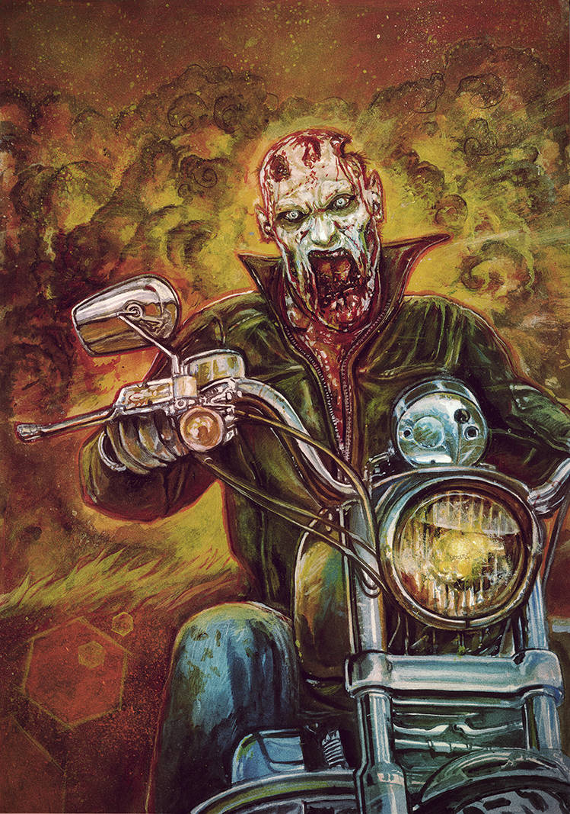
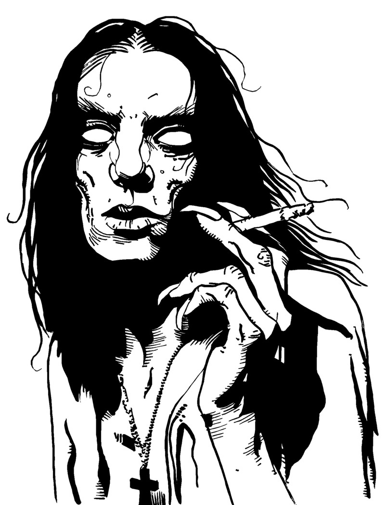
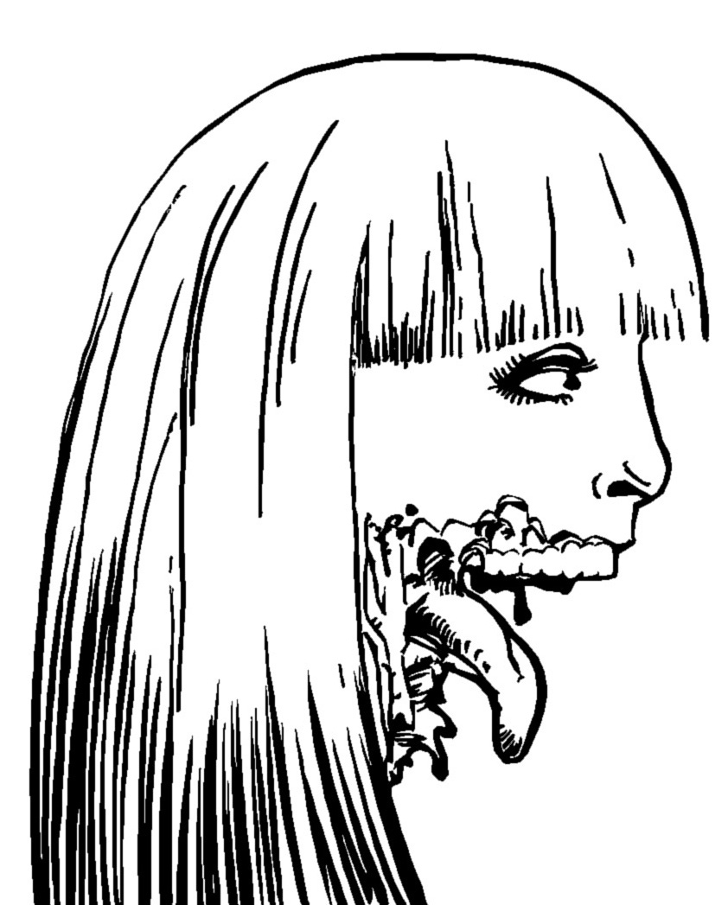

<!--Todo:
* playtest
* commentaire sur https://www.deviantart.com/danyaellopes/art/Cover-Ilustration-to-a-Comic-zombie-collection-752176453
* publi sur tl;dr

Extension ennemis spécifiques (initialement suggestion/variante "ouverte") :
* scientifiques possédant de quoi se soigner (récupérer un litre de sang)
* soldats sans pitié tirant en priorité sur les zombies
* alien ayant une chance sur 6 de se dupliquer à chaque tour
* vampires grossissant d’un jeton par litre de sang absorbé
-->
# Les NON-MORTS

Ruelle glauque. Nuit noire.

Un bruit de pas nerveux rompt le silence glacial. Lentement, la marche rapide se mue en trottinement, puis en course effrénée.
Une blonde pulpeuse à hauts talons apparaît à la lueur blafarde des néons d'un bar. Elle s'adosse contre un mur pour reprendre son souffle.
Soudain, une forme voûtée se dessine à l'extrémité de la ruelle. Elle émet un grognement rauque.
La jeune femme sursaute et s'élance de nouveau dans une fuite éperdue… pour trébucher sur un câble, entraînant la chute d’un projecteur. 

> « Coupez ! C’est pas vrai, quels acteurs lamentables… Aidez au moins Brenda à se relever !
> Bon, la maquilleuse rajoute fissa quelques lambeaux de peau à Tony et on la refait. Et je veux encore plus de ketchup cette fois ! »

## Qu'est-ce que c'est que ce truc ?
_Les Non-Morts_ est un court jeu compétitif faisant la part belle à l'imagination, à mi-chemin entre jeu de société et jeu rôle sans meneur,
dans une ambiance de film de mort-vivants de série Z.

Au cours de la partie, les joueurs vont dessiner collectivement le plan d'un lieu,
et décrire les actions d'une poignée de survivants tentant de survivre à une marée de zombies.

Pour y jouer, vous aurez besoin de plusieurs dés traditionnels à six faces (des "d6"),
de 5 pions de couleurs différentes, de plusieurs dizaines de jetons quelconques pour représenter les mort-vivants,
de feuilles de papiers, de crayons dont un rouge, de 2 à 5 amis et de quelques heures devant vous.

## But du jeu
Tantôt scénariste tantôt réalisateur, chacun des joueurs va devoir user de stratégie, de diplomatie et de bluff pour parvenir à
**imposer sa théorie sur l’origine des zombies dans le film** !

Pour y parvenir, il devra glisser subrepticement des indices entre les mains des protagonistes qui survivront à l’horreur de cette nuit.
Pas évident dans un navet horrifique de série Z !
En plus, la production a imposé une co-écriture et une co-réalisation du film avec d’autres minables qui se croient les nouveaux un Spielberg ou Carpenter…
et ces ratés ne veulent pas de votre théorie !

## Début du jeu
Les joueurs se mettent d’accord sur un lieu : manoir, supermarché, bateau, bibliothèque…

Chaque joueur commence avec **5 jetons** et **une carte théorie** piochée au hasard.
À quatre ou six joueurs, n’utilisez que deux ou trois théories en double exemplaire de façons à former des équipes.
Révéler sa théorie étant bien sûr formellement interdit, le bluff devient alors également une arme.

Le premier joueur est tiré au hasard des dés. Il prend une feuille de papier et y trace une première pièce.
Il décrit ensuite l’arrivée d’un zombie, et pose à l'entrée de la pièce un jeton de la réserve pour le représenter.
Il peut y avoir des victimes parmi les figurants : cette entrée en scène doit être surprenante voir spectaculaire !
Cette scène doit également expliquer la blessure du flic, forcément stupide.

C’est ensuite au joueur à sa gauche d'entamer le premier tour.

## Déroulement d’un tour
Le joueur commence par piocher **autant de jetons qu’il a d’adversaires** autour de la table. Il peut alors décider :

- **soit** de faire agir les zombies.
Il décrit alors ensuite de quelle façon l’**un des survivants découvre un indice** concernant l'origine des non-morts.
Il résume ensuite cet indice sur la feuille du personnage concerné.

- **soit** de jouer les survivants et de déclencher autant d’événements qu’il souhaite les concernant.
Il dessine ensuite **une nouvelle pièce**, d'une taille proche des précédentes.

Lorsqu'il a fini, avant de passer la main au joueur suivant, il défausse les jetons excédentaires s’il en possédait plus du **double du nombre de joueurs**.

### Faire agir les non-morts
Pour chaque pièce contenant des survivants, le joueur commence par lancer **1d6 par zombie présent**.
Si le chiffre obtenu indique un survivant présent dans cette pièce, celui-ci perd un litre de sang.
Dans le cas contraire, le zombie est trop lent ou trop maladroit pour toucher qui que ce soit.
Ou bien les survivants arrivent à les repousser, mais c'est peu probable...

Une fois ces jets effectués, le joueur fait se déplacer **1 à 4 zombies** dans des pièces sans humains vers une pièce adjacente en direction des survivants.
Enfin, il doit **rajouter 1 à 4 non-morts** dans n’importe quelle pièce en décrivant son/leur arrivée et en plaçant un jeton pour chaque zombie.
Le total des mort-vivants déplacés et rajoutés doit faire **5**.

### Jouer les survivants
- pour **un jeton**, un joueur peut déplacer durant son tour jusqu’à **deux survivants** dans une pièce adjacente **ne contenant pas de zombies**.
Si toutes les pièces adjacentes contiennent des non-morts, cette dernière restriction ne s'applique pas.
Un jeton ne permet **pas** de déplacer un unique personnage à travers deux pièces.
Les pièces non encore dessinées sont considérées comme inaccessibles : porte fermée à clef, ascenseur en panne, trappe vissée…
Lorsqu’un survivant **quitte une pièce content des zombies**, on lance 1d6 : si le résultat est **égal ou inférieur** au nombre de non-morts présents,
il perd un litre de sang.

- pour **deux jetons**, un joueur peut faire en sorte qu’**un zombie soit tué** par un survivant dans la même pièce que lui.
A lui de décrire comment il s'y prend !

- pour **autant de jetons qu’il a d’adversaires**, un joueur peut indiquer au trait rouge **une sortie** sur le plan
en expliquant de quelle manière les survivants peuvent s’échapper définitivement de cet enfer en l’empruntant :
hélicoptère de secours, route très fréquentée, voiture en état de marche, canot de sauvetage…

Un joueur peut également **proposer**, à n’importe quel moment, un événement non décrit dans les règles mais ne mettant pas en jeu la vie d’un survivant :
massacre de figurants en arrière plan par des zombies ne s’intéressant pas aux acteurs du film,
conception d’une barricade empêchant tout passage, découverte d’un nécessaire de soin par un survivant, gros zombie se régénérant…
Cet événement ne permettra pas pour autant de ralentir les zombies !

A moins qu'au moins deux autres joueurs autour de la table s'opposent à cet événement, il a lieu.
Un joueur peut vendre sa voix en imposant qu’un certain nombre de jetons soient dépensés pour réaliser cet événement,
ces jetons pouvant être payés par plusieurs joueurs.

## Les survivants
Au nombre de cinq, ils seront représentés durant la partie par des pions de couleurs distinctes.
Pour chaque personnage, leur nombre initial de litres de sang est indiqué entre parenthèses :

- **⚀ Le flic** (4L) est armé, ce qui permet au joueur l’utilisant pour tuer un zombie de ne dépenser qu’un seul jeton.
Malheureusement blessé à la jambe, deux jetons sont nécessaires pour le déplacer lui et un autre survivant.

- **⚁ La pouffe** (2L), complètement hystérique, peut hurler à en déchirer les tympans pourris des zombies,
les obligeant à reculer dans une pièce adjacente. Cet événement coûte 3 jetons mais peut être payé par plusieurs joueurs.

- **⚂ Le geek** (4L), paranoïaque obsédé par l’informatique et la théorie du complot, est capable de transformer n’importe quel objet du quotidien
en preuve de l’existence du surnaturel. Pour autant de jetons qu’il a d’adversaires, un joueur peut,
une seule fois durant un tour où il incarne les survivants, faire en sorte que le geek trouve un indice
et force un autre survivant dans la même pièce à l’emporter avec lui.
Totalement claustromane et agoraphobe, seule une sortie par les égouts, le métro ou les catacombes est envisageable pour lui.

- **⚃ ⚄ La brute** (6L), athlète tout en muscles, est déterminée à se sortir de ce piège.
Ses cris de rage et ses insultes vexent néanmoins terriblement les non-morts qui en font une cible privilégiée.

- **Le goth** (4L) possède un visage blafard et une démarche voûtée qui le font passer pour un non-mort aux yeux des autres zombies.
Il ne peut ainsi être blessé qu'en s'enfuyant d'une pièce. Légèrement dérangé, seule la présence des autres
lui permet de rester maître de ses esprits : isolé, il se transforme immédiatement en tueur fou,
l’équivalent d’un zombie composé d’autant de jetons qu’il lui restait de litres de sang et insensible à l’attrait des cadavres.

### Mort d'un survivant
Un survivant qui perd son dernier litre de fluide vital meurt en répandant des gerbes de sang, et si possible de manière ridicule.
Le joueur actif dessine alors son cadavre sur le plan : attirés comme des mouches par cette source de nourriture,
plus aucun zombie **ne quittera cette pièce**.

## Fin de partie
Le jeu s'arrête dès qu'**un survivant s’échappe avec au moins trois indices** confirmant la théorie d’un joueur.
Le joueur ayant amassé le plus de preuves gagne la partie.
Dans le cas d’une égalité ou de la mort de tous les protagonistes, il n’y a aucun gagnant mais le film est un succès au box-office !

Notez qu’un indice peut servir plus d’une seule théorie. Deux joueurs peuvent ainsi s’arranger pour qu’un indice leur convienne tous deux.
On considèrera qu’un indice convenant **par hasard** à une autre théorie que celle de celui qui l’a composé ne sera pas valable que pour ce dernier.

## Variantes
- Lorsqu’un joueur joue les zombies, il peut rajouter non pas des jetons isolés mais toute une pile pour créer un zombie plus fort :
chaque fois qu’un survivant tente de le tuer, il perd seulement un jeton au lieu de mourir et lorsque les zombies passent à l’attaque,
un d6 doit être lancé pour chaque jeton le composant.

- Un survivant peut éventuellement être ajouté : **le contaminé** (6L). Blessé par un zombie au premier tour,
il n’intéresse pas les non-morts et ne se fait donc jamais attaquer. Seule l’avancée de sa transformation peut l’affecter.
Celle-ci progresse d'1L lorsqu'un joueur dépense 3 jetons durant un tour de zombies.
La transformation est lente et il ne peut ainsi perdre plus d’un litre de sang par tour.

- Si vous disposez d’un plan de ville quadrillé avec de grosses cases, vous pouvez l'utiliser pour jouer à plus grande échelle !
Considérez chaque case comme une immense pièce, et « activez-les » progressivement, en ajoutant à chaque fois un lieu notable :
hôtel de ville, caserne de pompiers, cinéma, parc...

## À imprimer

### Les théories sur l'origine des zombies

| **Infecté**               un virus militaire, une bactérie inconnue... ou un champi
|-
| **Magie noire**           une malédiction démoniaque ou un mauvais sort
| **Parasite alien**        une créature insectoïde à l'intérieur du corps
| **Cyber borgs**           des nanomachines maléfiques semi-intelligentes
| **Mutants nucléaires**    des radiations expérimentales qui ramolissent le cerveauuuuu

### Feuille de partie

| Dé       | Survivant | Capacités              | Couleur du pion | Indices | Litres de sang
|----------|-----------|------------------------|-----------------|---------|-
|  ⚀       | Le flic   | armé (-1J) & lent (2J) |                 |         | ▢ ▢ ▢ ▢
|  ⚁       | La pouffe | hurler (3J)            |                 |         | ▢ ▢
|  ⚂       | Le geek   | théories & agoraphobe  |                 |         | ▢ ▢ ▢ ▢
| ⚃&nbsp;⚄ | La brute  |                        |                 |         | ▢ ▢ ▢ ▢ ▢ ▢
|          | Le goth   | tueur fou si isolé     |                 |         | ▢ ▢ ▢ ▢

### Licence et sources

Ce jeu a été conçu par Lucas Cimon et est sous licence [CC BY 4.0](http://creativecommons.org/licenses/by/4.0/).

Si vous le testez, songez à me laisser un petit commentaire sur <https://chezsoi.org/lucas/blog>

Toutes les illustration sont [CC BY 3.0](https://creativecommons.org/licenses/by/3.0/) :
la première est de [Danyael Lopes](https://www.deviantart.com/danyaellopes/art/Cover-Ilustration-to-a-Comic-zombie-collection-752176453),
celles en noir & blanc sont de [Jeff Preston](https://www.drivethrurpg.com/product/91360/108-Terrible-Character-Portraits).

