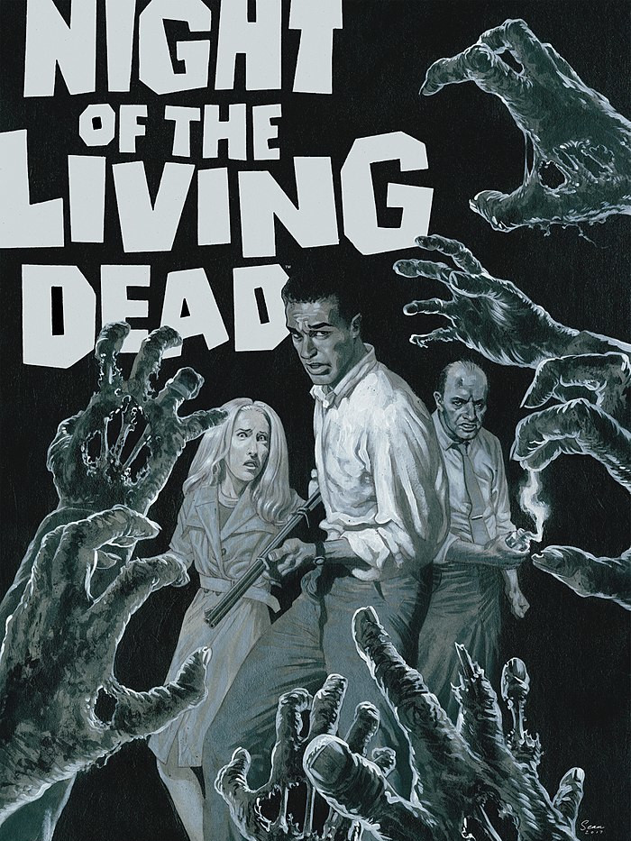

<!--Todo:
- com' sur forums :
  * [x] http://www.500nuancesdegeek.fr/forum/viewtopic.php?f=15&t=1608
  * [x] http://www.taverneproduction.com/forum/viewtopic.php?f=396&t=4757
  * [x] https://www.casusno.fr/viewtopic.php?f=26&t=37183
  * [x] https://www.trictrac.net/forum/sujet/les-non-morts & https://www.trictrac.net/forum/sujet/jeu-de-roles-univers-zombies#post-41e1385febb2ddf649066afd895451fc19af
  Analytics: https://itch.io/game/summary/580276
* une illustration / icône par survivant ? (Brute : ♀️)

Extension ennemis spécifiques (initialement suggestion/variante "ouverte") :
* scientifiques possédant de quoi se soigner (récupérer un litre de sang)
* soldats sans pitié tirant en priorité sur les zombies
* alien ayant une chance sur 6 de se dupliquer à chaque tour
* vampires grossissant d’un jeton par litre de sang absorbé

# Playtest n°2: mercredi 5 février 2020
Suggestions :
- pas assez de recoupements entre théories / trop incompatibles (ex: Cyber borgs & Magie Noire)
- à partir d'un certain nombre de Non-morts dans la pièce, les survivant doivent en tuer avant de pouvoir la quitter
- Henri : aime pas choisir de jouer survivants OU Non-morts, souhaite pouvoir faire les 2 dans un tour
- Estelle : règle un peu complexe
- Claudia : mix jeu tactique + JdR perturbant
- Loïc : a beaucoup apprécié au contraire ce mélange
-->
# Les NON-MORTS

Ruelle glauque. Nuit noire.

Un bruit de pas nerveux rompt le silence glacial. Lentement, la marche rapide se mue en trottinement, puis en course effrénée.
Une blonde pulpeuse à hauts talons apparaît à la lueur blafarde des néons d'un bar. Elle s'adosse contre un mur pour reprendre son souffle.
Soudain, une forme voûtée se dessine à l'extrémité de la ruelle. Elle émet un grognement rauque.
La jeune femme sursaute et s'élance de nouveau dans une fuite éperdue… pour trébucher sur un câble, entraînant la chute d’un projecteur. 

> « Coupez ! C’est pas vrai, quels acteurs lamentables… Aidez au moins Brenda à se relever !
> Bon, la maquilleuse rajoute fissa quelques lambeaux de peau à Tony et on la refait. Et je veux encore plus de ketchup cette fois ! »

## Qu'est-ce que c'est que ce truc ?
_Les Non-morts_ est un court jeu compétitif à mi-chemin entre jeu de société
et [jeu de rôle](https://fr.wikipedia.org/wiki/Jeu_de_r%C3%B4le_sur_table) sans meneur,
dans une ambiance de film de mort-vivants de [série Z](https://fr.wikipedia.org/wiki/S%C3%A9rie_Z) :
un navet incohérent, bourré de faux raccords et de mauvais effets spéciaux.

Les joueurs incarnent les réalisateurs / scénaristes d'un tel film, qui se sont succédés à la production, chaotique.
Au cours de la partie, ils vont dessiner collectivement le plan d'un lieu,
et décrire les actions d'une poignée de survivants de la catastrophe en cours,
tentant de survivre à une marée de mort-vivants !

### De quoi j'ai besoin pour y jouer ?
- plusieurs dés traditionnels à six faces
- 5 pions de couleurs différentes qui représenteront les **survivants** sur le plan
- plusieurs dizaines de jetons quelconques (🌑)
- de crayons et de quelques grandes feuilles de papier vierges
- de 2 à 4 amis et de quelques heures devant vous

Comme les jetons serviront, entre autres, à représenter les **Non-morts** sur le plan,
employez des pions plutôt stables mais pas trop larges dans la mesure du possible.
Vous serez ainsi plus à l'aise pour les placer sur la carte qui sera dessiné progressivement pendant la partie.

Les feuilles de papier serviront justement à dessiner ce plan :
un format A3 voir A2 est idéal, mais vous pouvez aussi très bien accoler quelques feuilles A4.
Un grand tableau blanc avec marqueurs effaçables sera également parfait, si vous en disposez d'un.

## But du jeu
Tantôt scénariste tantôt réalisateur, chacun des joueurs va devoir user de stratégie, de diplomatie et de bluff pour parvenir à
**imposer sa théorie sur l’origine des Non-morts dans le film** !

Pour y parvenir, il devra glisser subrepticement des indices entre les mains des protagonistes qui survivront à l’horreur de cette nuit.
Pas évident dans un navet horrifique de série Z !
En plus, la production a imposé une co-écriture et une co-réalisation du film avec d’autres minables qui se croient les nouveaux un Spielberg ou Carpenter…
et ces ratés ne veulent pas de votre théorie !

Bref, l'objectif de chacun des joueurs est de faire en sorte qu'**un des survivants découvre 3 indices
confirmant sa théorie, puis de le faire s'échapper**.

### Survivants & Non-morts
Contrairement à un jeu de rôle « classique », les joueurs n'incarnent pas un unique personnage.
Durant la partie, ils seront les réalisateurs du film, tirant les ficelles en coulisse.

Les **survivants** sont les personnages du film.
Archétypaux, ils sont joués par des acteurs pathétiques, et tentent de retarder leur mort sanglante,
inéluctable dans ce genre de film.

Chacun est associé à une face (deux pour _la brute_ et aucune pour _le geek_),
et dispose d'un certain nombre de _litres de sang_ (🩸), représentant leur santé.
Cette jauge va diminuer au fur et à mesure qu'ils se font attaquer,
éclaboussant à chaque fois quantité de faux sang sur le décor.
Les survivants sont détaillés [plus bas](#les-survivants).

À leurs trousses : des mort-vivants, les **Non-morts**, des zombies pas franchement effrayants ni malins,
dont la nature et l'origine sont pour le moins flous... voir incohérentes !

## Début du jeu
Les joueurs se mettent d’accord sur un lieu : manoir, supermarché, bateau, bibliothèque, métro, prison…

Chaque joueur commence avec **cinq jetons** (5🌑) et **une carte théorie**, piochée au hasard.
À quatre ou six joueurs, n’utilisez que deux ou trois théories en double exemplaire de façons à former des équipes.
Révéler explicitement sa théorie étant interdit, le bluff devient alors également une arme.

Le premier joueur est tiré au hasard des dés. Il prend une feuille de papier et y trace **deux pièces** :
une où se trouvent les survivants initialement (placez-y leurs pions), et une où débarque le premier Non-mort !
Il pose dans la pièce un jeton de la réserve pour représenter ce zombie, puis décrit son arrivée fracassante.

Comme il s'agit de la scène d'ouverture du film, il est important de prendre le temps de poser l'ambiance,
et de décrire le décor durant cette étape d'exposition.
Il peut y avoir des victimes parmi les figurants : cette entrée en scène doit être surprenante voir spectaculaire !
Cette scène doit également expliquer la blessure du flic, forcément stupide.

C’est ensuite au joueur à sa gauche d'entamer le premier tour.

### Jetons
Au début du jeu, les jetons (🌑) sont entreposés dans une réserve commune.
Ils ont deux usages durant la partie :
- ils servent à **représenter les Non-morts** sur le plan, ils sont alors pris et re-déposés dans la réserve
- ils servent de **« points d'action » pour déplacer les survivants**, ils sont alors piochés par les joueurs depuis la réserve,
placés devant eux, puis retournent dans la réserve quand ils sont employés

Si vous avez le matériel nécessaire, vous pouvez très bien employer deux types de jetons pour distinguer ces deux usages.

## Déroulement d’un tour
Le joueur commence par piocher **autant de jetons (🌑) qu’il a d’adversaires** autour de la table. Il peut alors décider :

- **soit de faire agir les Non-morts**.
Il décrit alors ensuite de quelle façon l’**un des survivants découvre un indice** concernant l'origine des non-morts.
Il résume ensuite cet indice sur la feuille du personnage concerné.

- **soit de jouer les survivants**, et de déclencher autant d’événements qu’il souhaite les concernant.
Il dessine ensuite **une nouvelle pièce**.

Lorsqu'il a fini, avant de passer la main au joueur suivant, à sa gauche, il défausse les jetons excédentaires s’il en possédait plus du **double du nombre de joueurs**.

### Faire agir les Non-morts
::: fear
ILS ATTAQUENT !
:::
Pour chaque pièce contenant des survivants, le joueur lance **un dé par Non-mort présent**.
Pour chaque chiffre obtenu indiquant un survivant dans la table présent dans cette pièce, celui-ci perd un litre de sang (🩸).
Dans le cas contraire, le zombie est trop lent ou trop maladroit pour toucher qui que ce soit.
Ou bien les survivants arrivent à les repousser, mais c'est peu probable...

::: fear
ILS ARRIVENT !
:::
Une fois ces jets effectués, le joueur doit effectuer **cinq actions de déplacement ou d'ajout** de Non-mort :

- **déplacement** : un Non-Mort traverse une ouverture d'une pièce vers une autre adjacente.
S'il est possible de réduire la distance le séparant d'un survivant, un tel mouvement **doit** être effectué
plutôt qu'un mouvement qui l'éloignerait ou le placerait à une distance équivalente.
Un Non-mort ne quitte jamais de pièce contenant des survivants.

- **ajout** : placez un nouveau jeton représentant un Non-Mort dans n’importe quelle pièce,
en décrivant son arrivée et en plaçant un jeton pour chaque zombie.

Lorsque vous jouez les Non-morts, vous êtes libres de décrire leur comportement (bruyant, eratique et maladroit)
ainsi que celui des figurants, qui peuvent se faire massacrer en arrière plan,
ou au contraire tenter des actions de bravours, construire des baricades, voir apostropher les survivants.

::: page-break
:::

### Jouer les survivants
Faire agir les survivants nécessite de dépenses des jetons :

- pour **un jeton** (1🌑), un joueur peut déplacer durant son tour jusqu’à **deux survivants** (🏃🏃) dans une pièce adjacente **ne contenant pas de Non-mort**.
Si toutes les pièces adjacentes contiennent des non-morts, cette dernière restriction ne s'applique pas.
Un jeton ne permet **pas** de déplacer un unique personnage à travers deux pièces.
Les pièces non encore dessinées sont considérées comme inaccessibles : porte fermée à clef, ascenseur en panne, trappe vissée…

**Fuir** : lorsqu’un survivant **quitte une pièce contenant des Non-morts**, on lance un dé :
si le résultat est **égal ou inférieur** au nombre de non-morts présents, il perd un litre de sang (🩸).

- pour **deux jetons** (2🌑), un joueur peut faire en sorte qu’**un Non-mort soit tué** (☠) par un survivant dans la même pièce que lui.
À lui de décrire comment il s'y prend !

- pour **quatre jetons** (4🌑), un joueur peut indiquer au trait rouge **une sortie** (🚪)
dans une pièce sur le plan, ne contenant ni survivant ni zombie.
Le joueur explique alors de quelle manière les personnages peuvent s’échapper définitivement de cet enfer en l’empruntant :
hélicoptère de secours, route très fréquentée, voiture en état de marche, canot de sauvetage…

🏃🚪 Pour faire emprunter une sortie à un survivant, il suffit d'employer une action de déplacement depuis la pièce.
Il faut néanmoins pour cela qu'il ait obtenu au moins 3 indices corroborant une théorie.

Lorsque vous jouez les survivants, vous êtes encouragés à décrire leurs comportements (incohérents),
leurs réactions (ridicules), leurs dialogues (mal écrits).
N'hésitez pas à nommer vos personnages, et à les faire interagir avec les figurants ou le décor.

### Dessiner une nouvelle pièce
Lorsqu'il a choisit de jouer les survivants, un joueur conclut son tour en ajoutant une nouvelle pièce sur le plan.

Il peut la placer où il veut, mais elle doit être **fermée**, et **connectée à au moins une pièce existante**,
de quelque manière que ce soit. Libre au joueur d'ajouter pour cela au dessin un soupirail, une cloison défoncée par des zombies de l'autre côté,
ou même une porte dans un coin, qui n'avait pas encore été mentionnée.

La forme et la taille de la pièce sont à la discrétion du joueur,
mais il est recommandé de la dessiner d'une taille proche des précédentes,
et d'y inclure un ou plusieurs accès visibles.
Si vous voulez inclure des lieux en extérieur, astreignez-vous à ce qu'ils soient délimités par des obstacles infranchissables :
grillages barbelés, murs, falaise...

## Les survivants
Au nombre de cinq, ils seront représentés durant la partie par des pions de couleurs distinctes.
Pour chaque personnage, leur nombre initial de litres de sang (🩸) est indiqué entre parenthèses :

- **⚀ Le flic** (~~⚀~~ / 4🩸) est armé, ce qui permet au joueur l’utilisant pour tuer un Non-mort de ne dépenser qu’un seul jeton (1🌑).
Malheureusement blessé à la jambe, deux jetons (2🌑) sont nécessaires pour le déplacer lui et un autre survivant.

- **⚁ La pouffe** (~~⚁~~ / 2🩸), complètement hystérique, peut hurler (📢) à en déchirer les tympans pourris des zombies,
les obligeant à reculer dans une pièce dessinées adjacente, pouvant contenir des survivants.
Cet événement coûte trois jetons (3🌑) mais peut être payé par plusieurs joueurs.

- **⚂ Le geek** (~~⚂~~ / 4🩸), paranoïaque obsédé par l’informatique et la théorie du complot, est capable de transformer n’importe quel objet du quotidien
en preuve de l’existence du surnaturel. Pour quatre jetons (4🌑), un joueur peut,
une seule fois durant un tour où il incarne les survivants, faire en sorte que le geek trouve un indice
et force un autre survivant dans la même pièce à l’emporter avec lui (🔍→🤷).
Totalement claustromane et agoraphobe, seule une sortie par les égouts, le métro ou les catacombes est envisageable pour lui.

- **⚃ ⚄ La brute** (~~⚃~~&~~⚄~~ / 6🩸), athlète tout en muscles, est déterminée à se sortir de ce piège.
Ses cris de rage et ses insultes vexent néanmoins terriblement les non-morts qui en font une cible privilégiée.

- **Le goth** (4🩸) possède un visage blafard et une démarche voûtée qui le font passer pour un Non-mort aux yeux des autres zombies (🧟).
Il ne peut ainsi être blessé qu'en s'enfuyant d'une pièce. Au demeurant extrêmement trouillard, seule la présence des autres
lui permet de rester maître de ses esprits : seul dans une pièce, il est pétrifié par la frousse, et ne peut être déplacé.

### Mort d'un survivant
Un survivant qui perd son dernier litre de fluide vital meurt en répandant des gerbes de sang, et si possible de manière ridicule.
Le joueur actif dessine alors son cadavre sur le plan : attirés comme des mouches par cette source de nourriture,
plus aucun Non-mort **ne quittera cette pièce**.

## Fin de partie
Le jeu s'arrête dès qu'**un survivant s’échappe avec au moins trois indices** confirmant la théorie d’un joueur.
Si le survivant a accumulé au moins trois preuves pour plusieurs théories, le joueur ayant amassé le plus d'indices gagne la partie.
Dans le cas d’une égalité ou de la mort de tous les protagonistes, il n’y a aucun gagnant mais le film est un succès au box-office !

Notez qu’un indice peut servir plus d’une seule théorie. Deux joueurs peuvent ainsi s’arranger pour qu’un indice leur convienne tous deux.
On considérera qu’un indice convenant **par hasard** à une autre théorie que celle de celui qui l’a composé ne sera pas valable que pour ce dernier.

Le joueur ayant remporté la partie obtient l'honneur de **décrire la fin du film**,
y compris le sort des personnages restants et quelles conséquences est-ce que la découverte de l'origine des Non-morts aura...
Avec, pourquoi pas, un _teaser_ préparant une suite au film !

## Conseils de début de partie
Au départ, vous aurez assez peu d'option.
Vous pouvez accumuler un peu de jetons en jouant les Non-morts,
et bénéficier de la capacité du **geek** pour introduire de premiers indices en votre faveur.

Lorsque les autres joueurs auront distribués leurs premiers indices,
commencez à établir une stratégie : sur quels survivants miser,
lesquels tenter d'éliminer pour freiner les autres joueurs...
Et éventuellement, quelles alliances former ?

## Variantes
- Lorsqu’un joueur joue les zombies, il peut rajouter non pas des jetons isolés mais toute une pile pour créer un Non-mort plus fort :
chaque fois qu’un survivant tente de le tuer, il perd seulement un jeton au lieu de mourir et lorsque les zombies passent à l’attaque,
un dé doit être lancé pour chaque jeton le composant.

- Un survivant peut éventuellement être ajouté : **le contaminé**, qui commence avec autant de 🩸 qu'il y a de joueurs.
Blessé par un Non-mort au premier tour, il n’intéresse pas les Non-morts et ne se fait donc jamais attaquer.
Seule l’avancée de sa transformation peut l’affecter : un joueur peut dépenser 3🌑 durant un tour de zombies pour lui faire perdre 1🩸.
La transformation est lente et il ne peut ainsi perdre plus d’un litre de sang par tour.
À zéro 🩸, il se transforme en zombie.

- Si vous disposez d’un plan de ville quadrillé avec de grosses cases, vous pouvez l'utiliser pour jouer à plus grande échelle !
Considérez chaque case comme une immense pièce, et « activez-les » progressivement, en ajoutant à chaque fois un lieu notable :
hôtel de ville, caserne de pompiers, cinéma, parc...

## Licence et sources

Ce jeu a été conçu par Lucas Cimon et est sous licence [CC BY 4.0](http://creativecommons.org/licenses/by/4.0/).

Il est dédié à [l'Absurde Séance](https://absurdeseance.fr) du cinéma Katorza, à Nantes.

Merci beaucoup à mes _playtesteurs_ :
Aurélien, Gaëtan, Kevin, Nicolas, Nicolas, Claudia, Estelle, Henri & Loïc.

Si vous y jouez, songez à me laisser un petit commentaire sur <https://chezsoi.org/lucas/blog/les-non-morts.html>

La police [Shlop](http://typodermicfonts.com/shlop/) de Ray "Typodermic" Larabie a été employée.

Toutes les illustration sont [CC BY 3.0](https://creativecommons.org/licenses/by/3.0/) :
la première est de [Danyael Lopes](https://www.deviantart.com/danyaellopes/art/Cover-Ilustration-to-a-Comic-zombie-collection-752176453),
celles en noir & blanc sont de [Jeff Preston](https://www.drivethrurpg.com/product/91360/108-Terrible-Character-Portraits)
et celle-ci dessous est de [Austin criterion](https://en.wikipedia.org/wiki/File:Night_of_The_Living_Dead_-_2017_Poster.jpg).

## À imprimer

### Les théories sur l'origine des Non-morts

| **Infecté**               un virus militaire, une bactérie inconnue... ou un champi
|-
| **Magie noire**           une malédiction démoniaque ou un mauvais sort
| **Parasite alien**        une créature insectoïde à l'intérieur du corps
| **Cyber borgs**           des nanomachines maléfiques semi-intelligentes
| **Mutants nucléaires**    des radiations expérimentales qui ramollissent le cerveauuuuu

### Feuille de partie

|         | ~~⚃~~&nbsp;~~⚄~~ | ~~⚂~~   | ~~⚁~~     | ~~⚀~~   | Dé                 |
|---------|------------------|---------|-----------|---------|--------------------|
| Le goth | La brute         | Le geek | La pouffe | Le flic | Survivant          |
|         |                  |         |           |         | Couleur du pion |
| ▢ ▢ ▢ ▢ | ▢ ▢ ▢ ▢ ▢ ▢      | ▢ ▢ ▢ ▢ | ▢ ▢       | ▢ ▢ ▢ ▢ | 🩸                  |
|         |                  |         |           |         |                    |
|         |                  |         |           |         |                    |
|         |                  |         |           |         |                    |
|         |                  |         |           |         |                    |
|         |                  |         |           |         |                    |

::: page-break
:::

### Cartes récapitulatives _<small>(à découper et plier en deux verticalement)</small>_

::: centered
!!!include(recap-card1.html)!!!
:::

::: centered
!!!include(recap-card2.html)!!!
:::

::: version
v1.0
:::

<link rel="stylesheet" type="text/css" href="LesNonMorts.css">

