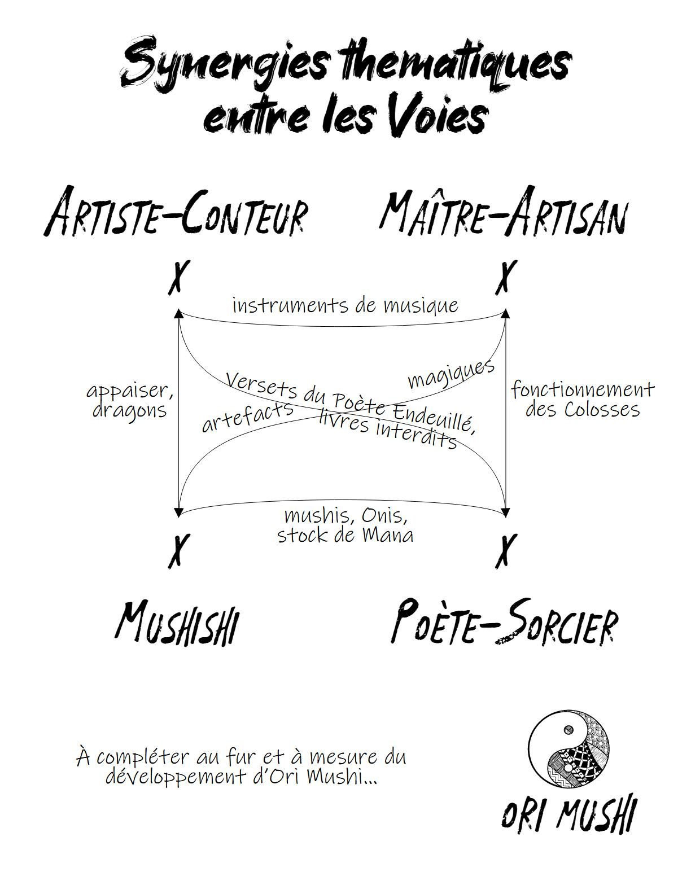

# OriMushi
# Guide du MJ

### Sommaire

 
<ul class="toc" data-tags="h2"></ul>

## Pourquoi ce guide ?
* pour accompagner le MJ, faciliter sa préparation de partie, lui donner des idées et partager des conseils
* pour expliquer les particularités de ce jeu de rôle, et comment pleinement retranscrire l'expérience de jeu imaginée pour Ori Mushi

## Contexte de jeu
Ori Mushi est imaginé pour des parties de 1h à 4h, avec un MJ et 2 à 5 joueurs,
pouvant être expérimentés en jeux de rôle ou totalement débutants.

Le jeu a été conçu avec deux manières principales d'y joueur en tête :
* des parties _one-shot_, par exemple lors de festivals ludiques, ou pour proposer une partie sur le pouce à des amis
* une succession d'une dizaine de parties avec un même groupe de joueurs, formant une **campagne** dont l'histoire trouvera une conclusion

Il est bien sûr aussi possible de jouer à Ori Mushi d'autres manières, en menant par exemple des campagnes plus courtes ou plus longues, ou avec seulement un joueur, voir six ou plus.
Ce guide se concentrera néamoins sur l'expérience de jeu principalement imaginée pour Ori Mushi.

### Parties _one-shot_

### Courte campagne

### Bac à sable VS linéarité
https://ptgptb.fr/linearite-contre-bac-a-sable

### Structure de la campagne
Les grandes idées structurantes :
* les komusō vont être des témoins de la "Grande Histoire", sans en être les héros.
Ils auront leur rôle à jouer, et pourront "faire la différence",
mais les véritables héroïnes sont des PNJs, qu'ils ne pourront qu'assister :
Mae, Oma, Rumiko (fille de Mokabé)...
* deux "coupures" vont séparer l'histoire en trois partie

#### Chapitre 1
Correspond aux 3 premières aventures / sessions de jeu.
Les komusō sont majoritairement au 1er pallier de leur Voie.

* **Les disparus du festival du printemps** : les komusō découvrent leur 1er mushi et réveillent un Colosse
    -> maps: ForestShrineFestival-Spring (& AsianRiceFarm ?)
* **Il faut protéger Bourg-Mistral**
    -> maps: MellowMarshlandMill & BirdfolkVillage & WarforgedTitanScrapyard (après chute du Colosse)
    + les PJs doivent empêcher le Colosse de piétiner la bourgade : la faire évacuer, et convaincre le bourgmestre ? Détourner le Colosse ?
    + les PJs rencontrent & sympathisent avec la Poètesse-Sorcière **Oma** au **Moulin Des Cigognes**
    + les PJS croisent un Oni enragé : **Sobek**, un bûcheron devenu berserk
    + les PJS découvrent la censure et les brûlots de l'Église de la Connaissance
*  **Les funérailles du daïmio**
    -> maps: CherryBlossomMonastery & WizardPrison (= Tour de l'Infini)
    + accompagner un PNJ qui sait qu'il va mourir (inspi 120 BPM) -> Mokabé
    + rencontre avec un dragon, Hakuryū
    + découverte de la Tour de l'Infini, qui possède de nombreuses portes (la plupart fermées), s'ouvrant dans de nombreux lieux des terres connues
    + les PJS rencontrent **Gilga**, sans savoir qui il est

#### Chapitre 2
Correspond à environ 3 aventures / sessions de jeu.
Les komusō sont majoritairement au 2e pallier de leur Voie.

+ les komusō sont déclarés hors-la-loi -> **ELLIPSE de plusieurs années**
    => phase de storytelling comme lors de la "session zero"
    => nouveaux Artefacts & nouvelles Compétences

+ découverte du Théâtre des Cieux, recouvert d'ahoratos (lichen rendant invisible)
+ un oeuf de dragon est confié aux PJs
+ Gilga

#### Chapitre 3
Correspond à environ 3 aventures / sessions de jeu.
Les komusō sont majoritairement au 3e pallier de leur Voie.

<!-- scénario inspiré du Moine Fou / He Pao ? -->

## Les joueurs

### Ne pas toujours jouer avec les même joueurs 
Comment faire, etc.

### Conseils pour la "session zéro"
* imprimez les _settings primers_ en double : Histoire & Géographie
* efforcez-vous d'employer les noms des PJs
* comment gérer les cas où deux joueurs incarnent des komusō sur la même Voie ?
  -> détailler la situation pour les 4 Voies

D'un point de vue ludique et narratif,
cette contrainte sur la nature du groupe des personnages des joueurs
offre plusieurs avantages :
* ils n'ont pas le choix de travailler ensemble.
* ils ont des objectifs communs, propices à générer de belles aventures.

## Système & mécaniques

<!-- Synergies thématiques entre les différentes Voies des komusō -->

### Jets de dés
Comment décrire un échec ? https://ptgptb.fr/l-art-d-arbitrer-9
-> ce n'est pas forcément le PJ qui a râté, il s'agit peut-être aussi des circonstances / contexte / environnement

> En pratique, cela implique que l’échec ne doit **jamais** ramener au statu quo. On ne veut pas forcément échouer en allant de l’avant , mais il est préférable que la résolution d’une action (échec ou succès) change la situation d’une manière ou d’une autre.

## Concevoir des scénarios
* Prévoyez-les plutôt **courts**, 2h à 3h de jeu maximum, quitte à les découper en plusieurs parties
* Introduisez dans chaque scénario une possibilité pour les PJs de progresser. Cela signifie inclure les éléments suivants :
    + un **bas-relief antique** ou un **livre interdit**
    + un **mushi**
    + une occasion de donner un **spectacle**
* Donnez des opportunités aux joueurs dans le sens de leurs **Motivations**
* Notez des **mot-clefs d'ambiance** pour chaque lieu

### Créer de l'adversité sans combats

### Jouer à Ori Mushi dans un autre univers
Peut-être aimeriez jouer dans votre univers favori ?

## Thématiques d'Ori Mushi
Cette section vise à donner quelques explications concernant les différents sujets

### Le genre Hopepunk

### Sciences & technologie
Dans Ori Mushi, les sciences & technologies interviennent à plusieurs niveaux :
* il s'agit du « cœur » de l'activité des Maître-Artisans, l'une des Voies proposées aux PJs
* les sciences sont l'activité principale des monastères & temples des terres connues, et sont présentées comme une activité « méditative » d'ermites bienveillants
* enfin, les sciences sont l'apanage de l'Église de la Connaissance, qui est une faction antagoniste

Mon intention était de montrer l'ambivalence des sciences & technologies,
et comment leurs usages n'étaient **pas intrinsèquement bons**,
mais totalement dépendant des intentions de ceux qui les promeuvent.

À ce sujet, voici un excellent livre que je vous recommande au sujet de la non-neutralité des sciences : [Les sciences, ça nous regarde](https://www.editionsladecouverte.fr/les_sciences_ca_nous_regarde-9782359250695), aux éditions La Découverte.

### Les livres

### La magie

## Resources
<!-- compiler une courte liste de liens sur comment mener, et la partager sur une page web avec QRCode ici -->
