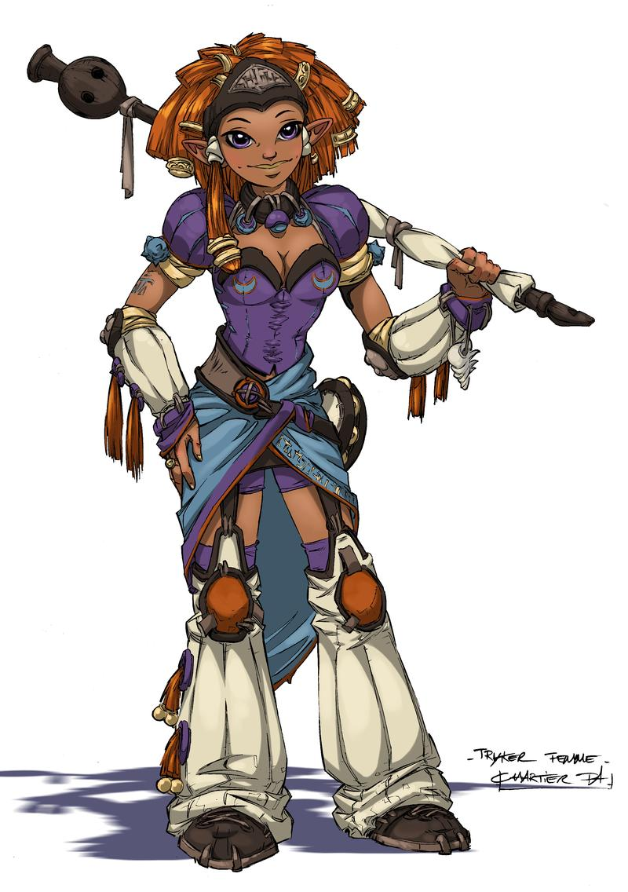
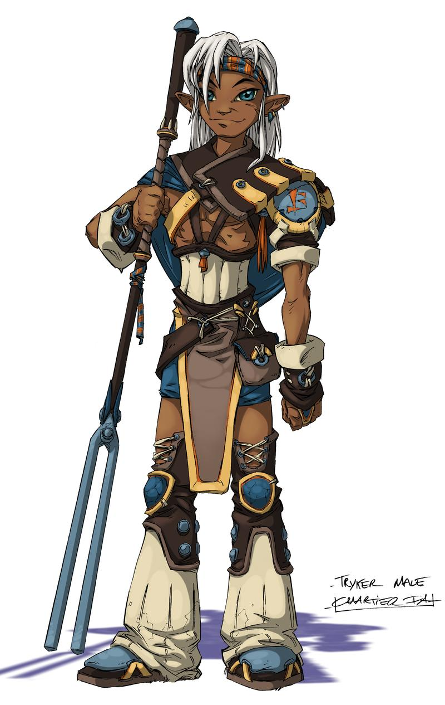

<!--
https://www.deviantart.com/fernand0fc/art/Shinobi-852741101 - [CC BY-NC 3.0](https://creativecommons.org/licenses/by-nc/3.0/)
https://www.deviantart.com/hunternif/art/Snake-807870839?src=MC_deviation_stack CC BY-NC-SA
https://www.deviantart.com/justsantiago/art/Fanart-74-Princess-Mononoke-717286034 CC BY-NC-SA
https://www.deviantart.com/hijodelopio/art/Shinobi-Saipat-878188581 - [CC BY 3.0](https://creativecommons.org/licenses/by/3.0/)
https://www.deviantart.com/hijodelopio/art/Lion-Swordsman-919054803 - [CC BY 3.0](https://creativecommons.org/licenses/by/3.0/)
https://www.deviantart.com/ignusdei/art/Sol-Invictus-Greatsword-716970312 CC BY-NC-SA
https://www.deviantart.com/ubergank/art/Ronin-812555564 CC BY-NC-SA
https://www.deviantart.com/ubergank/art/Kenku-814005528 CC BY-NC-SA
https://www.deviantart.com/misspendleton/art/Deer-Girl-846893377 CC BY-NC
https://www.deviantart.com/vachalenxeon/art/Chinese-creature-Dragon-eat-The-Sun-894746114 CC BY-NC-SA
https://www.deviantart.com/amgr99/art/Elias-Ainsworth-The-Ancient-Magus-Bride-791617132 CC BY-SA
-->

# Ori Mushi

:::: rules

Une aide de jeu pour le scénario d'initiation au jeu de rôle issu de ["Mener en 30min" par Kalwrynn](http://www.lulu.com/fr/fr/shop/kalwrynn/mener-en-30mn/ebook/product-24254652.html).

::: web-only
- Version PDF de ces règles: [ori-mushi-v0.2.zip _(10 pages, 5,5 Mo)_](https://github.com/Lucas-C/jdr/releases/download/ori-mushi-v0.2/ori-mushi-v0.2.zip)
:::

- Feuille de personnage : [OriMushi-FeuillePersonnage.pdf](OriMushi-FeuillePersonnage.pdf)

- Article de blog présentant la raison d'être d'Ori Mushi : [Faire découvrir le JdR](https://chezsoi.org/lucas/blog/faire-decouvrir-le-jdr-et-fete-du-jeu.html)

**Inspirations**: Okami, Ori & the blind forest, Mushishi, Usagi Yojimbo, Kung Fu Panda, princesse Mononoke, Naruto...

 

## Création de personnage en 5min
1. Choisissez votre apparence et **un objet spécial** (arme, objet magique...) parmi les illustrations,
ou inventez-les ! Les objets spéciaux sont des objets magiques ou que leur possesseur maîtrise avec virtuosité.
<!--
En cas de débat, le 1er joueur à choisir son illustration d'apparence sera le dernier à choisir son illustration de d'objet spécial, et vice-versa.
_Note:_ le cercle magique et le parchemin permettent tous deux de faire appel à de la **magie**.
Lorsqu'un joueur en choisit un, il doit définir le type de magie qu'il maîtrise.
Voici quelques exemples : le feu, la terre, le métal, l'eau, la foudre, le vent, la lumière,
la dissimulation dans l'ombre, le déplacement instantané, les illusions...
-->

2. Complétez sur votre feuille de personnage : **nom**, **activité** et sélectionnez **3 Traits** dans la liste.
Voici quelques suggestions d'activité si les joueurs manquent un peu d'inspiration :
apothicaire, conteur, Ronin (samouraï sans maître), marchant, Mushishi (dompteur d'esprits de la nature)...

L'**inventaire** de départ des personnages est complètement libre :
il s'agit de tous les objets qu'ils souhaiteraient transporter sur eux.
Ces objets n'étant pas _spéciaux_, ils n'octroient pas de dé supplémentaires lors des jets.

::: page-break
:::

## Système de jets de dés
1d6 minimum, **+1d6** par Trait et Objet Spécial applicables.
Selon le meilleur résultat obtenu aux dés :
  * ~~⚅~~ : c'est réussi !
  * ~~⚄~~ : c'est réussi **mais**...
  * ~~⚃~~ : c'est raté **mais**...
  * ~~⚂~~ / ~~⚁~~ / ~~⚀~~ : c'est raté

 

De plus :
* si deux ~~⚅~~ sont obtenus : c'est une **réussite parfaite / épique** ! <!--, **le joueur décrit la scène** -->
* si deux ~~⚀~~ sont obtenus : c'est un **échec critique**
* sur un ~~⚄~~ ou ~~⚃~~, le MJ peut également proposer un **dilemme** :
  le joueur se voit proposer un choix cornélien entre deux options exclusives.
  Son personnage peut par exemple obtenir quelque chose au prix d'un sacrifice,
  ou bien se rabattre sur une réussite partielle.
* actions conjointes : un personnage assistant un autre à réaliser une action lui octroie un dé bonus
* actions en opposition (inclus les affrontement) : un jet est effectué par personnage, celui obtenant le plus de ⚅ l'emporte. En cas d'égalité, on considère les ⚄. Si l'égalité persiste, aucun personnage n'a l'avantage.

Un inconvénient de ce système est que toutes les actions se valent en difficulté :
le MJ ne spécifie aucun seuil. Il peut néanmoins indiquer que certains actions audacieuses requièrent d'obtenir au moins deux ⚄/⚅.

## Éléments clefs à établir en début de partie
- « L'histoire se déroule dans un japon médiéval imaginaire. Il existe de la magie et des monstres. »
- Le meneur de jeu demandera des jets aux joueurs pour les actions risquées de leurs personnages.
- Les joueurs se connaissent déjà et voyagent ensemble, et c'est d'ailleurs leur objectif commun : explorer le monde !
Ils ont déjà traversé de nombreuses contrées et aidé bien des gens.

::: page-break
:::

## Scène 0 - Course poursuite !
Bien que cela rallonge légèrement la durée de la partie, je trouve très judicieuse l'idée de Kalwrynn de commencer _in media res_.

Je vous suggère donc de commencer la partie en décrivant rapidement un joli décor de chemin de terre sinuant
parmi les champs et les herbes folles, par une paisible après-midi printanière, au pied d'une montagne...
Où les personnages des joueurs descendent le chemin en pente à perdre haleine,
poursuivis par un troll-kappa dont ils ont piétinés le jardin par mégarde !
Cette créature, sorte de taupe humanoïde avec un bec, est fâchée et pas du tout disposée à discuter !

Décrivez aux joueurs les environs pour leurs donner quelques idées d’échappatoire :
l'orée de la forêt de bambous, la descente un peu raide vers un lac, les hautes herbes balayées par le vent...

Au terme de cette scène, les joueurs doivent rejoindre le village, par le chemin ou le lac,
quitte à faire une ellipse ou à indiquer qu'il s'agit de l'étape suivante de leur voyage,
où on leur a vanté une recette locale de poisson frit...

## Progression / expérience
Si vous voulez poursuivre la partie au delà du scénario d'introduction,
récompensez les joueurs au terme de chaque aventure terminée
en leur accordant un nouveau Trait, qui peut être inventé (avec l'accord du meneur de jeu),
ou un nouvel Objet Spécial.

## Illustrations
S'inspirant de [Sventovia](http://legrumph.org/Terrier/?Jeux-de-role/Sventovia) du Grümph,
nous vous encourageons à imprimer des éléments au préalable, pour faciliter l'immersion des joueurs :
des illustrations de personnages et ce dont ils peuvent s'équiper (armes & objets).

Vous trouverez dans ce PDF 10 illustrations de personnages des joueurs,
une du doyen du village, une du troll-kappa, 8 de différents objets spéciaux, et enfin une illustration de l'esprit-dragon :
[OriMushi-illustrations.pdf _(? pages, ? Mo)_](https://lucas-c.github.io/jdr/OriMushi/OriMushi-illustrations.pdf)
::::

:::: illus
<!-- PJs -->

::: page-break
:::

::: page-break
:::

<!-- PNJs -->

::: page-break
:::

<!-- Objets spéciaux -->

.png)

::: page-break
:::

::: page-break
:::

::::

:::: rules
::: page-break
:::
<!-- Section moved to dedicated PDF file - included disabled with an extraneous space
::: web-only
<h2>Feuille de personnage</h2>
! !!include(OriMushi-FeuillePersonnage.html)!!!
:::
-->

## Licence, sources & remerciements

Cette aide de jeu _Ori Mushi_ a été conçue par [Lucas Cimon](https://chezsoi.org/lucas/blog/) en février 2020.
Elle est placée sous license <a rel="license" href="http://creativecommons.org/licenses/by/4.0/">Creative Commons Attribution 4.0 International</a>.

Cette aide de jeu est diffusée à prix libre.
Si vous souhaitez soutenir mes projets, vous pouvez me faire un don sur [lucas-c.itch.io](https://lucas-c.itch.io).
Les fichiers sources ayant permis de générer ce PDF sont disponibles [sur GitHub](https://github.com/Lucas-C/jdr/tree/master/OriMushi).

Je serais ravi d'avoir vos retours sur cette aide de jeu si vous l'employez.
Racontez-moi comment s'est passée votre partie via un commentaire [lucas-c.itch.io](https://lucas-c.itch.io) ou sur [mon blog](https://chezsoi.org/lucas/blog/pages/jeux-de-role.html).

Merci enfin aux développeurs des [logiciels libres](https://fr.wikipedia.org/wiki/Free/Libre_Open_Source_Software) employés pour réaliser cette aide de jeu&nbsp;: [le navigateur Firefox](https://www.mozilla.org/fr/firefox/), [le logiciel de dessin Gimp](https://www.gimp.org/), [l'éditeur de texte Notepad++](https://notepad-plus-plus.org/), [le lecteur de PDF Sumatra PDF](https://www.sumatrapdfreader.org), [le language de programmation Python](https://www.python.org/), les bibliothèques de code [markdown-it](https://github.com/markdown-it/markdown-it) & [Puppeteer](https://pptr.dev/).

 

::: thanks
Illustrations :
- [Journey to the West par TysonTan](https://www.deviantart.com/tysontan/art/Journey-to-the-West-546516151) - [CC BY-SA 3.0](https://creativecommons.org/licenses/by-sa/3.0/)
- [Noh Demon par weremagnus](https://www.deviantart.com/weremagnus/art/Noh-Demon-39665536) - [CC BY-NC 3.0](https://creativecommons.org/licenses/by-nc/3.0/)

Personnages des joueurs :
- [Pirate Ninja @ publicdomainvectors.org](https://publicdomainvectors.org/en/free-clipart/Pirate-ninja/42753.html)
- [Quick samurai sketch par hidanbasher](https://www.deviantart.com/hidanbasher/art/Quick-samurai-sketch-566443259) - [CC BY 3.0](https://creativecommons.org/licenses/by/3.0/)
- [Human 4 par Jeff Preston](http://team-preston.com), issu de [108 Terrible Character Portraits](https://www.drivethrurpg.com/product/91360/108-Terrible-Character-Portraits) - [CC BY 3.0](https://creativecommons.org/licenses/by/3.0/)
- [Tryker femme](https://www.flickr.com/photos/ryzom/14746505003/in/album-72157645935788203/) & [Tryker homme](https://www.flickr.com/photos/ryzom/14726336322/in/album-72157645935788203/) - Ryzom - [CC BY-SA 2.0](https://creativecommons.org/licenses/by-sa/2.0/)
- [Breeze in the Forest par TysonTan](https://www.deviantart.com/tysontan/art/Breeze-in-the-Forest-328337136) - [CC BY-SA 3.0](https://creativecommons.org/licenses/by-sa/3.0/)
- [Alopex redesign concept par BEEvirus](https://www.deviantart.com/beevirus/art/Alopex-redesign-concept-489897297) - [CC BY-NC-SA 3.0](https://creativecommons.org/licenses/by-nc-sa/3.0/)
- [Human Alopex par BEEvirus](https://www.deviantart.com/beevirus/art/Human-Alopex-534980266) - [CC BY-NC-SA 3.0](https://creativecommons.org/licenses/by-nc-sa/3.0/)
- [Kitty Anime Poilu Bleu](https://pixabay.com/illustrations/kitty-anime-furry-blue-cat-robe-1374728/) & [Elf Druide Fantaisie](https://pixabay.com/illustrations/elf-druid-fantasy-fantasy-character-2044697/) @ pixabay.com
<!--
https://freesvg.org/female-warrior
https://pixabay.com/fr/vectors/geisha-japon-femme-jeune-fille-156791/
-->

Personnages non joueurs :
- [Dakuan Ninja Scroll par DaudioMultimedia](https://www.deviantart.com/daudiomultimedia/art/Dakuan-Ninja-Scroll-784761566) - [CC BY-NC 3.0](https://creativecommons.org/licenses/by-nc/3.0/)
- [Manimal 3 par Jeff Preston](http://team-preston.com), issu de [108 Terrible Character Portraits](https://www.drivethrurpg.com/product/91360/108-Terrible-Character-Portraits) - [CC BY 3.0](https://creativecommons.org/licenses/by/3.0/)
- [Woodland dragon par flaming-anubis](https://www.deviantart.com/flaming-anubis/art/Woodland-Dragon-461654140) - [CC BY-SA 3.0](https://creativecommons.org/licenses/by-sa/3.0/)
<!--
- Grimstroke : https://www.deviantart.com/halycon450/art/Grimstroke-795368588
- Samebito : https://www.deviantart.com/weremagnus/art/Samebito-60875338
-->

Les objets :
- [magic circle 2 par NNao](https://www.deviantart.com/nnao/art/magic-circle-2-216221240) - [CC BY-NC-SA 3.0](https://creativecommons.org/licenses/by-nc-sa/3.0/)
- [Western kit par Fernand0FC](https://www.deviantart.com/fernand0fc/art/Western-kit-815688465) - [CC BY 3.0](https://creativecommons.org/licenses/by/3.0/)
- [Grapling hook par Pearson Scott Foresman](https://commons.wikimedia.org/wiki/File:Grappling_hook_2_(PSF).png) - domaine public
- [Katanas par Halibutt](https://commons.wikimedia.org/wiki/File:Katanas.svg) - [CC BY 3.0](https://creativecommons.org/licenses/by/3.0/)
- [Ombrelle @ pxhere.com](https://pxhere.com/en/photo/700898) - CC0
- [Armored 3 par Jeff Preston](http://team-preston.com), issu de [108 Terrible Character Portraits](https://www.drivethrurpg.com/product/91360/108-Terrible-Character-Portraits) - [CC BY 3.0](https://creativecommons.org/licenses/by/3.0/)
- [Asian fan with a map](https://freesvg.org/asian-fan-with-a-map-vector-image) & [Red Chinese scroll](https://freesvg.org/red-chinese-scroll) @ freesvg.org - domaine public
- [Shuriken Throwing Ninja Star @ pixabay.com](https://pixabay.com/fr/vectors/shuriken-lancer-des-%C3%A9toiles-153172/)
- [Bow and arrow vector drawing @ publicdomainvectors.org](https://publicdomainvectors.org/en/free-clipart/Bow-and-arrow-vector-drawing/74403.html) - domaine public

Pour la feuille de personnage :
- [Chinese New Year Folk Ornament](https://freesvg.org/chinese-new-year-folk-ornament), [Decorative Ying Yang sign](https://freesvg.org/vector-clip-art-of-decorative-ying-yang-sign) & [Dragon frame](https://freesvg.org/dragon-frame-vector-image) @ freesvg.org - domaine public

Polices : [Odachi](https://www.behance.net/gallery/59783897/Odachi-Free-Brush-Font)
& [Xangda Shiny](https://www.fontspace.com/starinkbrush/xangda-shiny)
:::
::::

<!--
- https://pixabay.com/illustrations/sumi-sumi-e-watercolor-china-1595365/
- https://www.needpix.com/photo/355732/sumi-e-sumie-black-ink-east-zen-ink-painting-ink-style-painting-fish
- https://www.publicdomainpictures.net/en/view-image.php?image=50977&picture=japanese-wave-wallpaper-background
- https://freesvg.org/gingko-leaf-c
- https://www.seekpng.com/ipng/u2q8a9q8r5q8w7i1_this-free-icons-png-design-of-tribal-dragon/
- http://www.publicdomainfiles.com/show_file.php?id=13947264627221
- https://www.needpix.com/photo/22796/braids-rope-hair-celtic-border-knot-shape-decorative-pretty

Google-fu attempts:
(samurai|ninja) &
    animal
    (weapon|sword|shuriken|equipment)
    (shadow|ghost|sneak)
    magic sword
(forest|woodland) dragon
magic circle
mushishi
(bushido|Mark of the Ninja|Ninja Gaiden|Onimusha|Samurai Shodown|Sekiro|Shinobi|Tekken)
sumi-e
kimono (sorceress|witch)
site:https://openclipart.org ("Asian"|"dragon")

Chouettes illus non-CC :

- https://www.subpng.com/png-8ms47f/
- https://www.subpng.com/png-qmonos/
- https://www.subpng.com/png-yz30hj/
- https://www.subpng.com/png-v26e85/
- https://www.subpng.com/png-quktd9/
- https://www.subpng.com/png-trqpwq/
- https://www.subpng.com/png-7vbed1/
- https://www.subpng.com/png-ga6y8n/
- https://www.subpng.com/png-ghd9ci/
- https://www.subpng.com/png-lu8s9j/
-->

::: version
{{version}}
:::

