<!-- En vrac:

* me mettre un rappel 15 jours avant chaque partie de "boucler" les inscriptions
* retrouver feuille idées de sources d'inspi -> ajouter livres jdr & ptgptb

Next :

* établir une trame principale de campagne et la découper en scénarios
* développer le Peuple Éteint et préparer leur rencontre avec PJs
* designer paliers 2/3 des Voies
    -> ajouter compteur de progression d'Oris avec cases à cocher
    -> anticiper changement de palier (Laure déjà) & ellipse à la prochaine partie
* développer la transformation en Oni, suite à une succession de CHOIX NARRATIFS ?
    Idées : se laisser "parasiter" par ce Mushi; peut être une option de Voie; ...
    -> Voie dédiée
* développer la mécanique des masques
* rédiger paragraphe sur la mécanique des Liens :
    + +1d6 lors d'une action pour aider / contre le personnage concerné
    + comment établir de nouveaux Liens et en dénouer d'autres ?
    + limiter les liens entre PJs ? (pour éviter les abus)
* SUPPRIMER formats de narration partagée multiple, garder seulement le Questions-Réponses
  => introduire une mécanique de "filler" pour définir ce que faisaient les personnages absents pendants les parties où ils étaient absents
* finir Noms-japonais.md
* remplacer Oris/XPs par étapes à atteindre dans les Voies ?
    Pourquoi: rend la progression + narrative, car forcément liée à des actions précises.
              évite le côté "subjectif" de la distribution des Oris sur des critères arbitraires,
                comme "suivre les Vœux", "mettre en avant ses Liens & ...", etc.
    Au profit d'une mécanique où Onis = jetons partagés, obtenus sur un échec critique, permettant d'augmenter de deux points le résultat d'un lancer de dés
    (+ permettent également de rejouer des scènes de roleplay ?)
* feuille de Secrets révélés, avec les réponses des joueurs
    1. Le sillage des Colosses est pavé de plantes légendaires dont il permet la pousse par son chant
  => compléter Secrets & Questions-Réponses
* rédiger section à propose des voyages : durée, ellipses, etc.
    => les komusō hichhike, et donc c'est chaque fois l'opportunité d'une rencontre
* rédiger section à propose de la santé / blessures / mort
* prévoir des feuilles de PNJs, avec une zone où le MJ peut prendre des notes
* sections "Ce que savent les komuso sur..."
* orga parties : proposer à Donatien / Naïg / Cédric...
* employer jinja2 pour définir des templates de PNJ :
    + ses Objectifs
    + son Attitude + guide de Roleplay
    + en cas d'alliance avec les PJs : comment il peut les aider / ce qu'il peut leur fournir
    + en cas de conflit avec les PJs...
    + liens avec autres PNJS
* Codex Mushi : inclure des zones de dessin ?
* extract Hexxus clips from *Ferngully*.webm (last Ns from "Toxic Love")

Villes:
* https://www.pathfinder-fr.org/Wiki/Pathfinder-RPG.Villes.ashx
* https://ptgptb.fr/urbanisme

Classification mushis :
* https://www.steamgalaxy.com/design-your-own-game/
* https://mushishi.fandom.com/wiki/Category:Mushi

Mise en page :
- trouver un symbole pour les Oris
- ajouter des petits pictos à chaque scénario:aventure, indiquant ce qui peut y être collecté : Mushis / Onis / Colosses / etc.
- Ajouter de jolis ornements en header/footer de pages
    Chinese landscape painting: https://github.com/LingDong-/shan-shui-inf
    https://github.com/watabou/CompassOS
    https://github.com/emmiegit/canji : procedural kanji generator (Python)
    and/or https://github.com/AdrianMargel/glyphs
    https://github.com/CiaccoDavide/Alchemy-Circles-Generator
    or https://github.com/AdrianMargel/alchemy-circles
    or https://game-dev-goose.itch.io/magic-circle-generator ($20)
- Expliquer en détail le fonctionnement des cases à cocher de la FP / les étapes de la créa de PJ
- formatter les règles (jets + tables) en une seule page A4
- SpellCheck
- Illustrations.pdf : add section titles + more images of equipments & places
- Remplacer Odachi par typo / font plus adaptée / lisible pour dyslexiques ?
- Ajouter des boutons dans les scénarios pour lire des morceaux de musique ?

Com'
* transformer https://lucas-c.github.io/jdr/OriMushi/ en un "hub" promouvant un kit de découvert et la version papier
* exposer une 2e page web référencée dans le livre, avec tous les liens vers les ressources PDFs du jeu
* https://www.reddit.com/r/Mushishi
* contacter Gulix pour review / partie test ?
* site web : nuages d'estampe à écarter au curseur

Extensions / développement du jeu au-delà du "livre de base" :
* illustrations grand format téléchargeables réalisées par Elliot, pour illustrer des scénarios, et les fournir aux joueurs
* scénarios supplémentaires / "saison 2"

Lien PDF de la Feuille de perso = générateur Python avec questions "masks" random

Refs for illus hand-drawn-asian-style-tattoo-illustration*.jpg :
<a href="https://www.freepik.com/free-vector/hand-drawn-asian-style-tattoo-illustration_79302251.htm#fromView=keyword&page=1&position=19&uuid=8d653419-e11f-4883-a72c-8510e20dab2e&query=Japanese+Retro">Image by pikisuperstar on Freepik</a>

Illustrations not free:
* https://www.deviantart.com/niloadoptables/art/open-Ai-Adoptable-5366-1139413431 - girl - 8$
* https://www.instagram.com/maruti_bitamin

À lire : Mener des parties de jeu de rôle -> Fiches-de-synthese-A4.pdf
* [x] Créer un scénario, page 31
* [ ] Enseigner un jeu, page 93
* [ ] Incarner des PNJ, page 141 & https://ptgptb.fr/interpreter-les-traits-distinctifs-des-pnj
* [ ] Dompter la linéarité, page 159
* [ ] Partager la narration, page 381
-->

# Ori Mushi

::::: rules
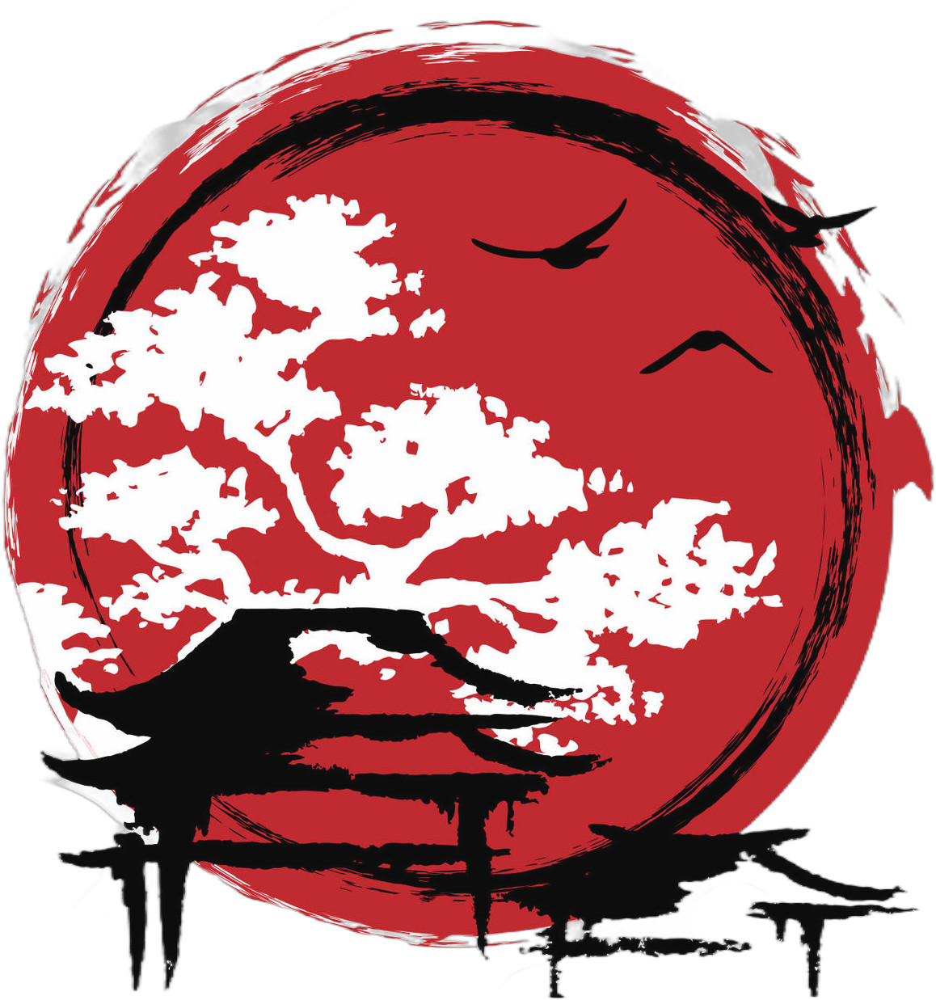

 

Un jeu de rôle _hopepunk_ dans un univers de _fantasy_ inspiré du japon médiéval,
où les joueurs incarnent des komusō, ayant fait vœu d'aider la population,
et où des créatures nommées _mushis_ ont donné naissance à la magie.

**Inspirations**: Mushishi, Le château dans le ciel, Shadow of the Colossus, Avatar le maître de l'air, Naruto, Princesse Mononoké, Le Voyage de Chihiro, Zelda...

::: web-only
- Version PDF de ces règles: [OriMushi.pdf _(19 pages, 4,4 Mo)_](OriMushi.pdf)
:::

- Feuille de komusō : [FeuillePersonnage.pdf](OriMushi-FeuillePersonnage.pdf)
- Aides de jeu :
    + [GuideDuMJ.pdf](GuideDuMJ.pdf)
    + [OriMushi-VoiesDesPersonnages.pdf](character-sheets/OriMushi-VoiesDesPersonnages.pdf)
    + [OriMushi-LivretDAventures.pdf](character-sheets/OriMushi-LivretDAventures.pdf)
    + [TableDesLiensEntrePersonnages.pdf](TableDesLiensEntrePersonnages.pdf)
    + [VoeuxDesKomuso.pdf](layout/OriMushi-VoeuxDesKomuso.pdf)
    + [MJ-Recap-Komusos.pdf](MJ-Recap-Komusos.pdf)
    + [Noms-japonais.pdf](Noms-japonais.pdf)
    + [Illustrations.pdf _(16 pages, 40 Mo)_](OriMushi-illustrations.pdf)
<!-- Plus à jour :
    + [GameLoop.jpg](layout/GameLoop.jpg)
-->
- Feuille de komusō pour partie de 30min : [FeuillePersonnageExpress.pdf](character-sheets/OriMushi-FeuillePersonnageExpress.pdf)
- Articles sur mon blog à propos de ce jeu : [tag ori-mushi @ chezsoi.org](https://chezsoi.org/lucas/blog/tag/ori-mushi.html)

::: page-break
:::

### Sommaire

 
<ul class="toc" data-tags="h2"></ul>

::: page-break
:::

## Les terres connues
Le monde d'Ori Mushi est une forme de **Japon médiéval avec des éléments fantastiques** :
* la **magie** existe, elle opère par la parole, et est enseignée à travers différents **Vocables**.
L'énergie magique provient du **Mana**, provenant des **mushis**, des créatures élémentaires invisibles...
* tout individu possède un potentiel malveillant enfoui, un **Oni**, qui peut s'éveiller, le dévorer et le transformer en **démon**.
* les **komusō** sont un ordre respecté dans toutes les terres connues.

Les terres connues comportent encore de nombreuses traces des **Temps Antiques**,
une ère dont les légendes sont encore très présentes dans les esprits,
inspirée des mythes greco-romains et égyptiens.

## Histoire
#### Les temps antiques
Il y a environ mille ans : <!-- Inspi : Dark Souls opening https://www.youtube.com/watch?v=e0l73vAlEBQ -->
* les **dragons** veillent sur le monde et guident les empereurs.
* cette époque voit les plus grandes merveilles être conçues :
la **Cité aux Mille Pages**, une véritable ville-bibliothèque; le **Théâtre des Cieux** de l'artisan-ingénieur **Vitruve**, immense et mobile; la **Tour de l'Infini**...
* la **Sculpteuse** conçoit initiallement les **Colosses** pour qu'ils déclament à travers les terres connues les Versets du **Poète Endeuillé**.
* fondation de l'ordre des **komusō**.
#### La Guerre de l'Oubli
Il y a environ un siècle :
* une armée de **Onis**, des démons, ravage les terres connues, menés par l'empereur fou, **Enkidu**.
Ils massacrent les dragons, ainsi que tout un peuple : le **peuple éteint**.
Les grandes merveilles disparaissent.
* les premiers **Poètes-Sorciers** maîtrisent la magie du **Verbe**, et transmettent leurs Vocables pour lutter contre les Onis.
* les **Onis** sont finalement vaincus. Certains disent grâce à un enfant, **Gilga**, qui commandait aux Colosses. D'autres racontent qu'ils ont été enchaînés dans les cœurs des hommes.
#### Récemment
Ces dernières années :
* une épidémie se répand, le **Fléau Impassible**, qui pétrifie progressivement les malades
* **Hisaishi Inoue**, capitaine en chef des bateliers.
* **Oma la Cueilleuse de Mots**, une Poètesse-Sorcière, a été élue par les forestiers pour remplacer le précédent empereur des Basses Plaines. Elle siège au conseil des sages de la ville de Nippur.
* l'**Empereur des Hauts Plateaux** est mort, de tristesse à ce qu'on raconte, sans descendance. 

::: page-break
:::

## Géographie & peuples
Ces lieux & régions sont des points de repère essentiels dans les terres connues :
* les **Basses Plaines** : région de vallées verdoyantes et de nombreuses rivières. Deux peuples y cohabitent : les **forestiers**, qui mènent une vie sédentaire rurale; et les **bateliers**, nomades dont les escadres de chars à voile se déplacent aussi bien dans les plaines herbeuses que sur la mer.
* les **Hauts Plateaux** : région montagneuse, découpée en de multiples provinces. L'**Église de la Connaissance** y est très influente, promouvant un progrès scientifique et industriel.
* **Uruk** est la plus grand ville des Hauts Plateaux, capitale du Pays de la Mer. D'immenses industries s'y sont installées le long de ses immenses falaises.
* **Bilgamesh** est un Colosse encore actif, un géant humanoïde qui arpente les Basses Plaines. Une épreuve de courage des bateliers est de l'escalader.
* de nombreux **temples** et **monastères** parsèment les terres connues. Parfois très anciens, ils ont été érigés pour vénérer des divinités shintoïstes. La plupart sont aujourd'hui devenus des lieux dédiés aux Sciences, où diverses écoles de **Moines-Scientifiques** s'isolent pour approfondir leurs théories, dans des domaines aussi variés que l'astronomie, la botanique, la philosophie, les mathématiques... La majorité sont affiliés à l'Église de la Connaissance, mais pas toutes.

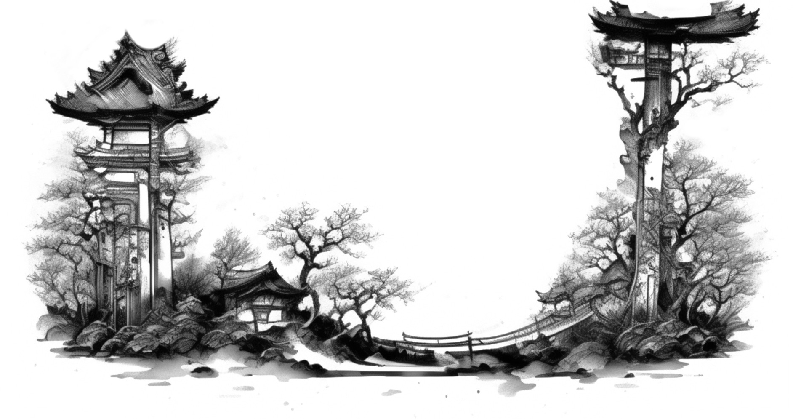

Les terres connues ne sont volontairement **pas** décrites en détails afin de :
* vous permettre, MJ & joueurs, de les détailler par petites touches, au fur et à mesure de vos parties.
* d'inclure toutes les références que vous souhaitez à des univers de fiction existants, qu'il s'agisse de lieux, de personnages, d'organisations...

{{ rand_plant() }}

::: page-break
:::

## Mushis
Un **mushi** est un organisme vivant **invisible** aux yeux des humains.
Il en existe de différentes espèces, et ils tissent des liens essentiels avec les autres êtres vivants, de manière **symbiotique** : tantôt sources de nourriture, tantôt protecteurs de plantes et d'animaux.

Les mushis ne semblent pas doués de conscience.
Ils ne sont ni mauvais ni bienveillants, mais contribuent
à l'équilibre des environnements naturels où l'homme est absent.

Bien qu'invisibles, leurs morphologies sont tantôt semblables à des plantes, à des insectes, à de petits oiseaux, ou à des champignons.

Les mushis produisent naturellement du **Mana**, l'énergie permettant la magie.
La plupart réagissent à **la musique**, aux métaux **argentés**, et à **la lune** :
certains se reproduisent en émettant des **spores** durant les nuits de pleine lune.
où ils convergent et se réunissent en masse à certains endroits mystérieux.
On appelle cela un **banquet des mushis**.

 

_Mot-clefs : invisible, étrange, nature, symbiose, fragile, paisible, surnaturel_

 
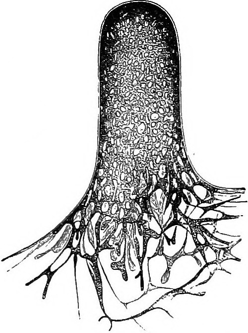

### Codex mushi
Les joueurs dans le groupe qui jouent des Mushishis se voient remettre une feuille de **Codex mushi vierge**.
S'il y a deux Mushishis, chacun reçoit un Codex vide, et les joueurs se répartissent les six familles entre eux, afin de se spécialiser chacun dans trois d'entre elles.
Si le groupe ne comporte aucun Mushishi, alors la tenue du codex est à la charge de l'ensemble des joueurs.

Le MJ dispose également du **Codex mushi complet**,
contenant les détails de tous les mushis connus.
Le MJ est également libre d'en imaginer d'autres.
Les Mushishis en inventent eux-même de nouveaux à la seconde phase de leur Voie.

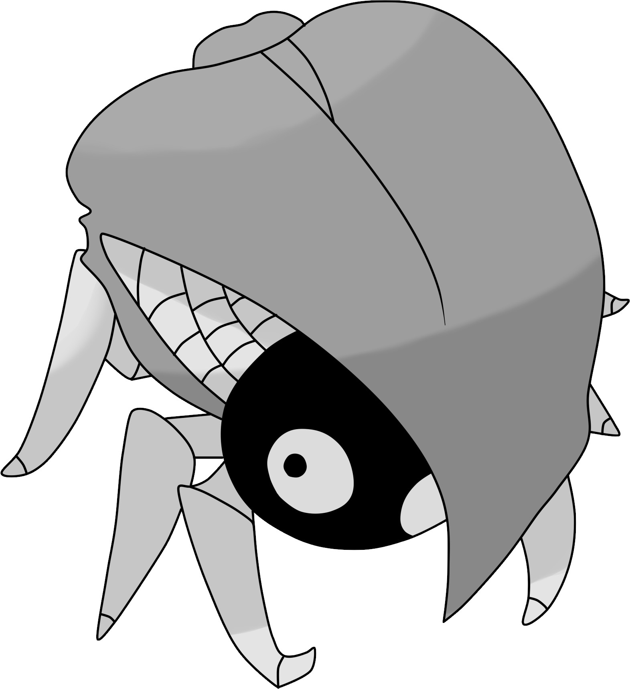

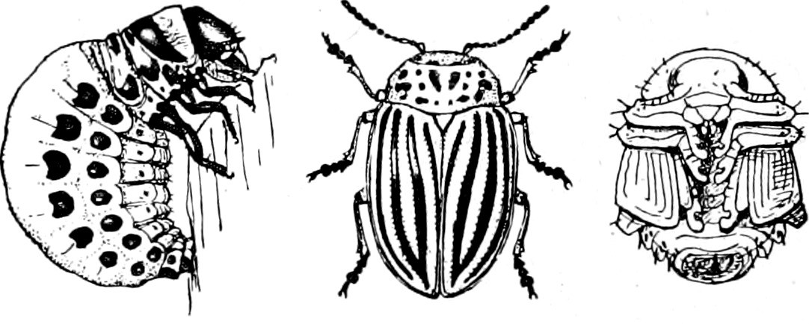

## Onis
Dans les terres connues, tout individu possède un démon intérieur, un **Oni**.
Ce Oni se nourrit de colère, de frustration, de peurs.

Chez la plupart des gens, ce Oni reste en sommeil et ne se développe jamais.

À l'inverse, certains individus choisissent de nourrir ce Oni,
pour obtenir en échange une grande puissance.
Cette voie mène néanmoins à une transformation en un véritable **démon**.

 

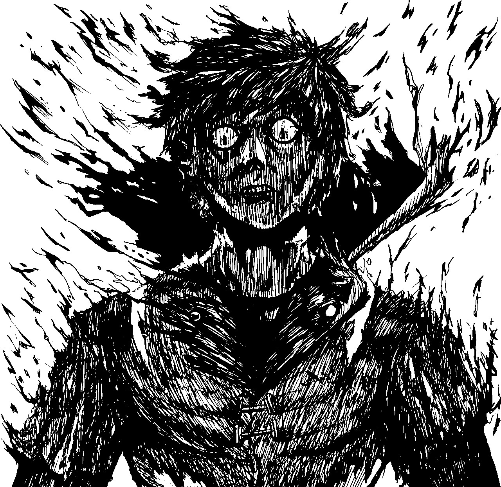

_Mot-clefs : enragé, hurlement, bestial, monstre, terrifiant, agressif, sidérant, danger_

### Que sont les Onis ?
Des humains ayant accepté d'accueillir en eux un Mushi parasitique.

Ce Mushi leur confère une force surhumaine, ainsi qu'une impulsivité colérique terrible.

 
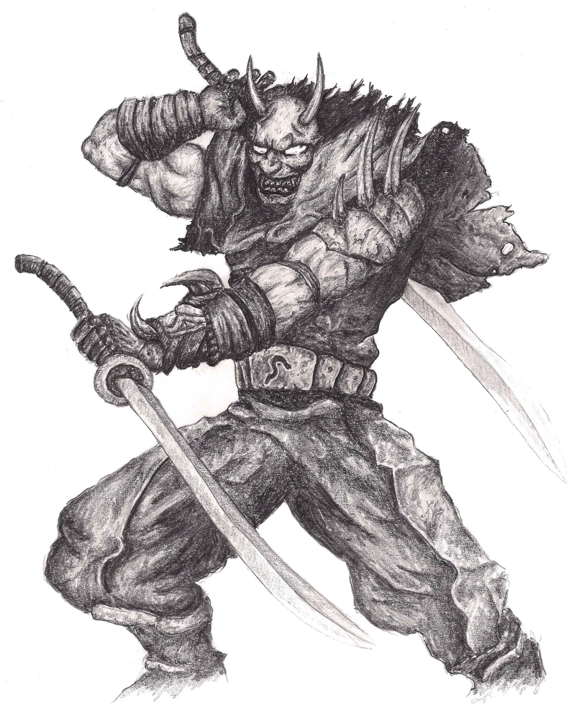

### Comment se comportent les Onis ?
Ils ont souvent choisi d'accueillir le Mushi pour obtenir quelque chose en échange :
se venger, battre quelqu'un, prendre le pouvoir...

Parfois, ils obtiennent ce qu'ils souhaitaient et en sont satisfaits,
devenant des monstres cruels s'assumant pleinement.

Parfois, ils sont en conflit intérieur, n'assumant pas les actes qu'ils ont commis sous l'impulsion du Mushi.

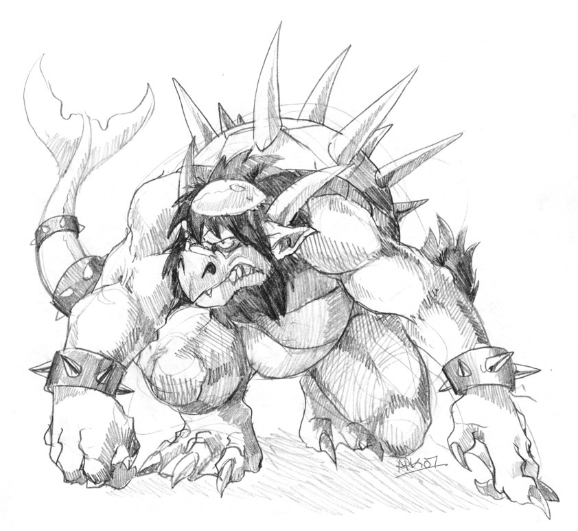

### Comment devient-on Oni ?
* des livres détaillent où se rendre, et en quelle saison, pour trouver des fruits de ce mushi, et les ingérer pour devenir Oni
* Gilga propose à ses fidèles de devenir des Onis

### Peut-on "soigner" un Oni ?
Une fois le Mushi accueilli en soi, il n'existe que deux solutions pour ne pas être consumé par lui :
* le transmettre à un autre humain volontaire
* l'apprivoiser -> inspi manga Parasite ?

::: page-break
:::

## Colosses
<!-- Également nommés **dogū** -->
Ce sont de gigantesques et mystérieux géants de pierre, en partie scultpés.
Certains sont endormis, d'autres errent, répétant des gestes ou des trajets dont le sens s'est perdu à travers les âges...

Peu de choses sont connues sur ces statues géantes.
Ils réagissent à la **musique**, en général en l'écoutant,
et parfois en répondant par un chant plaintif.

Les Colosses inertes, que plus rien n'anime, semblent être un lieu de prédilection des mushis.

Certains bas-reliefs de temples antiques, ou sur les Colosses eux-mêmes,
mentionnent leur lien avec un énigmatique **Poète Endeuillé**.

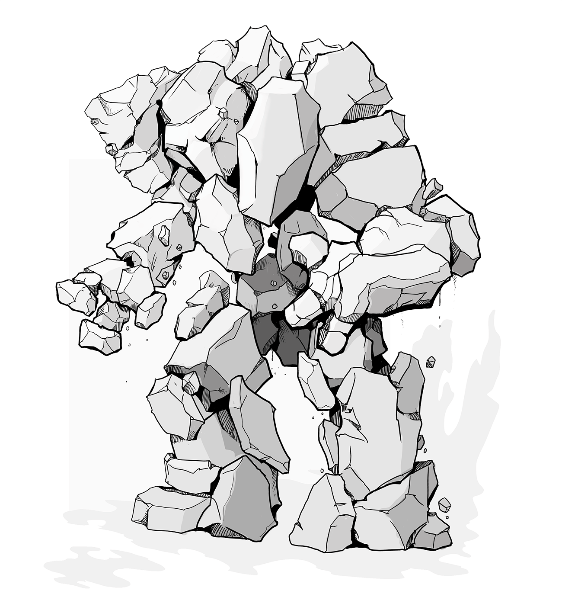

<!-- SOTC Colossus reveals:
1. https://youtu.be/U8rn9BZXaKY?t=885
2. https://youtu.be/U8rn9BZXaKY?t=1185
3. https://youtu.be/U8rn9BZXaKY?t=1438
4. https://youtu.be/U8rn9BZXaKY?t=1716
5. https://youtu.be/U8rn9BZXaKY?t=2005
-->

De nombreuses légendes circulent à leur sujet.
Certains disent en avoir vu s'affronter.
D'autres racontent avoir vu un Colosse entretenir un jardin de fleurs.

_Mot-clefs : gigantesque, lent, inarrêtable, massif, antique, minéral, lourd, tremblement, errance_

::: page-break
:::

## Factions
### Les Prêtres du Vide
C'est le nom de **l'organisation des moines komusō** :
* c'est une très ancienne communauté, issue d'une guilde d'artistes errants qui s'est petit à petit structurée en institution, en diversifiant les savoir-faire de ses membres et en établissant un code moral propre autour des Cinq Vœux des komusō
* les Prêtres du Vide développent parfois une certaine spiritualité, mais il ne s'agit pas d'une religion. Il n'organisent pas de culte, ni ne vénèrent de déités précises.
* en tant qu'organisation, les activités principales des Prêtres du Vide sont :
    + le développements des arts et la diffusion de spectacles
    + la formation et la transmission de savoir-faire
    + l'entraide et la solidarité, fournie directement par komusō durant leur service à la population
* l'institution comporte deux niveaux de membres : les **komusō**, qui en font partie temporairement le temps de réaliser un "service civique itinérant", en honorant les Cinq Vœux des komusō; et les **daïmios**, des moines ayant choisi de devenir des artistes-sages permanents. L'ensemble de l'organisation est dirigée par le **Cénacle**, un groupe de daïmios élus par leurs pairs.

### L'Église de la Connaissance
Cette influente institution promeut **le progrès scientifique et industriel**.

Cette organisation partage certaines caractéristiques d'une religion :
* le progrès technologique est **sacralisé**, mis en exergue comme la salut de l'humanité, et ses partisans exhortent à avoir **foi** en la Science et la grande Révolution Industrielle qui se déploie.
* la spiritualité et la magie sont **bannies** comme des absurdités barbares. Les **livres** qui y font référence sont **brûlés**.
* il n'y a pas de texte sacré, mais les **écrits scientifiques** sont portés aux nues, et célébrés comme les trésors les plus précieux de l'humanité.

Cette instution constitue un réseau très bien organisé :
* différents **lieux** lui sont dédiés, en ville comme dans des lieux reculés : **temples et monastères** qui sont autant d'instituts de recherche, mais aussi **usines de production** et carrières d'extraction de ressources
* une **hierarchie de scientifiques** dirige cette église : **barons et capitaines d'industrie**, **cardinal d'université**, **évêques-ingénieurs**...
* l'église encourage les **bonnes œuvres**, et structure plusieurs initiatives de bienfaisance sociale : aumône, aide alimentaire aux plus démunis, hébergement d'urgence, médecine gratuite, etc.

L'Église de la Connaissance a de nombreux détracteurs, qui lui reprochent notamment
sa censure proche d'une Inquisition;
la réalisation d'**expérimentations sur les défavorisés** qui bénéficient de ses bonnes œuvres;
la **destruction d'environnements et la pollution** qu'entraînent les industries intensives qu'elle promeut.

Aujourd'hui, l'église est très influente dans les provinces des Hauts Plateaux,
et de plus en plus également dans les villes des Basses Plaines.

_Mot-clefs : dogme, rigueur, usines, mécanique, productivisme, steampunk_

::: page-break
:::

## Vocables
Les Vocables sont des languages mystiques ancestraux permettant de maîtriser différentes formes de magie, correspondant aux familles de mushis.

Voici les principaux Vocables connus :

::: same-size-2-cols

**Gravité** : intensifier ou supprimer la gravité dans une zone proche. | **Mimétisme** : agir sur les reflets, dupliquer un objet...
-|-
**Perceptif** : modifier les perceptions, se rendre imperceptible, avoir une odeur attirante, être effrayant à en hérisser le poil, etc. | **Plantes** : faire pousser des plantes (arbres, lianes, fleurs...) extrêmement vite, modifier un objet en bois...
**Sommeil** : l'induire ou empêcher de dormir, agir sur les rêves... | **Téléportation** : déplacement instantanné à courte distance de soi, d'un objet, d'un adversaire...

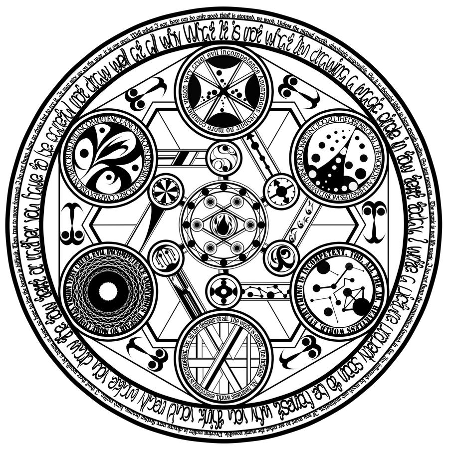

{{ rand_spiral() }}

:::

::: page-break
:::

## Les dragons
ToDo / À rédiger

## Le peuple éteint
{{ rand_creature_portrait() }}

   
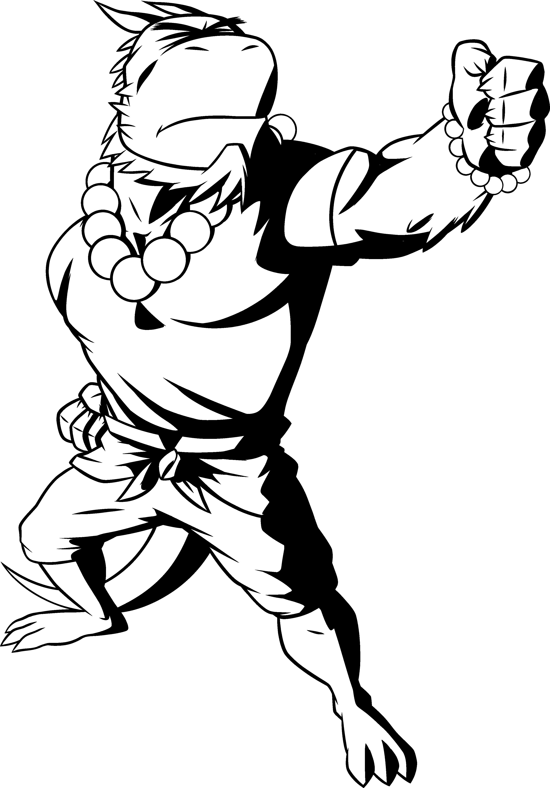

Société communiste, sans notion de propriété propre.
-> essayer de dégager quelques caractéristiques originales et marquantes, cf. https://ptgptb.fr/jdr-et-the-righteous-mind

::: page-break
:::

## Les joueurs incarnent des komuso
Avant que les joueurs ne créent leurs personnages, informez-les de la nature de leur groupe :
il vont incarner des **komusō**.

Les personnages des joueurs viennent de conclure un apprentissage d'élite
(ou leur reconversion) dans un domaine, quel qu'il soit : artisan, savant, sorcier...

En échange de cette formation d'excellence qu'ils ont reçu,
ils ont accepté ensuite, pendant un an, d'assumer la fonction de komusō,
et pendant **un an** de constituer un groupe suivant les préceptes de cette charge :

 

* **Vœu d'Errance** : un komusō ne reste jamais plus de **trois nuits** dans un lieu, à moins d'une urgence vitale.
* **Vœu de Pauvreté** : un komusō ne conserve **jamais d'argent** pour lui. Il subsiste de la générosité des autres, qui leur offrent en général volontier le gîte et le couvert. Un komusō peut faire du troc.
* **Vœu d'Assistance** : un komusō accepte toujours d'**aider quelqu'un en difficulté**, de lui porter secours.
* **Vœu d'Impartialité** : un komusō se doit d'être **impartial** et **juste**. En cas de conflit, sans qu'ils ne possèdent la moindre autorité officielle, les komusō sont parfois sollicités comme juges impartiaux.
* **Vœu de Préserver la Vie** : un komusō ira jusqu'à **se battre pour une vie**. Il protège également **la nature**, animaux, plantes et autres créatures.

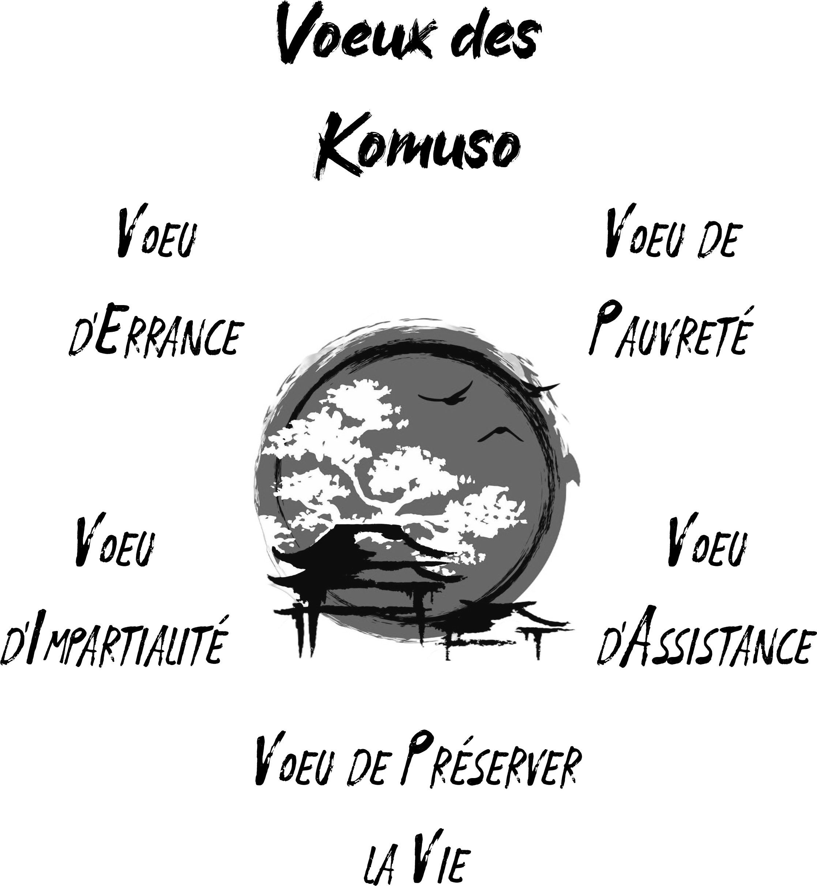

En-dehors de ce code moral, les komusō sont d'origines très diverses.
Ils ont souvent des connaissances et des compétences très complémentaires au sein d'un groupe,
pouvant parfois même provoquer des tensions.

 
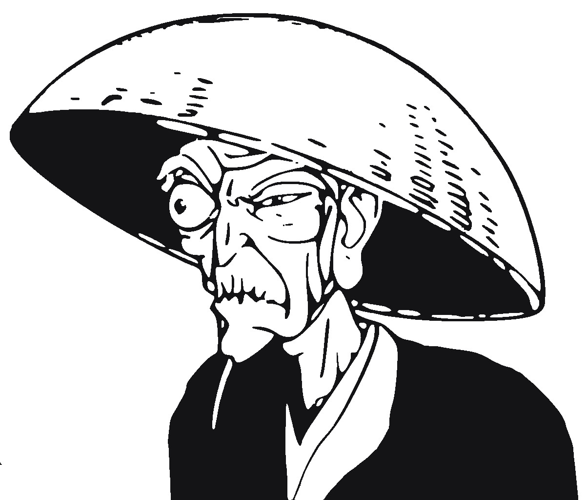

Ils doivent tous respect et obéissance à un **daïmio**,
qui a sélectionné les membres du groupe des komusō, et à qui ils rendent compte.
Il peut parfois leur demander d'accomplir certains missions spécifiques.

En particulier le daïmio des komusō des joueurs se nomme **Mokabé**.
Les komusō se connaissent déjà et voyagent ensemble depuis plusieurs semaines.

 

Au terme de leur mission de komusō, l'appréciation finale du daïmio sera cruciale pour la poursuite de carrière des komusō dans leur activité.

 

Les Vœux des komusō sont sources de points d'expériences :
un joueur sauvant une vie en danger ou épargnant un adversaire meurtrier gagne **+1 Ori**.

::: page-break
:::

## Former un groupe
Il y a deux options pour jouer à _**Ori Mushi**_ :

* vous jouez avec le même groupe de joueurs, pour une plusieurs parties
* vous jouez **en table ouverte**, pas toujours avec les même joueurs autour de la table. Ce mode de jeu est détaillé dans le [Guide du MJ](GuideDuMJ.pdf).

Selon si vous optez pour l'une ou l'autre option,
des règles légèrement différentes vont vous permettre de **tisser des liens entre les komusō**.

### Groupe fixe : tisser des liens entre les komuso
Lorsque tous les joueurs ont défini qui est leur komusō, avant de débuter la partie,
créez **deux liens** chaque personnage avec d'autres membres du groupe.

Cette étape se déroule ainsi :
* un premier joueur lance un dé pour déterminer, au hasard, avec quel autre komusō son personnage aura un lien.
Le joueur sélectionné devient son partenaire,
et lance à son tour un dé afin de déterminer **la nature de ce lien**,
en se référent à la table dédiée.
Lorsque les deux joueurs se sont mis d'accord sur le type de lien, la ligne correspondante est cochée dans la table, et ils répondent ensemble aux questions, à tour de rôle, dans l'ordre.
* c'est ensuite au tour du joueur du komusō qui vient d'être tiré au hasard.
Ce joueur lance lui aussi un dé pour sélectionner un autre personnage, à l'exception de celui du premier joueur.
Ils tirent ensuite au hasard la nature de leur lien dans la table, et répondent aux questions de la même manière.
* le joueur qui vient d'être tiré au hasard effectue lui aussi un jet de dé pour sélectionner un autre personnage du groupe, à l'exception de ceux des premier et second joueurs.
* et ainsi de suite jusqu'au dernier joueur, dont le komusō aura automatiquement un lien avec celui du premier joueur

### Liens entre les komuso en table ouverte
Dans ce mode de fonctionnement, vous établissez des liens entre komusō lors de la première partie, mais aussi **à chaque fois qu'un nouveau joueur** rejoint votre groupe pour jouer, avec son nouveau personnage.

Dans ce cas, le nouveau joueur lance un dé pour déterminer au hasard, avec quel autre komusō présent il aura un lien.
Le joueur sélectionné devient son partenaire,
et lance à son tour un dé afin de déterminer **la nature de ce lien**,
en se référent à la table dédiée, puis ils répondent aux questions.

Répétez l'opération pour que le nouveau joueur tisse un second lien avec un autre komusō du groupe.
Si plusieurs komusō rejoignent le groupe lors de la même partie,
essayez de faire en sort qu'ils tissent **un lien avec un "ancien" joueur, et un lien avec un "nouveau" joueur**.

### Lien secret
Le MJ prend en aparté les deux joueurs,
et leur révèle que l'un des komusō est un **mushi clone** de l'autre !

Depuis le clonage, les deux personnages ont probablement adopté des signes distinctifs,
les rendant légèrement dissemblables l'un de l'autre.
Ou bien peut-être prétendent-ils être jumeaux.
Mais ils disposaient en tout cas d'un corps et de souvenirs identiques au moment où le mushi est né.

Depuis, le mushi clone a entièrement est devenu une personne à part entière.
Il est complètement indépendant de son modèle et en tous points humain.

Répondez à ces questions :
* quel personnage est "l'original" ? Ou bien l'ignorez-vous ?
* il y a combien de temps le clone est-il né ?
* pourquoi avez-vous décidé de voyager ensemble ?

::: page-break
:::

## Jets de dés
Lorsque votre komusō entreprend une action comportant un risque,
le MJ demande au joueur de lancer un dé pour déterminer le résultat de cette action :

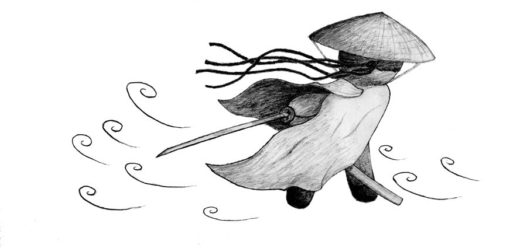

* ⚅ / ⚄ : c'est réussi !
* ⚃ : c'est réussi **mais**...
* ⚂ : c'est raté **mais**...
* ⚁ / ⚀ : c'est raté

De plus :
* si deux ⚅ sont obtenus : c'est une **réussite épique** ! <!--, **le joueur décrit la scène** -->
* si deux ⚀ sont obtenus : c'est un **échec critique**
* sur un ⚂ ou ⚃, le MJ peut également proposer un **dilemme** :
  le joueur se voit proposer un choix cornélien entre deux options exclusives.
  Son personnage peut par exemple obtenir quelque chose au prix d'un sacrifice,
  ou bien se rabattre sur une réussite partielle.
* actions **difficiles** : lorsque le personnage d'un joueur tente d'accomplir une véritable prouesse, une action à la limite de ses capacités, le MJ peut alors indiquer qu'au moins **deux dés de valeur** ⚃, ⚄ ou ⚅ sont nécessaires pour réussir l'action.
* actions **en opposition**, comme par exemple un affrontement : un jet est effectué par personnage : **celui obtenant le plus de** ⚅ l'emporte. En cas d'égalité, on considère les ⚄, puis les ⚃. Si l'égalité persiste, aucun personnage ne prend l'avantage.
* actions **conjointes** : un personnage assistant un autre à réaliser une action lui octroie **un dé bonus**, si le MJ juge cette aide pertinente. Un seul dé est octroyé lorsque plusieurs personnages fournissent leur aide.

 

::: page-break
:::

### Lancer plus de dés
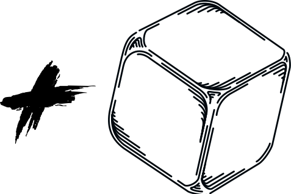

Ce symbole vous indique d'ajouter un dé à votre jet :
prennez ensuite en compte **le plus haut résultat** pour déterminer la réussite de l'action.

Vos **Compétences** et vos **Artefacts** vous permettent ainsi de lancer des dés supplémentaires
lors d'un jet de dés.
Tant que le MJ considère que ces atouts vous aident dans l'action entreprise,
ces ajouts de dés peuvent se cumuler.

Votre **Voie** peut également vous fournir des dés additionnels.

### Règles d'emploi des Vocables
Employer un Vocable nécessite **1 point de Mana** canalisé, et un jet de dé.
Un personnage maîtrisant un Vocable, peut tenter n'importe quelle Versets propre à cette famille de magie.
Il est aussi possible de devenir expert d'un **Verset** en particulier, et de gagner ainsi **+1 dé** au lancer lorsqu'on l'emploie.

Certains artefacts rares peuvent également conférer **+1 dé** au lancer pour un Vocable spécifique.

 
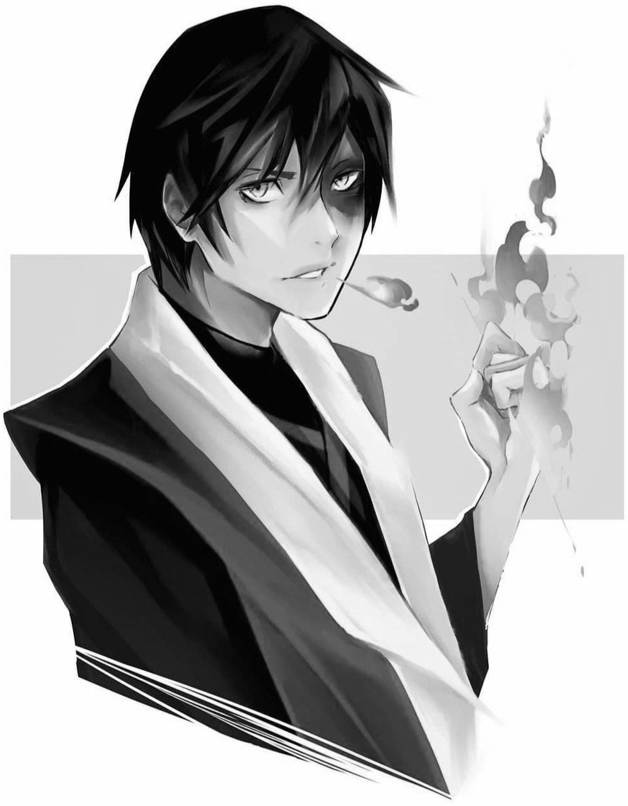

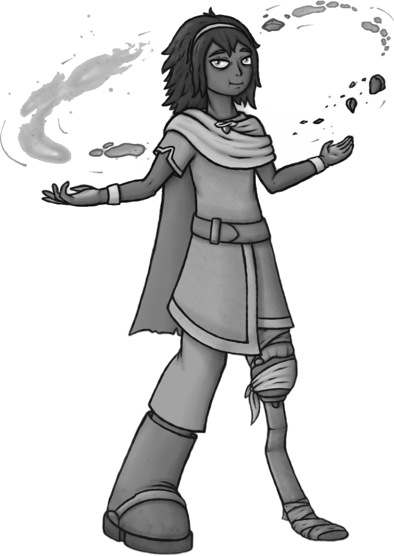

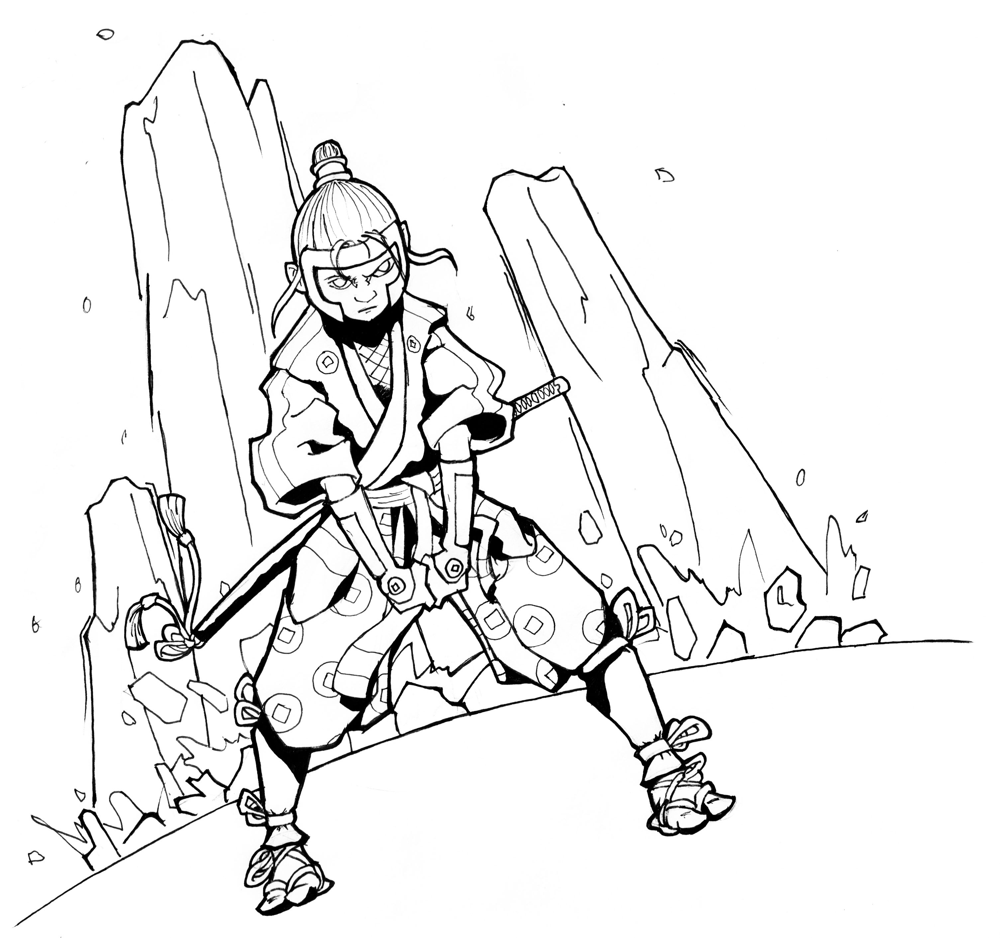

## Santé
_Section en cours de rédaction..._

-> géré comme un RISQUE qui DOIT être explicité par le MJ avant un jet

 

::: page-break
:::

## Boucle de jeu
Dans Ori Mushi, le jeu alterne entre trois phases :

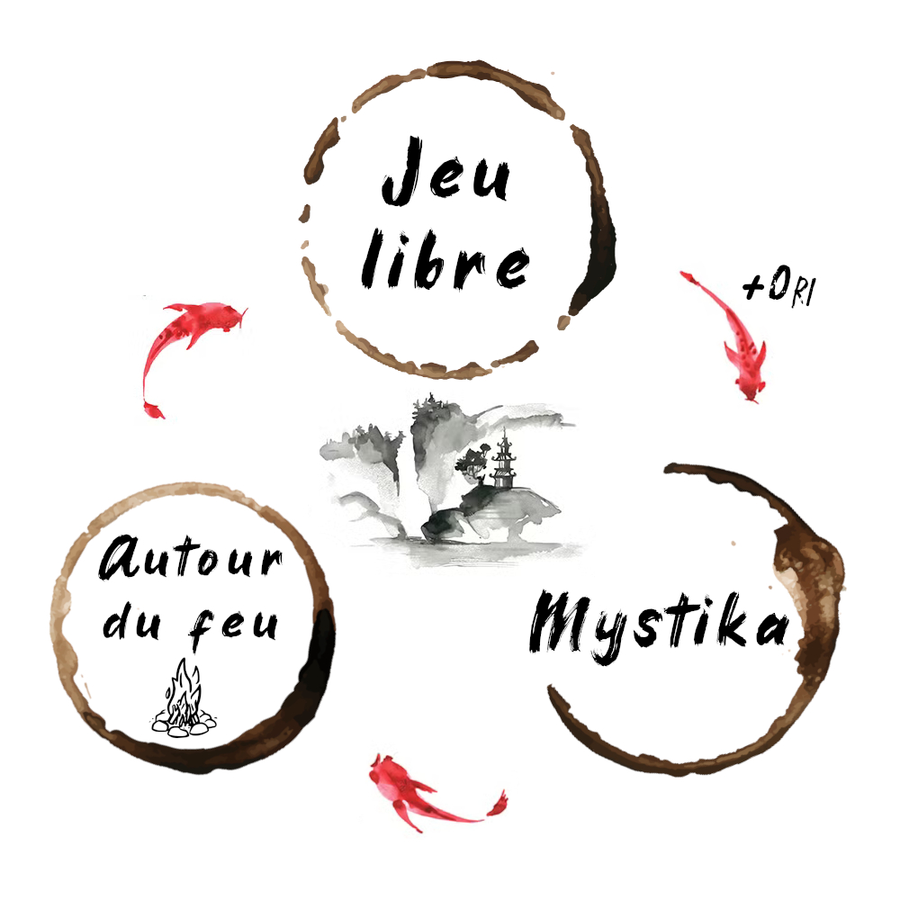

### Jeu libre
Durant cette phase de jeu, chaque joueur incarne son komusō,
et est totalement libre de ses actions et paroles.
C'est le mode de jeu « classique » de la plupart des jeux de rôle.

L'un des vœux des komusō étant l'**itinérance**, ils voyagent sans cesse de lieu en lieu.
**À chaque fois que les komusō migrent d'un lieu** pour se rendre dans un autre,
passez ensuite successivement aux phases de jeu suivante :
1. [Répartition des Oris & progression](#oris-progression)
1. [Mystika](#mystika), où les joueurs rêvélent et détaillent **les secrets des terres connues**
1. [Autour du feu](#autour-du-feu), un moment de _roleplay_ entre komusō pour les joueurs

::: page-break
:::

## Oris & progression
Les Oris représentent la sagesse, l'élan de bonté, la force intérieure que n'importe qui peut développer.

La progression en Oris d'un komusō représente son gain d'expérience
acquise en réalisant des actions en alignement avec son code moral,
au fur et à mesures de ses aventures.

::: borderless right-align-col-1 with-headings
Situation | Progression par aventure
-|-
Échec critique ⚀⚀ | +1 Ori
Suivre activement les Vœux des komusō, y compris le Vœu Personnel | +1 Ori
Mettre en avant ses Liens &  | +1 Ori
Suivre sa Progression de Voie | +1 Ori
Placer au moins une fois son komusō dans une situation délicate à cause de sa Mauvaise habitude | +1 Ori
:::

En dehors de l'échec critique, tous les gains d'Oris se font en fin de session de jeu,
lorsque les komusō reprennent leur voyage.

Lorsque les personnages ont obtenus suffisamment d'Oris,
et qu'ils satisfont les critères de leur Voie,
**ils changent de palier**, et donc de feuille de Voie.

Le changement de palier se déroule au début d'une partie où
**au moins trois PJs présents satisfont le critère de passage au palier suivant de leur Voie**.
Tous les komusō changent alors de palier simultanément.

Ne fournissez pas aux joueurs de détails au préalable sur comment cela se déroule.
Tout est détaillé dans le [Guide du MJ](GuideDuMJ.pdf).

::: page-break
:::

## Mystika
Durant cette phase narrative, les joueurs vont définir collectivement les détails qui entourent certains **secrets** de l'univers d'Ori Mushi.

Cette phase a lieu lorsque les komusō profitent des moments de repo de leur voyage
pour déchiffrer des **bas-reliefs antiques** qu'ils ont recopié durant leurs aventures,
ou pour lire des **livres interdits** qu'ils ont récolté.

L'examen de ces reliques est le rôle de l'**Artiste-Conteur** du groupe.
S'il n'y en aucun parmi les joueurs, alors le suivi des secrets découverts
est géré **par le groupe collectivement** : découpez simplement la zone _Secrets_
d'une feuille d'Artiste-Conteur, et confiez-la aux joueurs.
S'il y a deux Artiste-Conteurs parmi les joueurs, alors laissez-les se mettre d'accord
pour que l'un se charge des bas-reliefs antiques et l'autre des livres interdits.

### Révélation d'un secret
Une fois par voyage entre deux aventures, un Artiste-Conteur peut profiter des temps de repos
pour déchiffrer un **bas-relief antiques** qu'il a recopié, ou un **incunable** (livre rare).

Au terme de cet examen littéraire, il **découvre un secret** concernant les terres connues.
Le MJ consulte le tableau ci-dessous pour leur révéler lequel,
correspondant le mieux au bas-relief ou livre déchiffré,
et en privilégiant les premiers secrets de la liste :

::: borderless text-small with-headings
 | Secret | Narration partagée
-|-
1 | Le chant plaintif des Colosses est constitué de Versets du Poète Endeuillé, dont les effets sont magiques | **Question-Réponses** : Bilgamesh emploie le Vocable des Plantes, quel est exactement l'impact de ses Versets ?
2 | Le peuple éteint n'a pas totalement disparu. Ses derniers membres se sont réfugiés dans une **vallée secrète**. | **Question-Réponses** : la relique que vous avez déchiffré indique comment y accéder, quel est ce moyen ?
3 | Chaque Colosse est alimenté par une **sphère de Vitruve**, un dispotif mécano-magique alimenté par un **œuf de dragon**. | **Question-Réponses** : ?
4 | Il existe des **???**, capables de conférer l'**immortalité** s'ils sont brisés et que leur cœur est consommé | **Question-Réponses** : lors de la guerre de l'Oubli, comment fut oublié le nom de Watatsumi, dragon des mers ?
5 | Le **Fléau Impassible** est un mushi, il s'est déjà répandu par le passé, et un remède a été trouvé en l'étudiant. | **Question-Réponses** : quel fut le remède et comment a-t-il été découvert ?
6 | Les Onis sont en réalité une septième famille de mushis parasites -> décrire la section correspondante. | **Question-Réponses** : où et comment poussent les fruits du Oni ?
7 | Les dragons sont en fait une légende savamment entretenue par des Artistes-Conteurs. Les "œufs de dragons" sont en réalités des œufs d'Oni. | **Question-Réponses** : ?
8 | xxx | **Question-Réponses** : ?
:::

<!--
Ces secrets doivent "accompagner" la campagne principale.
Idéalement, alterner l'objet de ces secret: les Temps Antiques / la Guerre de l'Oubli / etc.
? Est-ce que d6 est vraiment UTILE ? Est-ce que rêvéler les secrets un à un ne serait pas plus simple pour écrire la campagne ?
-->

### Narration partagée
Cette colonne de la table des secrets indique **comment** se déroulera cette phase.
Il existe plusieurs formats, détaillés dans les sections suivantes :
* Question-Réponses
* Haïkus
* Artefact
* Journal de bord

Une bande son calme, poétique, envoutante est idéale pour cette phase.
Suggestions : [Mushishi](https://www.youtube.com/watch?v=brsJ19kclwc),
[Ori and the Blind Forest](https://www.youtube.com/watch?v=OvpnMT-iqCM).

L'Artiste-Conteur prend en note sur sa feuille de Voie du secret rêvélé.
Il aussi encouragé à prendre note, au dos de sa feuille de Voie,
des détails inventés collectivement durant cette phase.
Il pourra s'en inspirer pour de futures représentations de spectacles !

::: callout
Gardez en têtes ces grands principes durant la phase Mystika :
<!-- Ces principes valent aussi pour la phase de création de liens entre PJs -->
* durant ces phases de narration partagée, **vous êtes libres de créer n'importe quel élément de l'univers** : lieux, personnages, événements...
* employez la technique du **« oui et »** : ne rentrez jamais en contradiction avec les éléments apportés par les autres joueurs, mais rebondissez dessus et étoffez-les.
* tout n'a pas à être **cohérent** : les reliques découvertes par les komusō relatent des histoires, pas forcément la Vérite. Elles peuvent même parfois se contredire.
* cette phase doit rester relativement **courte**, idéalement environ une demi-heure : c'est au MJ de l'animer et de s'assurer qu'elle ne traîne pas en longueur
:::

### Format : question-réponses
À chacune de ces phases, un joueur sera l'Arbitre.
L'Artiste-Conteur est le premier à endosser ce rôle,
puis il sera assumé par tous les joueurs à tour de rôle au fil des phases suivantes de Questions-Réponses.
L'Artiste-Conteur est responsable de consigner qui a déjà été Arbitre,
et à qui revient ce rôle à chaque fois.

Les phases de Questions-Réponses se déroulent ainsi :
* le MJ énonce la question posée
* à tour de rôle, chaque joueur propose une réponse, sauf l'Arbitre
* enfin, l'Arbitre choisit la réponse qu'il préfère, ou un mélange de réponses

### Format : haïkus
Dans ce format, vous allez décrire une succession de **scènes** et d'ambiances,
formant un poème ou une balade, qui se transmet souvent accompagné de musique.
Le lien entre ces scènes ne sera pas explicité, et c'est à chacun de se forger une idée de ce qui les relier à travers le temps et l'espace.
Chaque scène est un haïku, une strophe du poème.

Le MJ peut choisir de participer ou non à cette phase.

**Déroulé** : à tour de rôle, chaque joueur énonce une phrase décrivant une **scène** ou une ambiance, pour former une succession de haïkus.
* n'importe quel joueur inspiré énonce la première phrase du premier haïku. Il est alors chargé d'inscrire toute la strophe sur la Feuille des Haïkus.
* en tournant dans les sens des aiguilles d'une montre, chaque joueur annonce une phrase à son tour.
* après un temps de réflexion, un joueur peut passer son tour.
* si possible, la troisième phrase doit clôturer chaque haïku, puis la quatrième débuter un nouveau haïku, et ainsi de suite.
* ne respectez pas strictement les règles de composition des haïku : une strophe peut contenir 4 ou 5 phrases, le nombre de syllabes importe peu, une césure (_kireji_) à la fin est bienvenue mais pas nécessaire, etc.
* **le poème est fini** lorsque tous les joueurs sont satisfaits du poème, et que plus personne n'est inspiré pour débuter de nouveau haïku.

<!-- TODO : ajout exemples -->

### Format : artefact
Le MJ participe à cette phase comme les autres joueurs.

Le joueur qui a placé son dé sur cette table choisit un artefact
en possession d'un komusō du groupe, ou mentionné précédemment durant une partie.
Il désigne ensuite un joueur en lui passant son dé.

**Déroulé** :
* chaque joueur doit décrire une brève scène ou l'artefact était impliqué.
* le premier joueur doit décrire l'origine de l'objet, comment il a été conçu.
* la description doit s'attacher à décrire une scène préciser, sans nécessaire donner d'explications.
* les autres joueurs peuvent ensuite faire des commentaires, et poser des questions sur des détails de la scène.
* enfin, le joueur qui a décrit la scène transmet le dé un autre joueur, pour qu'il narre une autre scène impliquant l'artefact, située chronologiquement plus tard dans la vie de l'objet.
* une fois que tous les joueurs ont décrit au moins une scène, n'importe quel joueur qui reçoit le dé peut décider d'arrêt cette phase de narration.

## Merveilles
Voici quelques-unes des merveilles que pourraient découvrir les PJs.
L'Église de la Connaissance souhaitera se les approprier.
Il s'agit pour la plupart de créations de Vitruves durant les Temps Antiques, mais pas seulement :
### Le Gyroptère de Vitruve
_cf._ [Gyroptère](https://fr.wikipedia.org/wiki/Gyropt%C3%A8re)
### La Tour de l'Infini
* Possède de nombreuses portes (la plupart fermées), s'ouvrant dans de nombreux lieux des terres connues
* c'est un lieu secret, que les komusō 
* les portails nécessitent de l'algue-portail 
* ⚠️ la nuit, une masse d'algue-portail s'y déplace d'étage en étage (façon cube gélatineux)
### Le Théâtre des Cieux
### Une sphère mécanique agricole
Capable de planter / labourer / biner / butter / sarcler / éclaircir les plantes
Peut faire peur au 1er abord
### Un moulin à énergie solaire
Ressemble à un moulin... mais tourne même quand il n'y a pas de vent !
### Un mégaphone géant
Capable de diffuser un concert dans toute la vallée
### Une chaudière souterraine géante
Alimentant les poeles de nombreuses maisons dans une région enneigée
### Un aigle-Colosse volant
Inspi Les Mystérieuses Cités d'Or
### Un téléscope géant
### Inventez les vôtre !

::: page-break
:::

## Autour du feu

Durant cette phase, les joueurs incarnent leurs komusō, au terme d'une journée de voyage.
Ils se retrouvent traditionnellement autour d'un feu de camp.
Si une phase Mystika vient d'avoir lieu,
cette scène commence alors que leurs personnages viennent de découvir
**un secret des terres connues**.

Il s'agit d'une séquence d'un quart d'heure axée sur le _roleplay_, où les joueurs sont encouragés à :
* partager avec les autres komusō ce que leur personnage a **ressenti** durant leur dernière étape
* revenir sur ce que certains de **leurs camarades ont fait**
* discuter de **leur mission** : est-ce qu'il l'accomplissent correctement ? Est-ce qu'ils l'envisagent tous de la même manière ?
* évoquer les **rêves et ambitions** de chacun
* émettre des hypothèses sur les **grands mystères** des terres connues : Colosses, mushis, légendes...

Concluez cette phase ainsi :

> Au cœur de la nuit, votre feu de camp s'éteint doucement.
> Qu'est-ce que vos personnages ont dans le coeur en se couchant ?

Durant cette phase, le MJ peut participer durant les "blancs" de la discussion pour décrire l'environnement autour des komusō, la lumière, les bruits, le vent...
Il est aussi encouragé à diffuser une musique d'ambiance adaptée :
* [Tir - Urd, Skuld & Verdandi](https://www.youtube.com/watch?v=Y86VoxYB7iY)
* [Campfire Ambience with music - 1 Hour](https://www.youtube.com/watch?v=8tWmmhhJEjw)
* [Campfire Stories | TTRPG Ambience Music | 1 Hour](https://www.youtube.com/watch?v=bxaPsiNFY8E)
* [Campfire at Night - TTRPG relaxed BG Music - 1 Hour](https://www.youtube.com/watch?v=nSYpUGP7RRc)

::: page-break
:::

## PNJs
### Mokabé
Daïmio vétéran; membre du conseil des komusō; gardien de la Tour de l'Infini
* **Objectifs** : atteint d'une dégénerescence bientôt fatale, il sait qu'il va mourrir sous peu. Avant, il veut transmettre aux komusō ses derniers et plus importants enseignements.
* **Attitude (guide de roleplay)** :
* **Liens avec autres PNJS** : père de Rumiko, ami & conseiller d'Oma, ami d'enfance d'Hisaishi
### Mae
Jeune marchande qui prend les choses en main au Temple aux Singes
* **Objectifs** :
* **Attitude (guide de roleplay)** :
* **Comment peut-elle aider les PJs ?** :
* **Comment s'opposera-t-elle aux PJs ?** :
* **Liens avec autres PNJS** :
### Oma la Cueilleuse de Mots
Une Poètesse-Sorcière, élue par les forestiers pour diriger le conseil des sages de Nippur.
Vit au Moulin Des Cigognes
* **Vocables** : **gravité** (contrôle du papier façon [_Read or Die_](https://youtu.be/gB_CFVSVVRo?si=RJ0NAttNlPGEbaHn&t=1230))
* **Objectifs** : s'opposer à l'influence grandissante de l'Eglise de la Connaissance dans la région
* **Attitude (guide de roleplay)** :
* **Comment peut-elle aider les PJs ?** :
* **Comment s'opposera-t-elle aux PJs ?** :
* **Liens avec autres PNJS** : mentor de Rumiko; amie de Mokabé
### Rumiko
* **Objectifs** : devenir daïmio, suivre les vœux des komusō, faire perdurer cet ordre, que son père soit fière d'elle
* **Voie** : Maître-Artisan -> specialité ?
* **Attitude (guide de roleplay)** : de caractère joyeux; peut devenir très sérieux; initiallement méfiante envers les PJs
* **Comment peut-elle aider les PJs ?** :
* **Comment s'opposera-t-elle aux PJs ?** :
* **Liens avec autres PNJS** : fille de Mokabé; komusō apprentie d'Oma 
### Osamu Tenpo
Évêque-ingénieur chargé de l'évangélisation des Basses-Plaines
Accompagné et secrètement d'arquebusiers
* **Objectifs** : étendre l'influence de l'Église de la Connaissance; combattre les croyances envers les Mushis
* **Attitude (guide de roleplay)** :
* **Comment peut-il aider les PJs ?** :
* **Comment s'opposera-t-il aux PJs ?** :
* **Liens avec autres PNJS** :
### Bilgamesh
Colosse encore actif, géant humanoïde arpentant les Basses Plaines.
* **Objectifs** :
* **Attitude (guide de roleplay)** :
* **Comment peut-il aider les PJs ?** :
* **Comment s'opposera-t-il aux PJs ?** :
* **Liens avec autres PNJS** :
### Gilga
La légende raconte qu'il commandait aux Colosses et qu'il aurait vaincu les Onis.
* **Objectifs** :
* **Attitude (guide de roleplay)** :
* **Comment peut-il aider les PJs ?** :
* **Comment s'opposera-t-il aux PJs ?** :
* **Liens avec autres PNJS** :
### Hisaishi Inoue
Capitaine en chef des bateliers
* **Objectifs** :
* **Attitude (guide de roleplay)** :
* **Comment peut-il aider les PJs ?** :
* **Comment s'opposera-t-il aux PJs ?** :
* **Liens avec autres PNJS** :
### Cécil
Archiviste, bibliothécaire, ancien élève de Mokabé
* **Objectifs** :
* **Attitude (guide de roleplay)** :
* **Comment peut-il aider les PJs ?** :
* **Comment s'opposera-t-il aux PJs ?** :
* **Liens avec autres PNJS** :
### Jinbeï
Successeur de Mokabé.
A un sabre à la ceinture, vestige de son passé de guerrier, mais il est **soudé**.
* **Objectifs** :
* **Attitude (guide de roleplay)** : débonaire, bon vivant / buveur, volontier impertinent / moqueur, parfois impulsif
* **Comment peut-il aider les PJs ?** :
* **Comment s'opposera-t-il aux PJs ?** :
* **Liens avec autres PNJS** :

## Griddish
<https://www.reddit.com/r/neography/comments/a9yd0d/i_made_a_griddy_cipher_where_letters_smush/>

::: borderless
A | B | C | D | E | F | G | H | I | J | K | L | M
-|-
~~A~~ | ~~B~~ | ~~C~~ | ~~D~~ | ~~E~~ | ~~F~~ | ~~G~~ | ~~H~~ | ~~I~~ | ~~J~~ | ~~K~~ | ~~L~~ | ~~M~~
N | O | P | Q | R | S | T | U | V | W | X | Y | Z
~~N~~ | ~~O~~ | ~~P~~ | ~~Q~~ | ~~R~~ | ~~S~~ | ~~T~~ | ~~U~~ | ~~V~~ | ~~W~~ | ~~X~~ | ~~Y~~ | ~~Z~~
:::
 

lepoeteendeuille : ~~lepoeteendeuille~~

LEPOETEENDEUILLE : ~~LEPOETEENDEUILLE~~

Dans le jeu, cet alphabet est celui des Temps Antiques.

L'idée est d'employer ce script sur les feuilles de personnage pour y dissimuler des secrets que les joueurs décrouvriront durant la partie.

::: page-break
:::

 

## Ressources

 

### Illustrations
S'inspirant de [Sventovia](http://legrumph.org/Terrier/?Jeux-de-role/Sventovia) du Grümph,
nous vous encourageons à imprimer des images au préalable, pour faciliter l'immersion des joueurs.

Vous trouverez dans ce PDF de multiples illustrations pour les komusō, les PNJs,
ainsi que différents lieux, créatures & artefacts
[OriMushi-illustrations.pdf](OriMushi-illustrations.pdf).

Voici également quelques illustrateurs inspirants :
* [liquidcoco](https://www.artstation.com/liquidcoco)

### Ambiance musicale
Quelques suggestions de bande sons originales :
[Okami](https://www.youtube.com/watch?v=JAfXYXwykFI),
[Princess Mononoke](https://www.youtube.com/watch?v=LKI9aczEL3g),
[Furyo / Merry Christmas Mr. Lawrence](https://www.youtube.com/playlist?list=PLBTmKkw_sSw0garpOiQ0W6deqEXd_zfaj),
[Journey](https://www.youtube.com/watch?v=M3hFN8UrBPw),
[Creatures of Ava](https://www.youtube.com/watch?v=FMFb5eY3Wc4)
--> à insérer comme suggestion pour chaque phase

La galerie d'art de Nouvelle-Galles du Sud a commandé une musique atmosphérique pour son exposition « Japan Supernatural » d'art traditionnel et contemporain : <https://www.artgallery.nsw.gov.au/listen/supernatural/#music>

[Beautiful Piano -Poems of the Moon - Japanese Fantasy Inspired BGM](https://www.youtube.com/watch?v=Zu_pBbCwovA)

[Blue Turtle YouTube playlists](https://www.youtube.com/@BlueTurtle/videos)

Bande son YouTube : [Ori Mushi](https://www.youtube.com/playlist?list=PLLgE-ga3W_kbktCFQcCk_AIr3UqNLBRGI)

::: page-break
:::

## Illustrations sélectionnées - non encore placées

 
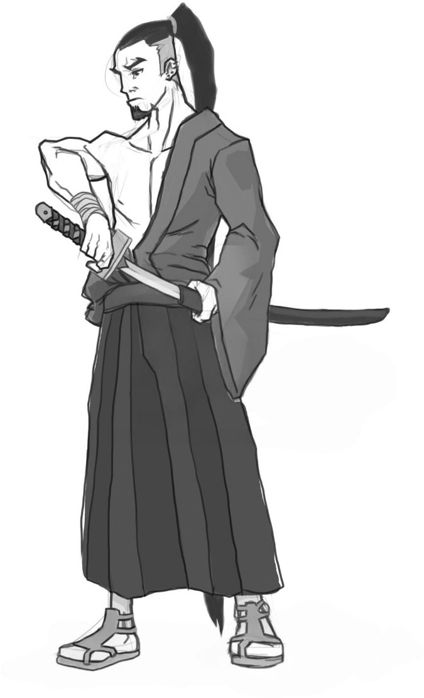

 
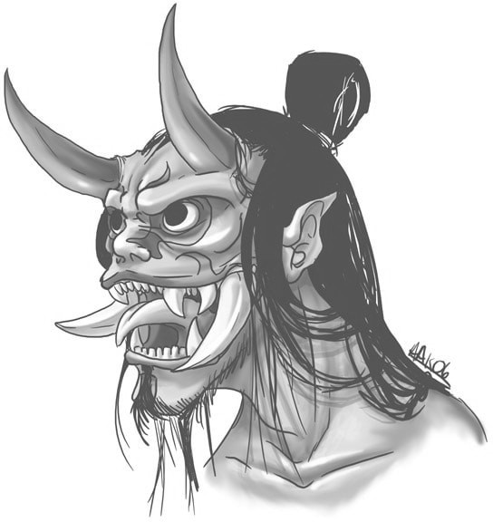

 
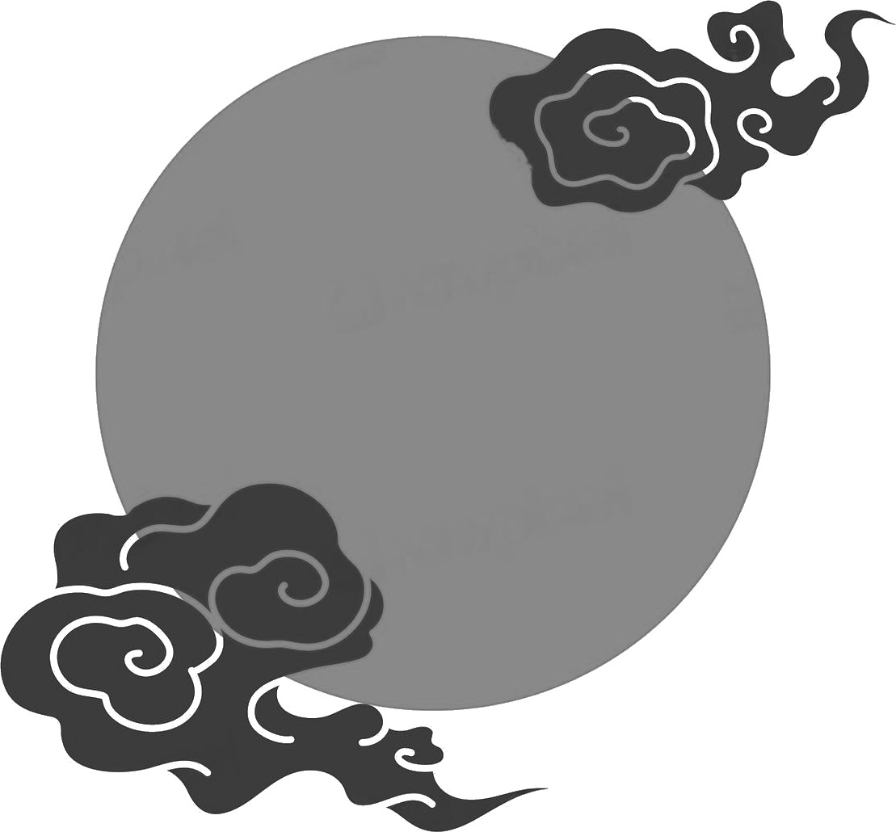

 
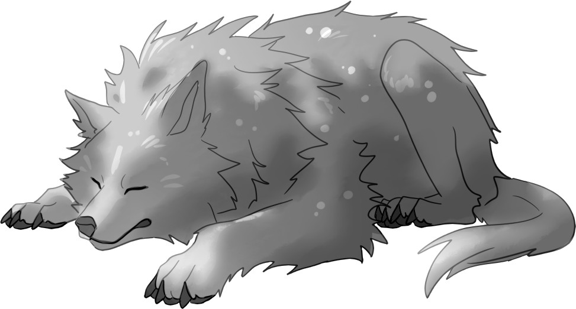

 
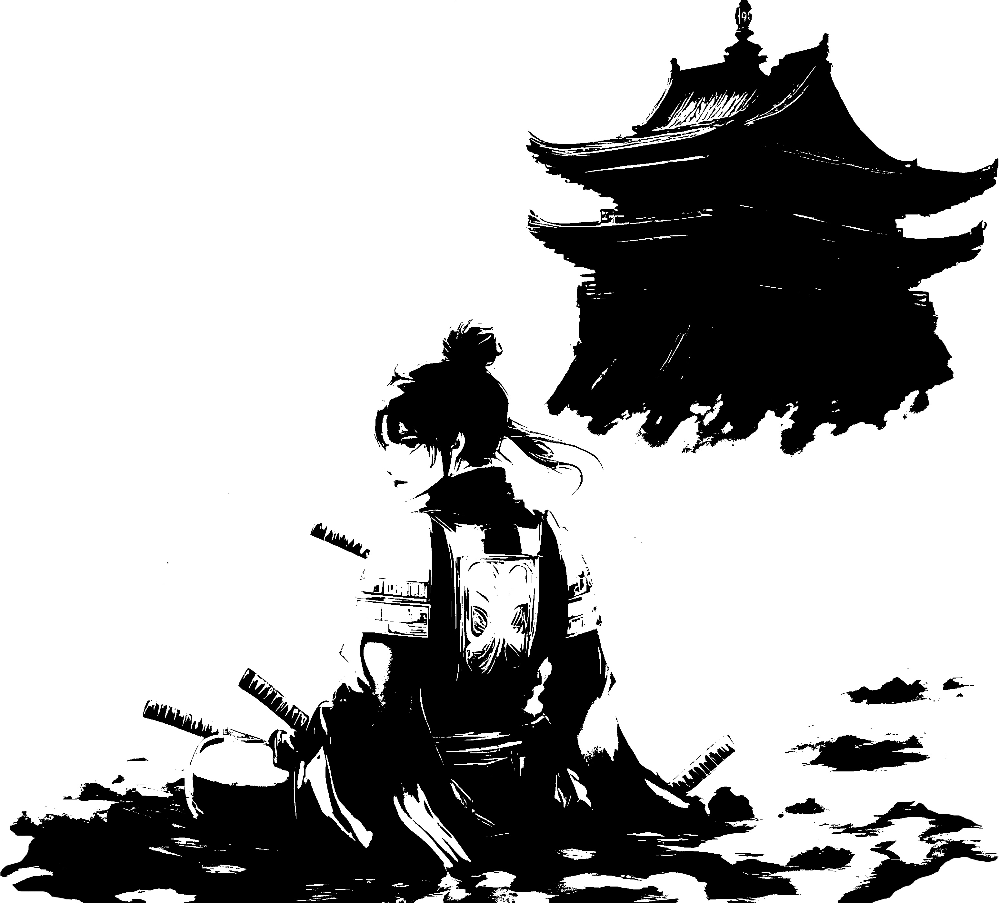

 
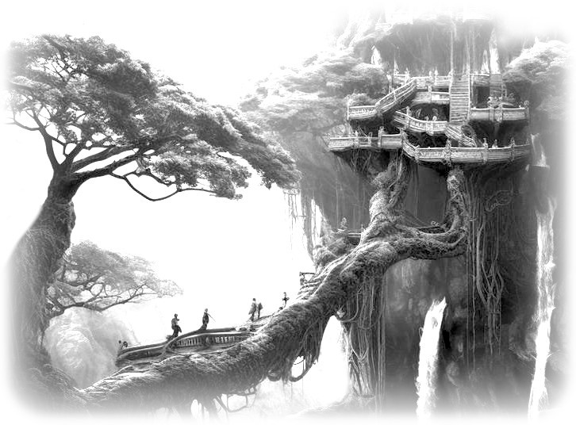

 
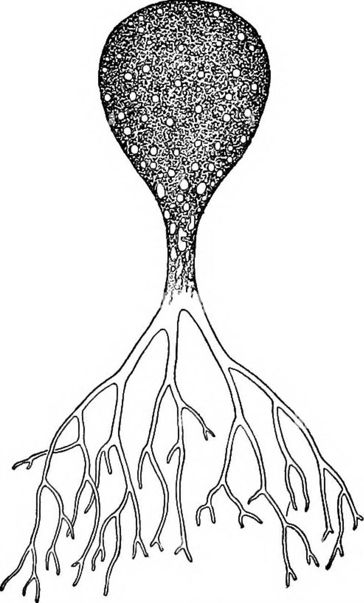

 
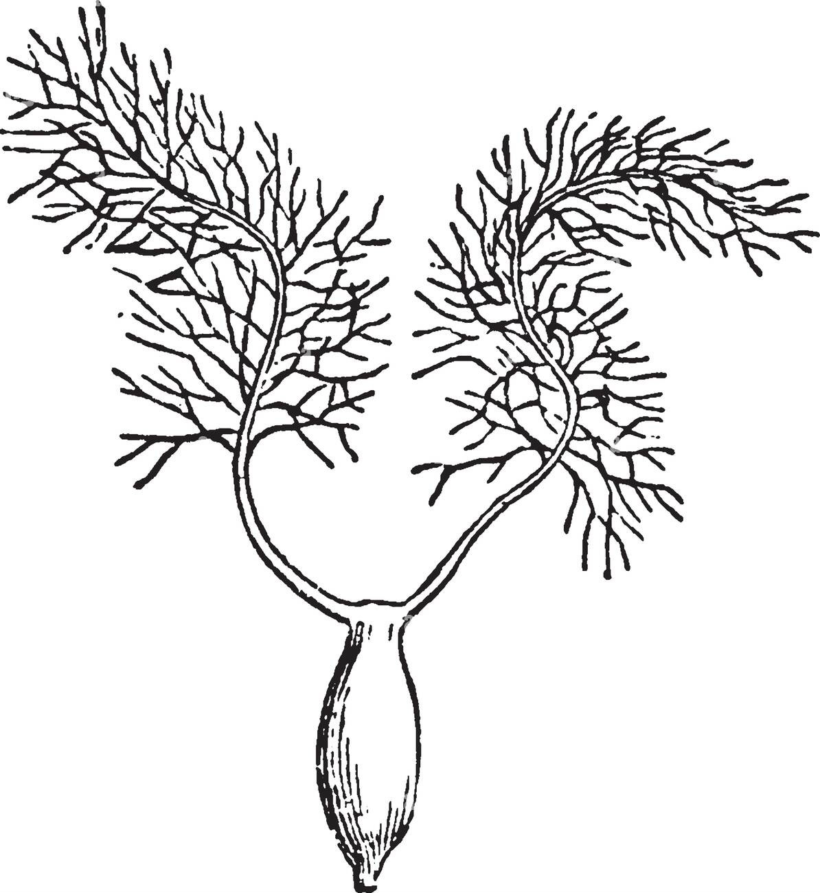

 
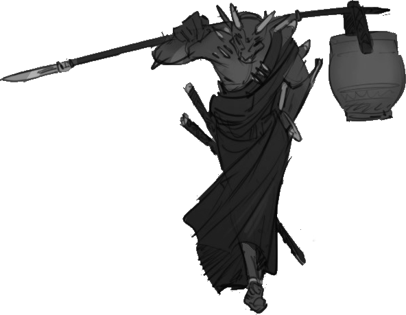

 
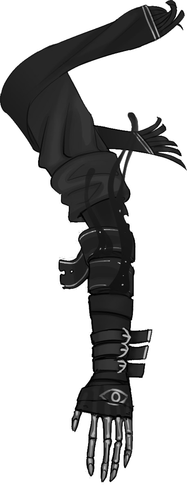

_**Images searches**_: Creative Commons via Google, avec filtres "il y a moins d'un mois" + Licences Creative Commons :
* [DeviantArt: artwork|"concept art"|illustration|character](https://www.google.com/search?tbm=isch&tbs=qdr:m,sur:cl&q=site%3Adeviantart.com+-Derivatives+-NoDerivatives+-%22User+profile%22+-Explore+-%22AI+tools%22+%28artwork%7C%22concept+art%22%7Cillustration%7Ccharacter%29)
* [DeviantArt: manga](https://www.google.com/search?tbm=isch&tbs=qdr:m,sur:cl&q=site%3Adeviantart.com+-Derivatives+-NoDerivatives+-%22User+profile%22+-Explore+-%22AI+tools%22+manga)

::: page-break
:::

## Glossaire

<dl>

<dt id="campagne">Campagne</dt>
<dd>ensemble de parties de JdR se suivant pour former une continuité, où l'on retrouve les même personnages dans le même univers</dd>

<dt>Hopepunk</dt>
<dd>
un sous-genre des littératures de l'imaginaire, conçu à l'opposé des dystopies amorales ou violentes, où la bonté est un acte politique et de rébellion, et les personnages ne se résignent pas face à un univers hostile. <a href="https://fr.wikipedia.org/wiki/Hopepunk">Page Wikipedia dédiée</a>. Voici quelques œuvres que j'estime appartenir à ce genre et que je recommande : les bandes dessinées <em>Lightfall</em>, <em>Mouse Guard</em>, <em>Nimona</em> et <em>SAGA</em>; les films <em>Nausicaä</em> &amp; <em>Princesse Mononoké</em>; la série <em>Firefly</em>; les jeux vidéos <em>Brothers - A Tale of Two Sons</em> & <em>Journey</em>.
</dd>

<dt>JdR</dt>
<dd>jeu de rôle</dd>

<dt>MJ</dt>
<dd>Meneur ou Meneuse de Jeu</dd>

<dt>One-shot</dt>
<dd>courte partie de JdR isolée, sans qu'il ne soit prévu de suite</dd>

<dt>PJ</dt>
<dd>Personnage d'une Joueuse ou d'un Joueur</dd>

<dt>Roleplay</dt>
<dd>action d’incarner son personnage, généralement en s’appliquant à parler et agir comme il le ferait</dd>

<dt>Table ouverte</dt>
<dd>fonctionnement d'une <a href="#campagne">campagne</a> de jeu de rôle où d'une partie à l'autre ce ne sont pas toujours les même joueurs autour de la table.</dd>

</dl>

::: page-break
:::

## Toutes les idées qui n'ont pas pu aboutir dans cette version

### Atlas des joueurs
Un atlas de 4-6 pages est remis aux joueurs en début de campagne.
Cet atlas détaille brièvement l'histoire et la géographie des terres connues.
Des annotations manuscrites mentionnent quelques mystères,
et des petits encarts de réponse permettent aux joueurs d'y consigner leurs découvertes.

### Site web
* partage de haïkus, avec mise en page jolie (proc-gen) de ces textes
* partage de personnages
* partage de lieux sur carte partagée (mentionner `#hashtag` dédié pour les partager sur réseaux sociaux)
<!--
    + tool: <https://github.com/Azgaar/Fantasy-Map-Generator>
    -> fine-tune & disable useless features: <https://github.com/Azgaar/Fantasy-Map-Generator/wiki/Quick-Start-Tutorial#performance-tips>
    alt tool: <https://github.com/davmillar/DavesMapper>
    + 1 carte commune publique
    + lien avec le jeu ?
        -> avoir acheté le jeu permet d'avoir un compte sur la carte partagée
    + collaboration model: all users with an account can edit the map
    -> add a server-storage based provider, with some auth: <https://github.com/Azgaar/Fantasy-Map-Generator/blob/master/modules/io/cloud.js>
    => needs a system to avoid concurrent edits
    => open GitHub issue to suggest feature?
-->

::: page-break
:::

## Licence, sources & remerciements

_Ori Mushi_ a été conçu par [Lucas Cimon](https://chezsoi.org/lucas/blog/), il est placé sous license <a rel="license" href="http://creativecommons.org/licenses/by-nc-sa/4.0/">Creative Commons Attribution-NonCommercial-ShareAlike 4.0</a>.

Ce jeu est diffusé à prix libre.
Si vous souhaitez me soutenir, vous pouvez me faire un don sur [lucas-c.itch.io](https://lucas-c.itch.io).
Les fichiers sources ayant permis de générer ce PDF sont disponibles [sur GitHub](https://github.com/Lucas-C/jdr/tree/master/OriMushi).
Cette version est la v0.5.

Je serais ravi d'avoir vos retours si vous jouez à ce jeu !
Racontez-moi comment s'est passée votre partie via un commentaire [lucas-c.itch.io](https://lucas-c.itch.io) ou sur [mon blog](https://chezsoi.org/lucas/blog/tag/ori-mushi.html).

Merci enfin aux développeurs des [logiciels libres](https://fr.wikipedia.org/wiki/Free/Libre_Open_Source_Software) employés pour réaliser ce jeu : [le navigateur Firefox](https://www.mozilla.org/fr/firefox/), [le logiciel de dessin Gimp](https://www.gimp.org/), [l'éditeur de texte Notepad++](https://notepad-plus-plus.org/), [le lecteur de PDF Sumatra PDF](https://www.sumatrapdfreader.org), [le language de programmation Python](https://www.python.org/), les bibliothèques de code [mistletoe](https://pypi.org/project/mistletoe/) & [weasyprint](https://weasyprint.org/), le logiciel d'agrandissement d'image [nunif/waifu2x](https://www.waifu2x.net/).

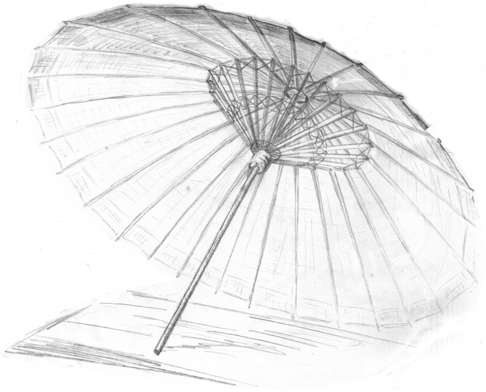
 

::: thanks
Polices : [Ink Free](https://www.dafontfree.co/ink-free-font/)
& [Odachi](https://www.behance.net/gallery/59783897/Odachi-Free-Brush-Font)
& [Xangda Shiny](https://www.fontspace.com/starinkbrush/xangda-shiny).

Illustrations employées :

<!-- TODO: add icons & plants-by-LeviGilbert-cc-by -->

- [Epic Chibi Ninja par dmr12890](https://www.deviantart.com/dmr12890/art/Epic-Chibi-Ninja-129862000) - [CC BY-NC-SA 3.0](https://creativecommons.org/licenses/by-nc-sa/3.0/)
- [Kyoshi Earthbender Lineart par Aedo Sama](https://www.deviantart.com/aedo-sama/art/Kyoshi-Earthbender-Lineart-215736017) - [CC BY-NC-SA 3.0](https://creativecommons.org/licenses/by-nc-sa/3.0/)
- [magic circle 2 par NNao](https://www.deviantart.com/nnao/art/magic-circle-2-216221240) - [CC BY-NC-SA 3.0](https://creativecommons.org/licenses/by-nc-sa/3.0/)
- [Kappa koopa](https://www.deviantart.com/weremagnus/art/Kappa-koopa-53098269) & [Noh Demon par weremagnus](https://www.deviantart.com/weremagnus/art/Noh-Demon-39665536) - [CC BY-NC 3.0](https://creativecommons.org/licenses/by-nc/3.0/)
- [HUNTING - Familiar Wolf par Kindya-Island](https://www.deviantart.com/kindya-island/art/HUNTING-Familiar-Wolf-982938883) - [CC BY-NC 3.0](https://creativecommons.org/licenses/by-nc/3.0/)
- [Nature waterfall 2 par MHoltsmeier](https://www.deviantart.com/mholtsmeier/art/Nature-waterfall-2-963933789) - [CC BY 3.0](https://creativecommons.org/licenses/by/3.0/)
- [Zuko fanart par CodeTheCod](https://www.deviantart.com/codethecod/art/Zuko-fanart-902243721) - [CC BY 3.0](https://creativecommons.org/licenses/by/3.0/)
- [League of Legends - Shen / Blood Moon par Spellshuei](https://www.deviantart.com/spellshuei/art/League-of-Legends-Shen-Blood-Moon-296075743) - [CC BY 3.0](https://creativecommons.org/licenses/by/3.0/)
- [Demon blood par aMiGoS21](https://www.deviantart.com/amigos21/art/Demon-blood-1179573979) - [CC BY 3.0](https://creativecommons.org/licenses/by/3.0/)
- [Quick samurai sketch par hidanbasher](https://www.deviantart.com/hidanbasher/art/Quick-samurai-sketch-566443259) - [CC BY 3.0](https://creativecommons.org/licenses/by/3.0/)
- [Pirate Map 1 par TheStockWarehouse](https://www.deviantart.com/thestockwarehouse/art/Pirate-Map-1-845443862) - [CC BY 3.0](https://creativecommons.org/licenses/by/3.0/)
- [DnD Stone Elemental par Lady of Hats](https://commons.wikimedia.org/wiki/File:DnD_Stone_Elemental.png) - [CC0](https://creativecommons.org/publicdomain/zero/1.0/deed.en)
- [Japanese Style Link Art Border Frame](https://www.vecteezy.com/png/32163325-japanese-style-link-art-border-frame-ai-generative) @vecteezy.com
- [parapluie-écran-chinois](https://pixabay.com/fr/photos/parapluie-%C3%A9cran-chinois-chine-japon-898076/) @pixabay.com
- [Decorative Ying Yang sign](https://freesvg.org/vector-clip-art-of-decorative-ying-yang-sign) @freesvg.org - domaine public
- [Image from _"A handbook of cryptogamic botany"_ (1889)](https://www.flickr.com/photos/internetarchivebookimages/20102877173/) - domaine public
:::
:::::

<!--
Partie du 2/01/2025 avec 3 jeunes, à la Possonière, avec Donatien :
* Sunraku (Marwann) : Mushishi - Jutsu
* Aether (Leyline) : Apothicaire - Jutsu
* Sasukeden (Aïden) : Ronin - Jutsu

Partie du 1/03/2025 avec Aurelien, Elliot, Laure, Matt & Olivier

Partie du 5/04/2025 Au WEJ avec Olivier, Naïg, Flo, Timothé (?) & ? (ami Naïg IUT)
* l'énigme avec le Mushi / labyrinthe sous le temple est trop frustrante
* intégrer les singes & la gravure à l'intrigue ?
* changer l'échelle de difficulté : 1-2 = râté; 3 = non mais...; 4 = oui mais...; 5-6 = réussi
* mieux vaut privilégier des prétirés pour les one-shot :
    là les joueurs étaient frustrés d'avoir des compétences qui leur soient inutiles

Partie du 10-11/05/2025 avec Aurelien, Elliot, Laure, Matt & Olivier
cf. carnet rouge page 89

Partie du 28/02/2026 avec Matthieu, Noah, Olivier
-->
