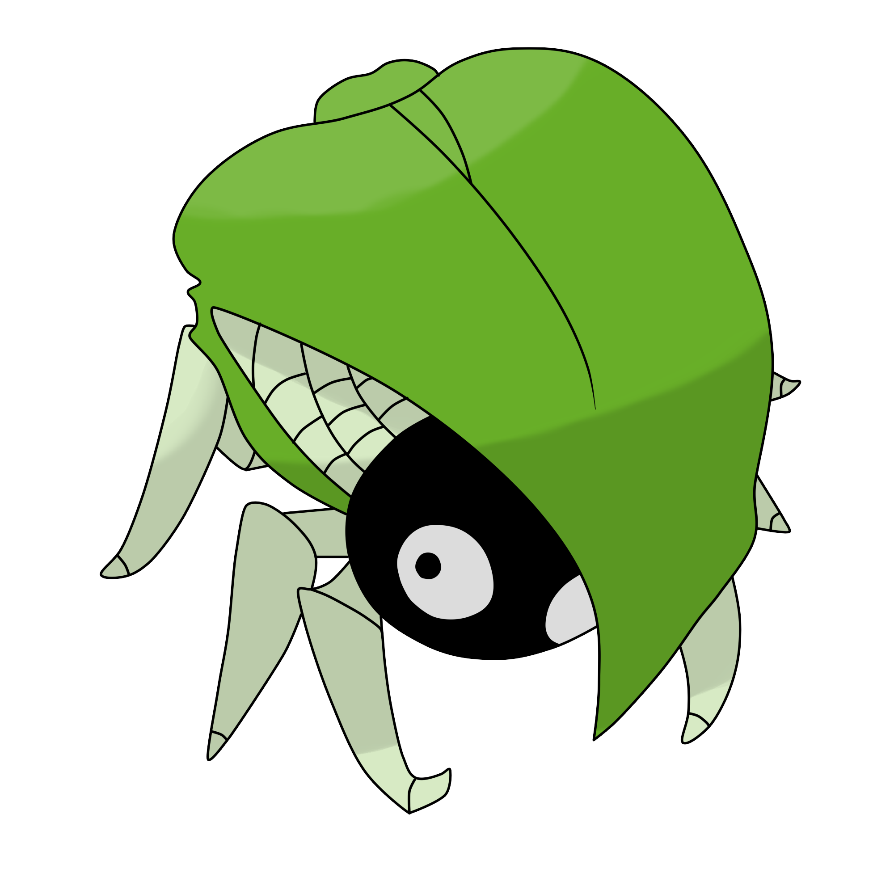
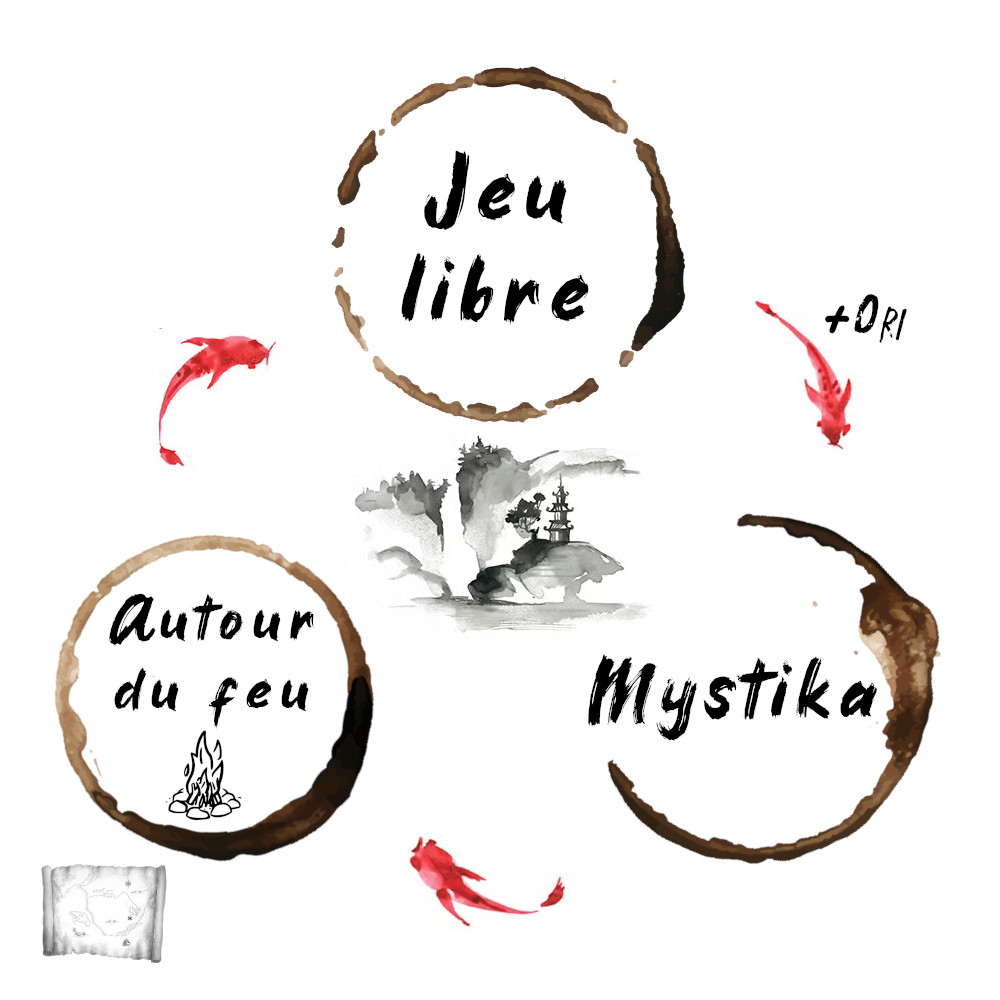
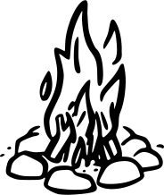
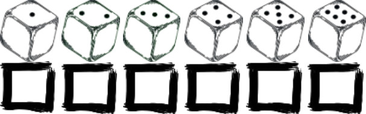
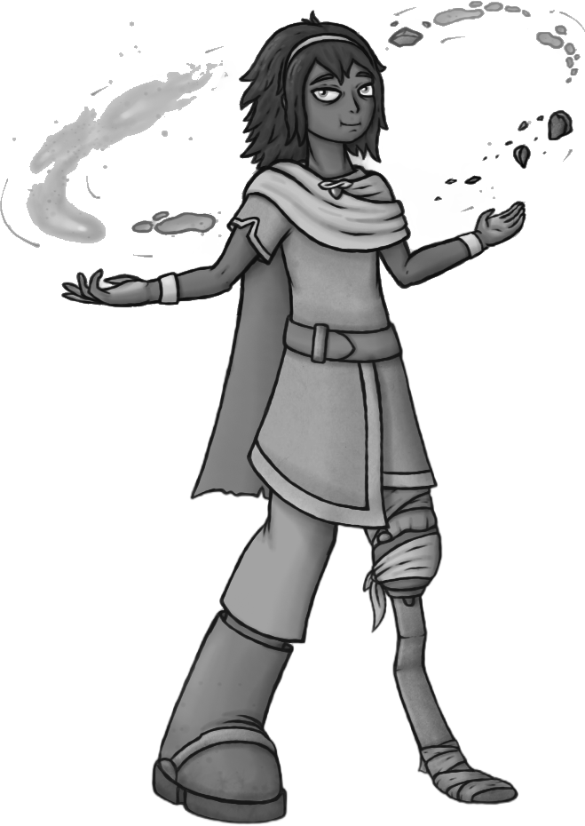
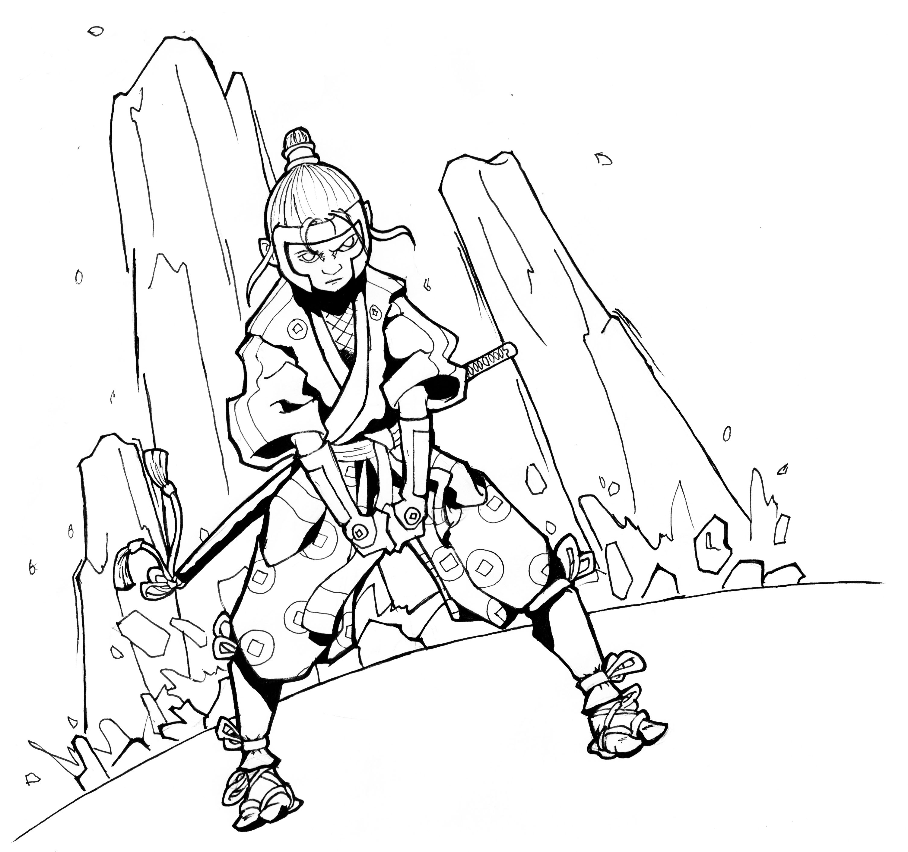
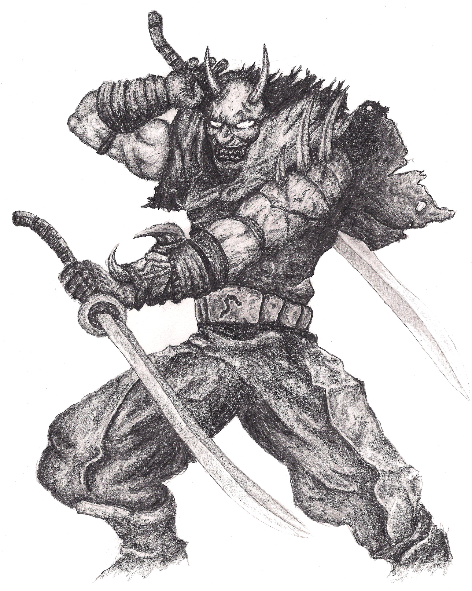
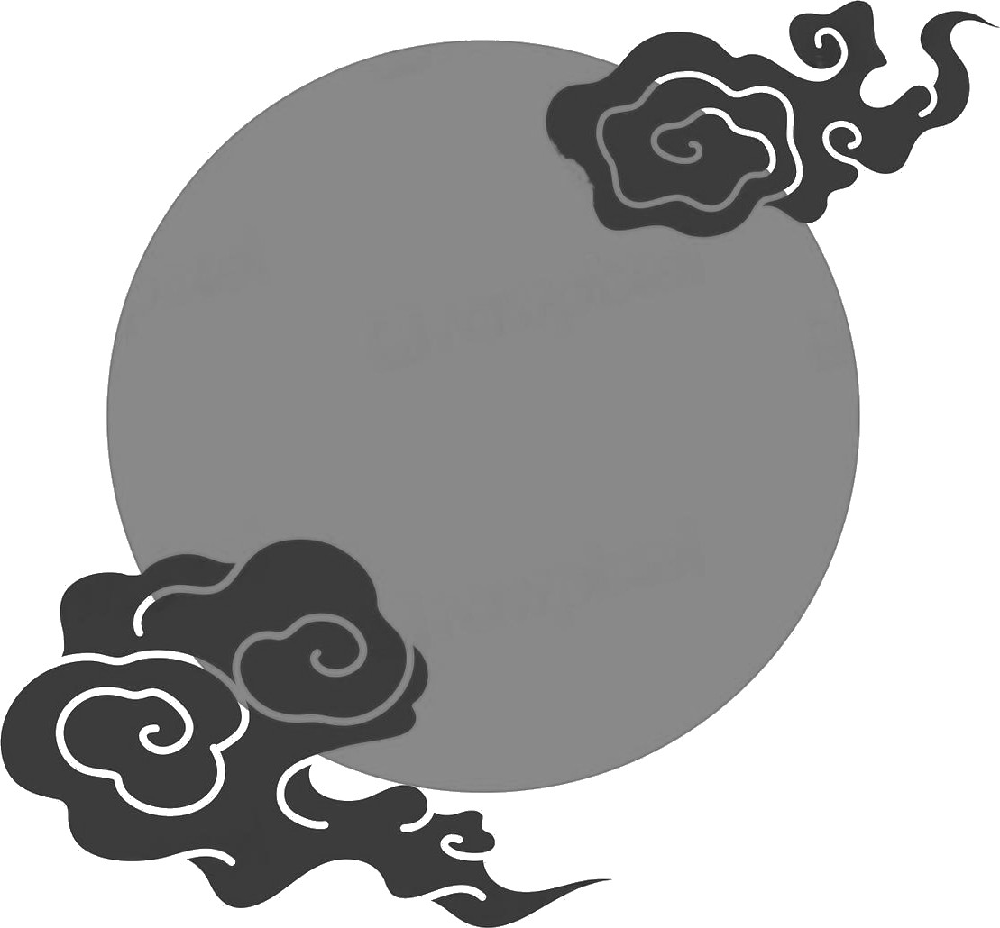
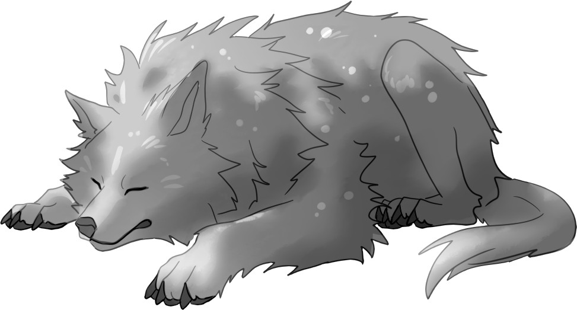
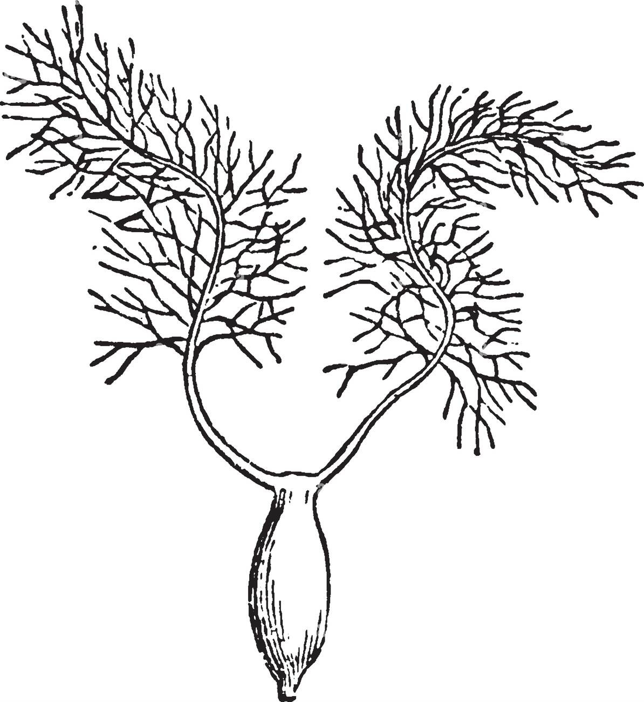

# Ori Mushi

::::: rules

 

Un jeu de rôle dans un univers de _fantasy_ inspiré du japon médiéval,
où les joueurs incarnent des komusō, des voyageurs ayant fait vœu d'aider la population,
et où des créatures nommées _mushis_ ont donné naissance à la magie.

**Inspirations**: Avatar le maître de l'air, Naruto, Princesse Mononoke, le Voyage de Chihiro, Zelda, Shadow of the Colossus, Okami, Ori & the blind forest, Mushishi, Usagi Yojimbo...

::: web-only
- Version PDF de ces règles: [OriMushi.pdf _(19 pages, 4,4 Mo)_](OriMushi.pdf)
:::

- Feuille de komusō : [FeuillePersonnage.pdf](OriMushi-FeuillePersonnage.pdf)
- Aides de jeu :
    + [OriMushi-VoiesDesPersonnages.pdf](character-sheets/OriMushi-VoiesDesPersonnages.pdf)
    + [VoeuxDesKomuso.pdf](layout/OriMushi-VoeuxDesKomuso.pdf)
    + [GameLoop.jpg](layout/GameLoop.jpg)
    + [Illustrations.pdf _(16 pages, 40 Mo)_](OriMushi-illustrations.pdf)
- Feuille de komusō pour partie de 30min : [FeuillePersonnageExpress.pdf](character-sheets/OriMushi-FeuillePersonnageExpress.pdf)
- Articles sur mon blog à propos de ce jeu : [tag ori-mushi @ chezsoi.org](https://chezsoi.org/lucas/blog/tag/ori-mushi.html)

### Sommaire

 
<ul class="toc" data-tags="h2"></ul>

::: page-break
:::

## Les terres connues
Le monde d'Ori Mushi est une forme de **Japon médiéval avec de nombreux éléments fantastiques** :
* la **magie** existe, et est enseignée à travers de nombreuses écoles de **jutsu**.
L'énergie magique provient de la parole et du **Mana**, parfois nommé chakra ou chi, provenant des **mushis**, des créatures élémentaires invisibles...
* tout individu possède un potentiel maveillant enfoui, un **Oni**, qui peut s'éveiller, le dévorer et le transformer en **démon**.
* les **komusō** sont un ordre respecté dans toutes les terres connues.
<!--
Ils possèdent une forte **indépendance**, mais vous pouvez les rattacher à une organisation de votre choix : gouvernement, religion, force militaire...
-->

### Géographie
Les terres connues ne sont volontairement **pas** décrites en détails afin de :
* vous permettre, MJ & joueurs, de les détailler par petites touches, au fur et à mesure de vos parties.
* d'inclure toutes les références que vous souhaitez à des univers de fiction existants, qu'il s'agisse de lieux, de personnages, d'organisations...

Ces lieux & régions sont des points de repère essentiels dans les terres connues :
* les **Basses Plaines** : région de vallées verdoyantes et de nombreuses rivières. Deux peuples y cohabitent : les _naikokujin_, qui mènent une vie sédentaire rurale; et les _nanbanjin_, nomades dont les villages de chars à voile se déplacent aussi bien dans les plaines herbeuses que sur la mer.
* les **Hautes Terres** : région montagneuse comportant de nombreux plateaux

::: page-break
:::

::: chronologie
## Chronologie
#### Les temps antiques
Il y a environ mille ans : <!-- Inspi : Dark Souls opening https://www.youtube.com/watch?v=e0l73vAlEBQ -->
* les **dragons** veillent sur le monde et guident les empereurs.
* cette époque voit les plus grandes merveilles être conçues :
la **Cité aux Mille Pages**, une véritable ville-bibliothèque; le **Théâtre des Cieux** de l'artisan-ingénieur Vitruve, immense et mobile; la **Tour de l'Infini**...
* la **Sculpteuse** conçoit initiallement les **Colosses** pour qu'ils déclament à travers les terres connues les vers du **Poète Endeuillé**.
* fondation de l'ordre des **komusō**.
#### La Guerre de l'Oubli
Il y a environ un siècle :
* une armée de **Onis**, des démons, ravage les terres connues, menés par l'empereur fou, **Enkidu**.
Ils massacrent les dragons, ainsi que tout un peuple, le **peuple oublié**.
Les grandes merveilles disparaissent.
* les premiers **Poètes-Sorciers** maîtrisent la magie du **Verbe**, et transmettent leurs jutsus pour lutter contre les Onis.
* les **Onis** sont finalement vaincus. Certains disent grâce à un enfant, **Gilga**, qui commandait aux Colosses. D'autres racontent qu'ils ont été enchaînés dans les cœurs des hommes.
#### Récemment
Ces dernières années :
* des Poètes-Sorciers ont remplacés les empereurs dans certaines régions :
**Oma la Cueilleuse de Mots**, souveraine des _naikokujin_;
**Hisaishi Inoue**, chef des _nanbanjin_.
* l'**Empereur des Hautes Terres** est mort. De tristesse à ce qu'on raconte.
:::

::: page-break
:::

## Mushis
Un **mushi** est un organisme vivant primitif et **invisible** aux yeux des humains.
Il en existe de différentes sortes, mais ils sont essentiels au bon fonctionnement des **écosystèmes** :
ils sont pour **les êtres vivants** tantôt un source d'**énergie** et de **nutriments**,
tantôt un **lien essentiel entre eux**.

Les mushis se comportent comme des micro-organismes, et ne semblent pas doués de conscience.
Bien qu'invisibles, ils peuvent être semblables à des colonies de fourmis, reliant des plantes dans une forêt, ou à des champignons tapissant une ruine.

Les mushis ne sont ni mauvais ni bienveillants,
ils sont constitutifs de la nature.

La plupart d'entre eux réagissent à un métal en particulier, **l'argent**, et à **la lune** :
certains se reproduisent en émettant des **spores** durant les nuits de pleine lune

Les mushis produisent naturellement du **Mana**,
une énergie permettant aux hommes de maîtriser la magie.

On raconte que les mushis convergent et se réunissent parfois entre eux.
On appelle cela un **Banquet des Mushis**.

 

### Quelques mushis
Les **fantômes** sont des mushis qui copient l'apparence, le comportement, la voix
de personnes décédées.

Les **ahoratos** sont des lichens rendant invisible ce qu'ils recouvrent.

Les **nerumushis** se nourrisent de sommeil.

Les **corbeaux liquides** suivent souvent les traces des Onis :
plus ceux-ci commettent de crimes et gagnent en puissance,
plus les corbeaux sont nombreux et agressifs, se nourrisant même parfois de cadavres humains.
On distingue leur silhouette lorsqu'il pleut.

 

 

## Ori versus Oni
Dans les terres connues, tout individu possède un démon intérieur, un **Oni**.
Ce Oni se nourrit de colère, de frustration, de peurs.

Chez la plupart des gens, ce Oni reste en sommeil et ne se développe jamais.

À l'inverse, certains individus choisissent de nourrir ce Oni,
pour obtenir en échange une grande puissance.
Cette voie mène néanmoins à une transformation en un véritable **démon**.

Le pendant du Oni est la sagesse, la lumière intérieure que peuvent développer des personnes, nommée **Ori**.

La progression en Oris d'un personnage représente son gain d'expérience.

 

::: page-break
:::

## Colosses
Également nommés **dogū**, ces gigantesques et mystérieux golems de pierre parsèment les terres connues.
Certains sont endormis, d'autres errent, répétant des gestes ou des trajets dont le rôle et le sens s'est perdu à travers les âges...

Peu de choses sont connues sur ces statues géantes.
Le Mana sert d'énergie à celles qui se déplacent encore.
Les Colosses gisants, que plus rien n'anime, semblent être un lieu de prédilection des mushis.

Certaines gravures, dans des temples ou sur les Colosses eux-mêmes,
mentionnent d'un énigmatique **Poète Endeuillé**, en lien avec ces créatures.
Ces dernières réagissent d'ailleurs souvent à la **musique**.

<!-- SOTC Colossus reveals:
1. https://youtu.be/U8rn9BZXaKY?t=885
2. https://youtu.be/U8rn9BZXaKY?t=1185
3. https://youtu.be/U8rn9BZXaKY?t=1438
4. https://youtu.be/U8rn9BZXaKY?t=1716
5. https://youtu.be/U8rn9BZXaKY?t=2005
-->

On raconte de nombreuses légendes à leurs sujets.
Certains disent en avoir vu s'affronter.
D'autres prétendent avoir vu des Colosses cultiver des fleurs.

::: page-break
:::

## Jutsus
Les jutsus sont des techniques mystiques ancestrales permettant de maîtriser différentes formes de magie.
Il existe une grande variété de familles :

::: same-size-2-cols

**Sable** : modeler du sable pour former toute sorte d'objets, le faire léviter, le projeter... | **Téléportation** : déplacement instantanné à courte distance de soi, d'un objet, d'un adversaire...
-|-
**Clonage** : se dupliquer, dupliquer un objet...| **Gravité** : intensifier ou supprimer la gravité dans une zone proche.
**Bois** : faire pousser des arbres extrêmement vite, modifier un objet dans cette matière... | 

:::

::: page-break
:::

## Le peuple oublié
{{ rand_img() }}

   

::: page-break
:::

## Les PJs sont des komuso
Avant que les joueurs ne créent leurs personnages,
informez-les de la nature de leur groupe :
il vont incarner des **komusō**.

Les PJs sont des personnes venant de conclure un apprentissage d'élite
(ou leur reconversion) dans un domaine, quel qu'il soit : artisan, savant, sorcier...

En échange de cette formation d'excellence qu'ils ont reçu,
ils ont accepté ensuite, pendant un an, d'assumer la fonction de komusō,
et pendant **un an** de former un groupe suivant les préceptes de cette charge :

 

* **Vœu d'Errance** : un komusō ne reste jamais plus de **trois nuits** dans un lieu, à moins d'une urgence vitale.
* **Vœu de Pauvreté** : un komusō ne conserve **jamais d'argent** pour lui. Il subsiste de la générosité des autres, qui leur offrent en général volontier le gîte et le couvert. Un komusō peut faire du troc.
* **Vœu d'Assistance** : un komusō accepte toujours d'**aider quelqu'un en difficulté**, de lui porter secours.
* **Vœu d'Impartialité** : un komusō se doit d'être **impartial** et **juste**. En cas de conflit, sans qu'ils ne possèdent la moindre autorité officielle, les komusō sont parfois sollicités comme juges impartiaux.
* **Vœu de Préserver la Vie** : un komusō ira jusqu'à **se battre pour une vie**. Il protège également **la nature**, animaux, plantes et autres créatures.

En-dehors de ce code moral, les komusō sont d'origines très diverses.
Ils ont souvent des connaissances et des compétences très complémentaires au sein d'un groupe,
pouvant parfois même provoquer des tensions.

 

Ils doivent tous respect et obéissance à un **daïmio**,
qui a sélectionné les membres du groupe des komusō, et à qui ils rendent compte.
Il peut parfois leur demander d'accomplir certains missions spécifiques.

 

Au terme de leur mission de komusō, l'appréciation finale du daïmio sera cruciale pour la poursuite de carrière des PJs dans leur activité.

 

D'un point de vue ludique et narratif,
cette contrainte sur la nature du groupe des PJs
offre plusieurs avantages :
* ils n'ont pas le choix de travailler ensemble.
* ils ont des objectifs communs, propices à générer de belles aventures.

Les Vœux des komusō sont sources de points d'expériences :
un joueur sauvant une vie en danger ou épargnant un adversaire meutrier gagne **+1 Ori**.

::: page-break
:::

## Boucle de jeu
Dans Ori Mushi, le jeu alterne entre trois phases :

## Jeu libre
Durant cette phase de jeu, chaque joueur incarne son komusō,
et est totalement libre de ses actions et paroles.
C'est le mode de jeu « classique » de la plupart des jeux de rôle.

L'un des vœux des komusō étant l'**itinérance**, ils voyagent sans cesse de lieu en lieu.
À chaque fois que les komusō migrent d'un lieu pour se rendre dans un autre,
passez aux phases de jeu suivante :
1. _Mythos_
2. _Autour du feu_

  

## Mythos
Durant cette phase narrative, les joueurs inventent ensemble une légende fascinante,
une histoire qui se transmet de village en village.

Une bande son calme, poétique, envoutante est idéale pour cette phase.
Suggestions : [Mushishi](https://www.youtube.com/watch?v=brsJ19kclwc),
[Ori and the Blind Forest](https://www.youtube.com/watch?v=OvpnMT-iqCM).

Au début du Mythos, **chaque joueur lance un dé**,
à tour de rôle dans le sens des aiguilles d'une montre,
en commençant par le dernier a avoir agit durant la précédente phase de Jeu libre.
Il place ensuite le dé obtenu dans l'une des tables suivantes.
Et ainsi de suite jusqu'à ce qu'un dé soit placé sur chaque table.

:::: side-by-side
::: borderless with-headings text-small width-50pc

Dé | Avec une touche...
-|-
⚀ | dramatique, tragique
⚁ | mélancolique, nostalgique
⚂ | enfantine, merveilleuse
⚃ | fascinante, de mystère
⚄ | de grandeur, de gigantisme, 
⚅ | _feel good_

:::
::: borderless with-headings text-small width-50pc

Dé | Fait intervenir
-|-
⚀ | un Colosse
⚁ | un mushi
⚂ | un Oni
⚃ | le peuple oublié
⚄ | de la magie
⚅ | un komusō
7+ | un PJ
:::
::::

:::: side-by-side
::: borderless with-headings text-small width-50pc

Dé | Période
-|-
⚀⚁ | il y a environ mille ans
⚂⚃ | il y a environ un siècle
⚄⚅ | il y a quelques années
7+ | dans plusieurs années

:::
::: borderless with-headings text-small width-50pc

Dé | Format
-|-
⚀⚁ | Question-Réponses
⚂⚃ | Haïkus
⚄⚅ | Artefact
<!-- Journal de bord de XXX -->
:::

<!-- Autres tables : élément (pierre / eau / bois / temps / sable) -->
::::

::: callout
Gardez en têtes ces grands principes durant le Mythos :
* tout n'a pas à être **cohérent** : les légendes ne sont jamais complètement véridiques, et elles se contredisent souvent
* le récit doit rester relativement **court**
* si tous les éléments des tables ne sont pas exploités, tant pis. Elles sont là pour vous inspirer. Il est plus important d'inventer **une belle légende**, que d'y introduire des éléments de manière trop artificielle.
:::

La table "Format" indique **comment** sera inventée l'histoire collective,
la section suivante détaille cela.
Les autres tables définissent des éléments qui devront intervenir dans l'histoire.
Le joueur qui place le dé doit en particulier être vigilant à cela.

### Format : question-réponses
* le MJ pose une question à chaque joueur, à tour de rôle, jusqu'à ce que tous les joueurs aient répondu à une question
* chaque **autre** joueur propose une réponse
* la joueur à qui la question a été posée choisit la réponse qu'il préfère, ou un mélange de réponses

:::: side-by-side narrow
::: text-small width-50pc
**Colosses**

1. Parfois, on peut observer des Colosses immobiles, produisant une **étrange mélodie**. Qu'est-ce qui rend cette musique si particulière ?
1. Durant leur errance sans fin, les Colosses **évitent soigneusement des zones** en particulier, lesquelles ?
1. Le plus grand des Colosses a été baptisé **Bilgamesh**. Pendant longtemps, une épreuve de courage fut de l'escalader. Quel objet emblématique a ainsi été planté **à son sommet** ?
1. 
1.
1. Un Colosse s'est effondré sur une ville, causant des centaines de morts. Que s'est-il passé ?
:::
::: text-small width-50pc
**Mushis**

1. Les _nerumushis_ se nourrisent de sommeil. Comment libérer une personne prisonnière d'un _nerumushi_
1. 
1. 
1. 
1. 
1. 
:::
::::

:::: side-by-side narrow
::: text-small width-50pc
**Onis**

1.
1.
1.
1.
1.
1.
:::
::: text-small width-50pc
**Le peuple oublié**

1.
1.
1.
1.
1.
1.
:::
::::

:::: side-by-side narrow
::: text-small width-50pc
**Magie & merveilles**

1. Comment la Cité aux Mille Pages a brûlé ?
1.
1. 
1. dragons
1.
1.
:::
::: text-small width-50pc
**Komusō & personages antiques**

1.
1. Vitruve
1. Enkidu
1. Gilga
1. Poète Endeuillé
1. Sculpteuse
1.
:::
::::

### Format : haïkus
Dans ce format, vous allez décrire une succession de **scènes** et d'ambiances,
formant un poème ou une balade, qui se transmet souvent accompagné de musique.
Le lien entre ces scènes ne sera pas explicité, et c'est à chacun de se forger une idée de ce qui les relier à travers le temps et l'espace.
Chaque scène est un haïku, une strophe du poème.

Le MJ peut choisir de participer ou non à cette phase.

**Déroulé** : à tour de rôle, chaque joueur énonce une phrase décrivant une **scène** ou une ambiance, pour former une succession de haïkus.
* n'importe quel joueur inspiré énonce la première phrase du premier haïku. Il est alors chargé d'inscrire toute la strophe sur la Feuille des Haïkus.
* en tournant dans les sens des aiguilles d'une montre, chaque joueur annonce une phrase à son tour.
* après un temps de réflexion, un joueur peut passer son tour.
* si possibe, la troisième phrase doit clôturer chaque haïku, puis la quatrième débuter un nouveau haïku, et ainsi de suite.
* ne respectez pas strictement les règles de composition des haïku : une strophe peut contenir 4 ou 5 phrases, le nombre de syllabes importe peu, une césure (_kireji_) à la fin est bienvenue mais pas nécessaire, etc.
* **le poème est fini** lorsque tous les joueurs sont satisfaits du poème, et que plus personne n'est inspiré pour débuter de nouveau haïku.

<!-- TODO : ajout exemples -->

### Format : artefact
Le MJ participe à cette phase comme les autres joueurs.

Le joueur qui a placé son dé sur cette table choisit un artefact
en possession d'un komusō du groupe, ou mentionné précédemment durant une partie.
Il désigne ensuite un joueur en lui passant son dé.

**Déroulé** :
* chaque joueur doit décrire une brève scène ou l'artefact était impliqué.
* le premier joueur doit décrire l'origine de l'objet, comment il a été conçu.
* la description doit s'attacher à décrire une scène préciser, sans nécessaire donner d'explications.
* les autres joueurs peuvent ensuite faire des commentaires, et poser des questions sur des détails de la scène.
* enfin, le joueur qui a décrit la scène transmet le dé un autre joueur, pour qu'il narre une autre scène impliquant l'artefact, située chronologiquement plus tard dans la vie de l'objet.
* une fois que tous les joueurs ont décrit au moins une scène, n'importe quel joueur qui reçoit le dé peut décider d'arrêt cette phase de narration.

::: page-break
:::

### La carte des terres connues
Au fur et à mesure de leur pérégrinations, les komusō tracent une **carte des terres connues**.
Au terme de la phase Mythos, les joueurs complètent cette carte :
* ils peuvent y ajouter des **lieux**, issus de leur dernier voyage où du Mythos
* ils peuvent y dessiner ou mentionner des **personnages** ou des **points d'intérêt** notables

Cette carte mentionne les lieux notables traversés par le groupe,
et éventuellement des éléments sur le relief, les cours d'eau,
l'environnement en général et les bâtiments découverts en chemin.

En tant que MJ, lors de votre première partie, vous pouvez au choix :
* donner une **feuille A4 vierge** à vos joueurs
* fournir un **fond de carte** de votre univers favori, ou dessinée par vos soins

La carte doit comporter une **rose des vents** indiquant les directions cardinales : Nord, Sud, Est, Ouest.
Elle doit aussi comporter **les signatures des komusō**, qui attestent de sa validité.

À chaque fin de partie, un joueur du groupe se dévoue pour compléter la carte.
Le PJ de ce joueur gagne **+1 Ori** s'il inclut au moins un tout petit **dessin** d'une plante, d'une créature ou d'un personnage qu'ils ont rencontré.

  

::: page-break
:::

## Autour du feu

Durant cette phase, les joueurs incarnent leurs personnages, au terme d'une journée de voyage,
alors qu'ils se retrouvent traditionnellement autour d'un feu de camp.

Il s'agit d'une courte séquence axée sur le _roleplay_, où les joueurs sont encouragés à :
* partager avec les autres komusō ce que leur personnage a **ressenti** durant leur dernière étape
* revenir sur ce que certains de **leurs camarades ont fait**
* discuter de **leur mission** : est-ce qu'il l'accomplissent correctement ? Est-ce qu'ils l'envisagent tous de la même manière ?
* évoquer les **rêves et ambitions** de chacun
* émettre des hypothèses sur les **grands mystères** des terres connues : Colosses, mushis, légendes...

Durant cette, le MJ peut participer durant les "blancs" de la discussion pour décrire l'environnement autour des komusō.

::: page-break
:::

## Créer son komuso
Chaque joueur :
* choisit sa **Voie**
* choisit parmis les 3 duos d'options concernant leur origine
* choisit et coche **3 compétences**
* choisit un artefact
* choisit une mauvaise habitude : _section en cours de rédaction..._
* débute avec 0 Ori
* débute avec 1 Oni : il remplit les 5 cases de droite de la jauge associée
* (selon Voie) débute avec 3 Mana : il remplit 5 cases de la jauge correspondante
* (si Poète-Sorcier) débute avec un jutsu et une technique maîtrisée

::: page-break
:::

### Artefacts
Les artefacts sont des objets spéciaux uniques, magiques ou d'excellente facture,
et leur possesseur les manipule avec virtuosité.
Deux PJs ne peuvent pas avoir le même. 

 

**Bâton télescopique** : peut être employé tout autant comme une arme, que comme un moyen de prendre de la hauteur | **Grappin téléscopique** : comme dans Zelda ou Batman | **Arc à flèches soniques** : propulse des flèches éthérées, illimitées et aux multiples propriétés : elles peuvent sonner l'alarme, assourdir, trancher en deux de petits objets, etc. 
-|-
**Amulette de feu** : produit d'intenses flammes | **Gant de bourrasque** : projette de l'air | **Cape d'invisibilité** : permet de camoufler une seule personne, ne supprime pas le son
**Instrument de musique** : dont la sonorité appaise toute créature | **Grande plume volante** | **Masque** permettant de changer de visage
**Boomerang guidable** | **Loupe à mushis** | **Katana tranche-tout**

::: page-break
:::

### Voies
::: same-size-2-cols

_cf._ [OriMushi-VoiesDesPersonnages.pdf](character-sheets/OriMushi-VoiesDesPersonnages.pdf)

#### Maître-Artisan
Je veux maîtriser toutes les formats d'artisanat, pour construire les objets les plus beaux et utiles,
et leur insuffler un peu d'âme.

<!-- Mystère/objectif "fil rouge" : découvrir l'origine des Colosses, réveiller un -->

#### Artiste-Conteur
Je raconte de manière captivante les plus incroyables histoires.
Je sais un captiver un public avec jonglage, tours de passe-passe, ombres chinoises, etc.

<!-- Mystère/objectif "fil rouge" : découvrir la véritable histoire du Poète Endeuillé / sa tombe / des Colosses -->

#### Mushishi
J'étudie et m'efforce d'apaiser mushis et Colosses.

<!-- Mystère/objectif "fil rouge" : ? TODO -->

#### Poète-Sorcier
Je maîtrise l'art du Verbe, et les jutsus magiques.

<!-- Mystère/objectif "fil rouge" : découvrir la véritable histoire du Poète Endeuillé / sa tombe -->
:::

::: page-break
:::

## Jets de dés
1d6 minimum, **+1d6** par compétence et artefact applicables.
Selon le meilleur résultat obtenu aux dés :

* ⚅ : c'est réussi !
* ⚄ : c'est réussi **mais**...
* ⚃ : c'est raté **mais**...
* ⚂ / ⚁ / ⚀ : c'est raté

De plus :
* si deux ⚅ sont obtenus : c'est une **réussite épique** ! <!--, **le joueur décrit la scène** -->
* si deux ⚀ sont obtenus : c'est un **échec critique**
* sur un ⚄ ou ⚃, le MJ peut également proposer un **dilemme** :
  le joueur se voit proposer un choix cornélien entre deux options exclusives.
  Son personnage peut par exemple obtenir quelque chose au prix d'un sacrifice,
  ou bien se rabattre sur une réussite partielle.
* actions **difficiles** : lorsque le personnage d'un joueur tente d'accomplir une véritable prouesse, une action à la limite de ses capacités, le MJ peut alors indiquer qu'au moins **deux dés de valeur** ⚄ ou ⚅ sont nécessaires pour réussir l'action.
* actions **en opposition**, comme par exemple un affrontement : un jet est effectué par personnage, **celui obtenant le plus de** ⚅ l'emporte. En cas d'égalité, on considère les ⚄. Si l'égalité persiste, aucun personnage n'a l'avantage.
* actions **conjointes** : un personnage assistant un autre à réaliser une action lui octroie **un dé bonus**, si cette aide est jugée pertinente par le MJ.

 

::: page-break
:::

### Récupération du Mana
Mushishi & Poète-Sorcies canalisent le Mana dans leur corps, constituant ainsi une **réserve**.

Lorsque son komusō est dans un lieu où vivent des mushis,
lorsqu'un joueur effectue un jet, pour chaque face de dé obtenue,
il peut cocher la case correspondante sur sa feuille de personnage,
dans la table de récupération de Mana :

Lorsque les 6 cases sont remplies, le personnage récupère **+1 dé** de Mana et efface toutes les cases.
Le réserve de Mana se regénère également complètement après quelques heures à méditer auprès de mushis.

### Règles d'emploi des jutsus
Employer un jutsu nécessite **1 point de Mana** canalisé, et un jet de dé.
Un personnage maîtrisant un jutsu, peut tenter n'importe quelle technique propre à cette famille.
Il est aussi possible de devenir expert d'une **technique** en particulier, et de gagner ainsi **+1 dé** au lancer lorsqu'on l'emploie.

Certains artefacts rares peuvent également conférer **+1 dé** au lancer pour une famille de jutsu spécifique.

 

## Canaliser son Oni
Un Oni peut être canalisé pendant un bref moment pour fournir un pouvoir de concentration et une pulsion d'énergie à son porteur.

Sur sa feuille de personnage, un joueur peut cocher une case libre de sa **jauge de Oni**.
S'il fait ainsi, il gagne pendant quelques minutes en bonus **à tous ses jets**
un nombre de **dés égal à son rang d'Oni** :
durant tout une scène, son personnage sera plongé dans une rage concentrée.

::: page-break
:::

### Devenir berserk
Si un joueur obtient un double ⚀ durant une phase où il canalise son Oni,
il devient **berserk**, et passe sous le contrôle du MJ.

Un joueur peut choisir de **consommer 1 Ori** pour éviter cette transformation.

Un berserk se comporte selon le résultat d'un jet dans cette table :

::: borderless right-align-col-1 with-headings

Dé | Attitude
-|-
⚀⚁ | Le berserk s'attaque au PJ le plus proche.
⚂ | Le berserk s'attaque au PNJ le plus proche.
⚃ | Le berserk s'enfuit.
⚄⚅ | Le berserk s'attaque à un adversaire. S'il n'y en pas, relancé le dé.

:::

 

::: page-break
:::

### Devenir un démon
Lorsqu'un personnage atteint le rang 5 d'Oni, des traits démoniaques commencent à apparaître sur son corps.
Lorsqu'il atteint le rang 6, encore plus de traits apparaissent.
Lancez un dé au rang 5 puis deux dés au rang 6 : ⚀: des oreilles pointues ; ⚁: des griffes ; ⚂: une machoire carnassière ; ⚃: la peau rouge; ⚄: des écailles; ⚅: des cornes.

Lorsqu'un personnage ayant un rang Oni 6 coche la dernière case de sa jauge,
il joue sa dernière scène puis devient un démon, joué comme un PNJ par le MJ.

 

::: page-break
:::

## Progression
Au fur et à mesures des aventures des PJs, ils obtiennent des **Oris**,
représentant l'expérience acquise et leur actions en alignement avec leur code moral.

::: borderless right-align-col-1 with-headings

Situation | Progression
-|-
Échec critique ⚀⚀ | +1 Ori
Répondre à un appel à l'aide | +1 Ori
Sauver / épargner une vie | +1 Ori
Motivation liée à sa Voie | +1 Ori
Compléter la carte | +1 Ori

En dehors de l'échec critique, tous les gains d'Oris se font en fin de session de jeu,
lorsque les komusō reprennent leur voyage.

Ces Oris peuvent être dépensés pour faire évoluer les PJs :

Coût | Donne accès à
-|-
3 Oris | une nouvelle compétence
4 Oris | un nouvel artefact
3 Oris | une nouvelle technique de jutsu
3 Oris | +1 réserve de Mana d'un jutsu
3 Oris | +1 rang Oni & jauge vidée -> les Oris sont **perdus**

:::

::: page-break
:::

L'acquisition de compétences / artefacts / techniques jutsu n'est possible que dans ces conditions :
* durant une ellipse temporelle entre deux lieux / scénarios
* le PJ doit avoir **convaincu un senseï** de lui transmettre son savoir
* pour les techniques jutsu, il est aussi possible d'apprendre une sort improvisé lors d'une partie précédente

## Santé
_Section en cours de rédaction..._

 

::: page-break
:::

## Version Express
Cette version du jeu est destinée à des parties très courtes, d'une heure environ.
Inspiré du [scénario de Kalwrynn pour initier au jeu de rôle intitulé "Mener en 30min"](http://www.lulu.com/fr/fr/shop/kalwrynn/mener-en-30mn/ebook/product-24254652.html),
ce mode de jeu se veut volontairement très simple et épuré,
pour offrir aux joueurs en une heure un aperçu du jeu.

### Création de personnage en 5min
1. Choisissez votre apparence et **un artefact** (arme, objet magique...) parmi les illustrations,
ou inventez-les ! Les artefacts sont des objets magiques ou que leur possesseur maîtrise avec virtuosité.

2. Inscrivez sur votre feuille de personnage son **nom**, son **activité** et cochez **3 compétences**.

L'**inventaire** de départ des personnages est complètement libre :
il s'agit de tous les objets qu'ils souhaiteraient transporter sur eux.
Ces objets n'étant pas _spéciaux_, ils n'octroient pas de dé supplémentaires lors des jets.## Éléments clefs à établir en début de partie
- « L'histoire se déroule dans un japon médiéval imaginaire. Il existe de la magie et des monstres. »
- Le meneur de jeu demandera des jets aux joueurs pour les actions risquées de leurs personnages.
- Les joueurs se connaissent déjà et voyagent ensemble, et c'est d'ailleurs leur objectif commun : explorer les terres connues... et inconnues !
Ils ont déjà traversé de nombreuses contrées et aidé bien des gens.

 

## Scène 0 - Course poursuite !
Bien que cela rallonge légèrement la durée de la partie, je trouve très judicieuse l'idée de Kalwrynn de commencer _in media res_.

Je vous suggère donc de commencer la partie en décrivant rapidement un joli décor de chemin de terre sinuant
parmi les champs et les herbes folles, par une paisible après-midi printanière, au pied d'une montagne...
Où les personnages des joueurs descendent le chemin en pente à perdre haleine,
poursuivis par un troll-kappa dont ils ont piétinés le jardin par mégarde !
Cette créature, sorte de taupe humanoïde avec un bec, est fâchée et pas du tout disposée à discuter !

Décrivez aux joueurs les environs pour leurs donner quelques idées d’échappatoire :
l'orée de la forêt de bambous, la descente un peu raide vers un lac, les hautes herbes balayées par le vent...

Au terme de cette scène, les joueurs doivent rejoindre le village, par le chemin ou le lac,
quitte à faire une ellipse ou à indiquer qu'il s'agit de l'étape suivante de leur voyage,
où on leur a vanté une recette locale de poisson frit...

::: page-break
:::

 

## Ressources

 

### Illustrations
S'inspirant de [Sventovia](http://legrumph.org/Terrier/?Jeux-de-role/Sventovia) du Grümph,
nous vous encourageons à imprimer des images au préalable, pour faciliter l'immersion des joueurs :
des illustrations de personnages et ce dont ils peuvent s'équiper (armes & objets).

Vous trouverez dans ce PDF 12 illustrations de personnages des joueurs,
4 de PNJs, 6 de différents artefacts, et enfin une illustration de l'esprit-dragon :
[OriMushi-illustrations.pdf _(12 pages, 13 Mo)_](OriMushi-illustrations.pdf)

### Ambiance musicale
Quelques suggestions de bande sons originales :
[Okami](https://www.youtube.com/watch?v=JAfXYXwykFI),
[Princess Mononoke](https://www.youtube.com/watch?v=LKI9aczEL3g).
--> à insérer comme suggestion pour chaque phase

Bande son YouTube : [Ori Mushi](https://www.youtube.com/playlist?list=PLLgE-ga3W_kbktCFQcCk_AIr3UqNLBRGI)

### Cartes de lieux
Si vous aimez avoir un support visuel pour vos parties, voici quelques belles cartes qui peuvent parfaitement servir de support à une partie d'Ori Mushi :

* [Bains japonais - Czepeku](https://www.czepeku.com/store/product/steamy-japanese-bathhouse)
* [Sanctuaire de la forêt - Czepeku](https://www.czepeku.com/fr/store/product/forest-shrine-festival)
* [Monastère des cerisiers en fleurs - Czepeku](https://www.reddit.com/r/dndmaps/comments/mo9udv/cherry_blossom_monastery_21x49/?show=original)
* [Cache du Oni - Ferme de riz - Czepeku](https://www.reddit.com/r/battlemaps/comments/q3dkqc/oni_hideout_spring_23x36/)

::: page-break
:::

## Illustrations sélectionnées - non encore placées

 

 

 

 

 

 

 

 

::: page-break
:::

## Glossaire
JdR
: jeu de rôle

MJ
: Meneur ou Meneuse de Jeu

PJ
: Personnage d'une Joueuse ou d'un Joueur

One-shot
: courte partie de JdR isolée, sans qu'il ne soit prévu de suite

Campagne
: ensemble de parties de JdR se suivant pour former une continuité, où l'on retrouve les même personnages dans le même univers

Expérience (XP)
: à rédiger

::: page-break
:::

## Licence, sources & remerciements

_Ori Mushi_ a été conçu par [Lucas Cimon](https://chezsoi.org/lucas/blog/), il est placé sous license <a rel="license" href="http://creativecommons.org/licenses/by-nc-sa/4.0/">Creative Commons Attribution-NonCommercial-ShareAlike 4.0</a>.

Ce jeu est diffusé à prix libre.
Si vous souhaitez me soutenir, vous pouvez me faire un don sur [lucas-c.itch.io](https://lucas-c.itch.io).
Les fichiers sources ayant permis de générer ce PDF sont disponibles [sur GitHub](https://github.com/Lucas-C/jdr/tree/master/OriMushi).
Cette version est la v0.4.

Je serais ravi d'avoir vos retours si vous jouez à ce jeu !
Racontez-moi comment s'est passée votre partie via un commentaire [lucas-c.itch.io](https://lucas-c.itch.io) ou sur [mon blog](https://chezsoi.org/lucas/blog/pages/jeux-de-role.html).

Merci enfin aux développeurs des [logiciels libres](https://fr.wikipedia.org/wiki/Free/Libre_Open_Source_Software) employés pour réaliser ce jeu : [le navigateur Firefox](https://www.mozilla.org/fr/firefox/), [le logiciel de dessin Gimp](https://www.gimp.org/), [l'éditeur de texte Notepad++](https://notepad-plus-plus.org/), [le lecteur de PDF Sumatra PDF](https://www.sumatrapdfreader.org), [le language de programmation Python](https://www.python.org/), les bibliothèques de code [mistletoe](https://pypi.org/project/mistletoe/) & [weasyprint](https://weasyprint.org/).

 

::: thanks
Polices : [Odachi](https://www.behance.net/gallery/59783897/Odachi-Free-Brush-Font)
& [Xangda Shiny](https://www.fontspace.com/starinkbrush/xangda-shiny).

Illustrations employées :
- [Epic Chibi Ninja par dmr12890](https://www.deviantart.com/dmr12890/art/Epic-Chibi-Ninja-129862000) - [CC BY-NC-SA 3.0](https://creativecommons.org/licenses/by-nc-sa/3.0/)
- [Kyoshi Earthbender Lineart par Aedo Sama](https://www.deviantart.com/aedo-sama/art/Kyoshi-Earthbender-Lineart-215736017) - [CC BY-NC-SA 3.0](https://creativecommons.org/licenses/by-nc-sa/3.0/)
- [magic circle 2 par NNao](https://www.deviantart.com/nnao/art/magic-circle-2-216221240) - [CC BY-NC-SA 3.0](https://creativecommons.org/licenses/by-nc-sa/3.0/)
- [Kappa koopa](https://www.deviantart.com/weremagnus/art/Kappa-koopa-53098269) & [Noh Demon par weremagnus](https://www.deviantart.com/weremagnus/art/Noh-Demon-39665536) - [CC BY-NC 3.0](https://creativecommons.org/licenses/by-nc/3.0/)
- [HUNTING - Familiar Wolf par Kindya-Island](https://www.deviantart.com/kindya-island/art/HUNTING-Familiar-Wolf-982938883) - [CC BY-NC 3.0](https://creativecommons.org/licenses/by-nc/3.0/)
- [Nature waterfall 2 par MHoltsmeier](https://www.deviantart.com/mholtsmeier/art/Nature-waterfall-2-963933789) - [CC BY 3.0](https://creativecommons.org/licenses/by/3.0/)
- [Zuko fanart par CodeTheCod](https://www.deviantart.com/codethecod/art/Zuko-fanart-902243721) - [CC BY 3.0](https://creativecommons.org/licenses/by/3.0/)
- [League of Legends - Shen / Blood Moon par Spellshuei](https://www.deviantart.com/spellshuei/art/League-of-Legends-Shen-Blood-Moon-296075743) - [CC BY 3.0](https://creativecommons.org/licenses/by/3.0/)
- [Quick samurai sketch par hidanbasher](https://www.deviantart.com/hidanbasher/art/Quick-samurai-sketch-566443259) - [CC BY 3.0](https://creativecommons.org/licenses/by/3.0/)
- [Pirate Map 1 par TheStockWarehouse](https://www.deviantart.com/thestockwarehouse/art/Pirate-Map-1-845443862) - [CC BY 3.0](https://creativecommons.org/licenses/by/3.0/)
- [DnD Stone Elemental par Lady of Hats](https://commons.wikimedia.org/wiki/File:DnD_Stone_Elemental.png) - [CC0](https://creativecommons.org/publicdomain/zero/1.0/deed.en)
- [Japanese Style Link Art Border Frame](https://www.vecteezy.com/png/32163325-japanese-style-link-art-border-frame-ai-generative) @vecteezy.com
- [parapluie-écran-chinois](https://pixabay.com/fr/photos/parapluie-%C3%A9cran-chinois-chine-japon-898076/) @pixabay.com
- [Decorative Ying Yang sign](https://freesvg.org/vector-clip-art-of-decorative-ying-yang-sign) @freesvg.org - domaine public
- [Image from _"A handbook of cryptogamic botany"_ (1889)](https://www.flickr.com/photos/internetarchivebookimages/20102877173/) - domaine public
:::
:::::

<!-- Next:
* Voies : faire + de lien liens avec Voies des autres PJs
    -> Mushishi botaniste: classification mushis à compléter par PJs ?
    -> check clefs Lady Blackbird : inspis à en tirer ?
* définir quelques éléments de comportement des Colosses & mushis : ils se nourrissent ? 
* compléter questions-réponses
* rédiger section Santé
* Oris/XPs ?

Lore :
* nom du daïmio : Mokabe

Gameplay:
+ prévoir que le système / les FPs des joueurs évoluent au fur et à mesure des parties ?

Scénarios:
+ découverte de la Tour de l'Infini, qui possède de nombreuses portes (la plupart fermées), s'ouvrant dans de nombreux lieux des terres connues
+ découverte du Théâtre des Cieux, recouvert d'ahoratos

Twists:
+ Gilga est devenu Oni
+ les PJs mettent la main sur un recueil de haïkus, celui que les joueurs ont composé !
  -> c'est un des objectifs de l'Artiste-Conteur pour passer au palier 3
+ une fois 5 ou 6 Colosses placés sur la carte, il est aisé d'imaginer un symbole à partir de ces points.
  Le MJ peut alors employer ce symbole dans une enigme...

Mise en page :
- trouver un symbole pour les Oris
- Ajouter de jolis ornements en header/footer de pages
    Chinese landscape painting: https://github.com/LingDong-/shan-shui-inf
    https://github.com/watabou/CompassOS
    https://github.com/emmiegit/canji : procedural kanji generator (Python)
    and/or https://github.com/AdrianMargel/glyphs
    https://github.com/CiaccoDavide/Alchemy-Circles-Generator
    or https://github.com/AdrianMargel/alchemy-circles
    or https://game-dev-goose.itch.io/magic-circle-generator ($20)
- Expliquer en détail le fonctionnement des cases à cocher de la FP / les étapes de la créa de PJ
- formatter les règles (jets + tables) en une seule page A4
- SpellCheck
- Illustrations.pdf : add section titles + more images of equipments & places
- Remplacer Odachi par typo / font plus adaptée / lisible pour dyslexiques ?
- Ajouter des boutons dans les scénarios pour lire des morceaux de musique ?

Com'
* transformer https://lucas-c.github.io/jdr/OriMushi/ en un "hub" promouvant un kit de découvert et la version papier
* exposer une 2e page web référencée dans le livre, avec tous les liens vers les ressources PDFs du jeu
* https://www.reddit.com/r/Mushishi

Site web
* partage de haïkus
* partage de lieux sur carte partagée
* partage de personnages
* #hashtag sur réseaux sociaux pour partager des cartes

Refs for illus hand-drawn-asian-style-tattoo-illustration*.jpg :
<a href="https://www.freepik.com/free-vector/hand-drawn-asian-style-tattoo-illustration_79302251.htm#fromView=keyword&page=1&position=19&uuid=8d653419-e11f-4883-a72c-8510e20dab2e&query=Japanese+Retro">Image by pikisuperstar on Freepik</a>

Illustrations not free:
* https://www.deviantart.com/niloadoptables/art/open-Ai-Adoptable-5366-1139413431 - girl - 8$

Partie du 2/01/2025 avec 3 jeunes, à la Possonière, avec Donatien :
* Sunraku (Marwann) : Mushishi - Jutsu
* Aether (Leyline) : Apothicaire - Jutsu
* Sasukeden (Aïden) : Ronin - Jutsu
-->

