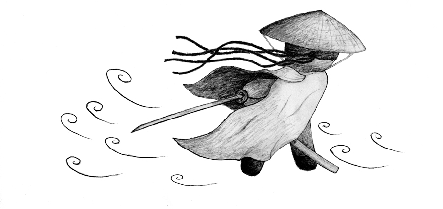
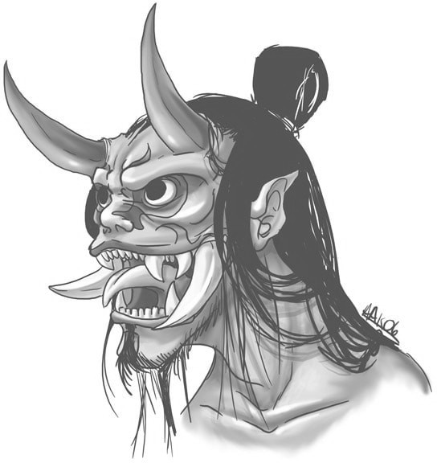

# Ori Mushi

:::: rules

 

Un jeu de rôle minimaliste inspiré du [scénario de Kalwrynn pour initier au jeu de rôle intitulé "Mener en 30min"](http://www.lulu.com/fr/fr/shop/kalwrynn/mener-en-30mn/ebook/product-24254652.html), où l'on joue dans un univers de _fantasy_ inspiré du japon féodal.

 

**Inspirations**: Naruto, Avatar le maître de l'air, princesse Mononoke, Zelda, Kung Fu Panda, Okami, Ori & the blind forest, Mushishi, Usagi Yojimbo...

 

::: web-only
- Version PDF de ces règles: [OriMushi.pdf _(19 pages, 4,4 Mo)_](OriMushi.pdf)
:::

- Feuille de personnage : [OriMushi-FeuillePersonnage.pdf _(346 Ko)_](OriMushi-FeuillePersonnage.pdf)

- Feuille de personnage "Étendue" : [OriMushi-FeuillePersonnageEtendue.pdf](OriMushi-FeuillePersonnageEtendue.pdf)

- [VoeuxDesKomuso.pdf](VoeuxDesKomuso.pdf)

- Illustrations : [OriMushi-illustrations.pdf _(14 pages, 19 Mo)_](OriMushi-illustrations.pdf)

- Articles sur mon blog à propos de ce jeu : [tag ori-mushi @ chezsoi.org](https://chezsoi.org/lucas/blog/tag/ori-mushi.html)

## Sommaire

 
<ul class="toc" data-tags="h2"></ul>

::: page-break
:::

## Création de personnage en 5min
1. Choisissez votre apparence et **un objet spécial** (arme, objet magique...) parmi les illustrations,
ou inventez-les ! Les objets spéciaux sont des objets magiques ou que leur possesseur maîtrise avec virtuosité.
<!--
En cas de débat, le 1er joueur à choisir son illustration d'apparence sera le dernier à choisir son illustration de d'objet spécial, et vice-versa.
_Note:_ le cercle magique et le parchemin permettent tous deux de faire appel à de la **magie**.
Lorsqu'un joueur en choisit un, il doit définir le type de magie qu'il maîtrise.
Voici quelques exemples : le feu, la terre, le métal, l'eau, la foudre, le vent, la lumière,
la dissimulation dans l'ombre, le déplacement instantané, les illusions...
-->

2. Inscrivez sur votre feuille de personnage son **nom**, son **activité** et cochez **3 compétences**.

L'**inventaire** de départ des personnages est complètement libre :
il s'agit de tous les objets qu'ils souhaiteraient transporter sur eux.
Ces objets n'étant pas _spéciaux_, ils n'octroient pas de dé supplémentaires lors des jets.

### Activités
Voici quelques suggestions pour les joueurs, à découper avant la partie :

::: same-size-2-cols

**Apothicaire** : je concocte des remèdes à partir de plantes sauvages.  _Gain d'Oris_ : chaque fois que je découvre de nouvelles propriétés de plantes ou contribue à soigner quelqu'un. | **Conteur** : je raconte de manière captivante les plus incroyables histoires.  _Gain d'Oris_ : chaque fois que je découvre une nouvelle créature ou que je contribue à appaiser une situation grave par la discussion.
-|-
**Mushishi** : j'étudie et m'efforce d'apaiser les Mushis.  _Gain d'Oris_ : chaque fois que je découvre une espèce de Mushi ou contribue à résoudre un problème qui leur est associé. | **Ronin** : samouraï sans maître, mes capacités martiales sont au service de la justice.  _Gain d'Oris_ : à chaque fois que je contribue à rétablir la justice.

:::

 

::: page-break
:::

## Jets de dés
1d6 minimum, **+1d6** par compétence et Objet Spécial applicables.
Selon le meilleur résultat obtenu aux dés :

* ⚅ : c'est réussi !
* ⚄ : c'est réussi **mais**...
* ⚃ : c'est raté **mais**...
* ⚂ / ⚁ / ⚀ : c'est raté

De plus :
* si deux ⚅ sont obtenus : c'est une **réussite épique** ! <!--, **le joueur décrit la scène** -->
* si deux ⚀ sont obtenus : c'est un **échec critique**
* sur un ⚄ ou ⚃, le MJ peut également proposer un **dilemme** :
  le joueur se voit proposer un choix cornélien entre deux options exclusives.
  Son personnage peut par exemple obtenir quelque chose au prix d'un sacrifice,
  ou bien se rabattre sur une réussite partielle.
* actions **difficiles** : lorsque le personnage d'un joueur tente d'accomplir une véritable prouesse, une action à la limite de ses capacités, le MJ peut alors indiquer qu'au moins **deux dés de valeur** ⚄ ou ⚅ sont nécessaires pour réussir l'action.
* actions **en opposition**, comme par exemple un affrontement : un jet est effectué par personnage, **celui obtenant le plus de** ⚅ l'emporte. En cas d'égalité, on considère les ⚄. Si l'égalité persiste, aucun personnage n'a l'avantage.
* actions **conjointes** : un personnage assistant un autre à réaliser une action lui octroie **un dé bonus**, si cette aide est jugée pertinente par le MJ.

 

::: page-break
:::

## Éléments clefs à établir en début de partie
- « L'histoire se déroule dans un japon médiéval imaginaire. Il existe de la magie et des monstres. »
- Le meneur de jeu demandera des jets aux joueurs pour les actions risquées de leurs personnages.
- Les joueurs se connaissent déjà et voyagent ensemble, et c'est d'ailleurs leur objectif commun : explorer le monde !
Ils ont déjà traversé de nombreuses contrées et aidé bien des gens.

 

## Scène 0 - Course poursuite !
Bien que cela rallonge légèrement la durée de la partie, je trouve très judicieuse l'idée de Kalwrynn de commencer _in media res_.

Je vous suggère donc de commencer la partie en décrivant rapidement un joli décor de chemin de terre sinuant
parmi les champs et les herbes folles, par une paisible après-midi printanière, au pied d'une montagne...
Où les personnages des joueurs descendent le chemin en pente à perdre haleine,
poursuivis par un troll-kappa dont ils ont piétinés le jardin par mégarde !
Cette créature, sorte de taupe humanoïde avec un bec, est fâchée et pas du tout disposée à discuter !

Décrivez aux joueurs les environs pour leurs donner quelques idées d’échappatoire :
l'orée de la forêt de bambous, la descente un peu raide vers un lac, les hautes herbes balayées par le vent...

Au terme de cette scène, les joueurs doivent rejoindre le village, par le chemin ou le lac,
quitte à faire une ellipse ou à indiquer qu'il s'agit de l'étape suivante de leur voyage,
où on leur a vanté une recette locale de poisson frit...

::: page-break
:::

 

## Ressources

 

### Illustrations
S'inspirant de [Sventovia](http://legrumph.org/Terrier/?Jeux-de-role/Sventovia) du Grümph,
nous vous encourageons à imprimer des images au préalable, pour faciliter l'immersion des joueurs :
des illustrations de personnages et ce dont ils peuvent s'équiper (armes & objets).

Vous trouverez dans ce PDF 12 illustrations de personnages des joueurs,
4 de PNJs, 6 de différents objets spéciaux, et enfin une illustration de l'esprit-dragon :
[OriMushi-illustrations.pdf _(12 pages, 13 Mo)_](OriMushi-illustrations.pdf)

### Ambiance musicale
Quelques suggestions de bande sons originales :
[Mushishi](https://www.youtube.com/watch?v=brsJ19kclwc),
[Okami](https://www.youtube.com/watch?v=JAfXYXwykFI),
[Ori and the Blind Forest](https://www.youtube.com/watch?v=OvpnMT-iqCM),
[Princess Mononoke](https://www.youtube.com/watch?v=LKI9aczEL3g).

### Cartes de lieux
Si vous aimez avoir un support visuel pour vos parties, voici quelques belles cartes qui peuvent parfaitement servir de support à une partie d'Ori Mushi :

* [Bains japonais - Czepeku](https://www.czepeku.com/store/product/steamy-japanese-bathhouse)
* [Sanctuaire de la forêt - Czepeku](https://www.czepeku.com/fr/store/product/forest-shrine-festival)
* [Monastère des cerisiers en fleurs - Czepeku](https://www.reddit.com/r/dndmaps/comments/mo9udv/cherry_blossom_monastery_21x49/?show=original)
* [Cache du Oni - Ferme de riz - Czepeku](https://www.reddit.com/r/battlemaps/comments/q3dkqc/oni_hideout_spring_23x36/)

 

::: page-break
:::

## Ori-Mushi version "Étendue"
Les sections suivantes fournissent de quoi jouer dans l'univers d'Ori-Mushi au-delà de 30min,
pour des parties de plusieurs heures.
Cela signifie :
* quelques éléments sur l'**univers** du jeu
* un concept fort de **groupe de PJs**
* des règles supplémentaires de **magie** et **progression / gain d'expérience**
* de nouveaux scénarios

 

## Le monde
Le monde d'Ori Mushi est une forme de **Japon médiéval avec de nombreux éléments fantastiques**.

Le monde n'est volontairement **pas** décrit en détails afin de :
* vous permettre, MJ & joueurs, de le détailler par petites touches, au fur et à mesure de vos parties.
* d'inclure toutes les références que vous souhaitez à des univers de fiction existants, qu'il s'agisse de lieux, de personnages, d'organisations...

Les éléments suivants sont néanmoins indispensables :
* l'existence des **komusō**, des individus dont la fonction est respectée dans tout le monde connu.
Les komusō possèdent une forte **indépendance**, mais vous pouvez choisir de les rattacher à une organisation de votre choix : gouvernement, religion, force militaire...
* la **magie** existe, et est enseignée à travers de nombreuses écoles de **jutsu**.
L'énergie magique provient de la nature : le **Mana**, parfois nommé chakra ou chi, provient des **Mushis**, des créatures élémentaires invisibles...
* tout individu possède un potentiel maveillant enfoui, un **Oni**, qui peut s'éveiller, le dévorer et le transformer en **démon**.

::: page-break
:::

## Les PJs sont des komuso
Avant que les joueurs ne créent leurs personnages,
informez-les de la nature de leur groupe :
il vont incarner des **komusō**.

Les PJs sont des personnes venant de conclure un apprentissage d'élite
(ou leur reconversion) dans un domaine, quel qu'il soit : artisan, guerrier, sorcier...

En échange de cette formation d'excellence qu'ils ont reçu,
ils ont accepté ensuite, pendant un an, d'assumer la fonction de komusō,
et pendant **un an** de former un groupe suivant les préceptes de cette charge :

 

* **Vœu d'Errance** : un komusō ne reste jamais plus de **trois nuits** dans un lieu, à moins d'une urgence vitale.
* **Vœu de Pauvreté** : un komusō ne conserve **jamais d'argent** pour lui. Il subsiste de la générosité des autres, qui leur offrent en général volontier le gîte et le couvert. Un komusō peut faire du troc.
* **Vœu d'Assistance** : un komusō accepte toujours d'**aider quelqu'un en difficulté**, de lui porter secours.
* **Vœu d'Impartialité** : un komusō se doit d'être **impartial** et **juste**. En cas de conflit, sans qu'ils ne possèdent la moindre autorité officielle, les komusō sont parfois sollicités comme juges impartiaux.
* **Vœu de Préserver la Vie** : un komusō ira jusqu'à **se battre pour une vie**. Il protège également **la nature**, animaux, plantes et autres créatures.

En-dehors de ce code moral, les komusō sont d'origines très diverses.
Ils ont souvent des connaissances et des compétences très complémentaires au sein d'un groupe,
pouvant parfois même provoquer des tensions.

 

Ils doivent tous respect et obéissance à un **daïmio**,
qui a sélectionné les membres du groupe des komusō, et à qui ils rendent compte.
Il peut parfois leur demander d'accomplir certains missions spécifiques.

 

Au terme de leur mission de komusō, l'appréciation finale du daïmio sera cruciale pour la poursuite de carrière des PJs dans leur activité.

 

D'un point de vue ludique et narratif,
cette contrainte sur la nature du groupe des PJs
offre plusieurs avantages :
* ils n'ont pas le choix de travailler ensemble.
* ils ont des objectifs communs, propices à générer de belles aventures.

Les Vœux des komusō sont sources de points d'expériences :
un joueur sauvant une vie en danger ou épargnant un adversaire meutrier gagne **+1 Ori**.

::: page-break
:::

## Les Mushis sont partout
Un **mushi** est un organisme vivant primitif et **invisible** aux yeux des humains.
Il en existe de différentes sortes, mais ils sont essentiels au bon fonctionnement des **écosystèmes** :
ils sont pour **les êtres vivants** tantôt un source d'**énergie** et de **nutriments**,
tantôt un **lien essentiel entre eux**.

Les mushis se comportent comme des micro-organismes, et ne semblent pas doués de conscience.
Bien qu'invisibles, ils peuvent être semblables à des colonies de fourmis, reliant des plantes dans une forêt, ou à des champignons tapissant une ruine.

Les mushis ne sont ni mauvais ni bienveillants,
ils sont constitutifs de la nature.

Les mushis produisent naturellement du **Mana**,
une énergie permettant de réaliser des **jutsus**.

 

::: page-break
:::

## Jutsus
Les jutsus sont des techniques mystiques ancestrales permettant de maîtriser différentes formes de magie.
Il existe une grande variété de familles :

::: same-size-2-cols

**Sable** : modeler du sable pour former toute sorte d'objets, le faire léviter, le projeter... | **Téléportation** : déplacement instantanné à courte distance de soi, d'un objet, d'un adversaire...
-|-
**Clonage** : se dupliquer, dupliquer un objet...| **Gravité** : intensifier ou supprimer la gravité dans une zone proche.
**Bois** : faire pousser des arbres extrêmement vite, modifier un objet dans cette matière... | 

:::

 

### Récupération du Mana
Un magicien canalise le Mana dans son corps se constituer une **réserve**.

Quelle que soit la situation, lorsqu'un joueur effectue un jet de dé,
pour chaque chiffre obtenu, il peut cocher la case correspondante sur sa feuille de personnage,
dans la table de récupération de Mana :

::: no-borders

1 | 2 | 3 | 4 | 5 | 6
-|-
◻️ | ◻️ | ◻️ | ◻️ | ◻️ | ◻️

:::

Lorsque les 6 cases sont remplies, le personnage récupère **+1 dé** de Mana et efface toutes les cases.
Le réserve de Mana se regénère également complètement après quelques heures à méditer auprès de Mushis.

### Règles d'emploi des jutsus
Employer un jutsu nécessite **1 point de Mana** canalisé, et un jet de dé.
Un personnage maîtrisant un jutsu, peut tenter n'importe quelle technique propre à cette famille.
Il est aussi possible de devenir expert d'une **technique** en particulier, et de gagner ainsi **+1 dé** au lancer lorsqu'on l'emploie.

Certains objet spéciaux rares peuvent également conférer **+1 dé** au lancer pour une famille de jutsu spécifique.

  

::: page-break
:::

## Ori versus Oni
Dans le monde d'Ori Mushi, tout individu possède un démon intérieur, un **Oni**.
Ce Oni se nourrit de colère, de frustration, de peurs.

Chez la plupart des gens, ce Oni reste en sommeil et ne se développe jamais.

À l'inverse, certains individus choisissent de nourrir ce Oni,
pour obtenir en échange une grande puissance.
Cette voie mène néanmoins à une transformation en un véritable **démon**.

Le pendant du Oni est la sagesse, la lumière intérieure que peuvent développer des personnes, nommée **Ori**.

La progression en Oris d'un personnage représente son gain d'expérience.

### Canaliser son Oni
Un Oni peut être canalisé pendant un bref moment pour fournir un pouvoir de concentration et une pulsion d'énergie à son porteur.

Sur sa feuille de personnage, un joueur peut cocher une case libre de sa **jauge de Oni**.
S'il fait ainsi, il gagne pendant quelques minutes en bonus **à tous ses jets**
un nombre de **dés égal à son rang d'Oni** :
durant tout une scène, son personnage sera plongé dans une rage concentrée.

### Devenir berserk
Si un joueur obtient un double ⚀ durant une phase où il canalise son Oni,
il devient **berserk**, et passe sous le contrôle du MJ.

Un joueur peut choisir de **consommer 1 Ori** pour éviter cette transformation.

Un berserk se comporte selon le résultat d'un jet dans cette table :

::: borderless right-align-col-1 with-headings

Dé | Attitude
-|-
⚀⚁ | Le berserk s'attaque au PJ le plus proche.
⚂ | Le berserk s'attaque au PNJ le plus proche.
⚃ | Le berserk s'enfuit.
⚄⚅ | Le berserk s'attaque à un adversaire. S'il n'y en pas, relancé le dé.

:::

### Devenir un démon
Lorsqu'un personnage atteint le rang 5 d'Oni, des traits démoniaques commencent à apparaître sur son corps.
Lorsqu'il atteint le rang 6, encore plus de traits apparaissent.
Lancez un dé au rang 5 puis deux dés au rang 6 : ⚀: des oreilles pointues ; ⚁: des griffes ; ⚂: une machoire carnassière ; ⚃: la peau rouge; ⚄: des écailles; ⚅: des cornes.

Lorsqu'un personnage ayant un rang Oni 6 coche la dernière case de sa jauge,
il joue sa dernière scène puis devient un démon, joué comme un PNJ par le MJ.

::: page-break
:::

### La carte du monde
Au fur et à mesure de leur pérégrinations, les komusō tracent **une carte**.

Cette carte mentionne les lieux notables traversés par le groupe,
et éventuellement des éléments sur le relief, les cours d'eau,
l'environnement en général et les bâtiments découverts en chemin.

En tant que MJ, lors de votre première partie, vous pouvez au choix :
* donner une **feuille A4 vierge** à vos joueurs
* fournir un **fond de carte** de votre univers favori, ou dessinée par vos soins

La carte doit comporter une **rose des vents** indiquant les directions cardinales : Nord, Sud, Est, Ouest.
Elle doit aussi comporter **les signatures des komusō**, qui attestent de sa validité.

À chaque fin de partie, un joueur du groupe se dévoue pour compléter la carte.
Le PJ de ce joueur gagne **+1 Ori** s'il inclut au moins un tout petit **dessin** d'une plante, d'une créature ou d'un personnage qu'ils ont rencontré.

  

::: page-break
:::

## Blessures
_Section en cours de rédaction..._

## Création des personnages
Chaque joueur :
* choisit et coche **3 compétences**.
* choisit parmis les 3 duos d'options concernant leur origine
* choisit une mauvaise habitude : _section en cours de rédaction..._
* débute avec 0 Ori
* débute avec 1 Oni : il remplit les 5 cases de droite de la jauge associée
* débute avec 3 Mana : il remplit 5 cases de la jauge correspondante

Les joueurs peuvent choisir entre :
* maîtriser un jutsu et 2 techniques
* posséder 2 objets spéciaux
* gagner 2 niveaux de Oni

::: page-break
:::

### Objets spéciaux
Les objets spéciaux sont uniques, magiques ou d'excellente facture,
et leur possesseur les manipule avec virtuosité.
Deux PJs ne peuvent pas avoir le même. 

 

**Boomerang guidable** | **Loupe à Mushis** | **Katana tranche-tout**
-|-
**Bâton télescopique** : peut être employé tout autant comme une arme, que comme un moyen de prendre de la hauteur | **Grappin téléscopique** : comme dans Zelda ou Batman | **Arc à flèches soniques** : propulse des flèches éthérées, illimitées et aux multiples propriétés : elles peuvent sonner l'alarme, assourdir, trancher en deux de petits objets, etc. 
**Amulette de feu** : produit d'intenses flammes | **Gant de bourrasque** : projette de l'air | **Cape d'invisibilité** : permet de camoufler une seule personne, ne supprime pas le son
**Instrument de musique** : dont la sonorité appaise toute créature | **Grande plume volante** | **Masque** permettant de changer de visage

::: page-break
:::

## Progression & expérience

::: borderless right-align-col-1 with-headings

Situation | Progression
-|-
⚀⚀ | +1 Ori
Sauver / épargner une vie | +1 Ori
Motivation liée à son Activité | +1 Ori
Compléter la carte | +1 Ori

 

Coût | Bénéfice
-|-
3 Oris | une nouvelle compétence
4 Oris | un nouvel objet spécial
3 Oris | une nouvelle technique de jutsu
3 Oris | +1 réserve de Mana d'un jutsu
6 Oris | un second jutsu
3 Oris | +1 rang Oni & jauge vidée **\***

:::

**\*** : les Oris ne sont pas dépensés mais **consommés**

Toute dépense d'Oris dans cette table se fait entre deux sessions,
et doit donner lieu un petit échange narratif selon ce schéma :
1. le joueur concerné décrit dans quelles conditions son personnage évolue
2. le MJ pose une question ouverte
3. les autres joueurs proposent des réponses
4. le joueur concerné choisit la ou les propositions qui lui plaisent, et conclue la narration de cet épisode

L'acquisition de compétences / objets / jutsus / techniques n'est possible que dans ces conditions :
* durant une ellipse temporelle entre deux lieux / scénarios
* le PJ doit avoir **convaincu un senseï** de lui transmettre son savoir

---

::: page-break
:::

## Licence, sources & remerciements

_Ori Mushi_ a été conçu par [Lucas Cimon](https://chezsoi.org/lucas/blog/), il est placé sous license <a rel="license" href="http://creativecommons.org/licenses/by-nc-sa/4.0/">Creative Commons Attribution-NonCommercial-ShareAlike 4.0</a>.

Ce jeu est diffusé à prix libre.
Si vous souhaitez me soutenir, vous pouvez me faire un don sur [lucas-c.itch.io](https://lucas-c.itch.io).
Les fichiers sources ayant permis de générer ce PDF sont disponibles [sur GitHub](https://github.com/Lucas-C/jdr/tree/master/OriMushi).
Cette version est la v1.0.

Je serais ravi d'avoir vos retours si vous jouez à ce jeu !
Racontez-moi comment s'est passée votre partie via un commentaire [lucas-c.itch.io](https://lucas-c.itch.io) ou sur [mon blog](https://chezsoi.org/lucas/blog/pages/jeux-de-role.html).

Merci enfin aux développeurs des [logiciels libres](https://fr.wikipedia.org/wiki/Free/Libre_Open_Source_Software) employés pour réaliser ce jeu : [le navigateur Firefox](https://www.mozilla.org/fr/firefox/), [le logiciel de dessin Gimp](https://www.gimp.org/), [l'éditeur de texte Notepad++](https://notepad-plus-plus.org/), [le lecteur de PDF Sumatra PDF](https://www.sumatrapdfreader.org), [le language de programmation Python](https://www.python.org/), les bibliothèques de code [mistletoe](https://pypi.org/project/mistletoe/) & [weasyprint](https://weasyprint.org/).

::: thanks
Polices : [Odachi](https://www.behance.net/gallery/59783897/Odachi-Free-Brush-Font)
& [Xangda Shiny](https://www.fontspace.com/starinkbrush/xangda-shiny).

Illustrations employées :
- [magic circle 2 par NNao](https://www.deviantart.com/nnao/art/magic-circle-2-216221240) - [CC BY-NC-SA 3.0](https://creativecommons.org/licenses/by-nc-sa/3.0/)
- [Epic Chibi Ninja par dmr12890](https://www.deviantart.com/dmr12890/art/Epic-Chibi-Ninja-129862000) - [CC BY-NC-SA 3.0](https://creativecommons.org/licenses/by-nc-sa/3.0/)
- [Kyoshi Earthbender Lineart par Aedo Sama](https://www.deviantart.com/aedo-sama/art/Kyoshi-Earthbender-Lineart-215736017) - [CC BY-NC-SA 3.0](https://creativecommons.org/licenses/by-nc-sa/3.0/)
- [Noh Demon par weremagnus](https://www.deviantart.com/weremagnus/art/Noh-Demon-39665536) - [CC BY-NC 3.0](https://creativecommons.org/licenses/by-nc/3.0/)
- [Quick samurai sketch par hidanbasher](https://www.deviantart.com/hidanbasher/art/Quick-samurai-sketch-566443259) - [CC BY 3.0](https://creativecommons.org/licenses/by/3.0/)
- [Katanas par Halibutt](https://commons.wikimedia.org/wiki/File:Katanas.svg) - [CC BY 3.0](https://creativecommons.org/licenses/by/3.0/)
- [Komainu Raican](https://www.deviantart.com/hijodelopio/art/Komainu-Raican-878188481) & [Kuma par HIJODELOPIO](https://www.deviantart.com/hijodelopio/art/Kuma-878189196) - [CC BY 3.0](https://creativecommons.org/licenses/by/3.0/)
- [Shinobi par HIJODELOPIO](https://www.deviantart.com/hijodelopio/art/Shinobi-Saipat-878188581) - [CC BY 3.0](https://creativecommons.org/licenses/by/3.0/)
- [Pirate Map 1 par TheStockWarehouse](https://www.deviantart.com/thestockwarehouse/art/Pirate-Map-1-845443862) - [CC BY 3.0](https://creativecommons.org/licenses/by/3.0/)
- [fille-samouraï-guerrier-japon](https://pixabay.com/fr/vectors/fille-samoura%C3%AF-guerrier-japon-8703775/) & [parapluie-écran-chinois](https://pixabay.com/fr/photos/parapluie-%C3%A9cran-chinois-chine-japon-898076/) @ pixabay.com
- [Chinese New Year Folk Ornament](https://freesvg.org/chinese-new-year-folk-ornament), [Decorative Ying Yang sign](https://freesvg.org/vector-clip-art-of-decorative-ying-yang-sign) & [Dragon frame](https://freesvg.org/dragon-frame-vector-image) @ freesvg.org - domaine public
- [Image from _"A handbook of cryptogamic botany"_ (1889)](https://www.flickr.com/photos/internetarchivebookimages/20102877173/) - domaine public
:::
::::

<!-- Next:
* rédiger section progression / expérience -> Voies ?
* ajouter des jutsus -> concevoir des cartes

* intervertir : version "étendue" -> jeu de base / version 30min => version "courte"
* ajouter à la FP des mentions : "nom du PJ" à gauche / à droite / en face
* formatter les règles (jets + jutsus + XPs) en une seule page A4
* Glossaire : PJ, MJ, XP...
* SpellCheck
* Illustrations.pdf : add images of equipments & places
* Remplacer Odachi par typo / font plus adaptée pour dyslexiques ?

Idées en vrac :
+ prévoir que le système / les FPs des joueurs évoluent au fur et à mesure de la partie ?
-->
