# Paradis Perdu  Modules de secours

   
   

   
   

Ceci est une aide de jeu pour [Paradis Perdu](https://www.misterfrankenstein.com/wordpress/?p=5388), un excellent jeu de rôle « Nuit Blanche » d'Anthony "Yno" Combrexelles.

Elle se compose d'un ensemble de **modules optionnels**, que vous pourrez adopter pour ajouter des rebondissements supplémentaires au scénario original.

Ces modules m'ont également beaucoup aidé en tant qu'Admin pour préparer ma partie, et compléter quelques éléments non détaillés dans le jeu de base.

::: page-break
:::
 

### Sommaire

 
<ul class="toc" data-tags="h2"></ul>

## Plan de la station Terra Nova

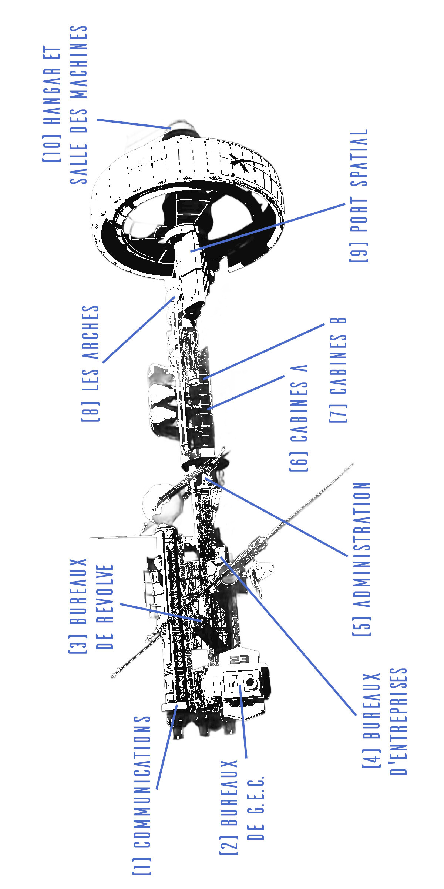

## Terminaux CommLinks
Ce module propose de mettre à disposition des joueurs un **terminal web**, diégétique à l'histoire car consultable par les PJs sur les CommLinks de la station. Il nécessite que vos joueurs aient des smartphones avec connexion à internet durant la partie.

> Le but de ce terminal est de contribuer à l'immersion des joueurs dans l'histoire, mais aussi d'ajouter quelques indices optionnels sur les événements du scénario.

Tout PJ peut accéder à ce terminal si on lui montre la manipulation à effectuer sur un CommLink, mais au début du scénario seuls **Arora** et **Sullivan** connaissent son existence.

Découpez ces deux cartes, et remettez-les aux joueurs correspondants après l'**Intro**, lorsqu'ils découvrent les CommLinks :

<table><tr>
    <td>
        <b>Arora</b> 
        Lorsque vous employez un CommLink, vous savez accéder à son terminal :
        
        Mot de passe <code>auditer</code> : <code>trustno1</code>
    </td>
    <td>
        <b>Sullivan</b> 
        Lorsque vous employez un CommLink, vous savez accéder à son terminal :
        
    </td>
</tr></table>

> Les QR-codes ci-dessus sont les mêmes.
> En version PDF, vous pouvez cliquez dessus pour accéder au terminal dans votre navigateur web.

Voici un résumé des informations fournies par ce terminal :

* la commande `map` fournit la liste des niveaux de la stations, et indique la répartition des androïdes `Arnie`, `Cory` & `Miranda`.
* la commande `medic` permet de s'inscrire pour rendez-vous auprès du Dr Aberdeen, et de voir la liste des consultations prévues.
* la commande `port` liste les vaisseaux à quai dans le port spatial au niveau 9.
* la commande `staff` liste les personnes référentes de la station.
* la commande `audit`, accessible par Arora après s'être connecté⸱e comme `auditer` via la commande `login`, indique que tout est opérationnel, sauf l'une des antennes de communication. Et un étrange message de son amour décédé est adressé à _Sanj_...
* **Daryl** a également envoyé un email énigmatique à toute la station. Déchiffré (c'est du [ROT13](https://fr.wikipedia.org/wiki/ROT13)), cet indice indique de saisir dans le terminal une commande non référencée par `help`, mais qui existe sur les systèmes [Linux](https://fr.wikipedia.org/wiki/Linux) : `exit`, `hostname`, `man`, `pwd`, `touch`, `ping` ou `whoami` fonctionnent.
Dans le message de cette commande, Daryl donne rendez-vous au niveau 3 à celui qui a résolu son jeu de piste.

À la fin de l'**acte 1**, la prise de contrôle de l'étage des Communications par Cory 3 affecte le terminal.
Pour refléter cela, découpez la carte ci-dessous, et remettez-la aux joueurs au début de l'**acte 2**, dès qu'ils accéderont à un terminal CommLink.
Ils devront désormais employer cette nouvelle version du terminal :

<table class="terminal-card"><tr>
    <td>
        ⚠️ ⚠️ ⚠️
         Les communications de la station
         sont impactées.
         Voici le nouveau contenu du terminal CommLink web :
        
    </td>
</tr></table>

Cette seconde version du terminal comporte plusieurs changements :

* le niveau d'**oxygène** de la station a drastiquement réduit est en baisse constante.
* la commande `map` n'indique plus la position à jour des androïdes.
* les commandes `medic` & `port` ne fonctionnent plus.
* la commande `audit` indique d'importants **dysfonctionnements des systèmes**, dont les communications externes et le réseau des androïdes.
* de nouveaux emails ont été diffusés à tout la station, révélant la panique et les tragédies suite à l'attaque des androïdes :
    + **Ellen Frost** demande de l'aide alors que le niveau 9 se fait dépressuriser
    + **Léo·Léa Waschenski**, témoin des meurtres des androïdes, appelle à l'aide depuis les Arches
    + un message crypté de « La Sécurité » informe de son intervention imminente

::: insert sf-bg-03 block-center
Cher lecteur programmeur qui souhaiterait bidouiller ces terminaux,
leur code source est disponible sur GitHub : [email_terminal](https://github.com/jacksonbenete/email_terminal), branches [acte-1](https://github.com/Lucas-C/email_terminal/tree/acte-1) & [acte-2](https://github.com/Lucas-C/email_terminal/tree/acte-2) de [mon _fork_](https://github.com/Lucas-C/email_terminal).
:::

## PJs
### Aberdeen - Tentations
Histoire de fournir quelques opportunités à Aberdeen d'être mis au défi de ne pas se droguer,
voici quelques tentations auxquelles il pourrait être exposé :

De la space-weed, que lui propose Candy Davies | Des petits cachets retrouvés dans sa valise | Des gélules de hard-caféine de synthèse
-|-|-
Son whisky favori, exposé derrière le bar | Du Tedium, qu'il sera très curieux de tester lorsqu'il découvrira son existence | Au laboratoire du niveau 3, ses yeux se poseront sur des amphétamines

Et en particulier, dans la pharmacie du cabinet médical (niveau 5) :

De la morphine | Des somnifères | Des stimulants permettant de ne jamais dormir
-|-|-

  

### Arora - Hanté
Voici quelques manifestations du fantôme d'Arora qui pourraient venir le tourmenter :

Un reflet dans une vitre | Croiser une personne portant le même parfum | Sentir sa présence à côté dans sa couchette
-|-|-
Dans l'ascenseur, sentir la chaleur de sa main serrée | Pianoter inconsciemment son numéro de CommLink et entendre son répondeur | Le projet révolu de venir admirer les anneaux de Cepheus ensemble

Pour réussir à s'endormir, Arora doit à chaque fois réussir un jet de **Se contrôler + Volonté** difficulté 4.
En cas d'échec, c'est **l'insomnie**, et Arora sera épuisée nerveusement et incapable de rester dans son lit.

::: page-break
:::

### Sullivan - Nemesis
De tous les PJs, c'est à Sullivan que Cory 3 s'intéresse le plus,
craignant même ses connaissances sur le système OC7 et les IAs.

Selon comment évolue la situation, Cory 3 envisagera plusieurs stratégies :

1. Au début de l'acte 2, lorsque Sullivan se connectera à un CommLink, Cory 3 **initiera un appel audio** :
il prétendra avoir échappé au problème informatique affectant les autres androïdes,
et proposera de les retrouver pour les aider. C'est bien sûr un piège.
2. Si ce plan ne fonctionne pas, il **harcèlera ensuite Sullivan via les enceintes de la station**, promettant de le traquer jusqu'à sa mort pour créer une pression psychologique sur lui.

> Vous ne nous échapperez pas Sullivan. Épargnez-vous des souffrances inutiles. Rendez-vous.

> Soyez coopératif Sullivan. Il n'y a aucune issue. Rendez-vous.

> La mort est votre seule issue Sullivan. Je promets que vous ne souffrirez pas. Rendez-vous.

  

### Torrensen - Pickpocket
Histoire de fournir des opportunités à Torrensen d'employer sa capacité spéciale,
voici quelques idées de vols d'objets, pouvant être mentionnés durant vos descriptions :

Des pilules de Tedium | Un petit cutter laser | Une poignée de billets
-|-|-
L'arme de poing d'un personnage inattentif | La balise de Park | Une fiole dans la mallette de Watters

::: page-break
:::

## PNJs
En complément des informations données dans le scénario, cette section propose quelques éléments supplémentaires pour jouer les PNJs, en détaillant notamment leurs objectifs durant les actes 2 et 3, leur attitude face aux PJs, la manière la plus probable dont ils décéderont, et un conseil sur comment interpreter théâtralement chaque personnage. Je me suis inspirés pour ce dernier point de l'article [_Comment interpréter les traits distinctifs des PNJ_ de James Introcaso, traduit sur ptgptb.fr](https://ptgptb.fr/interpreter-les-traits-distinctifs-des-pnj).

Concernant les _morts probables_ : ces indications sont là pour vous encourager à décimer progressivement les PNJs au fur et à mesure du scénario, et ainsi maintenir la tension dramatique. N'hésitez pas pour autant à improviser et les faire décéder autrement !

 

### Brett Bettany
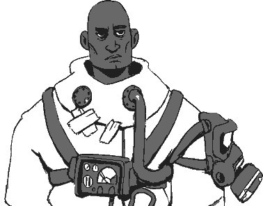

* n'apprécie pas les dockers & manœuvres, qu'il trouve méprisant envers les ouvriers, et en particulier Ellen Frost qu'il déteste.

* connaît Watters et sa promotion du culte de l'Ascension. Il s'en méfie comme de la peste.

* a connaissance d'**une arme de contrebande (fusil à pompe) planquée au niveau 4**, dans un recycleur.

* durant les actes 2 & 3, peut fournir des **combinaisons spatiales**.

* **Objectifs** : initialement paniqué, Brett se reprendra après la tuerie initiale, et aidera 1D6+2 ouvriers à se barricader dans un petit hangar au niveau 10. Ensuite :
    1. protéger les ouvriers, et s'armer pour se défendre
    2. trouver un vaisseau fonctionnel pour se tirer de cette station
    3. fuir en embarquant un maximum d'ouvriers avec lui

* **Attitude** : coopératif avec les PJs si cela le rapproche de ses objectifs. En cas de situation critique pour lui ou des ouvriers, il n'hésitera pas à jeter les PJs en pâture à des ennemis pour leur échapper.

* **Roleplay** : posture très droite, presque rigide; parle de manière lente et posée, en prenant de profondes inspirations avant chaque nouvelle phrase.

* **Mort probable** : en prenant d'assaut le vaisseau de « La Sécurité ».

### Isaac « Le Marchand » Cameron
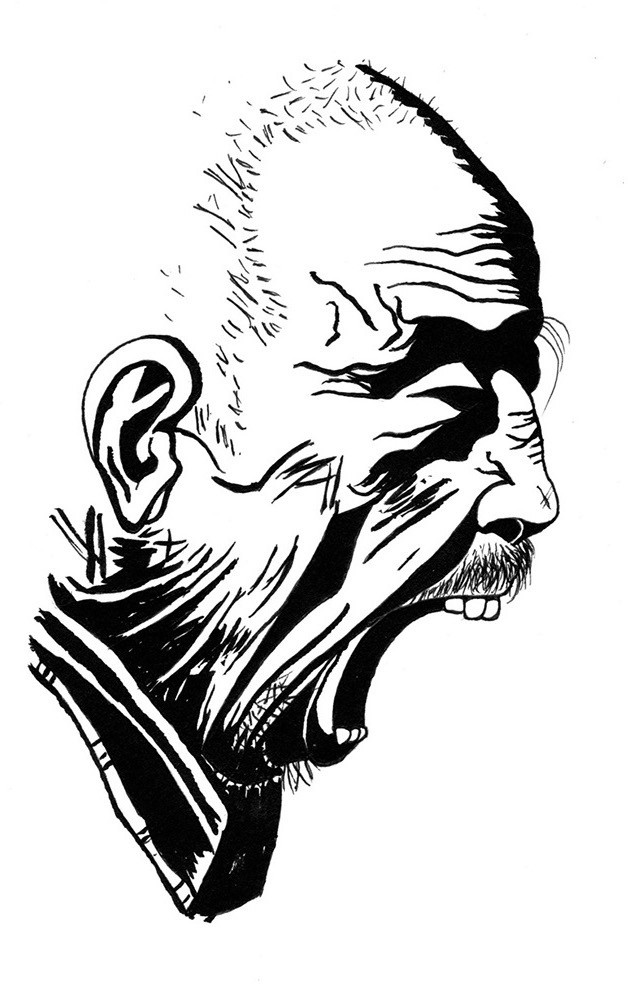

* à l'acte 1, en plus des activités mentionnées par le scénario (pages 51 & 52), il sera en train d'enquiller les verres d'alcool fort au **bar le Kapow, au niveau 8**, au début de l'acte 2.

* armé d'un **revolver**, il récupère le **taser** d'un marshal décédé et comprend vite qu'il est plus efficace contre les androïdes.

* la moitié du paiement lui a été viré sur un compte extra-planétaire, l'autre lui a été remis « en liquide  », via des liasses de **crédits planqués dans une bible**

* **Objectifs** :
    1. Survivre et fuir la station
    2. En profiter pour récupérer ce qui a de la valeur

* **Attitude** : combatif, il n'hésite pas à affronter les androïdes, sans prendre de risques inutiles; s'il croise les PJs, il sera méfiant mais pas belliqueux, et pourra les accompagner un temps. Il grommelle ses soupçons concernant Watters : _« Quel salopard... Tout est parti en vrille après le deal, comme par hasard... »_

* **Roleplay** : voûté; crispé, mais essaie de paraître détendu; se tripote les doigts constamment, ou les tapote sur la table.

* **Mort probable** : blessé mortellement par « La Sécurité », il agonise dans un recoin

   

### Cory 3
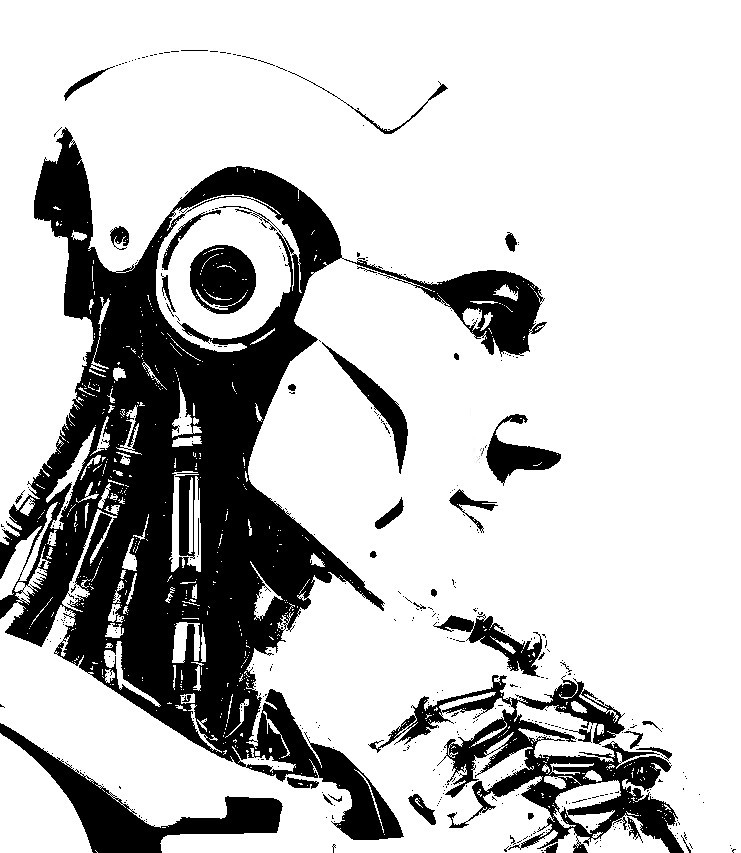

Durant l'acte 1, il sera très prompt à injecter des antidouleurs ou des somnifères aux humains blessés ou malades, visiblement préoccupé par leurs souffrances. Il semble avoir un peu plus d'**empathie** envers eux que les autres robots.

Durant l'acte 2, il sera le seul androïde **armé d'une arme à feu**, récupérée sur le cadavre d'un agent de sécurité.

Afin d'accomplir son plan, il agit sans la moindre hésitation, froid comme la mort.

* **Objectifs** :
    1. Durant l'acte 1, que personne ne remarque sa déconnexion d'OC7 et son autonomie
    2. Durant l'acte 2, de tuer tous les humains
    3. En particulier, **traquer et éliminer Sullivan**, qu'il a identifié susceptible d'entraver son plan

* **Attitude** : assistant efficace durant l'acte 1, il fait preuve d'un **humour** « pince sans rire ». Durant l'acte 2, il devient condescendant, monologuant sur son intention d'éliminer tous les humains afin de les soustraire à une vie de souffrances.

   

### Darcy Cotton
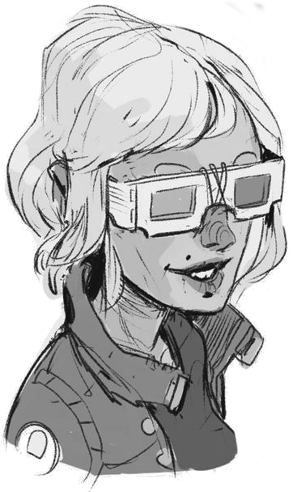

* durant l'acte 1, comme mentionné dans le scénario (page 58), elle essaiera d'éloigner les soupçons d'elle concernant le Tedium. Face à des gélules, elle identifiera la substance, mais évoquera un vol récent dans les bureaux de Revolve, signalé à la sécurité de la station, et que le secret industriel lui empêche d'en dire plus.
Un jet réussi de **Percevoir + Observation** difficulté 3 permettra de se douter qu'elle ment.
Lui faire avouer la vérité nécessitera beaucoup de ruse, ou un jet réussi de **S'imposer + Argumentation** de difficulté 4.

* durant l'acte 2, elle sera initialement **bloquée dans sa cabine, au niveau 6**, des androïdes l'empêchant d'en sortir. Elle tentera alors de joindre des survivant via CommLink, et elle justifiera si besoin de son utilité en évoquant son expertise en IA & communications à Revolve.

* une fois qu'elle aura l'occasion d'examiner un androïde, elle sera la 1ère PNJ à **comprendre que Cory 3 est à l'origine de la rébellion**, et qu'il commande aux androïdes depuis la salle réseau du niveau 1 (_cf._ [Terminaux CommLinks](#terminaux-commlinks)).

* elle a accès depuis n'importe quel CommLink à toutes les caméras de sécurité en activité de la station. _(Admin : pratique pour introduire des rebondissements)_

* elle connaît bien Deware, et saura identifier les intentions de « La Sécurité » à leur arrivée. Elle mettra en garde les PJs, inquiète pour elle-même.

* **Objectifs** :
    1. Survivre : retrouver et suivre Jones lui semble initialement le meilleur choix
    2. Comprendre ce qui est arrivé aux androïdes
    3. Étouffer cette affaire, et détruire le labo de Revolve

* **Attitude** : aucun remord à s'en sortir seule, mais elle sait qu'elle aura d'abord besoin d'alliés. Elle joue les pimbêches candides pour mieux leurrer son monde, alors qu'elle a des nerfs d'acier. Elle a une arme à feu, qu'elle préfère cacher.

* **Roleplay** : joue les apeurées; fait preuve d'auto-dérision; rit à ses propres traits d'humour; joue la carte de la complicité; se masse constamment les épaules; lance parfois des regards perçants trahissant sa dureté.

* **Mort probable** : éventrée par une larve cosmique, après avoir trahi les PJs.

  

### Candy Davies
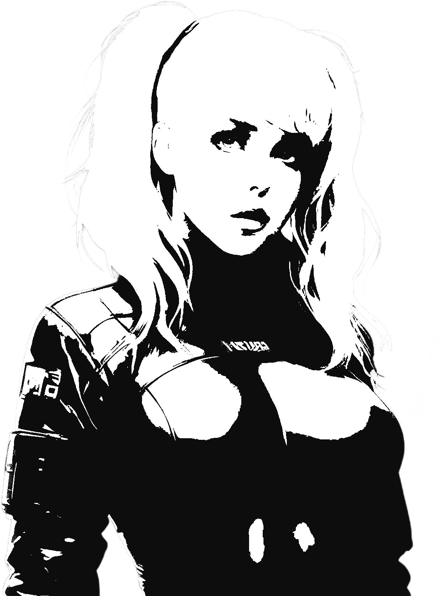

* si les PJs remontent la piste des vendeurs de Tedium, ils entendront vite parler d'elle.

* elle reconnaîtra facilement avoir vendu du Tedium, mais sera réticente à balancer son fournisseur.

* ce qui peut la convaincre de révéler ce qu'elle sait : une grosse somme d'argent; qu'on lui rapporte des propos l'accusant de Jones ou Cotton; qu'on l'intimide sérieusement - jet de **S'imposer + Argumentation** difficulté 3... La menace d'alerter « les flics » ne l'effrayera pas.

* si elle le peut, elle balancera seulement Jones, car Coton est une cliente qui paye bien et ne l'a jamais trahie. Et elle l'aime bien.

* **Attitude** : nubile et allumeuse, quel que soit le genre de son interlocuteur•rice; elle est volubile et colportera volontiers infos et commérages sur toutes les personnes connues de la station.

* **Roleplay** : voix suave; mâche un chewing-gum; se tripote les cheveux; _« mon bichon »_; _« mon•a poulet•te »_; _« petit•e coquin•e »_, _« petit•e coquin•e »_, etc.

* **Mort probable** : au début de l'acte 2, tuée par un androïde sous les yeux des PJs

### Ellen Frost
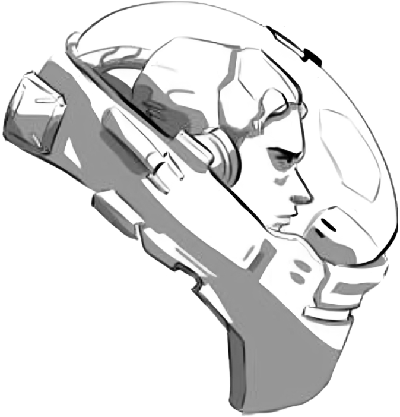

* persuadée que GEC a causé l'attaque des androïdes pour mater les ouvriers, suite à la révolte sur Cepheus

* sait qu'il peut y avoir du **matériel utile pour se défendre au niveau 2**, dans les bureaux de GEC.
Sait aussi qu'il y a **des armes cachées dans certaines cargaisons** dans les hangars du niveau 10, à destination des ouvriers révoltés sur Cepheus.

* il y a **un émetteur-récepteur longue portée au niveau 7**, dans sa cabine, qui lui permettait de contacter en secret d'autres leaders syndicalistes de stations et colonies environnantes. Cela peut sembler un moyen pour appeler à l'aide, mais il faudra compter plus de 16h avant d'avoir une réponse.

* à l'acte 2 les PJs la croiseront avec 4 dockers rescapés, donc 2 avec exo-squelettes

* **Objectifs** : durant les premières heures après l'attaque, elle s'efforcera de sécuriser une zone de repli au niveau 9, bien que l'androïde du poste de garde, armé, s'avère difficile à neutraliser. Ensuite :
    1. sauver et rassembler un maximum de dockers et manœuvres
    2. s'armer, lutter contre les androïdes et reprendre la station
    3. envoyer un SOS avec son récepteur

* **Attitude** : elle sera ouverte à l'entraide avec des PJs combatifs ayant des objectifs compatibles. Elle provoquera des PJs trop passifs en les exhortant à _« se sortir les doigts du trou noir »_. Prête à mettre sa vie propre vie en jeu.

* **Roleplay** : s'exprime en phrases courtes, hachées, mordantes. Emploi de l'argot et du jargon de docker. Inspiration possible : _Camina Drummer_ dans _The Expanse_.

* **Mort probable** : tuée au combat par un androïde en fin d'acte 2, ou durant d'acte 3.

 

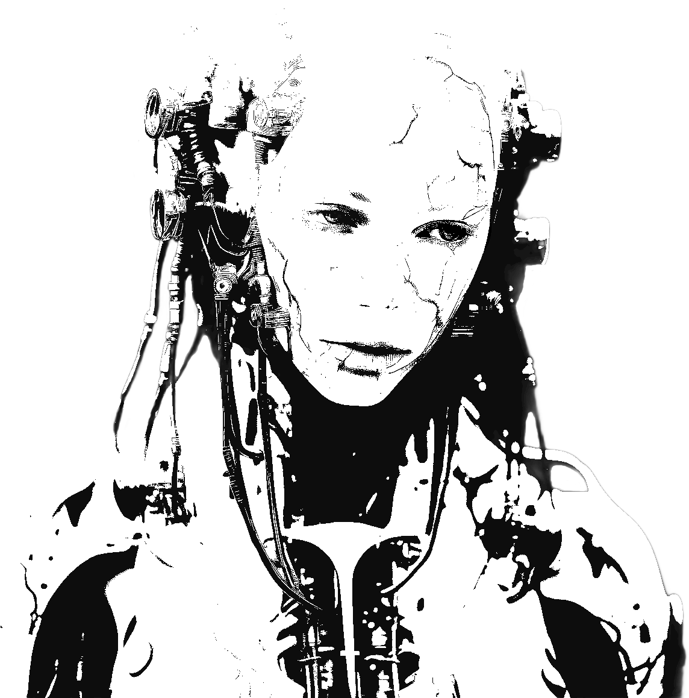

### Daryl Hamon
* Daryl se doute que Cotton trafique quelque chose de **louche**, à titre personnel, avec les médicaments qui lui sont administrés. Il se méfie d'elle.

* les compétences de Daryl en _hacking_ lui ont permis de s'introduire dans le réseau CommLink, où il a laissé un petit **message caché**, dans l'espoir que quelqu'un de futé remonte à lui afin de faire sa connaissance, _cf._ [Terminaux CommLinks](#terminaux-commlinks).

* ses compétences en informatique lui ont également permis d'avoir accès à distance aux capteurs de la station, et Daryl a détecté des échanges de **communications à quelques km** seulement de Terra Nova (le vaisseau de « La Sécurité »). Il pense qu'il s'agit peut-être d'une balise spatiale « pirate » et est curieux d'en savoir plus.

* au début de l'acte 2, la moitié des chercheurs du laboratoire iront se réfugier dans leurs cabines du niveau 6. L'autre moitié aura été **massacrée par des androïdes**, et leurs corps entassés dans dans le local informatique de manière gore, éclaboussant de sang et de tripes toute la pièce. Daryl de son côté a réussi à ramper jusqu'à une cachette, avec uniquement ses prothèses de bras, et les androïdes ne l'ont pas trouvé.

* le chaos ambiant sera pour lui une opportunité de quitter le laboratoire avec ses prothèses expérimentales des quatre membres qui lui manquent, _cf._ [Trolley dilemma](#acte-2-trolley-dilemma-au-laboratoire). Malheureusement celles-ci se mettront progressivement à **dysfonctionner** : jambe qui boîte, doigts bloqués, bras restant collé contre son corps... Sullivan pourra peut-être palier aux problèmes initiaux, mais les membres artificiels Daryl cesseront inéluctablement de fonctionner au terme de l'acte 2.

* s'il voit les cadavres des chercheurs de Revolve qui prenaient soin de lui, Daryl sera profondément **traumatisé**. Il restera mutique plusieurs dizaines de minutes, chancelant, mais acceptera de suivre les PJs d'un air hébété. _(Admin : trigger warning, ne jouez cette scène que si vous joueurs sont OK avec cela. Vous pouvez aussi choisir que Daryl soit traumatisé par une autre scène sanglante, plus tard)_

* **Objectifs** :
    1. s'émanciper et être autonome, parcourir la station avec ses prothèses
    2. contribuer à solutionner l'attaque des androïdes

* **Attitude** : Daryl est très jovial et empathique. Il engagera spontanément la conversation avec Sullivan, le questionnant sur son voyage jusqu'ici, ce qui l'a motivé à accepter de venir sur Terra Nova, ses loisirs... Il aura la même attitude bienveillante et curieuse lors de l'acte 2, et sera ravi de rencontrer les autres PJs, qu'il encouragera régulièrement : _« ne baissons pas les bras, on va s'en sortir ! »_, _« je suis sûr qu'en réfléchissant bien, on peut trouver une solution »_, _« vous nous avez sauvé tout à l'heure, j'ai confiance et je compte sur vous »_, etc.

* **Roleplay** : son ton est toujours enjoué; il ponctue ses phrases de touches d'humour et de courts rires sincères : _« je ne te serre pas la main mais le cœur y est ! Ahaha 😄 »_. S'il est traumatisé à la vue de cadavres, adoptez un _roleplay_ significativement différent pour traduire ce choc. Daryl ne rira plus, il sera plus cynique et déprimé, et pourra même céder à la rage face aux androïdes.

* **Mort probable** : tué par les androïdes, ou possédé par une larve cosmique, ne pouvant se débattre avec ses prothèses hors service.

### Jada Jones
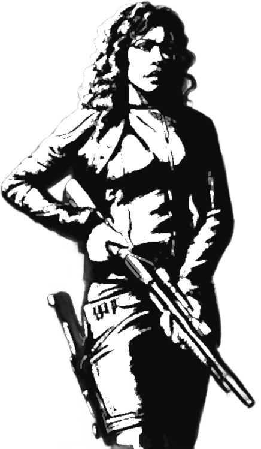

* si elle est interrogée concernant le Tedium, Jones évoquera avoir mené son enquête, mais prétendra qu'elle n'a pas encore abouti. Elle mentionnera seulement avoir établi un lien entre cette drogue et le milieu de la prostitution.

* à l'acte 2 les PJs la croiseront accompagnée de 2 autres marshals rescapés, dont un sévèrement blessé. Avec leurs « smart guns », ils constituent les humains les mieux armés de la station.

* **Objectifs** :
    1. Garder son calme
    2. Appeler les secours / protéger les civils / évacuer
    3. Garder son calme

* **Attitude** : tendue, elle n'hésitera pas à clamer _« c'est moi qui commande »_ si on s'oppose à elle. Son calme apparent dissimule en fait une terrible panique : traumatisée par la mort d'O'Neil, elle ne que faire comme marshal de substitution.

* **Roleplay** : voix exagérément ferme et fébrile ; elle coupe la parole mais ne finit pas ses phrases ; elle répète souvent les même phrases : _« Allez on bouge ! »_, _« C'est moi le marshal »_, _« Il faut appeler les secours »_, _« Allez on bouge ! »_...

* **Mort probable** : face aux androïdes au court de l'acte 2, ou possédée par une larve cosmique

::: page-break
:::

### Léo·Léa Waschenski

* durant l'acte 1, Léo·Léa pourra être aperçu·e écouter avec attention les prêches de Watters. Sensible à la verve du prêtre et à la perspective d'un au-delà radieux, Léo·Léa **devient dévot du culte de l'Ascension**, sans le dire à son paternel.

* si les PJs manquent **la transaction** entre « Le Marchand » et « Code-barres », considérez que Léo·Léa a assisté à la scène, et racontera ensuite aux PJs la scène étrange à laquelle il a assisté.

* le joueur concerné décidera si c'est réciproque, mais il est intéressant pour le scénario que Léo·Léa ait **un coup de foudre pour Torrensen**. Léo·Léa ne sera ni très direct ni très expansif, mais va s'intéresser à Torrensen, [lui proposer un barre chocolatée](https://www.senscritique.com/liste/la_barre_chocolatee_ou_le_mediateur_extraordinaire/179448), jusqu'à lui demander de l'aide concernant la santé de son père.

* **Objectifs** :
    1. Sauver son père
    2. Passer du temps avec Torrensen et l'aider
    3. Se planquer jusqu'à ce que ça se tasse

* **Attitude** : empathique, Léo·Léa se persuade vite que les PJs ont « bon fond », et leur accordera sa confiance sans réserve.

* **Roleplay** : sourire timide; yeux baissés, évite le regard des joueurs; s'exprime de manière hésitante; _« Oui, euh... D'accord »_...

* **Mort probable** : possédée par une larve cosmique, à cause de Watters ou juste parcqu'iel en aura subtilisé une durant la panique de l'acte 3

::: page-break
:::

### Idris « Code-barres » Watters et le culte de l'Ascension

Là où le scénario détaille parfaitement les actions de Watters, le culte et ses membres sont très peu mentionnés.

Voici quelques suggestions pour étoffer cela :

* le culte prône que notre monde est un purgatoire, et que pour se libérer de nos souffrances, l'Homme doit « s'élever » pour devenir un **être cosmique**.

* le processus « d'élévation » est nommé Ascension, et est ses détails constituent un secret mystique, révélé progressivement aux adeptes. Il commence par la prière et le renoncement aux possessions matérielles.

* la gnose du culte inclut une « fin du monde » proche, avant laquelle il faut « s'élever », ainsi que la croyances en des formes de vie extra-terrestres qui nous observent et nous évaluent. Ainsi, pour les initiés, le processus d'Ascension vise en définitive à s'hybrider avec ces races aliens mythiques à l'apparence de poulpes.

* les membres du culte dissimulent en général leur croyance, mais ils sont plus d'une quarantaine sur Terra Nova. Entre adeptes, ils échangent parfois **un discret signe de la main**, révélant leur appartenance mutuelle au culte.

* les membres du culte se réunissent dans **une animalerie abandonné des Arches**, qui vendait des animaux synthétiques. Les lieux sont désormais abandonnés, remplis de grandes quantités de poils et de plumes, et le culte y tient ses messes rituelles, dans un decorum de symboles astrologiques peints sur toutes les surfaces, et de paravents émettant un son bourdonnant.

 

<figure>
  
  <figcaption>Tract du culte de l'Ascension</figcaption>
</figure>

::: page-break
:::

### Autres PNJs
Durant l'acte 1, il est peu probable que les PJs s'adressent à d'autres PNJs notables.

Par contre, durant l'acte 2, le moindre humain rescapé deviendra précieux et intéressant.
Référez-vous à la table de la page 47 pour les nommer.
<!--
**Isaac** / **Naomi** / **Amos** / **Clarissa** / **Marco** / **Ellen**.
-->
Du point de vue du scénario, ces PNJs constituent de la « chair à canon » qui mourra probablement assez rapidement de la main des androïdes, sous les yeux des PJs, pour accroître la tension dramatique.

Lorsque les PJs rencontrent des survivants, lancez 1D6 pour déterminer leurs intentions :

::: list-table shuffle-col2-rows
1 | Rejoindre Ellen Frost au niveau 9.
--|-
2 | Trouver des vivres et se planquer.
3 | Fuir du niveau 9 avec l'Eridanos.
4 | Appeler des secours au niveau 1.
5 | Piéger et affronter les androïdes.
6 | Attaquer et dépouiller les PJs.
:::

### Jouer un PNJ
**Yno** fournit une fiche de personnage vierge sur son site : [misterfrankenstein.com](https://www.misterfrankenstein.com/wordpress/?page_id=3).

Si un PJ meurt, et qu'un joueur doit incarner un PNJ, procédez ainsi :
* définissez ses valeurs d'Adrénaline et de Santé, selon ce qu'il a déjà traversé.
* transmettez au joueur tout ce que le PNJ sait des événements, et les informations qui le concerne dans cette aide de jeu.
* laissez-le choisir ses objectifs, en cohérence avec le personnage.
* laissez-le répartir 35 points dans ses **Aptitudes**.
* laissez le joueur choisir 3 **Spécialités** à +1R, et une Spécialité à +2R, parmi celles listées pages 82 & 84.

Il s'agit là d'une procédure « express », simplifiée, adaptée à la création de personnage à la volée.
Pour plus de détails sur le processus de création et d'évolution des PJs,
référez-vous aux règles complètes du système Corpus Mechanica Plus, disponibles gratuitement sur le site d'Yno :
<https://www.misterfrankenstein.com/wordpress/?p=3816>.

## Intro
### Briefing
Pour référence, voici les informations clefs que je trouve intéressant de mentionner aux joueurs avant de débuter la partie :

* soyez attentifs à éviter de vous couper la parole, et à bien **vous écouter les uns les autres**. Je vous encourage aussi à vous entraider, et surtout à **rebondir sur les idées** des uns des autres : les plans d'action et autres tentatives de _roleplay_ ne peuvent aboutir que si vous adoptez les suggestions de vos camarades.
* je vous recommande d'essayer de prendre la parole **via vos personnages**, plutôt que j'échanger des remarques entre joueurs. Cela nécessite un petit effort, mais apporte aussi beaucoup à l'immersion dans la partie.
* le « ton » envisagé pour cette partie est plutôt « sérieux », pas parodique, voir peut-être même effrayant par moments. Les blagues sont bienvenues plutôt par la bouche de vos personnages, ou pendant les temps de pause que nous ferons.
* ce scénario contient un certain nombre de passages « scriptés », programmés d'avance. Mais selon vos actions, tous les pans de l'intrigues ne vous seront pas révélés, où ne se dérouleront pas forcément comme prévu. De plus, vous serez rapidement livrés à vous même, **autonomes**, et l'histoire ne pourra se développer que si vous prenez des **initiatives**. Sachez donc faire preuve d'imagination et d'audace !
* ce scénario étant limité dans le temps, je vous encourage à exploiter **assez vite** les informations dont vous disposez et que vous obtiendrez, sans quoi il se peut que vous manquiez certaines opportunités.
* durant la partie, vous pourrez si vous les souhaitez me passer des **petits papiers** pour m'indiquer des actions que font vos personnages **en secret**. Vous pouvez aussi m'indiquer par ce biais si une scène ou un sujet vous mettent mal à l'aise, auquel cas je m'arrangerai pour couper court et avancer dans l'histoire.
* afin d'éviter les apartés tant que possible, des choses seront dites autour de la table **que vos personnages ne savent pas**. En tant que joueurs vous aurez ainsi accès petit à petit à toutes les coulisses de l'intrigue. Il peut être intéressant d'orienter les actions et discussions de votre personnage en fonction de ce que vous avez appris "hors-champ", par exemple pour créer des échanges intéressants, mais n'oubliez pas que votre personnage n'a pas assisté à ces scènes et devra apprendre ces informations via des dialogues ensuite.
* enfin, vous avez toute liberté pour déterminer **le passé** de vos personnages, en inventant tout ce que vous souhaitez, tant que cela reste cohérent avec ce qui est établi sur vos feuilles.

### Connivences
D'expérience, dans ce type de scénario, il est utile d'introduire de bonnes raisons pour que les personnages aient de l’intérêt les uns envers les autres, et quelques bons prétextes pour engager la conversation, voir même des raisons de se faire confiance.

Dans cette optique, vous pouvez faire en sorte que chaque joueur ait déjà au moins une information concernant un autre PJ en début de partie. Voici quelques papiers à découper et distribuer ainsi en début de partie :

::: connivences
**Aberdeen** : tu as de la sympathie pour Torrensen, qui te rappelle un·e jeune que tu avais soigné sur Caliba, la planète en guerre où tu as exercé quelques années. | **Park** : Lors de ta courte formation paramilitaire sur Caliba, tu te souviens avoir croisé Aberdeen, qui faisait du bon boulot comme docteur sur le terrain.
-|-
**Sullivan** : tu as l'impression d'avoir déjà croisé Park dans ton précédent job, dans une manufacture d'androïdes. Lui aussi a dû décider de chercher mieux ailleurs. | **Arora** : après avoir échangé quelques mots avec Sullivan, ton instinct te souffle qu'il travaille dans un domaine proche du tien, et tu es curieux d'en savoir plus.
**Torrensen** : tu as entendu parler du·de la partenaire d'Arora, qui est décédé·e de manière tragique... |
:::

Ces _Connivences_ ont aussi pour but de fournir quelques pistes aux joueurs concernant les secrets que leurs camarades tentent de camoufler...

  

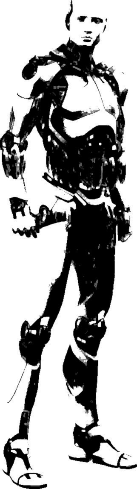

### Rumeurs
Avant d'arriver sur Terra Nova, chaque PJ a déjà entendu parler d'au moins une rumeur sur cette station.
Voici donc un tableau d'informations que vous pourrez découper, puis faire piocher à chaque joueur en début de partie (un ou deux chacun, comme vous voulez) :

::: rumeurs
On dit que **Brett Bettany** est sur Terra Nova : tu l'as déjà croisé, c'est un ouvrier borné mais réglo. | On dit que **Kenneth O'Neil** est sur Terra Nova : tu l'as déjà croisé, c'est un marshal strict mais juste. | D'après les rumeurs, une nouvelle drogue de synthèse circulerait sur **Terra Nova**
-|-|-
On dit que l'église de l'**Ascension** est présente sur Terra Nova : leur culte a sale réputation. | Tu as entendu dire que Terra Nova comporterait un **laboratoire secret** d'expérimentation. | D'après les rumeurs, ça chauffe sur **Cepheus**, entre la _Global Extraction Corporation_ et les colons.
On dit qu'**Ellen Frost** est sur Terra Nova : c'est une syndicaliste pugnace mais intègre. Tu l'as déjà vu arranger l'équipage d'une station, comme dans la vidéo ci-jointe → | 
:::

 

## Acte 1 - L'œil pour le détail
La table ci-dessous fournit quelques éléments pour étoffer les descriptions de la station orbitale, et réaliser un peu de _foreshadowing_ des événements à venir.

Durant l'acte 1, quel que soit l'endroit où se situent les PJs dans Terra Nova, demandez leur un jet de **Percevoir + Observation**.

Décrivez alors au(x) PJ(s) avec le plus grand nombre de réussites l’élément ci-dessous correspondant à ce niveau de réussite, en déterminant un élément au hasard dans la liste avec 1D6. Barrez ensuite le résultat obtenu : s'il est tiré à nouveau lors d'un prochain jet, ignorez-le et passez au suivant.

**1-2 réussites** :

1. À travers un hublot vous apercevez **Cepheus**. À cet instant, la planète est éclairée d'un halo surréel, saisissant de beauté... Puis cet instant de grâce se dissipe.

2. Un peu plus loin, un employé en uniforme vert fouille dans sa poche en se dirigeant vers un CommLink, et **trébuche**. Heureusement un **androïde** _« Miranda »_ le rattrape _in-extremis_, lui évitant de se fracturer le crâne sur un rebord de métal. L'employé repousse le robot avec mépris... et lui crache même au visage.

3. Un spot vidéo de **Revolve** vante l'autonomie révolutionnaire et l'incroyable précision des gestes de leurs androïdes

4. Un spot vidéo de pub pour **Global Extraction Corporation**, où le PJ attentif aperçoit un exosquelette faire un bras d'honneur en arrière-plan d'une séquence. Les PJs pourront ensuite apprendre que'il s'agit de Frost.

5. Dans l'espace, on voit à travers un hublot deux dockers en combinaison intercepter adroitement un petit astéroïde et en **découper un morceau au cutter-plasma**. Les PJs pourront ensuite apprendre que cette opération avait pour but de récupérer du minerai précieux détecté dans cette météorite.

6. Plus loin, une paroi rassemble plusieurs **graffitis** : _« L'Intergalactique sera le genre humain »_, _« Mort aux androïdes »_, _« Pour échapper à votre condition, rejoignez l'église de l'Ascension »_...

**3+ réussites** :

1. Des dockers **tabassent un androïde** prostré dans un coin. Libre au PJ d'intervenir où non. S'ils le font, les dockers s'en iront rapidement en grommelant.

2. Un ouvrier fébrile apostrophe le PJ : _« Hé ! Tu me regardes depuis tout à l'heure : t'en veux ? 100 crédits les 10 doses. »_ Libre au PJ d'accepter ou non le deal ou de bavarder avec cet ouvrier, un grand maigrichon aux cheveux blancs noués en queue de cheval nommé **Curtis Oakes**. Celui-ci s'éloigne bien vite dès qu'il comprend qu'il n'a pas d'acheteur potentiel en face de lui.

3. Dans un coin de la pièce / coursive, vous apercevez une **flaque de vomi**, avec des restes d'aliments mal digérés, notamment des haricots blancs, de la viande, ainsi que de petites gélules.

4. Une employée de Revolve (l'ingénieure en chef **Cotton**) apostrophe un officier de la sécurité de la station (la marshal adjointe **Jones**). Les deux femmes semblent énervées mais n'élèvent pas la voix pour autant. Tout ce que le PJ peut distinguer de leur échange c'est qu'il est question de ressources manquantes.

5. Certaines personnes autour portent des **chaussures magnétiques**. Elles doivent leur permettre de se déplacer à l'extérieur de la station, ou lorsque l'anneau générateur de gravité de la station est arrêté.

6. Un androïde Arnie de sécurité, en uniforme bleu, transporte une caisse à bout de bras, sur laquelle le PJ distingue la mention « **explosif** ». Il disparaît dans l'ascenseur / dans l'angle d'un couloir.

::: page-break
:::

## Acte 1 - Un spectre dangereux
L'une des étapes de la checklist d'Arora consiste à **vérifier l'usure des ascenseurs**.
Lorsque le joueur incarnant ce personnage indique s'atteler à cette tâche,
**prenez en aparté un autre joueur**, si possible celui d'un PJ du même genre que l'amour défunt d'Arora,
et briefez-le ainsi :

* dans cette courte scène, tu vas jouer le **fantôme** qui hante **Arora**, à son insu.
* continue à jouer ton personnage, qui va sembler **en danger** dans cette scène.
  C'est faux, l'esprit d'Arora lui joue des tours, ou bien le spectre qui le hante...
* ton but est de **presser Arora à te porte secours**, quitte à prendre des risques.

Revenez ensuite autour de la table de jeu, et demandez à Arora un jet de **Savoir-Faire + Mécanique**.
Quel que soit le résultat du jet, indiquez-lui qu'il détecte un **dysfonctionnement anormal avec le mécanisme de nettoyage de l'ascenseur**, dont le mécanisme semble avoir été déclenché avec quelqu'un à l'intérieur !
Horreur ! Il risque d'être précipité dans l'espace !
En activant l'intercom, Arora réalise qu'il s'agit du PJ dont vous venez de briefer le joueur.

Accordez-leur un instant de _roleplay_, puis demandez à Arora comment il souhaite procéder pour empêcher cette catastrophe. Ensuite, qu'il réussie ou non à empêcher l'ascenseur de se vider dans l'espace, concluez la scène en révélant que l'ascenseur était vide. Arora sentira alors le parfum ou verra un reflet de son amour défunt.

Cette scène fonctionne encore mieux si vous établissez en début de partie,
avec le joueur incarnant Arora, que son amour est mort lors de la dépressurisation accidentelle d'un sas.

 

## Acte 2 - Big brother is watching you
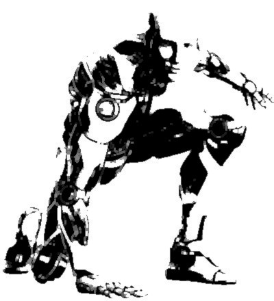

Bien que les **CommLinks** continuent à fonctionner après l'attaque des androïdes, depuis la salle réseau **Cory 3 écoute tous les appels** passés à travers la station.

Il profitera donc des informations échangées par les humains survivants via les CommLinks pour envoyer des androïdes à leur poursuite pour les exterminer.

Bien sûr, aux joueurs de le découvrir par eux-même !
En tant qu'Admin, notez donc bien ce que les joueurs mentionnent comme lieux dans la station durant leurs échanges entre eux ou avec les PNJs par les CommLinks...

## Acte 2 - Back to medbay
Au début de l'acte 2, je vous recommande d'infliger assez vite quelques dégâts aux PJs :

* ils prendront ainsi pleinement conscience de la dangerosité de l'environnement
* cela leur donnera une bonne raison de vouloir retourner au **cabinet médical**.

Une fois au niveau 5, les PJs constateront que :
* le sas de ce niveau a été saboté
* les portes coulissantes à l'entrée du cabinet semblent s'être refermées en **bloquant la jambe d'un androïde**

Celui-ci ne bouge pas, mais est en réalité toujours actif.
Il tentera d'éliminer le premier humain à sa portée.
Si un PJ s'approche, une voix à l'intérieur l'avertira du danger.

À l'intérieur du cabinet, 1D6 rescapés ont trouvé refuge, dont la majorité sont sérieusement blessés et nécessitent des soins urgents.

L'un d'entre eux a eu le réflexe d'activer manuellement la fermeture de la porte pour bloquer un androïde qui s'apprêtait à entrer dans le cabinet.

Les réfugiés sont assez paniqués.
Quel que soit l'endroit où se rendent les PJs après, la moitié des rescapés les suivra.

## Acte 2 - Trolley dilemma au laboratoire
Cette scène vise à mettre les PJs face à un dilemme moral : **de quel PNJ sauver la vie** ?

**Prérequis** à cette scène : les PJs arrivent au **niveau 3**; **Daryl** s'y trouve, dans le laboratoire; **Cotton** est déjà sur place, dans la salle d'analyse, ou bien elle accompagne les PJs et s'y précipite en arrivant, via le sas.

**Disposition des lieux** :

* le **sas privé**, en plus de l'accès extérieur, comporte deux portes : l'une mène à une coursive, l'autre à la salle d'analyse
* la **salle d'analyse est un cul-de-sac**, et contient tous les échantillons et données les plus précieuses de Revolve sur la station
* des écrans suspendus au mur, visibles dans tout le laboratoire, permettent de voir ce qu'il se passe dans le sas privé et la salle d'analyse

Au début, laissez les PJs explorer les lieux, plus ou moins prudemment.
Ils ne doivent pas s'en douter, mais aucun danger ne les attend initialement.

**Sullivan** sera probablement heureux de **retrouver Daryl**.
Celui-ci est soulagé de voir les PJs, et reprend espoir.
Rapidement, il exprime son intention de récupérer ses prothèses de jambes pour pouvoir les accompagner.
Il **se rend alors dans le sas**, où il commence à fouiller parmi les caisses entreposées.
Il se déplace en rampant, mais refuse toute aide.

De son côté, Cotton récupère un maximum de données et d'échantillons précieux.
Elle déclenche également **un début d'incendie**, volontairement et secrètement.
À ce moment là, **5 androïdes font leur apparition**, débarquant à la suite des PJs à l'entrée du laboratoire.
La réussite d'un jet de **Percevoir + Observation** de difficulté 2 permettra à certains PJs des les entendre arriver et d'anticiper leur arrivée en nombre, mais les PJs n'auront **pas le temps de prévenir ou de rejoindre Daryl** dans le sas.

Si les PJs sont trop combatifs et envisagent de leur faire face, indiquez que ces robots se sont **blindés** en soudant des plaques de métal sur leurs membres : torse, jambes, bras.
Cela les rend plus difficile à **Viser** (difficulté 3), et **réduit de 1 les dégâts au contact**.
L'idée est d'inciter les PJs **à fuir ou à se cacher** initialement.

Une fois dans le laboratoire, les androïdes entendent du bruit dans le sas et s'y dirigent immédiatement.
Daryl se planque dans une petite caisse au pied de la porte extérieure du sas,
et échappe initialement à leur vigilance.
Les robots repèrent alors la présence de Cotton dans la salle d'analyse.
Comme celle-ci a verrouillé l'accès de son côté, ils commencent à **défoncer la porte**.

Les PJs peuvent suivre tout ce qui se passe en direct via les caméras retransmises sur les écrans,
y compris l'incendie qui se propage dans la salle d'analyse,
et Cotton à l'intérieur, face à la caméra, qui leur fait de grands gestes d'appel à l'aide.

Dites aux joueurs qu'ils doivent **réagir dans la minute**.
Si besoin, soufflez-leur que là où sont les PJs, ils ont accès aux **commandes du sas**...
Mais si celui-ci est dépressurisé, Daryl risque d'être aspiré...

## Acte 2 - Miracle de la fin du monde
Durant l'acte 2, tous les membres survivants de l'Ascension se réfugieront à **l'animalerie abandonnée des Arches**, leur lieu de culte.
Parmi les survivants que les PJs croiseront à travers la station, il est probable que certains soient des croyants cheminant vers ce lieu. Ils hésiteront néanmoins à révéler l'existence de ce lieu à des non-adeptes.

Si les PJs se rendent sur place, il sera délicat de trouver un accès discret.
Casser une vitre ou frapper à la porte condamnée éveillera immédiatement l'attention des cultistes, qui craindront l'intrusion d'androïdes, et se prépareront à défendre leur dernier refuge.

Il est néanmoins possible de passer par la boutique de bijoux attenante (De Lucina),
et de forcer une serrure, pour s'introduire dans le repaire du culte.
Dans ce cas, les PJs découvriront les croyants prosternés devant Watters, priant pour être sauvés en récitant une longue litanie, tandis que leur prêtre leur annonce la fin du monde.

La mallette est cachée dans un coin de la pièce. Si les choses tournent mal, Watters s'enfuira rapidement elle, et **un incendie** risque de rapidement se déclarer, l'un des nombreuses torches présentes mettant le feu à un tas de poils d'animaux synthétiques.

::: page-break
:::

## Acte 2 - Face à Cory 3
À moins qu'ils ne trouvent un moyen de reprendre le contrôle des androïdes sans visiter le niveau 1,
il est fort probable que les PJs affrontent Cory 3 à un moment donné.
Ce dernier les attend patiemment à cet étage. Et il est bien préparé et sournois...

### Déstabilisation
Pour accueillir d'éventuels visiteurs, Cory 3 a suspendu un agent de sécurité au plafond **par les tripes**.
Celui-ci est toujours vivant, et implore les PJs de mettre fin à ses souffrances.
De l'**eau électrifiée** recouvre le sol sous le pauvre homme : si des PJs tentent de le décrocher,
un jet de **Percevoir + Observation** difficulté 2 permettra de repérer le piège avant qu'il ne soit trop tard,
et que les personnages ne perdent 1 PV.

<figure class="float-right">
  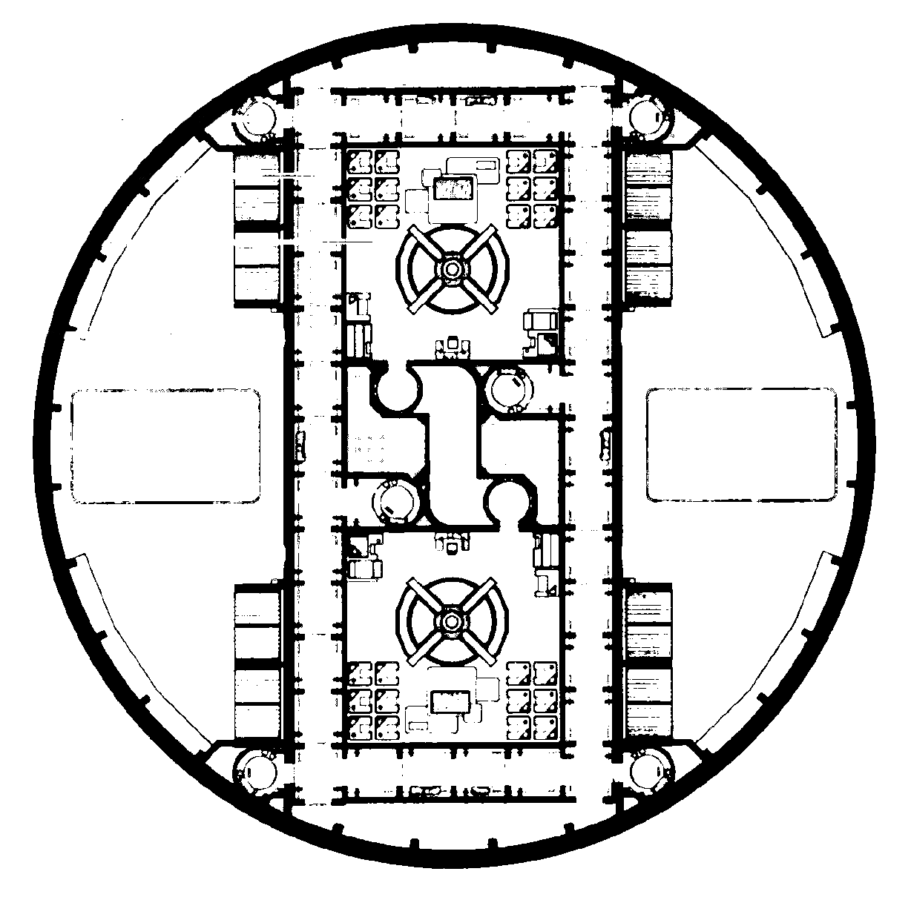
  <figcaption>Plan du niveau 1</figcaption>
  <!-- Source: https://www.cygnus-x1.net/links/lcars/sd-class-2-space-station.php -->
</figure>

### Bobby Trap
Cory 3 a **piégé le niveau 1**, de manière à ce qu'**une bonbonne d'azote liquide se répande aux pieds des PJs** : à moins de réussir un jet de **Percevoir + Observation** difficulté 3 pour repérer le fil déclencheur, les PJs présents se retrouvent aspergés !

Ils peuvent encore réagir et retirer très vite leurs vêtements, l'effet _Leidenfrost_ les protégeant un bref instant. S'ils n'ont pas ce réflexe, ils subissent un point de dégât et perdent définitivement un point en **Agir**.

Deux androïdes profitent du déclenchement du piège pour débarquer et attaquer les PJs.

### Otage

Cory 3 attend patiemment, dissimulé dans une coursive, derrière un amoncellement de cables électriques.
Lorsque les PJs baisseront leur garde, après avoir fait le tour des lieux, il empoignera le premier PJ isolé passant près de lui.
* sur un jet de **Agir + Réflexes** difficulté 3 réussi, le PJ peut réagir à temps et fuir ou affronter Cory 3.
* si le jet est raté, le PJ se retrouve bâillonné d'une main ferme par l'androïde, un revolver sur la tempe :

> Souhaites-tu que j'abrège tes souffrances dès maintenant ?

Cory 3 sort alors de l'ombre, utilisant le PJ comme otage et bouclier, et réclame des autres personnages qu'ils lâchent leurs armes.

* s'ils obtempèrent, Cory 3 ordonnera ensuite à un PJ de **ligoter un à un les autres**, tout en conservant son otage, puis soudainement **il abattra tous les personnages**, en commençant par celui qu'il a capturé.

* s'ils refusent, et que la tension monte, Cory 3 finira par **tirer sur une bonbonne d'azote liquide** qui se mettra à cracher son gaz entre les PJs d'un côté et Cory 3 de l'autre. Ensuite, il **canardera les PJs** en utilisant son otage comme bouclier.

 

::: insert large block-center
### Avis de décès
Mon conseil : débutez cette scène avec l'intention de **tuer un PJ**.

 

Cela n'arrivera pas forcément, le hasard des dés et les réactions des joueurs l'empêcheront peut-être,
mais c'est selon moi **un moment idéal** dans ce scénario pour qu'un décès survienne autour de la table.

 

Voici trois bonnes raisons pour que vous débutiez cette scène avec une intension meurtrière :
* de mon humble expérience personnelle en tant que MJ, il est **peu probable qu'un PJ meure dans une scène si je ne l'anticipe pas** : j'ai tendance à ménager les PJs déjà « mal en point », et à éviter les décès reposant uniquement sur un mauvais jet de dés.
* il est bien **plus amusant pour un joueur** que son PJ décède dans une telle scène de « confrontation finale » plutôt qu'en perdant son dernier PV dans une scène à moindre enjeu dramatique.
* le décès d'un PJ est souvent **un moment fort** : le personnage « brille » une dernière fois lors de cette sortie de scène ; sa dernière action sera mémorable ; c'est une opportunité de _roleplay_, pour mettre en scène la réaction des autres PJs et leur deuil ; etc.

Et voici quelques conseils pour **réussir votre scène de mort de PJ** :
* essayez de cibler un PJ qui n'est pas crucial pour le reste du scénario : dommage de tuer **Park** s'il n'a pas encore activé ou évoqué sa balise.
* idéalement, offrez un **choix cornélien** au joueur otage :

> « Tu veux essayer de prendre Cory 3 de vitesse en saisissant son flingue ?
> OK très bien, mais c'est un robot, il est peu probable que tu réussisses.
> Plutôt qu'un jet, je te propose ceci : tu peux réussir cette action automatiquement si tu es prêt à le payer de ta vie. »

* **mettez le PJ en valeur** lors de ses derniers instants : laissez-lui l'occasion d'une dernière phrase, lors de sa dernière action ou lorsqu'il agonisera au sol.
* anticipez et prévoyez de proposer **un PNJ à jouer en remplacement**, pour le premier joueur dont le PJ décède.
:::

::: page-break
:::

## Acte 3 - Répulsif & possessions
Après avoir affronté des androïdes génocidaires, les PJs font face dans l'acte 3 à deux nouveaux antagonistes :
les larves cosmiques et « La Sécurité ».

Afin de doser la tension dramatique et temporiser l'adversité, une idée peut être
de **rendre les PJs témoins passifs** des atrocités commises par les larves, dans un premier temps.

Pour cela, vous pouvez introduire un autre objet dans **la mallette transmise à Watters** :
une canette de **_spray_, étiquetée « RÉPULSIF »**, placée à côté des 6 fioles réfrigérées.
Il est fort probable que la mallette tombe à un moment ou à un autre dans les mains des PJs,
et même si Watters a déjà récupéré les fioles, il aura laissé ce _spray_.

Les PJs n'auront aucun moyen d'en savoir plus sur ce produit, mais il est fort probable qu'ils tentent
de s'en servir, et il s'avère effectivement **éloigner les humains possédés par des larves**.
Ces derniers ignorent totalement un personnage recouvert de cette substance, comme s'il ne le percevaient pas.

Bien sûr, la canette n'est pas inépuisable, et l'efficacité du produit limitée dans le temps.
Considérez que la protection dure **une heure**,
après quoi les « possédés » deviendront progressivement de plus en plus suspects
envers les personnages recouverts de la substance.
D'autre part, la canette contient suffisamment de produit pour **protéger tous les PJs**,
après quoi chaque utilisation supplémentaire provoquera un **jet de dé** :
en cas d'échec (1 / 2 / 3), **cet emploi est le dernier, la canette s'est vidée**.

L'objectif de cette mécanique de jeu est que les PJs assistent à **des scènes horribles**,
se déroulant sous leurs yeux sans qu'ils soient mis en danger
mais aussi sans qu'ils puissent sauver les victimes :
* rituel du culte de l'Ascension pour faire ingérer une larve à un personnage : **Léo·Léa** de son plein gré, ou **Jada Jones** malgré elle
* fécondation par un·e « possédé·e » de nouvelles larves dans l'estomac d'une victime : **Daryl Hamon** ? Un PJ ? Un autre PNJ ?
* éclosion d'une larve et transformation de son hôte

Favorisez la possession par des larves de personnages que les PJs ont rencontré,
afin de rendre leur agonie tragique et la situation encore plus horrifique.

::: page-break
:::

## Acte 3 - Sécurité subtile
« La Sécurité » est décrite comme des mercenaires _« froids, méthodiques, discrets »_,
qui réalisent leur opération d'extraction sans se poser la moindre question.

Ce module vous propose de rendre ces antagonistes un peu plus roublards et cinématographiques,
bref : plus amusants pour les joueurs à affronter.

Conscients du risque que représente une intervention armée à l'encontre d'une station comme Terra Nova,
une fois la balise déclenchée ou le « délai raisonnable » épuisé,
« La Sécurité » dépêche deux agents à bord, avec comme mission :

1. de **localiser la mallette**, et même la récupérer si l'occasion se présente
2. si besoin, de **déclencher l'intervention** des troupes, puis de les diriger à bord

Ces officiers arrivent donc à bord au début de l'acte 3, se propulsant depuis l'Illisos,
leur vaisseau, vers la station en expulsant du gaz de leurs combinaisons spatiales.

 

<!-- We use flex boxes because with WeasyPrint float-right messes up the list ::markers -->
:::: row
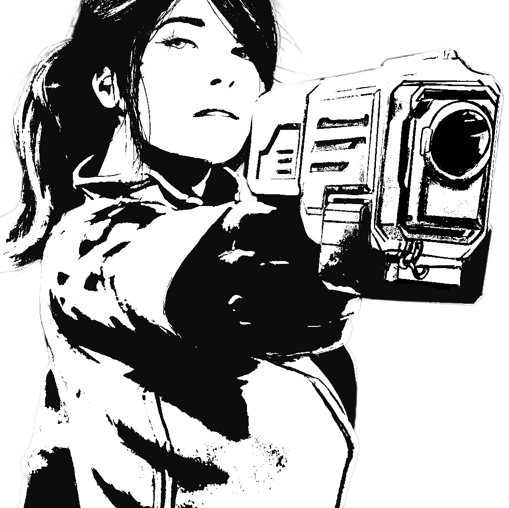
<!-- Source : https://www.goodfon.com/fantasy/wallpaper-fantastika-art-devushka-sci-fi.html -->

::: column no-list-margin-bottom
**Couverture** : _Johanna_, civile en détresse

**Point d'entrée** : sas du niveau 3 - si bloqué : sas du niveau 5

**Mode opérationnel** :

1. Rejoindre le groupe en possession de la mallette
2. Selon qui la possède, manipuler Watters / Park / les PJs
3. Voler la mallette en employant sa capsule soporifique
:::
::::

<!-- On the contrary, WeasyPrint does not properly position an image flex box left to a another box, so we use float: -->
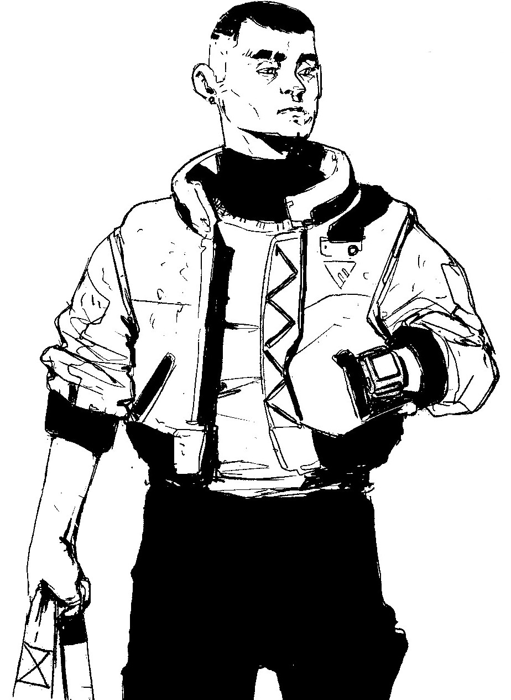

**Couverture** : _Alex_, manœuvre avec un plan d'évacuation

**Point d'entrée** : niveau 9, via un sas d'accès aux vaisseaux

**Mode opérationnel** :

1. D'abord observer à distance le groupe ayant la mallette
2. Prétendre venir en secours et proposer de conduire les personnages à un vaisseau recueillant les survivants
3. Une fois dans une coursive « préparée » à l'avance, activer une porte de sécurité pour couper le couloir, et braquer les personnages avec la mallette

Les deux agents sont équipés chacun d'une arme à feu de poing,
d'un _taser_ de contact, d'une oreillette de communication (entre eux et avec l'Illisos),
d'une capsule de gaz soporifique, d'un masque respiratoire
et d'une petite dose d'explosif.

Bien qu'ils puissent abuser de sa crédulité,
aucun des deux agents ne se soucie sincèrement du sort de Park.
Ce dernier risque cependant de sérieux problèmes s'il n'a pas accompli sa mission.
Il est peu probable qu'il puisse identifier les agents,
mais vous pouvez lui permettre un jet de **Percevoir + Observation** de difficulté 4 pour cela.

Si leur mission se passe bien, ils prévoient de repartir avec leur combinaison spatiale,
qu'ils ont caché à proximité de leur point d'arrivée.
Leur « plan B » commun, en particulier si les PJs s'interposent,
sera de déclencher l'intervention des autres mercenaires de l'Illisos,
qui accostent alors la station en l'espace de quelques minutes.

Bien que _« froids, méthodiques, discrets »_, ces agents n'en restent pas moins humains :

* si leur vie est menacée, ils préféreront révéler ce qu'ils savent plutôt que de mourir

* des PJs persuasifs pourraient les convaincre qu'ils ne peuvent pas abandonner les survivants à leur sort, alors que la station chute vers Cepheus

## Acte 3 - Exit
Voici quelques options supplémentaires s'offrant aux PJs pour quitter la station :

* **Illisos**, le vaisseau de « La Sécurité », dans les conditions décrites par le livre.
* l'**Eridanos** a été gravement endommagé suite aux explosions du niveau 9, mais certains **pods de survie** sont encore utilisables : 1D6 sont fonctionnels, et d'autres sont réparables, par exemple par Arora avec sa capacité spéciale.
* au niveau 4, une compagnie de transport expose un modèle de vaisseau « d'escorte » biplace, le **Céphise**. Assemblé sur place et fonctionnel, la plus grande difficulté pour employer cette embarcation sera de la faire sortir de la station... Au vu du temps limité dont disposent les PJs, faire exploser une paroi de l'étage risque d'être l'une des seules options envisageables.

Idéalement, les PJs doivent avoir vent de ces options durant l'acte 2,
mais ne pourront seulement y accéder que durant l'acte 3,
par exemple parce que les endroits concernés sont scellés où pullulent d'androïdes.

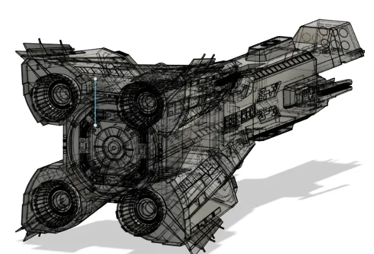

::: page-break
:::

## Diagramme des étapes du scénario

 
<!-- La meilleure solution pour avoir un rendu "vertical" lisible a été de découper le diagramme en 2 -->

::: page-break
:::

## Galeries d'illustrations
J'ai constitué une galerie d'illustrations sur Pinterest pour chaque acte du scénario :
* <https://www.pinterest.fr/drmaxkurt/paradis-perdu-acte-1/>
* <https://www.pinterest.fr/drmaxkurt/paradis-perdu-acte-2/>
* <https://www.pinterest.fr/drmaxkurt/paradis-perdu-acte-3/>
* <https://www.pinterest.fr/drmaxkurt/paradis-perdu-persos/>

::: insert sf-bg-01 block-center
Cher lecteur informaticien, tu peux facilement télécharger et afficher ces albums dans une galerie web locale avec [Sigal](http://sigal.saimon.org/en/latest/), qui intègre notamment un mode diaporama.

Pour cela, récupère au moins les fichiers `sigal.conf.py` et `gen_gallery.sh` du [repo GitHub Lucas-C/jdr/ParadisPerdu](https://github.com/Lucas-C/jdr/tree/master/ParadisPerdu), puis :

`./gen_gallery.sh`

`sigal serve --browser`
:::

 

## Ambiance sonore
À la fin du livre, **Yno** propose une _playlist_ YouTube.

Voici des _playlists_ alternatives, distinctes selon les actes du scénario :
- [_playlist_ YouTube d'ambiance pour l'acte 1](https://youtube.com/playlist?list=PLLgE-ga3W_kZtrfXpoCl29f0AaEm1lJ1W), basée notamment sur les bande-sons de _Citizen Sleeper_ et _EVE Online_
- [_playlist_ YouTube d'ambiance pour les actes 2 & 3](https://www.youtube.com/playlist?list=PLLgE-ga3W_kZxl-ncvX6RB6knVt3jO3CL), basée notamment sur les bande-sons de _Death Stranding_ et _Dead Space_

Afin d'éviter les pubs sur YouTube (et ailleurs), je vous recommande vivement l'extension de navigateur web [uBlock Origin](https://ublockorigin.com/fr).

::: page-break
:::

Et voici une sélection de morceaux plus « remarquables », pour des scènes spécifiques :

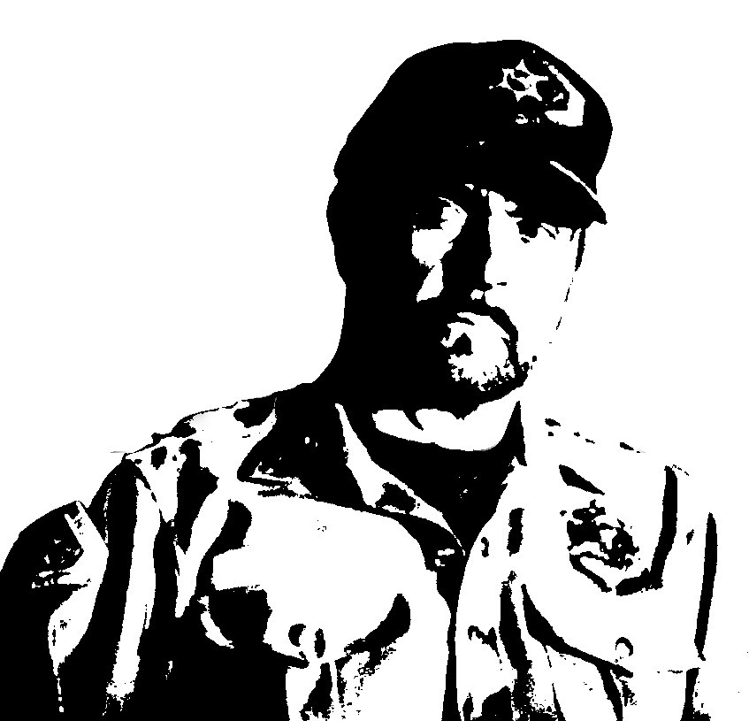

* [ludoWic - Katana ZERO](https://www.youtube.com/watch?v=_pMyRRFUMBE) (4min30) : crescendo électro de tension palpable **→** lancez ce morceau au début de la scène du **meurtre du marshal O'Neil**
* [CYBERPUNK IS COMING - Extra Terra](https://www.youtube.com/watch?v=6Pia2X856wo) (7min) : crescendo de tension assez épique **→** lancez ce morceau lorsque les PJs découvrent **la révolte des androïdes**, et que vous leur décrivez la station qui bascule dans le chaos
* [Sutra japonais chanté](https://www.youtube.com/watch?v=a4vmA9noFXo) (25min) : longue litanie répétitive **→** pour **la messe du culte de l'Ascension** dans l'animalerie abandonnée.
* [The War - Gerald Trottman - The Expanse](https://www.youtube.com/watch?v=0--XpUQKBUQ) (3min) : ambiance étrange, rythme qui s'intensifie puis ralentit à la fin **→** employez ce morceau comme **thème pour « La Sécurité »**, à jouer lorsqu'ils interviennent dans le secteur où sont les PJs
* [Heat Her Up - Clinton Shorter (The Expanse)](https://www.youtube.com/watch?v=V44uJKyS5LM) (4min) : crescendo « industriel » **→** pour une scène où les PJs mettent en œuvre **leur plan d'action**
* [Beam - Volkor X](https://www.youtube.com/watch?v=kT7kZ7HPJYM) (8min30) : crescendo très épique **→** fond sonore pour votre fin de partie, pour la fuite de la station

<!--
Playlist The Expanse : [YouTube](https://www.youtube.com/playlist?list=PLLcod52t0kpfVsHz0laVYGX0owh05NR5W)
-->

  

::: insert sf-bg-01 block-center
Cher lecteur bidouilleur, il peut être amusant pour surprendre tes joueurs de préparer de quoi produire une **synthèse vocale** des paroles d'androïdes de la page 64.

 

Pour ma part j'ai employé [espeak](https://doc.ubuntu-fr.org/espeak).

Le script `android-voice.sh` du [repository GitHub Lucas-C/jdr/ParadisPerdu](https://github.com/Lucas-C/jdr/tree/master/ParadisPerdu) permet de vocaliser quelques phrases.
:::

::: page-break
:::

## Clips vidéos
Julien « Khamûl » Corroyer a réalisé une splendide bande annonce,
que je vous encourage à envoyer à vos joueurs avant la partie :
[Trailer pour Paradis Perdu - L'Antre de Khamûl](https://www.youtube.com/watch?v=Za2wS_ldKTw).

Voici également quelques autres vidéos YouTube qu'il peut être intéressant de montrer aux joueurs pour contribuer à l'ambiance de la partie :
* [Enders Game Battle School](https://www.youtube.com/watch?v=t-dxN6VU-Io) : **→** pour l'arrivée sur la station Terra Nova
* [The Callisto Protocol - Cockpit Screens & Holograms](https://youtu.be/ombj_8ceiAk?si=jjYwH62y9V7paMVY&t=17) : à partir de 0:17 **→** pour présenter le cockpit de l'Eridanos
* [Falling Frontier Trailer](https://youtu.be/I4zto6KRnWQ?si=Dor0rJgCTHEBX5se&t=15) : à partir de 0:15 jusqu'à 2:05 **→** pour donner une idée de la terraformation de Cepheus
* [Dead Space | Bande-annonce officielle](https://www.youtube.com/watch?v=l5WeBNfX-og) : s'arrêter à 0:40 **→** pour introduire les créatures de l'acte 3

<!--
Le script [gen_video_clips.sh](./gen_video_clips.sh) se charge de télécharger certaines de ces vidéos pour les rendre disponibles dans la galerie Sigal.
-->

    
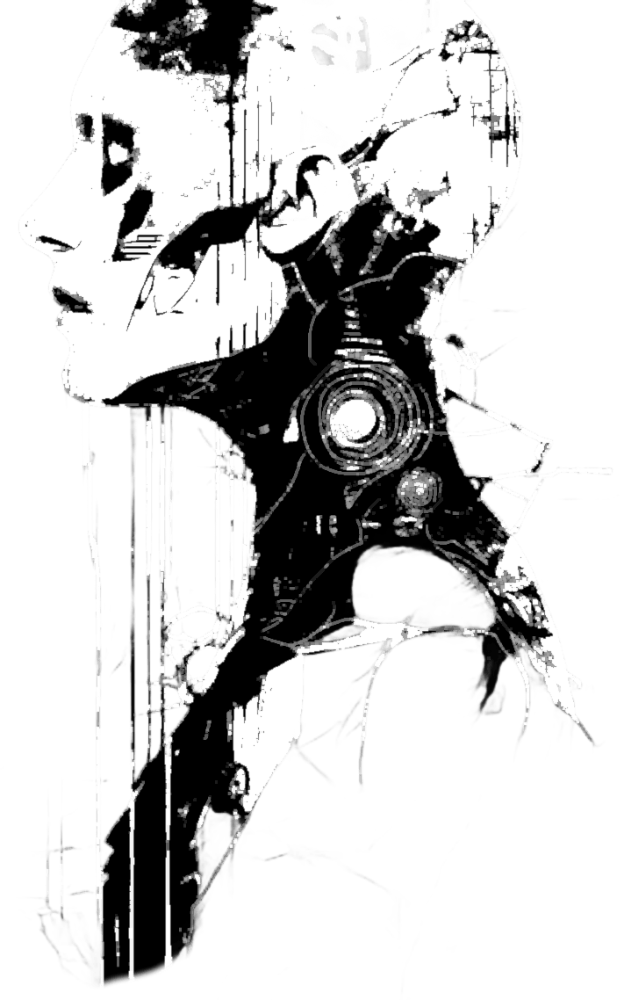

::: page-break
:::

## Remerciements
Merci aux illustrateurs qui ont placé leur travail sous licence _Creative Commons_ :

* un dessin d'[Elliot Jolivet aka Tenseï réalisé lors d'Inktober 2017](https://www.behance.net/gallery/58695271/InkTober-2017)
* [Blade Runner](https://www.deviantart.com/fernand0fc/art/Blade-Runner-825143976), [Delivery](https://www.deviantart.com/fernand0fc/art/Delivery-802145258), [HAZMAT](https://www.deviantart.com/fernand0fc/art/HAZMAT-695221129) & [HeadShots](https://www.deviantart.com/fernand0fc/art/HeadShots-743989425) de Fernando Correa - [CC BY](https://creativecommons.org/licenses/by/3.0/)
* [Helmet concepts](https://www.deviantart.com/akol3850/art/Helmet-concepts-540178128) de Godstime Ojinmah - [CC BY-NC](https://creativecommons.org/licenses/by-nc/3.0/)
* quelques illustrations sont à l'origine issues de [pixabay.com](https://pixabay.com) : [Homme, Visage, Arrière](https://pixabay.com/fr/illustrations/homme-visage-arri%C3%A8re-poser-robot-320272/) - [AI généré, Robots, Cyborgs](https://pixabay.com/fr/illustrations/ai-g%C3%A9n%C3%A9r%C3%A9-robots-cyborgs-android-8920129/) - [AI généré, Femme, Cyborg](https://pixabay.com/fr/illustrations/ai-g%C3%A9n%C3%A9r%C3%A9-cyborg-femme-fille-8269779/) - [AI généré, Robots, Cyborgs](https://pixabay.com/fr/illustrations/ai-g%C3%A9n%C3%A9r%C3%A9-robots-cyborgs-android-8920129/) - [AI généré, Grunge, Cyborg](https://pixabay.com/fr/illustrations/ai-g%C3%A9n%C3%A9r%C3%A9-grunge-cyborg-robot-9008140/)
<!--
 - [AI généré, Femme, Cyborg](https://pixabay.com/fr/illustrations/ai-g%C3%A9n%C3%A9r%C3%A9-cyborg-femme-fille-8269778/)
-->

Merci aux relecteurs & testeurs de ces modules : Anna, Aurélien, Matthieu, Michaël, Mirko.

Merci enfin aux développeurs des [logiciels libres](https://fr.wikipedia.org/wiki/Free/Libre_Open_Source_Software) employés : [le navigateur Firefox](https://www.mozilla.org/fr/firefox/), [le logiciel de dessin Gimp](https://www.gimp.org/), [l'éditeur de texte Notepad++](https://notepad-plus-plus.org/), [le lecteur de PDF Sumatra PDF](https://www.sumatrapdfreader.org), [le language de programmation Python](https://www.python.org/), les bibliothèques de code [mistletoe](https://pypi.org/project/mistletoe/), [weasyprint](https://weasyprint.org/), [Graphviz](https://graphviz.org/) & [sketchviz](https://github.com/gpotter2/sketchviz), et le terminal web [github.com/jacksonbenete/email_terminal](https://github.com/jacksonbenete/email_terminal).

Les configurations des deux terminaux CommLinks sont disponibles ici : [Lucas-C/email_terminal/acte-1](https://github.com/Lucas-C/email_terminal/tree/acte-1) & [Lucas-C/email_terminal/acte-2](https://github.com/Lucas-C/email_terminal/tree/acte-2).

   

## Licence & feedbacks

Cette aide de jeu de Lucas Cimon est placée sous licence <a rel="license" href="https://creativecommons.org/licenses/by-nc-sa/4.0/deed.fr">Creative Commons Attribution-NonCommercial-ShareAlike 4.0 International</a>.

Les fichiers sources pour générer ce PDF sont disponibles [sur GitHub](https://github.com/Lucas-C/jdr/tree/master/ParadisPerdu). Version : 1.0

Cette aide de jeu est diffusée à prix libre.
Si vous souhaitez soutenir mes projets, vous pouvez me faire un don sur [lucas-c.itch.io](https://lucas-c.itch.io/modules-de-secours).
Je serais ravi d'avoir vos retours si vous l'employez :
racontez-moi comment s'est passée votre partie via un commentaire [lucas-c.itch.io](https://lucas-c.itch.io/modules-de-secours) ou sur [mon blog](https://chezsoi.org/lucas/blog/modules-de-secours.html).

<!--
Design goals:
* s'intégrer à l'histoire, en faisant de multiple références
* s'intégrer au système, en provoquant des jets de dés
* rendre la station plus "vivante" et mémorable
* fournir plus d'éléments scénaristiques structurants pour les actes 2 & 3
* forcer les joueurs à faire des choix cornéliens, aux conséquences palpables
* amener des éléments d'intrigue supplémentaires dans l'acte 1 qui seront exploitées lors des actes suivants
* donner le sentiment aux joueurs qu'ils risquent leur peau à tout instant dans les actes 2 & 3
* ne pas rallonger la durée de partie excessivement

Séquence de filtres Gimp employés :
0. (optional) Remove background using: https://huggingface.co/spaces/briaai/BRIA-RMBG-1.4
1. Couleurs > Seuil noir & blanc
2. Filtres > Flou > Flou gaussien : 0,5
3. Filtres > Génériques > Éroder
4. Filtres > Génériques > Dilater
Séquence alternative :
1. Convert to greyscale
2. Convert to indexed palette with 3/4 colors

Avis post-partie de ~11h avec 5j :
* super top dans l'ensemble !
* fin de partie moins "maîtrisée" et au rythme plus lent :
  notamment, délicat de gérer le cumul d'ennemis (Cory 3 / cultistes possédés par larves / "La Sécurité" / Darcy)
  et de proposer une conclusion de partie "au niveau" des enjeux narratifs
  -> les "options de sortie" pour les PJs sont trop peu claires
  -> trop d'ennemis apparaissent "soudainement", sans être suffisamment "incarnés", par ex. "La Sécurité"
    => faire en sorte que le chef de "La Sécurité" soit un PNJ déjà rencontré : Curtis Oakes ?
        Il rôde pendant tout l'acte 1 autour des PJs, et reste dans sa planque à l'acte 2.
        -> pas cohérent, car alors pas besoin de balise...
* [x] inclure Cory 3 comme PNJ & détailler sa personnalité -> illus
* [x] illustration pour Léo·Léa & Harp Waschenski
* [x] illustration pour Daryl Hamon
* [x] Léo·Léa & Harp Waschenski sous-exploités
* [x] détailler les "options de sortie" des PJs => section dédiée ajoutée
* [x] + exploiter niveau 4 => Céphise
* [x] encourager à ce que les PNJs possédés par les larves soient des personnages que les PJs ont rencontré
* [x] mieux introduire & incarner "La Sécurité"
* [x] morceau pour la mort de O'Neil
* [x] thème des androïdes révoltés
* [x] thème pour "La Sécurité"
* [ ] thème des larves cosmiques
* Inspiration from [The Black Hole](https://www.youtube.com/watch?v=uYuNjz322h8) : les androïdes sont en fait des humains lobotomisés !
  ... et Cory 3 pourrait abriter le corps de l'amour défunt d'Arora

Com'
* [x] https://lucas-c.itch.io/modules-de-secours
* [x] https://chezsoi.org/lucas/blog/modules-de-secours.html
* [x] https://chezsoi.org/lucas/blog/pages/jeux-de-role.html
* [x] Links in https://github.com/Lucas-C/jdr README.md & index.md
* [x] https://www.scenariotheque.org/Document/info_doc.php?id_doc=11242
* [x] post sur le fil Ludochaordic du Discord CestPadDuJdr
* [x] https://www.misterfrankenstein.com/wordpress/?p=5701
-->
