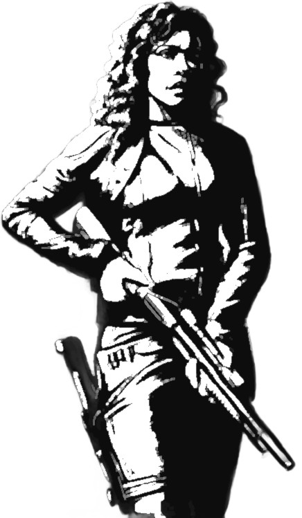

# Paradis Perdu
# Modules de secours

<!--br>  

 <br-->

Ceci est une aide de jeu pour [Paradis Perdu](https://www.misterfrankenstein.com/wordpress/?p=5388), un excellent jeu de rôle « Nuit Blanche » d'Anthony "Yno" Combrexelles.
Il se compose d'un ensemble de modules optionnels, que vous pourrez adopter pour ajouter des rebondissements supplémentaires au scénario original. Ces modules m'ont également beaucoup aidé en tant que MJ pour préparer ma partie, et compléter quelques points non détaillés dans le jeu de base.

### Sommaire

- [Plan de la station Terra Nova](#plan-de-la-station-terra-nova)
- [Terminaux CommLinks](#terminaux-commlinks)
- [PNJs](#pnjs)
- [Intro - Connivences](#intro-connivences)
- [Acte 1 - L'œil pour le détail](#acte-1-l-il-pour-le-d-tail)

TODO : à compléter + vérifier que liens fonctionnent + intégrer sections du README.md

## Plan de la station Terra Nova

### Déplacements
TODO - à rédiger : en substance, l'idée est de réaliser des micro-ellipses lorsque les PJs progressent à travers des étages où il ne se passe rien. + rappel table des **Rencontres** avec des androïdes page 63

À chaque fois que les PJs veulent se rendre d'un point A à un point B dans la station, indiquez le ou les itinéraires qu'ils peuvent envisager, ils en choisissent un, puis je leur indique la ou les situations qu'ils rencontrent en chemin

## Terminaux CommLinks
[github.com/jacksonbenete/email_terminal](https://github.com/jacksonbenete/email_terminal)

Tout le monde peut y accéder si on montre la manip' à effectuer, mais au début seuls Arora et Sullivan connaissent l'existence de cette fonctionnalité cachée.
Donne accès :

* infos générales : coordonnées de la station (mouvantes), population, liste des étages, référents du personnel...
* inscription pour consultation auprès du Dr Aberdeen (après 3 inscriptions -> msg de détection d'un usage abusif du système)
* système d'audit des télécommunications : nécessite mdp fourni à Arora, tout est OK mais ghost de son ancien amour qui insère des msgs
* emplacements des androïdes, niveau par niveau
* liste des vaisseaux à quai
Secrets / enigmes :
* infos sur le projet Hunter via Daryl, qui a beaucoup de temps libre et s'est amusé à mettre en ligne sur le réseau de la station un petit easter-egg challenge, permettant s'il est battu d'échanger avec lui + il mentionnera la réception d'une émission radio cryptée, qui une fois dechiffrée permet de capter un échange d'info avec le vaisseau de « La Sécurité » envoyé par Deware

TODO : préparer une 2e version "dégradée" publiée en ligne durant la partie : plus aucun vaisseau listé à quai, gros soucis remontés par l'audit de communication, niveau d'oxygène de la station réduit, etc.

## PNJs
En complément des informations données dans le scénario, cette section propose quelques éléments supplémentaires pour jouer les PNJs, en détaillant notamment leurs objectifs durant les actes 2 et 3, leur attitude face aux PJs, la manière la plus probable dont ils décèderont, et un conseil sur comment interprêter théâtralement chaque personnage. Je me suis inspirés pour ce dernier point de l'article [_Comment interpréter les traits distinctifs des PNJ_ de James Introcaso, traduit sur ptgptb.fr](https://ptgptb.fr/interpreter-les-traits-distinctifs-des-pnj).

Concernant les _morts probables_ : ces indications sont là pour vous encourager à décimer progressivement les PNJs au fur et à mesure du scénario, et ainsi maintenir la tension dramatique. N'hésitez pas pour autant à improviser et les faire décéder autrement !

### Brett Bettany

* n'apprécie pas les dockers & manœuvres, qu'il trouve méprisant envers les ouvriers, et en particulier Ellen Frost qu'il déteste.

* connait Watters et sa promotion du culte de l'Ascension. Il s'en méfie comme de la peste.

* a connaissance d'**une arme de contrebande (fusil à pompe) planquée au niveau 4**, dans un recycleur.

* durant les actes 2 & 3, peut fournir des **combinaisons spatiales**

* **Objectifs** : initialement paniqué, Brett se reprendra après la tuerie initiale, et aidera 1D6+2 ouvriers à se barricader dans un petit hangar au niveau 10. Ensuite&nbsp;:
    1. protéger les ouvriers, et s'armer pour se défendre
    2. trouver un vaisseau fonctionnel pour se tirer cette station
    3. fuir en embarquant un maximum d'ouvriers avec lui

* **Attitude** : coopératif avec les PJs si cela le rapproche de ses objectifs. En cas de situation critique pour lui ou des ouvriers, il n'hésitera pas à jeter les PJs en pâture à des ennemis pour leur échapper.

* **Roleplay** : posture très droite, presque rigide; parle de manière lente et posée, en prennant de profondes inspirations avant chaque nouvelle phrase.

* **Mort probable** : en prennant d'assaut le vaisseau de « La Sécurité ».

### Isaac Cameron

* à l'acte 1, en plus des activités mentionnées par le scénario (pages 51 & 52), il sera en train d'enquiller les verres d'alcool fort au **bar le Kapow, au niveau 8**, au début de l'acte 2.

* armé d'un **revolver**, il récupère le **taser** d'un marshal décédé et comprend vite qu'il est plus efficace contre les androïdes.

* la moitié du paiement lui a été viré sur un compte extraplanétaire, l'autre lui a été remis « en liquide  », via des liasses de **crédits planqués dans une bible**

* **Objectifs** :
    1. Survivre et fuir la station
    2. En profiter pour récupérer ce qui a de la valeur

* **Attitude** : combatif, il n'hésite pas à affronter les androïdes, sans prendre de risques inutiles; s'il croise les PJs, il sera méfiant mais pas belliqueux, et pourra les accompagner un temps. Il grommele ses soupçons concernant Waters : _« Quel salopard... Tout est parti en vrille après le _deal_, comme par hasard... »_

* **Roleplay** : vouté; crispé, mais essaie de paraître détendu; se tripote les doigts constamment, ou les tapote sur la table.

* **Mort probable** : blessé mortellement par « La Sécurité », il agonise dans un recoin

### Candy Davies

* si les PJs remontent la piste des vendeurs de Tedium, ils entendront vite parler d'elle

* elle reconnaîtra facilement avoir vendu du Tedium, mais sera réticente à balancer son fournisseur.

* ce qui peut la convaincre de révéler ce qu'elle sait : une grosse somme d'argent; qu'on lui rapporte des propos l'accusant de Jones ou Cotton; qu'on l'intimide sérieusement (jet de **S'imposer (+ Argumentation)**)... La menace d'alerter « les flics » ne l'effrayera pas.

* si elle le peut, elle balancera seulement Jones, car Coton est une cliente qui paye bien et ne l'a jamais trahie. Et elle l'aime bien.

* **Attitude** : nubile et allumeuse, quel que soit le genre de son interlocuteur•rice; elle est volubile et colportera volontiers infos et commérages sur toutes les personnes connues de la station

* **Roleplay** : voix suave; mache un chewing-gum; se tripote les cheveux; _« mon bichon »_; _« mon•a poulet•te »_; _« petit•e coquin•e »_, _« petit•e coquin•e »_, etc.

* **Mort probable** : au début de l'acte 2, tuée par un androïde sous les yeux des PJs

### Darcy Cotton

* durant l'acte 1, elle essaiera d'éloigner les soupçons d'elle concernant le Tedium. Elle identifiera positivement la substance, mais évoquera un vol récent dans les bureaux de Revolve, signalé à la sécurité, et que le secret industriel lui empêche d'en dire plus. Lui faire avouer la vérité nécessitera beaucoup de ruse, ou un jet réussi de **S'imposer (+ Argumenter)**.

* durant l'acte 2, elle sera initiallement **bloquée dans sa cabine, au niveau 6**, des androïdes l'empêchant d'en sortir. Elle tentera alors de joindre des survivant via CommLink, et elle justifiera si besoin de son utilité en évoquant son expertise en IA & communications à Revolve.

* une fois qu'elle aura l'occasion d'examiner un androïde, elle sera la 1ère PNJ à **comprendre que Cory 3 est à l'origine de la rébellion**, et qu'il commande aux androïdes depuis la salle réseau du niveau 1 (_cf._ [Terminaux CommLinks](#terminaux-commlinks)), et que..

* elle a accès depuis n'importe quel CommLink à toutes les caméras de sécurité en activité de la station. _(MJ : pratique pour introduire des rebondissements)_

* elle connaît bien Deware, et saura identifier les intentions de « La Sécurité » à leur arrivée. Elle mettra en garde les PJs, inquiète pour elle-même.

* **Objectifs** :
    1. Survivre : retrouver et suivre Jones lui semble initiallement le meilleur choix
    2. Comprendre ce qui est arrivé aux androïdes
    3. Étouffer cette affaire, et détruire le labo de Revolve

* **Attitude** : aucun remord à s'en sortir seule, mais elle sait qu'elle aura d'abord besoin d'alliés. Elle joue les pimbêches candides pour mieux leurer son monde, alors qu'elle a des nerfs d'acier. Elle a une arme à feu mais évitera de le montrer.

* **Roleplay** : joue les appeurées et fait preuve d'auto-dérision; rit à ses propres touches d'humour, et recherche la complicité de ses interlocuteurs; se masse constamment les épaules; lance parfois des regards perçants trahissant sa dureté.

* **Mort probable** : éventrée par une larve cosmique, après avoir trahi les PJs.

### Daryl
* **Objectifs** :

* **Attitude** : 

* **Roleplay** :

* **Mort probable** :

### Ellen Frost

* persuadée que GEC a causé l'attaque des androïdes pour mater les ouvriers, suite à la révolte sur Cepheus

* sait qu'il peut y avoir du **matériel utile pour se défendre au niveau 2**, dans les bureaux de GEC.

* il y a **un émeteur-récepteur longue portée au niveau 7**, dans sa cabine, qui lui permettait de contacter en secret d'autres leaders syndicalistes de stations et colonies environnantes. Cela peut sembler un moyen pour appaler à l'aide, mais il faudra compter plus de 16h avant d'avoir une réponse.

* à l'acte 2 les PJs la croiseront avec 4 dockers rescapés, donc 2 avec exo-squelettes

* **Objectifs** : durant les premières heures après l'attaque, elle s'efforcera de sécuriser une zone de repli au niveau 9, bien que l'androïde du poste de garde, armé, s'avère difficile à neutraliser. Ensuite&nbsp;:
    1. sauver et rassembler un maximum de dockers et manœuvres
    2. s'armer, lutter contre les androïdes et reprendre la station
    3. envoyer un SOS avec son récepteur

* **Attitude** : elle sera ouverte à l'entraide avec des PJs combatifs ayant des objectifs compatibles. Elle provoquera des PJs trop passifs en les exortant à _« se sortir les doigts du trou noir »_. Prête à mettre sa vie propre vie en jeu.

* **Roleplay** : s'exprime en phrases courtes, hachées, mordantes. Emploi de l'argot et du jargon de docker. Inspiration possible&nbsp;: _Camina Drummer_ dans _The Expanse_.

* **Mort probable** : tuée au combat par un androïde en fin d'acte 2, ou durant d'acte 3.

### Jada Jones

* si elle est interrogée concernant le Tedium, Jones évoquera avoir mené son enquete, mais pretendra qu'elle n'a pas encore abouti. Elle mentionnera seulement avoir établi un lien entre cette drogue et le milieu de la prostitution.

* à l'acte 2 les PJs la croiseront accompagnée de 2 autres marshals rescapés, dont un sévèrement blessé. Avec leurs « smart guns », ils constituent les humains les mieux armés de la station.

* **Objectifs** :
    1. Garder son calme
    2. Appeler les secours / protéger les civils / évacuer
    3. Garder son calme

* **Attitude** : tendue, elle n'hésitera pas à clamer _« c'est moi qui commande »_ si on s'oppose à elle. Son calme apparent dissimule en fait une terrible panique : traumatisée par la mort d'O'Neil, elle ne sait pas quoi faire en tant que marshal de substitution.

* **Roleplay** : voix exagérément ferme et fébrile ; elle coupe la parole mais ensuite ne finit pas ses phrases ; elle répète sans cesse « Allez on bouge ! », _« C'est moi le marshal », _« Il faut appeler les secours », « Allez on bouge ! »...

* **Mort probable** : face aux androïdes au court de l'acte 2

### Léo·Léa Waschenski

* **Objectifs** :

* **Attitude** :

* **Roleplay** :

* **Mort probable** :

### Watters et le culte de l'Ascension
Là où le scénario détaille parfaitement les actions de Watters, le culte et ses membrent sont très peu mentionnés.

## Intro - Connivences
D'expérience, il est intéressant d'avoir des raisons diégétiques pour que les personnages se face confiance, ou au moins aient un bon prétexte pour ouvrir la conversation&nbsp;: les PJs entre eux, mais aussi les PJs envers les PNJs.

Dans cette idée, voici donc un tableau de _Connivences_, des liens entre PJs / PNJs que vous pourrez découper, puis les faire piocher à chaque joueur en début de partie (un ou deux chacun, comme vous voulez)&nbsp;:

Votre voisin de gauche vous semble familier... L'auriez-vous déjà croisé lors d'un précédent job ? | Votre voisin de droite est un parent éloigné, que vous n'aviez pas revu depuis l'enfance. | Le PJ du joueur en face de vous a une tête qui t'inspire confiance.
-|-|-
On dit que **Brett Bettany** est sur Terra Nova&nbsp;: tu l'as déjà croisé, c'est un ouvrier borné mais réglo. | On dit que **Kenneth O'Neil** est sur Terra Nova&nbsp;: tu l'as déjà croisé, c'est un marshal strict mais juste. | D'après les rumeurs, une nouvelle drogue de synthèse circulerait sur **Terra Nova**
On dit que l'église de l'**Ascension** est présente sur Terra Nova&nbsp;: leur culte a sale réputation. | Tu as entendu dire que Terra Nova comporterait un **laboratoire secret** d'expérimentation. | D'après les rumeurs, ça chauffe sur **Cepheus**, entre la _Global Extraction Corporation_ et les colons.
On dit qu'**Ellen Frost** est sur Terra Nova&nbsp;: c'est une syndicaliste pugnace mais intègre. Tu l'as déjà vu arranguer l'équipage d'une station, comme dans la vidéo ci-jointe → | 

## Acte 1 - L'œil pour le détail

La table ci-dessous fournit quelques éléments pour étoffer les descriptions de la station orbitale, et réaliser un peu de _foreshadowing_ des événements à venir.

Durant l'acte 1, quel que soit l'endroit où se situent les PJs dans Terra Nova, demandez leur un jet de **Percevoir (+ Observation)**.

Décrivez alors au(x) PJ(s) avec le plus grand nombre de réussites l'élement ci-dessous correspondant à ce niveau de réussite, en déterminant un élement au hasard dans la liste avec 1D6. Barrez ensuite le résultat obtenu&nbsp;: s'il est tiré à nouveau lors d'un prochain jet, ignorez-le et passez au suivant.

**1-2 réussites** :

1. À travers un hublot vous appercevez **Cepheus**. À cet instant, la planète est éclairée d'un halo surréel, saisissant de beauté... Puis cet instant de grâce se dissipe.

2. Un peu plus loin, un employé en uniforme vert fouille dans sa poche en se dirigeant vers un CommLink, et **trébuche**. Heureusement un **androïde** _« Miranda »_ le rattrape _in-extremis_, lui évitant de se fracturer le crâne sur un rebord de métal. L'employé repousse le robot avec mépris... et lui crâche même au visage.

3. Un spot vidéo de **Revolve** vante l'autonomie révolutionnaire et l'incroyable précision des gestes de leurs androïdes

4. Un spot vidéo de pub pour **Global Extraction Corporation**, où le PJ attentif aperçoit un exosquelette faire un bras d'honneur en arrière-plan d'une séquence. Les PJs pourront ensuite apprendre que'il s'agit de Frost.

5. Dans l'espace, on voit à travers un hublot deux dockers en combinaison intercepter adroitement un petit astéroïde et en **découper un morceau au cutter-plasma**. Les PJs pourront ensuite apprendre que cette opération avait pour but de récupérer du minerai précieux détecté dans cette météorite.

6. Plus loin, une paroi rassemble plusieurs **graffitis**&nbsp;: _« L'Intergalactique sera le genre humain »_, _« Mort aux androïdes »_, _« Pour échapper à votre condition, rejoignez l'église de l'Ascension »_...

**3+ réussites** :

1. Des dockers **tabassent un androïde** prostré dans un coin. Libre au PJ d'intervenir où non. S'ils le font, les dockers s'en iront rapidement en grommelant.

2. Un ouvrier fébrile apostrophe le PJ&nbsp;: _« Hé ! Tu me regardes depuis tout à l'heure&nbsp;: t'en veux ? 100 crédits les 10 doses. »_ Libre au PJ d'accepter ou non le deal ou de bavarder avec cet ouvrier, un grand maigrichon aux cheveux blancs noués en queue de cheval nommé **Curtis Oakes**. Celui-ci s'éloigne bien vite dès qu'il comprend qu'il n'a pas d'acheteur potentiel en face de lui.

3. Dans un coin de la pièce / coursive, vous apercevez une **flaque de vomi**, avec des restes d'aliments mal digérés, notamment des haricots blancs, de la viande, ainsi que de petites gélules.

4. Une employée de Revolve (l'ingénieure en chef **Cotton**) apostrophe un officier de la sécurité de la station (la marshal adjointe **Jones**). Les deux femmes semblent énervées mais n'élèvent pas la voix pour autant. Tout ce que le PJ peut distinguer de leur échange c'est qu'il est question de ressources manquantes.

5. Certaines personnes autour portent des **chaussures magnétiques**. Elles doivent leur permettarent de se déplacer à l'extérieur de la station, ou lorsque l'anneau générateur de gravité de la station est arrêté.

6. Un androïde Arnie de sécurité, en uniforme bleu, transporte une caisse à bout de bras, sur laquelle le PJ distingue la mention « **explosif** ». Il disparaît dans l'ascenseur / dans l'angle d'un couloir.

## Acte 2/3 - Back to medbay
Durant l'acte 2, je vous recommande d'infliger assez vites de sérieux dégâts aux PJs&nbsp;:

* ils prendront ainsi pleinement conscience de la dangerosité de l'environnement
* cela leur donnera une bonne raison de vouloir retourne au **cabinet médical** du niveau 5

...

## Acte 2 - Trolley dilemna
Un PNJ croisé par les joueurs VS plusieurs civils en danger, avec par exemple PJs dans une salle de contrôle en capacité de contrôler un sas

-> ex : Daryl dans un sas, planqué derrière des caisses, des androïdes y entrent sans le voir et commencent à défoncer la 2e porte du sas derrière laquel Cotton est seule, dans une pièce cul-de-sac : faut-il ouvrir le sas pour protéger Cotton ?

## Acte ...
S'inspirer des travaux de l'acte 1 pour créer des situations lors des actes suivants
+ concevoir une situation spécifique au fantôme qui hante Arora

Les androïdes ne se pressent pas et donnent une mort la moins douloureuse possible

<!-- Source : https://www.goodfon.com/fantasy/wallpaper-fantastika-art-devushka-sci-fi.html -->

## Crédits & remerciements
Merci aux illustrateurs qui ont placé leur travail sous licence _Creative Commons_&nbsp;:

* [Blade Runner](https://www.deviantart.com/fernand0fc/art/Blade-Runner-825143976), [Delivery](https://www.deviantart.com/fernand0fc/art/Delivery-802145258), [HAZMAT](https://www.deviantart.com/fernand0fc/art/HAZMAT-695221129) & [HeadShots](https://www.deviantart.com/fernand0fc/art/HeadShots-743989425) de Fernando Correa - [CC BY](https://creativecommons.org/licenses/by/3.0/)
* [Helmet concepts](https://www.deviantart.com/akol3850/art/Helmet-concepts-540178128) de Godstime Ojinmah - [CC BY-NC](https://creativecommons.org/licenses/by-nc/3.0/)
* un dessin d'[Elliot Jolivet aka Tenseï réalisé lors d'Inktober 2017](https://www.behance.net/gallery/58695271/InkTober-2017)

<!-- Merci aux relecteurs & testeurs de ce scénario : ... -->

Merci enfin aux développeurs des [logiciels libres](https://fr.wikipedia.org/wiki/Free/Libre_Open_Source_Software) employés&nbsp;: [le navigateur Firefox](https://www.mozilla.org/fr/firefox/), [le logiciel de dessin Gimp](https://www.gimp.org/), [l'éditeur de texte Notepad++](https://notepad-plus-plus.org/), [le lecteur de PDF Sumatra PDF](https://www.sumatrapdfreader.org), [le language de programmation Python](https://www.python.org/), les bibliothèques de code [mistletoe](https://pypi.org/project/mistletoe/) & [weasyprint](https://weasyprint.org/).

## Licence & feedbacks

Cette aide de jeu de Lucas Cimon est placée sous license <a rel="license" href="http://creativecommons.org/licenses/by-nc/4.0/">Creative Commons Attribution-NonCommercial 4.0 International</a>.

Les fichiers sources ayant permis de générer ce PDF sont disponibles [sur GitHub](https://github.com/Lucas-C/jdr/tree/master/ParadisPerdu). Version : 1.0

Cette aide de jeu est diffusée à prix libre.
Si vous souhaitez soutenir mes projets, vous pouvez me faire un don sur [lucas-c.itch.io](https://lucas-c.itch.io).

Je serais ravi d'avoir vos retours sur cette aide de jeu si vous l'employez.
Racontez-moi comment s'est passée votre partie via un commentaire [lucas-c.itch.io](https://lucas-c.itch.io) ou sur [mon blog](https://chezsoi.org/lucas/blog/pages/jeux-de-role.html).

<!--
Design goals:
* s'intégrer au système, en provoquant des jets de dés
* s'intégrer à l'histoire, en faisant de multiple références
* rendre la station plus "vivante" et mémorable
* fournir plus d'éléments scénaristiques structurants pour les actes 2 & 3
* forcer les joueurs à faire des choix cornéliens, aux conséquences palpables
* amener des éléments d'intrigue supplémentaires dans l'acte 1 qui seront exploitées lors des actes suivants
* donner le sentiment aux joueurs qu'ils risquent leur peau à tout instant dans les actes 2 & 3
  -> 
* ne pas rallonger la durée de partie excessivement

Séquence de filtres Gimp employés :
1. Couleurs > Seuil noir & blanc
2. Filtres > Flou > Flou gaussien : 0,5
3. Filtres > Génériques > Eroder
4. Filtres > Génériques > Dilater

Com'
* article blog : mentionner scénario Silent Hil qui m'avait marqué + adj Scavengers précédente
    + modifier le lien vers le blog ci-dessus une fois publié
* itch.io : modifier les liens itch.io ci-dessus une fois la page publiée
-->
