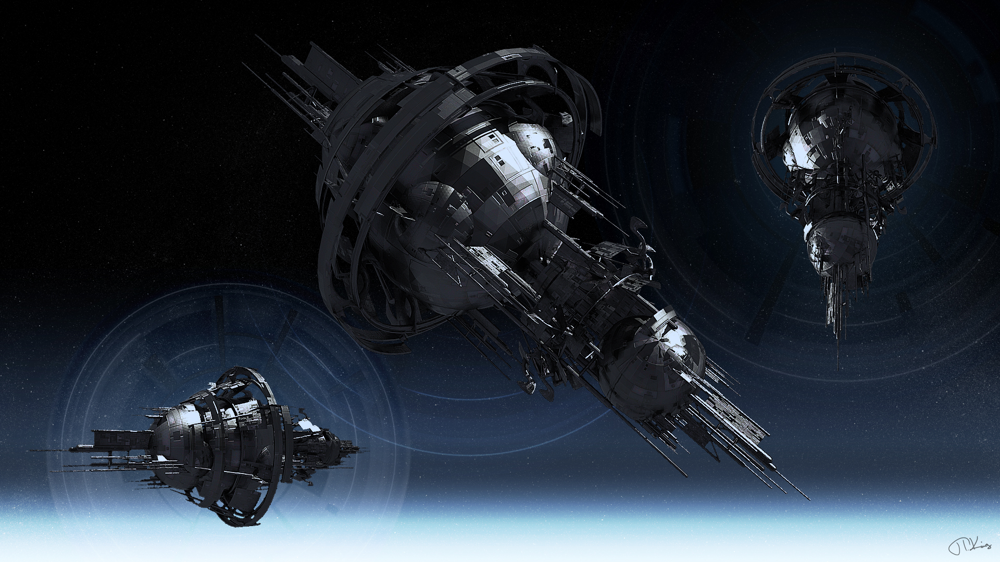
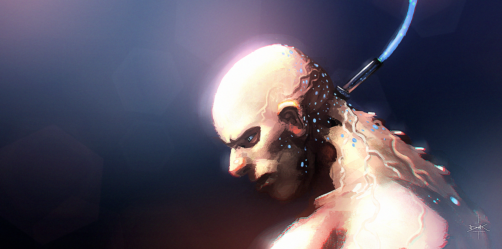

# Terra Nova
# Lieux emblématiques

   

## Plan de la station

### Niveau X

## PNJs

### Daryl

### Culte de l'Ascension

## Événements

### Acte 2

#### Terminal
[github.com/Lucas-C/email_terminal](https://github.com/Lucas-C/email_terminal)

## Licence

Cette aide de jeu de Lucas Cimon est placée sous license <a rel="license" href="http://creativecommons.org/licenses/by-nc/4.0/">Creative Commons Attribution-NonCommercial 4.0 International</a>.

<!--
Séquence de filtres Gimp employés :
1. Couleurs > Seuil noir & blanc
2. Filtres > Flou > Flou gaussien : 0,5
3. Filtres > Génériques > Eroder
4. Filtres > Génériques > Dilater
-->
