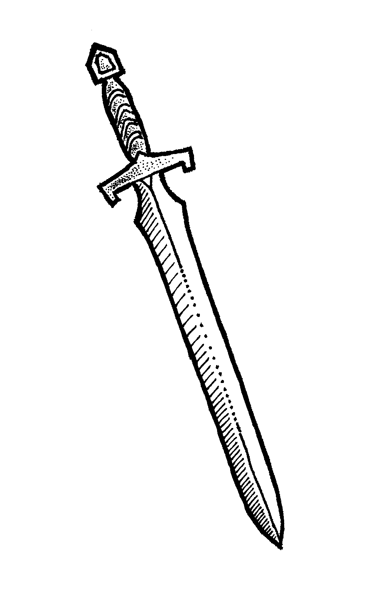
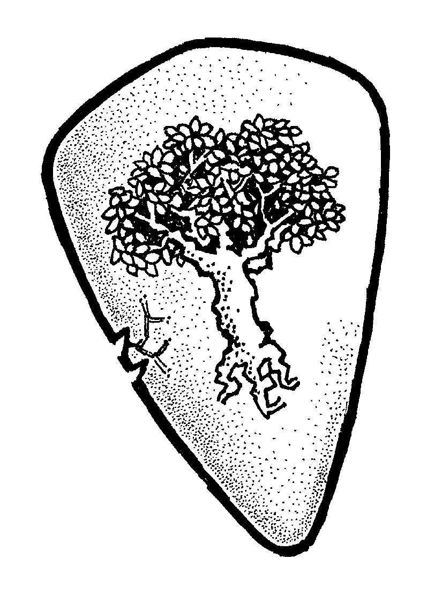
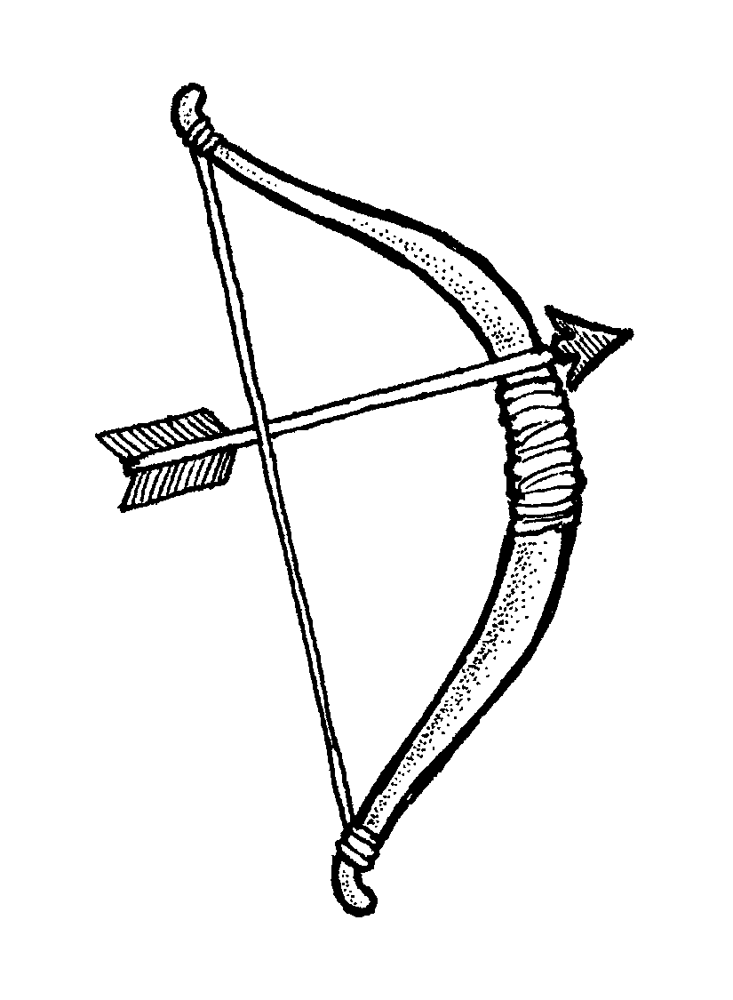
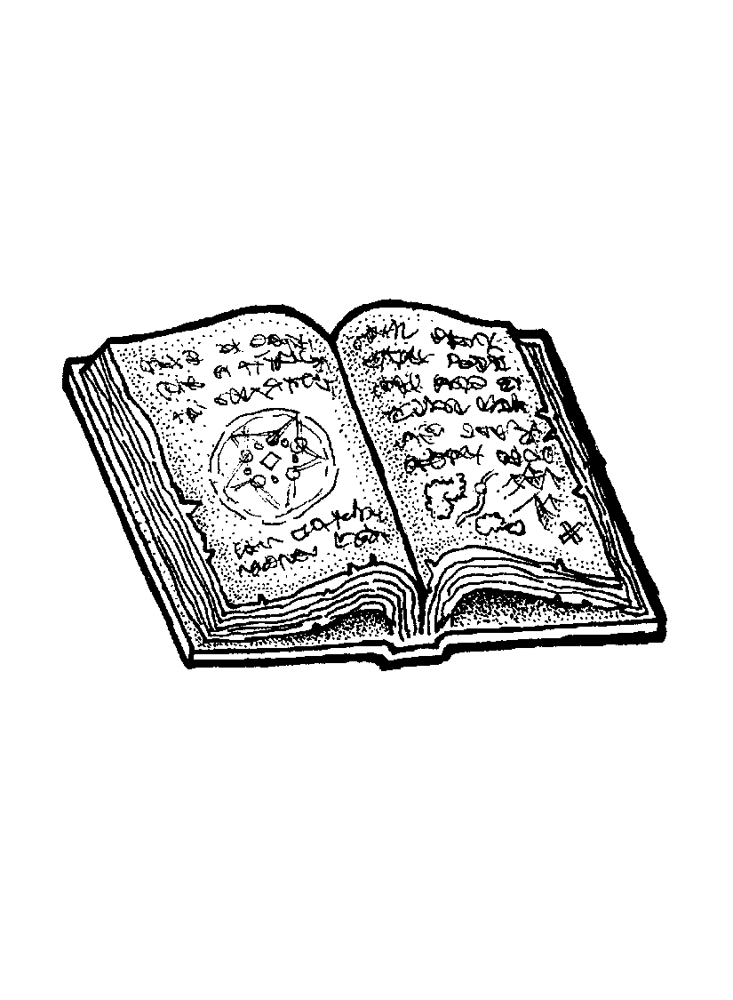
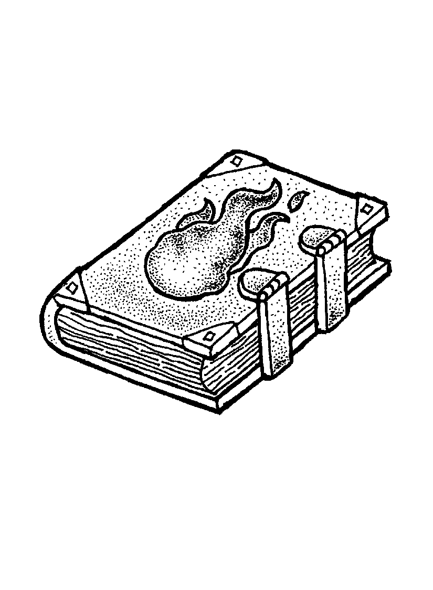
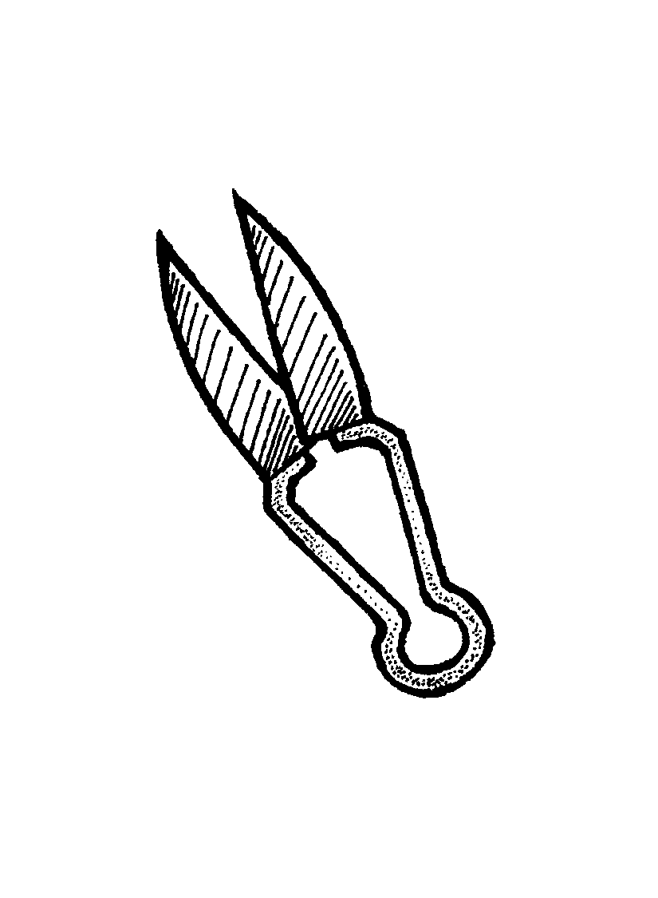
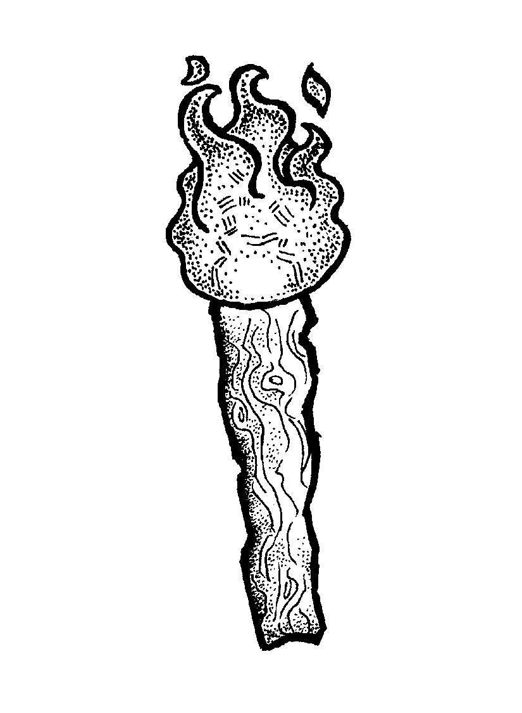

<!-- What next ?
* supprimer Vitesse ? car seulement utile dans scénarios avec map... = Athlétisme + 2
* adapter le scénario de base
* adapter les 4 prétirés au système et au scénario
* AdJs / mise en page :
  + single page recap' système, inc. XP usages
  + single page : création persos inc. clefs & familles magies
  + single page : liste de traits
  + single page : liste d'équipements, common & rare
  + FPs : in PDF in A5 format side-by-side
* pour la création de perso, suggérer un outil de générateur de background de PJ basique
* règle supplémentaire ? -> gros jeton {-1} lorsqu'un personnage agit "en désavantage" ?
-->
_Total Conversion_ pour la boîte d'initiation Pathfinder (2e édition).

## Caractéristiques
* **Athlétisme** : représente l'agilité et la force physique d'un personnage
* **Dextérité** : représente l'habileté et la perception d'un personnage
* **Sagesse** : représente les connaissances d'un personnage
* **Volonté** : représente l'esprit, le charisme et la force mentale d'un personnage
## Traits
### Athlétisme
* Acrobate
* Charger
* Courir
* Escalade
* Fort
* Furtif
* Nager
* Saut périlleux
### Dextérité
* Crocheter
* Désarmer
* Dérober
* Escrime
* Lancer de couteau
* Musicien
* Pièges
* Tir à l'arc / arbalète / mousquet
* Ouie aiguisée
* Voir dans le noir
### Sagesse
* Connaissance de \<domaine\>
* Déguisement
* Diplomatie
* Mécanicien
* Médecine
* Négocier
* Raffiné
* Sens de l'orientation
### Volonté
* Amadouer
* Beau parleur
* Empathie
* Intimider
* Percevoir la magie
* \<familles de magie\>
### Stats annexes
* **Vitesse** : déplacement en un tour d'un personnage, 5 □ à la création d'un personnage
* **Résistance** : endurance d'un personnage, 7 à la création d'un personnage
* **Blessures** : 0 à la création d'un personnage
* **Max équipements** : 6 □ à la création d'un personnage
* **Points de Destin** : 2 à la création d'un personnage
* **Points d'expérience** (XPs) : 6 à la création d'un personnage, dépensables immédiatement

## Clefs
* Apprendre des sortilèges
* Devenir riche
* Lutter contre l'oppression
* Résoudre pacifiquement les conflits
* Vaincre par la force des adversaires bien plus forts que moi
* Vaincre par la ruse des adversaires bien plus forts que moi

Clefs selon l'historique des personnages:
* Échaper à XXX
* Protéger \<personnage\>
* Retrouver la trace de XXX
* Retrouver les reliques de XXX

## Système
On lance autant de dés que la **Caractéristique**.
**+1** au résultat si au moins un **Talent** s'applique.

Le plus haut résultat indique le résultat dans ce tableau :

Valeur du dé | Effet
-------------|---
⚀            | **Échec critique**, catastrophique
⚁            | Échec
⚂            | Échec mais...
⚃            | Réussite partielle / mais...
⚄            | Réussite
⚅            | Réussite parfaite
⚅⚅           | **Réussite critique**, exceptionnelle (valeur 8)

Si tous les dés sont des **1**, c'est toujours un **échec critique**, mais si un Talent s'applique

Si au moins deux dés sont des **6**, c'est une **réussite critique**.
La valeur du résultat est 8. 9 si un Talent s'applique.

### Combats
Jet pour l'attaquant seulement.
Si réussit, on calcule les **dégâts** en ajoutant au résultat
le bonus de l'arme (-1 lorsqu'on se bat sans arme)
et le nombre de **Blessures** de la cible.

Si les dégâts dépassent la **Résistance** de la cible, celle-ci est KO.
Sinon, la cible reçoit **une Blessure**.

Lorsqu'on passe son tour à se protéger : **+3** en Résistance pour ce tour (+5 avec un bouclier).

  
  
  

### Blessures
Durant la partie, les Blessures sont à représenter par des **jetons**
posés sur chaque fiche de personnages.

En fin de session, chaque joueur indique son nombre de Blessures sur sa feuille de personnage.

### Points de Destin
Permettent :
* de **relancer**, une fois, n'importe quel nombre **dés** qui viennent d'être lancés, par soi-même ou un autre joueur
* de **se relever** lorsqu'on a été mis **KO**, sans attendre d'être soigné

### Magie
* 1 Talent = une famille de magie, permettant de nombreux usages
* la magie, c'est puissant, mais risqué : en cas de réussite ou échec **critique**, un magicien reçoit **une Blessure**
* dégâts identiques que pour les armes
* apprendre une nouvelle magie nécessite d'étudier des grimmoires ou d'avoir un maître, + dépenser 4 XPs

  
  
  

#### Exemples de familles de magie
+ créer du son
+ créer une source de lumière
+ créer le froid / geler
+ déplacement instantanné
+ projeter des éclairs
+ projeter des flammes
+ créer un souffle d'air
+ illusions visuelles
+ soins

### Soins
* après un combat, un jet réussit permet de remettre sur pied un personnage KO, ou de soigner 1 Blessure. Le Trait _Médecine_ peut aider.
* ensuite, chaque nuit de repos permet de récupèrer 1 Blessure

### Équipement
* un élément d'équipement = 1 □
* un maximum de □ transportables est défini pour chaque personnage (6 à la création d'un personnage)

  
  

### Expérience
* +1 XP en cas d'échec critique (**1**) <!-- TODO : rappel sur FP -->
* +1 XP lorsqu'une Clef est déclenchée

Dépense d'XP | Coût
-------------|-
+1 point de Destin | 2 XPs
nouveau Trait, si une opportunité d'apprentissage se présente | 4 XPs
+1 en Résistance / Vitesse / Max équipements (□) | 6 XPs
nouvelle Clef (max 3, mais il est possible d'en remplacer pour 4 XP) | 8 XPs
+1 dans un caractéristique | 10 XPs

## Création de personnage
0. Choisir une figurine
0. Choisir ses Clefs
0. Répartir 1/2/2/3 dans ses Caractéristiques
0. Choisir 7 Traits
0. Choisir l'équipement de départ : 4 □
0. Choisir un nom

## Licence

Ce scénario a été conçu par Lucas Cimon est est placé sous licence _[Creative Commons BY-NC-SA 4.0](https://creativecommons.org/licenses/by-nc-sa/4.0/)_.

Les fichiers sources ayant permis de générer ce PDF sont disponibles [sur GitHub](https://github.com/Lucas-C/jdr/tree/master/Pathfinder).

Si vous souhaitez soutenir mon travail, vous pouvez me faire un don sur <https://lucas-c.itch.io>

## Credits
Merci aux illustrateurs qui ont placé leur magnifique travail sous licence _Creative Commons_ :

* plusieurs illustrations de Daniel F. Walthall, issues du pack [Free fantasy stock art v3](https://axebane.itch.io/free-fantasy-stock-art), sous license [CC BY 4.0](https://creativecommons.org/licenses/by/4.0/)
* illustration du sac et de l'épée issue du [Tabletop Art Pack by Stoneshore](https://stoneshore.itch.io/tabletop-art-pack), sous license [CC BY 4.0](https://creativecommons.org/licenses/by/4.0/)
* icône _sketchy feather_ par Mathilde @ [iconfinder.com](https://www.iconfinder.com/iconsets/Sketchy_icons_by_ma)
* [blank die @ openclipart.org](https://openclipart.org/detail/304803/blank-dice-outline)

Merci à Raymond Larabie, l'auteur de la police [Vinque](https://www.1001fonts.com/vinque-font.html6).

Merci enfin aux développeurs des [logiciels libres](https://fr.wikipedia.org/wiki/Free/Libre_Open_Source_Software) employés : [le navigateur Firefox](https://www.mozilla.org/fr/firefox/), [le logiciel de dessin Gimp](https://www.gimp.org/), [l'éditeur de texte Notepad++](https://notepad-plus-plus.org/), [le lecteur de PDF Sumatra PDF](https://www.sumatrapdfreader.org), [le language de programmation Python](https://www.python.org/), les bibliothèques de code [fpdf2](https://pypi.org/project/fpdf2/), [livereload](https://pypi.org/project/livereload/), [pypdf](https://pypi.org/project/pypdf/) & [weasyprint](https://weasyprint.org/).
