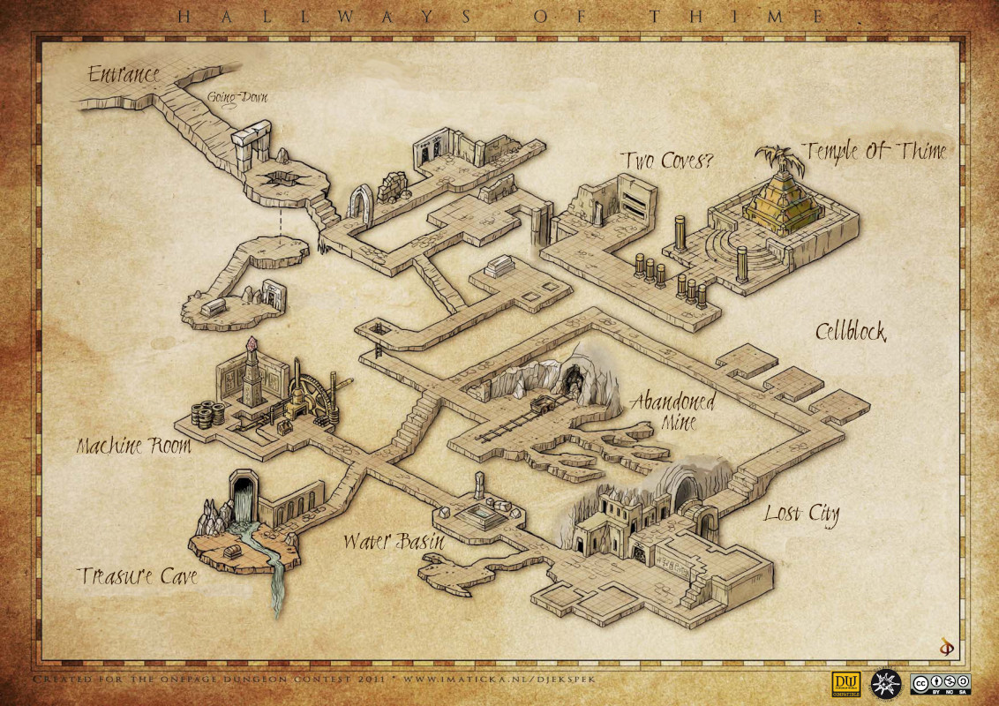
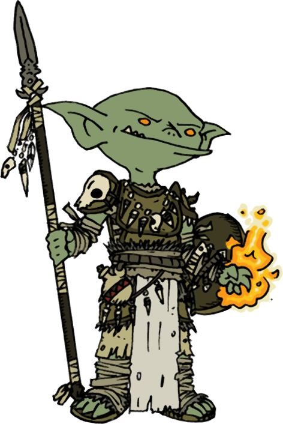

<!--
+ lien itch.io pour PDF
-->

# Les Couloirs du Temps

> Vous gobelins. Vous obéir roi.
> Roi gobelin veut gant de pouvoir.
> Gant magique dans tombe souterraine. Tombe du démon Thime.
> Vous aller dans souterrain. Vous ramener gant magique.
> Toi d'abord.

Ceci est un scénario pour le jeu de rôle [_Run. Die. Repeat._](https://labrysgames.itch.io/run-die-repeat)
de **Labrys Games** ([traduction en français](https://chezsoi.org/lucas/blog/images/jdr/RunDieRepeat-FR.pdf)),
prévu pour être joué par conférence audio.
::: web-only
Version PDF: ...
:::
 

## Objectif
Trouver la tombe du démon Thime et ramener le gant de pouvoir à votre roi, hors du souterrain.
## Règles spéciales
Employez [cette application web](https://chezsoi.org/lucas/jdr/shared-img-reveal/) afin de progressivement révéler les lieux à vos joueuses : communiquez leur l'URL publique qui s'affiche en bas une fois la table de jeu créée, puis révélez leurs les zones hachurées en cliquant sur chacune au fil de la partie.

Pas de boucle temporelle pour ce scénario : dès qu'un gobelin meurt ou est capturé, un autre est envoyé dans le souterrain à sa place.
La joueuse dont c'est le tour commence par nommer son gobelin.
## Obstacles
- la première salle, au pied des marches, est plongée dans l'obscurité.
Sans lumière, le risque est élevé de tomber dans **la fosse** !
Un gobelin qui y chute a le temps d'apercevoir un passage avant de succomber.
- au fond de la fosse, au-delà du monticule de squelettes d'aventuriers, un escalier descend jusqu'à **une tombe**.
Le **buste de momie** qui y repose ne sera pas ravi du tout d'être réveillé.
Derrière, un **portail magique** mène jusqu'à la salle au nord avec le double portail.
- derrière la fosse, au bas des marches, une arche se dresse à gauche :
il s'agit d'un piège, une herse s'abattant violemment sur tout imprudent tentant la franchir.
Derrière se trouve une salle avec **deux portails magiques** :
l'un permet d'accéder à la salle de la tombe à l'ouest, l'autre mène à la Cité Perdue.
- un autre chemin mène au nord à une fosse où devait jadis se dresser un pont,
puis juste après à une pièce avec 2 alcôves,
contenant chacun un soldat squelette qui n'appréciera pas d'être dérangé.
- au nord-est se trouve le **temple funéraire du démon Thime** : une pyramide d'or surmontée d'une statue du démon.
Aucune ouverture n'est visible. Elle renferme bien **le gant convoité**, mais encore faut-il trouver comment y entrer !
- au centre, une pièce contient une **tombe** : la **moitié basse d'une momie**, y repose, inerte.
- la **mine abandonnée** est déserte, mais des sacs de pépites d'or peuvent être découverts en fouillant un peu.
Les tunnels qui mènent à la Cité Perdue abritent un **troll** assez hargneux.
- le couloir contournant la mine par le nord est long et angoissant...
Il mène à trois **cellules**, où sont enfermés un troll, un aventurier en décomposition et un gobelin nommé **Malfeet**. Il recherche le trésor de Thime et a été enfermé là par le Gardien. Il proposera son aide si on l'aide à s'évader.
- la **Cité Perdue**, au sud-est, est déserte. Seul le Gardien la traverse parfois de son pas lourd.
- le **bassin d'eau** est le point d'encrage du rituel magique permettant au Gardien d'exister.
- la **Cave au Trésor**, au sud-est, contient un coffre renfermant de nombreux objets précieux et magiques, ainsi que la clef de son temple. Y poser le pied signifie attirer l'attention du Gardien !
- la **Salle de la Machine** contient une étrange mécanique...
La manipuler déclenche l'effondrement progressif du complexe !
Une brèche se fera alors dans la pyramide d'or...
## Le Gardien
Il s'agit d'un élémentaire d'eau massif, muet, dont la tâche est d'entretenir les lieux,
et de mettre en cellule tout intrus, voir de l'éliminer s'il résiste.
Il rôde en général dans toute la zone basse du souterrain.
## Portails magiques
Ils abritent dans leur vortex transdimensionnel un petit démon ayant le rôle de passeur.
Il apostrophera les passants d'un _« PÉAGE ! »_ routinier, et réclamera un droit de passage,
sous faute d'être immédiatement dispersé aux quatre vents interdimentionnels...
## Les trolls
Ils forment un couple. Les réunir permet d'obtenir leur gratitude :
ils suivront et aideront le gobelin tant qu'il reste en vie,
et sont capables d'ouvrir une brèche dans le temple d'or.
## La momie
Si un gobelin réussi à rassembler les deux moitiés de la momie, elle indiquera en remerciement l'emplacement d'un levier caché permettant d'ouvrir la pyramide de Thime !

## Conseils à la MJ
De nombreux cadavres d'aventuriers jonchent le souterrain, et tout un tas d'équipement peut être glané sur ces corps : épée, arbalète, corde, côte de maille, bourse d'écus, torche...

5min avant la fin du compte à rebours, indiquez aux joueuses que le souterrain commence à s'écrouler !

N'hésitez pas à improviser en modifiant le comportement des PNJs,
voir en changeant l'emplacement du gant de pouvoir convoité :
lors d'une partie où les joueuses n'avaient jamais exploré la partie nord-est,
j'ai décidé en fin de partie qu'il était en fait caché dans le coffre au sud-ouest,
et le final n'en a été que plus fun pour tout le monde !
## Prolonger le scénario
Pour introduire un retournement de situation,
lorsqu'un gobelin met la main sur le gant de Thime, deux choses se produisent,
redémarrant le chrono à **15min** :
- un choc sismique ébranle tout le complexe, faisant s'écrouler l'arche piégée au début du souterrain
et l'escalier à sa gauche : révélez l'image de l'amas de rochers aux joueuses.
- le gobelin, en prenant le gant, active son pouvoir de contrôle du temps :
il déclenche une boucle temporelle qui le ramènera, s'il meurt, à cet instant où il a saisi le gant.

## Bon jeu ! 🏃 ☠️ ♻

Ce scénario de Lucas Cimon (@[chezsoi.org](https://chezsoi.org)) est publié sous licence <a rel="license" href="http://creativecommons.org/licenses/by/4.0/">Creative Commons Attribution 4.0</a>.
Les fichiers sources de ce PDF sont disponibles [sur GitHub](https://github.com/Lucas-C/jdr/tree/master/RunDieRepeat). - v1.0

Merci aux illustrateurs qui ont placé leur magnifique travail sous licence _Creative Commons_ :

- [Hallways of Thime by Herwin Wielink aka Djekspek](https://www.deviantart.com/djekspek/art/Hallways-of-Thime-208976938) [CC BY-NC-SA3.0](https://creativecommons.org/licenses/by-nc-sa/3.0/)
- [Goblin Druid by Ashton Sperry aka WhoDrewThis](https://www.deviantart.com/whodrewthis/art/Goblin-Druid-119294991) [CC BY-NC-SA 3.0](https://creativecommons.org/licenses/by-nc-sa/3.0/)

Polices employées : Mirage Gothic par Carlos Mario Peña Solís & EB Garamond par Georg Duffner.

Un grand merci également aux _playtesteurs_ : Elliot, Henri, Kevin, Laëtitia, Maxime, ainsi que les joueurs & joueuses qui y ont joué lors de la 2e [CyberConv](https://cyberconv.com) : Mori, Muzett, Silphy & Vixenn.

Merci enfin aux développeurs des logiciels libres employés :
Firefox, Gimp, Python, livereload, markdown-it, puppeteer, Notepad++, Sumatra PDF.

