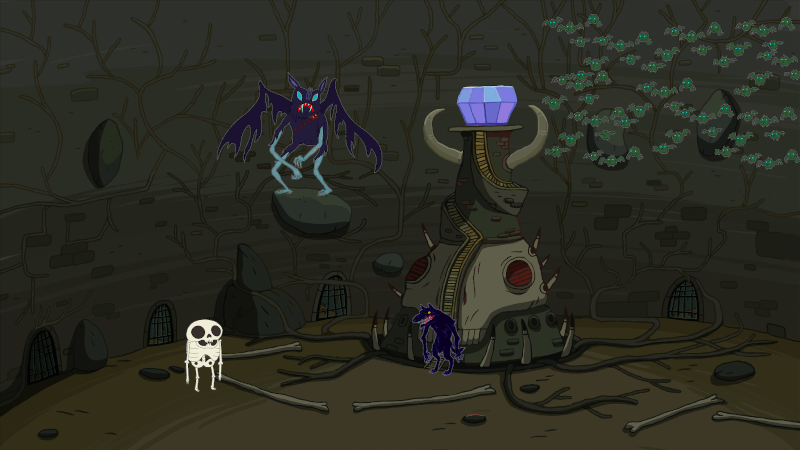
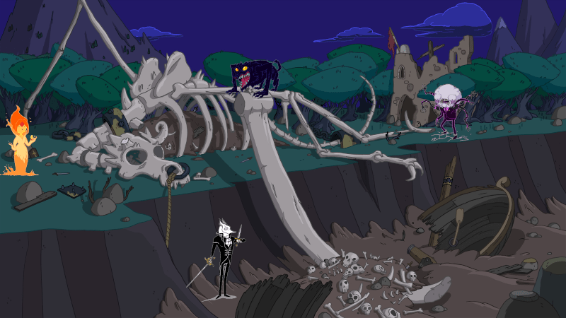

<!--
+ https://www.flickr.com/photos/84568447@N00/4860797836/in/photostream/
+ https://www.flickr.com/photos/84568447@N00/4225490961/in/album-72157616038185579/ & https://www.flickr.com/photos/84568447@N00/4226259012/in/album-72157616038185579/
+ https://www.flickr.com/photos/84568447@N00/4271447565/in/album-72157616038185579/
+ https://www.flickr.com/photos/84568447@N00/4427719072/in/album-72157616038185579/
-->
# Scénarios pour Run. Die. Repeat.
:::big picto
🏃 ☠️ ♻
:::
::: author
Lucas Cimon - [chezsoi.org](https://chezsoi.org)
:::

Ces scénarios emploient des ilustrations Adventure Time sous licence Creative-Commons **Non-Derivative**,
et ne peuvent donc être diffusés.

---

::: page



_<center>Scénario pour partie en ligne</center>_
## Adventure Time: Dungeon Crystal
> « Sans l'aide de mes pouvoirs tu n'es pas pas capable de grand chose ! »
> Provoqué par ces paroles de votre ami chien polymorphe,
> vous avez décidé de prouver que vous pouvez très bien vous débrouiller seul !
> Vous êtes donc entré dans LE DONJON,
> avec pour objectif de mettre la main sur le mystérieux crystal géant qu'il renferme !
### Objectif
Mettre la main sur le crystal (et s'il reste du temps au chrono, s'enfuir du donjon avec !)
### Inspirations
La série d'animation _Adventure Time_, _cf._ [cet extrait vidéo](https://www.youtube.com/watch?v=NJXVrEoq8KM),
et la série de jeux vidéos _Monkey Island_, pour l'humour.
### Règles spéciales
Employez [cette appli web](https://chezsoi.org/lucas/jdr/shared-img-reveal/) afin de progressivement révéler les lieux à vos joueuses : communiquez leur l'URL publique qui s'affiche en bas une fois la table de jeu créée, puis révélez leurs les zones hachurées en cliquant sur chacune au fil de la partie.
### Environnement
Il ne se limite pas à ce que voient les joueuses à l'image :
quantités d'armes, ossements, rongeurs et autres objets magiques jonchent les lieux,
abandonnés par de précédents aventuriers où les créatures qui y vivent.
Le protagoniste peut avoir tout l'équipement qu'il souhaite sur lui !
### Obstacles
- un **loup-garou** nommé **Croc** garde l'escalier vers le crystal.
Il n'est pas hostile, il fait juste son boulot de gardien, et il a la dalle.
Il peut être soudoyé contre un bon casse-croûte.
- un **gobelin volant** a réussi à se glisser derrière lui, et il apostrophera le protagoniste :
« Prem's ! Je l'ai trouvé le premier, ce crystal est à moi ! Dégage, voleur ! »
- à gauche, le **squelette** d'un aventurier mort dans le donjon sera ravi de bavarder.
Et il est TRÈS bavard !
> Salut ! Moi c'est Murray !
> Avant de mourir je m'appelais sire Grégoire de Maurillac, mais j'ai préféré changer de nom dans l'après-vie.
> Très franchement, j'étais pas super fortiche comme aventurier,
> mais quand même plus débrouillard que la plupart des abrutis qu'on voit passer tous les jours...
> Je ne veux pas paraître trop critique, mais vous ne pouvez pas imaginer le nombre d'imbéciles qui débarquent
> la fleur au fusil, sur la foi d'une simple rumeur de trésor, et qui se font découper en tranches au premier piège venu !
> Mais vous me direz « Murray, tu es un peu dur avec toi même !
> Ce n'est pas parce que tu es décédé dans ce donjon que tu dois te considérer comme un mauvais aventurier ! »
> Et vous auriez sans doute raison, mais j'ai tiré un trait sur tout ça vous savez.
> La vie d'aventurier, les donjons, les combats, les pièges...
> C'est assez surfait au final. J'ai beaucoup changé depuis mon décès, et en mieux je dois dire.
> D'ailleurs, laissez-moi vous raconter cette anecdote...
- le couloir derrière la **grille de gauche** mène... à la **grille de droite**, et vice-versa.
- à droite, il est possible d'escalader le mur, mais un **nuage de chauve-souris sourdes** bloque l'accès au crystal. Elle se jetteront sur le protagoniste pour le faire chuter et protéger leurs nids, à moins qu'il n'émette absolument aucun son.
- à gauche, un **vampire fan de musique métal** se fait franchement chier depuis qu'on lui interdit d'écouter de la musique au travail. Il est très balaise, assez susceptible et se souvient des _runs_ précédent des joueuses.
- le **crystal** est immense ! Comment le sortir d'ici ?
### Conseils à la MJ
Les lieux sont plongés dans l'obscurité, et seule la zone au pied de l'image,
où débute le protagoniste, est visible au début de la partie.
Débutez la partie en demandant à la première joueuse dans quelle direction elle souhaite se diriger.
Ne révélez les autres zones de l'image que si le protagoniste dégote une source de lumière,
et considérez qu'en attendant il explore son environnement à tâtons.
:::

---

```json
{
  "name": "Adventure Time: Dungeon Crystal",
  "img": {
    "url": "https://chezsoi.org/lucas/jdr/shared-img-reveal/AdventureTimeDungeonCrystal.jpg",
    "width": 2043, "height": 1150
  },
  "clips": [
    { "type": "ellipse", "cx": 1200, "cy": 1050, "rx": 700, "ry": 90 },
    { "type": "ellipse", "cx": 1200, "cy": 550, "rx": 300, "ry": 120 },
    { "type": "ellipse", "cx": 1200, "cy": 820, "rx": 300, "ry": 180 },
    { "type": "ellipse", "cx": 1750, "cy": 800, "rx": 280, "ry": 300 },
    { "type": "ellipse", "cx": 1700, "cy": 290, "rx": 350, "ry": 280, "type": "ellipse" },
    { "type": "ellipse", "cx": 400, "cy": 830, "rx": 400, "ry": 300 },
    { "type": "ellipse", "cx": 580, "cy": 290, "rx": 580, "ry": 280 },
    { "type": "ellipse", "cx": 1250, "cy": 300, "rx": 200, "ry": 150 }
  ],
  "duration_in_min": 20
}
```

---

::: page



_<center>Scénario pour partie en ligne</center>_
## Adventure Time: Dragon Carcass
> Vous êtes un fier viking donc le navire s'est malheureusement échoué lors d'une tempête,
> entrainant la mort de tout l'équipage.
> Quelque chose vient de vous ramener d'entre les morts, et ça ne vous plait pas trop !
> Vous avez droit au Valhalla que diable ! Il faut que ce maléfice cesse !
### Objectif
Trouver l'origine du sortilège qui vous ramène sans cesse à la vie, et y mettre fin.
### Inspirations
La série d'animation _Adventure Time_, _cf._ [cet extrait vidéo](https://www.youtube.com/watch?v=NJXVrEoq8KM),
et la série de jeux vidéos _Monkey Island_, pour l'humour.
### Règles spéciales
Employez [cette appli web](https://chezsoi.org/lucas/jdr/shared-img-reveal/) afin de progressivement révéler les lieux à vos joueuses : communiquez leur l'URL publique qui s'affiche en bas une fois la table de jeu créée, puis révélez leurs les zones hachurées en cliquant sur chacune au fil de la partie.

Lorsque le viking meurt, sont enveloppe squeletique est déruite,
et il retourne automatiquement à l'épave du navire,
pour posséder un autre corps en état de putréfaction avancée.
### Environnement
Il ne se limite pas à ce que voient les joueuses à l'image :
quantités d'armes, ossements et autres objets jonchent l'épave et ses alentours.
### Obstacles
- un **os glissant** semble la meilleure opportunité de s'extraire de la fosse, dont les parois sont trop friables pour être escaladées. Mais il est quand même super glissant, cet os. Il y a un canon aussi.
- au sommet du squelette de dragon, un **chien de Tindalos** invoqué par Skrull
déchiquètera tout ce qui s'approche. Il n'est pas très malin mais féroce et intangible.
Aucune arme ne semble pouvoir l'atteindre.
- en bas à gauche, il est possible de sortir de la fosse plus simplement, avec une corde.
Un **épéiste** en empêche néanmoins l'accès, et il semble persuadé que vous avez occis son géniteur :
> Bonjour. Je m'appelle Inigo Montoya. Tu as tué mon père. Prépare toi à mourir.
- à gauche, près de la tête du dragon, **Cynthia**, une élémentaire de feu,
est venue se reccueillir sur la tombe de son défun **Kiki**.
Elle aidera volontier le protagoniste, en lui fournissant par exemple une arme magique enflammée capable de blesser le chien de Tindalos.
- **Skrull** le sorcier maléfique.
Bon, à la base il voulait rescuciter le dragon en fait.
Il s'est un peu planté, mais vu sa tronche c'est pas la première fois qu'il rate un rituel.
Il se la jouera méchant-maléfique et tentera jusqu'au bout d'intimider le viking
pour éviter de lancer un sortilège...
S'il en est réduit à cette extrémité, ses sorts seront lancés à grand renfort d'incatations théatrales,
et se révèleront toujours foireux, même s'ils entrainent le décès du protagoniste.
### Conseils à la MJ
Les lieux sont plongés dans l'obscurité, et seule l'épave du bateau,
où débute le protagoniste, est visible au début de la partie.
Débutez la partie en demandant à la première joueuse dans quelle direction elle souhaite se diriger.
Ne révélez les autres zones de l'image que si le protagoniste dégote une source de lumière,
et considérez qu'en attendant il explore son environnement à tâtons.
:::

---

```json
{
  "name": "Adventure Time: Dragon Carcass",
  "img": {
    "url": "https://chezsoi.org/lucas/jdr/shared-img-reveal/AdventureTimeDragonCarcass.jpg",
    "width": 2032, "height": 1143
  },
  "clips": [
    { "type": "ellipse", "cx": 1500, "cy": 900, "rx": 500, "ry": 250 },
    { "type": "ellipse", "cx": 1770, "cy": 650, "rx": 250, "ry": 150 },
    { "type": "ellipse", "cx": 700, "cy": 800, "rx": 400, "ry": 350 },
    { "type": "ellipse", "cx": 300, "cy": 400, "rx": 400, "ry": 400 },
    { "type": "ellipse", "cx": 1000, "cy": 350, "rx": 400, "ry": 300 },
    { "type": "ellipse", "cx": 1600, "cy": 350, "rx": 400, "ry": 300 }
  ],
  "duration_in_min": 20
}
```

<style>
@font-face { font-family: RajdhaniRegular; src: url('fonts/Rajdhani-Regular.ttf'); }
@font-face { font-family: VanchromeRegular; src: url('fonts/Vanchrome-Regular.ttf'); }
body {
  margin: 0 auto;
  padding: 0;
  font-family: RajdhaniRegular;
  font-size: 1.5rem;
  line-height: 1.4;
  max-width: 80rem;
}
h1, h2, h3 { font-family: VanchromeRegular; }
h1 { font-size: 4.5rem; text-align: center; margin: 8rem auto; margin-bottom: 2rem; }
h2 { font-size: 3rem; text-align: center; }
h3 { font-size: 1.55rem; margin: 0; }
section { height: 100%; }
hr { margin: 6rem; }
img { display: block; margin: 0 auto; max-width: 100%; max-height: 30rem; }
blockquote { font-style: italic; border-left: 2px solid #eee; margin-left: 0; padding-left: 1rem; }
li::marker { font-weight: bold; }
.picto { color: transparent; text-shadow: 0 0 0 #ec5423; }
.big.picto { text-align: center; font-size: 3rem; }
.big.picto > p { margin: 0; }
.author {
  text-align: right;
  font-style: italic;
  padding: 1rem 16rem;
  margin-bottom: 5rem; 
}
.page {
  page-break-before: always;
  margin: 6rem auto;
  column-count: 2;
  height: 100%;
}
.page > p { clear: both; margin: 0; } /* Pour bien centrer l'image contenue dedans, qui sinon est décalé à cause du .timer */
.page ol, .page ul { padding-inline-start: 1rem; }
.timer { width: 6rem; position: absolute; right: 50%; }
code { font-size: 1rem; }
</style>
