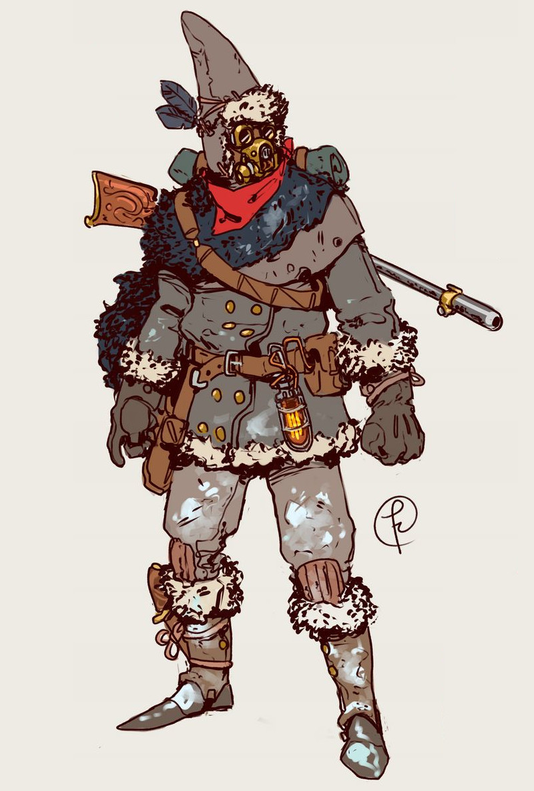
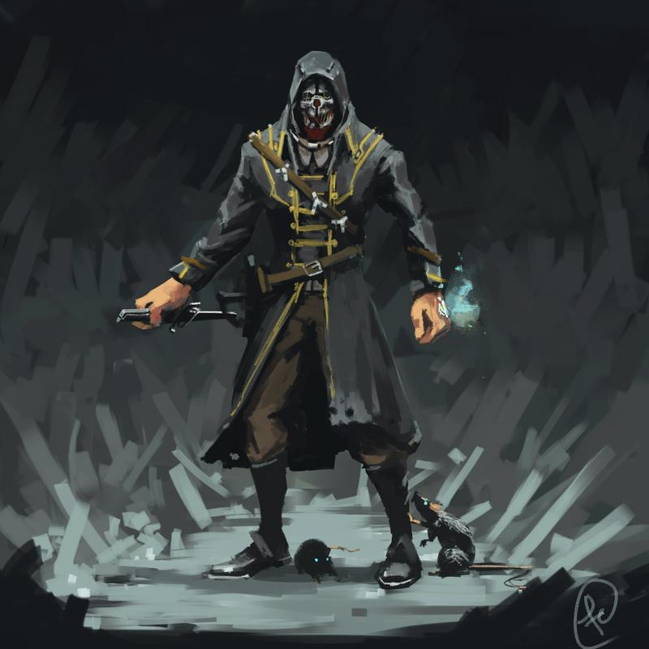
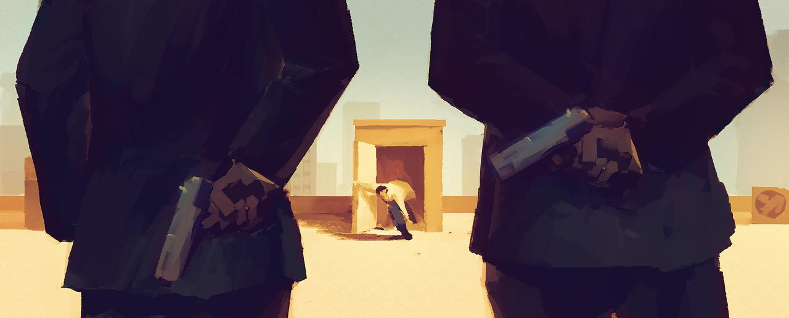
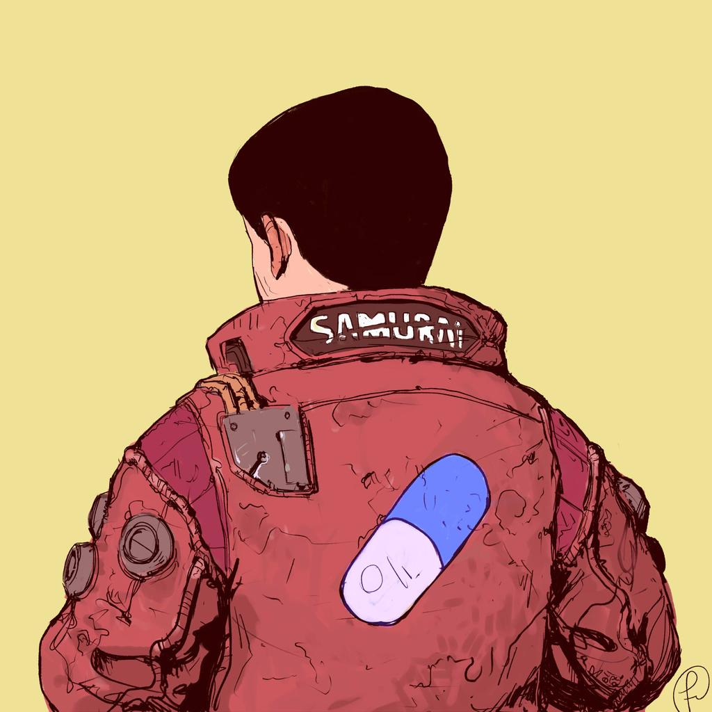
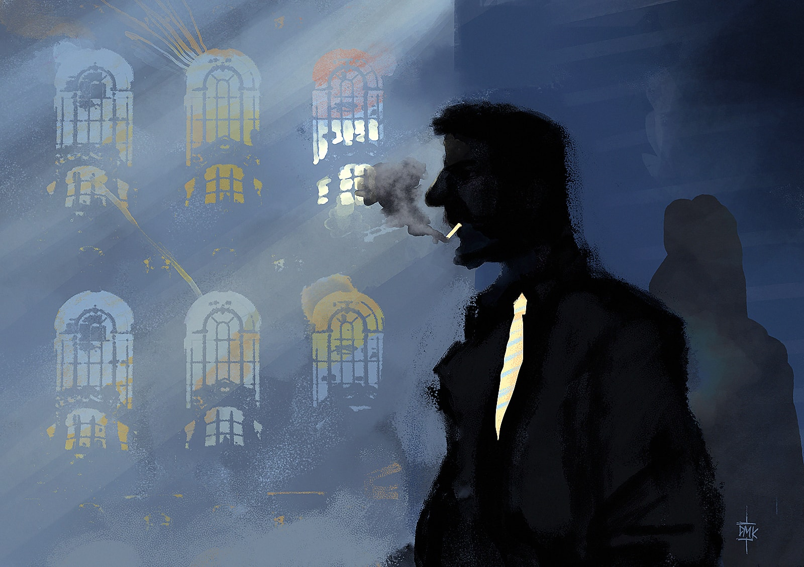

<!--
MGS5 intro : https://www.deviantart.com/sunnyclockwork/art/Trauma-517518224
Star Fetchers OST: https://www.youtube.com/playlist?list=PL-3oZ3AfF3_2TSyoAJ_OaewrZc8JcOBWM

Animation mp4: https://www.reddit.com/r/glitch_art/comments/gh045v/what_time_is_it/

Idées de mécaniques de jeu :

* énigme ne permettant qu'un seul essai, mais solvable en itérant toutes les possibilités :
3 leviers positionnables, ou code à rentrer + indice quelque part que le même chiffre se répète 4x

* règle spéciale _Next_ : au prix de **2min de moins** sur le compte à rebours,
le personnage peut **explorer toutes les alternatives temporelles** d'un problème à un moment donné de la partie,
comme un digicode, un labyrinthe, un unique combat avec plusieurs ennemis...
Il peut ainsi en déduire le code, le chemin pour en sortir, où la combinaison d’enchaînements de coup
pour en finir avec ses adversaires en mode _Matrix_ !

* Prenez un paquet de carte à jouer de 1 à 6,
et posez-les devant vous ordonnées avec la carte 6 sur le dessus.
La carte du dessus définit la valeur minimale à obtenir au dé pour réussir une action.
Chaque fois que les joueuses ratent un jet, enlevez une carte ;
chaque fois qu'elles réussissent, remettez-les toutes dans l'ordre.

* point faible particulier de chaque ennemi, et capacité bonus à transmettre à la joueuse,
qui en bénéficiera toujours aux prochaines boucles temporelles

* jouer 2 ou 3 points de vues de différents personnage lors d'un même événement

Idées d'HENRI:
- On joue un sorcier qui rate une invocation de démon, et on doit rattraper le coup sans qu'il ne nous tue.
- Tu es infiltré chez des trafiquants et ta couverture est tombée

Autres idées :
* TRILOGIE réaliste
  + fille crush déjà cotoyée à quelques reprises. Le jour où vous vous décidez à l'inviter à diner, un bouquet la main,
    vous apprenez de la bouche du propriétaire, qui vous ouvre la porte, qu'elle déménage et est partie il y a une minute !
    il faut la rattraper et lui déclarer votre flamme !
  + votre fils est mordu par XXX lors d'une rando : il faut le sauver !
* The Lost Room
* Médecin urgentiste ( Sovok ? )
* Donjon:
  - pièges : marteau-balancier géant, escalier-glissière, dards empoisonnés, flammes
  - monstres : gobelins, squelettes, basilic...
* Pompier
* Malediction -> condamne au purgatoire sur toutes les générations -> on incarne à chaque fois un descendant
* Jour de la Marmotte ?
-->

# Scénarios pour Run. Die. Repeat.
:::big picto
🏃 ☠️ ♻
:::
::: author
Lucas Cimon - [chezsoi.org](https://chezsoi.org)
:::

::: web-only
Version PDF: ...
:::

Merci également à ces illustrateurs qui ont déposé leur magnifique travail sous licence _Creative Commons_ :

- [Halloween Witch face profile by scottepentzer](https://www.deviantart.com/scottepentzer/art/Halloween-Witch-face-profile-331368521) - [CC BY 3.0](https://creativecommons.org/licenses/by/3.0/fr/)
- [Explorer by Fernand0FC](https://www.deviantart.com/fernand0fc/art/Explorer-837696753) - [CC BY-NC 3.0](https://creativecommons.org/licenses/by-nc/3.0/fr/)
- [Corvo by Fernand0FC](https://www.deviantart.com/fernand0fc/art/Corvo-658049106) - [CC BY-NC 3.0](https://creativecommons.org/licenses/by-nc/3.0/fr/)
- [UBD Corpse Mite by Larvae801](https://www.deviantart.com/larvae801/art/UBD-Corpse-Mite-274636814) - [CC BY-NC 3.0](https://creativecommons.org/licenses/by-nc/3.0/fr/)
- [Kaneda by Fernand0FC](https://www.deviantart.com/fernand0fc/art/Kaneda-777208845) - [CC BY-NC 3.0](https://creativecommons.org/licenses/by-nc/3.0/fr/)
- [«Estación de tren» by Dumaker](https://www.deviantart.com/dumaker/art/Train-station-560845389) - [CC BY-NC-SA 3.0](https://creativecommons.org/licenses/by-nc-sa/3.0/fr/)
- [Roof (end) by Hunternif](https://www.deviantart.com/hunternif/art/Roof-end-714829029) - [CC BY-NC-SA 3.0](https://creativecommons.org/licenses/by-nc-sa/3.0/fr/)
- [Comic El Santo Lucha Libre](https://www.pexels.com/photo/comic-el-santo-lucha-libre-614364/) de pexels.com
- [Perso riding on vehicule](https://www.pexels.com/photo/person-riding-on-vehicle-2190511/) de pexels.com
- [Light Inside Library](https://www.pexels.com/photo/blur-book-stack-books-bookshelves-590493/) de pexels.com

Merci enfin aux développeurs des logiciels libres que j'ai employé :
Firefox, Gimp, NodeJS, markdown-it, Python, puppeteer, Notepad++, Sumatra PDF.
Les fichiers sources ayant permis de générer ce PDF sont disponibles [sur GitHub](https://github.com/Lucas-C/jdr/tree/master/RunDieRepeat).

Ces scénarios sont publiés sous licence <a rel="license" href="http://creativecommons.org/licenses/by/4.0/">Creative Commons Attribution 4.0 International</a>.

---

::: page

<!-- Alt: https://www.needpix.com/photo/656525/owls-night-witch-broom-witchs-hat-moon-childrens-stories-fairy-tale-dark -->
<!-- Alt: https://freesvg.org/cartoon-fox-poses -->
## Le camembert de la sorcière
> Vous êtes un petit renard habitant la forêt.
> Cachée au cœur de cette forêt, vit une sorcière.
> Elle est plutôt gentille avec les animaux... tant qu'on ne la met pas en colère !
> Ce matin, vous l'avez vu sortir de sa cave de magnifiques camemberts...
> Et puis elle est partie faire ses courses au marché.
> Le camembert, c'est votre plat préféré !
> Alors c'est décidé, vous allez lui en chaparder un...
> Mais attention aux champignons magiques qui poussent dans sa chaumière !
### Objectif
Chaparder un camembert et sortir de la maison de la sorcière avant son retour.
### Règles spéciales
Les enfants lancent deux dés à 6 faces pour chaque jet, les adultes un seul.
### Environnement
- les camemberts sont posés sur la table de la cuisine,
qui comporte plusieurs étagères et un plan de travail.
- la fenêtre de la cuisine est fermée, mais les fenêtres de pièces donnant sur la cuisine sont ouvertes :
  + la chambre de la sorcière, où il y a des coussins, un bureau, et le corbeau de la sorcière, qui dort
  + le salon, où il y a une petite table, des fauteuils, et des plantes carnivores en pot
### Obstacles
- tout le sol de la maison de la sorcière est recouvert de champignons magiques,
qui, si on les touche, font disparaîte puis réapparaitre au-dehors !
- une fois un camembert en possession du renard, le corbeau de la sorcière se réveille !
Il pourchasse le renard en croassant, et risque de donner l'alerte !
### Conseils à la MJ
J'ai testé ce scénario avec un enfant de 4 ans et ses parents :
- 20min de temps me semble un grand maximum pour parvenir à conserver l'attention d'un enfant durant toute la partie.
- décrivez bien les lieux avant de lancer le compte à rebours.
- employez un compte à rebours à aiguilles, pour que les enfants puisse facilement visualiser le temps restant, comme celui-ci :
https://www.visnos.com/demos/classroom-timer
- il peut être difficile pour les enfants de comprendre que tous les joueurs jouent le même personnage.
N'hésitez donc pas à vous rabattre sur un modèle 1 joueur = 1 personnage, avec une famille de renards.
On se rapproche alors du système de [Donjons & Chenapans](https://gusandco.net/2020/03/18/donjons-chenapans-jeu-enfants/)
### Rejouer le scénario
Ajoutez un chien qui dort dans sa niche, et qu'il ne faut pas réveiller, mais donnez un dé de plus aux enfants.
:::

---
::: page frostpunk

## Frostpunk
> Fin du XIXe siècle. Une éruption cataclysmique a déclenché un hiver permanent.
> Vous avez pris la tête d'un groupe de survivants et êtes parti au Nord,
> vers une terre promise. À bout de forces, vous avez atteint un étrange monolithe mécanique,
> une chaudière géante. Vos ingénieurs comprennent cette technologie steampunk
> juste assez pour le rallumer, ravivant un espoir.
> Mais le plus dur reste à venir pour votre colonie d'une centaine d'âmes...
### Objectif
Survivre jusqu'à établir une colonie pérenne.
### Inspirations
Le jeu vidéo éponyme et le [_Let's Play_ du Joueur du Grenier](https://www.youtube.com/watch?v=ss2Eu4HhfB4&list=PLWmL9Ldoef0tlXdmRg9FEdQVmt-kmrKp7).
### Règles spéciales
Les joueuses incarnent le capitaine de la colonie, et prennent des décisions à cette échelle.
Cela signifie que leurs actions peuvent impliquer des dizaines de personnes,
mais aussi qu'une journée correspond à deux actions (= jet de dé).
Et chaque jour voit arriver une nouvelle difficulté...
### Environnement
Des montagnes ensevelies sous la neige, à perte de vue,
et un vent glacial, plusieurs degrés sous le zéro Celsius.
Un filon de charbon peut être découvert à proximité,
ainsi que des automates steampunks en sale état,
qui devaient servir à entretenir la chaudière.

Votre colonie est constituée majoritairement d'individus robustes, dur à la tâche,
mais à l'éducation limitée. Le reste des survivants inclue des ingénieurs, des trappeurs,
quelques médecins, des prêtres, un botaniste, un instituteur, des femmes et des enfants.
### Difficultés
Voici quelques événements / dilemnes majeurs pour la communauté.
La MJ en choisit un par jour, au fur et à mesure :
* vos citoyens meurent de froid par manque d'abris
* vos citoyens meurent de faim par manque de nourriture
* une avalanche a isolé des dizaines de personnes dans la mine de charbon qui a été découverte
* découverte des ruines de Nidhiver, la terre promise. L'espoir diminue.
* le générateur tombe en panne
* une épidémie de peste se déclare
* des citoyens appelent à la rébellion et veulent repartir d'où vous venez
* une terrible tempête de froid se déclare
* des vols de nourriture ont lieu dans les réserves
* des créatures attaquent ! Des morts revenus à la vie ?
### Autres événements
* un groupe de surivants égarés à été aperçu à quelques kilomètres, se dirigeant vers une tempête.
Faut-il leur porter secours et les acceuillir ?
* découverte d'un chemin de fer. Un train qui ne s'arrête jamais y circule.
* des gens auraient été aperçus dans lq montagne
* découverte par les explorateurs d'une stèle avec une inscription runique
:::

---

::: page

## Dishonored
> Dunwall. Une ville victorienne steampunk qui a basé son commerce et sa technologie sur la pêche de baleines et le raffinage de leur graisse en huile électrostatique. Dans cette ville frappée par une terrible épidémie de Peste du Rat, vous êtes Corvo Attano, le protecteur personnel de l'impératrice Jessamine Kaldwin.
> Alors que vous accompagnez celle-ci, soucieuse de la situation, et sa fille Emily lors d'une balade dans les jardins du palais, vous êtes attaqués par un groupe d'assassins !
> L'impératrice est tuée, sa fille enlevée. Vous avez **assisté** de vos yeux à la scène... mais vous avez conclu un pacte avec l'Étranger, dans le monde onirique où il vous a entrainé, et vous voici de retour à cet instant, avec cette fois d'étranges pouvoirs, et l'intention de changer l'histoire !
### Objectif
Amener l'impératrice et sa fille en sécurité au palais.
### Règles spéciales
La joueuse choisit deux capacités au début de chaque _run_ :
- **Clignement** : déplacement instantanné sur une distance de quelques mètres.
Une seule personne peut vous accompagner.
- **Nuée dévorante** : invoquez une meute de rats
- **Possession** : prennez possession de quelqu'un
- **Pli temporel** : relentissez le temps quelques secondes
- **Coup de vent** : déclenchez une violente bourrasque ou faites léviter des choses
- **Ombre errante** : vous vous fondez dans les ombres

Chaque pouvoir procure un bonus de **+2** si exploité,
et ne peut pas être employé pour 2 actions de suite.
### Environnement
- vous commencez dans un kiosque en marbre de 10m de large, à la pointe d'une falaise surplombant la baie de la ville
- 2 chemins permettent de rejoindre la terrasse du palais : un long labyrinthe végétal, ou plus court, un escalier abrupt dans la roche, prolongé par une corniche
### Obstacles
- de manière générale, les assassins tenteront de tuer l'impératrice, d'enlever Emily, et d'éloigner ou neutraliser Corvo.
- dès le début 5 assassins sortent des fourrés et vous assaillent.
Armés de sabres, 2 attaquent Corvo, 2 se chargent de l'impératrice et sa fille, et le dernier reste en retrait pour vous canarder avec une arquebuse (si on lui court dessus, il n'a le temps de tirer que 2 fois).
Corvo ne peut pas simultanément empêcher le meutre de l'impératrice et l'enlevement d'Emily.
Une fois la première protégée, il peut partir à la poursuite du ravisseur de la seconde.
- le ravisseur d'Emily l'entraine jusqu'à un bateau accosté au pied de la falaise, que l'on atteint en descendant une corde
- le long de la falaise, vers le palais, 3 brutes barrent l'étroit chemin, couverts de pustules de la Peste.
Ils sont armés d'un gourdin, d'une hache et d'une lance.
- dans le labyrinthe, 2 autres assassins tenteront de prendre par surprise leurs proies à travers les buis composant le labyrinthe.
Ceux-ci sont armés de dagues et possèdent les pouvoirs _Clignement_ & _Ombre errante_.
- le lord régent Hiram Burrows est à l'origine du complot.
Il tentera en dernier recours, en voyant l'impératrice arriver au palais, de saisir un gant de contrôle électrostique pour lancer un garde mécanique à l'assaut.
### Conseils à la MJ
- interrompez le _run_ dès que l'impératrice ou sa fille meurent
- un sabre à la main, l'impératrice peut se défendre seule quelque temps.
Elle cherchera d'abord à protéger sa fille, puis à rejoindre le palais.
Elle fait confiance au lord régent et sera naïvement compatissante face à des malades de la Peste.
- Emily Kaldwin est futée, douée à l'escalade mais impulsive.
Elle tentera de s'enfuir et de se cacher, voir à jeter des graviers aux yeux ou à sauter de la falaise plutôt que de laisser un assassin l'approcher de front. Elle se méfie du lord régent et destabilisera le garde mécanique en lui lançant un seau d'eau.
:::

---

::: page

<!-- Alt: https://www.deviantart.com/sunnyclockwork/art/SCP-163-482911397 -->
## Parasite
> Vous êtes un parasite microscopique, une arme bactériologique créée dans un laboratoire top secret.
> Suite à une énième hybridation, vous venez d'acquérir une vive intelligence, la conscience de vous-même,
> et la capacité à remonter le temps !
> Vos enfants vont éclorent de votre ventre dans 30min, ce qui signifiera votre mort,
> mais vous êtes bien décidé à ce qu'ils naissent hors de cette prison !
### Objectif
S'échapper du laboratoire.
### Règles spéciales
Les joueurs disposent des actions suivantes comme parasite :
- tuer votre hôte, éventuellement à retardement
- se propager par contact physique, en abandonnant le corps hôte précédent
- faire effectuer jusqu'à **2 actions** à son hôte, après quoi celui-ci reprend le contrôle
### Environnement
- vous débutez dans la salle blanche, qui contient des plans de travail, des appareils électroniques (ordinateurs, microscopes, séquenceur ADN...), un espace de stockage des spécimens, un incinérateur et un grand nombre de produits chimiques
- la seule sortie donne sur un couloir desservant trois pièces : une salle de pause / réunion avec kitchenette et tableau blanc; une pièce contenant des postes de travail informatique et un écran géant affichant des statistiques en temps réel; un large ascenseur permettant d'accéder au rez-de-chaussée et aux étages du complexe, dans lequel les gardes ont un petit bureau d'où ils peuvent surveiller les caméras de sécurité.
- le personnel du niveau **-1** est constitué de 6 scientifiques (Pr. Elsa Martin, Dr. James Edward, technicienne Sarah Tran...) et de 2 gardes paramilitaires (sergent Matthew Douglas & caporal Thomas Jacobson). Au début de la partie, la professeur Martin vient de réaliser la manipulation qui vous a donné conscience, et une opportunité s'offre à vous de vous infiltrer par une micro-déchirure de son gant protecteur. Le docteur Edward est également présent dans la salle blanche, tandis que Sarah Tran est dans la salle informatique et les 3 autres dans la salle de réunion.
- au rez-de-chaussé, l'ascenceur dessert directement le hall principal, assez imposant dans un style greco-romain chargé de marbre et d'or, où trone un bureau d'accueil massif. La sortie à l'extérieur se fait par une simple porte vitrée coulissante, mais le bureau de la sécurité est juste à côté et héberge quatre gardes vifs et à la gachette facile.
### Obstacles
- survivre à la traversée du sas désinfectant requiert une combinaison totale, et il possède un scanner rétinien.
- l'ascenseur s'active à l'aide du badge d'un garde, associé à une reconnaissance vocale
- comportement des PNJs (la MJ peut relancer à loisir) :
  + ⚀-⚁ détruire le parasite quitte à y laisser leur vie
  + ⚂-⚃ fuir pour sauver leur peau à tout prix
  + ⚄-⚅ _(scientifique)_ aider le parasite qu'ils identifient comme une nouvelle forme de vie consciente / _(garde)_ échapper du complexe avec un échantillon du parasite pour le revendre
<!--### Conseils à la MJ-->
:::

---

::: page

## 
>
### Objectif

### Inspirations
Matrix, le clip du morceau [Bad Motherfucker des Biting Elbows](https://www.youtube.com/watch?v=Rgox84KE7iY)
### Règles spéciales
Ressources limitées (revolver avec 1 seule balle + 1 charge pour _dasher_)
avec lesquelles les premiers obstacles peuvent être plus facilement franchis (bonus de **+2**),
mais sans lesquelles une seconde série de dangers est extrêmement difficile à traverser.
### Environnement

### Obstacles

### Conseils à la MJ

### Rejouer le scénario

:::

---

::: page

## Lucha-Libre
>
### Objectif

### Inspirations
Guacamelee ?
### Règles spéciales

### Environnement

### Obstacles

### Conseils à la MJ

### Rejouer le scénario

:::

---

::: page

## Akira
>
### Objectif

### Inspirations

### Règles spéciales

### Environnement

### Obstacles

### Conseils à la MJ

### Rejouer le scénario

:::

---

::: page

## Dirty cop
>
### Objectif

### Inspirations

### Règles spéciales

### Environnement

### Obstacles

### Conseils à la MJ

### Rejouer le scénario

:::

---

::: page

## À grande vitesse
> Monstres dans un train
### Objectif

### Inspirations

### Règles spéciales

### Environnement

### Obstacles

### Conseils à la MJ

### Rejouer le scénario

:::

---

::: page

## Library
> 
### Objectif

### Inspirations

### Règles spéciales

### Environnement

### Obstacles

### Conseils à la MJ

### Rejouer le scénario

:::

::: footer
🏃 ☠️ ♻ v1.0
:::

