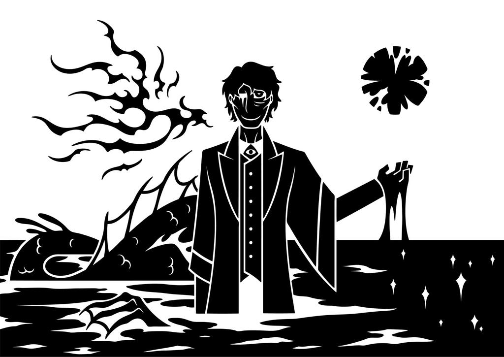
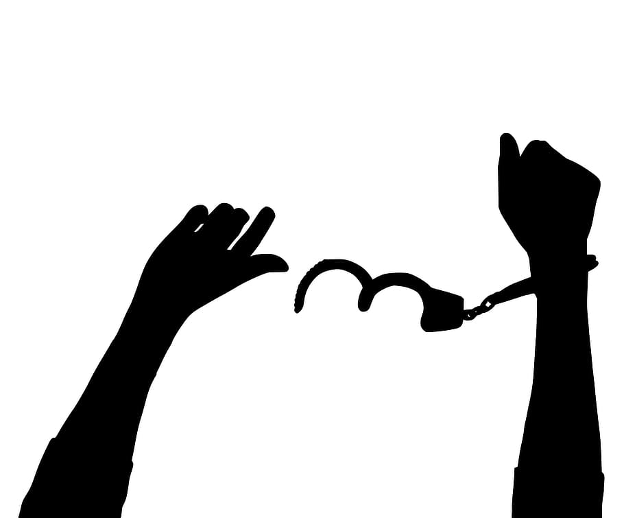
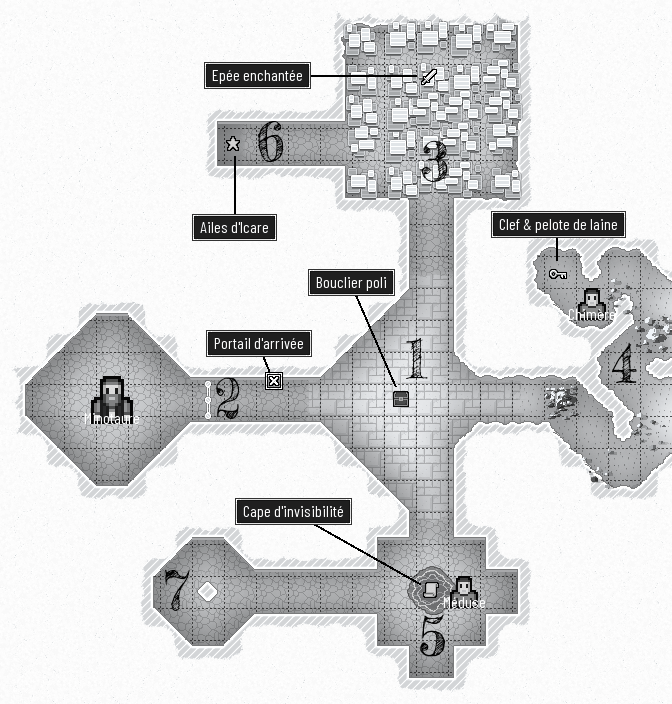
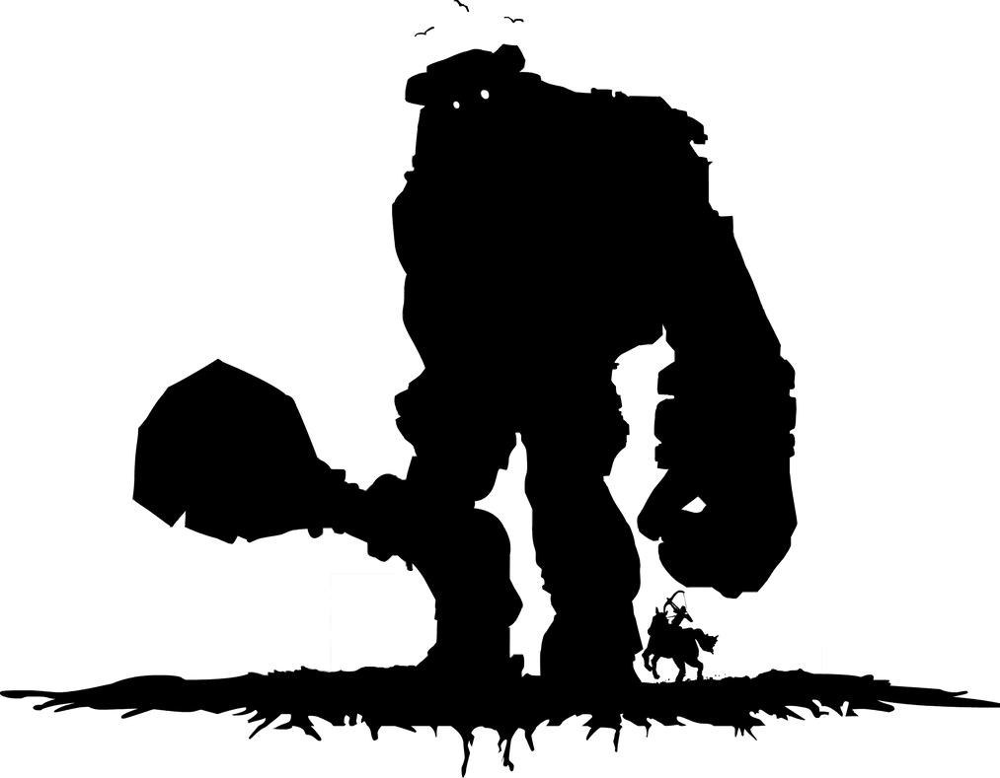
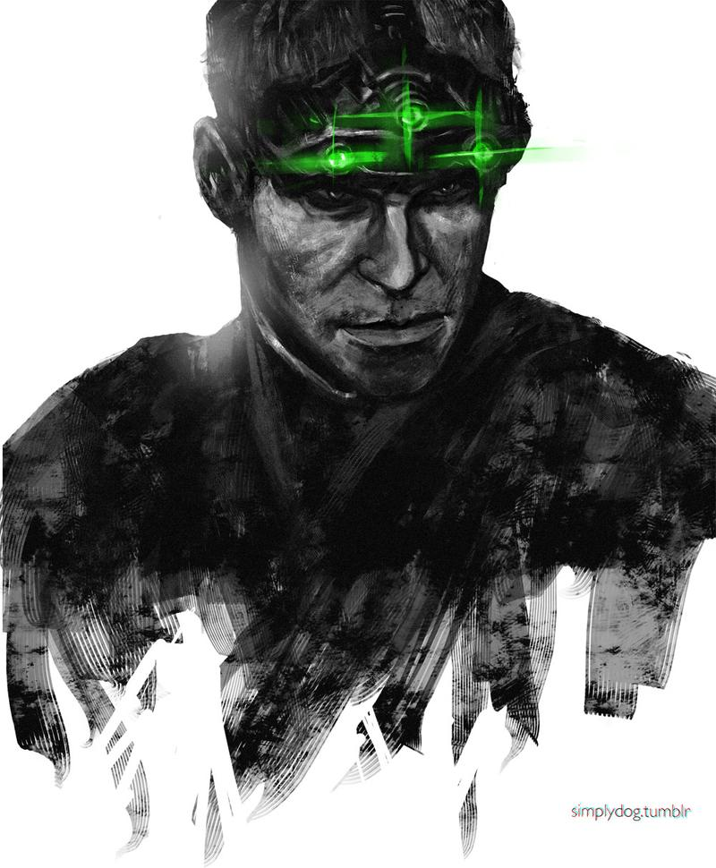
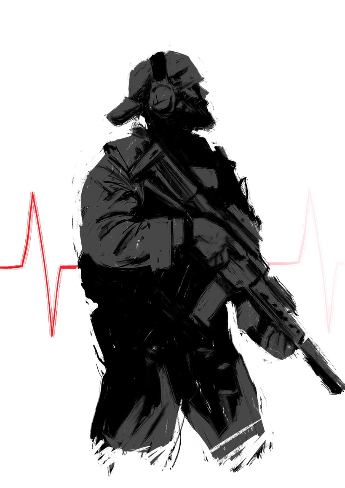
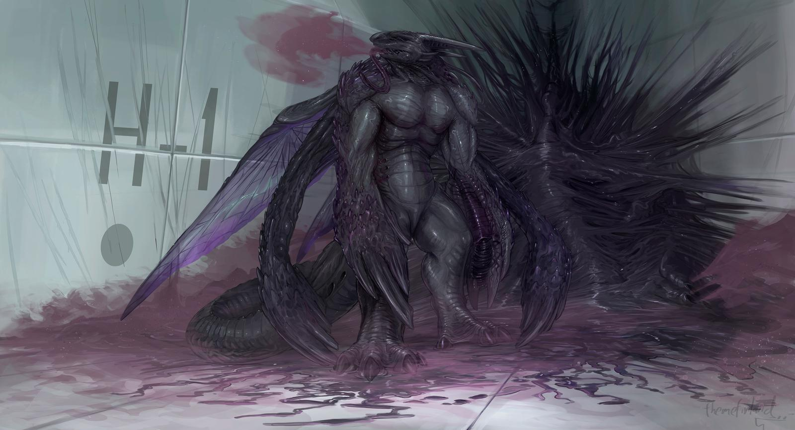
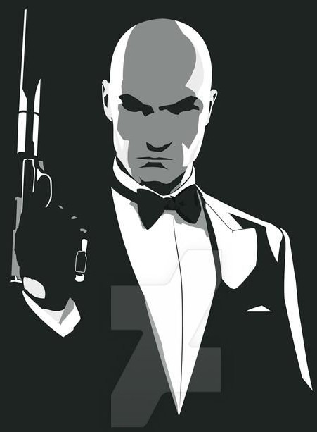

<!--
# Cyber Conv

14:00-14:55 Labyrinthe          https://www.conventions-rolistes.org/jdr/parties/1196.html
    Table Jdr - 10 - Illustration du scénario : https://www.deviantart.com/sunnyclockwork/art/SCP-2661-730370255
15:00-15:55 La chute du colosse https://www.conventions-rolistes.org/jdr/parties/1205.html
    Table Jdr - 16 - Illustration du scénario : https://www.deviantart.com/fritz6/art/SotC-Christmas-Shirt-Design-83990541
16:00-16:55 Invasion            https://www.conventions-rolistes.org/jdr/parties/1206.html
    Table Jdr - 18 - Illustration du scénario : https://www.deviantart.com/suldae/art/Plasma-Gauntlet-252040729
17:00-17:55 Hitman              https://www.conventions-rolistes.org/jdr/parties/1207.html
    Table Jdr - 21 - Illustration du scénario : https://www.deviantart.com/evandeciren/art/HITMAN-Absolution-324477366

./webcountdown.py 30

A mentionner au début :
- tour de table -> en profiter pour noter sur papier tour de parole
- déroulement de la session
- origine du jeu & règles : https://labrysgames.itch.io/run-die-repeat
Traduction Fr disponible ici : https://chezsoi.org/lucas/blog/pages/jeux-de-role.html
Prévu pour l'impro, mais j'ai été inspiré pour préparer des mini scénarios.
> Le jeu fonctionne comme un jeu vidéo "die & retry", mais au lieu de faire preuve de dextérité,
> il va vous falloir faire preuve de beaucoup d'imagination, pour tenter à chaque fois une nouvelle approche !
PASSER SON TOUR est possible si vous manquez d'inspiration, mais dans le doute, tentez quelque chose !
- fonctionnement avec rpg-dice / DiceParser & webcountdown : !1d6
PARTAGER lien webcountdown & illustration
- pour INVASION : règle des détails à la liberté des joueurs
- tout le monde a bien compris ? Go !

MGS5 intro : https://www.deviantart.com/sunnyclockwork/art/Trauma-517518224

Proposer différentes ambiances aux collègues : labyrinthe, independance day ou combat contre un colosse ?

https://www.youtube.com/watch?list=PL-3oZ3AfF3_2TSyoAJ_OaewrZc8JcOBWM&index=7

* scénario à ressources limitées (exemple : 1 balle restante + 1 grenade éblouissante + 1 gadget ouvreur de porte)
avec lesquelles les premiers obstacles peuvent être facilement franchis,
mais sans lesquelles une seconde série de dangers est extrêmement difficile à traverser

* énigme ne permettant qu'un seul essai, mais solvable en itérant toutes les possibilités :
3 leviers positionnables, ou code à rentrer + indice quelque part que le même chiffre se répète 4x
Enfin, j'introduirai peut-être une **règle spéciale _Next_** : au prix de **2min de moins** sur le compte à rebours,
le personnage peut **explorer toutes les alternatives temporelles** d'un problème à un moment donné de la partie,
comme un digicode, un labyrinthe, un unique combat avec plusieurs ennemis...
Il peut ainsi en déduire le code, le chemin pour en sortir, où la combinaison d’enchaînements de coup
pour en finir avec ses adversaires en mode _Matrix_ !

Prennez un paquet de carte à jouer de 1 à 6,
et posez-les devant vous ordonnées avec la carte 6 sur le dessus.
La carte du dessus définit la valeur minimale à obtenir au dé pour réussir une action.
Chaque fois que les joueurs ratent un jet, enlevez une carte ;
chaque fois qu'ils réussissent, remettez-les toutes dans l'ordre.

Labyrinthe 2:
- pièges : marteau-balancier géant, escalier-glissière, dards empoisonnés, flammes
- monstres : gobelins, squelettes, basilic...
-->

# Scénarios pour Run. Die. Repeat.

:::: row
::: scenario

## Cthulhu fhtagn
> La lumière blafarde de la pleine lune te réveilles.
> Tu ouvres les yeux dans un immeuble abandonné, le long d'une falaise.
> Loin, très loin, tu distingues une énorme vague s'approchant sur la mer.
> Sur le mur devant toi, une inscription en lettres de sang :
> « empêchez le grand prêtre de le réveiller ».
> Au pied du bâtiment, tu aperçois une procession psalmodiant une litanie lugubre et se dirigeant vers un phare...
### Objectif
Mettre fin au rituel avant qu'il ne soit trop tard !
### Inspirations
L'œuvre de H. P. Lovecraft et toutes celles qu'il a inspiré.
### Environnement
- procession d'une cinquantaine d'individus, tantôt comme hypnotisés, tantôt fanatiques.
Le grand prêtre à leur tête transporte une corne ornée d'inscriptions mystiques,
qu'ils transportent vers la mer.
- route en bord de falaise escarpée
- voiture décapotable des années 20 dans une grange
### Obstacles
- des chiens lâchés à tes trousses
- des hommes armés de fusils encadrant la procession
- une faille se créée dans le sol au milieu de la route
- au phare, faut-il descendre / monter les escaliers ?
- des [Profonds](https://fr.wikipedia.org/wiki/Ceux_des_profondeurs)
:::

::: scenario

## Évasion
> Tu es en cellule au commissariat, tu viens d'être arrêté pour un crime où tu risques perpétuité.
> Soudain, un paquet craft atterrit à tes pieds, lancé de l'extérieur à travers une lucarne.
> Dedans, tu trouves une machine avec [un étrange mécanisme](convecteur-temporel.jpg)
> incluant un compte à rebours de 20min, ainsi que ce mot : « Fait sortir Loubianov par l'arrière-court »
### Objectif
Trouver un moyen de s'évader avec Loubianov qui n'est pas au courant du plan !
### Inspirations
Toutes les scènes de film dans des commissariats, Prison Break, le jeu vidéo Hitman...
### Environnement
- une cellule à barreaux, avec couchette et WC
- bâtiment sur deux étages, avec un espace central ouvert sur deux niveaux, en _open space_ de bureaux
- au RdC : accueil, bureaux partagés, salles de déposition, cellules, réfectoire...
- à l'étage : salles d'interrogatoire, bureaux des gradés, salle de réunion, armurie, WC...
### Obstacles
- la porte de la cellule
- se déplacer dans un lieu plein de flics
- trouver Loubianov et le libérer
- s'enfuir
:::
::::

:::: row
::: scenario
<!--  -->

## Labyrinthe
> Tu mets le pied hors du portail magique, dans le labyrinthe.
> D'immenses murs de marbre lisse se dressent autour de toi.
> Empruntes-tu le couloir à droite ou à gauche ?
### Objectif
Traverser une succession d'obstacles, avec à chaque fois un choix "droite / gauche" à faire dans ce dédale,
(et donc à mémoriser laborieusement...), avec toujours la possibilité de revenir en arrière à une intersection.
Les joueurs trouvent la sortie s'ils arrivent à planner jusqu'à l'extérieur du labyrinthe, ou à vaincre le Minotaure,
ce qui nécessite d'employer au moins un artefact pour obtenir 7 ou plus au dé.
### Inspirations
La mythologie grecque et plus en particulier Dédale, Thésée et le Minotaure; les livres de _Sword & sorcery_.
### Règles spéciales
Chaque fois que le joueur décède, il laisse un cadavre qui reste présent dans les itérations suivantes.
### Environnement
Des couloirs à n'en plus finir, débouchant toujours vers une pièce « en T » avec un obstacle
### Obstacles _<small>(1d6 + nombre de pièces franchies)</small>_
Les salles rencontrées, dans l'ordre :
1. une salle vide dont les dalles au sol s'effondrent sur une fosse à pieux.
Un 1er chemin court permet de la traverser, un 2e, plus long, permet d'accéder au coffre au centre de la salle,
contenant un bouclier poli (**+1** au dé en combat, **+3** contre Méduse).
1. un portail nécessitant une clef bloque l'accès à la pièce.
Derrière, un trône de dos, d'où dépasse une paire de cornes.
C'est l'antre du Minotaure !
1. les murs des parois deviennent tellement polis qu'ils se transforment en miroir,
transformant cette partie du labyrinthe en galerie des glaces.
Elle comporte un coffre caché, contenant une cape rendant invisible
(**+2** au dé pour esquiver les monstres).
1. Une grotte abritant le repaire de Chimère, une créature mi-lion mi-dragon.
Elle est initialement assoupie contre un coffre contenant une épée enchantée,
capable d'aspirer les âmes (comme [_Stormbringer_](https://fr.wikipedia.org/wiki/Stormbringer_(%C3%A9p%C3%A9e) -
**+2** au dé en combat, **+1** par monstre déjà vaincu avec).
1. Méduse la Gorgone, paisiblement assise de dos contre une fontaine.
Au-fond de celle-ci repose une clef attachée à une pelote de laine
1. un trompe-l'oeil cachant un à-pic, avec un dénivelé lisse de 10 mètres donnant...
dans l'antre du Minotaure !
En s'aidant de la pelote de laine, il est possible d'accéder à une enfractuiosité plus bas
renfermant les ailes d'Icare, permettant de planer (mais pas de s'envoler).
1. un cul-de-sac donnant sur un puit avec inscrit « Icare » sur la marelle,
au fond duquel on débouche à 100m **au-dessus** du labyrinthe.
:::

::: scenario

## La Grande Guerre
> Vous vous réveillez sur une couchette d'un lit superposé, dans une pièce souterraine sombre.
> À tatôns vos doigts vous révêlent que vous portez un uniforme de soldat, et un bandage à la tête.
> À l'extérieur, des explosions font trembler la terre.
### Objectif
Atteindre le campement du général en traversant une zone extrêmement dangereuse.
### Inspirations
Les tranchées de la première guerre mondiale.
### Environnement
- à l'entrée de la cagna, un homme agonise :
« C'est la fin pour moi, c'est foutu. Écoute-moi : cette missive est pour le général, de l'autre côté du fleuve.
Bon dieu, c'est la fin de l'enfer, c'est l'armistice ! Mais il ne le sait pas, et il va lancer une offensive finale à midi...
Il faut à tout prix empêcher le carnage. »
- en cherchant un peu, la cagna contient du matériel _<small>(lisez lentement cette liste pour simuler la durée de la fouille)</small>_ :
gourde, couverture, rations, casque, masque à gaz, fusil
- une épave de zeppelin, en feu, ainsi que d'autres véhicules gisent autour, plus ou moins ou fonctionnels : jeep, moto...
### Obstacles
- l'obscurité initiale de la pièce. Une lampe à huile suspendue à côté du joueur tombe systématiquement au sol quelques secondes après son réveil.
- une ogive tombe et explose devant le joueur
- du gaz moutarde stagne dans une section des tranchées
- une tranchée est pleine d'eau
- un espace à découvert à franchir, miné, sous le feu d'une mitrailleuse
- enfin, un pont au milieu duquel se dresse un barrage
:::
::::

:::: row
::: scenario

## Invasion
> ALERTE ROUGE ! Des aliens attaquent la planète,
> et leur énorme vaisseau dans le ciel est en train de préparer un gigantesque tir de canon laser !
> Scientifique de génie travaillant en secret dans un laboratoire secret caché dans la montagne,
> vous enfilez votre harnais _jetpack_ / machine à voyager dans le temps pour aller leur botter les fesses.
### Objectif
Détruire le vaisseau alien.
### Inspirations
Les films _Independence Day_ & _Edge of Tomorrow_,
les jeux vidéo _Half Life_ & _Portal_.
### Règles spéciales
Le harnais permet de revenir dans le temps à volonté (20s plus tôt par exemple),
**et** ramène à l'instant où il est arnaché en cas de décès de son porteur.

Chaque fois qu'un joueur obtient un ~~⚀~~, un nouvel alien, ayant détecté la manipulation temporelle,
s'interpose sur le chemin du joueur, de plus en plus proche de l'endroit où il recommence, et mieux armés.
Il n'y a **pas de limite de temps**, mais au 6e ~~⚀~~ obtenu, un alien a réussi à localiser
où le joueur débute sa boucle temporelle et le tue au moment où il active son harnais !
### Environnement
- un complexe souterrain rempli d'expérimentations technologiques :
protype de vaisseau volant, [_portal gun_](https://theportalwiki.com/wiki/Handheld_Portal_Device/fr),
golem consituté de nanorobots...
- un labyrinthe de canyons pour atteindre le centre du gigantesque vaisseau alien circulaire qui obstrue le ciel
- un vaisseau sptial titanesque, mi organique mi technologique, ou des insectes géants cotoient des [mechas](https://fr.wikipedia.org/wiki/Mecha) extra-terrestres
### Obstacles
- dans les canyons, des vaisseaux aliens pourchassent et canardent le joueur
- une fois dans le vaisseau alien, des tourelles mitraillent déjà une flotte d'avions de chasse de l'armée
- le harnais du joueur lui indique qu'il a localisé le point faible du vaisseau :
une salle contenant l'ordinateur central. Il faut pour y accédder s'aventurer dans un dédale de coursives plein de guerriers aliens...

Limitez le nombre d'obstacles si les joueurs obtiennent plusieurs ~~⚀~~.
:::

::: scenario

## La chute du colosse
> Le géant de pierre, aux membres ornés de runes mystiques, est au portes de la cité :
> sa taille colossale plonge la moitié de la ville dans l'ombre.
> Heureusement, le sortilège des mages a fonctionné : vous avez quelques minutes devant vous,
> dans cette bulle « hors du temps », où vous ne craignez pas la mort.
> Vous êtes le dernier espoir de votre peuple : vous devez le vaincre avant que l'enchantement ne se brise !
### Objectif
Abattre le colosse en trouvant et détruisant son point faible.
### Inspirations
Le jeu vidéo _Shadow of the Colossus_, le manga l'Attaque des Titans.
### Environnement
Vous êtes à cheval, avec un glaive qui peut être propulsé et tirer un cable.
À proximité, il n'y a que les remparts de la cité et une falaise.
Le géant a plusieurs particularités :
- il est très lent
- il manie une gigantesque massue
- il peut être escaladé, son corps de pierre comportant de nombreuses prises
- ses points faibles :
  * un sceau runique luminescent au front (le seul des 3 visible aisément)
  * un énorme cristal bleu au niveau du coeur, battant lentement
  * un harpon planté dans sa nuque qui, si retiré, « libèrera » la créature, qui fera demi-tour
### Obstacles
- dès que le joueur s'approche de lui, le colosse tentera de l'écrabouiller d'un pied ou de son arme
- en dessous du torse, le corps du colosse comporte des pièges : pieux, lames rotatives, huile bouillante...
- au dessus du torse, des arraignées venimeuses parcourent le colosse, et aggresseront quiconque tente de l'escalader.
Si le joueur tente de planter son glaive téléscopique dans un membre dans cette zone, les arraignées le sectionneront.
- des squelettes de rapaces volent au-dessus de sa tête, et s'attaqueront au joueur s'il arrive jusque là
:::
::::

:::: row
::: scenario

## Spec Ops #1 - Infiltration
> Vous êtes Alex « Snake » Fisher, un mercenaire spécialiste dans l'infiltration de zones dangereuses,
> ainsi qu'expert en close-combat, en escalade et en parkour.
> La CIA vous a missionné pour voler des informations dans l'ambassade du Gondawa à Kinshasa.
### Objectif
Copier le contenu de l'ordinateur portable personnel de l'ambassadeur, en y apposant durant 30 seconds un gadget qui vous a été fourni.
### Inspirations
> Les jeux vidéos Metal Gear Solid & Splinter Cell,
dont la bande son de l'épisode _Chaos Theory_ est recommandée en ambiance sonore.
### Règle spéciale
À chaque début de partie vous débutez avec une arme à feu avec silencieux et un équipement spécial tiré au hasard **à chaque fois** :
⚀-⚁ | Des **lunettes multi-visions** [capables](https://splintercell.fandom.com/wiki/Multi-Vision_Goggles) de détecter les signatures thermiques des individus à travers les parois, ainsi que les appareils électromégnétiques
----|-
⚂-⚃ | Un **combinaison intégrale de camouflage mimétique** rendant son porteur invisible tant qu'il reste immobile
⚄-⚅ | Des **grenades électrocinétiques paralysantes**

Vous gagnez **+2** au résultat du dé lors d'actions où vous employez cet équipement à votre avantage.
### Environnement
- l'ambassade est une belle résidence de style colonial à 2 étages, entourée d'un petit jardin tropical.
- Alex débute posté sur le toit de l'immeuble le plus proche, d'où une ligne à haute tension descend jusqu'au toit de l'ambassade
- le jardin à l'avant de la propriété est entouré d'une haute grille en fer forgée, et est parcouru par un garde armé avec un chien en laisse
- l'arrière de la propriété est surveillée par un garde à l'étage, armé d'un fusil mais partiellement attentif, un journal dans la main
- la demeure comporte plusieurs caméras de surveillance, scrutées à distance par un opérateur en liaison audio avec les 2 gardes
- quelques pièces à l'intérieur : salle de réception, cuisine, bibliothèque, celier, escalier central grinçant...
- les autres occupants sont : l'ambassadeur Glenn Oslow assoupi dans un fauteuil de son bureau; sa jeune fille de 4 ans dans sa chambre; 2 gardes & un chien endormis dans un dortoir; la gouvernante dans sa chambre
### Obstacles
- descendre le long de la ligne à haute tension demande une certaine dextérité, et peu se révéler fatal
- le toit de l'ambassade ne comporte aucune ouverture : il faut en descendre le long d'une façade, au risque de s'exposer aux gardes
- dans le jardin, à une distance de moins de 20 mètres, le chien du garde repérera Alex. Il est toutefois possible d'anticiper le parcours de leur tour de garde facilement.
- il n'est pas si difficile de s'introduire dans l'ambassade. Reste encore à localiser l'ordinateur, dans le bureau au 1er étage, où l'ambassadeur est assoupi. L'info peut être obtenue avec les lunettes multi-visions, en interrogeant un garde, en fouillant la demeure pièce par pièce...
- subtiliser les donneées à l'insu de M. Oslow nécessitera une diversion, une neutralisation ou une discrétion ultime...
- enfin, une fois les données copiées, l'extraction hors de l'ambassade peut se révéler délicate, un PNJ ayant en effet une insomnie au même moment (au choix, l'ambassadeur, sa fille ou la gouvernante)
- un passage « en force » est tout à fait envisageable, mais si Alex se fait détecter avant de l'avoir neutralisé, l'ambassadeur Glenn Oslow, [un homme d'une quarantaine d'année aux cheveux longs et à la moustache blanche](https://metalgear.fandom.com/wiki/Colt_Single_Action_Army_Revolver), se révelera un redoutable combattant armé de son revolver, et effacera toutes les données de son ordinateur à la première occasion
:::

::: scenario

## Spec Ops #2 - Prototype
> Vous êtes Alex « Snake » Fisher, un mercenaire spécialiste en infiltration et en close-combat.
> Vous avez été fait prisonnier par des narco-traffiquants dans le désert espagnol des Bardenas, enfermé dans un vieux bunker souterrain.
> Depuis plusieurs jours, un « docteur » expérimente des drogues sur des soldats capturés, qui ont succombés un par un.
> Aujourd'hui, c'est votre tour.
### Objectif
Vous évader du campement des narcos.
### Inspirations
> Les jeux vidéos Metal Gear Solid, Prototype & Splinter Cell.
### Règle spéciale
Les joueurs se répartissent au départ un certain nombre de jetons : 10 à 2 ou 5 joueurs, 12 à 3 ou 4 joueurs.
Ils peuvent en dépenser 1 ou 2 avant chaque jet, chacun fournissant un bonus de **+2** au dé.

Durant la partie, chaque soldat ennemi aura un point faible particulier, et une capacité bonus à transmettre au joueur,
qui en bénéficiera toujours aux prochaines boucles temporelles
### Environnement
- une fois l'injection du « docteur » faite dans ta nuque, tu ressens ...
- le bunker souterrain est constitué d'un couloir central débouchant vers le sas de sortie,
et quatre pièces : une geôle désormais vide, le labo servant aux expérimentations du « docteur »,

- plusieurs options pour s'échapper : jeep, moto, hélico...
À pied, c'est la mort assurée dans le désert.
En cas de fuite par route, une course-poursuite risque de s'engager.
### Obstacles
- « docteur »
CAPACITES / COMPETENCES : face swap, générer une lame (+1), maîtrise du close combat (+1), maîtrise des armes à feu (+1)
:::
::::

:::: row
::: scenario

## Spec Ops #3 - REVENGEANCE
> 
### Objectif

### Inspirations
> Les jeux vidéos Metal Gear Solid, Prototype & Splinter Cell.
### Règles spéciales
+1 aux prochains jets par adversaire absorbé

Pas besoin de jet pour éliminer un ennemi seul.

Face au boss, capacité de retour temporel annulé !
MAIS le combat se prolonge, round par round...
### Environnement

### Obstacles
- boss final nécessitant d'obtenir un résultat de 10 en combinant dé & bonus :
Glenn Oslow, accompagné de sa fille devenue ninja-prototype
:::

::: scenario

## Hitman
> Ce soir, vous avez un contrat, une cible à abattre : Viktor Novikov,
> dirigeant d'une influante marque de haute couture, et représentant d'un réseau occulte d'espions.
> Vous venez de vous introduire dans le palais Walewska sur l'île Saint-Louis à Paris, 
> un musée où se tient pour l'occasion un défilé de mode.
> Vous avez sur vous un costume trois pièces et un revolver avec silencieux.
### Objectif
Éliminer Viktor Novikov et vous enfuir avant d'être capturé ou tué.
### Inspirations
Le jeu vidéo Hitman.
### Environnement
- le joueur débute dans des WC par la fenêtre desquels il s'est infiltré dans le bâtiment.
Il y a un mannequin dans les cabinets, Helmut Kruger,
qui est malade et ne sortira pas de lui-même des toilettes.
- le palais est luxueux et comporte de nombreuses pièces :
cuisines & cave au sous-sol, défilé de mode et réception au rez-de-chaussée,
salons de réceptions dans les étages (y accédder nécessite de passer par une fouille au corps)
avec des portes en trompe-l'oeil et des placards où se cacher,
combles servant à entreposer les oeuvres en réserve et où des écrans sont suspendus dans une section,
pour permettre au superviseur des agents de sécurité de surveiller tout le bâtiment...
### Obstacles
- en sortant dans le couloir par l'unique porte des WC,
le joueur tombe systématiquement sur un agent de sécurité inquisiteur, Boris,
dans l'angle d'une caméra, qui le [tasera](https://fr.wikipedia.org/wiki/Pistolet_%C3%A0_impulsion_%C3%A9lectrique)
à la moindre réponse suspecte (en venir aux mains avec lui déclenchera l'alarme) :
1. « Bonjour Monsieur. Je vois que vous n'avez pas de badge, pouvez-vous me présenter une pièce d'identité svp ? »
<ol></ol>

1. _<small>(avec le badge d'Helmut)</small>_ « Kruger ? Enfin ! Grouille-toi de me filer ma commande. »
_<small>(de cocaïne)</small>_
2. _<small>(sur la défensive)</small>_ « Vous n'êtes pas invité ? Déclinez immédiatement le code opérationnel. »
_<small>(le code du jour est KOALA, Boris le révelera si le joueur le menace)</small>_

- Viktor Novikov est au milieu de la réception, et ne la quitte au bout de 10min
que pour se rendre sur scène (au dessus de laquelle pend un immense lustre).
Sa femme, Dalia, est elle sans cesse en mouvement à travers le palais.
- il est possible d'attirer Viktor dans « un coin traquile » de bien des manières...
- si le joueur endosse l'identité d'Helmut,
un des assistants de l'organisation du défilé viendra lui demander de le suivre car c'est bientôt à son tour de monter sur scène
- si le joueur a été vu commettre le crime, ses seules sorties possibles sont
par les jardins en sortant par la cave, ou par les toits.
Toutes les autres sorties sont gardées par des agents de sécurité.
:::
::::

J'ai tenté pour chaque scénario de créer un objectif [diégétique](https://fr.wiktionary.org/wiki/di%C3%A9g%C3%A9tique) à l'histoire,
en fournissant même parfois une explication à la capacité à remonter le temps ou à la contrainte des 20min.

- [A Bottomless Sea by SunnyClockwork](https://www.deviantart.com/sunnyclockwork/art/A-Bottomless-Sea-646335250) - CC BY-SA 3.0
- [Trench Warfare](https://freesvg.org/trench-warfare) de freesvg.org, domaine public
- [Plasma Gauntlet by suldae](https://www.deviantart.com/suldae/art/Plasma-Gauntlet-252040729) - CC BY-NC-SA 3.0
- [SotC Christmas Shirt Design by Fritz6](https://www.deviantart.com/fritz6/art/SotC-Christmas-Shirt-Design-83990541) - CC BY-NC-SA 3.0
- [Sam Fisher by thesimplyLexi](https://www.deviantart.com/thesimplylexi/art/Sam-Fisher-510237938) - CC BY-NC-SA 3.0
- [Soldier1 by thesimplyLexi](https://www.deviantart.com/thesimplylexi/art/Soldier1-558361525) - CC BY-NC-SA 3.0
- [Adaption by ThemeFinland](https://www.deviantart.com/themefinland/art/Adaption-727992016) - CC BY-NC-SA 3.0
- [HITMAN - Absolution by EvanDeCiren](https://www.deviantart.com/evandeciren/art/HITMAN-Absolution-324477366) - CC BY 3.0

La carte du labyrinthe a été réalisée avec [Tabletop RPG Map editor II de Sébastien Bénard v15.4](https://deepnight.itch.io/tabletop-rpg-map-editor)
([fichier JSON source](Labyrinthe.json))

