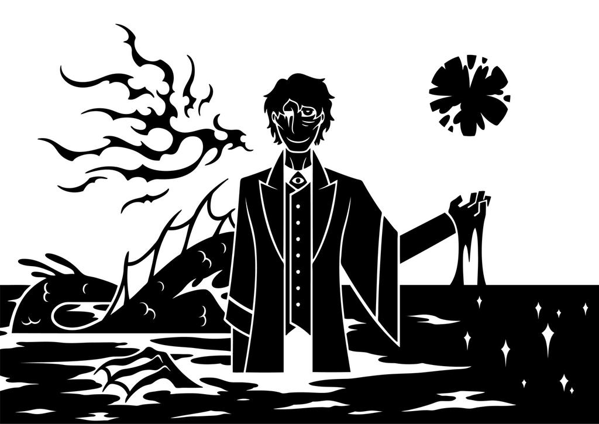
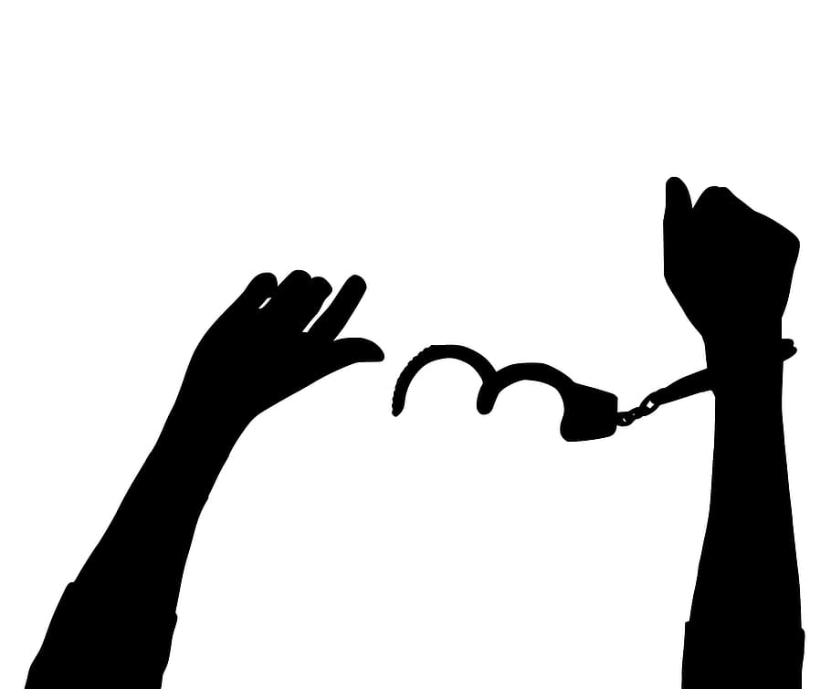
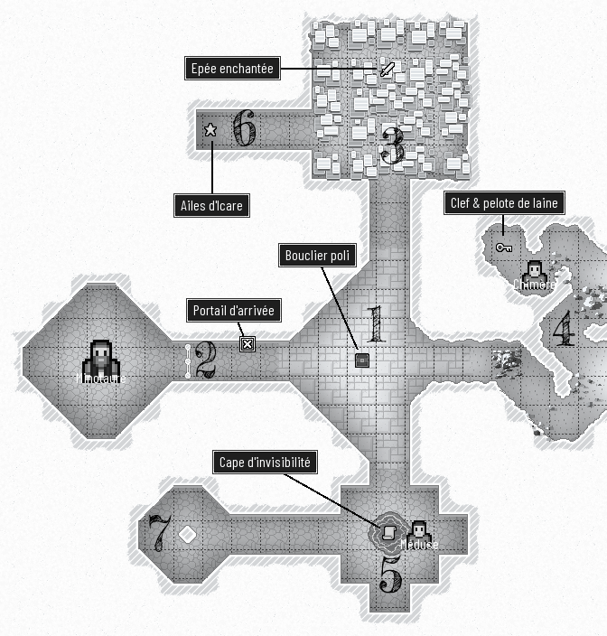
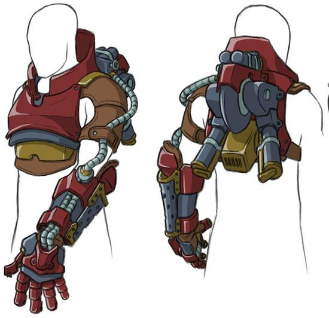
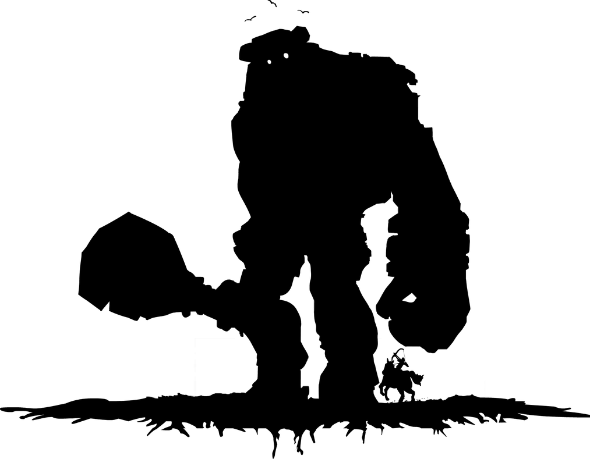
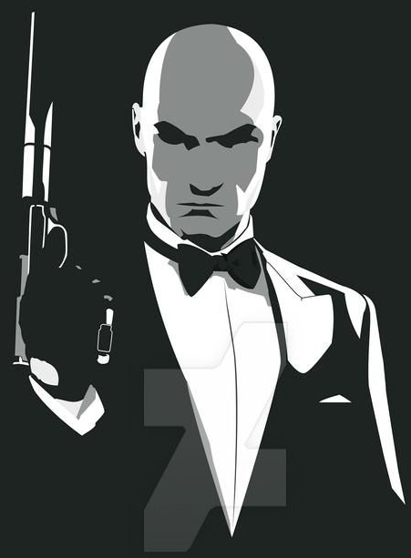
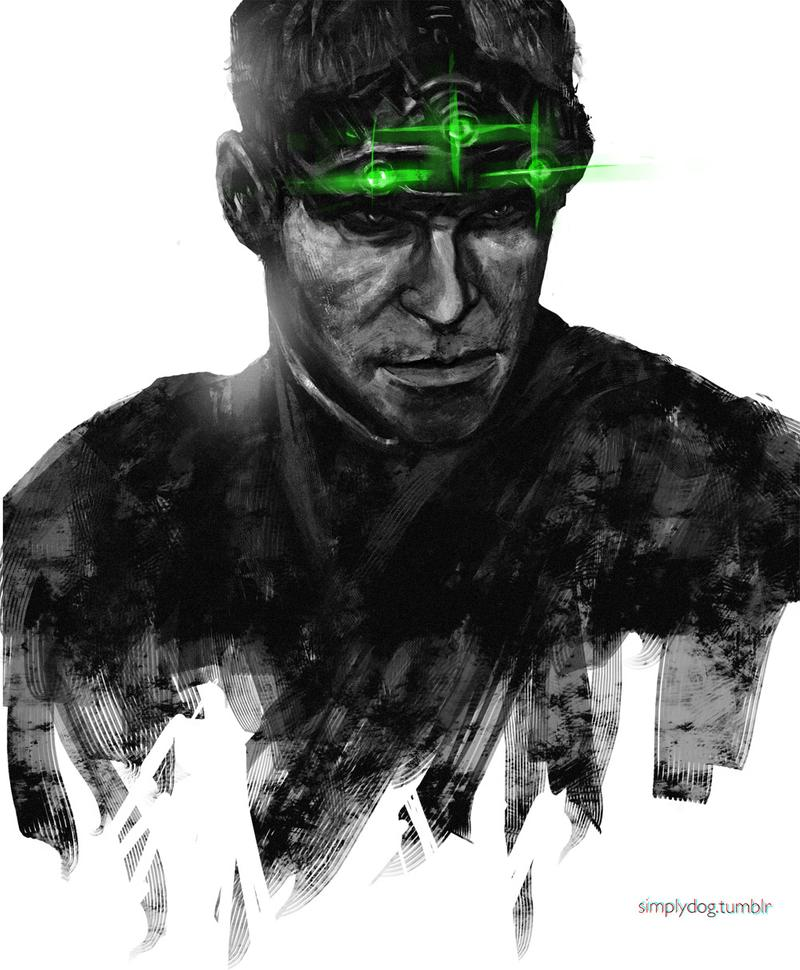
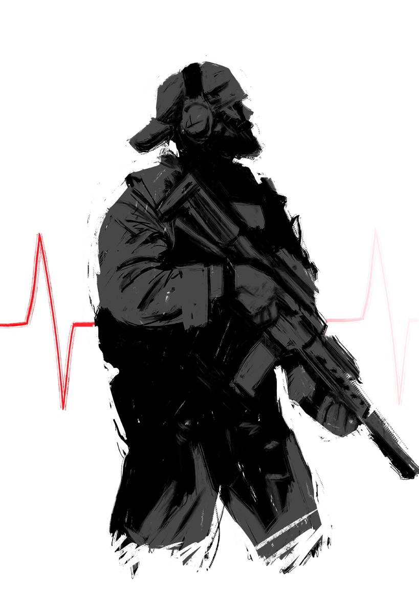
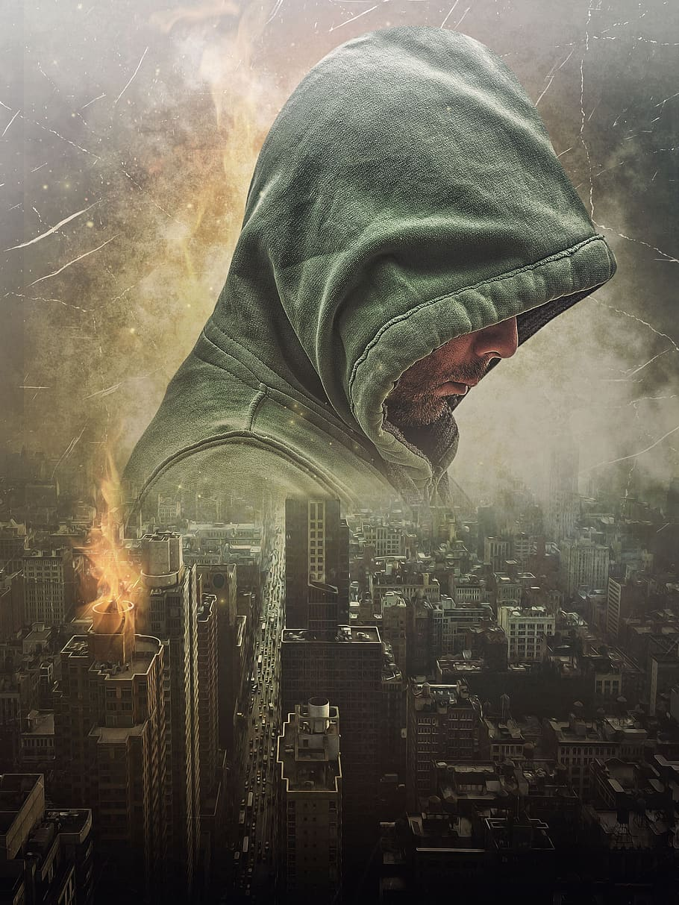

<!--
Ici & sur blog : favoriser liens itch.io pour téléchargements, car incluent des compteurs

Note : en termes de mise en page PDF, quelques soucis persistent : overflow + pictos mal rendus par Puppeteer

./extract_pdf_pages.sh RunDieRepeat-scenarios-FR.pdf 1 13 RunDieRepeat-scenarios-FR-v1.1.pdf

Publié / com' sur :
- [x] blog (article + https://chezsoi.org/lucas/blog/pages/jeux-de-role.html + mention sur Discord )
- [x] https://lucas-c.itch.io/10-scenarios-pour-run-die-repeat (source de la bannière : https://pixabay.com/illustrations/banner-header-time-clock-expansion-1220390/ )
- [x] http://troplongpaslu.fr/jeux-de-role-court/10-scenarios-pour-run-die-repeat/
- [x] http://www.scenariotheque.org
- [x] https://www.trictrac.net/forum/sujet/10-scenarios-pour-run-die-repeat & https://www.trictrac.net/forum/sujet/10-scenarios-pour-run-die-repeat-1
- [x] http://forums.ffjdr.org/viewtopic.php?f=87&t=18558&p=302693
- [x] http://www.500nuancesdegeek.fr/forum/viewtopic.php?f=15&t=1739
- [x] https://www.casusno.fr/viewtopic.php?f=26&t=37394

[v1.1]:
- quelques détails un peu clarifiés dans le scénario La Grande Guerre
- nouvelle illustration pour le scénario Revengeance

[v1.2]: not released yet
- Cthulhu: affaires pêcheur
- Évasion: masque en latex
- Invasion: Soni Tark & bonus conférés par inventions & détaillé intérieur vaisseau alien
- Hitman: scène initiale avec Boris raccourcie & ajouté quelques obstacles & éléments d'environnement
-->

# Scénarios pour Run. Die. Repeat.
:::big picto
🏃 ☠️ ♻
:::
::: author
Lucas Cimon - [chezsoi.org](https://chezsoi.org)
:::

::: web-only
Version PDF: [@itch.io](https://lucas-c.itch.io/10-scenarios-pour-run-die-repeat)
:::

Ce document rassemble une dizaine de scénarios conçus pour le jeu de rôle [_Run. Die. Repeat._](https://labrysgames.itch.io/run-die-repeat)
créé par **Labrys Games** ([traduction en français](https://chezsoi.org/s/RDRfrdirectPDFdownload)).
Ces scénarios sont inspirés, en vrac, des écrits de Lovecraft, du mythe du Minotaure,
des séries l'Attaque des Titans et Prison Break, des films Edge of Tomorrow et Independence Day,
et des jeux vidéos Hitman, Metal Gear Solid, Prototype, Splinter Cell ou encore Shadow of the Colossus.

* [Cthulhu fhtagn](#cthulhu-fhtagn)
* [Évasion](#vasion)
* [Labyrinthe](#labyrinthe)
* [La grande guerre](#la-grande-guerre)
* [Invasion](#invasion)
* [La chute du colosse](#la-chute-du-colosse)
* [Hitman](#hitman)
* [Spec Ops #1 - Infiltration](#spec-ops-1-infiltration)
* [Spec Ops #2 - Prototype](#spec-ops-2-prototype)
* [Spec Ops #3 - REVENGEANCE](#spec-ops-3-revengeance)

_Run. Die. Repeat._ est un jeu narratif monopage pour une MJ et quelques joueuses, en temps limité (20 à 30 min),
où l'on incarne à tour de rôle le même personnage, en essayant chaque fois de progresser plus loin dans l'histoire,
mais où le moindre jet de dé raté entraîne la mort.

J'ai été conquis par le principe du jeu, original et source de courte parties très amusantes.
Je l'ai traduit en français puis, durant le confinement de 2020, j'ai rédigé et fait joué à plusieurs reprises ces scénarios.
Ils sont tous indépendants, à l'exception des 3 derniers qui constituent un triptyque.
Pour chacun d'entre eux, j'ai tenté de créer un objectif [diégétique](https://fr.wiktionary.org/wiki/di%C3%A9g%C3%A9tique) à l'histoire,
en fournissant même parfois une explication à la capacité à remonter le temps et/ou à la contrainte de durée.

J'en profite pour glisser ici une suggestion à la MJ pour ajouter à la tension dramatique :
lorsque le chronomètre s'arrête, prévenez les joueuses que cela n'interrompt pas le _run_ en cours,
mais que c'est leur dernière chance de réussir !
Vous trouverez d'autres conseils & ressources concernant ce jeu sur mon blog ([lien vers articles taggés #run-die-repeat](https://chezsoi.org/lucas/blog/tag/run-die-repeat.html)). Si vous jouez à certains de ces scénarios, pensez à y laisser un commentaire, ça me fera très plaisir 😉.

Un grand merci aux _playtesteurs_ : Elliot, Etienne, Francis, Henri, Laëtitia, Matthieu, Martin, Nicolas L., Nicolas T., Pierre, Simon, Thomas, ainsi que les joueurs qui ont testé ces scénarios à la 1ère [CyberConv](http://www.cyberconv.com) :
Cronk, Komurin, Minipen, Orion, Pyrate, Aglatrex, Govomir, Koko, Sygma, TankGirl,
Bérangère, Couteau, RaptorKev, Synamary, Gryf, Hanté & Ligeia.

Merci également à ces illustrateurs qui ont déposé leur magnifique travail sous licence _Creative Commons_ :

- [A Bottomless Sea by SunnyClockwork](https://www.deviantart.com/sunnyclockwork/art/A-Bottomless-Sea-646335250) - [CC BY-SA 3.0](https://creativecommons.org/licenses/by-sa/3.0/fr/)
- [Trench Warfare](https://freesvg.org/trench-warfare) de freesvg.org, domaine public
- [Plasma Gauntlet by suldae](https://www.deviantart.com/suldae/art/Plasma-Gauntlet-252040729) - [CC BY-NC-SA 3.0](https://creativecommons.org/licenses/by-nc-sa/3.0/fr/)
- [SotC Christmas Shirt Design by Fritz6](https://www.deviantart.com/fritz6/art/SotC-Christmas-Shirt-Design-83990541) - [CC BY-NC-SA 3.0](https://creativecommons.org/licenses/by-nc-sa/3.0/fr/)
- [Sam Fisher by thesimplyLexi](https://www.deviantart.com/thesimplylexi/art/Sam-Fisher-510237938) - [CC BY-NC-SA 3.0](https://creativecommons.org/licenses/by-nc-sa/3.0/fr/)
- [Soldier1 by thesimplyLexi](https://www.deviantart.com/thesimplylexi/art/Soldier1-558361525) - [CC BY-NC-SA 3.0](https://creativecommons.org/licenses/by-nc-sa/3.0/fr/)
- [gothic, goth, fantasy, dark, apocalypse, scifi, sci-fi, male](https://www.piqsels.com/en/public-domain-photo-jsxss) de piqsels.com, domaine public
- [HITMAN - Absolution by EvanDeCiren](https://www.deviantart.com/evandeciren/art/HITMAN-Absolution-324477366) - [CC BY 3.0](https://creativecommons.org/licenses/by/3.0/fr/)
- [Antü Plasma Suite by Fabián Alexis](https://commons.wikimedia.org/wiki/File:Antu_org.kde.plasma.timer.svg) - [CC BY-SA 3.0](https://creativecommons.org/licenses/by-sa/3.0/fr/)

La carte du labyrinthe a été réalisée avec [Tabletop RPG Map editor II de Sébastien Bénard](https://deepnight.itch.io/tabletop-rpg-map-editor)
([fichier JSON source](https://github.com/Lucas-C/jdr/blob/master/RunDieRepeat/Labyrinthe.json))

Merci enfin aux développeurs des [logiciels libres](https://fr.wikipedia.org/wiki/Free/Libre_Open_Source_Software) employés : [le navigateur Firefox](https://www.mozilla.org/fr/firefox/), [le logiciel de dessin Gimp](https://www.gimp.org/), [l'éditeur de texte Notepad++](https://notepad-plus-plus.org/), [le lecteur de PDF Sumatra PDF](https://www.sumatrapdfreader.org), [le language de programmation Python](https://www.python.org/), les bibliothèques de code [markdown-it](https://github.com/markdown-it/markdown-it) & [Puppeteer](https://pptr.dev/).
Les fichiers sources ayant permis de générer ce PDF sont disponibles [sur GitHub](https://github.com/Lucas-C/jdr/tree/master/RunDieRepeat).

Ces scénarios sont publiés sous licence <a rel="license" href="http://creativecommons.org/licenses/by/4.0/">Creative Commons Attribution 4.0 International</a>.

---

::: page

## Cthulhu fhtagn
> La lumière blafarde de la pleine lune te réveilles.
> Tu ouvres les yeux dans un immeuble en construction, le long d'une falaise.
> Loin, très loin, tu distingues une énorme vague s'approchant sur la mer.
> Sur le mur devant toi, une inscription en lettres de sang :
> « empêchez le grand prêtre de le réveiller ».
> Au pied du bâtiment, tu aperçois une procession psalmodiant une litanie lugubre qui se dirige vers un phare...
### Objectif
Mettre fin au rituel avant qu'il ne soit trop tard !
### Inspirations
L'œuvre de H. P. Lovecraft et toutes celles qu'il a inspiré.
### Environnement
- une procession d'une cinquantaine d'individus, tantôt comme hypnotisés, tantôt fanatiques.
Le grand prêtre à leur tête transporte une corne ornée d'inscriptions mystiques, qu'ils transportent vers la mer.
- des affaires de pêcheur : filet, canne à pêche, couteau...
- une grue de chantier, une route en bord de falaise escarpée
- une ferme habitée avec une voiture décapotable des années 20
### Obstacles
- des chiens lâchés à tes trousses
- des hommes armés de fusils encadrant la procession
- une large faille se créée dans le sol au milieu de la route
- au phare, faut-il descendre / monter les escaliers ?
- des [Profonds](https://fr.wikipedia.org/wiki/Ceux_des_profondeurs)
### Conseils à la MJ
A chaque nouvelle tentative, indiquez aux joueuses que le tsunami se rapproche.

Dosez les obstacles pour créer une longue chaîne d'actions à mémoriser,
et faites en sorte que les joueuses atteignent le phare dans les 2 dernières minutes.
### Rejouer le scénario
Commencez au moment où vous saisissez la conque au grand prêtre :
vous devez échappez à la foule de cultistes à vos trousses, et réussir à le détruire à temps !
:::
---
::: page

## Évasion
> Tu es en cellule au commissariat, tu viens d'être arrêté pour un crime où tu risques perpétuité.
> Soudain, un paquet kraft atterrit à tes pieds, lancé de l'extérieur à travers une lucarne.
> Dedans, tu trouves une machine avec [un étrange mécanisme](convecteur-temporel.jpg)
> incluant un compte à rebours de 20min, un masque en latex, ainsi que ce mot :
> « Fait sortir Loubianov par l'arrière-court »
### Objectif
S'évader avec Loubianov, qui n'est pas au courant du plan !
### Règles spéciales
Le masque permet de prendre le visage de la personne que l'on souhaite.
Les joueuses le découvrent dès qu'elles le mettent.
### Inspirations
Toutes les scènes de film dans des commissariats, Prison Break.
### Environnement
- une cellule à barreaux, avec couchette, petit miroir et WC. Les cellules voisines contiennent un ivrogne et un gros bras de la mafia.
Un maton est à portée de voix
- le commissariat s'étale sur deux étages, avec un espace central ouvert sur deux niveaux, en _open space_ de bureaux
- au RdC : accueil, bureaux partagés, salles de déposition, cellules, vestiaire, réfectoire...
- à l'étage : salles d'interrogatoire, bureaux des gradés, salle de réunion, armurerie, WC...
### Obstacles
- la porte de la cellule
- se déplacer dans un lieu plein de flics
- faire face à la personne dont on a pris l'apparence
- trouver Loubianov, le libérer et le faire coopérer
- le faire s'évader alors que l'alert est donnée
### Conseils à la MJ
En cas de mauvais jets, il peut être laborieux et frustrant pour les joueuses se s'échapper initialement de la cellule.
Si vous approchez des 10min de partie et que les joueuses n'en sont pas sortis, indiquez que cette fois
le paquet kraft contient une arme (couteau ou revolver).

Terminez le scénario avec une camionnette qui fait un dérapage dans l'arrière-cout du comissariat,
la porte latérale ouverte.
### Rejouer le scénario avec des joueurs l'ayant déjà fait
- plus de masque dans le paquet kraft
- cette fois, Loubianov ne sera absolument pas coopératif :
il se sent plus en sécurité en prison qu'entre les mains des commanditaires de l'évasion !
:::
---
::: page

<!--  -->

## Labyrinthe
> Tu mets le pied hors du portail magique, dans le labyrinthe.
> D'immenses murs de marbre lisse se dressent autour de toi.
> La sentence a été claire... tu dois LE vaincre, ou trouver une sortie.
> Empruntes-tu le couloir à droite ou à gauche ?
### Objectif
Vaincre le Minotaure ou s'évader avec les ailes d'Icare.
### Inspirations
La mythologie grecque & les livres de _Sword & sorcery_.
### Environnement
Un dédale de couloirs reliant des pièces octogonales où le danger rôde.
Le personnage commence avec uniquement des vêtements en tissu sur lui, et **une pelote de laine** dans la poche.
### Obstacles
Les salles rencontrées, dans l'ordre :
1. une salle dont certaines dalles au sol s'effondrent sur une fosse à pieux.
Un chemin permet de traverser la pièce pour accéder à une intersection menant à 3 autres salles.
Un autre chemin permet d'accéder au coffre au centre,
contenant un **bouclier poli** (**+1** en combat, **+3** contre Méduse).
1. un portail nécessitant une clef bloque l'accès à la pièce.
Derrière, un trône de dos, d'où dépasse une paire de cornes.
C'est l'antre du Minotaure ! Il faut obtenir **7 ou plus au dé** pour le vaincre.
1. les murs des parois sont polis comme des miroirs, transformant cette partie du labyrinthe en galerie des glaces.
Elle comporte un coffre caché, contenant une **magnifique épée** (**+2** en combat).
1. Une grotte jonchée d'ossements, le repaire de Chimère, une créature mi-lion mi-dragon.
Elle est assoupie contre un coffre contenant **une clef**.
1. Méduse la Gorgone, paisiblement assise de dos contre une fontaine,
dont la sculpture centrale change à chaque passage dans la salle : Ariane, Dédale ou Minos.
Au fond de l'eau repose, quasi imperceptible, **une cape rendant invisible**
(**+2** pour esquiver les monstres).
1. la pièce semble vide, mais dissimule en trompe-l’œil un coffre
contenant **les ailes d'Icare**, qui permettent de planer (mais pas de s'envoler).
1. un cul-de-sac donnant sur un puits avec inscrit « Icare » sur la marelle,
au fond duquel on débouche à 100m **au-dessus** du labyrinthe.
### Conseils à la MJ
Essayez de perdre les joueuses en leur demandant à chaque fois un choix "droite / gauche" à mémoriser laborieusement.
Après 1 ou 2 tentatives contre le minotaure, **révélez aux joueuses le score minimum nécessaire**.
### Rejouer le scénario
Le Minotaure nécessite **9** pour être vaincu, et pourchasse les joueuses dès leur arrivée,
ne leur accordant aucun répit dans leur fuite !
:::
---
::: page

## La Grande Guerre
> Vous vous réveillez sur une couchette d'un lit superposé, dans une pièce souterraine sombre.
> À tâtons vos doigts vous révèlent que vous portez un uniforme de soldat, et un bandage à la tête.
> À l'extérieur, des explosions font trembler la terre.
### Objectif
Atteindre le campement du général en traversant un champ de bataille.
### Règles spéciales
Chaque fois qu'une joueuse décède, elle laisse sur place le cadavre de son personnage, qui restera présent dans les itérations suivantes.
La joueuse d'après se réincarne dans un autre soldat assoupi. La précieuse lettre reste sur le cadavre qui l'avait en sa possession.
Le temps défile en continu, il n'y a pas de retour dans le passé,
mais pour autant les règles ne changent pas : une action réussie une fois réussira toujours.
### Environnement
- à l'entrée de la cagna, un homme agonise :
« C'est la fin pour moi, c'est foutu. Écoute-moi : cette missive est pour le général, de l'autre côté du fleuve.
Bon dieu, c'est la fin de l'enfer, c'est l'armistice ! Mais il ne le sait pas, et il va lancer une offensive à midi...
Tu dois empêcher ce carnage. »
- la tranchée se poursuit un peu, jusqu'à une interesection en T
- à gauche, une tranchée pleine d'eau, qui remonte ensuite à la surface près d'une épave de zeppelin en feu.
Derrière, plus loin, un pont franchit le fleuve mais une mitrailleuse couvre cet espace à découvert.
- à droite, la tranchée est pleine de gaz moutarde, puis débouche dans un petit abri hébergeant une moto avec side-car
- en cherchant un peu, la cagna de départ contient du matériel :
gourde, couverture, rations, casque, masque à gaz, fusil...
### Obstacles
- l'eau où on risque de se noyer, le gaz moutarde, la mitrailleuse...
- sortir de la tranchée signifie s'exposer au feu ennemi, un jet est alors nécessaire pour chaque action, même la plus minime
- une ogive tombe et explose devant la joueuse
### Conseils à la MJ
Donnez des bonus aux jets des joueuses faisant preuve d'imagination.
Évitez de détruire la lettre, elle doit toujours être récupérable, tel un passage de relai macabre.
### Rejouer le scénario
Prolongez-le : derrière le pont, le campement du général est encore loin;
un avion s'écrase du ciel; un sniper dans un village en ruines; des chiens pourchassent la joueuse.
:::
---
::: page

## Invasion
> ALERTE ROUGE ! Des aliens attaquent la planète,
> et leur énorme vaisseau dans le ciel est en train de préparer un gigantesque tir de canon laser !
> Vous êtes Soni Tark, scientifique de génie travaillant dans un laboratoire secret caché dans la montagne,
> et vous enfilez votre _jetpack_ / machine temporelle pour aller leur botter les fesses.
### Objectif
Détruire le vaisseau alien.
### Inspirations
_Independence Day_, _Edge of Tomorrow_,
_Half Life_ & _Portal_.
### Règles spéciales
Le harnais ramène à l'instant où il est harnaché en cas de décès de son porteur
**et** permet de revenir dans le temps à volonté jusqu'à ce moment.

Les joueurs ont un bonus de **+1** pour chaque invasion issue de leur labo
qu'ils emploient durant une action, harnais compris.

Chaque fois qu'une joueuse obtient un ~~⚀~~, un nouvel alien, ayant détecté la manipulation temporelle,
s'interpose sur le chemin de la joueuse, chaque fois plus proche de l'endroit où elle recommence, et mieux armé.
### Environnement
- un complexe souterrain rempli d'expérimentations technologiques :
prototype de vaisseau volant, [_portal gun_](https://theportalwiki.com/wiki/Handheld_Portal_Device/fr),
golem constitué de nanorobots...
- un labyrinthe de canyons pour atteindre le centre du gigantesque vaisseau alien circulaire qui obstrue le ciel
- un vaisseau spatial titanesque, mi organique mi technologique, où des insectes géants côtoient des [mechas](https://fr.wikipedia.org/wiki/Mecha) extra-terrestres.
Son seul accès non lourdement défendu par des mitrailleuses est en son centre :
une large ouverture sert à la fois de canon laser et de base d'apontage de tous les vaisseaux alien.
- l'intérieur du vaisseau est un véritable labyrinthe, mais des plans aux murs révèlent l'emplacement des lieux essentiels :
le réacteur à nectar protonique, la ruche du Grand Père Gestateur et le centre de contrôle nevralgique des droïdes.
### Obstacles
- des vaisseaux aliens pourchasseront la joueuse dans les canyons
- une fois dans le vaisseau alien, des tourelles mitraillent déjà une flotte d'avions de chasse de l'armée
- pour détruire le vaisseau il faut lui trouver son point faible en s'aventurant son dédale de coursives bien défendues...
### Conseils à la MJ
Limitez le nombre d'obstacles si les joueuses obtiennent trop de ~~⚀~~.
Selon la vitesse à laquelle elles atteignent le vaisseau alien, révélez plus ou moins facilement / vite
son point faible critique qui fera tout exploser, par exemple via l'IA du harnais.
Octroyez des bonus aux joueuses qui emploient les inventions dans le labo ou la capacité à revenir dans le temps de manière ingénieuse.
### Rejouer le scénario
Un ~~⚁~~ introduit également un nouvel alien sur le parcours déjà effectué.
:::
---
::: page

## La chute du colosse
> Le géant de pierre, aux membres ornés de runes mystiques, est aux portes de la cité :
> sa taille colossale plonge la moitié de la ville dans l'ombre.
> Heureusement, le sortilège des mages a fonctionné : vous avez quelques minutes devant vous,
> dans cette bulle « hors du temps », où vous ne craignez pas la mort.
> Vous êtes le dernier espoir de votre peuple : vous devez le vaincre avant que l'enchantement ne se brise !
### Objectif
Abattre le colosse en trouvant et détruisant son point faible.
### Inspirations
Le jeu vidéo _Shadow of the Colossus_, le manga l'Attaque des Titans.
### Environnement
Vous êtes à cheval, avec un glaive qui peut être propulsé à grande vitesse et tracter un câble.
À proximité, il y a les remparts de la cité et une falaise.

Le géant est très lent, manie une gigantesque massue,
et son corps de pierre peut être escaladé.
Il a 3 points faibles :
  * un sceau runique luminescent au front (le seul des 3 visible aisément)
  * un harpon planté dans sa nuque qui « libérera » la créature si retiré
  * un énorme cristal bleu au niveau du cœur.
    Son champ magnétique plaquera le glaive contre son torse si la joueuse l'escalade.
### Obstacles
- dès que la joueuse s'approche de lui, le colosse tentera de l'écrabouiller d'un pied ou de son arme
- en dessous du torse, son corps comporte des pièges mécaniques :
pieux, lames rotatives, zones qui s'effritent ou se détachent...
- au dessus du torse, des araignées venimeuses parcourent le colosse, et agresseront quiconque tente de l'escalader.
Si la joueuse tente de planter son glaive télescopique dans un membre dans cette zone, les araignées le sectionneront.
- des squelettes de rapaces volent au-dessus de sa tête, et s'attaqueront à la joueuse si elle arrive jusque là
### Conseils à la MJ
Si les joueuses sont rapides à vaincre le colosse, des cris et la lumière d'un incendie de l'autre côté de la ville :
un second titan s'y est engouffré !
Si au contraire les joueuses sont lentes, ne faites pas intervenir les rapaces.
### Rejouer le scénario
Mode _difficile_ : la joueuse n'a plus de glaive télescopique, uniquement une épée et un arc.
Colosse alternatif : [The Ambulatory Temple](https://metalsnail.itch.io/the-ambulatory-temple)
:::
---
::: page

## Hitman
> Ce soir, vous avez un contrat, une cible à abattre : Viktor Novikov,
> dirigeant d'une influente marque de haute couture, et représentant d'un réseau occulte d'espions.
> Vous venez de vous introduire dans le palais Walewska sur l'île Saint-Louis à Paris,
> un musée où se tient pour l'occasion un défilé de mode.
> Vous avez sur vous un costume trois pièces... et c'est tout.
### Objectif
Éliminer Viktor Novikov et vous enfuir avant d'être neutralisé.
### Environnement
- Code 47, le personnage, **débute dans des WCs** au RdC, par la fenêtre desquels il s'est infiltré dans le bâtiment.
Il y a **un mannequin dans les cabinets, Helmut Kruger**, qui est malade et ne sortira pas de lui-même des toilettes.
- hors des WCs, un couloir donne accès à gauche aux **coulisses du défilé** et à droite à une salle de réception
avec bar-lounge artsy, donnant elle-même accès à **la salle où se tient le défilé**.
- la réception occupe tout le RdC et **les jardins** du palais, jusqu'à la rue où de rutilantes limousines déposent les invités.
- l'accès à l'unique étage du musée est contrôlé par des vigiles, et seuls quelques VIPs - après fouille au corps -
ont accès à une poignée de petits **salons privés avec balustrades** offrant une vue plongeante sur le  _catwalk_ du défilé en contrebas.
- sous les toits, des combles servent à entreposer les œuvres du musée en réserve.
Des écrans y sont suspendus dans une section,
pour permettre au superviseur des agents de sécurité de **surveiller tout le bâtiment**...
- il y a **foule** : invités, serveurs, agents de sécurité, _staff_ du défilé...
### Obstacles
- Viktor est au milieu de la réception. Il est sans cesse **entouré de ses gardes du corps** vigilants.
Il peut être attiré à l'écart, mais rester hors de vue des caméras est délicat.
1min après l'arrivée de 47, il se rend sur scène, au dessus de laquelle pend un immense lustre.
- Dalia Novikov, l'épouse de la cible, est sans cesse en mouvement à travers le palais.
Si elle croise Code 47, elle aura immédiatement **une intuition suspecte** à son encontre,
et après lui avoir décoché une œillade circonspecte, se dirigera vers un garde pour donner l'alerte.
- toute action suspecte devant une **caméra** déclenchera l**'alarme**.
Viktor est alors escorté par ses gardes du corps jusqu'à un salon sécurisé,
et tous les accès du palais sont surveillés, à l'exception des toits.
- en sortant dans le couloir par l'unique porte des WC,
Code 47 est systématiquement intercepté par **un agent de sécurité inquisiteur, Boris**,
armé d'un _taser_ et dans l'angle de vue d'une caméra.
Boris a la mauvaise habitude de demander leur badge à tous ceux dont la tête ne lui revient pas.
Heureusement les badges ne comportent pas de photos...
### Conseils à la MJ
Ce scénario peut être réussi partiellement ou complètement réussi,
selon si les joueuses arrivent à abattre Novikov **et** à s'enfuir.
### Rejouer le scénario
Objectif supplémentaire : faire passer ce meurtre pour un accident **et/ou** éliminez également Dalia Novikov.
:::
---
::: page

## Spec Ops #1 - Infiltration
> Vous êtes Alex « Snake » Fisher, un mercenaire spécialiste dans l'infiltration de zones dangereuses,
> ainsi qu'expert en close-combat, en escalade et en parkour.
> La CIA vous a missionné pour voler des informations dans l'ambassade du Gondawa à Kinshasa.
### Objectif
Copier le contenu de l'ordinateur portable personnel de l'ambassadeur Oslow, en y apposant durant 30 seconds un gadget qui vous a été fourni.
### Inspirations
Les jeux vidéos Metal Gear Solid & Splinter Cell,
dont la bande son de l'épisode _Chaos Theory_ est recommandée en ambiance sonore.
### Règle spéciale
Vous débutez avec un équipement tiré au hasard **à chaque début de _run_** :
⚀-⚁ | Des **lunettes multi-visions** [capables](https://splintercell.fandom.com/wiki/Multi-Vision_Goggles) de voir les signatures thermiques et les appareils électriques à travers les parois
----|-
⚂-⚃ | Un **combinaison intégrale de camouflage mimétique** rendant son porteur invisible tant qu'il reste immobile
⚄-⚅ | 3 **grenades électrocinétiques paralysantes**

Vous gagnez un bonus de **+2** lorsque vous employez cet équipement.

De plus, vous disposez d'une arme à feu avec silencieux et d'un implant _Oracle_ à la nuque,
vous permettant de générer une simulation précise du futur proche :
chaque _Run_ infructueux est une simulation de cet implant.
### Environnement
- l'ambassade est une belle résidence de style colonial à 2 étages, avec un escalier central grinçant, et entourée d'un petit jardin tropical :
  * rez-de-chaussé : salle de réception, cuisine, salle de bain
  * étage : bibliothèque, bureau de M. Oslow, sa chambre, celle de sa fille
  * 2e étage : buanderie, chambre de la gouvernante, poste de surveillance d'un garde, grenier
- Alex débute posté sur le toit de l'immeuble le plus proche, d'où une ligne à haute tension descend jusqu'au toit de l'ambassade.
Il est arrivé dans le secteur en parachute puis a progressé de toit en toit.
- le jardin à l'avant de la propriété est entouré d'une haute grille en fer forgée, et est parcouru par un garde armé avec un chien en laisse
- l'arrière de la propriété est surveillée par un garde à l'étage, armé d'un fusil mais partiellement attentif, un journal dans la main
- la demeure comporte plusieurs caméras de surveillance, scrutées à distance par un opérateur en liaison audio avec les 2 gardes
- les autres occupants sont : l'ambassadeur Oslow assoupi dans un fauteuil de son bureau; sa fille de 4 ans dans sa chambre; 2 gardes & un chien dans un dortoir; la gouvernante dans sa chambre.
### Obstacles
- descendre le long de la ligne à haute tension peut se révéler fatal
- le toit de l'ambassade ne comporte aucune ouverture : il faut en descendre le long d'une façade, au risque de s'exposer aux gardes
- dans le jardin, le chien repère Alex à moins de 20 mètres. Il est toutefois possible d'anticiper le parcours de leur tour de garde.
- une fois dans l'ambassade, reste à localiser l'ordinateur, dans le bureau au 1er étage où l'ambassadeur est assoupi :
grâce aux lunettes, en interrogeant un garde, en fouillant la demeure pièce par pièce...
- subtiliser les données à l'insu de M. Oslow nécessitera une diversion, une neutralisation ou une discrétion ultime...
- enfin, une fois les données copiées, quitter l'ambassade peut se révéler délicat, un des habitants (l'ambassadeur, sa fille ou la gouvernante) étant alors réveillé par une une insomnie
- un passage « en force » est possible, mais si Alex se fait détecter avant de l'avoir neutralisé, l'ambassadeur Glenn Oslow se révélera [un redoutable combattant armé de son revolver](https://metalgear.fandom.com/wiki/Colt_Single_Action_Army_Revolver)
### Conseils à la MJ
Si les dés ne permettent aux joueuses ni d’employer le câble électrique ni le parachute,
laissez-les descendre au sol en rappel, sans faire de jet.

Essayez de laisser Alex accéder à l'ordinateur dans le temps imparti, mais rendez-lui la fuite difficile :
il peut ainsi réussir l'objectif mais ne pas s'échapper à temps, justifiant les prémisses du scénario suivant.
### Rejouer le scénario
Agrandissez l'ambassade, changez les pièces et ajoutez des gardes.
:::
---
::: page

## Spec Ops #2 - Prototype
> Vous avez été fait prisonnier dans le désert espagnol des Bardenas, enfermé dans un vieux bunker souterrain.
> Votre implant _Oracle_ dans votre nuque a été sectionné.
> Depuis des semaines, le docteur Koenig expérimente des drogues sur des soldats capturés, qui ont succombé un par un.

> Aujourd'hui, c'est votre tour.

> Deux mercenaires vous escortent, ligoté, jusqu'au laboratoire, où ils vous attachent à une chaise.
> Sans un mot, Koenig s'approche de vous et vous injecte un liquide noir et épais.
> Une immense douleur vous parcourt, mais contre toute attente, vous survivez.
> Vous sentez l'implant _Oracle_ se réactiver,
> et un étrange instinct s'éveiller, une envie pressante de **toucher** vos congénères...
### Objectif
Vous évader du campement des mercenaires.
### Inspirations
Les jeux vidéos Metal Gear Solid, Prototype & Splinter Cell.
### Règle spéciale
À chaque _run_, la joueuse active bénéfice d'un bonus d'**adrénaline**, fournissant **+2** au résultat du dé,
qu'elle peut employer une unique fois.

La première fois qu'Alex touchera un humain, il l'**assimilera** :
- il aspire via sa main une partie des organes internes, cerveau compris
- il obtient un bonus immédiat de **+1 au prochain de jet de dé**
- il obtient une capacité spéciale tirée au hasard dans la liste, octroyant un bonus de **+1**
et dont il devient instantanément conscient :
⚀ | Multi-vision (comme ses anciennes lunettes)
--|-
⚁ | Camouflage mimétique corporel
⚂ | Décharge électrocinétique paralysante
⚃ | Courir et sauter 10x plus loin / vite
⚄ | Générer des griffes ou une lame depuis son bras
⚅ | Changer de visage à volonté

Après cette expérience, les joueuses auront tout contrôle d'assimiler ou non leurs adversaires.
Uniquement si quelqu'un a l'idée d'essayer, Alex se révélera également capable de fouiller la mémoire de ses victimes.
### Environnement
- le labo est rempli d'ordinateurs et d'instruments de recherche.
Un soldat vivant mais amputé et intubé à la gorge git sur une civière.
Plusieurs documents indiquent que l'entreprise _Gentek_ finance ces expériences.
- le bunker souterrain est constitué d'un couloir central débouchant vers le sas de sortie,
ainsi que 4 pièces, toutes sécurisées par un même digicode : une geôle désormais vide,
le labo, un atelier / garage contenant un quad et un dortoir où se reposent 2 soldats
- une fois le sas franchi, Alex débouche dans un campement de tentes balayé par un vent chaud.
Des mercenaires s'activent pour décharger un hélicoptère qui vient de se poser.
### Obstacles
- si Alex fait initialement le mort, les soldats qui l'ont amené quitteront la pièce.
Ils sont 4 dans le bunker, plus ou moins armés / sur leurs gardes selon comment situation évolue.
- un scanner rétinien permet de quitter le bunker.
En cas de digicode ou de scan erroné à 3 reprises, l'alerte est donnée, et un gaz mortel sera diffusé dans le bunker.
- plusieurs options permettent de s'échapper du campement : jeep, moto, hélico...
À pied, c'est la mort assurée dans le désert.
En cas de fuite par route, une course-poursuite risque de s'engager.
### Conseils à la MJ
Essayez de doser la difficulté pour que les joueuses sortent du bunker au 2/3 du scénario (à ~20min).

Plutôt que de la tirer au dé, n'hésitez pas à choisir la capacité spéciale obtenue par Alex selon ce qui convient le mieux à la situation.
### Rejouer le scénario
Ajoutez une pièce servant de réfectoire, remplie de soldats, entre le sas de sortie du bunker et l'extérieur,
et équipez les soldats de _geno-scanners_ (_cf._ scénario suivant)
:::
---
::: page

## Spec Ops #3 - REVENGEANCE
> L'heure de la vengeance à sonnée.
> Vous allumez tranquillement une cigarette, au pied du gratte-ciel habitant les bureaux et laboratoires de _Gentek_,
> l'entreprise à l'origine des expérimentations que vous avez subi.
> À sa tête : Glenn Oslow. Et vous avez juré qu'il ne verrait pas le soleil se coucher aujourd'hui.
### Objectif
Éliminer Glenn Oslow
### Inspirations
Le 1er film Matrix, les jeux vidéos Metal Gear Solid & Prototype.
### Règles spéciales
Pour chaque adversaire absorbé par Alex, **tous** les jets suivant bénéficient d'un bonus de **+1**.
La joueuse active choisit également laquelle des 6 capacités du scénario précédent il acquiert.

Dès qu'Alex lui fera face, Glenn Oslow désactivera son implant _Oracle_ d'une simple pression sur un bouton de son bureau !
### Environnement
- hall d'entrée très vide et épuré, dans le style "temple grec".
Au bout d'une longue série de colonnes se dresse le bureau d'une réceptionniste.
- l'immeuble comporte 18 étages.
Les 16e & 17e sont opaques et abritent de dangereux spécimens de mutants.
Le 18e ne comporte aucune cloison : au milieu de cette pièce géante vitrée trône le bureau de Glenn Oslow
- le long du gratte-ciel, un laveur de vitre entame le 2e étage
### Obstacles
- un duo de vigiles en costard, armés de revolvers
- des drones volants armés de mitrailleuses
- des escouades de 3 à 5 mercenaires lourdement armés,
et équipés de _geno-scanners_ : des appareils permettant d'identifier génétiquement une personne par simple apposition
- Glenn Oslow et son revolver, ainsi qu'un garde du corps ninja-cyborg :
chacun nécessite pour être vaincu un score de **10** minimum, dé + bonus
### Conseils à la MJ
Dès qu'Alex fait face à Oslow, expliquez aux joueuses qu'il a perdu sa capacité à anticiper le futur !
Elles ont désormais un tout chacun pour agir, chaque échec faisant se prolonger le combat d'un round...
Ajustez la difficulté du boss final en fonction du temps restant et du nombre d'absorptions déjà effectuées.
:::

::: footer
🏃 ☠️ ♻ v1.2
:::

