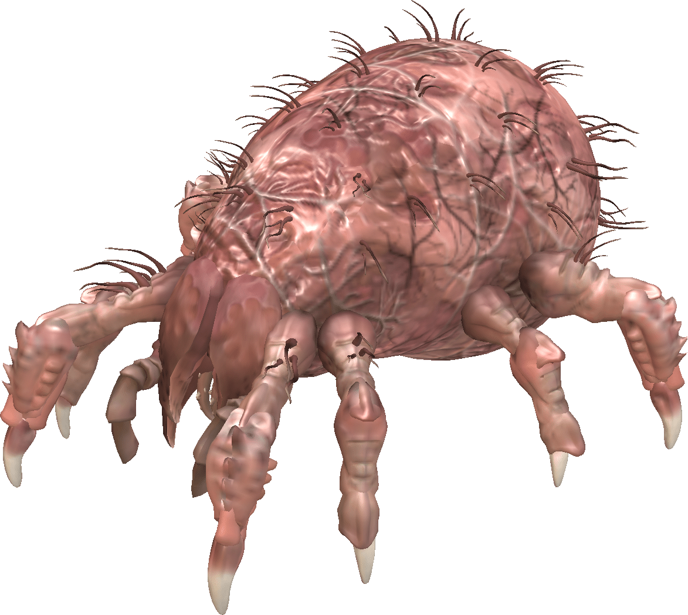
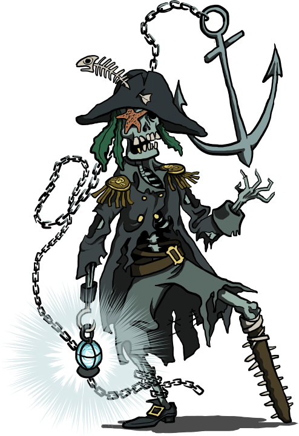

# Scénarios pour Run. Die. Repeat.
:::big picto
🏃 ☠️ ♻
:::
::: author
Lucas Cimon - [chezsoi.org](https://chezsoi.org)
:::

::: web-only
Version PDF: [RunDieRepeat-scenarios2-FR.pdf](RunDieRepeat-scenarios2-FR.pdf)
:::

Ces quelques scénarios sont conçus pour le jeu de rôle [_Run. Die. Repeat._](https://labrysgames.itch.io/run-die-repeat)
créé par **Labrys Games** ([traduction en français](https://chezsoi.org/s/RDRfrdirectPDFdownload)).

* [Parasite](#parasite)
* [Dernier wagon pour l’amour](#dernier-wagon-pour-l-amour)
* [Pirates, vaudou et île au trésor](#pirates-vaudou-et-le-au-tr-sor)

Un grand merci aux _playtesteurs_ : Aurélien, Elliot, Estelle, Henri, Kevin, Laëtitia, Maxime, ainsi que les joueurs & joueuses qui ont testé ces scénarios lors de la 2e [CyberConv](https://cyberconv.com) : Amaethys, Menida, MiniPen, romook, Beru, Failix, Komurin, Vii, Orion, Thomas B., Vicha, Vixenn.

Merci également à ces illustrateurs qui ont déposé leur magnifique travail sous licence _Creative Commons_ :

- [UBD Corpse Mite by Larvae801](https://www.deviantart.com/larvae801/art/UBD-Corpse-Mite-274636814) - [CC BY-NC 3.0](https://creativecommons.org/licenses/by-nc/3.0/fr/)
- [red poppy flower on gray train rail with gray stones at daytime](https://www.pikrepo.com/fqfhl/selective-focus-photo-of-red-poppy-flower-on-gray-train-rail-with-gray-stones-at-daytime) de pikrepo.com
- [Pirate Skeleton by Blondbraid](https://www.deviantart.com/blondbraid/art/Pirate-Skeleton-835035854) - [CC BY-NC 3.0](https://creativecommons.org/licenses/by-nc/3.0/)

Merci enfin aux développeurs des [logiciels libres](https://fr.wikipedia.org/wiki/Free/Libre_Open_Source_Software) employés : [le navigateur Firefox](https://www.mozilla.org/fr/firefox/), [le logiciel de dessin Gimp](https://www.gimp.org/), [l'éditeur de texte Notepad++](https://notepad-plus-plus.org/), [le lecteur de PDF Sumatra PDF](https://www.sumatrapdfreader.org), [le language de programmation Python](https://www.python.org/), les bibliothèques de code [markdown-it](https://github.com/markdown-it/markdown-it) & [Puppeteer](https://pptr.dev/).
Les fichiers sources ayant permis de générer ce PDF sont disponibles [sur GitHub](https://github.com/Lucas-C/jdr/tree/master/RunDieRepeat).

Ces scénarios sont publiés sous licence <a rel="license" href="http://creativecommons.org/licenses/by/4.0/">Creative Commons Attribution 4.0 International</a>.

---

:::: page

<!-- Alt: https://freesvg.org/spider-monster -->

## Parasite
> Vous êtes un parasite microscopique, une arme bactériologique créée dans un laboratoire top secret.
> Suite à une énième hybridation, vous venez d'acquérir une vive intelligence, la conscience de vous-même,
> et la capacité à remonter le temps !
> Vos enfants vont éclorent de votre ventre dans 30min, ce qui signifiera votre mort,
> mais vous êtes bien décidé à ce qu'ils naissent hors de cette prison !
::: fluid
### Objectif :
S'échapper du laboratoire.
:::
### Règles spéciales
En taille, le parasite fait moins d'un millimètre.
À son échelle, il se déplace très vite : environ 1cm / seconde.

Le parasite peut rentrer sous la peau d'un hôte, pour en prendre le contrôle.
Il peut également se dissocier, se dupliquer en de multiple individus,
mais les doubles ne restent sous le contrôle des joueuses qu'en cas de jet réussi.
### Environnement
- vous débutez dans une salle blanche. Elle contient divers appareils électroniques (ordinateurs, microscopes, séquenceur ADN...), un espace de stockage des spécimens (rats et chauve-souris), un incinérateur, de nombreux produits chimiques et une bouche d'aération au plafond.
- la seule sortie est un sas donnant sur une salle de pause / réunion avec kitchenette et tableau blanc. Son seul autre accès est un ascenseur. La pièce comporte une caméra de sécurité et un garde.
- en-dehors de ce dernier, le personnel est constitué de 3 scientifiques en combinaison totale. Aux yeux du parasite un jeune mâle brun, une femelle rousse et un vieux mâle blond.
- l'ascenceur dessert directement le hall principal, assez imposant dans un style greco-romain chargé de marbre et d'or, où trone un bureau d'accueil massif. La sortie à l'extérieur se fait par une simple porte vitrée coulissante, mais le bureau de la sécurité est juste à côté et héberge quatre gardes vifs et à la gachette de taser facile.
### Obstacles
- le scénario démarre au moment où le parasite vient d'être aspergé d'une substance, dans une boîte de pétri,
sous un microscope.
- survivre à la traversée du sas désinfectant requiert une combinaison totale. Un scanner rétinien permet d'y entrer.
- comportement des PNJs si danger (la MJ peut choisir) :
  + ⚀-⚁ détruire le parasite quitte à y laisser leur vie
  + ⚂-⚃ fuir pour sauver leur peau à tout prix
  + ⚄-⚅ _(scientifique)_ aider le parasite qu'ils identifient comme une nouvelle forme de vie consciente / _(garde)_ échapper du complexe avec un échantillon du parasite pour le revendre
### Conseils à la MJ
Encouragez vos joueuses à prendre possession d'un animal ou d'un humain :
c'est fun et c'est un bon moyen de se s'évader !

Lorsque le parasite atteint un hôte potentiel, ne demandez pas aux joueuses de jet pour en prendre le contrôle :
c'est automatique.
::::

---

:::: page

## Dernier wagon pour l'amour
> Étudiant, vous avez 22 ans, et cet été un petit boulot vous a ammené dans la campagne angevine.
> Vous logez dans une chambre sous les toits, dans un petit village le long de la Loire.
> Tous les soirs, physiquement fatigué mais joyeux, charmé par la campagne bucolique,
> vous rentrez à pieds à travers champs jusqu'à votre village.
> Et chaque soir, dans l'escalier, vous croisez invariablement votre voisine, et votre coeur s'emballe...
> Ses cheveux courts, sa démarche les regards que vous échangez... Il y a à chaque fois quelque chose d'électrique dans l'air !

> Vous avez échangé quelques mots, partagé un café sur le palier, et même êtes allez courir ensemble une fois... Mais vous n'avez pas encore franchi le pas de lui déclarer votre flamme.
> Ce soir pourtant, c'est décidé, votre coeur bat la chamade : vous allez l'inviter à diner !
> Mais alors que vous arrivez à votre logement, un bouquet de fleurs sauvages sous le bras, votre logeuse vous annonce que Marion vient de partir pour la gare, ses bagages à la main !

### Objectif
Rattraper Marion et lui déclarer votre flamme !

### Règles spéciales
Un résultat qui n'est pas 6 ne signifiera pas la mort, mais un _run_ qui s'interrompt car aucune histoire d'amour ne pourra naître : un train râté ou une approche des joueuses trop pataude, qui rebute Marion.

### Environnement
- votre logeuse est une très gentille septuagénaire. Ses soupçons sur le _crush_ que vous avez envers Marion se confirment en voyant le bouquet : se désolant de vous voir si dépité, elle vous proposera sa bicyclette !
- la gare est à environ 1km
- en étant agile, il est possible de monter dans le train en marche

### Obstacles
- un troupeau de vaches sur la route jusqu'à la gare
- deux policiers sont à la gare, et vous n'avez pas de masque
- le train est en train de partir !
- le contrôleur dans le train, qui est plein à craquer de vacanciers
- un blond sportif bien habillé est sur le point de l'aborder !

### Conseils à la MJ
Commencez la partie en demandant aux joueuses de choisir le prénom de leur personnage.
<!-- via Discord: /poll "Comment vous appelez-vous" "Tom" "Sylvain" "Felipe" "Chlöé" -->

Demandez des jets aux joueuses pour savoir s'ils ont pensé à prendre leur masque, ou de quoi payer leur billet,
si elles ne pensent pas à les prendre en partant de leur logement !

Face à Marion, laissez chaque joueuse décrire comme elle s'y prend et interprêter l'échange verbal,
puis demandez un jet de dé qui sanctionnera la réussite de l'approche !
Réussir à obtenir un diner de Marion est d'autant plus délicat qu'elle vient d'apprendre un décès familial,
raison de son départ précipité...
::::

---

:::: page

## Pirates, vaudou et île au trésor
> 🏴‍☠️ Capitaine pirate redouté, vous avez mis la main sur la carte au trésor de Robinson Crusoé,
> le mythique naufragé, sur l'île duquel un formidable trésor se cacherait !
> Malheureusement, votre équipage s'est mutiné et vous a fait subir le suplice de la planche 😡
> Votre amulette vaudoue vous a sauvé, et vous êtes de retour parmi les vivants jusqu'à la nouvelle pleine-lune 🌕
> Vous vous êtes associé avec un savant un peu fou et pilote de dirigeable pour devancer votre ancien équipage
> et mettre la main sur le magot en premier ! 💰
>
> Vous voici maintenant dans la grotte du trésor, au sommet du volcan de l'île.
> C'est le crépuscule, d'ici quelques minutes la pleine lune se lèvera et vous redeviendrez mortel.
> Vous venez d'enterrer votre amulette sur place afin qu'aucune malédiction vaudoue ne vienne vous hanter
> une fois que vous aurez quitté cet archipel...
> Alors que vous vous remplissez les poches de pierres précieuses,
> vous entendez vos anciens camarades pirates à l'entrée de la caverne !

    

### Objectif
Quitter l'île riche avant de redevenir mortel !

 

### Inspirations
Monkey Island & Pirates des Caraïbes

 

### Règles spéciales
Avant de lancer la partie et le compte à rebours,
demandez aux joueuses de baptiser leur capitaine pirate.

Durant la partie, chaque fois que les joueuses décrivent leur action en faisant rimer leur phrase,
elles obtiennent un bonus de **+1** au jet de dé.
Elles gagnent un bonus de **+1** supplémentaire si elles font rimer leurs vers
avec le nom du capitaine !

Le capitaine pirate est une sorte de mort vivant, mais il n'en gagne aucune immunité :
il reste sensible aux coups et blessures. Son enveloppe corporelle garde juste
des séquelles visibles de toutes ses morts précédentes...

À chaque fois que le capitaine décède, il remonte le temps jusqu'au moment où il a enterré l'amulette vaudoue.
Notez que si les joueuses décident de déplacer l'amulette ailleurs, cela déplacera cette « ancre temporelle »,
et le _run_ débutera à un autre endroit, un peu plus tard dans la trame chronologique !

 

### Environnement & obstacles

* **La grotte au trésor** : le trésor est gigantesque et les joueuses peuvent y dénicher à peu près tout ce qu'elles y cherchent.
La caverne ne possède qu'une seule autre sortie, qui donne sur un torrent :
si l'on n'y trouve pas la mort, des rapides conduisent à la jungle.

* **Les pirates** : l'ancien équipage du capitaine est cupide, méchant, et potentiellement intimidé par le retour de leur capitaine mort-vivant...
L'ancien second du capitaine, **Amos**, est devenu leur chef, héritant ainsi du vénérable « perroquet de commandement ».
Si les joueuses tentent de négocier avec eux ou de les intimider :

    + en cas d'**échec**, le _run_ ne s'interrompt pas mais donne lieu une bagarre générale ou une course-poursuite dans la jungle.
    + en cas de **réussite**, les pirates obtempèrent à la demande du capitaine, mais se mutineront à nouveau à la 1ère occasion...

* **La jungle et le trimaran** : il faut la traverser pour accéder aux autres lieux, mais des créatures l'habitent et feront obstacle : **un tigre affamé** ainsi qu'une **tribu de macaques**.
Ces singes, éduqués par Robinson, sont très fûtés, bagarreurs, et aimeraient bien piller le dirigeable ou le navire des pirates...
Au centre de leur village trône le totem qu'ils vénèrent : un magnifique **trimaran en bambou** réalisé par Crusoé avant qu'il ne soit rescapé par un bâteau de passage. Il suffirait d'un coup de pied dans une cale pour le faire chuter dans les rapides menant à la plage !

* **La cabane perchée et le dirigeable** : cette construction suspendue dans un arbre était la maison de Robinson.
Elle contient encore beaucoup de matériel, et en arrivant sur l'île en dirigeable vous l'y avez amaré.
Dans le dirigeable, **Ernest Von Schtafen** réclamera qu'on lui envoie le trésor avant de laisser monter le capitaine,
sans quoi il larguera les amares !

* **La plage et le navire pirate** : la barque sur le plage sera peut-être déjà occupée par des **crabes géants**.
Elle permet en tout cas d'accéder à _La Perle Noire_ et de mettre les voiles !

            

### Conseils à la MJ
La bande son du film _Pirate des Caraïbes_ est idéale pour donner du rythme à cette partie !

Lorsque le capitaine sort de la grotte, donnez un aperçu panoramique de l'île à vous joueuses :
le torrent, la jungle, la cabane perchée et le dirigeable amaré, le village des singes et son totem,
la plage et le navire pirate.

            
<!-- 1er playtest: Laetitia, Camille, Jerome -->
::::

::: footer
🏃 ☠️ ♻ v1.0
:::

