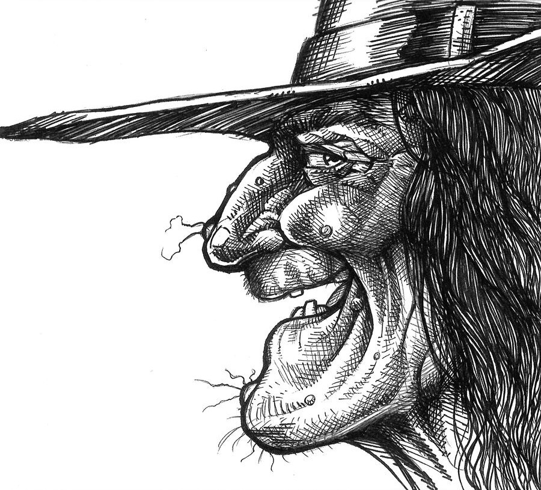
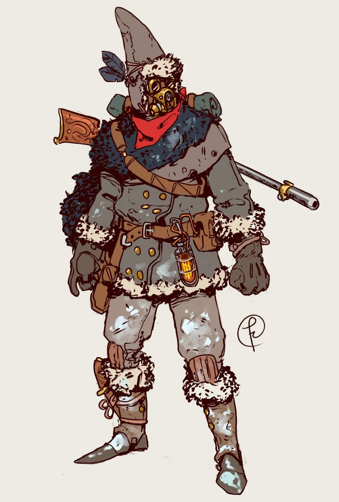
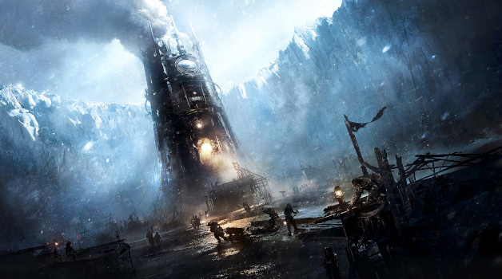
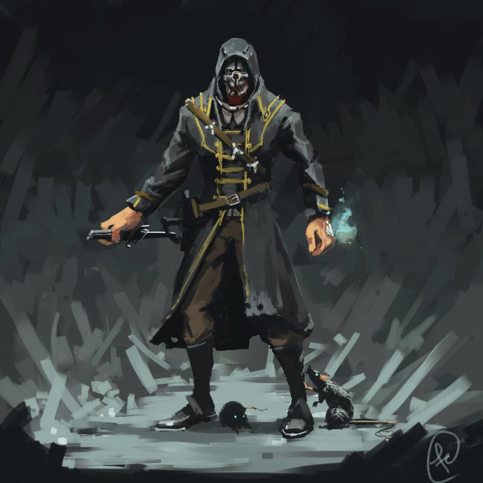
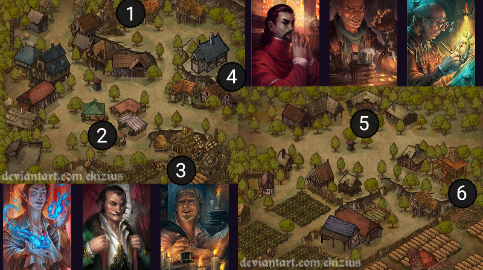
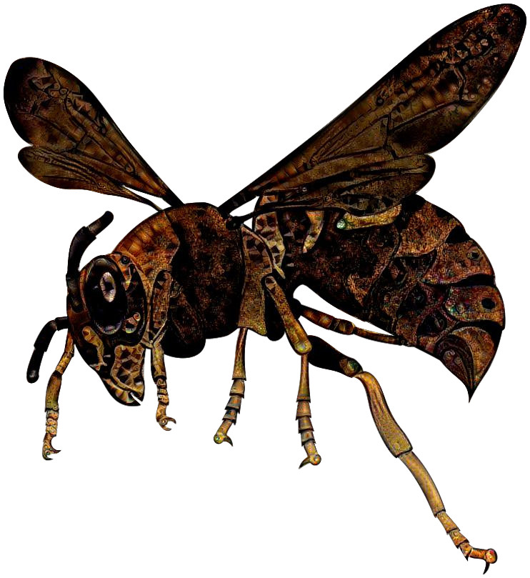
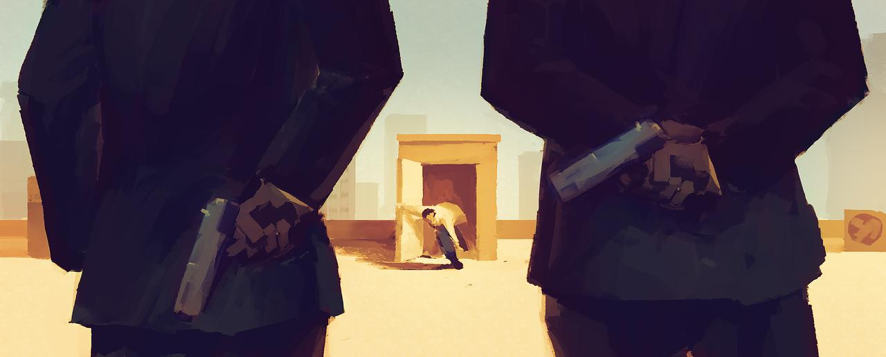
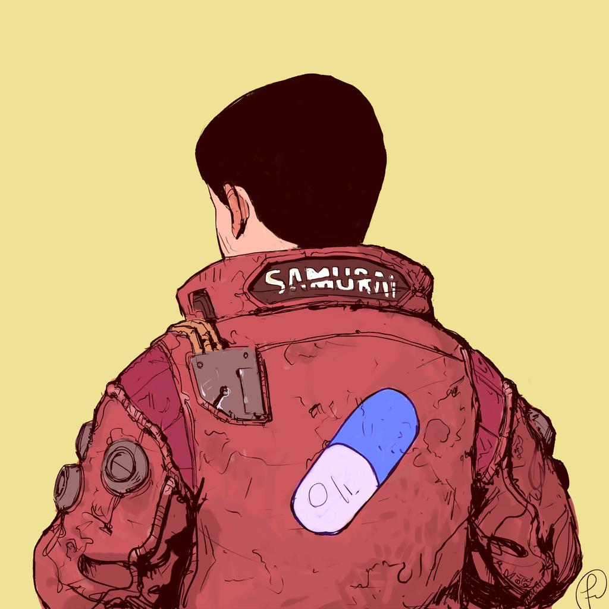
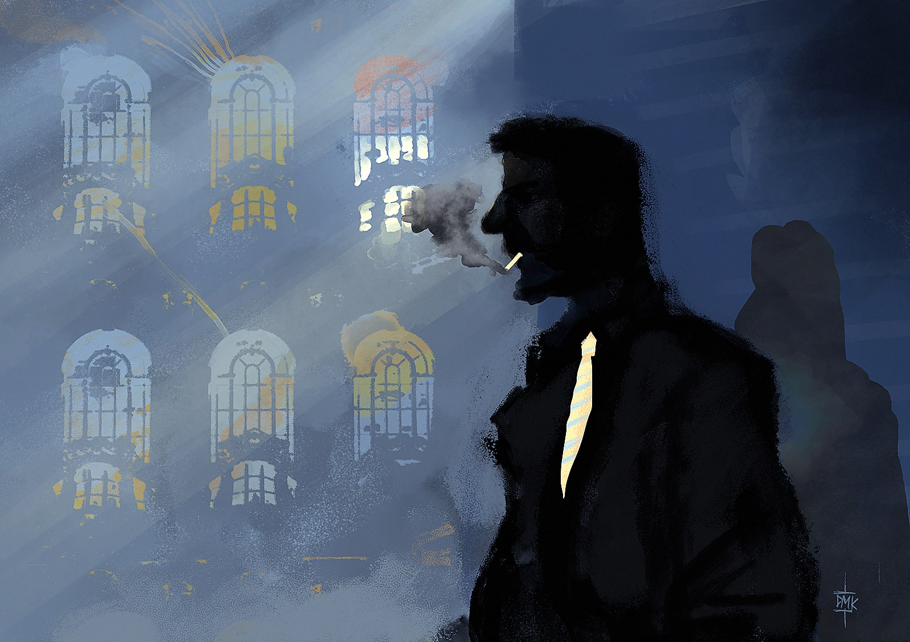

<!--
Ici & sur blog : favoriser lien itch.io pour téléchargements, car incluent des compteurs

ToDo:
+ proposer un "How to" : dérouler un scénario RDR sur le pouce, basé sur le contexte du moment
+ spell check

MGS5 intro : https://www.deviantart.com/sunnyclockwork/art/Trauma-517518224
Star Fetchers OST: https://www.youtube.com/playlist?list=PL-3oZ3AfF3_2TSyoAJ_OaewrZc8JcOBWM

Animation mp4: https://www.reddit.com/r/glitch_art/comments/gh045v/what_time_is_it/

Idées de mécaniques de jeu :

* énigme ne permettant qu'un seul essai, mais solvable en itérant toutes les possibilités :
3 leviers portionnables, ou code à rentrer + indice quelque part que le même chiffre se répète 4x

* règle spéciale _Next_ : au prix de **2min de moins** sur le compte à rebours,
le personnage peut **explorer toutes les alternatives temporelles** d'un problème à un moment donné de la partie,
comme un digicode, un labyrinthe, un unique combat avec plusieurs ennemis...
Il peut ainsi en déduire le code, le chemin pour en sortir, où la combinaison d’enchaînements de coup
pour en finir avec ses adversaires en mode _Matrix_ !
=> nécessite que l'appli web de chrono permette de "nudge-decrease" le temps restant

* Prenez un paquet de carte à jouer de 1 à 6,
et posez-les devant vous ordonnées avec la carte 6 sur le dessus.
La carte du dessus définit la valeur minimale à obtenir au dé pour réussir une action.
Chaque fois que les joueuses ratent un jet, enlevez une carte ;
chaque fois qu'elles réussissent, remettez-les toutes dans l'ordre.

* point faible particulier de chaque ennemi, et capacité bonus à transmettre à la joueuse,
qui en bénéficiera toujours aux prochaines boucles temporelles

* jouer 2 ou 3 points de vues de différents personnage lors d'un même événement

* progressive-reveal scenarios:
  + Ankhor Deeps: https://www.deviantart.com/djekspek/art/One-Page-Dungeon-Contest-2012-302655474
  + https://www.deviantart.com/domigorgon/art/Town-Map-129613666 -> need to reveal legend & zone at the same time
  + https://www.deviantart.com/dipi11/art/Campsite-Background-418340950
  + https://www.deviantart.com/dipi11/art/Haunted-Background-362269955
  + https://www.deviantart.com/encho/art/China-Cartoon-Background-46804689
  + https://www.deviantart.com/bobsicle0/art/2000-Pageview-Special-Rainbow-Falls-468302903
  + characters:
    - https://www.deviantart.com/hijodelopio/gallery
    - SirCollection CC_characters

* un +3 / joueuse / session, à son jet ou à celui d'une autre joueuse

* lancer un dé de plus et prendre le meilleur / pire dé

* obtenir un certain score cumulé (ex: 6) avec les résultats de différentes tentatives (idée issue de RunDieLearnRepeat)

* TLMEJ : seuil du jet = #joueuses + 6
MAIS toutes les joueuses indiquent simultanément avec leur pouce
si elles contribuent à l'action ou se reposent : +1 au jet le cas échéant,
sinon obtiennent un jeton qui octroie +2 à leur jet

* PDF dynamique avec éléments variants à chaque fois

Idée d'HENRI: on joue un sorcier qui rate une invocation de démon, et on doit rattraper le coup sans qu'il ne nous tue.

Autres idées :

* TRILOGIE suite au "Dernier wagon pour l'amour":
  + bébé qui s'évade de son berceau
  + votre fils est mordu par XXX lors d'une rando : il faut le sauver !
* Donjon:
  - pièges : marteau-balancier géant, escalier-glissière, dards empoisonnés, flammes
  - monstres : gobelins, squelettes, basilic...
* Malediction -> condamne au purgatoire sur toutes les générations -> on incarne à chaque fois un descendant
* éviter la mort de quelqu'un d'autre qui est menacé: bodyguard? sauver le futur Einstein écolo?
* The Lost Room / manga Dédale
* Médecin urgentiste ( Sovok ? )
* Pompier
* Jour de la Marmotte ?
* Matrix
* Jeu vidéo de plateformes :
  + écran de départ central
  + en haut : porte avec clef donnant accès au boss
  + à gauche : pièges / puzzle donnant accès à un power-up
  + à droite : ennemi avec capacité spéciale qu'on récupère une fois qu'il est vaincu
  + en bas : longue chute où il faut éviter différents dangers, au pied de laquelle se trouve la clef
  + power-ups, clefs & capacités sont conservées en cas de décès
* Doom - éléments emblématiques
  * DOOMGUY (aka DOOM SLAYER), un marine qui, après insubordination auprès d'un officier, est envoyé dans l'UAC (Union Aerospace Corporation) sur Mars
  * les scientifiques ont ouvert un portail interdimensionnel qui relit Phobos à... L'enfer
  * BFG
  * https://www.deviantart.com/truemakar/art/Doomguy-redesign-concept-807741554
  * https://www.deviantart.com/truemakar/art/DOOM-Cyberdemon-fan-art-805010267
* Film Boss Level : https://www.youtube.com/watch?v=q7GUYEZ3cSQ

# 1 MJ de Trop
https://www.youtube.com/watch?v=LxL5moI1Tto
13:20 "Il faut essayer de conserver l'action telle qu'elle a été décrite par le joueur précédent"
-> bonne idée de suggérer une musique d'ambiance !

# 1 MJ de Trop - 2e session
https://www.youtube.com/watch?v=cQ8SXE0CNBA
...à écouter

# Recap de début de partie
- tour de table de présentation
- déroulement de la session : intro puis scénarios, timing approx / moments de pause, scénarios prévus...
- origine du jeu & règles : https://labrysgames.itch.io/run-die-repeat
  Traduction Fr disponible ici : https://chezsoi.org/lucas/blog/pages/jeux-de-role.html
  Prévu pour l'impro, mais j'ai été inspiré pour préparer des mini scénarios.
  Éléments clefs:
  * un seul personnage, chacun son tour et boucle temporelle
  * temps limité -> réussite / échec coopératif
  * résolution des actions (6 au d6 -> échec, mais pas forcément mort) et cohérence temporelle des résultats
  * ⚠️ attention à mémoriser & redonner toutes les actions successives dans l'ordre
  * règle optionnelle de la prise de notes
  > Le jeu fonctionne comme un jeu vidéo "die & retry", mais au lieu de faire preuve de dextérité,
  > il va vous falloir faire preuve de beaucoup d'imagination, pour tenter à chaque fois une nouvelle approche !
  PASSER SON TOUR est possible si vous manquez d'inspiration, mais dans le doute, tentez quelque chose !
- fonctionnement à distance : rpg-dice / DiceParser (!1d6) & webcountdown
  Établir ordre de jeu
- (optionnel) règle spéciale pour ce scénario
- tout le monde a bien compris ? Des questions ?
- début du scénario :
  * texte d'intro
  * illustration
  * ./webcountdown.py 30
-->

# Scénarios pour Run. Die. Repeat.
:::big picto
🏃 ☠️ ♻
:::
::: author
Lucas Cimon - [chezsoi.org](https://chezsoi.org)
:::

::: web-only
Version PDF: ...
:::

Ce document rassemble une dizaine de scénarios conçus pour le jeu de rôle [_Run. Die. Repeat._](https://labrysgames.itch.io/run-die-repeat)
créé par **Labrys Games** ([traduction en français](https://chezsoi.org/s/RDRfrdirectPDFdownload)).

* [Le camembert de la sorcière](#le-camembert-de-la-sorci-re)
* [Frostpunk](#frostpunk)
* [Dishonored](#dishonored)
* [Enquête sous pression à ValTordu](#enqu-te-sous-pression-valtordu)

Un grand merci aux _playtesteurs_ : Aurélien, Elliot, Estelle, Henri, Kevin, Laëtitia, Maxime, ainsi que les joueurs & joueuses qui ont testé ces scénarios lors de la 2e [CyberConv](https://cyberconv.com) : Amaethys, Menida, MiniPen, romook, Beru, Failix, Komurin, Vii, Orion, Thomas B., Vicha, Vixenn.

Merci également à ces illustrateurs qui ont déposé leur magnifique travail sous licence _Creative Commons_ :

- [Halloween Witch face profile by scottepentzer](https://www.deviantart.com/scottepentzer/art/Halloween-Witch-face-profile-331368521) - [CC BY 3.0](https://creativecommons.org/licenses/by/3.0/fr/)
- [Corvo by Fernand0FC](https://www.deviantart.com/fernand0fc/art/Corvo-658049106) - [CC BY-NC 3.0](https://creativecommons.org/licenses/by-nc/3.0/fr/)
- [Kaneda by Fernand0FC](https://www.deviantart.com/fernand0fc/art/Kaneda-777208845) - [CC BY-NC 3.0](https://creativecommons.org/licenses/by-nc/3.0/fr/)
- [«Estación de tren» by Dumaker](https://www.deviantart.com/dumaker/art/Train-station-560845389) - [CC BY-NC-SA 3.0](https://creativecommons.org/licenses/by-nc-sa/3.0/fr/)
- [Roof (end) by Hunternif](https://www.deviantart.com/hunternif/art/Roof-end-714829029) - [CC BY-NC-SA 3.0](https://creativecommons.org/licenses/by-nc-sa/3.0/fr/)
- [Comic El Santo Lucha Libre](https://www.pexels.com/photo/comic-el-santo-lucha-libre-614364/) de pexels.com
- [Perso riding on vehicule](https://www.pexels.com/photo/person-riding-on-vehicle-2190511/) de pexels.com
- [Light Inside Library](https://www.pexels.com/photo/blur-book-stack-books-bookshelves-590493/) de pexels.com
- [Fancy Finn](https://www.deviantart.com/sircollection/art/Fancy-Finn-253306996), [Flame Princess Old Dress](https://www.deviantart.com/sircollection/art/Flame-Princess-Old-Dress-318053951) & [Finn Chaotic Evil](https://www.deviantart.com/sircollection/art/Finn-Chaotic-Evil-299829001) by SIRCollection - [CC BY-NC-SA 3.0](https://creativecommons.org/licenses/by-nc-sa/3.0/fr/)
- mechanical wasp made by [DeepDreaming](https://deepdreamgenerator.com) a [wasp clipart](https://creazilla.com/nodes/8595-wasp-clipart) with [a steampunk background](https://pixabay.com/fr/illustrations/%C3%A0-la-vapeur-punk-steampunk-3160715/)
- [Map - Small Town](https://www.deviantart.com/ekizius/art/Map-Small-Town-795100291) & [Map - Village](https://www.deviantart.com/ekizius/art/Map-Village-795100444) by Ekizius - [CC BY-NC-SA 3.0](https://creativecommons.org/licenses/by-nc-sa/3.0/)
- [Fantasy portraits by TinySecretDoor](https://www.deviantart.com/tinysecretdoor/gallery/52921157/fantasy-portraits) - [CC BY-NC 3.0](https://creativecommons.org/licenses/by-nc/3.0/)
<!--
- [Explorer by Fernand0FC](https://www.deviantart.com/fernand0fc/art/Explorer-837696753) - [CC BY-NC 3.0](https://creativecommons.org/licenses/by-nc/3.0/fr/)
-->

Merci enfin aux développeurs des [logiciels libres](https://fr.wikipedia.org/wiki/Free/Libre_Open_Source_Software) employés : [le navigateur Firefox](https://www.mozilla.org/fr/firefox/), [le logiciel de dessin Gimp](https://www.gimp.org/), [l'éditeur de texte Notepad++](https://notepad-plus-plus.org/), [le lecteur de PDF Sumatra PDF](https://www.sumatrapdfreader.org), [le language de programmation Python](https://www.python.org/), les bibliothèques de code [markdown-it](https://github.com/markdown-it/markdown-it) & [Puppeteer](https://pptr.dev/).
Les fichiers sources ayant permis de générer ce PDF sont disponibles [sur GitHub](https://github.com/Lucas-C/jdr/tree/master/RunDieRepeat).

<a class="license" rel="license" href="http://creativecommons.org/licenses/by/4.0/"></a>

Ces scénarios sont publiés sous licence <a rel="license" href="http://creativecommons.org/licenses/by/4.0/">Creative Commons Attribution 4.0 International</a>.

---

::: page




<!-- Alt: https://www.needpix.com/photo/656525/owls-night-witch-broom-witchs-hat-moon-childrens-stories-fairy-tale-dark -->
<!-- Alt: https://freesvg.org/fantasy-witch -->

## Le camembert de la sorcière
> Vous êtes un petit renard habitant la forêt.
> Cachée au cœur de cette forêt, vit une sorcière.
> Elle est plutôt gentille avec les animaux... tant qu'on ne la met pas en colère !
> Ce matin, vous l'avez vu sortir de sa cave de magnifiques camemberts...
> Et puis elle est partie faire ses courses au marché.
> Le camembert, c'est votre plat préféré !
> Alors c'est décidé, vous allez lui en chaparder un...
> Mais attention aux champignons magiques qui poussent dans sa chaumière !
### Objectif
Chaparder un camembert et s'enfuir avant que la sorcière ne revienne.
### Règles spéciales
Les enfants lancent deux dés à 6 faces pour chaque jet, les adultes un seul.
### Environnement
- les camemberts sont posés sur la table de la cuisine,
qui comporte plusieurs étagères et un plan de travail.
- la fenêtre de la cuisine est fermée, mais les fenêtres de pièces donnant sur la cuisine sont ouvertes :
  + la chambre de la sorcière, où il y a des coussins, un bureau, et le corbeau de la sorcière, qui dort
  + le salon, où il y a une petite table, des fauteuils, et des plantes carnivores en pot
### Obstacles
- tout le sol de la maison de la sorcière est recouvert de champignons magiques,
qui, si on les touche, font disparaîte puis réapparaitre au-dehors !
- une fois un camembert en possession du renard, le corbeau de la sorcière se réveille !
Il pourchasse le renard en croassant, et risque de donner l'alerte !
### Conseils à la MJ
J'ai testé ce scénario avec un enfant de 4 ans et ses parents :
- 20min de temps me semble un grand maximum pour parvenir à conserver l'attention d'un enfant durant toute la partie.
- décrivez bien les lieux avant de lancer le compte à rebours.
- employez un compte à rebours à aiguilles, pour que les enfants puisse facilement visualiser le temps restant, comme celui-ci :
https://www.visnos.com/demos/classroom-timer
- il peut être difficile pour les enfants de comprendre que toutes les joueuses jouent le même personnage.
N'hésitez donc pas à vous rabattre sur un modèle 1 joueuse = 1 personnage, avec une famille de renards.
On se rapproche alors du système de [Donjons & Chenapans](https://gusandco.net/2020/03/18/donjons-chenapans-jeu-enfants/)
### Rejouer le scénario
Ajoutez un chien qui dort dans sa niche, et qu'il ne faut pas réveiller, mais donnez un dé de plus aux enfants.
:::

---
:::: page frostpunk


<!---->
<!---->

_<small>Image de couverture du jeu vidéo Frostpunk par Jakub Kowalczyk</small>_
## Frostpunk
> Fin du XIX<sup>e</sup> siècle. Une éruption cataclysmique a déclenché un hiver permanent.
> Vous avez pris la tête d'un groupe de survivants et êtes parti au nord,
> vers une terre promise. À bout de forces, vous avez atteint un étrange monolithe mécanique,
> une chaudière géante. Vos ingénieurs comprennent cette technologie steampunk
> juste assez pour le rallumer, ravivant un espoir.
> Mais le plus dur reste à venir pour votre colonie d'une trentaine d'âmes...
::: fluid
### Objectif :
Survivre jusqu'à établir une colonie pérenne.
### Inspirations :
Le jeu vidéo éponyme
:::
### Règles spéciales
Les joueuses incarnent le capitaine de la colonie,
et prennent des décisions à cette échelle,
mettant en mouvement des dizaines de personnes.

Due à l'inertie de groupe, chaque joueuse ne peut commander qu'**une tâche majeure par demi-journée**.
Chacune donne lieu à un jet de dé.
Au terme de chaque journée, la nuit tombe, glaciale,
et l'aube révèle une nouvelle difficulté...

Si la MJ estime qu'une action des joueuses ravive l'espoir de la colonie, elle peut octroyer un bonus de **+1** au jet suivant.
### Environnement
Des montagnes ensevelies sous la neige, à perte de vue,
et un vent glacial, plusieurs degrés sous le zéro Celsius.
Un filon de charbon peut être découvert à proximité,
ainsi que des automates steampunks en sale état,
qui devaient servir à entretenir la chaudière.
_[Galerie d'illustrations issues du jeu vidéo](https://kotaku.com/frostpunk-a-miserable-game-that-looks-beautiful-1826847282)_.
Votre colonie est constituée d'individus robustes, mais à bouts de forces.
Les survivants incluent deux ingénieurs, des trappeurs,
une femme médecin, un prêtre, un botaniste, une institutrice, et quelques enfants.
### Difficultés
* **JOUR 1:** la nuit, la température chute drastiquement : vos citoyens ont besoin d'abris
* **JOUR 2:** vos citoyens meurent de faim par manque de nourriture, et le stock de charbon baisse dangereusement
* **JOUR 3:** le générateur tombe en panne, et des vols de nourriture ont lieu dans les réserves
* **JOUR 4:** une épidémie de peste se déclare, et une avalanche a isolé des dizaines de personnes dans la mine de charbon qui a été découverte
* **JOUR 5:** des citoyens appelent à la rébellion et veulent repartir d'où vous venez
* (**JOUR 6:** ils attaquent ! Des morts vivants, ou pire ?)
### Autres événements
* un autre groupe de survivants à été aperçu dans les montagnes.
Faut-il leur porter secours et les acceuillir, alors qu'une tempête approche ?
* découverte d'un chemin de fer. Un train y circule sans s'arrêter.
* une stèle est exhumée comportant une inscription runique.
Si du temps est consacrée à la décrypter, elle révelera l'emplacement de Nidhiver,
une ville prévue pour résister à l'hiver permanent.
Elle est à seulement un jour de marche, mais cette terre promise se révelera un faux espoir,
car la colonie la découvrira en ruines !
::::

---

::: page



## Dishonored
> Dunwall. Une ville victorienne steampunk frappée par une terrible épidémie de Peste du Rat. Vous êtes Corvo Attano, le protecteur personnel de l'impératrice Jessamine Kaldwin.
> Alors que vous accompagnez celle-ci, soucieuse de la situation, et sa fille Emily lors d'une balade dans les jardins du palais, vous êtes attaqués par un groupe d'assassins !
> L'impératrice est tuée, sa fille enlevée. Vous avez **assisté** de vos yeux à la scène... mais vous avez conclu un pacte avec un mystérieux sorcier, et vous voici de retour à cet instant, avec cette fois d'étranges pouvoirs, et l'intention de changer l'histoire !
### Objectif
Amener l'impératrice et sa fille en sécurité au palais.
### Règles spéciales
La joueuse choisit deux capacités au début de chaque _run_ :
- **Clignement** : déplacement instantanné sur une distance de quelques mètres.
Une seule personne peut vous accompagner.
- **Nuée dévorante** : invoquez une meute de rats
- **Possession** : prennez possession de quelqu'un
- **Pli temporel** : relentissez le temps quelques secondes
- **Coup de vent** : déclenchez une violente bourrasque ou faites léviter des choses
- **Ombre errante** : vous vous fondez dans les ombres

Chaque pouvoir procure un bonus de **+2** si exploité,
et ne peut pas être employé pour 2 actions de suite.
### Environnement
- vous commencez dans un kiosque en marbre de 10m de large, à la pointe d'une falaise surplombant la baie de la ville
- 2 chemins permettent de rejoindre la terrasse du palais : un long labyrinthe végétal, ou plus court, un escalier abrupt dans la roche, prolongé par une corniche
### Obstacles
- de manière générale, les assassins tenteront de tuer l'impératrice, d'enlever Emily, et d'éloigner ou neutraliser Corvo.
- dès le début 5 assassins sortent des fourrés et vous assaillent.
Armés de sabres, 2 attaquent Corvo, 2 se chargent de l'impératrice et sa fille, et le dernier reste en retrait pour vous canarder avec une arquebuse (si on lui court dessus, il n'a le temps de tirer que 2 fois).
Corvo ne peut pas simultanément empêcher le meutre de l'impératrice et l'enlèvement d'Emily.
Une fois la première protégée, il peut partir à la poursuite du ravisseur de la seconde.
- le ravisseur d'Emily l'entraine jusqu'à un bateau accosté au pied de la falaise, que l'on atteint en descendant une corde
- le long de la falaise, vers le palais, 3 brutes barrent l'étroit chemin, couverts de pustules de la Peste.
Ils sont armés d'un gourdin, d'une hache et d'une lance.
- dans le labyrinthe, 2 autres assassins tenteront de prendre par surprise leurs proies à travers les buis composant le labyrinthe.
Ceux-ci sont armés de dagues et possèdent les pouvoirs _Clignement_ & _Ombre errante_.
- le lord régent Hiram Burrows est à l'origine du complot.
Il tentera en dernier recours, en voyant l'impératrice arriver au palais, de saisir un gant de contrôle électrostique pour lancer un garde mécanique à l'assaut.
### Conseils à la MJ
- interrompez le _run_ dès que l'impératrice ou sa fille meurent
- un sabre à la main, l'impératrice peut se défendre seule quelque temps.
Elle cherchera d'abord à protéger sa fille, puis à rejoindre le palais.
Elle fait confiance au lord régent.
- bien qu'agile et futée, Emily Kaldwin se fait rapidement assomer.
Elle se méfie du lord régent, et si elle est consciente à la fin, destabilisera le garde mécanique en lui lançant un seau d'eau.
- le but de la règle de la capacité au choix est de tenter les joueuses d'essayer plein de pouvoirs différents, avec comme conséquence de ne pas pouvoir réutiliser les actions réussies par les autres, et donc de rendre la progression difficile !
:::

---

::: page



<div class="center"><em>Scénario pour partie en ligne</em></div>

## Enquête sous pression à ValTordu
> Aventurier un peu roublard, votre réputation de bandit au grand cœur n'est plus à faire.
> Vous êtes un peu le Arsène Lupin itinérant des Royaumes Magiques.
> Alors que vos pas vous mènent à un petit village, ValTordu, une guêpe mécanique vous attaque !
> Vous avez tout juste le temps d'activer votre pendentif enchanté avant que ce minuscule automate volant ne vous transperse mortellement.
> Heureusement le sortilège fonctionne : pendant 45min, une boucle temporelle vous protège de la mort.
> Durant ce laps de temps, il va vous falloir trouver qui dans ce village a commandité votre meutre,
> tout en fuyant cet insecte assassin indesctructible qui vous talonne !
### Objectif
Trouver un moyen de rompre l'enchantement de cette guêpe mécanique assassine,
en découvrant qui l'a lancé contre vous !
### Règles spéciales
Employez [cette application web](https://chezsoi.org/lucas/jdr/shared-img-reveal/) afin de progressivement révéler les lieux à vos joueuses : communiquez leur l'URL publique qui s'affiche en bas une fois la table de jeu créée, puis révélez leurs les zones hachurées en cliquant sur chacune au fil de la partie.
### La guêpe mécanique


Mi-automate, mi magique, cette crétaure n'a qu'un seul but : vous tuer.
Elle est hyper-résistante, et son dard est capable, à l'usure, de transpercer n'importe quelle matière.
De plus, elle est immunisée à la magie et aussi rapide qu'un homme en pleine course.
Lorsqu'un ~~⚅~~ est obtenu pour s'en débarasser, le guêpe peut être temporairement bloquée quelque part.
Cela laissera aux joueuses le temps d'accomplir 2 actions, mais elle reviendra toujours,
tel un Terminator miniature.
### Le mobile
C'est Erneste qui a lancé la guêpe tueuse contre notre héro.
Erneste a appris son arrivée hier soir à la taverne grâce à Marko,
puis a volé à Sirius la boîte renfermant l'insecte assassin.

**Pourquoi ?** Il est jaloux de sa notoriété, dont tout le monde croit qu'il s'est inspiré pour ses romans,
et c'est aussi le frère d'un armateur que le héro a plumé et ruiné il y a quelques mois.
### Les personnages
1. **Faraday le magicien, dans son temple** (petite tour au nord-ouest)
est en train de méditer, son esprit plongé dans un autre plan astral.
Il n'appréciera pas être dérangé, et en l'absence d'une justification rapide qui lui plaise,
il enverra valdinguer d'une bourrasque magique protagoniste & guêpe à travers la place jusqu'à l'église !
Le choc sonnera la guêpe quelques dizaines de secondes, et attirera l'attention de Sirius.

La spécialité de Faraday est la maîtrise des 4 éléments : air, eau, terre, feu.
Il est très orgueilleux et sera sensible à la flatterie.
Une fois amadoué, il sera curieux environ 30s d'examiner la guêpe :
il identifiera rapidement qu'il s'agit d'une création de Jacques, _« de la belle ouvrage ! »_
puis annoncera à notre héro que le seul moyen de l'arrêter est de retrouver le coffret d'où elle est sortie,
avant de s'en désintéresser complètement.
Il méprise quelque peu les autres villageois, en dehors d'Erneste et de Jacques, qu'il tient en bonne estime.
Contre une généreuse compensation (du jus de Sapho ?), il est capable de relancer la bulle temporelle du médaillon pour 15min : attention à déclencher cet effet au bon moment !

2. **Douglas le maire, au marché**, est un ancien aventurier, tour à tour mercenaire, marin, diplomate...
Après avoir fait fortune de manière obscure, il s'est « rangé », devenant notable de cette petite bourgade.
Beau parleur et chaleureux en apparence, il souhaitera aider notre héro, qu'il connait de réputation
et qu'il alpaguera à son passage place du marché, mais ne cherche en réalité qu'à l'éloigner au plus vite de ValTordu :
officiellement à cause de cette guêpe qui effraie tout le village, mais aussi pour le tenir loin de son trafic...
Il l'orientra donc assez vite vers Jacques, ou tout autre habitant dont l'aide semble pertinente.
Sa demeure, composée de trois bâtiments, se trouve à l'ouest, avec juste au sud un enclôt pour ses chevaux.
Le bureau de Douglas contient des preuves du trafic et de ses liens avec la pègre, ainsi qu'un paquet de fric.

3. **Erneste le poète, au moulin**, est un auteur à succès et un grand séducteur.
Il est terrorisé par la guêpe, dont il **sait** qu'elle rôde même si le protagoniste vient seul.
Il aura une attitude étrange, manifestant tantôt une certaine antipathie envers le héro,
tantôt curieux d'en apprendre plus sur lui...
En entrant dans le moulin, le protagoniste reconnaitra certains livres dont son habitant est l'auteur :
le héro a entendu dire qu'Erneste s'était inspiré de sa réputation pour en écrire certains !
En fouillant un peu plus, il reconnaîtra aussi sur un tableau de famille le visage du frère d'Erneste,
une de ses anciennes victimes.
Enfin, un jet de fouille réussi permettra de découvrir le coffret-foureau de la guêpe,
cachée dans sa cheminée.

4. **Sirius l'évêque, à l'église** (bâtiment bleu au nord) est homme beau, strict et ténébreux.
Il exprimera une bienveillance froide envers le héro, cherchant sans entrain à l'aider.

C'est lui qui a commandé la guêpe à Jacques, comme mesure de protection envers Douglas, dont il se méfie.
Il ne sait pas qu'Erneste lui a volé, mais se doutera de quelque chose dès qu'il la verra en vol.
Il sait que le frère d'Erneste s'est fait plumer par le héro, et n'hésitera pas à le mentionner.

Une fouille sacristie permettra de trouver un reçu de commande de la guêpe à Jacques.
Confronté au sujet de cette commande, il révelera qu'on lui a volé la guêpe cette nuit même,
et n'appréciera pas que des soupçons pèsent sur lui, à ce sujet ou à propos du trafic de Sapho :
dans les deux cas, il deviendra menaçant, et si l'intimidation ne suffit pas,
il ira jusqu'à soulever tout le village contre le héro, en l'accusant d'être possédé !

5. **Marko le mercenaire, à la terrasse de la taverne** (au nord de la place du puit),
apostrophera le héro par son nom dès qu'il le verra arriver sur la place du puits.
Bien que déjà un peu saoul, il n'a pas oublié pourquoi il est ici :
il vous attend de pied ferme depuis 2 jours, se doutant que vous passeriez par ValTordu.
Il vous en veut, s'estimant floué sur sa part du butin lors d'un _« coup »_ où vous aviez fait équipe,
et réclamera compensation sous peine d'en venir aux mains !
Il n'a rien à voir avec la guêpe tueuse, mais c'est lui qui a donné l'information à Erneste que vous étiez en chemin pour ValTordu.

6. **Jacques l'horloger, à la forge-atelier** (à l'est) est un brillant ingénieur et alchimiste.
C'est lui qui a conçu la guêpe tueuse, ainsi que bon nombre d'autres automates enchantés,
qui l'assistent dans son atelier ou labourent les champs près de chez lui.
En bon professionnel, il ne souhaitera pas révéler son commanditaire,
mais si le protagoniste fait preuve de persuasion, il révelera qu'il s'agit de Sirius.
La présence de la guêpe ne le dérange pas, mais il n'admettra pas de désordre dans son atelier.
Il indiquera au héro que le seul moyen d'arrêter la guêpe est de retrouver son fourreau.
### Environnement
La partie commence dans le coin nord-ouest de la carte.

Le village est très vivant, des gamins et des poules courrent dans tous les sens,
les marchands hélent les passents joyeusement, des agriculteurs labourent en sifflotant...
### Trafic de jus de Sapho
Douglas a mis en place une exploitation de Sapho, une racine dont le jus est une drogue décuplant les facultés mentales,
qui se vend à prix d'or au marché noir.
Les champs sont au sud-est de la carte et son labourés par des automates de Jacques.
Le protagoniste reconnaîtra immédiatement la plante si les cultures sont examinées.

Sirius est également très impliqué dans ce trafic :
il sert de couverture, prétendant que le Sapho est exploité pour les besoins de l'Église de l'Autorité,
et rassurant ses ouailles de la paroisse au moindre soupçon.

Les racines sont broyées dans la ferme juste à côté. Tout se déroule sous la surveillance d'un seul homme,
un solide gaillard muet servant fidèlement Douglas.
Fouiner dans la ferme signifie attirer l'attention de ce « fermier » aggressif,
mais peut permettre de trouver des éléments impliquant Douglas & Sirus dans le trafic :
missives signées de Douglas attestant réception du « paiement » ou de « la marchandise »,
fausse attestation de l'Église de l'Autorité, noms de traffiquants de Sapho connus du héro...

Jacques est au courant du trafic, vendant les services de ses automates de labour à Douglas,
mais il nierra savoir quoi que ce soit.
Faraday, lui, a vendu son silence contre une dose régulière de jus de Sapho, dont on peut trouver des bouteilles au temple.
### À la fin
Si les joueuses confrontent Erneste avec leurs soupçons, il craquera et avouera son rôle.
Le coffret-foureau de la guêpe peut aussi être découvert chez lui en fouillant :
en activant la petite boîte à musique qu'il contient, la guêpe viendra s'y lover paisiblement.
C'est alors une **victoire**. La joueuse qui avait la parole raconte un épilogue en quelques phrases,
qui peut ensuite être complété par les autres joueuses.

Sinon, à la fin des 45min, la bulle temporelle s'interrompt, et le héro joue sa dernière vie.
Cette fois, s'il meurt, c'est le **GAME OVER**.
### Conseils à la MJ
Commencez la partie en demandant aux joueuses de voter pour le nom de leur personnage.
Sur Discord, vous pouvez employer cette commande :
```
/poll "Comment vous appelle-t-on ?" "Damian 'Sweetongue' Hades" "Lindsey Darrow dit 'Monte en l'air'" "Aonghus. Just Aonghus"
```
Lorsque les joueuses croisent l'un des 6 PNJs, révélez son portrait.
Lorsqu'elles découvrent l'un de leurs noms, révélez-le même si elles ne l'ont pas encore rencontré.
Évitez d'introduire d'autres personnages que les 6 PNJs présentés.
:::

---

::: page



## Bad Motherfucker
>
### Objectif
Pitch (merci Henri) : tu es infiltré chez des trafiquants et ta couverture vient de tomber
### Inspirations
Matrix, le clip du morceau [Bad Motherfucker des Biting Elbows](https://www.youtube.com/watch?v=Rgox84KE7iY)
### Règles spéciales
Ressources limitées (revolver avec 1 seule balle + 1 charge pour _dasher_)
avec lesquelles les premiers obstacles peuvent être plus facilement franchis (bonus de **+2**),
mais sans lesquelles une seconde série de dangers est extrêmement difficile à traverser.
### Environnement

### Obstacles

### Conseils à la MJ

### Rejouer le scénario

:::

---

::: page


## Lucha-Libre
>
### Objectif

### Inspirations
Guacamelee ?
### Règles spéciales

### Environnement

### Obstacles

### Conseils à la MJ

### Rejouer le scénario

:::

---

::: page



## Akira
>
### Objectif

### Inspirations

### Règles spéciales

### Environnement

### Obstacles

### Conseils à la MJ

### Rejouer le scénario

:::

---

::: page



## Dirty cop
>
### Objectif

### Inspirations

### Règles spéciales

### Environnement

### Obstacles

### Conseils à la MJ

### Rejouer le scénario

:::

---

::: page


## À grande vitesse
> Monstres dans un train
### Objectif

### Inspirations

### Règles spéciales

### Environnement

### Obstacles

### Conseils à la MJ

### Rejouer le scénario

:::

---

::: page


## Library
> 
### Objectif

### Inspirations

### Règles spéciales

### Environnement

### Obstacles

### Conseils à la MJ

### Rejouer le scénario

:::

::: footer
<span class="picto">🏃 ☠️ ♻</span> v1.0
:::

<style>
@font-face { font-family: RajdhaniRegular; src: url('fonts/Rajdhani-Regular.ttf'); }
@font-face { font-family: VanchromeRegular; src: url('fonts/Vanchrome-Regular.ttf'); }
body {
  margin: 0 auto;
  padding: 0;
  font-family: RajdhaniRegular;
  font-size: 1.5rem;
  line-height: 1.4;
  max-width: 80rem;
}
h1, h2, h3 { font-family: VanchromeRegular; }
h1 { font-size: 4.5rem; text-align: center; margin: 8rem auto; margin-bottom: 2rem; }
h2 { font-size: 3rem; text-align: center; }
h3 { font-size: 1.55rem; margin: 0; }
hr { margin: 6rem; }
img { display: block; margin: 0 auto; max-width: 100%; max-height: 30rem; }
.magic-circle, .wasp { float: right; max-height: 20rem; }
.ninja { float: left; max-height: 20rem; }
blockquote { font-style: italic; border-left: 2px solid #eee; margin-left: 0; padding-left: 1rem; }
li::marker { font-weight: bold; }
.center { text-align: center; }
.picto { color: transparent; text-shadow: 0 0 0 #ec5423; }
.big.picto { text-align: center; font-size: 3rem; }
.big.picto > p { margin: 0; }
.author {
  text-align: right;
  font-style: italic;
  padding: 1rem 16rem;
  margin-bottom: 1rem;
}
.license { float: left; padding-right: 1rem; }
#sc-narios-pour-run-die-repeat- > ul { column-count: 2; }
.page {
  page-break-before: always;
  margin: 6rem auto;
  column-count: 2;
}
.page > p { clear: both; margin: 0; } /* Pour bien centrer l'image contenue dedans, qui sinon est décalé à cause du .timer */
.page ol, .page ul { padding-inline-start: 1rem; }
.timer { width: 6rem; position: absolute; right: 50%; }
.fluid h3, .fluid p { display: inline-block; margin: .5rem 0; }
.fluid { margin-bottom: 1rem; }
/* Headless tables with dice as 1st column: */
td, th { font-weight: normal; text-align:center; }
td:first-child, th:first-child { font-size: 2rem; padding: .5rem; }
s { /* dices */
  text-decoration: none;
  font-size: 2rem;
  line-height: .8;
  vertical-align: bottom;
}

@media print {
  @page {
    size: A4 landscape; /* set PDF landscape mode - cf. https://github.com/puppeteer/puppeteer/issues/3834#issuecomment-549007667 */
    margin: 2rem 4rem;
  }
  body { font-size: 1.1rem; }
  hr, .web-only { display: none; }
  .author { padding: 0; }
  .license img { height: 1.7rem; }
  .page { font-size: 1rem; margin: 0 auto; }
  .page img { max-height: 20rem; }
  .page h2 { font-size: 2rem; margin: .2rem; }
  .page p { margin-top: .3rem; margin-bottom: .5rem; }
  .page ol, .page ul { margin-top: 0; }
  .page section:last-child > p { margin-bottom: 0 !important; }
  td, th { font-size: 1rem; line-height: 1.3rem; }
  td:first-child, th:first-child { width: 13%; padding: 0; }
  s { /* dices */ font-size: 1.5rem; }
  blockquote { font-size: .9rem; }
  .footer { position: fixed; bottom: 0; right: 0; font-size: 1rem; }
  .footer > p { margin: 0; }
  /* Per-scenario tweaking: */
  .frostpunk > p > img { float: left; padding-right: 1rem; padding-top: 4rem; max-height: 19rem; } /* FROSTPUNK */
  #frostpunk h2 { text-align: left; margin: 0; }
  #witch-face { max-height: 18rem; }
  /* TODO: fixme - Hidden because 1st picto does not get properly rendered */
  .picto { display: none; }
}
/* Useful CSS rules to debug @page layout / margins * /
html { border: 1px solid red; }
td, th { border: 1px solid green; }
.page { border: 1px solid magenta; }
.footer { border: 1px solid blue; }
/**/
</style>
