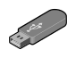
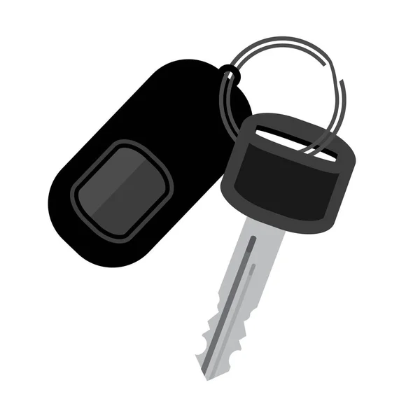
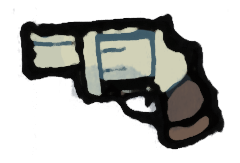
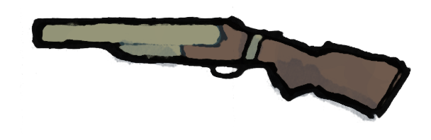
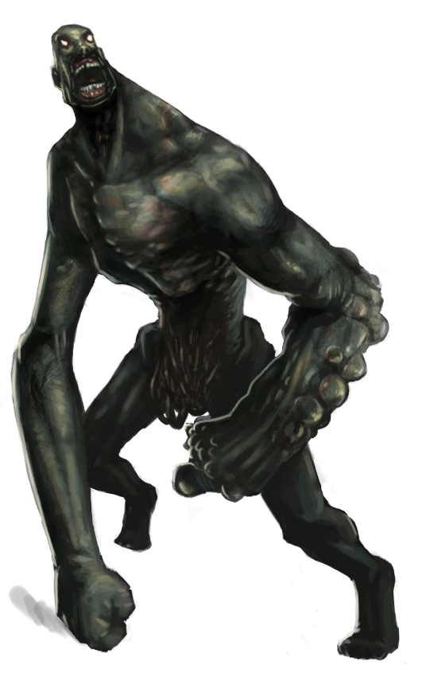

# Lab Escape

Un scénario Sombre Zéro (le [jeu de rôle de Johan Scipion](https://www.terresetranges.net/sombre.html))
pour 3 à 5 joueurs, d'une durée d'environ 1h30, dans un laboratoire envahi de zombies infectés,
avec une part d'exploration, les lieux étant progressivement révélés aux joueurs.

Version PDF : <a href="https://lucas-c.github.io/jdr/Sombre/scenario/Sombre-LabEscape.pdf">Sombre-LabEscape.pdf</a>

## Pitch
Les PJs sont un groupe de détenus et le garde qui les escorte.
Pour raccourcir leur peine, ils ont accepté de participer à des expérimentations biologiques.

 

## Intro
**Il y a quelques jours**, vous vous êtes portés volontaires pour participer à un protocole expérimental,
dans un laboratoire militaire partenaire de votre établissement pénitentiaire.
Pour les détenus, cela va vous permettre de bénéficier d'une remise de peine.
Pour Hardley & Edgecomb, les matons, ce n'est pas la première fois que vous accompagnez des taulards au « Labo », et la prime à la clef est très motivante...

**Il y a 1h**, votre véhicule est arrivé au sous-sol du « Labo », et Hardley & Edgecomb vous ont escortés
au premier étage du bâtiment, par l'ascenseur.
Vous avez été installés dans des fauteuils inclinables dans une salle confortable :
on aurait pu croire à un don du sang à l'EFS, ils diffusaient même la radio.
Et puis vous avez entendu des cris, et tout a dégénéré...

**Il y a 10min**, très vite ça a été la panique dans tout l'étage :
des cavalcades, des hurlements, des bruits de porte défoncée...
Et puis une infirmière a déboulé dans la pièce, poursuivi par un laborantin dont il manquait la moitié du crâne.
L'infirmière a trébuché et, sous vos yeux terrifiés, son poursuivant s'est mis à la dévorer vivante !
Dépassés, Hardley & Edgecomb ont décidé de vous libérer de vos châines,
et vous vous êtes tous mis à courir à perdre haleine pour fuir cette horde de zombies.
Mais Edgecomb s'est fait rattraper...

**Il y a 10 secondes**, alors qu'Edgecomb se faisait déchiqueter par les Infectés en hurlant,
Hadley lui a tiré une balle dans la tête pour abréger ses souffrances.
Vous vous êtes tous engoufrés dans une pièce au hasard et avez barricadé la porte derrière vous.

## Préparatifs
### Consignes de découpage
Les 5 personnages des joueurs sont composés d'un trio de tuiles adossées :
chaque bande de 3 tuiles doit être découpée d'un bloc, puis 2 pliures sont à réaliser
pour glisser à l'intérieur les informations secrètes de chaque PJ.

Les 2 PNJs (Sujet #313 et Herman) sont composés d'un duo de tuiles adossées :
ils ne nécessitent qu'une unique pliure.

Enfin, les armes à feu et les tuiles "Infecté" sont à découper individuellement.

Toutes les pièces possèdent un recto et un verso : elles doivent être repliées une fois découpées.
Un point de colle peut être ajouté à l'intérieur pour s'assurer qu'elles resteront bien plates.
Certaines pièces possèdent un verso "transformé", d'autres un verso uni.

### Répartition des rôles
Les rôles peuvent être attribués aléatoirement,
mais il vaut mieux confier celui du garde à un·e joueur·euse qui
est à l'aise avec la confrontation, notamment dans une dynamique "seul contre tous".

* À 4 joueurs, jouez **sans Stacey**.
* À 3 joueurs, jouez **sans Stacey ni Hanh**.

Enfin, pensez à donner la tuiler **Revolver** à Hadley,
et la tuile **Surin** à Damian, face cachée.

⚠️ Tous les personnages savent tirer avec une arme à feu (ils ont le trait _Tir_).

## Les lieux
Les pièces sont à révéler aux joueurs une par une, au fur et à mesure qu'ils les visitent.

### 1. L'entrepôt
La partie commence dans cette pièce pour les PJs.

La porte dans l'angle est barricadée : c'est par là que sont arrivés les PJs.
Une meute d'Infectés rôde de l'autre côté.

Le seul autre accès est une double porte battante (imblocable) donnant vers le couloir (2).

Si un PJ fouille l'endroit, il met la main sur une **grosse clef à molette**
suffisament horrifique pour pouvoir servir d'arme.

### 2. Le couloir
**Deux Infectés** attendent patiemment les PJs ici.
Soignez cette première rencontre, c'est le moment de décrire aux joueurs toute l'horreur de ces zombies.
Ils n'ont plus rien d'humain dans leur comportement.

Le premier peut être pris par surprise si les PJs réussissent un jet d'approche discrète.
Le second mettra un tour à rejoindre la double-porte d'accès à l'entrepôt.
Le couloir est trop étroit et éclairé pour se faufiler sans être remarqué par eux.

La porte de la salle des specimens (4) est fermée par un **scanner digital**.

#### Libération du sujet #314
Si quelqu'un **ouvre la porte du caisson, le sujet #314 s'en échappera**, enragé.
Il attaquera brièvement le premier humain à portée, puis se ruera vers le bureau (3).
Ensuite, référez-vous ensuite à la section détaillant son comportement.

### 3. Le bureau
Un local comportant un bureau avec chaise et ordinateur, ainsi que des grands meubles classeurs
et des baies de serveurs informatiques.
Celles-ci sont HS, et les documents stockées dans cette pièce sont des archives administratives sans intérêt.
**Herman** se cache dans un des meubles de rangement

Une porte indique un accès au rez-de-chaussé (5), mais est protégée par un **scanner digital**.

Cette pièce doit être retournée après que le sujet #314 l'ait ravagé, _cf._ la section décrivant #314.

### 4. La salle des specimens
Cette salle contient une vingtaine des cuves cylindriques verticales, dans lesquelles flottent des corps humains...
Le premier PJ a examiner les cuves reconnaîtra un ancien camarade taulard dans l'une des cuves.

Faites en sorte, dans vos descriptions, que cette pièce paraisse la plus inquiétante et lugubre du « Labo » :
il y a un cadavre en face de la porte d'entrée et du sang sur les murs,
les specimens des cuves semblent dévisager les PJs silencieusement, etc.

**Deux Infectés** rôdent dans la pièce, en lambdeaux de blouses blanches.
Même principe que pour le couloir : le premier peut être pris par surprise si les PJs sont discrets,
le second mettra un tour à rejoindre l'entrée de la pièce.

Sur le côté la pièce opposé à la porte d'entrée, un grand plan de travail comporte de nombreux papiers.
Une partie sont répandus au sol. S'ils sont examinés par les PJs, ils apprendront que des armes bactériologiques sont développées ici. Il est également fait mention de "spores" capables de "tout nettoyer".
Une **clef USB** grise peut être trouvée sur ce plan de travail : il s'agit des données recherchées par Markus.

### 5. La cage d'escalier - étage
En entrant à droite, l'écran d'un terminal de contrôle brille d'une lumière jaune.
La console affiche clairement ce message :

> Brèche detectée.  
> Risque d'explosion imminente.  
> Voulez-vous libérer les spores ?

Un employé du laboratoire gît assis au sol, de dos face à la porte d'entrée.
Ce n'est pas visible de dos, mais le pauvre est en train de **se transformer en Infecté**.
Après **2 tours**, il attaquera le PJ le plus proche.

Sur le mur du fond en entrant, une **hache d'incendie** est suspendue.

#### Libération des spores
Il n'est rien possible de faire d'autre sur ce terminal.
Si un PJ valide la proposition de la console,
un violent tremblement secoue le bâtiment.

↩️ La prochaine fois que les PJs entrent dans la salle 2, 4 ou 8, retournez-là face "transformée".
Si des PJs sont actuellement sur l'une de ces tuiles, retournez-là immédiatement.

Voici les conséquences concrètes de l'éclosion des spores :
* la porte de la salle des specimens (4) est sortie de ses gonds : elle peut désormais être ouverte sans employer le scanner digital.
* toute personne, infectée ou saine, qui entre dans la salle des specimens sans retenir sa respiration devient **Embrumée** après un tour.
* le sujet #314 est libéré de son caisson, s'il n'en était pas encore sorti
* la voiture est couverte de lianes et doit être débroussaillée (nécessite 2 tours et arme tranchante) avant d'être démarrée.

### 6. La réserve
Un PJ fouillant cette pièce trouvera le **fusil à seringues hypodermiques**
et un **masque à gaz**, permettant de ne pas être _Embrumé_ en présence des spores, dans la salle des specimens.
Cette pièce ne contient rien d'autre d'utile.

### 7. La cage d'escalier - RdC
On accède à cette pièce en descendant les escaliers de la cage d'escalier à l'étage (5).
Comme il s'agit d'un autre niveau du bâtiment, placez cette pièce à part sur votre table de jeu.

Cette pièce contient seulement des bidons entassés,
dont certains répandent au sol un liquide visqueux, corrosif et puant.

De l'autre côté de l'unique porte de la pièce, on peut entendre des grognements...

### 8. Le garage
L'ouverture de la porte révêle un petit garage et... une voiture en cours de réparation.
Enfin, un espoir pour les joueurs !

Mais la première préoccupation des PJs sera d'abord les **deux Infectés** présents dans la pièce,
qui attaqueront rapidement, et simultanément, le premier à y mettre les pieds.

Une inspection du véhicule révèlera que cette voiture semble en état de marche, mais qu'il manque les clefs.
Impossible pour les PJs de la faire démarrer sans.

Le garage comporte deux autres accès : une porte vérouillée par un **scanner digital**
et un grand portail métalique coulissant donnant accès à une rampe de sortie dans la rue, à l'extérieur.
Des interstices dans le portail permettent de distinguer que de nombreux zombies rôdent dans la rue :
ils ne sont pas à proximité directe mais détecteront immanquablement tout bruit ou mouvement du portail.

### 9. Le petit labo
En entrant, face à la porte, les PJs découvrent le cadavre, au sol,
d'un laborantin qui s'est visiblement suicidé en s'étranglant avec sa cravate et une broyeuse à papier.
Néanmoins, si les PJs ne l'inspectent pas prudement,
ce cadavre se révèlera être **un Infecté** et attaquera dans le dos tout PJ qui examinerait la pièce.

Il y un **ordinateur** allumé au fond de ce petit laboratoire.
Un message dans un coin de l'écran mentionne « clef USB manquante, insérez-la ».
Ce PC ne permet pas aux PJs d'accéder à l'extérieur du « Labo »,
mais plusieurs choses restent possibles :

* déclencher la synthétisation d'une dose virale : l'option est clairement proposée à l'écran.
Un petit tiroir s'ouvre alors, révélant une **seringue**.

* consulter le contenu de la clef USB, si elle a été récupérée et que les PJs y songent :
elle contient tout ce qu'il y a à savoir sur l'origine des zombies, créés dans ce laboratoire,
ainsi que les instructions pour concevoir un vaccin.

La clef de la voiture pourra être trouvée dans une poche de l'Infecté.

### 10. Les WCs
Entrer dans cette pièce en présence du sujet #314 provoquera immédiablement son ire et un affrontement.

En dehors des débris et du cadavre à demi-dévoré de la victime du sujet #314,
cette pièce ne contient rien d'autre qu'un évier et du papier toilette.

De l'autre côté de la porte des WCs, **des dizaines d'Infectés** rôdent dans un couloir.
Si quelqu'un passe ne serait-ce que la tête à travers la porte,
1d6 zombies foncent immédiatement vers lui et débarqueront dans la pièce, un par un,
à partir du tour suivant.

<!-- Cacher un objet dans les WCs ? -->

## Règles spéciales

### Sans arme face aux Infectés
Les Infectés, en dehors du sujet #314 et des PJs transformés, sont relativement bêtes et "mous".
Il est donc possible de se défendre face à eux sans arme, si les PJs le demandent,
par exemple pour les immobiliser ou juste éviter une morsure.

Un jet est effectué pour chaque personnage, comme d'habitude lors d'un combat.
Un PJ sans arme n'infligera jamais de dommage, mais s'il fait une meilleure réussite que son adversaire Infecté,
il ne recevra pas de blessure (son d6 doit être strictement inférieur).

### _LiveWire_
Afin d'accélérer les combats et d'éviter la succession lassante des échecs répétés,
j'applique la routine suivante : en cas d'échec mutuel d'adversaires directs, chacun subit 1 Blessure.

### Déplacements
Dans la plupart des salles, sans obstacle, en un seul tour un personnage peut attendre une des portes de la pièce. Dans les deux plus grandes salles (2 et 4), cela dépend de la position du personnage dans la pièce : s'il est à l'opposé d'une porte, cela nécessite deux tours.

Les zombies sont tout aussi rapides, mais mettent par contre du temps à réagir à une présence humaine :
ils mettent systématiquement un tour, voir deux à la discrétion du MJ, à émerger de leur état amorphe initial,
avant d'attaquer des humains à proximité.

### Scanners digitaux
Seules **les empreintes de Hadley & Herman** peuvent les activer
et ouvrir les portes auxquelles ils sont adossés.

Curieusement, les scanners ne reconnaissent plus les empreintes des Infectés,
probablement à cause de la transformation qu'ils ont subi.
Laissez néanmoins les joueurs découvrir ça par eux même en tranchant la main de l'un d'eux à la hache.

### Les armes à feu
Tous les personnages savent tirer avec une arme à feu (ils ont le trait _Tir_).

Le garde débute avec **un revolver** chargé, pouvant être utilisé **3 fois** :
à chaque tir, il faut tourner la tuile de l'arme, pour indiquer la dépense de munitions.
Les dommages sont les lus sur le dés, comme avec n'importe quelle arme.

**Un fusil à seringues hypodermiques** peut être trouvé dans la réserve (6).
Comme le revolver, il ne peut tirer que **3 fois**.
En cas d'attaque réussite, la cible ne reçoit aucun dommage mais plonge dans le sommeil,
pour le reste de la partie.

### Mort
Lorsqu'un personnage, PJ ou PNJ, meurt, on retourne sa tuile du côté de l'illustration.

### Infection
Lorsqu'un PJ meurt, s'il a été au moins une fois mordu par un Infecté,
et si le coup qui l'a tué ne lui a pas détruit ou détaché la tête, alors **ce PJ devient un Infecté**.

Prennez le joueur en apparté pour lui donner une tuile d'**Infecté** et lui expliquer ses nouveaux objectifs :
dévorer tout un humain à proximité !
Ils sont désormais incapables d'accomplirs des actions plus complexes que tourner une poignée de porte.

### État Embrumé
Une fois les spores libérés, respirer l'air de la salle des specimens fait devenir **Embrumé** après un tour passé dans cette pièce.

Une personne, infectée ou saine, qui devient **Embrumée** perd toutes ses facultées mentales et reste simplement debout, ébétée.

Une personne **Embrumée** trainée hors de la salle des specimens reprend immédiatement ces esprits.

Dans le couloir en en-dessous dans le garage, les spores sont trop peu nombreux pour faire effet.

Un PJ peut retenir sa respiration pendant 3 tours si Indemne, pendant 2 tours si Blessé, et pendant 1 tour si Mutilé.

## PNJs

### Infectés
**Apparence** : des humains aux blessures très visibles, qu'il s'agisse de membres sanguinolents
ou de viscères dégoulinantes. Une observation plus attentive révèlera également une présence végétale en eux :
des racines, des bourgeons, de la mousse, de l'écorce...

**Comportement** : s'ils n'ont aucun humain sain en ligne de vue, ils restent assez statiques
et rôdent lentement dans la pièce où ils se trouvent.

Dès qu'ils aperçoivent un humain sain, ils mettent un tour à émerger de leur état amorphe (voir deux à la discrétion du MJ), avant de se ruer sur lui et de tenter de le mordre.

### Herman

**Apparence** : blouse blanche, antipathique et crâneur, _cf._ illustration

**Comportement** : Herman est très lâche.
Il est initiallement caché dans un placard du bureau.
Ses objectifs sont, dans l'ordre du plus au moins important :

1. se servir des PJs pour sauver sa peau, en commençant par les supplier de l'aider
2. si les PJs hésitent sur la direction à prendre, **il évoquera le garage** au rez-de-chaussé comme potentielle issue
2. Herman sait qu'il y a un **fusil hypodermique dans la réserve**, et pourra suggérer de le récupérer

Herman peut **activer les scanners digitaux**, tout comme Hadley.

Si un PJ l'interroge à propos du **terminal** et de la libération des spores,
il aura une illumination et s'écrira « Mais oui, bien sûr ! »
et dans la foulée appuira sur le bouton de validation s'il est à proximité, et n'a pas encore été pressé.
Il pourra expliquer qu'il s'agit d'une procédure d'urgence
qu'il est parfaitement de logique de déclencher maintenant
mais dont il ne connaît pas le fonctionnement exact...

Si **Markus** se manifeste pour obtenir les données, il lui expliquera qu'elles sont sur une **clef USB grise**,
dans la salle des specimens. Il a bien trop la trouille pour aller la chercher lui-même.

### Sujet #314

**Apparence** : un énorme et monstrueux zombie, _cf._ illustration

**Comportement** : le sujet #314 est bien plus violent et proactif que ses congénères.
Une fois libéré de son caisson, il attaquera brièvement le premier humain à sa portée,
puis se ruera vers le bureau (3).

Une fois dans le bureau, il saccagera les lieux.
Si les PJs ne sont pas encore rentrés dans cette pièce,
alors celle-ci contient un autre scientifique qu'Herman, que le sujet #314 massacrera
(Herman, planqué dans un casier, n'est pas en danger à ce moment là).
Au terme de son ravage, il **défoncera le mur donnant sur les WCs** (10).

↩️ Retournez alors les tuiles 3 & 10.

S'il n'est pas dérangé, le sujet #314 passe alors plusieurs tours dans les WCs à se repaître de viande humaine...
(le scientifique qui a été sa victime, ou alors un pauvre type qui s'était réfugié aux WCs)

Ensuite, à la liberté du MJ, il aura plus ou moins tendance à rapidement traquer les PJs,
et s'acharnera à défoncer toutes les portes que les PJs pourraient bloquer sur son chemin.

 

## Épilogue
Plusieurs fins sont possibles.

La fin heureuse la plus probable est que les PJs survivants trouvent la voiture, les clefs,
ouvrent le portail du garage et s'enfuient à toute berzingue de ce lieu damné.

Points bonus s'ils ont mis la main sur la clef USB,
et _jackpot_ s'ils ont découvert ce qu'elle contenait et prévoient de sauver l'humanité avec !

Bien sûr, les possibilités de _Total Party Kill_ sont très nombreuses, surtout si les PJs font face au sujet #314.
Ils peuvent aussi progressivement tous être contaminés et s'entre-dévorer,
ou encore s'aventurer innocemment dehors sans voiture, ce qui finira forcément dans le sang.

## Accompagnement musical suggéré
[Sombre JdR - Zombies playlist @ YouTube](https://www.youtube.com/playlist?list=PLLgE-ga3W_kYmA6EQH6fzWmBQmNp39kTF),
qui inclut notamment :

* [Ambient Environments - Zombie Lab Outbreak](https://www.youtube.com/watch?v=xaDZstJkNWk)
* une version de In the House In a Heartbeat de John Murphy
* une version de Filth (Requiem For A Dream)
* [Zack Hemsey - The Way](https://www.youtube.com/watch?v=oN2Xs-MvxLw) pour l'épilogue final

## Licence

Ce scénario a été conçu par Lucas Cimon est est placé sous licence _[Creative Commons BY-NC-SA 4.0](https://creativecommons.org/licenses/by-nc-sa/4.0/)_.

Les fichiers sources ayant permis de générer ce PDF sont disponibles [sur GitHub](https://github.com/Lucas-C/jdr/tree/master/Sombre).

Si vous souhaitez soutenir mon travail, vous pouvez me faire un don sur <https://lucas-c.itch.io>

## Credits
Merci aux illustrateurs qui ont placé leur magnifique travail sous licence _Creative Commons_ :

* plusieurs assets de [2minutetabletop.com](https://2minutetabletop.com) - [CC BY-NC](https://creativecommons.org/licenses/by-nc/4.0/) : [Secret Research Facility Pack](https://2minutetabletop.com/product/secret-research-facility-pack/) et [1900s Misc. Map Assets](https://2minutetabletop.com/product/1900s-misc-map-assets/)
* quelques illustrations [CC BY](https://creativecommons.org/licenses/by/3.0/) de Fernando Correa : [Fargo](https://www.deviantart.com/fernand0fc/art/Fargo-687310962) [Sketch rapido](https://www.deviantart.com/fernand0fc/art/Sketch-rapido-605851036), [Corporate level bodyguard](https://www.deviantart.com/fernand0fc/art/Corporate-level-bodyguard-803579124)
* quelques illustrations [CC BY-SA](https://creativecommons.org/licenses/by-sa/3.0/) de Justin Nichol : [Science Officer](https://opengameart.org/content/science-officer), [FLARE Portrait Pack #2](https://opengameart.org/content/flare-portrait-pack-number-two), [FLARE Portrait Pack #3](https://opengameart.org/content/flare-portrait-pack-number-three), [Zombie Brute Concept](https://opengameart.org/content/zombie-brute-concept)
* quelques illustrations [CC BY-NC-SA](https://creativecommons.org/licenses/by-nc-sa/3.0/) de [Martina Lexi _aka_ thesimplyLexi](https://www.deviantart.com/thesimplylexi/gallery) : [Caleb](https://www.deviantart.com/thesimplylexi/art/Caleb-631705027), [McCaul Lombardi](https://www.deviantart.com/thesimplylexi/art/McCaul-Lombardi-742548196), [#7](https://www.deviantart.com/thesimplylexi/art/7-594550690), [#8](https://www.deviantart.com/thesimplylexi/art/8-595389474), [#9](https://www.deviantart.com/thesimplylexi/art/9-595642973)
* [Axe](https://freesvg.org/axe-2), [Fantasy Dagger](https://freesvg.org/1531000005), [pipe wrench](https://freesvg.org/pipe-wrench-image) & [usb thumb drive](https://freesvg.org/usb-thumb-drive-1-vector-graphics) issus de <https://freesvg.org>
* [Zombi Vectors - Vecteezy](https://www.vecteezy.com/free-vector/zombi)
* [Seringue - Vectorportal.com](https://vectorportal.com/fr/vector/seringue-vecteur-clip-art.ai/14310) - [CC BY](https://creativecommons.org/licenses/by/4.0/)
<!--
* [The Machinist by mooncube](https://www.deviantart.com/moooncube/art/The-Machinist-704053565) - [CC BY](https://creativecommons.org/licenses/by-sa/3.0/)
-->

Merci à Khurasan, l'auteur de la police [Freedom 45](https://www.fontspace.com/freedom-45-font-f100756).

Merci enfin aux développeurs des [logiciels libres](https://fr.wikipedia.org/wiki/Free/Libre_Open_Source_Software) employés : [le navigateur Firefox](https://www.mozilla.org/fr/firefox/), [le logiciel de dessin Gimp](https://www.gimp.org/), [l'éditeur de texte Notepad++](https://notepad-plus-plus.org/), [le lecteur de PDF Sumatra PDF](https://www.sumatrapdfreader.org), [le language de programmation Python](https://www.python.org/), les bibliothèques de code [fpdf2](https://pypi.org/project/fpdf2/), [livereload](https://pypi.org/project/livereload/), [pypdf](https://pypi.org/project/pypdf/) & [weasyprint](https://weasyprint.org/).
