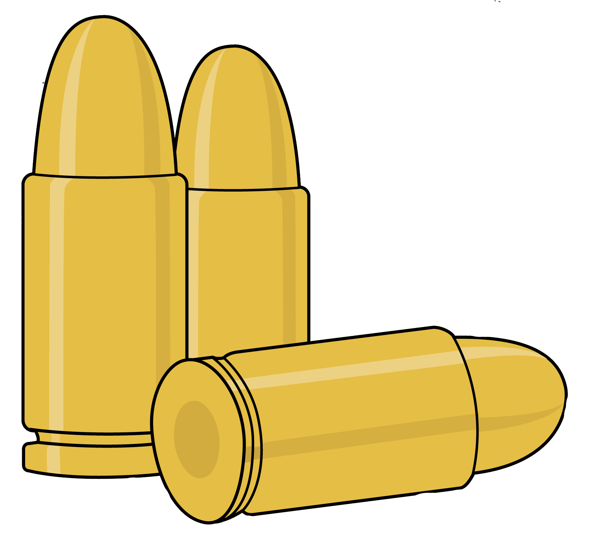
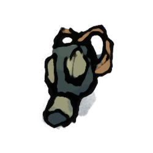
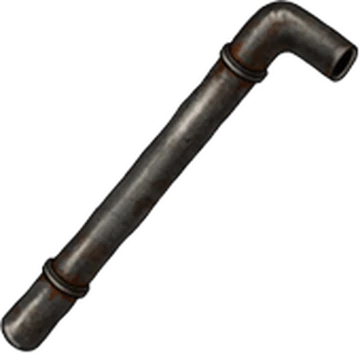

# Lab Escape

 

Un scénario Sombre Zéro (le [jeu de rôle de Johan Scipion](https://www.terresetranges.net/sombre.html))
pour 3 à 5 joueurs, d'une durée d'environ 45min, dans un laboratoire envahi de zombies,
avec une part d'exploration, les lieux étant progressivement révélés aux joueurs.

Ce scénario nécessite d'imprimer au moins 8 pages couleur, sur papier standard,
et un peu de découpage / pliage préalable.

Version PDF : <a href="https://lucas-c.github.io/jdr/Sombre/scenario/Sombre-LabEscape.pdf">Sombre-LabEscape.pdf</a>

 

## Pitch
Les PJs sont un groupe de détenus et le gardien de prison qui les escorte.
Pour raccourcir leur peine, ils ont accepté de participer à des expérimentations biologiques.

## Intro
_Soyez attentifs, ces informations seront cruciales à votre survie..._

**Il y a quelques jours**, vous vous êtes portés volontaires pour participer à un protocole expérimental,
dans un laboratoire militaire partenaire de votre établissement pénitentiaire.
Pour les détenus, cela va vous permettre de bénéficier d'une remise de peine.
Pour Hadley & Edgecomb, les matons, ce n'est pas la première fois que vous accompagnez des taulards au «&nbsp;Labo&nbsp;», et la prime à la clef est très motivante...

**Il y a 1h**, votre véhicule est arrivé au sous-sol du « Labo », et Hadley & Edgecomb vous ont escortés
au premier étage du bâtiment, par l'ascenseur.
Vous avez été installés dans des fauteuils inclinables dans une salle confortable :
le personnel était cordial et ils diffusaient même la radio.
Et puis vous avez entendu des cris, et tout a dégénéré...

**Il y a 10min**, très vite ça a été la panique dans tout l'étage :
des cavalcades, des hurlements, des bruits de porte défoncée...
Et puis une infirmière a déboulé dans la pièce, poursuivie par un laborantin dont il manquait la moitié du crâne.
L'infirmière a trébuché et, sous vos yeux terrifiés, son poursuivant s'est mis à la dévorer vivante !
Complètement dépassés, Hadley & Edgecomb ont décidé de vous libérer de vos chaînes,
et vous vous êtes tous mis à courir à perdre haleine pour fuir cette horde de zombies.
Mais Edgecomb s'est fait rattraper...

**Il y a 10 secondes**, alors qu'Edgecomb se faisait déchiqueter par les zombies en hurlant,
Hadley lui a tiré une balle dans la tête pour abréger ses souffrances.
Vous vous êtes tous engouffrés dans une pièce au hasard et avez barricadé la porte derrière vous.

## Glossaire
* **MJ** : Meneur·euse de Jeu
* **PJ** : Personnage d'un·e Joueur·euse
* **PNJ** : Personnage Non Joueur, contrôlé par le MJ

 

## Préparatifs
Seules les **règles de base de Sombre Zéro**, disponibles dans [le numéro 3 de Sombre](https://www.terresetranges.net/forums/viewtopic.php?pid=10545#p10545),
sont nécessaires pour jouer ce scénario.

 

### Consignes de découpage
⚠️ Les 5 personnages des joueurs sont composés d'un **trio** de tuiles adossées :
chaque bande de 3 tuiles doit être découpée d'un bloc, puis 2 pliures sont à réaliser
pour glisser à l'intérieur les informations secrètes de chaque PJ.

⚠️ Les 2 PNJs (Sujet #314 et Herman) sont composés d'un **duo** de tuiles adossées,
à découper d'un bloc : ils ne nécessitent qu'une unique pliure.

Enfin, les armes à feu et les tuiles « Zombie » sont à découper individuellement.

Toutes les pièces possèdent un recto et un verso : elles doivent être **repliées** une fois découpées.
Un point de colle peut être ajouté à l'intérieur pour s'assurer qu'elles resteront bien plates.
Certaines pièces possèdent un verso « transformé », d'autres un verso uni.

 

### Répartition des rôles
La _tagline_ de chaque personnage indique le crime pour lequel il est derrière les barreaux.

Les rôles peuvent être attribués aléatoirement,
mais il vaut mieux confier celui du gardien pénitentiaire, **Hadley**, à un·e joueur·euse qui
est à l'aise avec la confrontation, car ce personnage peut se sentir « seul contre tous ».

* À 4 joueurs, jouez **sans Stacey**.
* À 3 joueurs, jouez **sans Stacey ni Hanh**.

Avant de distribuer les tuiles des PJs, pensez à cacher la tuile **Revolver** dans celle d'Hadley,
et le **Surin** dans celle de Damian.

⚠️ Tous les personnages savent tirer avec une arme à feu (ils ont le trait _Tir_).

## Les lieux
Les pièces sont à révéler aux joueurs une par une, au fur et à mesure qu'ils les visitent,
en les plaçant du côté « intact », sans spores ni dégâts visibles.

### 1. L'entrepôt
La partie commence dans cette pièce pour les PJs.

La porte dans l'angle est barricadée : c'est par là que sont arrivés les PJs.
Une meute de zombies rôde de l'autre côté.

Le seul autre accès est une double porte battante (sans poignée) donnant vers le couloir (2).

Si un PJ fouille l'endroit, il met la main sur une **hache d'incendie**.

### 2. Le couloir
**Deux zombies** attendent patiemment les PJs ici.
Soignez cette première rencontre, c'est le moment de décrire aux joueurs toute l'horreur de ces zombies.
Ils errent hagards, ensanglantés, et n'ont plus rien d'humain dans leur comportement

S'ils sont discrets, les PJs auront le temps de s'approcher du premier pour l'attaquer sans qu'il n'ait le temps de réagir au premier tour de combat.
Le second mettra un tour entier à rejoindre la zone du couloir où se trouve son collègue.
Le couloir est trop étroit et éclairé pour se faufiler sans être remarqué par eux.

La porte de la salle des spécimens (4) est fermée par un **scanner digital**.

Devant le **caisson**, un panneau digital questionne en lettres clignotantes : **« SORTIE ? »**
Quiconque appuie dessus déclenche son ouverture et la libération du sujet #314,
décrit dans la section « Événements » plus loin.

### 3. Le bureau
Un local comportant un bureau avec chaise et ordinateur, ainsi que des grands classeurs de rangement métalliques.
Les documents stockés dans cette pièce sont des archives administratives sans utilité.

**Herman** se cache dans un des meubles de rangement. Si les PJs ne fouillent pas les lieux, il finira pas trahir sa présence par du bruit.

Une porte indique un accès au rez-de-chaussé (5), mais est protégée par un **scanner digital**.

La tuile de cette pièce doit être retournée une fois que le sujet #314 s'y est précipité et l'a ravagé.
La section « Événements » plus loin fournit plus de détails.

### 4. La salle des spécimens
Cette salle contient une vingtaine des cuves cylindriques verticales, dans lesquelles flottent des corps humains...
Le premier PJ a examiner les cuves reconnaîtra un ancien camarade taulard dans l'une d'elles.

Faites en sorte, dans vos descriptions, que cette pièce paraisse la plus **inquiétante et lugubre** de tout le « Labo » :
il y a un cadavre en face de la porte d'entrée et du sang sur les murs,
les spécimens des cuves semblent dévisager les PJs silencieusement, etc.

**Deux zombies** rôdent dans la pièce, en lambeaux de blouses blanches.
Comme dans le couloir, le premier peut être pris par surprise si les PJs sont discrets,
et le second mettra un tour à rejoindre l'entrée de la pièce.

Sur le côté de la pièce opposé à la porte d'entrée, un grand plan de travail comporte de nombreux papiers.
Une partie sont répandus au sol. S'ils sont examinés par les PJs, ils apprendront que **des armes bactériologiques sont développées ici**.
Il est également fait mention de « spores » capables de « tout nettoyer ».

**Trois balles pour revolver** et une **clef USB** grise peuvent être trouvées sur ce plan de travail :
il s'agit des données recherchées par Markus.

<!--div class="side-by-side">
  
  
</div-->

### 5. La cage d'escalier - étage
En entrant à droite, l'écran d'un terminal de contrôle brille d'une lumière jaune.
Il affiche clairement ce message :

> Brèche détectée.  
> Risque d'explosion imminente.  
> Voulez-vous libérer les spores ?

Il n'est rien possible de faire d'autre sur ce terminal.
Si quelqu'un valide cette demande, la section « Événements » plus loin détaille ce qu'il se passe.

Un employé du laboratoire gît assis au sol, de dos face à la porte d'entrée.
Ce n'est pas visible de dos, mais le pauvre est en train de **se transformer en zombie**.
Après **2 tours**, il attaquera le PJ le plus proche.

 

### 6. La réserve
Un PJ fouillant cette pièce trouvera le **fusil à seringues hypodermiques**
et un **masque à gaz**, permettant de ne pas être _Embrumé_ en présence des spores, dans la salle des spécimens.
Cette pièce ne contient rien d'autre d'utile.

  
  

### 7. La cage d'escalier - RdC
On accède à cette pièce en descendant les escaliers de la cage d'escalier à l'étage (5).
Comme il s'agit d'un autre niveau du bâtiment, placez cette pièce à part sur votre table de jeu.

Cette pièce contient des bidons entassés,
dont certains répandent au sol un liquide visqueux, corrosif et puant.

Si un PJ fouille l'endroit, il met la main sur une **clef à molette**,
suffisamment horrifique pour pouvoir servir d'arme.

De l'autre côté de l'unique porte de la pièce, on peut entendre des grognements...

### 8. Le garage
L'ouverture de la porte révèle un petit garage et... une **voiture** en cours de réparation.
Enfin, un espoir pour les joueurs !

Mais la première préoccupation des PJs sera d'abord les **deux zombies** présents dans la pièce,
qui attaqueront rapidement, et simultanément, le premier à y mettre les pieds.

Une inspection du véhicule révélera que cette voiture semble en état de marche, mais qu'**il manque les clefs**.
Impossible pour les PJs de la faire démarrer sans.

De plus, la voiture ne comporte que 4 places serrées (voir moins, à la discrétion du MJ).

Le garage comporte deux autres accès : une porte verrouillée par un **scanner digital**
et un **grand portail métallique coulissant** donnant accès à une rampe de sortie dans la rue, à l'extérieur.
Des interstices dans le portail permettent de distinguer que de nombreux zombies rôdent dans la rue :
ils ne sont pas à proximité directe mais détecteront immanquablement tout bruit ou mouvement du portail.

 

### 9. Le petit labo
En entrant, face à la porte, les PJs découvrent le cadavre, au sol,
d'un laborantin qui s'est visiblement suicidé en s'étranglant avec sa cravate et une broyeuse à papier.
Néanmoins, si les PJs ne l'inspectent pas prudemment,
ce cadavre se révélera être **un zombie** et attaquera dans le dos tout PJ qui examinerait la pièce.

Il y un **ordinateur** allumé au fond de ce petit laboratoire.
Un message dans un coin de l'écran mentionne « clef USB manquante, insérez-la ».
Ce PC ne permet pas aux PJs d'accéder à l'extérieur du « Labo »,
mais deux choses restent possibles :

* déclencher la libération des spores ;

* consulter **le contenu de la clef USB**, si elle a été récupérée et que les PJs y songent :
elle contient tout ce qu'il y a à savoir sur l'origine des zombies, créés dans ce laboratoire,
ainsi que **les instructions pour concevoir un vaccin**.

La clef de la voiture pourra être trouvée dans une poche du zombie.

### 10. Les WCs
Entrer dans cette pièce en présence du sujet #314 provoquera immédiatement son ire et un affrontement.

De l'autre côté de la porte des WCs, **des dizaines de zombies** dévorent bruyamment des cadavres
dans un long couloir exigu.
Ils ont peur du sujet #314, mais si l'un d'eux aperçoit un humain,
1d6 zombies foncent immédiatement vers celui-ci et déboulent dans la pièce, un par un,
à partir du tour suivant.

En dehors des débris et du cadavre à demi-dévoré de la victime du sujet #314,
cette pièce contient un **kit de premiers secours** accroché sur un mur, et visible du bureau.
Ce kit de soins est un objet récupérable par les PJs, librement transportable et échangeable entre eux.
Il peut être utilisé **3 fois**. Chaque utilisation nécessite d'y consacrer **un tour entier** et permet de **soigner une blessure**, d'un personnage adjacent ou soi-même.

## Événements

### Libération du sujet #314
Si quelqu'un touche au panneau devant le caisson, **cela l'ouvre et le sujet #314 s'en échappe, enragé**.
Voici ses actions, tour par tour :
1. il attaque brièvement le premier humain en vue en sortant du caisson
2. il fait quelques pas dans le couloir et s'engouffre dans le bureau (3)
3. il saccage les lieux, renversant les armoires, puis fixe le mur en tendant l'oreille
4. il **défonce la cloison donnant aux WCs**, et se met à dévorer un laborantin caché là

↩️ Retournez alors la tuile 3, et ajoutez la tuile 10.

La brèche créée dans la cloison révèle un **tuyau métallique**, en partie arraché.
Il est facile de s'en saisir et de l'employer comme une arme.

S'il n'est pas dérangé, le sujet #314 reste alors plusieurs tours dans les WCs
à se repaître de viande humaine sur un cadavre...

### Libération des spores
Si un personnage, PJ ou Herman, valide la proposition du terminal de la cage d'escalier ou du petit labo,
un violent tremblement secoue le bâtiment.

↩️ La prochaine fois que les PJs entrent dans les salle 2, 4 ou 8, retournez-les face « transformée ».
Si des PJs sont actuellement sur certaines de ces tuiles, retournez-les immédiatement.

Conséquences concrètes de l'éclosion des spores :
* la porte de la salle des spécimens (4) est sortie de ses gonds : elle peut désormais être ouverte sans employer le scanner digital.
* tout personnage qui entre dans la salle des spécimens sans retenir sa respiration devient **Embrumé** après un tour.
* la voiture est couverte de lianes, et doit être débroussaillée (nécessite 2 tours) avant d'être démarrée.
* le sujet #314 est libéré de son caisson, s'il n'en était pas encore sorti - _cf._ section événement correspondante

 

## Règles spéciales

### Sans arme face aux zombies
Les zombies, en dehors du sujet #314 et des PJs transformés, sont relativement stupides et maladroits.
Il est donc possible de se défendre face à eux sans arme, si les PJs le demandent,
par exemple pour les immobiliser, les repousser ou les faire tomber au sol.

Un jet est effectué pour chaque personnage, comme d'habitude lors d'un combat.
**Un PJ sans arme n'inflige jamais de dommage**, mais s'il réussit son jet, il parvient à ses fins.

### _LiveWire_
Afin d'accélérer les combats et d'éviter la succession lassante des échecs répétés,
j'applique la routine suivante : en cas d'échec mutuel d'adversaires directs, chacun subit 1 Blessure.

### Déplacements
Dans la plupart des salles, sans obstacle, en un seul tour un personnage peut atteindre une des portes de la pièce. Dans les deux plus grandes salles (2 et 4), cela dépend de la position du personnage dans la pièce : s'il est à l'opposé d'une porte, cela nécessite deux tours.

Les zombies sont tout aussi rapides, mais mettent par contre du temps à réagir à une présence humaine :
ils mettent systématiquement **un tour**, voir deux à la discrétion du MJ, à émerger de leur torpeur initiale,
avant d'attaquer les humains à proximité.

### Scanners digitaux
Seules **les empreintes de Hadley & Herman** peuvent les activer
et ouvrir les portes auxquelles ils sont adossés.

Curieusement, les scanners ne reconnaissent plus les empreintes des zombies,
probablement à cause de la transformation qu'ils ont subi.
Laissez néanmoins les joueurs découvrir ça par eux même en tranchant la main de l'un d'eux à la hache.
La main tranchée de Hadley ou Herman continuera par contre à les activer, s'ils n'ont pas été contaminés.

### Les armes
Tous les personnages savent tirer avec une arme à feu (ils ont le trait _Tir_).

**Hadley**, le maton, débute avec **un revolver** chargé, pouvant être utilisé **3 fois** :
à chaque tir, il faut tourner la tuile de l'arme, pour indiquer la dépense de munitions.
Les dommages sont lus sur le dés, comme avec n'importe quelle arme.

 

**Un fusil à seringues hypodermiques** se trouve dans la réserve (6).
Comme le revolver, il contient juste assez de munitions pour tirer **3 fois**.
En cas de tir réussi, la cible ne reçoit aucun dommage mais plonge dans le sommeil pour 1d6 tours.

 

Le **tuyau métallique** est une arme improvisée fragile :
chaque utilisation de cette arme l'endommage,
jusqu'à ce qu'elle devienne inutilisable après **3 usages**.

 
 
 
 

### Infection
Lorsqu'un PJ meurt, s'il a été au moins une fois mordu par un zombie,
et si le coup qui l'a tué ne lui a pas détruit ou détaché la tête, alors **ce PJ devient un zombie**.

Donnez à ce·tte joueur·euse une tuile **Zombie** et expliquez-lui ses nouveaux objectifs :
**dévorer tout humain à proximité** !
Ses actions se limitent désormais à se déplacer et tenter de mordre des humains.

 

### État Embrumé
Une fois les spores libérées, respirer l'air de **la salle des spécimens** fait devenir **Embrumé** après un tour passé dans cette pièce.
Dans le couloir et en-dessous, dans le garage, les spores sont trop peu nombreux pour faire effet.

Un personnage qui devient **Embrumé** perd toutes ses facultés mentales et reste simplement debout, hébété.
Un personnage **Embrumé** tiré hors de la salle des spécimens reprend immédiatement ses esprits.

Un PJ peut retenir sa respiration pendant 3 tours si Indemne, pendant 2 tours si Blessé, et pendant 1 tour si Mutilé,
permettant ainsi de ne pas respirer l'air intoxiqué par les spores.

## PNJs

### Zombies
**Apparence** : des humains aux blessures très visibles, qu'il s'agisse de membres sanguinolents
ou de viscères dégoulinantes. Une observation plus attentive révélera également une présence végétale en eux :
des racines, des bourgeons, de la mousse, de l'écorce...

**Comportement** : s'ils n'ont aucun humain sain en ligne de vue, ils restent assez statiques
et rôdent lentement dans la pièce où ils se trouvent.

Dès qu'ils aperçoivent un humain sain, ils mettent un tour à émerger de leur torpeur
(voir deux à la discrétion du MJ), avant de se ruer sur lui et de tenter de le mordre.

### Herman

**Apparence** : blouse blanche, antipathique et crâneur, _cf._ illustration

**Comportement** : Herman est très lâche.
Il est initiallement caché dans un placard du bureau.
Ses objectifs sont, dans l'ordre du plus au moins important :

1. se servir des PJs pour **sauver sa peau**, en commençant par les supplier de l'aider
2. si les PJs hésitent sur la direction à prendre, **il évoquera le garage**, au rez-de-chaussé, comme potentielle issue
2. Herman sait qu'il y a **un fusil hypodermique dans la réserve**, et pourra suggérer de le récupérer, mais il n'emploiera jamais d'arme lui-même

Herman peut **activer les scanners digitaux**, tout comme Hadley.

Si un PJ l'interroge à propos du **terminal** et de la libération des spores,
il aura une illumination et s'écrira « Mais oui, bien sûr ! »
et dans la foulée appuiera sur le bouton de validation, s'il est à proximité et qu'il n'a pas encore été pressé, provoquant la libération des spores.
Il pourra expliquer qu'il s'agit d'une procédure d'urgence,
qu'il est donc parfaitement logique de déclencher maintenant...
mais dont il ne connaît pas les conséquences exactes.

Si **Markus** se manifeste pour obtenir les données, il expliquera qu'elles sont sur une **clef USB grise**,
dans la salle des spécimens. Il a bien trop la trouille pour aller la chercher lui-même.

### Sujet #314

**Apparence** : un énorme et monstrueux zombie

**Comportement** : le sujet #314 est bien plus violent et proactif que ses congénères.
Son comportement initial lors de sa libération du caisson est décrit dans une section dédiée à cet événement.
Ensuite, s'il n'est pas dérangé, il reste alors plusieurs tours dans les WCs
à se repaître de viande humaine sur un cadavre...

Puis, à un moment propice déterminé par le MJ, il se mettra à traquer les PJs.
Si des portes s'interposent, il les défoncera avec acharnement,
les réduisant en miettes en 1d6 tours.

 
 

## Épilogue
Plusieurs fins sont possibles.

La fin heureuse la plus probable est que les PJs survivants trouvent la voiture, les clefs,
ouvrent le portail du garage et s'enfuient à toute berzingue de ce lieu damné.

Points bonus s'ils ont mis la main sur la clef USB,
et _jackpot_ s'ils ont découvert ce qu'elle contenait et prévoient de sauver l'humanité avec !

Bien sûr, les possibilités de _Total Party Kill_ sont très nombreuses, surtout si les PJs font face au sujet #314.
Ils peuvent aussi progressivement tous être contaminés et s'entre-dévorer,
ou encore s'aventurer innocemment dehors sans voiture, ce qui finira dans le sang s'ils ne font pas rapidement demi-tour.

## Accompagnement musical suggéré
[Sombre JdR - Zombies playlist @ YouTube](https://www.youtube.com/playlist?list=PLLgE-ga3W_kYmA6EQH6fzWmBQmNp39kTF),
qui inclut notamment :

* [Ambient Environments - Zombie Lab Outbreak](https://www.youtube.com/watch?v=xaDZstJkNWk)
* une version de In the House In a Heartbeat de John Murphy
* une version de Filth (Requiem For A Dream)
* [Zack Hemsey - The Way](https://www.youtube.com/watch?v=oN2Xs-MvxLw) pour l'épilogue final

## Licence

Ce scénario a été conçu par Lucas Cimon est est placé sous licence _[Creative Commons BY-NC-SA 4.0](https://creativecommons.org/licenses/by-nc-sa/4.0/)_.

Les fichiers sources ayant permis de générer ce PDF sont disponibles [sur GitHub](https://github.com/Lucas-C/jdr/tree/master/Sombre). Version : 1.0

La création de ce scénario a nécessité un long travail.
Si vous souhaitez soutenir mes projets, vous pouvez me faire un don sur <https://lucas-c.itch.io>.

Je serais aussi ravi d'avoir vos retours sur ce scénario si vous le faites jouer !
Racontez-moi comment s'est passé votre partie via un commentaire [itch.io](https://lucas-c.itch.io) ou par email à
_lucas POINT cimon AROBASE gmail POINT com_.

## Crédits & remerciements
Merci aux illustrateurs qui ont placé leur magnifique travail sous licence _Creative Commons_ :

* plusieurs assets de [2minutetabletop.com](https://2minutetabletop.com) - [CC BY-NC](https://creativecommons.org/licenses/by-nc/4.0/) : [Secret Research Facility Pack](https://2minutetabletop.com/product/secret-research-facility-pack/) et [1900s Misc. Map Assets](https://2minutetabletop.com/product/1900s-misc-map-assets/)
* quelques illustrations [CC BY](https://creativecommons.org/licenses/by/3.0/) de Fernando Correa : [Fargo](https://www.deviantart.com/fernand0fc/art/Fargo-687310962), [Corporate level bodyguard](https://www.deviantart.com/fernand0fc/art/Corporate-level-bodyguard-803579124)
* quelques illustrations [CC BY-SA](https://creativecommons.org/licenses/by-sa/3.0/) de Justin Nichol : [Science Officer](https://opengameart.org/content/science-officer), [FLARE Portrait Pack #2](https://opengameart.org/content/flare-portrait-pack-number-two), [FLARE Portrait Pack #3](https://opengameart.org/content/flare-portrait-pack-number-three), [Zombie Brute Concept](https://opengameart.org/content/zombie-brute-concept)
* quelques illustrations [CC BY-NC-SA](https://creativecommons.org/licenses/by-nc-sa/3.0/) de [Martina Lexi _aka_ thesimplyLexi](https://www.deviantart.com/thesimplylexi/gallery) : [McCaul Lombardi](https://www.deviantart.com/thesimplylexi/art/McCaul-Lombardi-742548196), [#9](https://www.deviantart.com/thesimplylexi/art/9-595642973)
* [Axe](https://freesvg.org/axe-2), [Fantasy Dagger](https://freesvg.org/1531000005), [pipe wrench](https://freesvg.org/pipe-wrench-image) & [usb thumb drive](https://freesvg.org/usb-thumb-drive-1-vector-graphics) issus de [freesvg.org](https://freesvg.org)
* [Bullet by liftarn @ openclipart.org](https://openclipart.org/detail/321358/bullet)
* [Zombi Vectors @ vecteezy.com](https://www.vecteezy.com/free-vector/zombi)
* [Cartoon 3d medical cas designed by 588ku @ pngtree.com](https://pngtree.com/freepng/cartoon-3d-medical_5921337.html?sol=downref&id=bef)
* [icon-with-three-bullets @ vexels.com](https://www.vexels.com/vectors/preview/20915/icon-with-three-bullets)
* [Free Printer Icon in Line Style by Ravindra Kalkani @ iconscout.com](https://iconscout.com/free-icon/printer-1140) - [CC BY-NC](https://creativecommons.org/licenses/by-nc/4.0/)
<!--
* [The Machinist by mooncube](https://www.deviantart.com/moooncube/art/The-Machinist-704053565) - [CC BY](https://creativecommons.org/licenses/by-sa/3.0/)
-->

Merci à Khurasan, l'auteur de la police [Freedom 45](https://www.fontspace.com/freedom-45-font-f100756).

Merci aux testeurs de ce scénario : Aurélien, Matthieu, Alarig, Aymeric, Clément, Émilien, Morgan, Sébastien. Merci en particulier à Matthieu, mon relecteur.

Merci enfin aux développeurs des [logiciels libres](https://fr.wikipedia.org/wiki/Free/Libre_Open_Source_Software) employés : [le navigateur Firefox](https://www.mozilla.org/fr/firefox/), [le logiciel de dessin Gimp](https://www.gimp.org/), [l'éditeur de texte Notepad++](https://notepad-plus-plus.org/), [le lecteur de PDF Sumatra PDF](https://www.sumatrapdfreader.org), [le language de programmation Python](https://www.python.org/), les bibliothèques de code [fpdf2](https://pypi.org/project/fpdf2/), [livereload](https://pypi.org/project/livereload/), [pypdf](https://pypi.org/project/pypdf/) & [weasyprint](https://weasyprint.org/).

<footer>
  
  

</footer>

<!--
CR partie du 2023/11/12
* joueurs : 3 - survivants : 1 (Hadley)
* durée : 45min
* Allarig (Markus) frustré car il a oublié sa capacité spéciale et aurait aimé un rappel sur sa tuile
* Aurélien (Damian) très tenté d'employer le surin sur le garde (Matt) -> se fait abattre d'un coup de pistolet
* Suggestions :
    + ajouter une possibilité de se soigner
    + indiquer le motif de détention sur les tuiles des taulards
    + employer une mécanique à la DSG où les joueurs ont + d'infos sur les autres PJs en début de partie ?

CR partie du 2023/11/30
* joueurs : 5 - survivants : 2 détenus + Herman
* durée : ~ 1h
* réflexions :
    + le garde peut se barrer seul à travers la porte du bureau, et laisser les autres PJs "en plan"
      -> solution : la hache
    + manque de motivations à libérer le sujet #314
      -> solution : gros bouton clignotant "sortie"
    + faut-il supprimer la règle de l'état Embrumé, par souci de simplification ?
* améliorations réalisées post-partie :
    + ajout du motif de détention sur les tuiles des taulards
    + ajout du kit de soin
    + échange de placements de 2 objets : hache & clef à molette
    + ajout d'une arme "usable" : le tuyau métallique
    + ajout de munitions pour le revolver
    + suppression de la seringue de dose virale
-->
