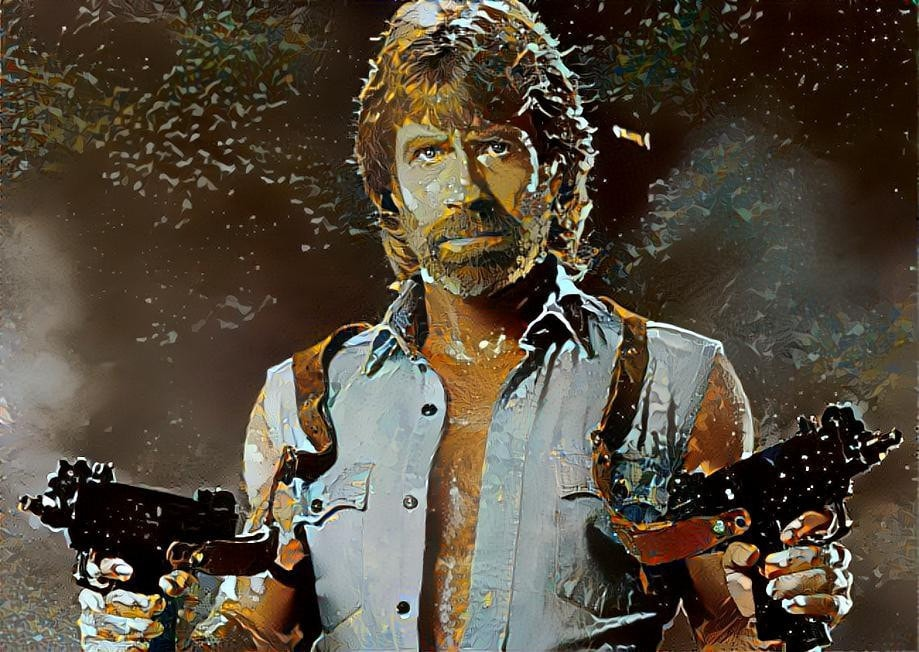
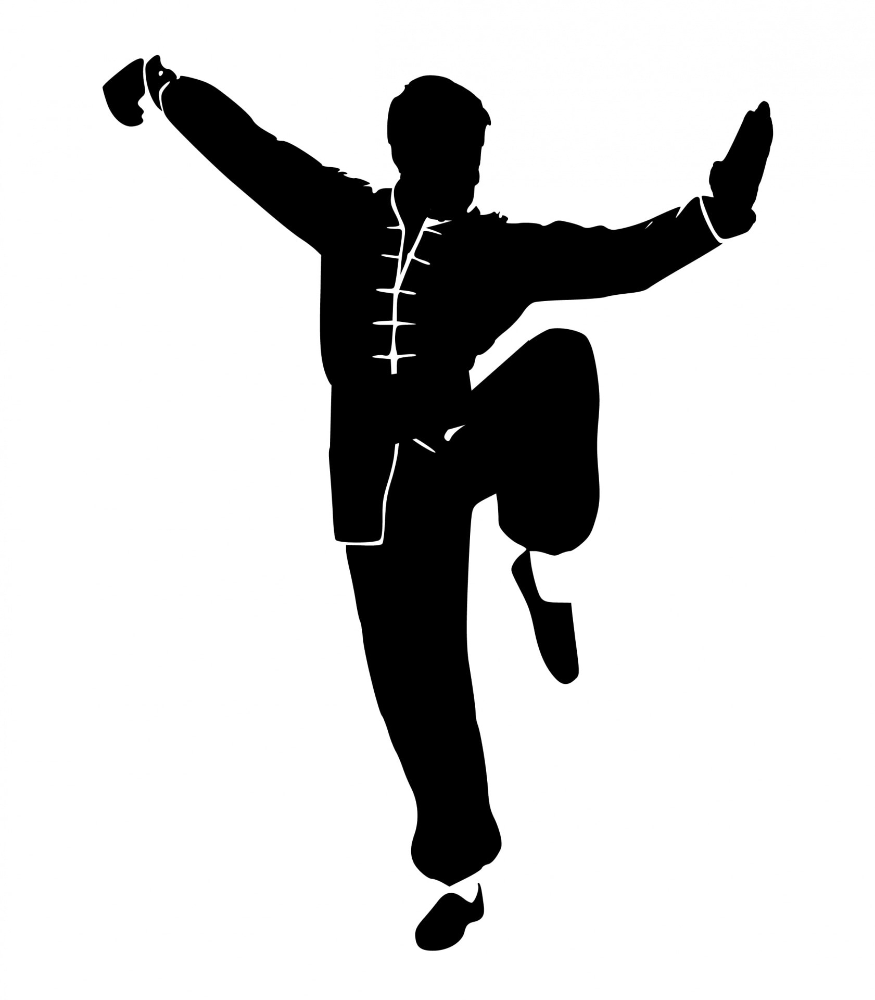
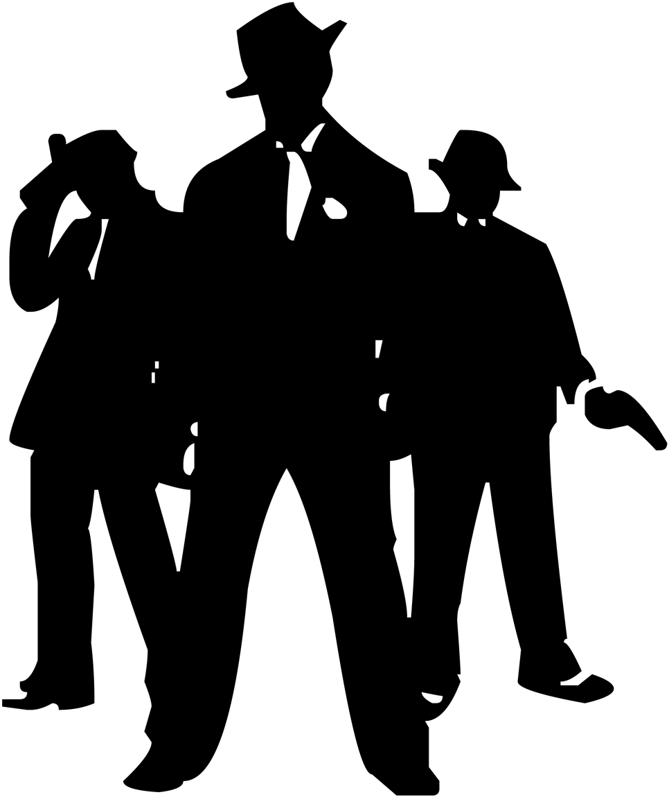
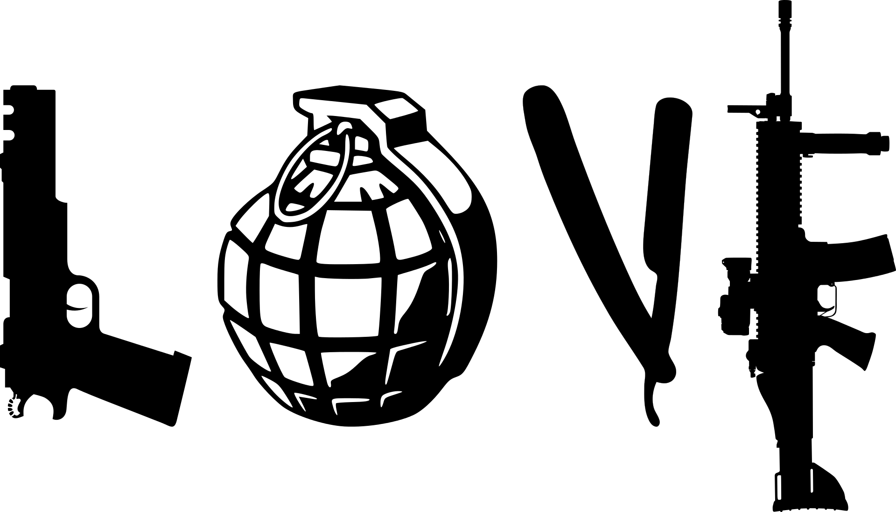
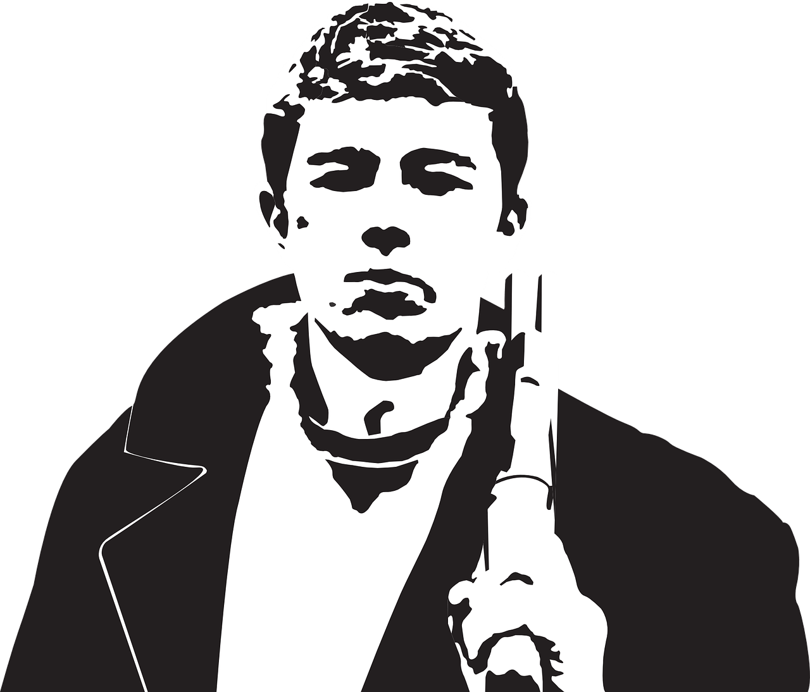

<!-- Etapes suivantes :
+ orga prochaine partie -> https://www.yardbarker.com/entertainment/articles/time_for_some_action_the_40_greatest_action_stars_of_all_time/s1__29640071#slide_39
+ plus d'illustrations
+ envoyer à Xyrop
+ nouvelle feuille de Premier Rôle
+ poster appel à maquettiste sur Casus No
-->
# Vengeance Fatale 4D

> Incarnez une star des films d'action des années 80 à 2020,
> et jouez dans de grosses productions hollywoodiennes,
> des films d'exploitation [direct-to-video](https://fr.wikipedia.org/wiki/Direct-to-video),
> ou même des les films d'arts martiaux hong-kongais, des séries B ou des séries Z.

> Dans Vengeance Fatale 4D, on incarne un acteur de films d'action
> cantonné dans un certain type de rôle, au point que
> les différents personnages qu'il incarne à l'écran sont
> interchangeables. On les nommera **Premiers Rôle**,
> et le meneur de jeu sera lui désigné par le terme **Réalisateur**.

Ceci est un _hack_ d'[Ultime Vengeance 3D](https://blog.xyrop.com/post/Ultime-Vengeance-3D),
le jeu de rôle de [Xyrop](https://blog.xyrop.com/pages/Xyrop) qui émule les films d'action bourrins.
Son objectif est de fluidifier les règles en adoptant le système de
[Lady BlackBird](http://www.ecuries-augias.fr/index.php/fr/nos-jeux/lady-blackbird)
de [John Harper](https://johnharper.itch.io/lady-blackbird).

## Plans, sequences, scenes
* Un **plan** est l'unité de temps durant laquelle un acteur accomplit **une action** courte,
capturée par la caméra sans _cut_
* Une **séquence** est une succession de plans formant une continuité logique,
se déroulant en un lieu unique, sur un court laps de temps
(plusieurs secondes à quelques minutes selon le rythme de la scène)
* Une **scène** est une succession de séquences visant le même but narratif.
Quand le lieu, le temps, les acteurs, ou les objectifs narratifs changent, il s'agit d'une nouvelle scène.

## Faire un test
Quand les Premiers Rôles tentent de surmonter un obstacle, vous devez jeter des dés à 6 faces (d6).
De base, vous disposez d’**un dé**. Ajoutez-en un par **Trait** qui peut vous aider.
Vous pouvez également ajouter autant de dés de votre réserve de **Script** que vous le désirez
(vous commencez avec 7 dés de Script).

Jetez tous les dés que vous avez réunis. Chaque résultat de **4 ou plus** est un succès.
Afin de surmonter l'obstacle, vous devez obtenir autant de succès que requis par le niveau de difficulté
défini par le Réalisateur :

* **2** : **fastoche** / scène d'exposition
* **3** : **difficile** / scène tendue
* **4** : **ambitieux** / scène haletante
* **5** : **inconcevable !** / _climax_

Si **vous ne réussissez pas**, vous n’atteignez pas encore votre objectif, mais
vous pouvez garder les dés de Script que vous avez utilisés et vous en ajoutez
**un supplémentaire** à votre réserve.

Si **vous réussissez**, défaussez les dés que vous avez jetés (en incluant les
dés de Script que vous avez utilisés). Ne vous inquiétez pas, vous pourrez
récupérer des dés de Script plus tard.

Optionnellement, vous pouvez alors calculer la différence entre le nombre de réussites
obtenues aux dés (les dés ⚃, ⚄ ou ⚅) <u>moins</u> le niveau de difficulté.
Le résultat indique le **niveau spectaculaire** :

* **0-1** : **Bof**
> Ça bouge, mais c'est sans grand effort d'imagination.
> Toutes les fusillades ne sont pas intéressantes,
> et il ne faut pas confondre violence et spectaculaire.
> Certains spectateurs baillent un peu.
* **2-3** : **Wow**
> La séquence est imaginative et plutôt originale, les décors sont mis en valeur,
> l'action est surprenante et bien filmée. Quelques plans seront repris pour la bande annonce.
> Le spectateur agréablement surpris se redresse sur son siège,
> alléché par la séquence et très curieux de voir la suite.
* **4 et plus** : **OMGWTF!**
> Le choc, tout simplement. Aucun spectateur n'aurait jamais
> imaginé pareille séquence, qui sera analysée, disséquée, digérée
> et restituée sous diverses variantes dans tous les films d'action à
> venir au cours des 10 prochaines années. Les spectateurs se
> sentent comme s'ils découvraient Star Wars au cinéma à sa sortie
> en 1977. Les joueurs se disent : "Si c'était un vrai film, j'aurais fait
> 3 jours de queue pour acheter mon billet !"

<!-- Note : ni Conditions ni PVs pour le moment, ne semble pas nécessaire -->

## Aider
Si votre Premier Rôle a la possibilité d’en aider un autre, vous pouvez
**lui octroyer un dé de votre réserve de Script**. Dites ce que votre Premier Rôle fait pour
lui venir en aide. Si le jet échoue, vous récupérez votre dé. En revanche, si
c’est un succès, votre dé est perdu.

## Recuperation du Script
> Le **Script** représente le caractère cousu de fil blanc des intrigues
> qu'on sert au premier rôle, les facilités scénaristiques auxquelles se
> livrent scénaristes, réalisateurs et monteurs lorsqu'ils doivent
> boucler le film mais qu'il manque des scènes intermédiaires ou des
> éléments importants de l'intrigue. Si ce qui se passe à l'écran ne
> tient pas debout, c'est à cause du Script. Si l'acteur fait une chose
> qui n'a aucun sens logique mais fait étonnamment avancer
> l'intrigue, c'est parce qu'il a lu le Script.

Vous pouvez **remplir votre réserve de Script** jusqu’à 7 dés** en effectuant une scène de
remplissage (_roleplay_) avec un autre Premier Rôle.
<!-- Selon la scène jouée, vous pouvez également vous enlever une condition ou récupérer l’utilisation d’un secret. -->
Une scène de remplissage représente une bonne occasion pour poser des questions
(en jouant son Premier Rôle) de façon à ce que les autres joueurs puissent décrire
les aspects de leurs Premier Rôles : « où as-tu appris à te battre comme ça ? »,
« pourquoi je te ferais confiance ? », « que faisais-tu avec ces types ? », etc.
Vous pouvez au préalable indiquer l'attitude, la posture ou même l'émotion que révèle le visage de votre Premier Rôle,
mais tâchez de vous exprimer à la première personne et de réaliser un dialogue complet avec les autre joueurs,
sans interruption pour faire des descriptions.

## Popularite et carriere
Plus vous gagnez en popularité, plus vous pouvez développer votre carrière de star du cinéma !

Votre score de **Carrière** ne peut jamais dépasser votre **Popularité**.
Quand votre **Popularité** devient suffisamment élevée,
vous pouvez augmenter ainsi votre score de **Carrière** entre deux films :

* _Carrière + 500_ : **remplacez un Trait** par un autre de votre choix
* _Carrière + 1000_ : **obtenez un nouveau Trait**
  **ou** remplacez **une Capacité Spéciale** / **un Gimmick** par un autre de votre choix
* _Carrière + 2000_ : **obtenez un nouveau Gimmick** ou **une nouvelle Capacité Spéciale** au choix

## Traits
Liste inspirationnelle non exhaustive, groupés par catégories arbitraires :
* **Caractère** : Borné, Brutal, Discipliné, Enragé, Gaffeur, Humour, Impitoyable, Imprévisible, Justicier, Loyal, Opportuniste, Provocateur, Prudent, Revanchard, Suspicieux, Tatillon, Téméraire
* **Combat** : Armes blanches, Arme improvisée, Armes lourdes, Assassin, Boxe, Close-combat, Désarmer, Duels, Gunfight, Kung-fu, Mêlée, Mon Corps est une arme, Tireur d'élite
* **Job** : Flic, Garde du corps, Inspecteur, Militaire, Trappeur, Vétéran, Yakuza
* **Mouvement** : Agile, As du volant, Acrobate, Contorsionniste, Courir, Escalade, Évasion, Furtif, Moto, Rapide
* **Relationnel** : Baratineur, Beau gosse / Bien roulée, Beau parleur, Calmer, Commandement, Contacts, Distraire, Intimidation, Négociation, Poker Face, Rassurant
* **Sagesse** : Alarmes, Anecdotes, Bricoleur, Déguisement, Drogues, Faire exploser des trucs, Marché noir, Pièges, Pègre, Premiers soins, Réparer, Ruse, Sabotage, Secrets, Suave, Tactique
* **Autres** : Aware, Bon sens, Doigts baladeurs, Endurant, Musculeux, Pickpocket, Prédateur, Traquer, Sauvetage, Sens de la rue, Vigilant

## Gimmicks
Quand vous enclenchez un Gimmick, deux options s’offrent à vous :
* Recevoir **50 points de popularité**
* Ajouter **2 dés** à votre réserve de Script (avec un maximum de 10 dés)

<!-- Rachat de Gimmick => 2000 pop (règle à inclure ?) -->

### Casse-cou
Vous vivez pour le danger, et vous plongez sans cesse, tête baissée,
dans des situations toujours plus risquées les unes que les autres.
Ce Gimmick se déclenche après chaque scène où vous vous êtes mis exagérément en danger.

### C'est ma mission
À chaque film c'est pareil : vous avez un objectif dès le départ,
et rien de ne vous arrêtera tant vous ne l'aurez pas atteint, implacablement.
Déterminez en début de film avec le Réalisateur de quoi il s'agit :
une cible à abattre, un second rôle à sauver, un objet à obtenir, un secret à découvrir...
Ce Gimmick se déclenche après chaque scène où que vous réalisez une avancée significative sur le chemin de votre Mission.

### Charmeur
Ce Gimmick se déclenche après chaque scène où vous avez joué les tombeurs
en mettant en avant votre pouvoir de séduction.

### Code de l'honneur
On ne frappe pas un homme à terre. Ni de dos. Ni les femmes.
Il faut savoir pardonner. Et n'abandonner personne face à l'ennemi.
Et ne pas mentir. Et être poli. Etc.
Ce Gimmick se déclenche après chaque scène où l'application de votre code de l'honneur a compliqué la situation pour vous,
ou bien que vous l'imposez aux autres Premiers Rôles.

### Champion malgré lui
<!-- cf. https://tvtropes.org/pmwiki/pmwiki.php/Main/DrunkenMaster & https://tvtropes.org/pmwiki/pmwiki.php/Main/ImprovFu -->
Sans le savoir, le Premier Rôle est un tireur d'élite ou un maître d'arts martiaux.
Ses dons se manifestent malgré lui, d'une manière qui peut varier selon les films :
lorsqu'il cherche juste à éviter les coups, lorsqu'il est en colère, somnambule,
ou encore soûle tel Jackie Chan dans _Drunken Master_.
Ce Gimmick se déclenche après chaque séquence de combat où les actions du Premier Rôle
pour se battre étaient orchestrées pour sembler involontaires.

### Comic relief
Ce Gimmick se déclenche chaque fois que vous faites rire les autres joueurs, au plus une fois par scène.

### Commandant
Vous avez l’habitude de donner des ordres et d’être obéi.
Déclenchez ce Gimmick après chaque scène où vous mettez au point un plan
et que vous donnez des ordres pour assurer son bon développement.

### Costume toujours impeccable
Ce Gimmick se déclenche après chaque scène où vous auriez forcément dû vous salir,
voir déchirer votre tenue, mais que que vous vous en sortez sans la moindre égratignure.

### Dévot
Vous savatez les méchants à tours de bras, oui mais dans le respect de Dieu.
Ce Gimmick se déclenche après chaque scène où vous avez exprimé vos valeurs pieuses.

### Dur à cuire
Ce Gimmick se déclenche après chaque scène où vous vous relevez pour en découdre à nouveau
ou faites une ré-apparition alors qu'on vous croyait mort.

### Chorégraphe
Vous êtes connu pour vos impressionnantes cabrioles, quelles soient martiales ou juste acrobatiques.
À chaque film, vous vous renouvelez et repoussez vos limites, sans jamais de doubleur !
Ce Gimmick se déclenche à chaque séquence ou vous réalisez une cascade époustouflante
ou un combat à la chorégraphie particulièrement originale.

### Éternel étranger
À chaque film c'est pareil : dès les premières scènes du film, votre personnage est stigmatisé,
considéré comme un paria, voir banni de sa communauté.
Ce Gimmick se déclenche chaque fois que votre statut d'étranger vous met dans le pétrin,
ou lorsqu'il est important dans une scène.

### I will find you... and I will kill you
Depuis le petit succès d'un de vos premiers films, vous n'arrivez pas à sortir de ce rôle :
dans chaque film, à un moment donné, vous prenez en chasse quelqu'un... jusqu'à lui faire la peau.
Ce Gimmick se déclenche après chaque scène où vous progressez dans votre traque.

### Impulsif
Cette clef se déclenche chaque fois que vous réagissez impulsivement,
en mettant de l'huile sur le feu ou en risquant votre peau,
avant même que le Réalisateur n'ait fini de décrire la scène.

### Lover
À chaque film c'est pareil : vous tombez sous le charme de quelqu'un.
Déterminez en début de film avec le Réalisateur de qui s'agit-il : quel premier rôle ou second rôle ?
Déclenchez ce Gimmick lorsque vous prenez une décision majeure basée sur ce sentiment,
ou quand vous déclarez votre flamme.

### Militant
Quel que soit le film, vous vous arrangez toujours avec la production
pour faire passer des messages à l'écran sur une cause qui vous tient à cœur,
à définir à l'obtention de ce Gimmick : sauver les derniers éléphants tachetés, vaincre la varicelle,
lutter contre l’illettrisme au Liechtenstein...
Ce Gimmick se déclenche chaque fois que vous glissez une référence à votre cause, au plus une fois par scène.

### Patriote
Vous aimez votre pays et en êtes fier !
Ce Gimmick se déclenche après chaque scène où vous avez vanté le rêve américain (ou votre équivalent national)
avec force répliques cinglantes et tirades chauvines.

### Protecteur
À chaque film c'est pareil : vous protégez une même personne à travers plusieurs scènes...
Déterminez en début de film avec le Réalisateur de qui s'agit-il : quel premier rôle ou second rôle ?
Ce Gimmick se déclenche après chaque scène où que vous vous efforcez de défendre votre protégé(e).

### Représentant d'un art martial
Vous êtes l'un des meilleurs de votre discipline, qu'il s'agisse de boxe, de karaté, de jeet kune do,
de jiu-jitsu brésilien ou de krav-maga.
Ce Gimmick se déclenche après chaque scène où vous imposez votre style martial face à un second rôle ou premier rôle antagoniste
qui en pratique un autre.

### Rouler des mécaniques <!-- ex capacité spéciale Muscles -->
Ce Gimmick se déclenche après chaque scène où vous faites un truc spectaculaire à l'écran
grâce à votre musculature de culturiste ou votre force physique de bulldozer.

### Traître
Votre réputation est faite, les producteurs adorent vous filer des rôles où vous trahissez vos camarades...
Ce Gimmick se déclenche fois que vous abandonnez vos compagnons, leur mentez avec de fortes; conséquences
ou que retournez carrément votre veste contre eux !

### Vengeur
À chaque film c'est pareil : votre personnage encaisse un max de tragédies durant l'exposition,
et vous passez le reste du film à vous venger...
Déterminez en début de film avec le Réalisateur pourquoi et contre qui votre vengeance s'exercera.
Ce Gimmick se déclenche après chaque scène où vous avez exercé votre vengeance.

## Capacites speciales
<!-- Inspiration : https://en.wikipedia.org/wiki/Cinematic_techniques -->

### Bullet-time <!-- ex coup de pouce Réalisation -->
Une fois par session, ralentissez l'action le temps d'une séquence :
la rapidité et les réflexes de votre Premier Rôle crèvent l'écran.
Cet effet _bullet time_ peut être employé par votre personnage à votre convenance,
lors d'un _gunfight_, d'un combat de kung-fu ou d'une cascade.

### Cabotinage <!-- ex coup de pouce -->
Une fois par session, vous pouvez vous lancer dans une tirade en crevant l'écran,
stoppant ou annulant les effets de toutes les actions en cours des autres
premiers rôles, rôles secondaires et figurants (qu'ils entendent ou non la tirade).

### Caméo de star <!-- ex Mondanités -->
Une fois par session, faites soudain intervenir un ami acteur célèbre qui
viendra donner un coup de main bienvenu à l'acteur en difficulté,
fournir des indices, ou jouer les taxis jusqu'à la scène suivante.

### Cri de Wilhelm
Une fois par session, imitez [ce célèbre cri](https://fr.wikipedia.org/wiki/Cri_Wilhelm)
et provoquez une longue chute d'un figurant ou second rôle.

### Deuxième prise <!-- ex coup de pouce Production -->
Une fois par session, imposez de rejouer une séquence au Réalisateur.
L'ensemble des actions précédentes est annulée et totalement rejoué.

### Duo de choc <!-- ex capacité spéciale -->
Quand vous agissez en coordination avec un autre Premier Rôle,
vous pouvez l'aider en dépensant des dés de Script :
vous récupérer alors toujours au moins un dé, même lorsque l'action est réussie.

### Ellipse
Une fois par session, vous pouvez imposer une ellipse narrative :
la pellicule prend feu et se déchire façon [Planète Terreur](https://en.wikipedia.org/wiki/Planet_Terror#Editing).
Le Réalisateur pose une nouvelle scène, qui peut se dérouler plusieurs heures plus tard.

### Faux raccord
Une fois par session, vous pouvez introduire dans une scène un objet de votre choix :
arme ou non, qu'il soit sur vous ou dans le décor.
S'il semble apparaître de nul part, c'est simplement que la séquence où cet objet a été introduit dans le film
un peu plus tôt a disparu au montage !

### Flashback <!-- ex coup de pouce Montage -->
Une fois par session, déclenchez une courte scène de _flashback_,
permettant d'établir a posteriori des faits, savoirs ou objets à disposition de l'acteur.

### Il est là ! <!-- ex capacité spéciale -->
Une fois par session, votre Premier Rôle trouve instantanément du regard un élément qu'il cherche.
La caméra filme le regard de l'acteur, puis la totalité de son champ de vision défile en plan large.
Soudain, le champ de la caméra revient en arrière pour zoomer sur le détail / l'objet / l'individu recherché.

### Mixage <!-- ex coup de pouce -->
Une fois par session, revenez sur une phrase de dialogue prononcée par l'acteur
pour la remplacer par n'importe quelle autre (merveilles de la post-synchronisation),
ce qui permet aussi au joueur de relancer tout jet de dés lié à cette interaction sociale.

### Polystyrène <!-- Destruction dans Lady Blackbird -->
Vous pouvez détruire des objets ou le décor à mains nues !

### Souffleur
Une fois par session, posez une question sur le scénario au Réalisateur,
à laquelle il sera obligé de répondre sincèrement.

### Split Screen <!-- ex capacité spéciale Pendant ce temps... -->
Une fois par scène, à une instant donné, vous pouvez effectuer jusqu'à 4 actions, chacune filmée sous un angle différent, là où tous les autres personnages n'ont le temps d'en effectuer qu'une seule !

### SPFX <!-- ex coup de pouce -->
Une fois par session, bénéficiez de doublures (cascadeur ou CGI), d'effets pyrotechniques,
de maquillages impressionnants, de poches d'hémoglobine, d'adversaires entièrement numériques...
Cet effet s'applique durant toute une séquence où vous pous pouvez relancer les ⚅ obtenus
pour tenter d'obtenir de nouvelles réussites.

### Tracing bullet
Une fois par session, vous pouvez réaliser un tir d'arme à feu proprement incroyable,
qui sera suivi de bout en bout par la caméra.

### Training montage <!-- ex capacité spéciale -->
On découvre dans un _flashback_ que l'acteur s'est longuement entraîné pour être prêt à faire face à cette situation.
Il déclenche une scène où, sur une musique entraînante, on pourra le voir s'entraîner à devenir plus fort (avec
ou sans l'aide d'un vieux maître) - échouant à ses tâches au début avant de les réussir de plus en plus facilement
puis avec brio. Permet de récupérer tous ses points de Script une fois par session.

## Stereotypes
<!--
#Traits = 10 / Nom, dont 3 martiaux au moins
#Gimmicks + #Capacités spéciales = 6 / Nom, +1 Gimmick fourni par l'Adjectif
-->
À la création d'un Premier Rôle, chaque joueur combine un Nom avec un Adjectif pour former son **Stéréotype**.
Il lui attribue ensuite **3 Traits supplémentaires** de son choix.
### Agent
+ **Traits** : Désarmer, Déguisement, Discipliné, Évasion, Mon Corps est une arme, Militaire, Poker Face, Secrets, Tactique, Traquer
+ **Capacités spéciales** : Ellipse, Flashback, Split Screen, SPFX
+ **Gimmicks** : C'est ma mission, Costume toujours impeccable
### Combattant
+ **Traits** : Arme improvisée, Aware, Art martial au choix (boxe, karaté, jeet kune do...), Beau gosse / Bien roulée, Désarmer, Endurant, Duels, Humour ou Impitoyable, Revanchard, Vigilant
+ **Capacités spéciales** : Bullet-time, Polystyrène, Training montage
+ **Gimmicks** : Dur à cuire, Militant ou Protecteur, Représentant d’un art martial
### Flic
+ **Traits** : Calmer, Commandement, Courir, Désarmer, Flic, Gunfight, Intimidation, Loyal, Pègre, Suspicieux
+ **Capacités spéciales** : Bullet-time, Duo de choc, I will find you… and I will kill you, Souffleur
+ **Gimmicks** : Commandant, Protecteur ou Traître
### Hors-la-loi
+ **Traits** : Assassin ou Tireur d’élite, Beau parleur, Borné ou Enragé, Doigts baladeurs, Évasion, Furtif ou Rapide, Imprévisible ou Opportuniste, Marché noir, Prédateur, Sens de la rue
+ **Capacités spéciales** : Caméo de star, Faux raccord, Tracing bullet
+ **Gimmicks** : Dur à cuire, Éternel étranger, Lover ou Traître
### Intello
+ **Traits** : Anecdotes, Bricoleur, Faire exploser des trucs, Négociation, Pièges, Premiers soins, Prudent, Ruse, Réparer, Sabotage
+ **Capacités spéciales** : Faux raccord, Flashback, Mixage, Souffleur
+ **Gimmicks** : C'est ma mission, Lover ou Traître
### Monsieur tout-le-monde
+ **Traits** : Arme improvisée, As du volant, Bon sens, Calmer, Contacts, Distraire, Évasion, Humour, Imprévisible, Provocateur
+ **Capacités spéciales** : Caméo de star, Cri de Wilhelm, Duo de choc, SPFX
+ **Gimmicks** : Champion malgré lui, Code de l’honneur
### Sabreur
+ **Traits** : Agile, Armes blanches, Discipliné, Duels, Escalade, Furtif, Mêlée, Impitoyable, Revanchard, Tactique
+ **Capacités spéciales** : Deuxième prise, Mixage, Split Screen, Training montage
+ **Gimmicks** : I will find you… and I will kill you, Représentant d’un art martial
### Soldat
+ **Traits** : Armes lourdes, Brutal, Close-combat, Discipliné, Militaire, Prédateur, Rassurant, Sauvetage, Traquer, Tireur d’élite
+ **Capacités spéciales** : Deuxième prise, Ellipse, SPFX, Tracing bullet
+ **Gimmicks** : Code de l’honneur, Patriote
### Adjectifs
L'adjectif du stéréotype constitue le **Trait majeur** d'un Premier Rôle,
et fournit **2d6** (et non un seul) lors du jet de dés d'un test.

Chaque ajdectif fournit également un Gimmick ou une capacité spéciale :
* **Acrobate** : + Gimmick **Chorégraphe**
* **Baratineur** : + capacité spéciale **Cabotinage**
* **Gaffeur** : + Gimmick **Comic Relief**
* **Imprévisible** : + Gimmick **Impulsif**
* **Justicier** : + Gimmick **Vengeur**
* **Musculeux** : + Gimmick **Rouler des mécaniques**
* **Suave** : + Gimmick **Charmeur**
* **Tatillon** : + capacité spéciale **Il est là !**
* **Téméraire** : + Gimmick **Casse-cou**

## Pourquoi ❓❓❓

Dès la première partie d'_Ultime Vengeance 3D_, mes joueurs & moi l'avons ❤️ adoré ❤️ !
* le plaisir de jouer des acteurs qui en font des caisses dans des films nanardesques
* le cabotinage et la course à la popularité des Premiers Rôles
* un jeu narratif sans aucune contrainte de garder l'intrigue cohérente, bien au contraire !
* les références cinématographiques et le double niveau d'imbrication des histoires
  permettant plein de jeux de lecture : « il joue mal exprès où il se prend au sérieux là ?? »
* un système de jeu avec de belles idées ludiques : le Stéréotype en deux mots dont toutes les caractéristiques découlent;
  la hiérarchie figurants / seconds rôles / rôles principaux;
  les points de Popularité; les Coups de Pouces inventifs et « métas »; les niveaux de spectaculaire...

Malheureusement, dès la première partie également, le système de jeu m'a un peu pesé :

* un système de résolution un peu lourd, faisant intervenir caractéristiques + dés + une table de référence +
  un système de point d'actions + des bonus accordés par les Coups de Pouce +
  les malus des Défauts à ne pas oublier... et qui nécessite de prendre en compte à la fois la **somme**
  et **les faces** des dés (pour les comparer au _Seuil d'Importance Scénaristique_ des PNJs)
* les (trop) nombreux niveaux de difficulté à fixer & bonus à distribuer par le Réalisateur : type de scène,
  niveau spectaculaire, difficulté de l'action, gains de popularité...
* de (trop) nombreuses jauges à gérer pour les joueurs : points d'actions + caractéristiques variables,
  avec valeur courante & minimale & maximale qui peuvent chacune évoluer
* les totaux des jets dés qui peuvent devenir laborieux pour les joueurs

L'idée était donc d'adopter un système de jeu qui limite ces petits défauts,
avec également l'envie d'encourager quelques autres mécaniques :
* permettre aux joueurs d'avoir plus spontanément le contrôle sur la caméra, les figurants...
  sans dépenser de points de Script, ce qu'ils rechignent à faire
* suggérer des _Moves_ aux joueurs via leur Stéréotype & feuille de Premier Rôle
  (façon [PbtA](https://fr.wikipedia.org/wiki/Apocalypse_World#Powered_by_the_Apocalypse))
* encourager plus de coopération, tant le principe de jouer des acteurs qui veulent tous crever l'écran
a tendance à les mettre en compétition, pour être seuls sous les feux de la rampe

On peut donc compter parmi les simplifications majeures de ce _hack_ :
* plus d'Attributs, juste une liste de Traits plus évocateurs et suggestifs
* plus de multiples jauges ni points d'action, seule la jauge de Script est maintenue comme _pool_ de dés
* les Capacités Spéciales & Coups de Pouce sont fusionnés et correspondent aux _Secrets_ du système de Lady BlackBird
* introduction des _Gimmicks_ (les _Clés_ du système de Lady BlackBird), qui orientent le _roleplay_ des Premiers Rôles et remplacent en cela les Défauts
* le nom et l'adjectif du Stéréotype fournissent désormais chacun un mélange de Traits, Capacités Spéciales & Gimmicks
* le Réalisateur ne lance plus de dés et fixe un unique niveau difficulté, au choix parmi quatre
* le Réalisateur peut continuer à distribuer des points de Popularité, qui sont également obtenus grâce aux Gimmicks et deviennent plus important ludiquement, comme ils permettent de faire évoluer mécaniquement les Premiers Rôles
* il n'y a plus de totaux de dés à effectuer

Les règles suivantes issues d'Ultime Vengeance 3D peuvent toujours s'appliquer :
* La règle d'initiative : _la faction la moins nombreuse agit toujours en premier_
* Les Récompenses de popularité, Tournées promotionnelles & Effets de la popularité
* Les quatre commandements & les Conseils et astuces

### Licence et sources

Ce jeu a été conçu par Lucas Cimon et est sous licence [CC BY 4.0](http://creativecommons.org/licenses/by/4.0/). Version: 1.0.

Si vous le testez, songez à me laisser un petit commentaire sur [mon blog](https://chezsoi.org/lucas/blog/pages/jeux-de-role.html) 🥺🙏😘

<u>Police du titre :</u> [SciFi Movies](https://www.dafont.com/fr/scifi-movies.font) par [Daniel Hochard](http://www.imagex-fonts.com/).

<u>Illustrations :</u>
* Photo de Chuck Norris [deep-dreamée](https://deepdreamgenerator.com/ddream/3opppwxmr86)
* [Action Movie icon - TheNounProject](https://thenounproject.com/term/action-movie/3379040/) - [CC-BY 3.0](https://creativecommons.org/licenses/by/3.0/us/legalcode)
* [Silhouette, kung fu, wushu, shaolin - publicdomainpictures.net](https://www.publicdomainpictures.net/fr/view-image.php?image=263507&picture=silhouette-kung-fu-wushu-shaolin)
* [bodybuilder-salle-de-gym - Pixabay](https://pixabay.com/fr/vectors/bodybuilder-salle-de-gym-6295818/)
* [danila-bagrov - Pixabay](https://pixabay.com/fr/vectors/acteur-vecteur-danila-bagrov-1144794/)
* [mafia - Pixabay](https://pixabay.com/fr/illustrations/mafia-gangsters-personnes-3153020/)
* [Hate-Combat-Gun-War-Weapons-Grenade-Love - MaxPixel](https://www.maxpixel.net/Hate-Combat-Gun-War-Weapons-Grenade-Love-3166238)

