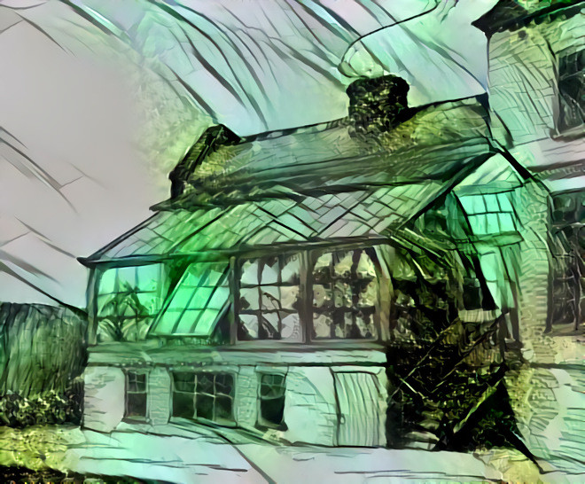
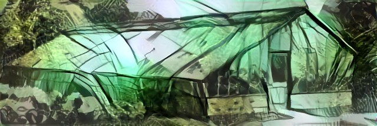
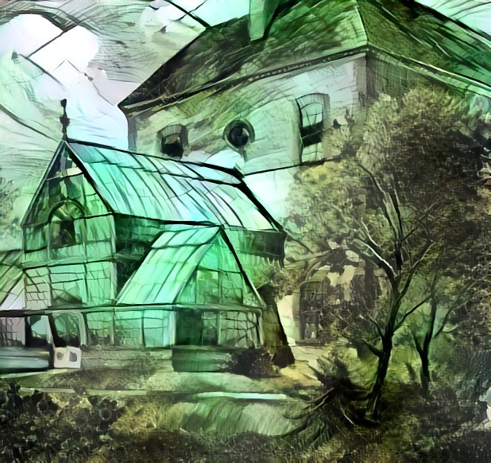
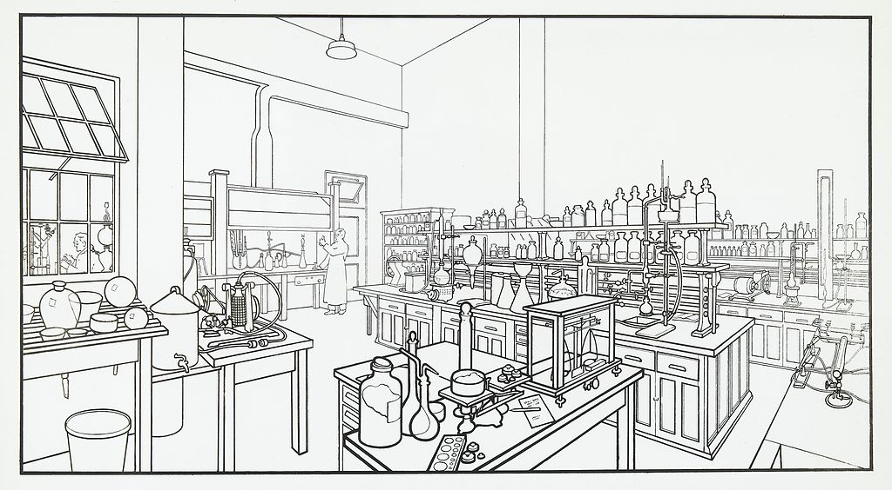
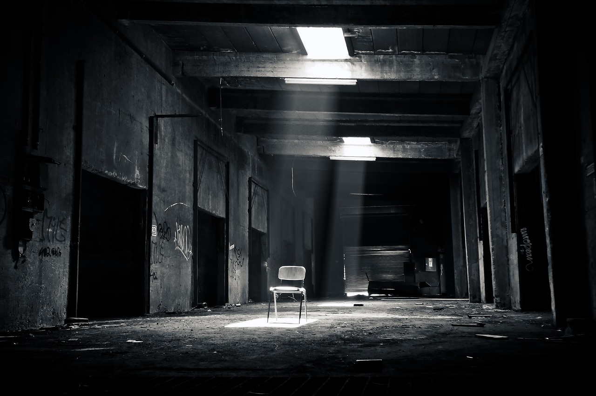
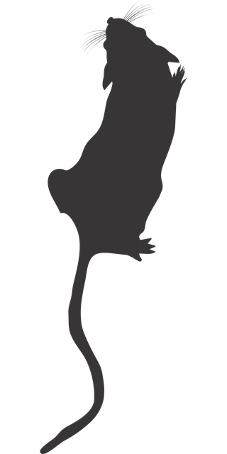

<!--
Gradient de couleur pour bandeau noir
Éthon -> bof nom (2 occurences)
Code moral:
    Loyauté (envers créateurs / patrie ?)
    Tuer
    Famille
    Altruisme (envers semblables / humains ?)
    Loi du plus fort
    Equité
    Justice
    Pardon
Test moral:
    déclenché par PJs ou MJ
    Chimères "résistent" avec leurs scores, mais en cas de dépacement cela les modifie:
    +1:-1 au choix, et +1 dans jauge papillons
    -> à chaque étape, MJ pose une question au joueur
    à la dernière, changement d'objectif
Envies des PJs: -> objectifs gagnés lorsque jauge papillon remplie ?
    Retourner à la vie sauvage, perdre cette conscience lourde à porter
    Liberté de choix
    Être traité en égaux des hommes
    Vengeance
Idées de mise en page
    image de d8 + indiquer en préambule qu'il en faut pour jouer
    image de background
    zones textes arrondies et à l'opacité légèrement différente par rapport au fond
    traits reliants certaines caracs
Proposer sur http://troplongpaslu.fr
-->
# 
::: center-text
_Dans ce jeu de rôle vous incarnez des animaux cybernétiques à l'intelligence augmentée, créés par l'homme pour accomplir ses basses oeuvres.
Entrainés par l'armée, surarmés et dotés de camouflages tactiques.
Plus performants que des drones, et sans scrupules humains.
En théorie._

Ces personnages sont inspirés des BDs [We3](https://en.wikipedia.org/wiki/We3) et [Idoles](https://www.bedetheque.com/serie-11587-BD-Idoles.html).
:::

::::: grid
:::: grid-item
### Système
Lorsqu'une Chimère tente d'accomplir une action difficile ou risquée,
le joueur calcule le total de **2d8 + caractéritique** correspondante parmi Féroce / Humain / Soldat d'élite.
Il ajoute également **+1** par équipement de son exo-armure utilisée dans l'action,
et **+1** par mouvement tactique applicable.

C'est une réussite si le total est > 10.

En cas de double :
d8 | Conséquence sur le résultat de l'action
---|-
1-2| L'instinct prend le dessus: tu hurles, fuis, couines, grognes ou charges.\
   | Tu continues ainsi tant que tu ne réussis pas un jet de _Soldat d'élite_
3-4| Réussite de justesse / échec de peu
5-6| Oui mais ... / Non mais ...
7-8| Spectaculaire

::::
:::: grid-item
### Exo-armure
Elle est branchée directement dans leur corps via divers cables, mais ne le recouvre pas entièrement :
elle n'est pas tant là pour les protéger que pour les dissimuler grâce à la **Psychée** projetée,
et pour leurs fournir des « améliorations » létales.

Les Chimères sont également toutes équipées de **lunettes de vision thermique**,
leur permettant de déceler toute présence humaine à 50m à travers tout bâtiment.

Enfin, leur exo-armure comporte une caméra, constament allumée pour que leurs officiers coordinateurs les supervisent,
ainsi qu'une radio leur permettant de communiquer entre eux et avec ces même officiers.
Sans elle, ils sont capables de se comprendre uniquement entre eux par grogenements, et de manière très limitée.
::::
:::: grid-item
### Psyché
Telle est le nom de la projection néo-lographique capable de leur donner une apparence humaine.
Elle est produite par un générateur au sein de leurs exo-armures.
Elle ne permet pas de contact préhensible mais peut projeter indéfiniment leur image "usuelle" d'humain qu'ils emploient.
En entamant sa réserve d'énergie (de 8 unités), une Chimère peut exercer un contrôle plus fin dessus :
- -1 unité / min pour adopter une autre apparence, par exemple terrifiante ou celle d'un autre humain
- -1 unité / min pour projeter l'image à distance, à portée de vue
- -1 unité / min pour adopter un camouflage mimétique invisible

Cette réserve se regénère à raison d'1 unité / 5 min sans aucune projection.
::::
:::: grid-item
### Dégâts
Quand les Chimères ont leur Psyché activée, en dehors d'Arcas à la carrure massive, toute attaque envers leur apparence humaine a de grande chances d'échouer
et de simplement traverser la projection au-dessus de leur tête. Le joueur lance 1d8 : sur **5+** l'attaque échoue ainsi,
mais sur un **8** l'attaquant comprend qu'il s'agit d'une projection et ne se trompera plus.

Une attaque par balle ou arme tranchante fait **1 dégât**. Une explosion fait **2 dégâts**.
Les Chimères possèdent une armure qui absorde les dégâts, mais qui s'abimera au fur et à mesure.
Tout personnage sans armure est immédiatment mis K.O. lorsqu'il reçoit un dégât.
::::
:::::

::: page-break
:::

:::: columns
::: column-item-1-half cybanimal

**Nom de code:** Arcas

**Objectif:**

**Féroce:** 

**Humain:**

**Soldat d'élite:**

**Désavantage:** sa Psychée ne lui procure pas de couverture, il est systématiquement touché en cas d'attaque

**Souvenir:**

**Psychée:** [ ] [ ] [ ] [ ] [ ] [ ] [ ] [ ]
_Protection_: aucune
_Apparence_: \_\_\_\_\_\_\_\_\_\_\_\_\_\_\_\_\_\_\_\_\_\_\_\_\_\_\_\_\_\_\_\_\_\_\_\_\_\_\_\_\_\_\_\_\_\_\_\_\_\_\_\_\_\_\_

**Exo-armure:** [ ] endommagée [ ] transpercée [ ] panne sévère [ ] majoritairement dysfonctionnelle [ ] hors service
- griffes
- mitrailleuses
- lunettes à vision thermique

**Mouvements tactiques:** déplacement furtif - pénétrer dans une pièce en éliminant toute menace - parkour - sniper - tir de barrage
</dl>
:::

::: column-item-1-half cybanimal

**Nom de code:** Maera

**Objectif:**

**Féroce:** 

**Humain:**

**Soldat d'élite:**

**Désavantage:**

**Souvenir:**

**Psychée:** [ ] [ ] [ ] [ ] [ ] [ ] [ ] [ ]
_Protection_: 5+
_Apparence_: \_\_\_\_\_\_\_\_\_\_\_\_\_\_\_\_\_\_\_\_\_\_\_\_\_\_\_\_\_\_\_\_\_\_\_\_\_\_\_\_\_\_\_\_\_\_\_\_\_\_\_\_\_\_\_

**Exo-armure:** [ ] endommagée [ ] transpercée [ ] panne sévère [ ] majoritairement dysfonctionnelle [ ] hors service
- griffes
- mitrailleuses
- lunettes à vision thermique

**Mouvements tactiques:** déplacement furtif - pénétrer dans une pièce en éliminant toute menace - parkour - sniper - tir de barrage
:::

::: column-item-1-half cybanimal

**Nom de code:** Éthon

**Objectif:**

**Féroce:** 

**Humain:**

**Soldat d'élite:**

**Désavantage:** très lent lorsqu'il se déplace au sol, ne peut pas courir

**Souvenir:**

**Psychée:** [ ] [ ] [ ] [ ] [ ] [ ] [ ] [ ]
_Protection_: 5+
_Apparence_: \_\_\_\_\_\_\_\_\_\_\_\_\_\_\_\_\_\_\_\_\_\_\_\_\_\_\_\_\_\_\_\_\_\_\_\_\_\_\_\_\_\_\_\_\_\_\_\_\_\_\_\_\_\_\_

**Exo-armure:** [ ] endommagée [ ] transpercée [ ] panne sévère [ ] majoritairement dysfonctionnelle [ ] hors service
- serres
- mitrailleuses
- lunettes à vision thermique

**Mouvements tactiques:** déplacement furtif - pénétrer dans une pièce en éliminant toute menace - parkour - sniper - tir de barrage
:::

::: column-item-1-half cybanimal

**Nom de code:** Cercop

**Objectif:**

**Féroce:** 

**Humain:**

**Soldat d'élite:**

**Désavantage:**

**Souvenir:**

**Psychée:** [ ] [ ] [ ] [ ] [ ] [ ] [ ] [ ]
_Protection_: 5+
_Apparence_: \_\_\_\_\_\_\_\_\_\_\_\_\_\_\_\_\_\_\_\_\_\_\_\_\_\_\_\_\_\_\_\_\_\_\_\_\_\_\_\_\_\_\_\_\_\_\_\_\_\_\_\_\_\_\_

**Exo-armure:** [ ] endommagée [ ] transpercée [ ] panne sévère [ ] majoritairement dysfonctionnelle [ ] hors service
- griffes
- mitrailleuses
- lunettes à vision thermique

**Mouvements tactiques:** déplacement furtif - pénétrer dans une pièce en éliminant toute menace - parkour - sniper - tir de barrage
:::
::::

::: hand-fingerprints

:::
## Section réservée au MJ

::::: grid
:::: grid-item
### QG
Camouflée comme une entreprise d'horticulture.
Ils y ont leur quartiers personnels, une salle d'entrainement, etc.

<!-- https://commons.wikimedia.org/wiki/File:Greenhouse_draft_-_Godwin,_Adams_-_05.png -->

<!-- https://www.flickr.com/photos/internetarchivebookimages/16674790952/ -->

<!-- https://commons.wikimedia.org/wiki/File:Greenhouse_draft_-_Godwin,_Adams_-_01.png -->

<!-- https://commons.wikimedia.org/wiki/File:Chemical_Laboratory_room_Wellcome_L0041460.jpg -->

<!-- Both: Pixabay CC0 -->

::::
:::: grid-item
### PNJs
	homme de main ("G") → devient gorille à la fin
	le jeune garçon blond et son pickup
    jeune homme véto
    vieille femme cyberscientifique
    technicien / coordinateur radio
    femme major sévère (seule fiable ?)
::::
:::: grid-item
### Vos souvenirs
Chaque joueur répond à l'une de ces questions concernant votre groupe,
en précisant en quoi son personnage est particulièrement concerné par ce souvenir :
- qui considérez-vous comme votre père / mère / sauveur, et pourquoi ?
- quel était votre jeu favori entre vous lorsque vous étiez plus jeunes ?
- 
::::
:::: grid-item
### Vocabulaire déshumanisant
cible éliminée, objectif atteind, menace écartée...
::::
:::: grid-item
### Scènes
::::
:::: grid-item
#### Intro
> Ok, l'enregistrement a démarré. Nous sommes le <date>.
> Ceci est la première opération sur le terrain de l'unité tactique Chimera.
> Soldat \_\_\_, êtes vous opérationnel ?
> Êtes-vous prêt à accomplir votre mission, et à obéir scrupuleusement à mes ordres ?
::::
:::: grid-item
#### Mission 1 : Coulé par le fond
**Ordres**:
- couler le cargo "C'est Assez"
- ne laisser aucune trace de combat
- détruire le salle de serveurs informatiques à bord

**Obstacles & cas de conscience**:
- réfugiés à bord
- 2 molosses
- canon à harpons
- abrite refuge flottant pour animaux "L'Arche de Noë"
- marin avec lance à eau
::::
:::: grid-item
Cas de conscience scénaristiques:
    civils
    femme avec bébé
    tuer d'autres animaux
    couler bateau Greenpeace
    éliminer une autre Chimère qui tente de s'échapper
    -> secret: pour s'enfuir, il faut détruire drones-relais puis désactiver chirurgicalement implant radio
S'ils se rebellent: militaires désactiveront la détection de présence d'humains dans leurs lunettes de vision thermique,
les destabilisant énormément
Secret: ne sont pas des animaux doués de consciences, leur exoarmure contient un cerveau humain
::::
:::: grid-item
### Musique
- Bande originale de Portal 2: _Aperture Science Psychoacoustics Laboratory_ [9999999](https://www.youtube.com/watch?v=wgVTmt6t3hg) & [Reconstructing More Science](https://www.youtube.com/watch?v=WAeiqxNH3W0)
- [Rising Doom de Mondkopf](https://www.youtube.com/playlist?list=PL16FB92C9DFC1A076)
::::
:::: grid-item
### Épilogue
A la fin de la partie, chaque joueur mise secrètement pour la résolution qu'il souhaite pour cette histoire parmi les choix suivant :
::: headless-table
1  | Pour toutes les Chimère qui avaient un objectif, **celui-ci est atteind**.\
   | Cependant **deux Chimères perdent la vie**, tirées au hasard parmi les joueurs ayant choisi cette option.
---|-
2  | **Une Chimère perd la vie**, tirée au hasard parmi les joueurs ayant choisi cette option. \
   | **Les objectifs des autres Chimères** sont accomplis.
3  | **Une seul Chimère atteind son objectif**. \
   | Si plusieurs joueurs choisissent cette option, cette Chimère est tirée au hasard parmi eux, mais **elle y laisse alors la vie**
:::
Une fois les votes révélés, c'est **l'option de valeur la plus élevée** ayant reçu au moins un vote qui l'emporte.
On effectue alors le ou les jets aléatoires requis pour déterminer les Chimères & objectifs concernés.

Ensuite, en commençant par ces Chimères,
chaque joueur prend alors la parole pour décrire ce qu'il advient de son personnage au cours de cette scène et après,
en complétant ce que le précédent vient de décrire.
::::
:::::

:::: footer
Un jeu de Lucas Cimon - [CC BY 4.0](http://creativecommons.org/licenses/by/4.0/)

<!--Merci à ... pour le _playtest_ et vos suggestions inspirées.-->

Portraits d'animaux de [Master Blek](https://www.deviantart.com/masterblek) - [CC BY-SA 3.0](https://creativecommons.org/licenses/by-sa/3.0/)

Polices: 
::::

