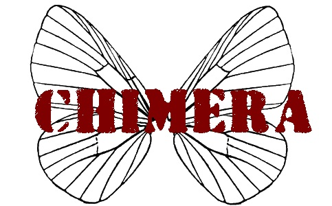
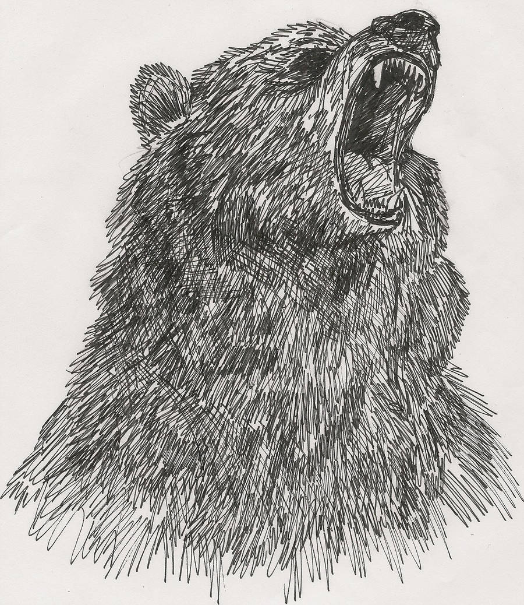
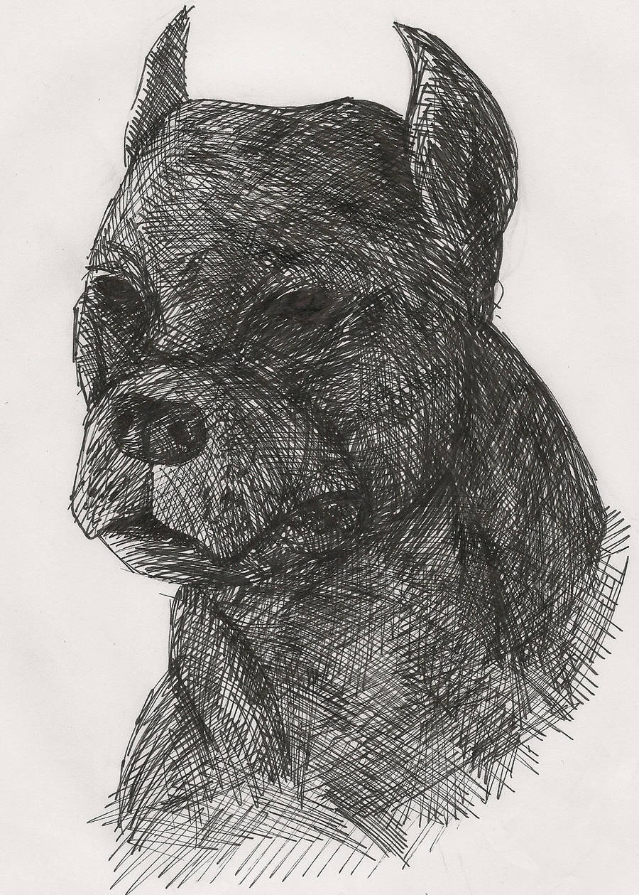
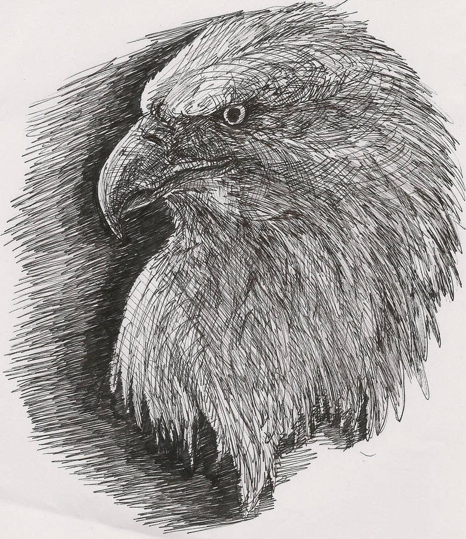
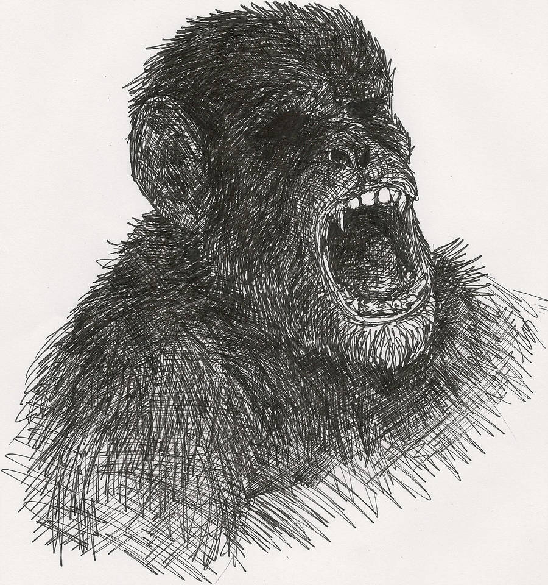

<!--
PNJs :
	homme de main ("G") → devient gorille à la fin
	le jeune garçon blond et son pickup
    véto
    technicien / coordinteur radio
    femme major sévère (seule fiable ?)
Caracs : complément à 10 animal/psyché
Psyché :
- permet pas de contact préhensible
- -1 / création
- Presence max = 8
- -1 / min si projetee a distance
- -1 par comportment non realiste
- -1 par modification d'apparence
- +1 / min sans projection
	bioradio => télépathie (sans → feuilles et crayons)
	peuvent créer des ghosts (+ ou – crédibles : sans visages...)
	peuvent ne plus percevoir humains ??
    leurs implants contiennent une caméra + radio, ils sont supervisés en permanence par officiers
Système: d8
	papillons → jauge
Lieux :
	couverture: entreprise d'horticulture
        ils y ont leur quartiers personnels, une salle d'entrainement, etc.
Musique :
	Bande originale de Portal 2: _Aperture Science Psychoacoustics Laboratory_ [9999999](https://www.youtube.com/watch?v=wgVTmt6t3hg) & [Reconstructing More Science](https://www.youtube.com/watch?v=WAeiqxNH3W0)
	[Rising Doom de Mondkopf](https://www.youtube.com/playlist?list=PL16FB92C9DFC1A076)
Scène intro:
    > Ok, l'enregistrement a démarré. Nous sommes le <date>.
    > Ceci est la première opération sur le terrain de l'unité tactique Chimera.
    > Soldat ___, êtes vous opérationnel ?
    > Êtes-vous prêt à accomplir votre mission, et à obéir scrupuleusement à mes ordres ?
Cas de conscience scénaristiques:
    civils
    femme avec bébé
    tuer d'autres animaux
    couler bateau Greenpeace
    éliminer une autre Chimère qui tente de s'échapper
    -> secret: pour s'enfuir, il faut détruire drones-relais puis désactiver chirurgicalement implant radio
Secrets: ne sont pas des animaux doués de consciences, leur exoarmure contient un cerveau humain
Envies des PJs:
    Retourner à la vie sauvage, perdre cette conscience lourde à porter
    Liberté de choix
    Être traité en égaux des hommes
    Vengeance
Code moral:
    Loyauté (envers créateurs / patrie ?)
    Tuer
    Famille
    Altruisme (envers semblables / humains ?)
    Loi du plus fort
    Equité
    Justice
    Pardon
Leur instinct reprend le dessus:
    Hurler
    Fuir
    Couiner ou Grogner
    Charger
Souvenirs
Exoarmures
    armes à feu
    griffes
    ...
-->
# 
Vous êtes des animaux cybernétiques, créés par l'armée pour accomplir ses basses oeuvres.
Plus intelligent que des drones, mais sans scrupules humains.
Vous êtes surentrainés, surarmés et dotés de camouflages tactiques.
Mais êtes-vous voué à servir pour toujours ?

:::center
_Ce jeu de rôle vous propose d'incarner des animaux en exo-armures inspirés de la BD [We3](https://en.wikipedia.org/wiki/We3)._
:::

::::: grid
:::: grid-item
## Sous-titre
d6    | 
------|-
~~⚀~~ | 
~~⚁~~ | 
~~⚂~~ | 
~~⚃~~ | 
~~⚄~~ | 
~~⚅~~ | 
::::
:::::

::: page-break
:::

:::: flex-columns
::: cybanimal

<dl>
  <dt>Nom de code:</dt><dd>Arcas</dd>
  <dt>Agilité:</dt><dd></dd>
  <dt>Discrétion:</dt><dd></dd>
  <dt>Férocité:</dt><dd></dd>
  <dt>Vivacité:</dt><dd></dd>
</dl>
:::

::: cybanimal

<dl>
  <dt>Nom de code:</dt><dd>Maera</dd>
  <dt>Agilité:</dt><dd></dd>
  <dt>Discrétion:</dt><dd></dd>
  <dt>Férocité:</dt><dd></dd>
  <dt>Vivacité:</dt><dd></dd>
</dl>
:::

::: cybanimal

<dl>
  <dt>Nom de code:</dt><dd>Éthon</dd>
  <dt>Agilité:</dt><dd></dd>
  <dt>Discrétion:</dt><dd></dd>
  <dt>Férocité:</dt><dd></dd>
  <dt>Vivacité:</dt><dd></dd>
</dl>
:::

::: cybanimal

<dl>
  <dt>Nom de code:</dt><dd>Cercop</dd>
  <dt>Agilité:</dt><dd></dd>
  <dt>Discrétion:</dt><dd></dd>
  <dt>Férocité:</dt><dd></dd>
  <dt>Vivacité:</dt><dd></dd>
</dl>
:::
::::

::: hand-fingerprints

:::
## Section réservée au MJ

:::: footer
Un jeu de Lucas Cimon - [CC BY 4.0](http://creativecommons.org/licenses/by/4.0/)

Merci à ... pour le _playtest_ et vos suggestions inspirées.

Portraits d'animaux de [Master Blek](https://www.deviantart.com/masterblek) - [CC BY-SA 3.0](https://creativecommons.org/licenses/by-sa/3.0/)

Polices: 
::::
:::::

