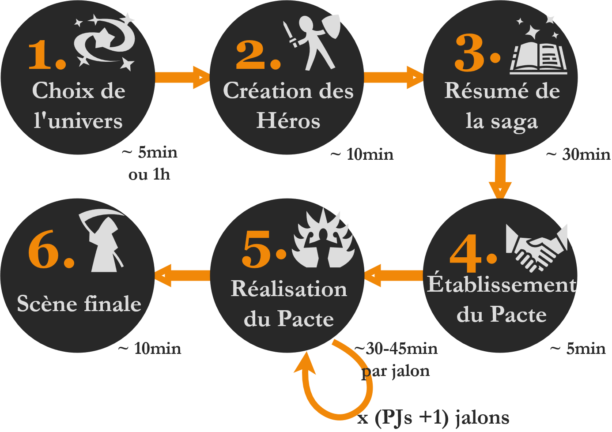
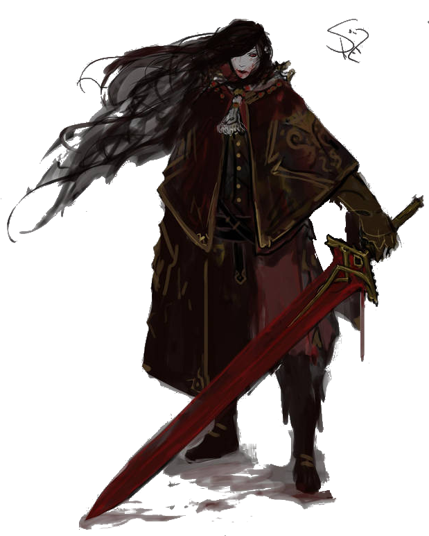
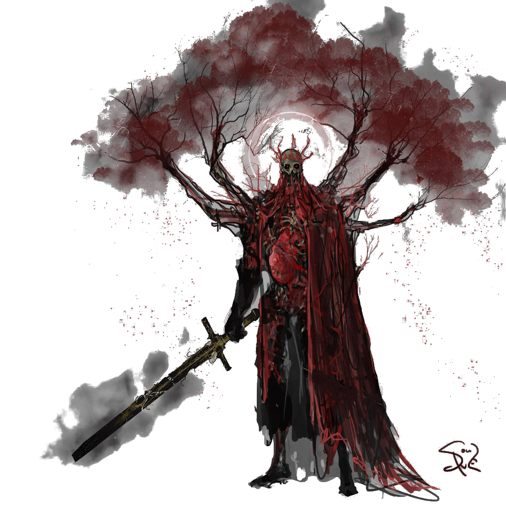
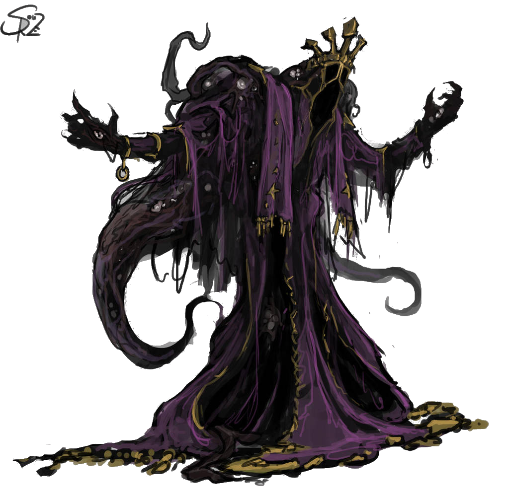
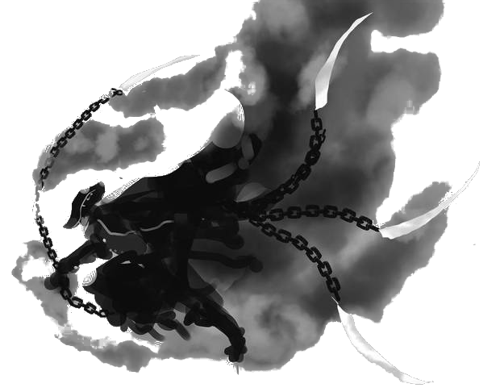
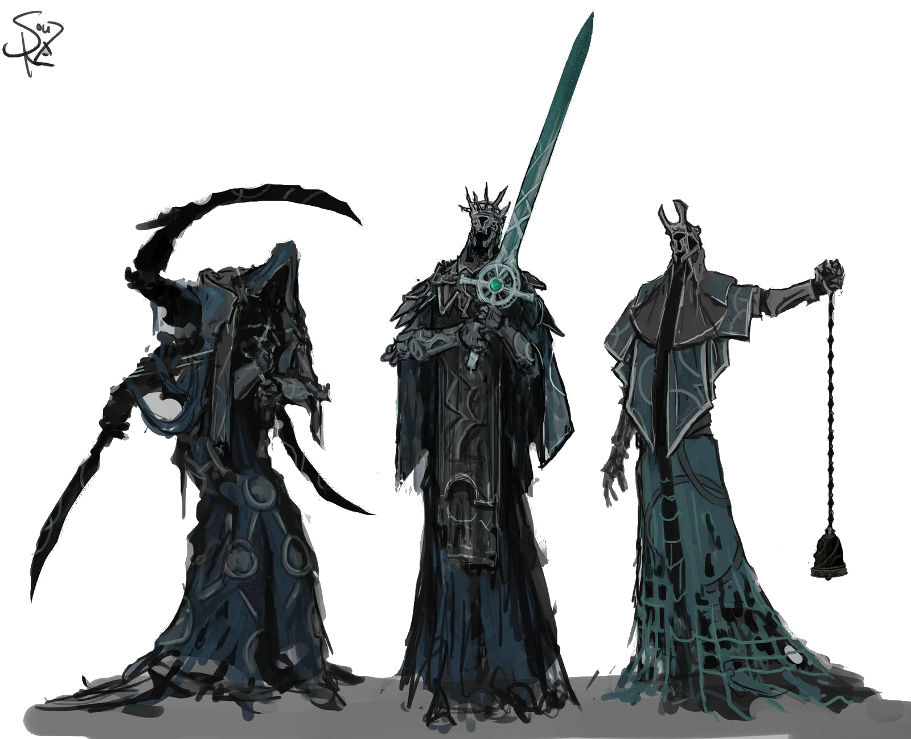

<!--
- com' sur:
  * [x] https://www.500nuancesdegeek.fr
  * [x] http://www.taverneproduction.com/forum/
  * [x] https://www.casusno.fr
  * [ ] http://www.subasylum.com/Antoniobay/viewforum.php?f=3
- 5 badges à utiliser si besoin: https://www.deviantart.com/halycon450/gallery/61391348/The-King-s-Court
- envisager publi & print-on-demande sur lulu, DriveThruRPG...
- English version -> post on RPGDesign, http://story-games.com

# Playtest n°1: Cédric, Matthieu, Simon - univers inventé

# Playtest n°2: Henri, Loïc, Thomas - japon féodal fantastique
- Hosiano - Découvir la contrée cachée de Blaitero - Attaches: village, défendre les faibles (pas employé) - Atouts: dexterité, stratège
- Shigeru - Lever malédiction qui pèse sur son village - Attaches: village, ancien disciple - Atouts: bushido, amulette magique
- Redishiro - Tuer le général Kemposhi - Attaches: sa femme disparue, legacy of his master - Atouts: sortilège de changement d'apparence, pouvoir de posession d'un corps

# Playtest n°3: Loïc & Matthieu - univers inventé
- Univers:
  * inspis légendes arthuriennes, robin des bois
  * magie: légendaire -> sorcières, fées, etc.
  * géographie: archipel
  * factions: ordre Balaguère, Royaume Frye, Baronnies, marchands de la Hanse...
  * créatures: peuple loup, peuple aquatique d'humanoïdes à branchies
  * dieux & légendes: esprit loup, esprit des vents (calme mais colérique, aigri car oublié, tombé dans l'oubli),
  dieu de la mer & de la mort, les Patriaches (premiers hommes)
  * antagoniste qui se dessine à travers les flashbacks: Baron Kottler, actuellement régent de l'île Sud
- Héros:
  * Eric: veut libérer l'île Hopling de l'envahisseur, et en particulier le baron Kottler.
  Atouts: capitaine Huygens, qui se révelera un pianiste émérite; peau d'homme-loup; épée-foudre du patriarche Sicarius
  * Sig: veut libérer son peuple des Hommes-Vers
  Atouts: armure du dieu du vent; potion de bile de maquereau; oiseau des dieux
- Pacte: Angus, Patriarche du peuple des mers, les envoie former une alliance en ralliant 3 autres Patriarches:
  Rowa, du peuple loup; Senett des Femmes-Hurondelles; Jaco, roi des pirates.
- Feedbacks:
  * prépa longue
  * flashbacks sympas - Suggestion: selection parmis choix multiples
  * dans la 2e partie de la table de résolution, un échec a peu d'intérêt
  suggestion: insister sur la dimension tactique de choisir une mauvaise issue à une jet
  * prouesses héroïques pas employées
  -> les transformer en "jokers" plus _freeform_ permettant aux joueurs d'introduire de nouveaux éléments à l'histoire, ainsi que +1 dé au jet
  * les élements narratifs introduits par les jets de dés ne nuisent pas à la cohérence de l'histoire
  * bon ressenti "amère victoire"
  * suggestion: les Atouts pourraient fournir un bonus dans la scène finale
  * idée: modifier la table de résolution pour faire intervenir des Atouts encore non employés dans l'histoire
-->
# Ameres Victoires & Glorieuses Defaites

:::: block-centered limited-width rules
Dans ce court jeu de rôle, les joueurs incarnent les héro·ïnes d'une saga épique et tragique, au dernier chapitre de leur périple.
Ils ont traversé bien des aventures ensembles, et arrivent au terme de leurs quêtes respectives,
où ils devront faire des choix cornéliens pour y apporter une conclusion.

### Jeu de rôle ?
Si vous ne connaissez pas encore ce type de jeu, commencez par lire [la définition du JdR de la FFJdR](http://www.ffjdr.org/ce-devez-savoir-jeu-role/definitions-du-jeu-role/)
ou [ce micro-JdR explicatif de Epidiah Ravachol](https://dig1000holes.files.wordpress.com/2013/04/qequjdr.pdf).
Voici quelques abréviations employées par la suite :
- MJ = Meneur de Jeu
- PJ = Personnage d'un Joueur

### Ce dont vous aurez besoin
- un MJ + 2 à 4 autre joueurs, et entre 2h et 4h devant vous
- ce jeu imprimé (au moins la table de résolution et les feuilles de personnage) et des crayons
- une dizaine de dés à 6 faces (_d6_)
- des pions quelconques qui serviront à représenter les **jalons du Pacte** (autant que de joueurs)

## Déroulement de la partie

<map name="toc">
  <area shape="circle" coords="87,86,85" href="#choix-dun-univers" alt="Choix d'un univers"/>
  <area shape="circle" coords="318,86,85" href="#cr-ation-des-h-ro--nes" alt="Création des Héro·ïnes"/>
  <area shape="circle" coords="555,86,85" href="#r-sum--de-la-saga" alt="Résumé de la saga"/>
  <area shape="circle" coords="555,308,85" href="#le-pacte" alt="Établissement du Pacte"/>
  <area shape="circle" coords="318,308,85" href="#jets-de-d-s" alt="Réalisation du Pacte"/>
  <area shape="circle" coords="87,308,85" href="#sc-ne-finale" alt="Scène finale"/>
</map>

Vous pouvez vous rendre aux sections correspondantes en cliquant sur les cercles ci-dessus.

### Choix d'un univers
::: float-right insert variant
Vous pouvez aussi décider de créer un univers collectivement en début de partie !

Vous trouverez [à la fin de ce document](#un-univers-cr%C3%A9%C3%A9-en-90min) un exemple d'univers créé ainsi durant une partie de _playtest_,
avec quelques indications sur la manière dont on s'y est pris.
:::

Le MJ décrit aux autres joueurs l'univers dans lequel se déroulera la partie.
Il peut s'agir par exemple d'un univers existant d’œuvre de fiction.
Il leur donne rapidement quelques éléments de la géographie, de l'histoire et de la mythologie,
de la technologie, des croyances, des factions, etc. de cet univers.

### Création des Héro·ïnes
Chaque joueur va incarner un **héro** ou une **héroïne**,
aux capacités surhumaines et déjà renommé comme une légende vivante pour ses exploits.

Inscrivez sur votre [feuille de personnage](#hero-sheet) :

- son **nom**
- son **apparence**
- un **Noeud du Destin** qu'il pourra utiliser dans la partie.
Ils sont décrits dans la section suivante.
- son **Objectif** : la quête du personnage, ce qu'il tente d'accomplir concrètement.
Il doit être ambitieux mais réalisable durant la partie.

En manque d'inspiration ? Lancez _1d6_ et reportez-vous à la liste suivante, en ignorant les lignes déjà obtenues :
::: float-right insert random-tables
A plusieur reprises dans ce jeu, vous aurez à lancer _1d6_ puis à vous reporter à une table "en ignorant les lignes déjà obtenues".
La 1ère fois c'est très simple, reportez simplement le résultat de votre dé dans la table,
puis **cochez** la ligne correspondante.
La prochaine fois qu'un joueur fera un jet dedans, il "sautera" cette ligne pour déterminer la nouvelle ligne obtenue.

Si par exemple vous aviez obtenu un **3** sur votre dé, et que le joueur suivant obtient un **5**,
il lira ce qui se trouve dans la **6e** ligne.
:::
::: headless-table
1  | la vengeance : ... doit payer pour ...
---|-
2  | libérer le peuple ... opprimé par ...
3  | découvrir la vérité sur légende de / les événements de ...
4  | retrouver le trésor perdu de ...
5  | lever la malédiction qui affecte ...
6  | découvrir la contrée mythique de ...
7  | ramener à la vie ...
8  | détrôner le tyran ...

<!--
- sa **Pierre Angulaire** : il s'agit de la raison de vivre - menacée au cours de la saga - ou de la valeur morale primordiale du Héro.
En manque d'inspiration ? Lancez _1d6_ et reportez-vous à la liste suivante, en ignorant les lignes déjà obtenues :
  + est fidèle à son dieu
  + suit un code de l'honneur (ex: bushido)
  + ne jure que par l'argent
  + a fait la promesse de ... à ...
  + a un sens aigu de la justice
  + non violent

En lien avec sa **Pierre Angulaire**, chaque joueur doit lister **deux choses que ne ferait jamais son Héro**.
-->

Si vous êtes en panne d'inspiration, la table suivante peut également vous donner des idées d'archétypes de personnages :
::: headless-table
1  | la guerrière qui survécu à trop de batailles, vu trop de morts, et à juré de ...
---|-
2  | la (quasi ?) dernière survivante de son peuple, qui a tragiquement...
3  | la voleuse au grand cœur, qui a un faible pour ...
4  | l'héro·ïne qui a déjà sauvé mainte fois son peuple, tirée de sa retraite pour ...
5  | la paria, rejetée par les siens à cause de ...
6  | la veuve, qui a perdu son compagnon lors de ...
:::

<!--
### Prouesses héroïques

::: headless-table
1  | votre Héro s'avance triomphalement devant une armée / à travers une ville, ameutant la foule sur ses pas
---|-
2  | votre Héro est capable de deviner les points faibles de ses adversaires. \
   | Une fois dans la partie, demandez au MJ quelles sont les failles d'un ennemi et il vous répondra honnêtement.
3  | un personnage allié surgit pour vous sauver la mise. Il vous devait bien ça. Pourquoi, et comment se fait-il qu'il soit ici ? \
   | A vous de décider, ou de laisser la suite des événements le révéler.
4  | votre Héro triomphe d'un adversaire ou d'un obstacle et obtient immédiatement le respect absolu de tous les PNJs présents
5  | votre Héro se met dans une colère noire et terrorise tous les PNJs présents
6  | votre Héro est un fin stratège capable d'anticiper les coups de ses adversaires. \
   | Vous avez le droit de poser une question sur comment passer un obstacle au MJ et il vous répondra honnêtement.
7  | votre Héro devient BERSERK : dans quelques secondes, il attaquera le personnage le plus proche jusqu'à le rendre inconscient
8  | les lamentations de votre Héro donnent lieu à un miracle : quelqu'un est ramené à la vie, des chaînes sont brisées, un PNJ retrouve la raison...
9  | votre Héro retourne son adversaire à sa cause. Quelle corde sensible parvient-il à toucher ? A vous de le décrire.
10 | un Atout de votre Héro devient surpuissant : vous pouvez désormais ajouter 2d6 quand vous l'employez. \
   | A vous de décrire comment / pourquoi cela arrive.
:::
-->

### Noeuds du Destin

Les Noeuds représentent la capacité des Héro·ïnes à influer sur le Destin.
À modifier le déroulement de l'histoire pour que le "hasard" les avantage,
en provoquant l'apparition d'événements ou d'alliés inattendus.

Chaque Noeud n'est utilisable qu'une seule et unique fois dans la partie.
Vous pouvez le déclencher à n'importe quel moment, et décrire de quelle manière il se manifeste dans la scène en cours.
Vous avez toute liberté pour décrire avec fracas l'arrivée, l'origine ou les motivations de nouveaux personnages,
mais une fois votre description terminée le MJ aura tout contrôle sur eux.
Enfin, vous disposez d'un bonus d'**1d6 supplémentaire** à votreu prochain jet de dé si votre Héro·ïne tourne cet événement à son avantage.

A la création vous n'en disposez que d'un seul. Lancez _1d6_ et reportez-vous à la liste suivante, en ignorant les lignes déjà obtenues :

::: headless-table
1  | un personnage du passé d'un·e Héro·ïne intervient, lui rappelant une dette ou un engagement.
---|-
2  | introduisez dans l'histoire un moyen de transport non encore mentionné.
3  | un personnage retourne sa veste et change de camp : pourquoi ?
4  | introduisez une malédiction ou un sortilège affectant un lieu; \
   | si vous jouez dans un univers sans magie, il s'agit d'une expérimentation high-tech qui a mal tourné.
5  | un ou plusieurs personnages surgissent et bousculent l'équilibre d'un conflit; à vous de définir qui et leurs intentions.
6  | introduisez un nouveau puissant artefact.
7  | décrivez un effet de foule de votre choix : colère, terreur, mobilisation, vivas...
8  | introduisez une créature monstrueuse ou mythique, à travers une légende, un obstacle ou directement dans l'action.
9  | une puissance divine ou surnaturelle intervient; décrivez comment et pourquoi.
:::

### Résumé de la saga
La partie commence alors que les Héro·ïnes sont regroupés autour d'un feu.
Un personnage ne payant pas de mine s'approche d'eux, curieux. Il a entendu parler de leurs exploits.

Ce personnage est le **PMJ**, le personnage du MJ, qui a un rôle uniquement dans cette phase d'introduction,
et éventuellement dans la **Scène finale**.

Il peut s'agir d'un vagabond, d'un ménestrel, d'un moine scribe, d'un journaliste...
N'importe qui à qui les Héro·ïnes feront suffisamment confiance pour lui raconter quelques anecdotes de leurs aventures.

Durant cette phase, le MJ va donc, par l'intermédiaire de ce PMJ, interroger les joueurs sur le passé de leurs Héro·ïnes.
Pour eux, c'est l'occasion d'obtenir des **Atouts** au travers de **Flashbacks** (cf. section suivante).

Le PMJ va donc animer la discussion, pour faire en sorte que chaque Héro·ïne raconte **trois Flashbacks**.
Les joueurs sont également encouragés à se poser des questions entre eux pour déclencher des Flashbacks :

> Tu te souviens, peu après qu'on se soit rencontrés, lorsque ce capitaine de la garde t'as défié en duel ?

### Flashbacks
Les **Flashbacks** sont l'occasion pour les joueurs de décrire les aventures passées de leurs Héro·ïnes,
et notamment de définir leurs **Atouts**.

Une question est posée à un joueur sur le passé de son Héro·ïne.
Une question personnalisée est idéale, en rebondissant sur ce qui a déjà dit,
mais la table suivante peut donner des idées en cas de panne d'inspiration, surtout en début de partie :
::: headless-table
1  | Pourquoi les habitants de ... te haïssent autant / te considèrent comme leur héro·ïne ?
---|-
2  | La rumeur court que tu possèdes une artefact unique... De quoi s'agit-il et comment l'as-tu obtenu ?
3  | La rumeur court que tu possèdes une capacité unique... De quoi s'agit-il et comment l'as-tu obtenue ?
4  | Qui a été ton maître et t'a appris tout ce que tu sais ?
5  | Quelle personne est chère à ton cœur ?
6  | Il paraît que quelqu'un te traque et veut ta peau. Qui-est-ce et pourquoi ?
:::

Une fois la question énoncée, au joueur de répondre comme il l'entend.
Il a néanmoins comme contrainte d'introduire dans sa narration un **Atout** :
un objet de grande valeur sentimentale rendant l'Héro·ïne redoutable, ou un personnage l'accompagnant dans sa quête.
Cet Atout a une histoire et a tant de valeur eux yeux de l'Héro·ïne que le perdre serait une tragédie.

En manque d'inspiration ? Lancez _1d6_ et reportez-vous à la liste suivante, en ignorant les lignes déjà obtenues :
::: headless-table
1  | l'Héro·ïne est accompagnée de son jeune disciple surdoué en ...
---|-
2  | l'Héro·ïne possède un très vieux livre antique, précieux mais maudit, qu'elle a juré de ramener à la bibliothèque de la Citadelle au péril de sa vie
3  | la foi de l'Héro·ïne en son dieu lui procure le pouvoir d'invoquer un élément : foudre, vague de feu, tempête...
4  | née d'un peuple esclave, l'Héro·ïne est leur élue : elle a le don de faire entendre sa voix dans leur tête et a juré de les libérer
5  | l'Héro·ïne est une redoutable guerrière au code de l'honneur strict comme le Bushido
6  | en jurant de servir le démon-dieu ... l'Héro·ïne a obtenu la capacité de pouvoir hypnotiser quiconque d'un regard
7  | l'Héro·ïne possède une arme gigantesque / volante / les deux : c'est la dernière restante du clan et son maître lui a confié
8  | l'amulette que lui a donné sa mère, son dernier souvenir d'elle, permet à l'Héro·ïne de donner vie à la matière inerte
9  | l'Héro·ïne est accompagnée d'un destrier / compagnon animal magique
10 | pour garantir la survie de ... l'Héro·ïne porte une malédiction: tout ce qui est vivant tombe en cendres lorsqu'elle le touche
:::

### Le Pacte
::: float-right insert variant
Dans les exemples fournis, les jalons du Pacte ont toutes la même structure.
Il aussi possible de décomposer la quête en phases plus variées.
Par exemple pour **trouver le trésor de ...** en 4 étapes : trouver des archives qui le mentionnent ;
trouver un savant pour les traduire et situer le lieu ; le convaincre de le faire ; se rendre sur place.
:::
Le MJ définit alors le Pacte qu'il va sceller avec les Héro·ïnes, c'est-à-dire une mission épique précise.
Il doit donner lieu à des scènes héroïques, mais gardez en tête qu'il doit être réalisable en une session,
qui à accélerer le rythme de l'histoire.

Chaque Pacte doit pouvoir être accomplis en N jalons, N correspondant au nombre de PJs + 1,
et donc au nombre de jetons de jalons du Pacte qui sera distribué.

Vous pouvez, au choix, lancer _1d6_ dans l'une des tables suivantes,
ou bien simplement vous en inspirer pour proposer un Pacte aux joueurs,
en vous basant sur leurs Objectifs pour trouver celui qui y correspond le mieux.

::: float-right floats-clear
d6 | Pactes pour une partie "musclée"
---|-
1  | Mettre à terre les Colosses Vivants
2  | Assassiner les responsable de la tragédie de ...
3  | Occire les commandants de l'armée ...
4  | Capturer les dieux élémentaires protecteur de ...
5  | Faire prisonnier les chefs de la résistance à ...
6  | Libérer les villes occupées par ...
:::

d6 | Idées de pactes
---|-
1  | Rassembler les os du dernier des dragons, transformés en reliques vénérées / armes / artefacts magiques
2  | Convaincre les anciens héros de sortir de leur retraite pour affronter ...
3  | Obtenir l'approbation / le vote des seigneurs pour appuyer votre demande au roi de ...
4  | Rassembler les informations suffisantes (manuscrits, témoignages...) pour accomplir le rituel de ...
5  | Retracer le parcours du légendaire ..., étape après étape, pour comprendre qui l'a amené à ...
6  | Obtenir les aveux des commanditaires de ...

::: floats-clear
En fonction du pacte et de l'univers, choisissez l'identité secrète de votre PMJ :
- un mystérieux commanditaire souhaitant engager les Héro·ïnes
- un puissant sorcier
- un dieu (de la Mort, de la Ruse, de la Justice...) mettant au défi les Héro·ïnes, ou complotant contre un autre dieu
- un démon tentateur, intéressé par les âmes des Héro·ïnes
- un ange, interdit d'intervenir directement dans les affaires des mortels, mais recrutant les Héro·ïnes néanmoins 
- un être illuminé, ayant accédé au statut de conscience supérieure (ex: Anciens dans SG1, fantôme de jedi...)
:::

::: float-right insert variant
Il est également tout à fait possible d'établir le Pacte comme une règle de jeu "méta",
sans incidence dans l'univers de la partie et donc sans PMJ personnifiant cet accord tacite.
Le MJ s'adresse alors aux joueurs et non aux PJs, telle une [Moire](https://fr.wikipedia.org/wiki/Moires) tissant leur destins...

De même, le lien entre le **Pacte** et les **Objectifs** des Héro·ïnes peut être plus ou moins cohérent,
selon votre inspiration du moment. Idéalement ils sont intimement liés, le Pacte formant les étapes nécessaires
pour que les Héro·ïnes accomplissent leurs Objectifs. Mais tant pis si le lien est ténu,
après tout les mystérieux plans du tout puissant PMJ sont insondables...
:::

Révélez alors votre nature aux Héro·ïnes, à grand renforts d'effets spéciaux.

Proposez-leur votre Pacte, ce qu'ils doivent accomplir pour vous et vos conditions,
en échange de quoi ils obtiendront chacun ce qu'ils cherchent.

Vous pouvez lâchez théâtralement au centre de la table autant de jetons symbolisant les **jalonss du Pacte** que le nombre de PJs + 1.
Ces pions symbolisent les objectifs à atteindre pour accomplir le Pacte.

A partir de ce moment, vous pouvez d'or et déjà vous creuser la tête sur comment vous allez, lors de la Scène finale,
donner l'opportunité à tous les Héro·ïnes d'accomplir leurs Objectifs en un seul lieu...

### Jets de dés
Lorsqu'un·e Héro·ïne tente d'accomplir une action risquée, le joueur lance **3d6 blancs**.

S'il emploie certains de ses **Atouts** pour accomplir cette action,
il ajoute **1d6 par Atout employé**.

Une fois les résultats obtenus, le joueur place ensuite 3 dés dans la partie supérieure de la **[table de résolution](#table-de-resolution)**.
Le dé placé au sommet de la table détermine:
- le **résultat de l'action** : réussite sur un 5 ou un 6, échec sinon
- dans **quelle colonne de la table placer les autres dés** : en cas de réussite les autres d6
  doivent être placés **tous à gauche ** dans la table, et **tous à droite** en cas d'échec.

  Notez qu'il peut être stratégique de parfois choisir qu'une action échoue
  afin d'obtenir des avantages uniquement présents dans la colonne de droite.

La deuxième ligne détermine les conséquences de l'action :
- si un dé de valeur 4, 5 ou 6 est placé ici :
  * en cas de succès de l'action entreprise, il s'agit d'une **réussite ÉPIQUE** !
    Au joueur de décrire comment son Héro·ïne accomplit son objectif avec panache
  * en cas d'échec de l'action, et si l'Héro·ïne possède un Atout qu'il n'a pas encoré employé,
    il révèle celui-ci et évite le pire ce faisant ! Au joueur de décrire comment il s'en sort _in extremis_.

    Si l'Héro·ïne a déjà employé une fois tous ces Atouts, il peut **obtenir un nouvel Atout**.
    Selon la situationn il peut s'agir d'un artefact présent dans les lieux, d'une arme volée à un adversaire,
    ou encore d'un objet que l'Héro·ïne possédait déjà, et dont un Flashback expliquera l'origine.
    En pratique, avant la description du MJ du résultat de l'action, les autres joueurs émettent leurs propositions,
    et le joueur ayant effectué le jet choisit parmis elles. Si l'option "Flashback" est retenue, la manière dont l'Atout a été
    acquis est décrite dans la scène suivante, pour ne pas casser le rythme de l'action.
- sinon, si le dé est de valeur 1, 2 ou 3, il s'agit d'une **complication** : que l'action soit réussie ou non,
  quelque chose tourne mal tout de même...
  Selon la colonne, le MJ ou n'importe quel autre joueur autour de la table a la parole pour décrire cette complication.

La troisième ligne révèle de potentielles opportunités. Selon si l'action est réussie à la valeur du dé placé ici :
- l'action peut se révéler **ouvrir une porte vers la réalisation du Pacte**.
  Au MJ d'expliquer alors comment cela avance les PJs rapidement vers une opportunité d'accomplir un jalon du Pacte.
- l'action entreprise peut également donner une opportunité **à un·e autre Héro·ïne** :
  diversion, attaque combinée, bluff... le joueur explique quelle synergie est créée avec quel autre Héro·ïne.
- le joueur peut obtenir un nouveau **Noeud du Destin**, aléatoirement en effectuant le même jet qu'à la création de son Héro·ïne.
- enfin l'Héro·ïne peut être **incapacité** : assommé, immobilisé, paralysé, inconscient...
  Le MJ explique ce qui lui arrive.

### Accomplir un jalon du Pacte

Lorsqu'un·e Héro·ïne est en position d'accomplir une action qui pourrait lui permettre d'accomplir un jalon du Pacte,
il doit l'annoncer, et on replie alors la table de résolution.

Il doit alors **mettre en jeu** un **Atout**.
S'il n'en a pas, il ne pourra pas accomplir de jalon du Pacte.

Il lance alors **4d6 blancs**, plus d'éventuels dés supplémentaires en fonctions de ses Atouts,
et place 4 dés parmi les résultats dans la table repliée :
- **un·e autre Héro·ïne peut perdre un Atout** : celui-ci est enlevé ou volé par une créature, qui peut alors éventuellement s'en servir
- il peut être **incapacité**, et alors un·e autre Héro·ïne peut **prendre le relais**.
Encore une fois, c'est au joueur d'expliquer comment ce PJ a désormais l'occasion d'accomplir un jalon du Pacte.
- enfin, il peut **perdre l'Atout qu'il a misé** à jamais, détruit sous ses yeux

Si le dé placé dans la première ligne indique une réussite,
alors le jalon est accomplit, et les joueurs retirent un des jetons correspondant du centre de la table.

::: float-right insert variant
Si jamais un·e Héro·ïne meurt en cours de partie, il pourra tout de même aider ses camarades par-delà la mort :
une fois par demi-heure, il peut accorder un bonus d'_1d6_ supplémentaire au jet d'un joueur.
:::

### Scène finale
Lorsque le dernier jeton de jalon du Pacte a été défaussé, le MJ introduit la **Scène finale**.

Comme promis au début de la partie, cette scène doit être l'occasion pour tous les Héro·ïnes d'accomplir leurs **Objectifs**.
Le MJ décrit le lieu, les personnages présents et brièvement comment les Héro·ïnes sont arrivés ici pendant cette ellipse temporelle.

Ensuite, chaque joueur va miser secrètement pour la résolution qu'il souhaite pour cette scène parmi les choix suivant :

::: headless-table
1  | **Tous les Objectifs** sont accomplis, mais **deux Héro·ïnes y laissent la vie**.\
   | Ils sont tirés au hasard parmi les joueurs ayant choisi cette option
---|-
2  | **Un·e Héro·ïne perd la vie**, tiré au hasard parmi les joueurs ayant choisi cette option. \
   | **Les Objectifs des autres Héro·ïnes** sont accomplis.
3  | **Un·e seul·e Héro·ïne accomplit son objectif**. \
   | Si plusieurs joueurs choisissent cette option, ce·tte Héro·ïne est tiré au hasard parmi eux, mais **il y laisse alors la vie**
:::

Une fois les votes révélés, c'est **l'option de valeur la plus élevée** ayant reçu au moins un vote qui l'emporte.
On effectue alors le ou les jets aléatoires requis pour déterminer les Héro·ïnes / Objectifs concernés.

Ensuite, en commençant par ces Héro·ïnes,
chaque joueur prend alors la parole pour décrire ce qu'il advient de son Héro·ïne au cours de cette scène et après,
en complétant ce que le précédent vient de décrire.

## Sources & remerciements

_Amères victoires & glorieuses défaites_ est un jeu de Lucas Cimon
sous license <a rel="license" href="http://creativecommons.org/licenses/by/4.0/">Creative Commons Attribution 4.0 International</a>.

- le diagramme a été réalisé avec [draw.io](https://www.draw.io) - Apache 2.0 open-source license
- la plupart des illustrations proviennent du projet _King's Court_ de [Ramirez de Souza](https://www.deviantart.com/halycon450) et sont [CC BY-NC-SA 3.0](https://creativecommons.org/licenses/by-nc-sa/3.0/) :
  [Stormchaser Proving Grounds](https://www.deviantart.com/halycon450/art/Stormchaser-Proving-Grounds-656936393),
  [Elaina (Court Attire I)](https://www.deviantart.com/halycon450/art/Elaina-Court-Attire-I-741341846),
  [Royal Mistwalker](https://www.deviantart.com/halycon450/art/Royal-Mistwalker-752957922),
  [Coalescence of Immemorial Nightmares - Yodth](https://www.deviantart.com/halycon450/art/Coalescence-of-Immemorial-Nightmares-Yodth-744365909),
  [Schismatic Astronomer](https://www.deviantart.com/halycon450/art/Schismatic-Astronomer-662020562),
  [Plague-ridden Sentinel](https://www.deviantart.com/halycon450/art/Plague-ridden-Sentinel-758686059)
  et [Lightless Conspirators](https://www.deviantart.com/halycon450/art/Lightless-Conspirators-742857790)
- les autres illustrations du jeu :
  * crâne couronné issu de "Proverbial Philosophy in four series", Martin Tupper, 1881
  * motifs des dés : [Brusheezy](https://www.brusheezy.com) ([bordures](https://www.brusheezy.com/brushes/58857-20-decorative-border-ps-brushes-abr-vol-2) - [flèches](https://www.brusheezy.com/brushes/18267-arrow-doodles-brushes)) - Brusheezy Standard License
  * les icônes du diagramme proviennent de [game-icons.net](https://game-icons.net) et sont toutes [CC BY 3.0](https://creativecommons.org/licenses/by/3.0/):
    [Star swirl icon](https://game-icons.net/lorc/originals/star-swirl.html) et [Grim reaper icon](https://game-icons.net/lorc/originals/grim-reaper.html) de [Lorc](http://lorcblog.blogspot.com);
    [Spell book icon](https://game-icons.net/delapouite/originals/spell-book.html), [Shaking hands icon](https://game-icons.net/delapouite/originals/shaking-hands.html)
    et [Mighty force icon](https://game-icons.net/delapouite/originals/mighty-force.html) de [Delapuite](https://delapouite.com/);
    [Swordman icon](https://game-icons.net/cathelineau/originals/swordman.html) de Cathelineau.
- les polices employées :
  * [FFF Tusj](http://www.formfett.net/tusj-one-handwritten-font/) par Magnus Cederholm - Free for commercial use
  * [DampfPlatz](http://moorstation.org/typoasis/designers/lloyd/blackjewels/index.htm) par Paul Lloyd - Free for commercial use

Un énorme **MERCI** à mes relecteurs & _playtesteurs_ :
Matthieu, Simon, Cédric, Henri, Thomas.
Ce jeu n'existerait pas sans vous, et il ne serait certainement pas aussi fun sans vos précieux retours !

Mes inspirations notables : [Psi*Run](https://chezsoi.org/lucas/blog/tag/psirun.html) de Meguey Baker pour sa table de résolution géniale;
les [jeux de rôle monopage](http://troplongpaslu.fr) pour la profusion de table aléatoires;
le manga _Berserk_ ainsi que les jeux vidéo _Dark Souls_ et _Shadow of the Colossus_ pour l'univers que j'avais initialement en tête pour le jeu.
::::

:::: on-new-page
::: block-centered limited-width
## Table de résolution
:::
!!!include(resolution-table.html)!!!
::::

!!!include(hero-sheet.html)!!!
!!!include(hero-sheet.html)!!!

<!--
:::: on-new-page block-centered limited-width rules
## Un univers créé en 90min

Le MJ a commencé par lister **quelques sources d'inspirations** connues des joueurs autour de la table,
déterminant que le genre serait celui de la "Dark Fantasy", tendant un peu vers le "Post-Apo" ou le "Steampunk".

Par la suite, le MJ a surtout servi d'animateur, s'assurant que tout le monde ait la parole, que les idées convergeaient
et que les différents aspects de l'univers étaient évoqués. Il était également scribe, prenant en note devant tout le monde les éléments de l'univers établis collectivement.

Le groupe a commencé à discuter sur la question de **la magie / technologie**.
Après quelques échanges, et en gardant l'esprit du ["Oui et" du théâtre d'improvisation](https://improetc.wordpress.com/2013/10/20/la-regle-du-oui/),
nous établissons ceci :

> Il existe une forme de magie qui permet de donner vie aux machines - et donc une conscience et des sentiments, par le Verbe.
> Les magiciens la pratiquant forment une caste de parias, les Machinistes.
> Ils ont une particularité invisible : leur sang est bleu. D'ailleurs, cette capacité est héréditaire mais peut aussi se transmettre par une cérémonie d'échange du sang.
> Une organisation secrète, l'Engrenages (avec un S... parce que) lutte pour les défendre et les réunir, avec à leur tête l'Horloger.

On imagine alors une **faction antagoniste** :

> L’Église de l’Éclat dirige la plupart des cités de la région.
> Elle est autoritaire et possède une puissance militaire.
> Elle voue un culte à la Lumière, une sorte de plan parallèle qui est aussi le monde des morts.
> D'ailleurs, certains prêtres de cet église sont capable de faire jaillir une lumière magique de leur corps (par la bouche, les yeux, leurs plaies...)
> Néanmoins, leurs grandes cérémonies vouées à asseoir leur influence sont en réalité de vastes mises en scènes truquées.

La question de **faune et de la flore** est évoquée :

> La faune est classique, mais il existe des animaux mécaniques ! Sauvages où domestiqués par l'homme.
> Il existe aussi des créatures humanoïdes rongées par la rouille, des Rouillards.

On aborde ensuite la **mythologie** :

> Il existerait un peuple mystérieux qui seraient à l'origine des Machinistes, les Enfouis.

Puis le gros morceau : **la géographie et les peuples**. On sort alors une autre feuille pour y situer grossièrement les lieux d'importances.

> La région est essentiellement constituée de pleines arides, traversées par un énorme fleuve principal, qui se jette dans un gigantesque lac.
> La plupart des terres sont cultivées et donc précieuses. Notamment labourées par des animaux mécaniques.
> Comme des plus les plaines sont traversées de violentes tempêtes de Rouille, les habitations se concentrent sous terre, ou dans de gigantesques Tours antiques verticales.
> Celles-ci sont généralement dirigée par une Famille aristocratique féodales, plus ou moins tyranniques, vivant aux étages supérieurs dans les nuages.
> Il existe également des peuples nomades, se déplaçant en chars à voiles, et un peuple ayant la mainmise totale sur la navigation sur le Fleuve, les Frippés.

Nous avons conclu en définissant une poignée de **villes importantes** :

> La Ville-Port se situe à l'embouchure du Fleuve et du Grand Lac.
> Penta est une ville constituée de 5 Tours, pendant longtemps en conflit mais récemment unifiées.
> Feropolis est une ville-dépotoir de métal, où certains grands animaux mécaniques viennent mourir, tel un cimetière d'éléphants.
> La Tour Sombre est l'unique Tour construite de mémoire d'homme, où les Machinistes ont le pouvoir.

Enfin, lorsqu'un peu plus tard les joueurs créent leur personnages, la question s'est posée de déterminer leur activité,
et s'ils appartenaient à l'une ou l'autre des factions que nous avions défini.
Comme ils n'arrivaient pas à se décider, nous avons convenu d'établir en 2 minutes des tables aléatoires !

::: float-right
d6 | Occupation
---|-
1  | récupérateur de métal ("scrapper")
2  | capitaine d'armée
3  | chasseur de machines sauvages
4  | universitaire / savant
5  | pilote
6  | voleur
:::

d6 | Origine
---|-
1  | agriculture dans les plaines
2  | nomade
3  | "Fripé"
4  | Machiniste
5  | aristocrate des Tours
6  | Enfoui

Les joueurs étaient plutôt amusés des résultats obtenus, sans pour autant se sentir contraints par eux.
::::
-->

