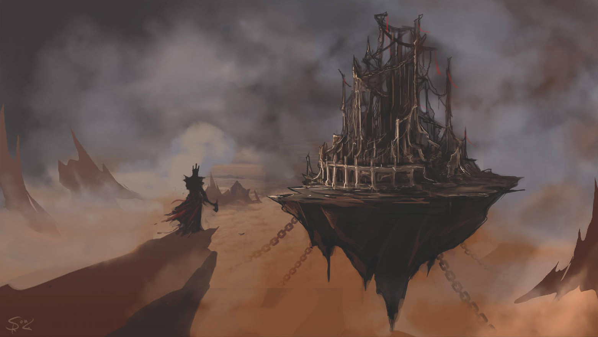
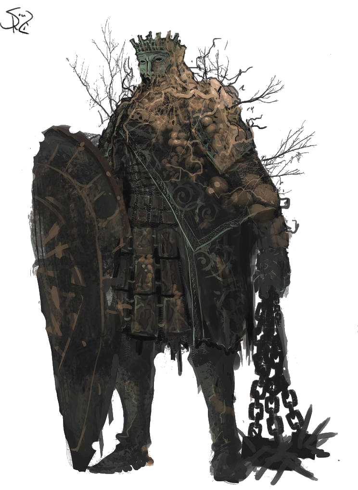

<!--
- travailler un peu plus la mise en page, embellir les FPs
- "sortir" les listes à choix des règles, pour pouvoir les distribuer + facilement
- univers « prêt à jouer » avec Thème, Pacte, suggestion d'Atouts & prompts de Flashbacks
  * pour découvrir Dark Souls, mentionner les intro des 3 jeux Dark Souls (surtout la 1ère)
    & http://www.chroniques-ludiques.fr/dark-souls-analyse-et-explication-de-lhistoire-et-de-son-univers/
    & https://www.warlegend.net/dark-souls-on-vous-explique-l-histoire-avant-dark-souls-iii/
    & https://darksouls.fandom.com/wiki/Dark_Souls_Wiki
  * illus:
    + Ingward: https://zsharpgetsdull.tumblr.com/post/130456124287/inktober-4-ingward-of-dark-souls-holding-the
    + Patches: https://www.zerochan.net/Patches+%28Dark+Souls%29
- com' sur forums :
  * [x] http://www.500nuancesdegeek.fr/forum/viewtopic.php?f=15&t=1318&p=8746
  * [x] http://www.taverneproduction.com/forum/viewtopic.php?f=396&t=4374&p=111172
  * [x] https://www.casusno.fr/viewtopic.php?f=26&t=33804&p=1908602
  * [x] https://www.trictrac.net/forum/sujet/ameres-victoires-glorieuses-defaites
  Analytics: https://itch.io/game/summary/572901
- faire un playtest avec ambiance cyberpunk ?
- envisager publi & print-on-demand sur lulu, DriveThruRPG...
- English version -> post on RPGDesign, http://story-games.com

Autres illus ambiance Dark Souls:
- https://www.deviantart.com/hunternif/art/Defeated-808351770
- https://www.deviantart.com/fernand0fc/art/The-Accursed-829405421
- https://www.deviantart.com/halycon450/art/The-Queen-of-Smiles-807855082
- https://www.deviantart.com/halycon450/art/Cursebound-Knight-796429742
- [Artem Demura](https://www.artstation.com/stargrave)
- 5 badges à utiliser si besoin: https://www.deviantart.com/halycon450/gallery/61391348/The-King-s-Court

# Playtest n°1: Cédric, Matthieu, Simon - univers inventé

# Playtest n°2: Henri, Loïc, Thomas - japon féodal fantastique
- Hosiano - Découvir la contrée cachée de Blaitero - Attaches: village, défendre les faibles (pas employé) - Atouts: dexterité, stratège
- Shigeru - Lever malédiction qui pèse sur son village - Attaches: village, ancien disciple - Atouts: bushido, amulette magique
- Redishiro - Tuer le général Kemposhi - Attaches: sa femme disparue, legacy of his master - Atouts: sortilège de changement d'apparence, pouvoir de posession d'un corps

# Playtest n°3: Loïc & Matthieu - univers inventé
- Univers:
  * inspis légendes arthuriennes, robin des bois
  * magie: légendaire -> sorcières, fées, etc.
  * géographie: archipel
  * factions: ordre Balaguère, Royaume Frye, Baronnies, marchands de la Hanse...
  * créatures: peuple loup, peuple aquatique d'humanoïdes à branchies
  * dieux & légendes: esprit loup, esprit des vents (calme mais colérique, aigri car oublié, tombé dans l'oubli),
  dieu de la mer & de la mort, les Patriaches (premiers hommes)
  * antagoniste qui se dessine à travers les flashbacks: Baron Kottler, actuellement régent de l'île Sud
- Héros:
  * Eric: veut libérer l'île Hopling de l'envahisseur, et en particulier le baron Kottler.
  Atouts: capitaine Huygens, qui se révelera un pianiste émérite; peau d'homme-loup; épée-foudre du patriarche Sicarius
  * Sig: veut libérer son peuple des Hommes-Vers
  Atouts: armure du dieu du vent; potion de bile de maquereau; oiseau des dieux
- Pacte: Angus, Patriarche du peuple des mers, les envoie former une alliance en ralliant 3 autres Patriarches:
  Rowa, du peuple loup; Senett des Femmes-Hurondelles; Jaco, roi des pirates.
- Feedbacks:
  * prépa longue
  * flashbacks sympas - Suggestion: selection parmis choix multiples
  * dans la 2e partie de la table de résolution, un échec a peu d'intérêt
  suggestion: insister sur la dimension tactique de choisir une mauvaise issue à une jet
  * prouesses héroïques pas employées
  -> les transformer en "jokers" plus _freeform_ permettant aux joueurs d'introduire de nouveaux éléments à l'histoire, ainsi que +1 dé au jet
  * les élements narratifs introduits par les jets de dés ne nuisent pas à la cohérence de l'histoire
  * bon ressenti "amère victoire"
  * suggestion: les Atouts pourraient fournir un bonus dans la scène finale
  * idée: modifier la table de résolution pour faire intervenir des Atouts encore non employés dans l'histoire

# Playtest n°4: Héritiers de Dumnacus
cf. https://chezsoi.org/lucas/blog/avgd-nouvelle-mouture.html
+ retours Arnaud par email :
Ton jeu est très bon et nécéssite juste un peu de fignolage pour que les résultats soient plus souvent
"Oui, mais..." et "non, mais..." pour refléter le titre : chaque succès coûte une petite perte (sauf triple 5-6)
et chaque échec apporte un petit bonus (présent ou futur) qui incite à le choisir parfois
(réparer un atout "cassé", gagner un nouvel atout ou un nouveau noeud du destin comme c'est déjà le cas).

Une option serait de durcir les succès et d'accorder plus de dé bonus
(il y a parfois des armes, armures, véhicules ou compagnons qui peuvent servir souvent)

L'idée de Ludo m'a inspiré un truc : chaque personnage pourrait avoir un objectif personnel
(ex : ressusciter sa fiancée) et un objectif "pour le bien commun"/"qui profite à tous"
(ex : tuer le chef de gang qui l'a tuée). Le franchissement d'un Jalon pourrait voir un objectif personnel
être obtenu (et gagner un Atout ou un Noeud ?) tandis que les objectifs "bien commun" seraient validés
lors de la scène finale...
-->
# Ameres Victoires & Glorieuses Defaites

::::: block-centered limited-width rules
Dans ce court jeu de rôle, les joueuses incarnent les héros d'une saga épique et tragique, au dernier chapitre de leur périple.
Ils ont traversé bien des aventures ensembles, et arrivent au terme de leurs quêtes respectives,
où ils devront faire des choix cornéliens pour y apporter une conclusion.

### Jeu de rôle ?
Si vous ne connaissez pas encore ce type de jeu, commencez par lire [la définition du JdR de la FFJdR](http://www.ffjdr.org/ce-devez-savoir-jeu-role/definitions-du-jeu-role/)
ou [ce micro-JdR explicatif d'Epidiah Ravachol](https://dig1000holes.files.wordpress.com/2013/04/qequjdr.pdf).

Voici quelques abréviations & conventions employées par la suite :
- JdR = Jeu de Rôle
- MJ = Meneuse ou Meneur de Jeu
- les joueurs & joueuses autres que la MJ seront désignés par « les Joueuses »
- PJ = Personnage d'une Joueuse, également nommé « Héro », qu'il soit masculin ou féminin

### Ce dont vous aurez besoin
- une MJ + 2 à 4 autre Joueuses, et entre 2h et 4h devant vous
- ce jeu imprimé (au moins la table de résolution et les feuilles de personnage) et des crayons
- une dizaine de dés à 6 faces (_d6_)
- une dizaine de pions quelconques qui serviront à représenter les **jalons du Pacte**

Ce n'est pas nécessaire mais avoir 3 couleurs différentes de dés est idéal :
3 dés de base pour les jets, plus 3 par Joueuse pour les Atouts,
plus une dernière poignée de dés représentant les Flashbacks.
Si vous en avez assez, ces deux derniers types de dés peuvent être posés sur les feuilles de Joueuses
tout le long de la partie.

::: page-break
:::
## Déroulement de la partie

<map name="toc">
  <area shape="circle" coords="87,86,85" href="#choix-dun-univers" alt="Choix d'un univers"/>
  <area shape="circle" coords="318,86,85" href="#cr-ation-des-h-ro--nes" alt="Création des Héros"/>
  <area shape="circle" coords="555,86,85" href="#r-sum-de-la-saga" alt="Résumé de la saga"/>
  <area shape="circle" coords="555,308,85" href="#le-pacte" alt="Établissement du Pacte"/>
  <area shape="circle" coords="318,308,85" href="#jets-de-d-s" alt="Réalisation du Pacte"/>
  <area shape="circle" coords="87,308,85" href="#sc-ne-finale" alt="Scène finale"/>
</map>

Vous pouvez vous rendre aux sections correspondantes en cliquant sur les cercles ci-dessus.

### Choix d'un univers
Commencez par établir ensemble un **thème** fort pour la partie, constitué d'1 à 3 mots clefs.
Ce thème servira de contrainte créative et de gage de cohérence pour tous les éléments fictifs créés par les joueurs autour de la table.
Voici quelques exemples :
- **Bois, Foudre & Métal**
- **Sommeil, Eau & Masques**
- **Feu, Mort & Ténèbres**

La MJ décrit ensuite aux Joueuses l'univers dans lequel se déroulera la partie.
Il peut s'agir par exemple d'un univers existant d’œuvre de fiction.

Alternativement, vous pouvez aussi décider de créer un univers collectivement en début de partie !

Voici une manière d'organiser cette création collaborative en tant que MJ :
- prenez une feuille de papier, ou la [_mind map_](mind-map.html) vierge fournie en aide de jeu,
qui servira à prendre en note ce que vous allez définir collectivement sur l'univers, et une autre feuille blanche qui servira de carte de votre monde
- faites circulez cette carte entre les joueurs, en leur demandant d'y indiquez quelques éléments géographiques clefs :
relief, lacs & mers, forêts, villes, ruines, axes de transport, monuments connus... <!--Pour faire foisonner les idées et éviter l'angoisse de la page blanche, -->
Demandez à ce que chaque joueur ne la garde pas plus de 2min devant lui.
- simultanément, abordez tous ensembles quelques pierres angulaires de votre univers :
climat, mythologie & dieux, niveau technologique / usage de la magie, factions, histoire récente, artefacts & trésors...
Assurez-vous de répartir équitablement la parole entre tous les joueurs, afin que tous émettent des propositions.
Un élément suggéré est adopté si personne n'émet de réserve.
Les joueurs sont invités à exprimer leur soutien aux idées proposées, à rebondir dessus avec de nouveaux éléments,
ou à proposer des alternatives quand certaines idées ne les séduisent pas.

Vous pouvez également faire des propositions en tant que MJ, mais votre rôle est principalement
d'animer la réflexion collective pour éviter les temps morts, et faire office d'arbitre si besoin.

::: page-break
:::
### Création des Héros
Chaque Joueuse va incarner un **héro** ou une **héroïne**,
aux capacités surhumaines et déjà renommé comme une légende vivante pour ses exploits.

Inscrivez sur votre [feuille de personnage](#hero-sheet) :

- son **nom**
- son **apparence**
- son **Objectif** : la quête du personnage, ce qu'il tente d'accomplir concrètement, en lien avec l'univers choisi.
Un Héro peut avoir plusieurs objectifs ambitieux, mais au moins un doit être réalisable durant la partie,
c'est à dire en l'espace de quelques jours dans l'univers du jeu.

En manque d'inspiration pour ce dernier ? Lancez _1d6_ et reportez-vous à la liste suivante, en ignorant les lignes déjà obtenues **\*** :
::: float-right insert random-tables
À plusieurs reprises dans ce jeu, vous aurez à lancer _1d6_ puis à vous reporter à une table "en ignorant les lignes déjà obtenues".
La 1ère fois c'est très simple, reportez simplement le résultat de votre dé dans la table,
puis **cochez** la ligne correspondante.
La prochaine fois qu'une Joueuse fera un jet dedans, il "sautera" cette ligne pour déterminer la nouvelle ligne obtenue.

Si par exemple vous aviez obtenu un **3** sur votre dé, et que la Joueuse suivante obtient un **5**,
il lira ce qui se trouve dans la **6e** ligne.
:::
::: headless-table
1  | la vengeance : ... doit payer pour ...
---|-
2  | libérer le peuple ... opprimé par ...
3  | découvrir la vérité sur légende de / les événements de ...
4  | retrouver le trésor perdu de ...
5  | lever la malédiction qui affecte ...
6  | découvrir la contrée mythique de ...
7  | ramener à la vie ...
8  | détrôner le tyran ...
:::
 

<!--
- sa **Pierre Angulaire** : il s'agit de la raison de vivre - menacée au cours de la saga - ou de la valeur morale primordiale du Héro.
En manque d'inspiration ? Lancez _1d6_ et reportez-vous à la liste suivante, en ignorant les lignes déjà obtenues :
  + est fidèle à son dieu
  + suit un code de l'honneur (ex: bushido)
  + ne jure que par l'argent
  + a fait la promesse de ... à ...
  + a un sens aigu de la justice
  + non violent

En lien avec sa **Pierre Angulaire**, chaque Joueuse doit lister **deux choses que ne ferait jamais son Héro**.
-->

:::: no-break-inside
La table suivante peut également vous donner des idées d'archétypes de personnages :
::: headless-table
1  | la guerrière qui survécu à trop de batailles, vu trop de morts, et à juré de ...
---|-
2  | la (quasi ?) dernière survivante de son peuple, qui a tragiquement...
3  | la voleuse au grand cœur, qui a un faible pour ...
4  | le héro qui a déjà sauvé mainte fois son peuple, tirée de sa retraite pour ...
5  | la paria, rejetée par les siens à cause de ...
6  | la veuve, qui a perdu son compagnon lors de ...
:::
::::

<!--
### Prouesses héroïques

::: headless-table
1  | votre Héro s'avance triomphalement devant une armée / à travers une ville, ameutant la foule sur ses pas
  -|-
2  | votre Héro est capable de deviner les points faibles de ses adversaires. \
   | Une fois dans la partie, demandez à la MJ quelles sont les failles d'un ennemi et il vous répondra honnêtement.
3  | un personnage allié surgit pour vous sauver la mise. Il vous devait bien ça. Pourquoi, et comment se fait-il qu'il soit ici ? \
   | A vous de décider, ou de laisser la suite des événements le révéler.
4  | votre Héro triomphe d'un adversaire ou d'un obstacle et obtient immédiatement le respect absolu de tous les PNJs présents
5  | votre Héro se met dans une colère noire et terrorise tous les PNJs présents
6  | votre Héro est un fin stratège capable d'anticiper les coups de ses adversaires. \
   | Vous avez le droit de poser une question sur comment passer un obstacle à la MJ et il vous répondra honnêtement.
7  | votre Héro devient BERSERK : dans quelques secondes, il attaquera le personnage le plus proche jusqu'à le rendre inconscient
8  | les lamentations de votre Héro donnent lieu à un miracle : quelqu'un est ramené à la vie, des chaînes sont brisées, un PNJ retrouve la raison...
9  | votre Héro retourne son adversaire à sa cause. Quelle corde sensible parvient-il à toucher ? A vous de le décrire.
10 | un Atout de votre Héro devient surpuissant : vous pouvez désormais ajouter 2d6 quand vous l'employez. \
   | A vous de décrire comment / pourquoi cela arrive.
:::
-->

::: page-break
:::
### Flashbacks

Les **Flashbacks** représentent les exploits passés d'un Héro,
lui conférant une aura légendaire et la capacité de provoquer l'apparition d'événements ou d'alliés inattendus.
Ils sont aussi l'occasion pour les Joueuses de décrire les aventures passées de leurs Héros,

Le nombre de Flashbacks dont dispose un Héro est représenté par des cases à cocher sur la feuille de personnage.
Cochez initialement 1 case Flashback indiquant que vous en disposez d'un.

À tout moment de la partie, en-dehors de la résolution d'une action,
une Joueuse peut déclencher un Flashback.
Elle réalise alors ces étapes dans l'ordre :
- elle raconte un haut fait, une prouesses héroïque de son personnage,
et de quelle manière cet événement passé a une répercussion dans l'instant présent :
savoir utile, intervention magique, allié opportun...
La Joueuse a toute liberté pour décrire avec fracas l'arrivée, l'origine ou les motivations de nouveaux personnages,
mais une fois votre description terminée la MJ aura tout contrôle sur eux.
- la Joueuse résume ce Flashback en quelques mots dans la section correspondante de sa feuille de personnage,
dans l'emplacement à côté de la case à cocher. Celle-ci ne pourra plus être employée.
- la Joueuse dispose d'**1d6 supplémentaire** en bonus à son prochain jet de dé si son Héro tourne cet événement à son avantage

Un Flashback peut bien sûr être employé afin d'obtenir ce bonus,
mais il peut aussi permettre aux Héros de débloquer narrativement une situation :
un contact peut leur fournir une information utile, ou les introduire auprès de la bonne personne;
la réputation du Héro peut lui ouvrir des portes ou dette refaire surface...

La table suivante peut vous fournir des idées de **Flashbacks**:

::: headless-table
1  | un personnage du passé du Héro intervient : lui est-il redevable ou bien veut-il sa peau ?
---|-
2  | le Héro a par le passé vaincu quelqu'un ou quelque chose, et obtenu en conséquence un titre lui servant de passe-droit
3  | en reconnaissant le Héro un ennemi change de camp et se rallie à lui : quel événement passé explique cela ?
4  | le Héro a été affecté par une malédiction, un sortilège ou une expérimentation high-tech qui a mal tourné
5  | un mouvement de foule est déclenché lorsqu'on reconnaît le Héro : colère, terreur, mobilisation, vivas ?
6  | introduisez une créature monstrueuse ou mythique : pourquoi est-elle attirée par le Héro ?
7  | une puissance divine ou surnaturelle intervient : pourquoi vient-elle en aide au Héro ?
:::

<!--
### Noeuds du Destin
::: headless-table
1  | un personnage du passé d'un Héro intervient, lui rappelant une dette ou un engagement.
  -|-
2  | introduisez dans l'histoire un moyen de transport non encore mentionné.
3  | un personnage retourne sa veste et change de camp : pourquoi ?
4  | introduisez une malédiction ou un sortilège affectant un lieu; \
   | si vous jouez dans un univers sans magie, il s'agit d'une expérimentation high-tech qui a mal tourné.
5  | un ou plusieurs personnages surgissent et bousculent l'équilibre d'un conflit; à vous de définir qui et leurs intentions.
6  | introduisez un nouveau puissant artefact.
7  | décrivez un effet de foule de votre choix : colère, terreur, mobilisation, vivas...
8  | introduisez une créature monstrueuse ou mythique, à travers une légende, un obstacle ou directement dans l'action.
9  | une puissance divine ou surnaturelle intervient; décrivez comment et pourquoi.
:::
-->

::: page-break
:::
### Résumé de la saga
La partie commence par une séquence « en avance rapide », tel un « résumé des épisodes précédents » d'une série TV.
**Chaque joueuse prend la parole pour narrer comment son Héro a obtenu un de ses Atouts**.

Un **Atout** est un objet de grande valeur sentimentale rendant le Héro redoutable, ou un personnage l'accompagnant dans sa quête.
Cet Atout a une histoire et a tant de valeur eux yeux du Héro que le perdre serait une tragédie.

Cette séquence sert aussi d'entrée en scène au Héro !

Dans cette phase, la narration n'est pas à la première personne :
chaque joueuse décrit sa scène d'un point de vue extérieur, à la troisième personne.

La séquence de chaque joueuse ne doit pas dépasser 2 minutes,
mais les joueuses peuvent prendre tout leur temps pour y réfléchir au préalable,
afin d'avoir une narration fluide.

La séquence peut très bien se composer de micro-scènes s’enchaînant :
un oracle prédit au Héro son destin ; il affronte un puissant seigneur au combat ;
il est enfermé dans des geôles ; durant son évasion, il découvre une puissante relique.

Vous pouvez vous inspirer des effets de style suivant :
::: headless-table
1  | le Héro rassemble les éléments / ingrédients nécessaire à la confection de son arme / artefact / sortilège
---|-
2  | le Héro remporte une compétition célèbre, et sa précieuse récompense
3  | le Héro dérobe une arme à un puissant ennemi vaincu
4  | le Héro se voit remettre un artefact d'un puissant personnage (dieu, légende vivante, sorcier...)
5  | le Héro extrait une arme d'un coffre / tombeau / socle où elle était enfermée depuis des siècles
6  | le Héro sauve un personnage et/ou sa famille de la mort, gagnant sa gratitude éternelle
7  | le Héro sort de l'ombre et révèle sa présence par une action d'éclat
8  | le Héro s'extrait d'une carcasse de créature ou de véhicule
9  | le Héro est acclamé par la foule
:::

Suite à la séquence, les autres Joueuses peuvent poser des questions pour clarifier les événements,
si elles le souhaitent.

La Joueuse conclut ensuite en décrivant ses 2 autres Atouts,
puis passe la main pour qu'une autre Joueuse décrive l'entrée en scène de son Héro.

En manque d'inspiration pour vos **Atouts** ?
Lancez _1d6_ et reportez-vous à la liste suivante, en ignorant les lignes déjà obtenues :
::: headless-table
1  | le Héro est accompagnée de son jeune disciple surdoué en ...
---|-
2  | le Héro possède un très vieux livre antique, précieux mais maudit, qu'elle a juré de ramener à la bibliothèque de la Citadelle au péril de sa vie
3  | la foi de le Héro en son dieu lui procure le pouvoir d'invoquer un élément : foudre, vague de feu, tempête...
4  | née d'un peuple esclave, le Héro est leur élue : elle a le don de faire entendre sa voix dans leur tête et a juré de les libérer
5  | le Héro est une redoutable guerrière au code de l'honneur strict comme le Bushido
6  | en jurant de servir le démon-dieu ... le Héro a obtenu la capacité de pouvoir hypnotiser quiconque d'un regard
7  | le Héro possède une arme gigantesque / volante / les deux : c'est la dernière restante du clan et son maître lui a confié
8  | l'amulette que lui a donné sa mère, son dernier souvenir d'elle, permet à le Héro de donner vie à la matière inerte
9  | le Héro est accompagnée d'un destrier / compagnon animal magique
10 | pour garantir la survie de ... le Héro porte une malédiction: tout ce qui est vivant tombe en cendres lorsqu'elle le touche
:::

::: page-break
:::
### Le Pacte
::: float-right insert variant
Dans les exemples fournis, les jalons du Pacte ont tous la même structure.
Il aussi possible de décomposer la quête en phases plus variées.
Par exemple pour **trouver le trésor de ...** en 4 étapes : trouver des archives qui le mentionnent ;
trouver un savant pour les traduire et situer le lieu ; le convaincre de le faire ; se rendre sur place.
:::
La MJ définit le Pacte qu'il va sceller avec les Héros, c'est-à-dire une mission épique précise.
Il doit donner lieu à des scènes héroïques, mais gardez en tête qu'il doit être réalisable en une session,
quitte à accélérer le rythme de l'histoire.

Chaque Pacte doit pouvoir être accomplis en un nombre d'étapes fixé,
qui correspondra au nombre de jetons de **jalons du Pacte**.
La MJ choisit leur nombre, selon la durée qu'elle souhaite donner à la partie.
Pour une première partie, prennez-en **7 moins le nombre de Héros**.

Vous pouvez, au choix, lancer _1d6_ dans l'une des tables suivantes,
ou bien simplement vous en inspirer :

::: float-right floats-clear
d6 | Pactes pour une partie "musclée"
---|-
1  | Mettre à terre les Colosses Vivants
2  | Assassiner les responsable de la tragédie de ...
3  | Occire les commandants de l'armée ...
4  | Capturer les dieux élémentaires protecteur de ...
5  | Faire prisonnier les chefs de la résistance à ...
6  | Libérer les villes occupées par ...
:::

d6 | Idées de pactes
---|-
1  | Rassembler les os du dernier des dragons, transformés en reliques vénérées / armes / artefacts magiques
2  | Convaincre les anciens héros de sortir de leur retraite pour affronter ...
3  | Obtenir l'approbation / le vote des seigneurs pour appuyer votre demande au roi de ...
4  | Rassembler les informations suffisantes (manuscrits, témoignages...) pour accomplir le rituel de ...
5  | Retracer le parcours du légendaire ..., étape après étape, pour comprendre qui l'a amené à ...
6  | Obtenir les aveux des commanditaires de ...

::: floats-clear

Le Pacte idéal doit, à terme, permettre aux Héros d'accomplir chacun leurs Objectifs.
Il n'est néanmoins pas toujours simple d'en trouver un qui corresponde parfaitement,
surtout durant le cours laps de temps entre la création des Héros et cette phase d'exposition du Pacte.

C'est pourquoi le Pacte doit être énoncé diégétiquement par un personnage puissant de l'univers,
capable de recruter les Héros car il est capable d'assouvir leurs désirs secrets.
Voici quelques suggestions :
- un mystérieux et riche commanditaire
- un puissant sorcier
- un djinn
- un dieu (de la Mort, de la Ruse, de la Justice...) mettant au défi les Héros, ou manigançant contre un autre dieu
- un ange déchu ou un démon tentateur
- un esprit élémentaire
- un fantôme
:::

En tant que MJ, décrivez alors une courte scène, dans un lieu majestueux ou inattendu,
ou vous incarnez ce puissant personnage.
Proposez aux Héros votre Pacte, ce qu'ils doivent accomplir pour vous et vos conditions,
en échange de quoi ils obtiendront chacun ce qu'ils cherchent.

Vous pouvez lâchez théâtralement au centre de la table les jetons symbolisant les **jalons du Pacte**.
Ils seront retirés un par un par les Joueuses, au fur et à mesure qu'elle accomplissent ces étapes.

::: page-break
:::
### Jets de dés
Dans ce jeu, seules **les actions d'ampleur** font l'objet d'un jet de dés.
La MJ est seule juge de ce qui constitue ou non une telle action,
mais de manière générale les Héros étant au sommet de leur puissance et de leur renommé,
il n'est pas nécessaire de faire de jet pour les situations présentant un faible _challenge_ pour eux.

Lorsqu'un Héro tente d'accomplir une action d'ampleur, la Joueuse lance **3d6 blancs**.
Si son Héro emploie certains de ses **Atouts** pour accomplir cette action,
elle ajoute **1d6 par Atout employé**.

Une fois les résultats obtenus, la Joueuse place ensuite 3 dés dans la partie supérieure de la **[table de résolution](#table-de-resolution)**.

Le dé placé au sommet de la table détermine:
- le **résultat de l'action** : réussite sur un 5 ou un 6, échec sinon
- dans **quelle colonne de la table placer les autres dés** : en cas de réussite les autres d6
  doivent être placés **tous à gauche** dans la table, et **tous à droite** en cas d'échec.

La deuxième ligne détermine les **Effets** secondaires de l'action :
- si un dé de valeur 6 est placé ici :
  * en cas de succès de l'action entreprise (colonne gauche), il s'agit d'une **réussite** !
    À la Joueuse de décrire comment son Héro accomplit son objectif.
  * en cas d'échec de l'action (colonne droite), il s'agit d'un **coup d'éclat** mettant le Héro en valeur.
    Peut-être emploie-t-il une tactique spectaculaire ?
    Peut-être qu'un Atout qu'il a employé lui évite le pire ?
    Quoi qu'il en soit, même si cela ne lui permet pas encore de réussir son entreprise, il doit être sous les feux de la rampe.
    En pratique, avant la description de la MJ du résultat de l'action, les autres Joueuses émettent leurs propositions,
    et la Joueuse ayant effectué le jet choisit parmi elles.
- si un dé de valeur 4 ou 5 est placé ici, en cas de succès de l'action entreprise,
  il s'agit une **réussite tragique**. La MJ décrit comment le Héro arrive à ses fins,
  et les terribles conséquences inattendues qui en découlent.
- si le dé est de valeur 1, 2 ou 3, il s'agit d'une **complication** : que l'action soit réussie ou non,
  quelque chose tourne mal...
  Selon la colonne, la MJ ou n'importe quelle autre Joueuse autour de la table a la parole pour décrire cette complication.

La troisième ligne révèle de potentielles **Opportunités**. Selon si l'action est réussie à la valeur du dé placé ici :
- l'action peut se révéler **ouvrir une porte vers la réalisation du Pacte**.
  À la MJ d'expliquer alors comment cela avance les PJs rapidement vers une opportunité d'accomplir un jalon du Pacte.
- l'action entreprise peut également donner une opportunité **à un autre Héro** :
  diversion, attaque combinée, bluff... la Joueuse explique quelle synergie est créée avec quel autre Héro.
- si le Héro a employé un **Atout**, celui-ci peut être **perdu** : détruit, volé, incapacité... à la MJ de décider.
- la Joueuse peut obtenir un nouveau **Flashback**, et coche une case correspondante sur sa feuille de personnage
- enfin le Héro peut être **incapacité** : assommé, immobilisé, paralysé, inconscient...
  La MJ explique ce qui lui arrive.

Une fois les dés lancés et répartis par la Joueuse,
la MJ décrit le résultat de l'action et distribue la parole.
Il peut être stratégique de choisir qu'une action échoue
afin d'obtenir des avantages présents dans la colonne de droite.

::: page-break
:::
::: float-right insert variant
Si jamais un Héro meurt en cours de partie, il pourra tout de même aider ses camarades par-delà la mort :
une fois par demi-heure, il peut accorder un bonus d'_1d6_ supplémentaire au jet d'une Joueuse.
:::
### Scène finale
Lorsque le dernier jeton de jalon du Pacte a été défaussé, la MJ introduit la **Scène finale**.

Comme promis au début de la partie, cette scène doit être l'occasion pour tous les Héros d'accomplir leurs **Objectifs**.
La MJ décrit le lieu, les personnages présents et brièvement comment les Héros sont arrivés ici pendant cette ellipse temporelle.

Ensuite, chaque Joueuse va miser secrètement pour la résolution qu'il souhaite pour cette scène parmi les choix suivant :

::: headless-table
1  | **Tous les Objectifs** sont accomplis, mais **deux Héros y laissent la vie**.\
   | Ils sont tirés au hasard parmi les Joueuses ayant choisi cette option
---|-
2  | **un Héro perd la vie**, tiré au hasard parmi les Joueuses ayant choisi cette option. \
   | **Les Objectifs des autres Héros** sont accomplis.
3  | **un seul Héro accomplit son objectif**, tiré au hasard parmi les Joueuses, mais **il y laisse alors la vie**
:::

Une fois les votes révélés, c'est **l'option de valeur la plus élevée** ayant reçu au moins un vote qui l'emporte.
On effectue alors le ou les jets aléatoires requis pour déterminer les Héros / Objectifs concernés.

Ensuite, en commençant par ces Héros,
chaque Joueuse prend alors la parole pour décrire ce qu'il advient de son Héro au cours de cette scène et après,
en complétant ce que le précédent vient de décrire.

::: page-break
:::
## Sources & remerciements

_Amères victoires & glorieuses défaites_ est un jeu de Lucas Cimon
sous licence <a rel="license" href="http://creativecommons.org/licenses/by/4.0/">Creative Commons Attribution 4.0 International</a>.

- le diagramme a été réalisé avec [draw.io](https://www.draw.io) - Apache 2.0 open-source license
- la plupart des illustrations proviennent du projet _King's Court_ de [Ramirez de Souza](https://www.deviantart.com/halycon450) et sont [CC BY-NC-SA 3.0](https://creativecommons.org/licenses/by-nc-sa/3.0/) :
  [Stormchaser Proving Grounds](https://www.deviantart.com/halycon450/art/Stormchaser-Proving-Grounds-656936393),
  [Elaina (Court Attire I)](https://www.deviantart.com/halycon450/art/Elaina-Court-Attire-I-741341846),
  [Royal Mistwalker](https://www.deviantart.com/halycon450/art/Royal-Mistwalker-752957922),
  [Coalescence of Immemorial Nightmares - Yodth](https://www.deviantart.com/halycon450/art/Coalescence-of-Immemorial-Nightmares-Yodth-744365909),
  [Schismatic Astronomer](https://www.deviantart.com/halycon450/art/Schismatic-Astronomer-662020562),
  [Plague-ridden Sentinel](https://www.deviantart.com/halycon450/art/Plague-ridden-Sentinel-758686059)
  et [Lightless Conspirators](https://www.deviantart.com/halycon450/art/Lightless-Conspirators-742857790)
- les autres illustrations du jeu :
  * crâne couronné issu de "Proverbial Philosophy in four series", Martin Tupper, 1881
  * motifs des dés : [Brusheezy](https://www.brusheezy.com) ([bordures](https://www.brusheezy.com/brushes/58857-20-decorative-border-ps-brushes-abr-vol-2) - [flèches](https://www.brusheezy.com/brushes/18267-arrow-doodles-brushes)) - Brusheezy Standard License
  * les icônes du diagramme proviennent de [game-icons.net](https://game-icons.net) et sont toutes [CC BY 3.0](https://creativecommons.org/licenses/by/3.0/):
    [Star swirl icon](https://game-icons.net/lorc/originals/star-swirl.html) et [Grim reaper icon](https://game-icons.net/lorc/originals/grim-reaper.html) de [Lorc](http://lorcblog.blogspot.com);
    [Spell book icon](https://game-icons.net/delapouite/originals/spell-book.html), [Shaking hands icon](https://game-icons.net/delapouite/originals/shaking-hands.html)
    et [Mighty force icon](https://game-icons.net/delapouite/originals/mighty-force.html) de [Delapuite](https://delapouite.com/);
    [Swordman icon](https://game-icons.net/cathelineau/originals/swordman.html) de Cathelineau.
- les polices employées :
  * [FFF Tusj](http://www.formfett.net/tusj-one-handwritten-font/) par Magnus Cederholm - Free for commercial use
  * [DampfPlatz](http://moorstation.org/typoasis/designers/lloyd/blackjewels/index.htm) par Paul Lloyd - Free for commercial use

Un énorme **MERCI** à mes relecteurs & _playtesteurs_ :
Matthieu, Simon, Cédric, Henri, Thomas, Arnaud, Ludovic, Mariel, Samuel.
Ce jeu n'existerait pas sans vous, et il ne serait certainement pas aussi fun sans vos précieux retours !

Mes inspirations notables : [Psi*Run](https://chezsoi.org/lucas/blog/tag/psirun.html) de Meguey Baker pour sa table de résolution géniale;
les [jeux de rôle monopage](http://troplongpaslu.fr) pour la profusion de table aléatoires;
le manga _Berserk_ ainsi que les jeux vidéo _Dark Souls_ et _Shadow of the Colossus_ pour l'univers que j'avais initialement en tête pour le jeu.
:::::

::: page-break
:::

::: block-centered limited-width
## Table de résolution
:::

!!!include(resolution-table.html)!!!

::: page-break
:::

!!!include(hero-sheet.html)!!!

::: page-break
:::

!!!include(hero-sheet.html)!!!

::: page-break
:::

!!!include(heroes-table.html)!!!

<!--
:::: on-new-page block-centered limited-width rules
## Un univers créé en 90min

Le MJ a commencé par lister **quelques sources d'inspirations** connues des joueurs autour de la table,
déterminant que le genre serait celui de la "Dark Fantasy", tendant un peu vers le "Post-Apo" ou le "Steampunk".

Par la suite, le MJ a surtout servi d'animateur, s'assurant que tout le monde ait la parole, que les idées convergeaient
et que les différents aspects de l'univers étaient évoqués. Il était également scribe, prenant en note devant tout le monde les éléments de l'univers établis collectivement.

Le groupe a commencé à discuter sur la question de **la magie / technologie**.
Après quelques échanges, et en gardant l'esprit du ["Oui et" du théâtre d'improvisation](https://improetc.wordpress.com/2013/10/20/la-regle-du-oui/),
nous établissons ceci :

> Il existe une forme de magie qui permet de donner vie aux machines - et donc une conscience et des sentiments, par le Verbe.
> Les magiciens la pratiquant forment une caste de parias, les Machinistes.
> Ils ont une particularité invisible : leur sang est bleu. D'ailleurs, cette capacité est héréditaire mais peut aussi se transmettre par une cérémonie d'échange du sang.
> Une organisation secrète, l'Engrenages (avec un S... parce que) lutte pour les défendre et les réunir, avec à leur tête l'Horloger.

On imagine alors une **faction antagoniste** :

> L’Église de l’Éclat dirige la plupart des cités de la région.
> Elle est autoritaire et possède une puissance militaire.
> Elle voue un culte à la Lumière, une sorte de plan parallèle qui est aussi le monde des morts.
> D'ailleurs, certains prêtres de cet église sont capable de faire jaillir une lumière magique de leur corps (par la bouche, les yeux, leurs plaies...)
> Néanmoins, leurs grandes cérémonies vouées à asseoir leur influence sont en réalité de vastes mises en scènes truquées.

La question de **faune et de la flore** est évoquée :

> La faune est classique, mais il existe des animaux mécaniques ! Sauvages où domestiqués par l'homme.
> Il existe aussi des créatures humanoïdes rongées par la rouille, des Rouillards.

On aborde ensuite la **mythologie** :

> Il existerait un peuple mystérieux qui seraient à l'origine des Machinistes, les Enfouis.

Puis le gros morceau : **la géographie et les peuples**. On sort alors une autre feuille pour y situer grossièrement les lieux d'importances.

> La région est essentiellement constituée de pleines arides, traversées par un énorme fleuve principal, qui se jette dans un gigantesque lac.
> La plupart des terres sont cultivées et donc précieuses. Notamment labourées par des animaux mécaniques.
> Comme des plus les plaines sont traversées de violentes tempêtes de Rouille, les habitations se concentrent sous terre, ou dans de gigantesques Tours antiques verticales.
> Celles-ci sont généralement dirigée par une Famille aristocratique féodales, plus ou moins tyranniques, vivant aux étages supérieurs dans les nuages.
> Il existe également des peuples nomades, se déplaçant en chars à voiles, et un peuple ayant la mainmise totale sur la navigation sur le Fleuve, les Frippés.

Nous avons conclu en définissant une poignée de **villes importantes** :

> La Ville-Port se situe à l'embouchure du Fleuve et du Grand Lac.
> Penta est une ville constituée de 5 Tours, pendant longtemps en conflit mais récemment unifiées.
> Feropolis est une ville-dépotoir de métal, où certains grands animaux mécaniques viennent mourir, tel un cimetière d'éléphants.
> La Tour Sombre est l'unique Tour construite de mémoire d'homme, où les Machinistes ont le pouvoir.

Enfin, lorsqu'un peu plus tard les joueurs créent leur personnages, la question s'est posée de déterminer leur activité,
et s'ils appartenaient à l'une ou l'autre des factions que nous avions défini.
Comme ils n'arrivaient pas à se décider, nous avons convenu d'établir en 2 minutes des tables aléatoires !

::: float-right
d6 | Occupation
  -|-
1  | récupérateur de métal ("scrapper")
2  | capitaine d'armée
3  | chasseur de machines sauvages
4  | universitaire / savant
5  | pilote
6  | voleur
:::

d6 | Origine
  -|-
1  | agriculture dans les plaines
2  | nomade
3  | "Fripé"
4  | Machiniste
5  | aristocrate des Tours
6  | Enfoui

Les joueurs étaient plutôt amusés des résultats obtenus, sans pour autant se sentir contraints par eux.
::::
-->

::: version
v1.2
:::

