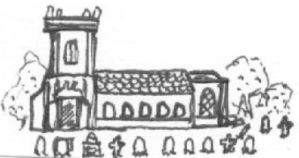
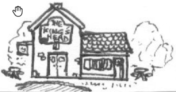

## Genius Loci
Un jeu de rôle à propos de dieux mineurs par [Grant Howitt](https://rowanrookanddecard.com/product/genius-loci/) & Chris Taylor, 2017 -
Traduit par Lucas Cimon : [chezsoi.org](https://chezsoi.org)

## Description
Vous êtes un dieu mineur, un genius loci, dans un paisible village du sud de l'Angleterre des années 60.

## Domaine
Votre domaine définit la portée de votre pouvoir.
Quand vous agissez dans votre domaine (sur des personnes, des concepts ou le bâtiment / le lieu lui-même),
lancez 2 dés et gardez le résultat plus élevé.

Vous pouvez tuer et manger un autre genius loci pour gagner ses pouvoirs.
Si vous le faites, vous gagnez accès à son domaine et supprimer toute une piste d'états.

## Peur
Quand vous êtes confrontés à votre peur, lancez 2 dés et gardez le plus petit résultat
à moins que vous ne fuyez ou capitulez.

## Qui êtes vous ?
(Lancez un D6 ou choisissez)

### Vous êtes l'esprit d'un
1. Vieux
2. Nouveau
3. Délabré
4. Énergique
5. Dangereux
6. Magnifique

 

1. Pub
2. Bureau de Poste
3. École
4. Parc
5. Épicerie
6. Église

### Vous avez peur
1. du feu
2. des étrangers
3. de vos habitants
4. du crime
5. des dieux des cours d'eaux et de la pluie
6. d'être oublié

### Vous aimez, au point d'en être dépendant
1. Les jeunes
2. Les photos
3. Le cidre
4. La musique pop
5. Les orages
6. Les animaux de proie

### Qui sont les autres ?
1. Station de police
2. Hôtel de ville
3. Caserne de pompiers
4. Cabinet de docteur
5. Mémorial de la guerre
6. Forêt

::: roll-when

( MJ, jetez un dé dans cette table 2 ou 3 fois
pour déterminer qui sont les autres dieux mineurs du village )

:::

### Que resentent les PNJs envers vous ?
1. Jalousie
2. Admiration
3. Peur
4. Pitié
5. Mépris
6. Loyauté

::: roll-when

( Faites un jet lorsque vous les rencontrez pour la 1ère fois )

:::

## Manifestation
Vous adoptez une apparence humaine personnifiant la nature du lieu auquel vous êtes lié.
Dans votre domaine vous êtes omnipotent, mais en-dehors vous êtes à peine plus puissant qu'un humain ;
vous connaissez quelques tours mais vous restez bien un dieu très mineur.

## Quand vous agissez, ou qu'on agit contre vous et que vous résistez, lancez un D6
1. Vous ratez, et cochez 2 états
2. Vous ratez, et cochez 1 état
3. Vous ratez, mais apprenez quelque chose de vital
4. Vous réusissez, mais cochez 1 état
5. Vous réusissez, mais de justesse
6. Vous réusissez particulièrement bien

::: roll-when

( Ne faites un jet que si le MJ pense qu'un échec pourrait être intéressant )

:::

## Carte du village
Si vous le souhaitez, dessinez ensemble une carte de votre village,
et donnez-lui un nom ! Placez la carte au centre de la table
et complétez-la au fil de la partie.

## Feuille de personnage :

NOM : _____________________________

ESPRIT DE : _________________________

APPARENCE : ________________________

AIME : _____________________________

PEUR : _____________________________

TROIS CHOSES INTÉRESSANTES À PROPOS DE MOI :

\__________________________________

\__________________________________

\__________________________________

## États
Si vous atteignez le niveau 3 dans 2 pistes d'état,
vous disparaissez de l'histoire ou êtes corrompus par la MENACE.

::: columns-3

1. agacé [ ]
2. furieux [ ]
3. colère noire [ ]

 

1. abîmé [ ]
2. sacagé [ ]
3. délabré [ ]

 

1. secoué [ ]
2. brisé [ ]
3. perdu [ ]

:::

::: columns-2

1. contrarié [ ]
2. terrifié [ ]
3. loque [ ]

 

1. peu apprécié [ ]
2. detesté [ ]
3. exilé [ ]

:::

::: roll-when

Quand vous vous adonnez à quelque chose que vous aimez,
retirez jusqu'à 3 états ( selon à quel point cela vous attire de ennuis,
le plus étant le mieux )

:::

## Votre village est menacé par :
<em>(D6 ou choisissez)</em>
1. Une nouvelle ligne de train, amenant avec elle des dieux de l'acier,
du bruit et de la vitesse
2. Une maison du tourisme, attirant des dieux des villes via leurs adeptes en villégiature
3. La destruction de vieilles demeures pour être remplacées par des logements de luxe
4. La jeune génération s'en allant ailleurs, laissant un village vieux et fatigué
5. Un parc d'attractions / centre thermal, attirant des dieux des jeux / de la santé
6. Une ferme intensive et son dieu fou des poulets en cage

