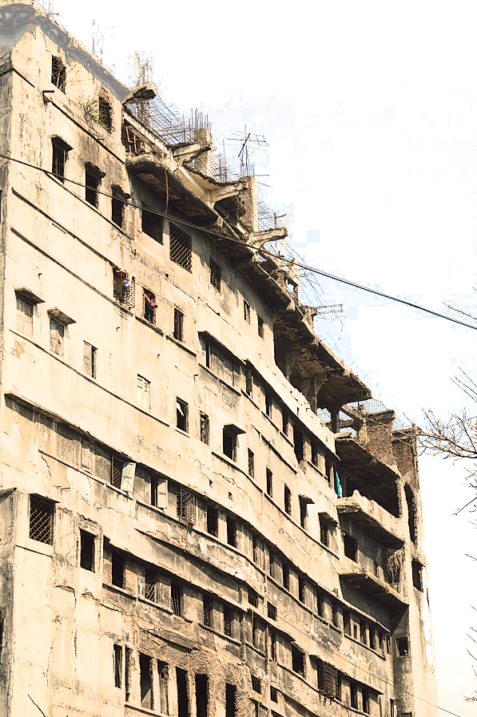
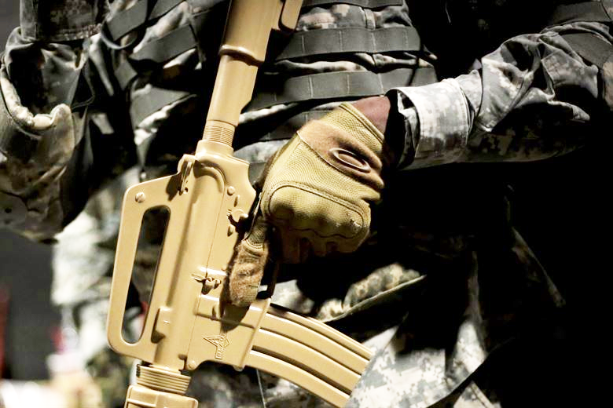

<!--
- ajouter lien vers plans encoupe d'immeubles
- ajouter mention auteur + license + ressources
- proposer sur http://troplongpaslu.fr/proposer-un-jeu-de-role-court/ 
-->
# LA TOUR
Vous venez d'arriver au sommet de La Tour, l'immeuble de plusieurs dizaines d'étages le plus mal fâmé du pays.
Vous formez une équipe d'opérations spéciales aguérie, équipée pour l'assaut et entrainée au combat urbain.
Il va maintenant vous falloir descendre les étages jusqu'au rez-de-chaussé, en accomplissant votre mission en chemin...
::::: grid
:::: grid-item
d6 | POURQUOI ÊTES-VOUS ICI ?
---|-
1  | éliminer le mystérieux occupant du dernier étage
2  | effectuer une descente sur un cartel de la drogue
3  | libérer votre chef mafieux prisonnier
4  | 
5  | 
6  | 
::::
:::: grid-item
d6 | COMMENT ÊTES-VOUS ARRIVÉ LÀ-HAUT ?
---|-
1  | en hélicoptère
2  | en parachute
3  | en rappel d'une autre tour
4  | via la nacelle d'un laveur de vitres
5  | l'ascenseur vous a monté jusqu'ici (malgré vous ?)
6  | 
::::
:::: grid-item
d6 | PJ: QUEL EST TON SECRET ?
---|-
1  | tu as un petit parachute !
2  | tu as des explosifs !
3  | ta fiancée / ton fils est prisonnier dans la tour !
4  | tu as un allié dans la tour ! De qui s'agit-il ?
5  | tu as un pouvoir psi ! Définis-le maintenant.
6  | tu es ripoux ! Quel est ton véritable objectif ?

Si ton secret comporte une question, inscrit la réponse sur ta feuille de PJ.
::::
::::grid-item
## MJ: La Tour
- #étages = **1d6** + #joueurs + 2
- dessine-la sur une feuille,
de manière à ce qu'il soit possible de placer 5 dés sur chaque étage
- lorsque les PJs arrivent dans un étage, détemine secrètement le nombre de pièces occupées:
1d6 - 1. Lance ensuite autant de d6 : chacun représente le nombre de truands par pièce.
Place ces dés sur le dessin au fure et à mesure que les PJs explorent l'étage
- si au moins un dé est égal au nombre de pièces occupées, lance un dé dans la table suivante :
d6 | MJ: QU'Y A-T-IL A CET ÉTAGE ?
---|-
1  | que des civils
2  | des bains-douches abandonnés
3  | 
4  | 
5  | 
6  | le QG des truands

::::
::::grid-item
## PJ: Tes caracs
Répartis 1 / 2 / 2 / 4 parmis :
- commander
- close combat
- furtivité
- mitrailler

Lorsque tu réalises une action risquée, fais un jet.
Le MJ commencer par déterminer la difficulté :

Difficulté de l'action      | Seuil
----------------------------|-
Peu difficile               | 2
Assez difficile             | 3
Digne d'un film de John Woo | 4

Ensuite, lance autant de **d6** que la caractéritique qui correspond à ton action.
Si aucune ne convient, lance un seul dé.
Si au moins un dé est **supérieur** à la difficulté, c'est réussi.
Si tu obtiens au moins un ⚅, c'est une réussite critique.
En combat, cela signifie que tu as été tellement rapide que tu peux immétiatement réaliser un nouveau mouvement,
avant que tes adversaires ne puissent réagir !

En cas d'échec lors d'un jet de combat, tu gagnes 1 point d'Adrénaline.
Lance un dé dans cette table :

d6 | PJ: Ouille !
---|-
1  | Tu perds ton arme
2  | 
3  | 
4  | 
5  | 
6  | 
7  | 
8  | Tu meurs

Note sur ta feuille de perso le nombre de fois où tu as utilisé cette table.
La prochaine fois, additionne ce chiffre à ton résultat avant de te reporte à cette table.
::::
::::grid-item
## PJ: Adrénaline
Lorsque ça devient chaud, et que la tension monte pour ton personnage,
demande au MJ si tu peux prendre 1 **point d'Adrénaline**.

Tu peux utiliser 1 point d'Adrénaline (ou plusieurs) après n'importe quel jet pour changer la face d'un dé d'un point.
::::
::::grid-item

## Assaut de groupe
Votre tactique éprouvée est de sécuriser le bâtiment pièce par pièce,
en appréhendant par surprise tout individu armé, le plus discrètement possible.

Lorsque vous voulez sécuriser une pièce sans vous y prendre seul,
lancez autant de **d6** que de PJs participant. **+1** dé si vous entrez simultanément par 2 accès.
La difficulté est le nombre d'ennemis dans la pièce.
En cas d'échec, ça tourne mal ! Sinon, la pièce est sécurisée.
Attention: s'il y a des ennemis dans les pièces voisines et que vous n'obtenez pas au moins un ⚅,
ils seront alertés !
::::
::::grid-item
## PJ: S.W.A.P.
À chaque fois tu changes d'étage,
choisis une capacité dans cette liste:
- élimine un ou plusieurs adversaires à travers une cloison
- intimide l'ennemi pour qu'il baisse les armes et se rende
- réalise une acroboatie à la Sam Fisher : grand écart dans un corridor,
longer une corniche d'immeuble...
- utilise un ennemi comme bouclier humain pour traverser une pièce sans crainte
- crée une diversion qui attire toutes les personnes de l'étage quelque part

Lorsque tu l'utilises, lance un **d6** : sur un ⚀ ça tourne mal !
Le Mj décrit ce qu'il se passe.
Pour toute autre valeur, c'est réussi, décrit ton action.
Si le résultat n'est pas un ⚅, tu ne peux plus utiliser cette capacité à cet étage.
::::
:::: grid-item
d6 | MJ: SURPRISE !
---|-
1  | l'accès pour descendre plus bas est bloqué
2  | toutes les lampes s'éteignent 
3  | l'objectif change d'étage
4  | des truands ligotés dans un étage déjà traversé se libèrent
5  | 
6  | plus aucune arme à feu ne fonctionne
::::
:::::

