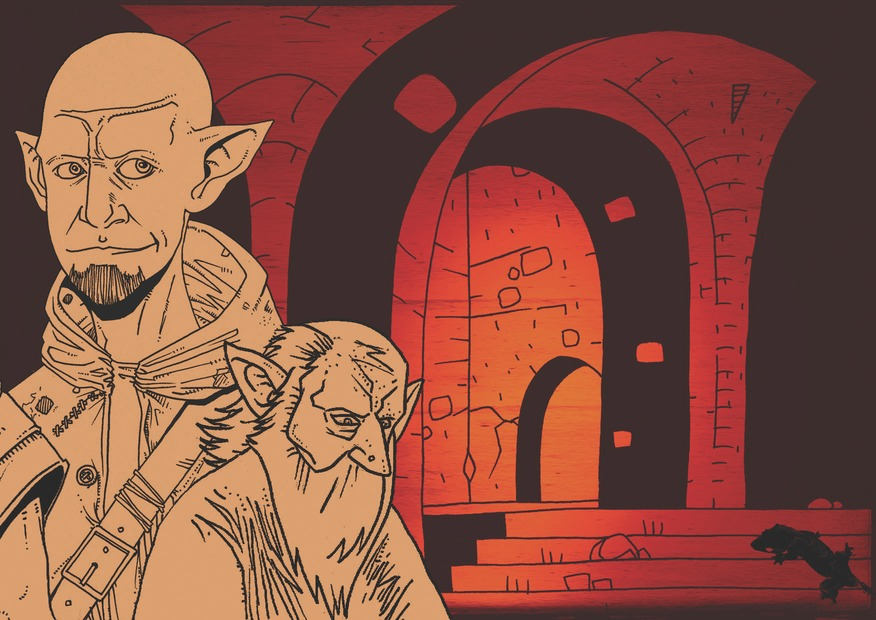
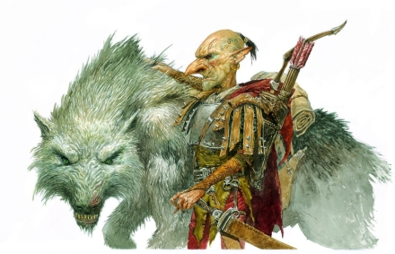

## Intro
This is the tale of a group of amnesic goblins, how they teamed up to retrieve their identities and become death gods while travelling through the multiverse.

## The 13 relics RPG
[Les 13 reliques](http://web.archive.org/web/20100528171258/http://lab00.free.fr/13reliques/home.htm) is a French tabletop RPG published as part of the [LAB01](http://www.legrog.org/jeux/lab/lab-01-fr) anthology.
It has been written & illustrated by [Yno](http://www.misterfrankenstein.com/wordpress/?page_id=2).
In this game the players characters are goblins from the Giant Library, a gigantic place and organisation gathering rare books through the multiverse.

The game is not edited anymore, but its manual and some other documents can be found there, all in PDF format and French:

- [Base manual](./L13R_LivreDeBase.pdf)
- [Game master screen](./L13R_Ecran.pdf) & and [its back](./L13R_EcranVerso.pdf)
- [Character sheet](./L13R_FeuilleDeGobelin.pdf)
- [Salamen character sheet](./L13R_Salamen.pdf)
- [Goblin calendar](./L13R_CalendrierGobelin.pdf)
- [and](./L13R_Scenar_GB2-La-nuit-porte-malheur.pdf) [three](./L13R_Scenar_GB3-Au-nom-de-lEsprit.pdf) [scenarios](./L13R_Scenar_GB4-Dis-moi-qui-tu-hantes.pdf) following the base manual one

### System home rules
- the success margin is no more a difference, it is immediately given by the sum of the dice
- a talent bonus applies to both the test difficulty and to the final success margin
- a roll that equals the test difficulty is the maximum success a character can achieve without a critical success
- heroism points are all mixed up, and 1 can be used to change ONE die face, OR re-roll both dice

## The Story

### Characters
- Ste'eve (Adam) - **Weakness**: phobia of the salted water - **Goal**: go to the moon - **Notes**: engineer skills, carry a sling
- Trogdor (Ronan) - **Weakness**: fear of dying alone - **Goal**: kill/become death - **Notes**: carry poison flasks & poisoned daggers
- Hardy (Danny) :**Weakness**: claustrophobia - **Goal**: want to be a slider / multiverse opportunist + seduce goblins - **Notes**: now has a glowing hand
- Artemis (Edel) - **Weakness**: phobia of book worms - **Goal**: learn about magic
- Tankor (Laetitia) - **Weakness**: phobia of thunder - **Goal**: want to charm animals with instruments - **Notes**: master rider & explosive expert, carry dynamite sticks
- Fluffy - Artemis' salamander

### Session 1

The five goblins wake up under a pile of books, in what looks like a big library, with no memory.
Some glowing magic light emanates from a book on the ground and is slowly dissipating. They grab it.
As they regain consciousness and investigate the place, **Hardy** starts parkour-climbing on bookshelves to get an overview of their surroundings, followed by **Ste'eve**.
They discover they are in a large room filled with huge bookcases forming a maze of narrow alleys.

Suddenly the main double door of the library opens to let enter three big ferocious dogs and a hooded floating creature.
The dogs start running in the alleys toward the goblins.
**Artemis** uses her bow to throw an arrow tied to a rope to the top of a bookcase nearby.
There, **Hardy** firmly attach its extremity so that the remaining goblins use it to escape the dogs and get above the bookcases.

There, they notice another rope hanging from a hole in the ceiling, and guess that they came in this library using it.
**Hardy** successfully jumps on it and reaches the attic above.
In the meantime, **Tankor** pushes a bookcase so that if falls on a dog down in the library alley.

As **Hardy** hesitates as to whether swing the rope to the other goblins or not,
the hooded creature whisper some words in a dark dialect and suddenly the bookcases start moving.
They slowly move aside along the walls of the library, with four goblins still on top of one of them,
and the floating wizard come in their direction.

As they are now standing near a stained glass window, the goblins attempt to break it, unsuccessfully.
Panicking as the dark wizard is coming on them, they jump on the rope to the ceiling finally handed over by **Hardy**.
They run through the attic, freaking out as the moon reveal menacing plate armours laying there, and waking up sleeping bats.

**Hardy** decides to reach the door on one end of the room while the four other goblins help each other to reach a dormer and escape through the roof.
They end up sliding in the gutter to reach the manor garden muddy ground.
In the attic, some ice starts to propagate magically from the hole in the floor towards **Hardy**, freezing everything on its way.

**Hardy** finally reaches the door, and hurtles down the spiraling stairs.
He goes down to the ground level where he ends up in a corridor hall with five doors.
As he discovers a vast reception hall behind the first door, he feels his right leg and forearm turning into ice.
The last thing he sees before passing out as he turns over is the frowning face of a dark skinned elf.

During this time, outside, the four goblins explore the mansion surroundings.
The small castle stands along a steep cliff while the rest of the large garden is delimited by a high wall.
**Tankor** & **Trogdor** decide to get back inside to save **Hardy**.

The manor front door opens smoothly, revealing a corridor hall with five doors.
As **Tankor** steals the axe of one of the statues there, this activates a secret passage behind it.
Both goblins follow a narrow tunnel that leads them to an alchemist laboratory, where **Hardy** is hanging asleep, chained above above a big cauldron.

In the meantime **Artmesis** discovers in the bushes along the outer wall a small salamander that seems to recognize her.
**Ste'eve** names it **Fluffy**.

After raiding the laboratory for potions, **Tragdor** & **Tankor** free the poor iced **Hardy** from its chain, but it falls in the cauldron by mistake.
From now on a fluorescent light is emanating from his hand.
They then carry iced-**Hardy** out of the place in a hurry, joining **Ste'eve** and **Artemis** outside.

**Tankor** then blows up a part of the outer wall with a stick of dynamite, opening the way for all of them.
They all run to the mountains nearby, and no one seems to follow them.
They establish a camp hidden by bushes, and put **Hardy** under a waterfall so the ice could melt.

As they rest, they try to recall what happened before.
With the help of a map found in **Artemis** bag, some of the goblins remember some blurry memories of a mill through which they passed.
They climb up the mountain and spot a town in the valley below, and two mills on the path to that village.
They decide to go there and visit the mills on their way.

In the first mill, they meet an old goblin named Siltamen who recognizes the goblins and explains to them a few things:
they are young agents of the Giant Library, sent there to retrieve this precious Memory-erasing book.
They also learn the drow elf name: Baron Gustav.

Siltamen advise the goblins to go back make their report to the elder goblins of the Giant Library.
They walk through a door opening on a totally black space, and the next moment they are seating in a small alcove and opening their eyes,
a book open on the knees of **Ste'eve** : "The blue feather".

They exit the alcove and start wandering around. They discover the splendor of labyrinthine Giant Library,
its Escher-like stairs and never-ending bookshelves.

They finally find their way to Nermin, one of the elder goblins, to who they tell their story.
He seems both sympathetic to their fate and concerned about that book. The goblins pretend they don't have it.
Nermin finally dismisses them, explaining he now has to refer to the other elder goblins.

The five goblins get back to their living quarters, meeting old acquaintances they don't remember no more.
On their spare time, they collect some books: **Hardy** on world travelling, **Ste'eve** on the moon, **Artemis** on magic.
Soon, they learn that access to "The blue feather" book-universe has been rendered impossible and that Siltamen cannot be contacted anymore.
The Giant Library goblins seem to be fearing something happened to the little library there.

Two goblin henchmen come to request **Artemis** presence, and bring her to an elder goblin, Nemesti.
In his library office, he intensely interrogates **Artemis** again, and suggests to use magic to make here remember forgotten memories.
Despite her refusal, he tries to read her mind. **Artemis** escapes the two henchmen and starts being chased by them in the alleys of the Giant Library.

The chase takes gigantic proportions as her four amnesic goblin friends help her outrunning her pursuers,
but soon almost all the Giant Library goblins are chasing them !

They end up being surrounded on a central crossroad square, and have to fight to defend themselves.
**Hardy** makes himself an enemy in kicking down one of their chasers, as well as **Artemis** & **Tankor** with a big goblin named Brogda.
As all seems lost, they decide to protect their ears and read out aloud the Memory-erasing book while writing down some last notes to remember what happened this time.

### Session 2
The five goblins agree to give back the book and be kept in a cage to calm down spirits in the Giant Library.
Moreover, a rescue expedition for Siltamen has to be prepared as soon as possible. Nermin promises to meet them later during the day.

The cage they are in is hanging 2 meters from the ceiling, in large library room 10m high. It is made of enchanted book covers.
Out of claustrophobia, **Hardy** smashes the closest wall and creates a hole in it !
Him & **Tragdor** climb down on to the ground on the book shelves to retrieve the goblins equipment.

**Tragdor** then go onto a stealth mission through the cleaners tunnels to retrieve some cleaners uniforms, chloroforming an already sleeping cleaner on his way.
In the meantime, Ste'eve builds up a mannequin looking almost like **Tragdor**, and **Hardy** & **Tankor** translate & study a very rare book they found on animals charming.

**Tragdor** comes back just as Nermin arrives with a group of other elder goblins including Nemesti, and he cannot get back into the cage in time.
Nermin ask them if they got their memories back.
**Tankor** tries to pretend he does, but when Nermin ask why they read the Memory-erasing book, the other goblins silence him.
Nermin makes them all promise they won't cause anymore that much trouble to the Giant Library, nor that they will interfere with the expedition.
As the 5 goblins finally refuse to leave the cage - by fear the elder goblins discover Tragdor mannequin - Nermin winks at them while saying good bye.

First of all, the goblins decide to go an rescue Fluffy, their Salamen.
They crawl through the cleaners tunnels to the Salamen barn level.
There, **Hardy** successfully pretends to be sent by Nermin to recover Fluffy, and seduces Clarissa, a Salamen caretaker.

Now all assembled, the team decides of their new goal: help **Tragdor** to become a death god so they can confront Baron Gustav again.

They head up to the index room to find a list of known death gods. On their way they are recognized by Brogda who follows them with 3 other goblins.

To get rid of them, the team makes a smoke bomb and launch it in the crowd in the big hallway where the expedition is actually prepared.
The cowceratops resting there and the crowd start to panic. **Hardy** and **Ste'eve** try to keep the cowceratops grounded using ropes.

**Artemis** looks for a no-gravity spell in her magic book, finds one she actually remembers and successfully launch it.
Everyone in a 5m bubble is floating for a moment, but then she pushes on her feet and flies into the air,
the no-gravity bubble following her and making all the books around levitate.

**Tragdor** uses this diversion to get to the index room. The others follow.

They find a few death gods listed in the index, including:
- Hades, from "Space Odyssey", a sci-fi universe where there are actual omnipotent techno gods, nanomachine based magic & space travelling squids
- Zaraphim, from "The red sword", dragon of death
- Pluto, from "The last dawn", god of death & the oceans in a post-apocalyptic world populated by orks

They found some story elements about that "The red sword" book-universe: it is a prequel to "The blue feather" from the same author Van Busiek; it depicts a war between the _Alliance_ of dwarves-elf-humans-halflings against trolls-orks-demons; a small group of adventurers has to destroy a powerful mystical artefact, lead by Fradgo a halfling from Silvertown who found the blue feather by chance while trying to steal Zeraphim - the death dragon - gold; evil forces drow general finally vanquished but not killed.

As they are leaving, they face a goblin warrior and 6 of his men at the index room door. **Tankor** refuses to talk, closes and blocks the door. The goblin warrior makes it disappear with a glyph in its hand, and his men quickly incapacitate the team, except **Tankor** who runs away.

The goblin warrior leader waves his hand again and a big white wolf materialize above **Tankor**. By whistling, he manages to tame it, then successfully fight two goblin warriors - with a table & against a net. In the meantime **Tragdor** poison is opponent and himself; **Artemis** launches **Fluffy** & her itching paws at the goblin warriors; **Ste'eve** frees one of his hands and uses his sling on **Artemis** opponent.

Finally **Artemis** throws an arrow at the warrior leader throat and the remaining warriors flee.
They all gather together and enter "The red sword" book universe.

## Secrets
### Notes on travelling trough book-universes
- Only some specific books allow to travel to other universes.
Sometime many books can lead to a same universe, and some universes (e.g. written by the same author) can have passages between each others
- When book-travelling, readers appear to fall asleep for a few minutes, but time pass much faster in the book universe.
- However, time is always going in one direction in every universe, forbidding time paradoxes.
E.g. when a traveller goes back to a given book universe, some time will have passed there since his last visit
- A traveller always enter and exit a book-universe through a door.
- If a traveller health or possessions change during its journey, the same change will magically be reflected on its body once he wake up
- A lone traveller can just read a book silently. For a group of travellers, it must be read out aloud.

### Back story & future plots
- Once you got memory-erased, you're now IMMUNUNE to the book
- There is no more a lone evil drow in "The red sword" world but 2 twins !
- People in Silvertown are very afraid of both Zeraphim (that nobody ever saw) and the evil drow twins that recently raided Silvertown just to kill a halfling named Fragdo in his sleep
- They end up meeting non-Giant-Library goblins, then access Zaraphim caves by the sea (beware of the tides depending on the moon)
- Zaraphim ends up beeing a very small and peureux dragon
- Astur is the name of the sneaky goblin that wants to settle scores with Hardy
- _(metaplot)_ Who's written the Giant Library universe-book ?

